# API参考

<cite>
**本文档引用的文件**
- [@types/iframe/exported.sillytavern.d.ts](file://@types/iframe/exported.sillytavern.d.ts)
- [@types/iframe/event.d.ts](file://@types/iframe/event.d.ts)
- [@types/iframe/exported.mvu.d.ts](file://@types/iframe/exported.mvu.d.ts)
- [@types/iframe/exported.tavernhelper.d.ts](file://@types/iframe/exported.tavernhelper.d.ts)
- [@types/function/index.d.ts](file://@types/function/index.d.ts)
- [@types/function/util.d.ts](file://@types/function/util.d.ts)
- [@types/function/version.d.ts](file://@types/function/version.d.ts)
- [util/streaming.ts](file://util/streaming.ts)
- [util/mvu.ts](file://util/mvu.ts)
- [参考脚本示例/slash_command.txt](file://参考脚本示例/slash_command.txt)
- [参考脚本示例/SillyTavern_Macros.txt](file://参考脚本示例/SillyTavern_Macros.txt)
</cite>

## 目录
1. [简介](#简介)
2. [项目结构](#项目结构)
3. [核心组件](#核心组件)
4. [架构概览](#架构概览)
5. [详细组件分析](#详细组件分析)
6. [依赖关系分析](#依赖关系分析)
7. [性能考虑](#性能考虑)
8. [故障排除指南](#故障排除指南)
9. [结论](#结论)

## 简介

酒馆助手模板是一个为SillyTavern聊天机器人平台设计的综合开发框架，提供了丰富的API接口和类型定义，支持开发者构建复杂的聊天应用。该模板涵盖了SillyTavern API接口、MVU数据接口、流式消息接口和自定义扩展接口等多个方面。

本项目的核心目标是为开发者提供一个完整的API参考文档，详细说明各种接口和类型定义，包括参数、返回值、使用场景和注意事项。文档将涵盖以下主要接口：

- SillyTavern API接口：提供与SillyTavern平台交互的核心功能
- MVU数据接口：支持变量管理和状态更新
- 流式消息接口：处理实时消息流和动态界面渲染
- 自定义扩展接口：扩展平台功能的接口集合

## 项目结构

该项目采用模块化的文件组织结构，主要包含以下目录和文件：

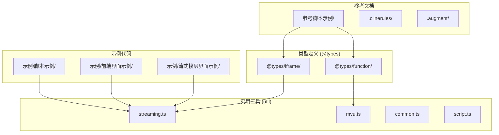

**图表来源**
- [@types/iframe/exported.sillytavern.d.ts:1-698](file://@types/iframe/exported.sillytavern.d.ts#L1-L698)
- [@types/function/index.d.ts:1-170](file://@types/function/index.d.ts#L1-L170)

**章节来源**
- [@types/iframe/exported.sillytavern.d.ts:1-698](file://@types/iframe/exported.sillytavern.d.ts#L1-L698)
- [@types/function/index.d.ts:1-170](file://@types/function/index.d.ts#L1-L170)

## 核心组件

### SillyTavern API接口

SillyTavern API提供了与SillyTavern平台交互的核心功能，包括聊天管理、角色操作、消息处理等。

#### 主要接口类型

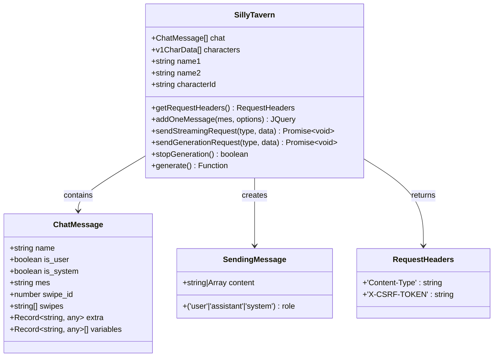

**图表来源**
- [@types/iframe/exported.sillytavern.d.ts:3-37](file://@types/iframe/exported.sillytavern.d.ts#L3-L37)

#### 关键API方法

| 方法名 | 参数 | 返回值 | 描述 |
|--------|------|--------|------|
| `addOneMessage` | `mes: ChatMessage, options?: AddMessageOptions` | `JQuery<HTMLElement>` | 添加单条消息到聊天记录 |
| `sendStreamingRequest` | `type: string, data: object` | `Promise<void>` | 发送流式请求 |
| `sendGenerationRequest` | `type: string, data: object` | `Promise<void>` | 发送生成请求 |
| `stopGeneration` | 无 | `boolean` | 停止当前生成过程 |
| `getTokenCountAsync` | `string: string, padding?: number` | `Promise<number>` | 异步获取token数量 |

**章节来源**
- [@types/iframe/exported.sillytavern.d.ts:382-698](file://@types/iframe/exported.sillytavern.d.ts#L382-L698)

### MVU数据接口

MVU（Model-View-Update）变量框架提供了强大的变量管理和状态更新功能。

#### 数据结构定义

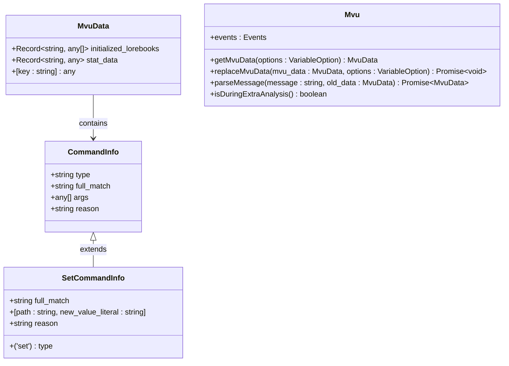

**图表来源**
- [@types/iframe/exported.mvu.d.ts:1-47](file://@types/iframe/exported.mvu.d.ts#L1-L47)

#### 事件系统

| 事件类型 | 触发时机 | 参数 | 描述 |
|----------|----------|------|------|
| `VARIABLE_INITIALIZED` | 新聊天变量初始化 | `variables: MvuData, swipe_id: number` | 变量初始化完成 |
| `COMMAND_PARSED` | 命令解析完成 | `variables: MvuData, commands: Mvu.CommandInfo[], message_content: string` | 命令解析完成 |
| `VARIABLE_UPDATE_ENDED` | 变量更新结束 | `variables: MvuData, variables_before_update: MvuData` | 变量更新完成 |
| `BEFORE_MESSAGE_UPDATE` | 消息更新前 | `context: { variables: MvuData; message_content: string }` | 消息即将更新 |

**章节来源**
- [@types/iframe/exported.mvu.d.ts:54-190](file://@types/iframe/exported.mvu.d.ts#L54-L190)

### 流式消息接口

流式消息接口支持实时消息流处理和动态界面渲染。

#### 核心类型定义

```mermaid
classDiagram
class StreamingMessageContext {
+string prefix
+string host_id
+number message_id
+string message
+boolean during_streaming
}
class MountOptions {
+'iframe'|'div' host
+(message_id : number, message : string) => boolean filter
+string prefix
}
class StreamingUtil {
+injectStreamingMessageContext() StreamingMessageContext
+mountStreamingMessages(creator : () => App, options : MountOptions) { unmount : () => void }
}
StreamingUtil --> StreamingMessageContext : returns
```

**图表来源**
- [util/streaming.ts:5-19](file://util/streaming.ts#L5-L19)

#### 流式渲染流程

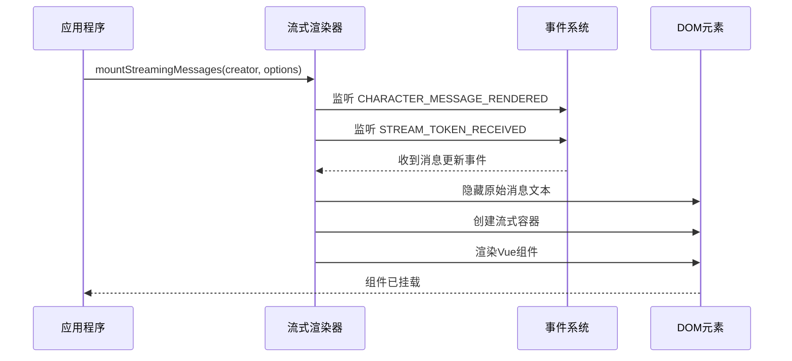

**图表来源**
- [util/streaming.ts:41-238](file://util/streaming.ts#L41-L238)

**章节来源**
- [util/streaming.ts:1-238](file://util/streaming.ts#L1-L238)

### 自定义扩展接口

自定义扩展接口提供了丰富的扩展功能，包括音频管理、角色操作、消息处理等。

#### 功能分类

| 功能类别 | 接口数量 | 主要用途 |
|----------|----------|----------|
| 音频管理 | 7个 | 音频播放、暂停、列表管理 |
| 角色操作 | 8个 | 角色创建、删除、更新 |
| 消息处理 | 6个 | 消息获取、设置、旋转 |
| 世界书管理 | 15个 | 世界书创建、删除、更新 |
| 预设管理 | 11个 | 预设创建、删除、更新 |
| 变量管理 | 5个 | 变量获取、设置、更新 |

**章节来源**
- [@types/function/index.d.ts:1-170](file://@types/function/index.d.ts#L1-L170)

## 架构概览

### 整体架构设计

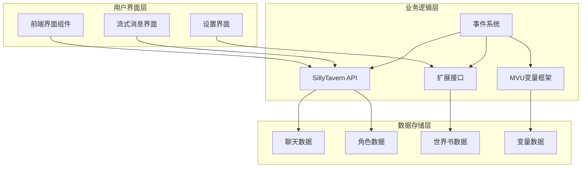

### 数据流图

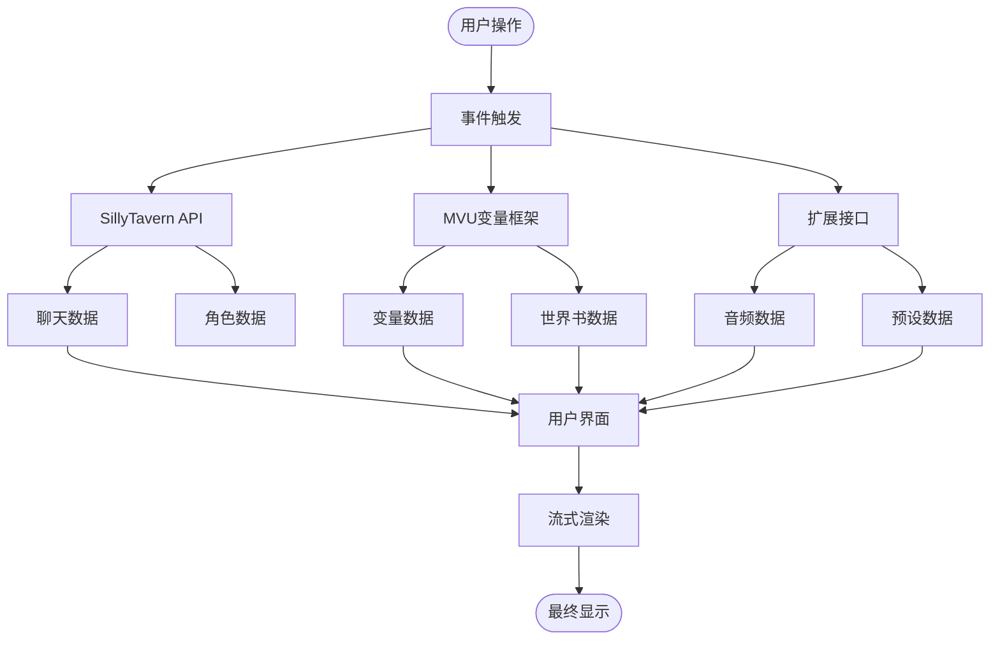

**图表来源**
- [@types/iframe/exported.sillytavern.d.ts:382-698](file://@types/iframe/exported.sillytavern.d.ts#L382-L698)
- [@types/iframe/exported.mvu.d.ts:54-190](file://@types/iframe/exported.mvu.d.ts#L54-L190)
- [@types/function/index.d.ts:1-170](file://@types/function/index.d.ts#L1-L170)

## 详细组件分析

### SillyTavern API详细分析

#### 聊天消息数据结构

SillyTavern API提供了完整的聊天消息数据结构，支持多种消息类型和属性。

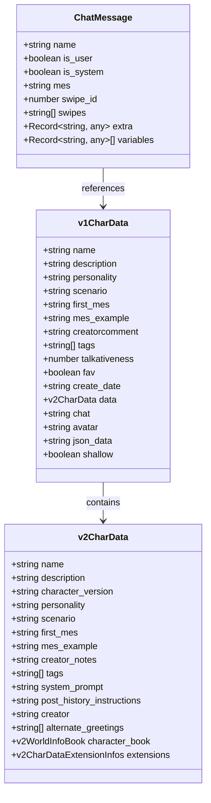

**图表来源**
- [@types/iframe/exported.sillytavern.d.ts:3-146](file://@types/iframe/exported.sillytavern.d.ts#L3-L146)

#### 请求头管理

SillyTavern API提供了统一的请求头管理机制，确保API调用的安全性和正确性。

| 头部字段 | 类型 | 描述 | 使用场景 |
|----------|------|------|----------|
| `Content-Type` | `string` | 请求内容类型 | 所有API请求 |
| `X-CSRF-TOKEN` | `string` | CSRF防护令牌 | 需要认证的请求 |

**章节来源**
- [@types/iframe/exported.sillytavern.d.ts:394-397](file://@types/iframe/exported.sillytavern.d.ts#L394-L397)

### MVU变量框架详细分析

#### 变量存储管理

MVU变量框架提供了强大的变量存储和管理功能，支持多种变量类型和操作。

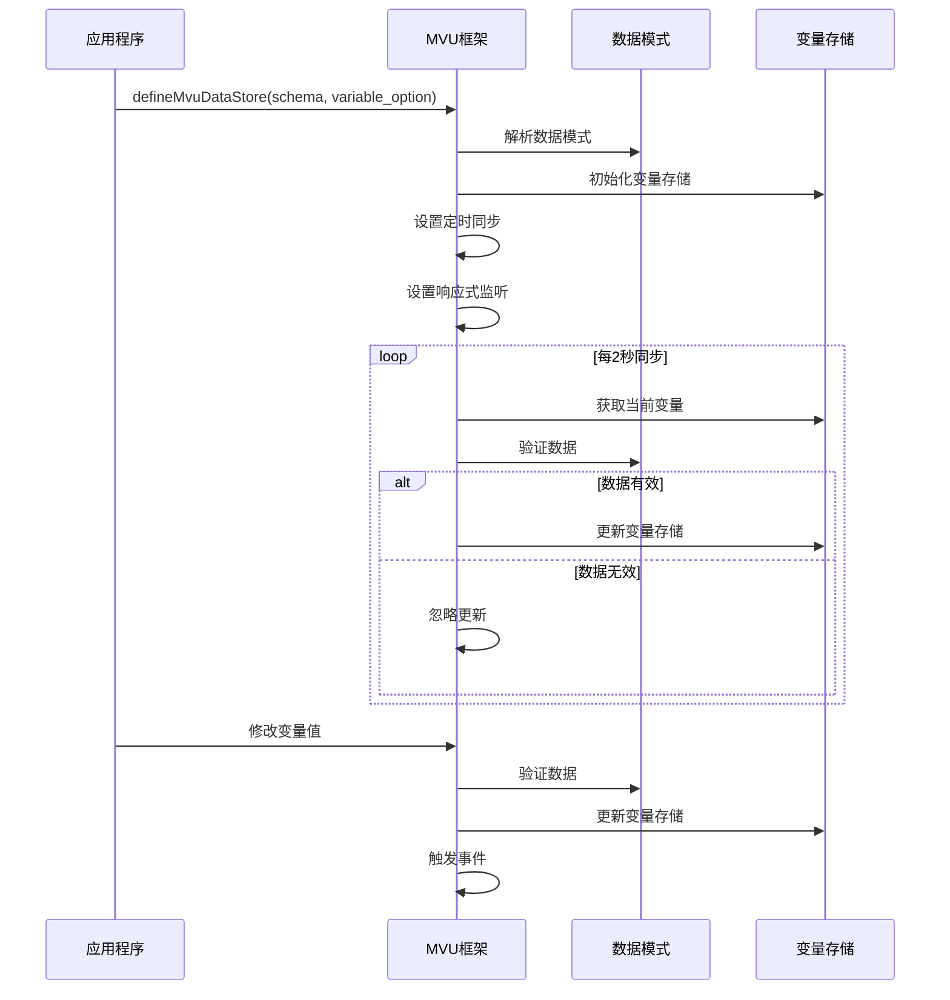

**图表来源**
- [util/mvu.ts:3-66](file://util/mvu.ts#L3-L66)

#### 命令处理系统

MVU框架支持多种命令类型，每种命令都有特定的语法和用途。

| 命令类型 | 语法 | 参数说明 | 使用场景 |
|----------|------|----------|----------|
| `set` | `_.set(path, newValue)` | `path: string, newValue: any` | 设置变量值 |
| `insert` | `_.insert(path, value)` | `path: string, value: any` | 插入数组元素 |
| `delete` | `_.delete(path)` | `path: string` | 删除变量或元素 |
| `add` | `_.add(path, delta)` | `path: string, delta: number` | 数值增加 |
| `move` | `_.move(from, to)` | `from: string, to: string` | 移动变量位置 |

**章节来源**
- [@types/iframe/exported.mvu.d.ts:12-47](file://@types/iframe/exported.mvu.d.ts#L12-L47)

### 流式消息系统详细分析

#### 消息渲染流程

流式消息系统提供了高效的实时消息渲染能力，支持多种宿主环境。

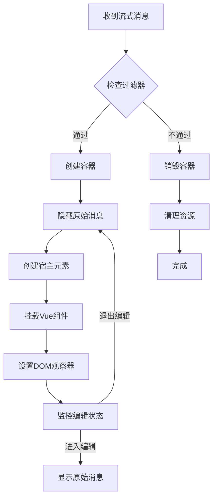

**图表来源**
- [util/streaming.ts:63-162](file://util/streaming.ts#L63-L162)

#### 宿主环境选择

| 宿主类型 | 特点 | 适用场景 | 样式影响 |
|----------|------|----------|----------|
| `iframe` | 样式隔离 | 复杂界面、独立样式 | 与原生界面隔离 |
| `div` | 样式继承 | 简单界面、统一样式 | 继承原生样式 |

**章节来源**
- [util/streaming.ts:22-32](file://util/streaming.ts#L22-L32)

### 扩展接口详细分析

#### 音频管理接口

扩展接口提供了完整的音频管理系统，支持多种音频操作。

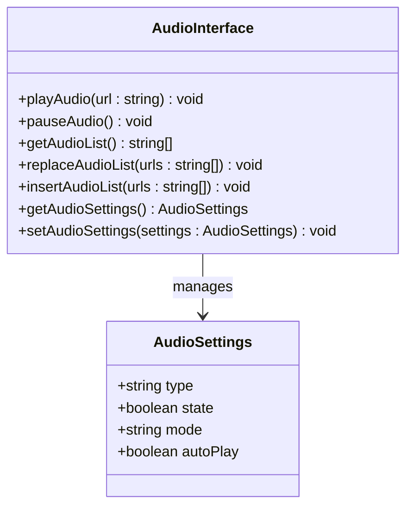

**图表来源**
- [@types/function/index.d.ts:7-15](file://@types/function/index.d.ts#L7-L15)

#### 角色管理接口

角色管理接口提供了完整的角色生命周期管理功能。

| 接口方法 | 参数 | 返回值 | 描述 |
|----------|------|--------|------|
| `getCharacterNames` | 无 | `string[]` | 获取所有角色名称 |
| `createCharacter` | `characterData: any` | `Promise<void>` | 创建新角色 |
| `replaceCharacter` | `characterData: any` | `Promise<void>` | 替换现有角色 |
| `deleteCharacter` | `characterName: string` | `Promise<void>` | 删除角色 |
| `getCharacter` | `characterName: string` | `Promise<any>` | 获取角色信息 |

**章节来源**
- [@types/function/index.d.ts:19-27](file://@types/function/index.d.ts#L19-L27)

## 依赖关系分析

### 模块依赖图

```mermaid
graph TB
subgraph "核心模块"
A[@types/iframe/exported.sillytavern.d.ts]
B[@types/iframe/exported.mvu.d.ts]
C[@types/function/index.d.ts]
end
subgraph "工具模块"
D[util/streaming.ts]
E[util/mvu.ts]
F[util/common.ts]
end
subgraph "事件系统"
G[@types/iframe/event.d.ts]
end
subgraph "示例模块"
H[示例/脚本示例/]
I[示例/前端界面示例/]
J[示例/流式楼层界面示例/]
end
A --> G
B --> G
C --> G
D --> A
D --> G
E --> B
E --> G
H --> D
I --> D
J --> D
```

**图表来源**
- [@types/iframe/exported.sillytavern.d.ts:1-698](file://@types/iframe/exported.sillytavern.d.ts#L1-L698)
- [@types/iframe/exported.mvu.d.ts:1-190](file://@types/iframe/exported.mvu.d.ts#L1-L190)
- [@types/function/index.d.ts:1-170](file://@types/function/index.d.ts#L1-L170)
- [util/streaming.ts:1-238](file://util/streaming.ts#L1-L238)
- [util/mvu.ts:1-66](file://util/mvu.ts#L1-L66)

### 事件依赖关系

事件系统在整个架构中起到关键的解耦作用，各模块通过事件进行通信。

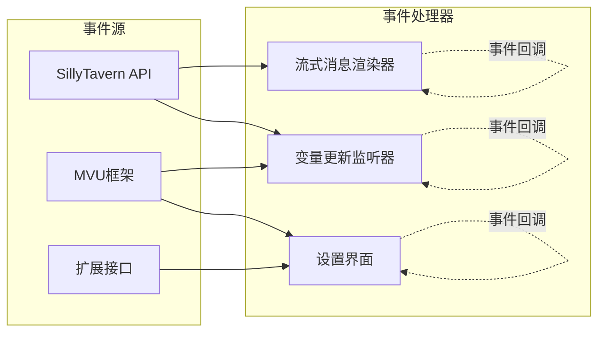

**图表来源**
- [@types/iframe/event.d.ts:1-522](file://@types/iframe/event.d.ts#L1-L522)

**章节来源**
- [@types/iframe/event.d.ts:1-522](file://@types/iframe/event.d.ts#L1-L522)

## 性能考虑

### 内存管理

1. **事件监听器管理**
   - 自动清理机制：事件监听器在组件卸载时自动清理
   - 手动清理：提供`eventRemoveListener`和`eventClearAll`方法
   - 内存泄漏预防：避免循环引用和未清理的监听器

2. **DOM操作优化**
   - 流式消息使用虚拟DOM减少直接DOM操作
   - 宿主元素复用机制避免频繁创建销毁
   - MutationObserver优化监听性能

3. **数据同步策略**
   - 2秒间隔的定时同步避免过度更新
   - 响应式更新只在数据变化时触发
   - 批量更新减少重绘次数

### 并发处理

1. **异步操作管理**
   - Promise链式调用确保操作顺序
   - 错误捕获机制防止异常传播
   - 超时控制避免长时间阻塞

2. **流式处理优化**
   - 分段渲染减少单次渲染压力
   - 缓冲区管理控制内存使用
   - 异步渲染避免界面卡顿

### 缓存策略

1. **数据缓存**
   - 变量数据本地缓存
   - 组件实例缓存
   - 配置数据持久化

2. **渲染缓存**
   - Vue组件缓存
   - 样式缓存
   - 图片资源缓存

## 故障排除指南

### 常见问题及解决方案

#### 1. 事件监听失效

**问题症状**：事件监听器无法正常工作

**可能原因**：
- 监听器未正确注册
- 组件提前卸载
- 事件类型错误

**解决方案**：
```javascript
// 正确的事件监听注册
const stopListener = eventOn('自定义事件', handler);

// 确保监听器在组件卸载时正确清理
window.addEventListener('beforeunload', () => {
    stopListener.stop();
});

// 使用事件清理工具
eventClearEvent('自定义事件');
```

#### 2. MVU变量更新失败

**问题症状**：变量更新后没有反映到界面

**可能原因**：
- 数据验证失败
- 响应式系统未检测到变化
- 更新时机不当

**解决方案**：
```javascript
// 使用正确的更新方法
Mvu.replaceMvuData(newData, {
    type: 'message',
    message_id: 'latest'
});

// 监听变量变化
eventOn(Mvu.events.VARIABLE_UPDATE_ENDED, (variables) => {
    console.log('变量更新完成:', variables);
});
```

#### 3. 流式消息渲染异常

**问题症状**：流式消息显示异常或不更新

**可能原因**：
- DOM元素查找失败
- 样式冲突
- 事件处理错误

**解决方案**：
```javascript
// 检查DOM元素是否存在
const messageElement = $(`.mes[mesid='${message_id}']`);
if (messageElement.length === 0) {
    console.warn('消息元素不存在:', message_id);
    return;
}

// 确保样式正确应用
$mes_streaming.css({
    'font-weight': '500',
    'line-height': 'calc(var(--mainFontSize) + .5rem)'
});
```

#### 4. API调用失败

**问题症状**：SillyTavern API调用返回错误

**可能原因**：
- 请求头缺失
- CSRF令牌过期
- 网络连接问题

**解决方案**：
```javascript
// 获取正确的请求头
const headers = SillyTavern.getRequestHeaders();

// 检查CSRF令牌
if (!headers['X-CSRF-TOKEN']) {
    console.error('CSRF令牌缺失');
    return;
}

// 重新获取令牌
try {
    await SillyTavern.saveSettingsDebounced();
    const newHeaders = SillyTavern.getRequestHeaders();
} catch (error) {
    console.error('获取请求头失败:', error);
}
```

### 调试技巧

1. **浏览器开发者工具**
   - 使用Console面板检查API调用
   - Network面板监控网络请求
   - Elements面板检查DOM结构

2. **日志记录**
   ```javascript
   // 添加详细的日志
   console.log('事件触发:', eventType, data);
   console.log('组件状态:', this.state);
   ```

3. **断点调试**
   - 在关键API调用处设置断点
   - 监控变量变化
   - 检查异步操作状态

**章节来源**
- [@types/iframe/event.d.ts:1-522](file://@types/iframe/event.d.ts#L1-L522)
- [@types/function/util.d.ts:1-44](file://@types/function/util.d.ts#L1-L44)

## 结论

酒馆助手模板提供了一个完整而强大的API生态系统，涵盖了现代聊天应用开发的各个方面。通过精心设计的类型定义、清晰的接口规范和完善的错误处理机制，该模板为开发者提供了可靠的开发基础。

### 主要优势

1. **完整的类型安全**：所有API都提供了详细的TypeScript类型定义
2. **灵活的扩展机制**：支持多种扩展接口和自定义功能
3. **高效的性能表现**：优化的渲染和数据同步机制
4. **完善的错误处理**：全面的错误捕获和恢复机制
5. **丰富的示例代码**：提供大量实际使用示例

### 最佳实践建议

1. **事件管理**：始终正确管理事件监听器的生命周期
2. **数据验证**：在更新数据前进行充分的验证
3. **性能优化**：合理使用缓存和异步处理
4. **错误处理**：实现全面的错误捕获和用户反馈
5. **代码组织**：遵循模块化和组件化的开发原则

该API参考文档为开发者提供了全面的技术参考资料，建议在实际开发中结合具体的使用场景和需求进行深入理解和应用。