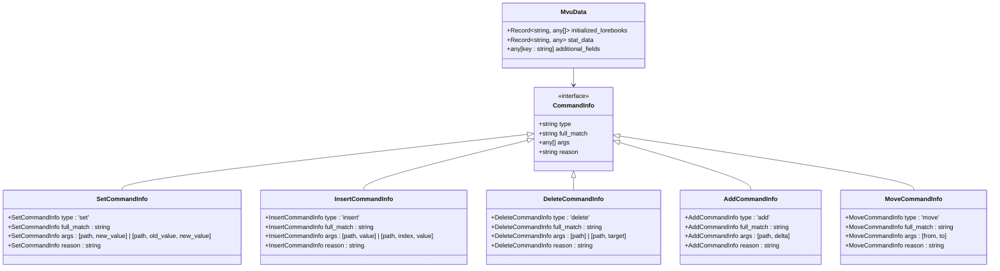
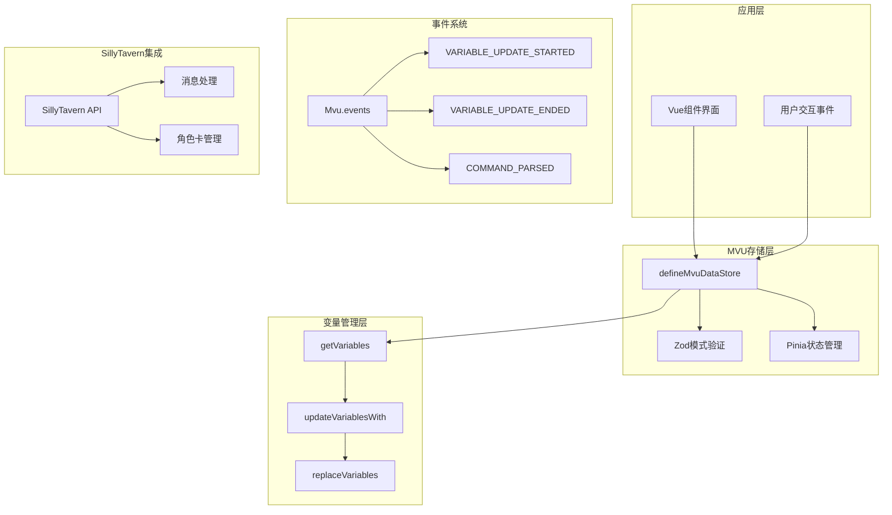
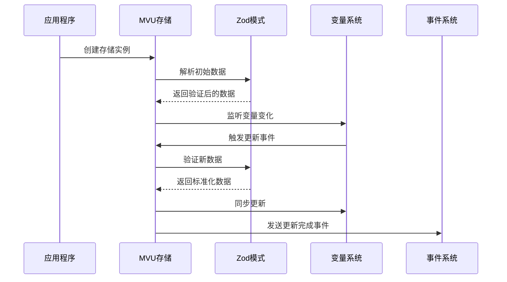
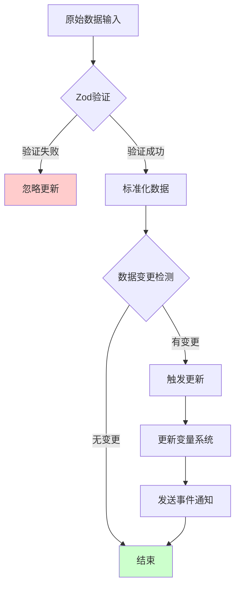
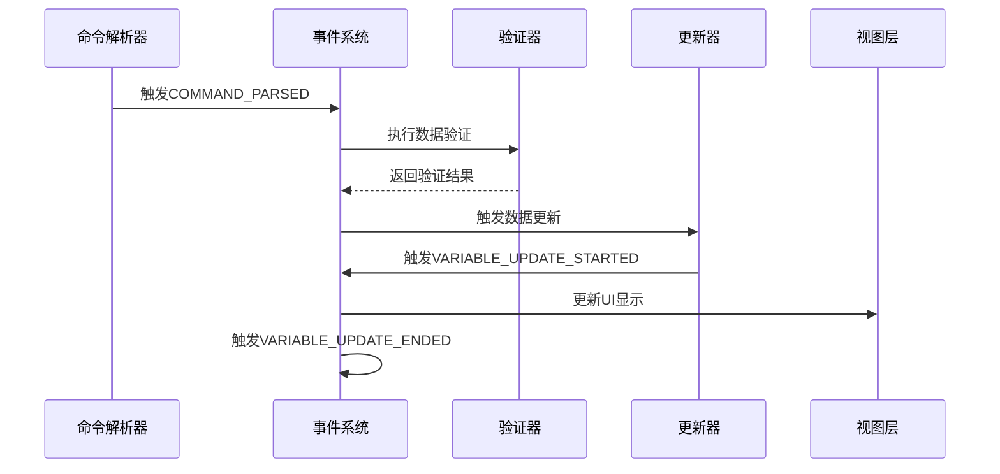
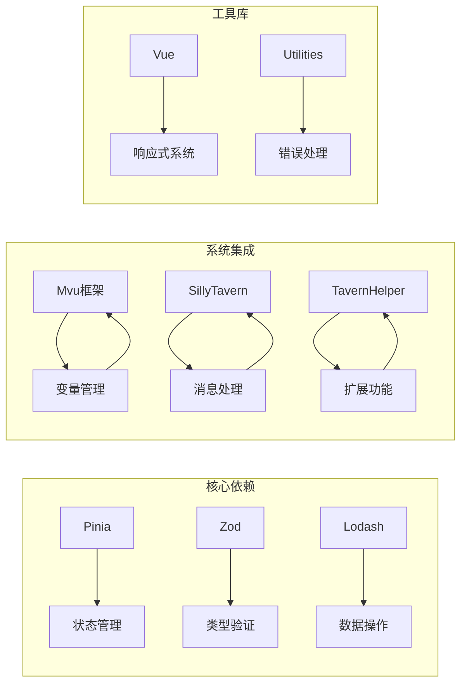
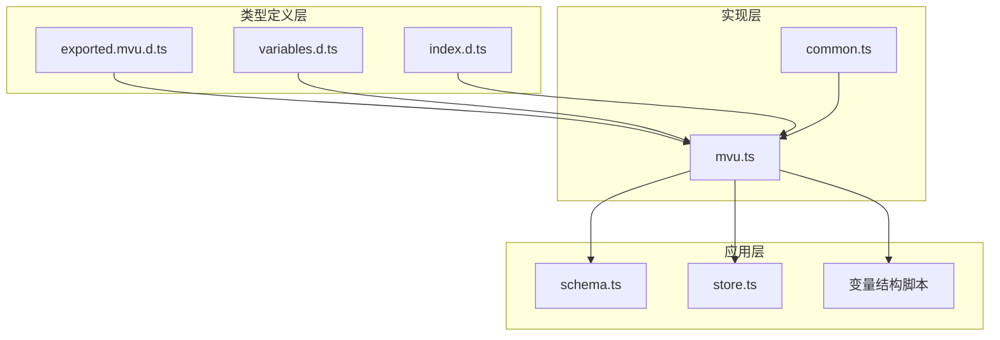

# MVU数据接口

<cite>
**本文档引用的文件**
- [@types/iframe/exported.mvu.d.ts](file://@types/iframe/exported.mvu.d.ts)
- [util/mvu.ts](file://util/mvu.ts)
- [示例/角色卡示例/schema.ts](file://示例/角色卡示例/schema.ts)
- [示例/角色卡示例/界面/状态栏/store.ts](file://示例/角色卡示例/界面/状态栏/store.ts)
- [@types/function/variables.d.ts](file://@types/function/variables.d.ts)
- [@types/function/index.d.ts](file://@types/function/index.d.ts)
- [示例/角色卡示例/脚本/变量结构/index.ts](file://示例/角色卡示例/脚本/变量结构/index.ts)
- [util/common.ts](file://util/common.ts)
- [@types/iframe/exported.sillytavern.d.ts](file://@types/iframe/exported.sillytavern.d.ts)
</cite>

## 目录
1. [简介](#简介)
2. [项目结构](#项目结构)
3. [核心组件](#核心组件)
4. [架构概览](#架构概览)
5. [详细组件分析](#详细组件分析)
6. [依赖关系分析](#依赖关系分析)
7. [性能考虑](#性能考虑)
8. [故障排除指南](#故障排除指南)
9. [结论](#结论)

## 简介

MVU（Model-View-Update）数据接口是基于酒馆助手（SillyTavern Helper）开发的一套数据管理API，专门用于处理角色卡和消息楼层的状态数据。该系统采用MVU架构模式，通过类型安全的数据模型、自动化的状态同步和事件驱动的更新机制，为开发者提供了一个强大而灵活的数据管理解决方案。

MVU架构的核心特点包括：
- **类型安全**：使用Zod模式验证确保数据完整性
- **自动同步**：双向数据同步机制
- **事件驱动**：基于事件的更新流程
- **模块化设计**：可扩展的组件架构

## 项目结构

该项目采用模块化组织方式，主要包含以下核心目录：

```mermaid
graph TB
subgraph "核心类型定义"
A[@types/iframe/exported.mvu.d.ts]
B[@types/function/variables.d.ts]
C[@types/function/index.d.ts]
end
subgraph "工具实现"
D[util/mvu.ts]
E[util/common.ts]
end
subgraph "示例应用"
F[示例/角色卡示例/schema.ts]
G[示例/角色卡示例/界面/状态栏/store.ts]
H[示例/角色卡示例/脚本/变量结构/index.ts]
end
A --> D
B --> D
C --> D
D --> F
D --> G
D --> H
```

**图表来源**
- [@types/iframe/exported.mvu.d.ts:1-190](file://@types/iframe/exported.mvu.d.ts#L1-L190)
- [util/mvu.ts:1-66](file://util/mvu.ts#L1-L66)

**章节来源**
- [@types/iframe/exported.mvu.d.ts:1-190](file://@types/iframe/exported.mvu.d.ts#L1-L190)
- [util/mvu.ts:1-66](file://util/mvu.ts#L1-L66)

## 核心组件

### MVU数据模型

MVU系统的核心数据结构由以下类型定义组成：



**图表来源**
- [@types/iframe/exported.mvu.d.ts:2-47](file://@types/iframe/exported.mvu.d.ts#L2-L47)

### 变量选项类型

系统支持多种变量操作模式：

| 类型 | 描述 | 使用场景 |
|------|------|----------|
| `chat` | 聊天变量 | 通用聊天状态管理 |
| `character` | 角色卡变量 | 角色特定数据 |
| `message` | 消息楼层变量 | 单条消息状态 |
| `global` | 全局变量 | 系统级数据 |
| `script` | 脚本变量 | 脚本专用数据 |

**章节来源**
- [@types/iframe/exported.mvu.d.ts:1-190](file://@types/iframe/exported.mvu.d.ts#L1-L190)
- [@types/function/variables.d.ts:1-35](file://@types/function/variables.d.ts#L1-L35)

## 架构概览

MVU系统的整体架构采用分层设计，从底层的变量管理到顶层的应用界面：



**图表来源**
- [util/mvu.ts:3-65](file://util/mvu.ts#L3-L65)
- [@types/iframe/exported.mvu.d.ts:54-177](file://@types/iframe/exported.mvu.d.ts#L54-L177)

## 详细组件分析

### MVU存储定义器

`defineMvuDataStore`是MVU系统的核心组件，负责创建类型安全的数据存储：



**图表来源**
- [util/mvu.ts:3-65](file://util/mvu.ts#L3-L65)

#### 关键特性

1. **自动消息ID处理**：当`message_id`未指定时自动设置为`-1`
2. **双重同步机制**：使用2秒间隔检查和深度监听
3. **类型安全保障**：每次更新都经过Zod验证
4. **循环依赖防护**：使用`ignoreUpdates`防止无限循环

**章节来源**
- [util/mvu.ts:3-65](file://util/mvu.ts#L3-L65)

### 数据验证机制

系统采用多层验证确保数据完整性：



**图表来源**
- [util/mvu.ts:29-60](file://util/mvu.ts#L29-L60)

#### 验证流程

1. **初始化验证**：首次加载时进行完整验证
2. **周期性检查**：每2秒检查一次数据一致性
3. **实时监听**：深度监听数据变化
4. **错误处理**：验证失败时自动回滚

**章节来源**
- [util/mvu.ts:29-60](file://util/mvu.ts#L29-L60)
- [util/common.ts:76-90](file://util/common.ts#L76-L90)

### 事件驱动更新

MVU系统通过丰富的事件机制实现数据的生命周期管理：



**图表来源**
- [@types/iframe/exported.mvu.d.ts:55-119](file://@types/iframe/exported.mvu.d.ts#L55-L119)

**章节来源**
- [@types/iframe/exported.mvu.d.ts:55-119](file://@types/iframe/exported.mvu.d.ts#L55-L119)

## 依赖关系分析

### 外部依赖

MVU系统依赖以下核心库：



**图表来源**
- [util/mvu.ts:1-1](file://util/mvu.ts#L1-L1)
- [@types/function/index.d.ts:1-170](file://@types/function/index.d.ts#L1-L170)

### 内部模块依赖



**图表来源**
- [@types/iframe/exported.mvu.d.ts:1-190](file://@types/iframe/exported.mvu.d.ts#L1-L190)
- [util/mvu.ts:1-66](file://util/mvu.ts#L1-L66)

**章节来源**
- [@types/iframe/exported.mvu.d.ts:1-190](file://@types/iframe/exported.mvu.d.ts#L1-L190)
- [@types/function/index.d.ts:1-170](file://@types/function/index.d.ts#L1-L170)

## 性能考虑

### 同步策略优化

MVU系统采用了多层次的性能优化策略：

1. **智能缓存机制**：避免重复的Zod验证
2. **批量更新处理**：减少不必要的UI重渲染
3. **延迟同步**：使用2秒间隔检查平衡性能和实时性
4. **条件更新**：只有在数据真正改变时才触发更新

### 内存管理

- **引用跟踪**：使用Ref类型确保响应式更新
- **垃圾回收**：及时清理不再使用的存储实例
- **内存泄漏防护**：自动清理事件监听器

## 故障排除指南

### 常见问题及解决方案

#### 数据验证错误

**问题**：Zod验证失败导致数据更新被拒绝

**解决方案**：
1. 检查数据模式定义
2. 使用`prettifyErrorWithInput`获取详细错误信息
3. 确保数据类型符合预期

#### 事件循环问题

**问题**：数据更新触发无限循环

**解决方案**：
1. 使用`ignoreUpdates`包装敏感操作
2. 检查事件监听器的正确性
3. 确保更新逻辑的幂等性

#### 性能问题

**问题**：频繁更新导致UI卡顿

**解决方案**：
1. 调整同步间隔时间
2. 实施数据去重机制
3. 优化复杂数据结构

**章节来源**
- [util/common.ts:76-90](file://util/common.ts#L76-L90)
- [util/mvu.ts:45-60](file://util/mvu.ts#L45-L60)

## 结论

MVU数据接口提供了一个完整而强大的数据管理解决方案，具有以下优势：

1. **类型安全**：通过Zod实现运行时类型验证
2. **事件驱动**：基于事件的更新机制确保数据一致性
3. **模块化设计**：清晰的组件分离便于维护和扩展
4. **性能优化**：智能的同步策略保证系统响应性
5. **易于使用**：简洁的API设计降低学习成本

该系统特别适合需要复杂状态管理和实时数据同步的应用场景，为开发者提供了一个可靠的MVU架构实现方案。