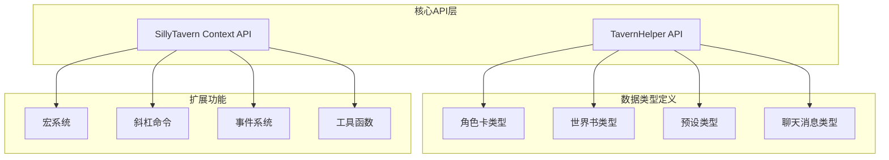
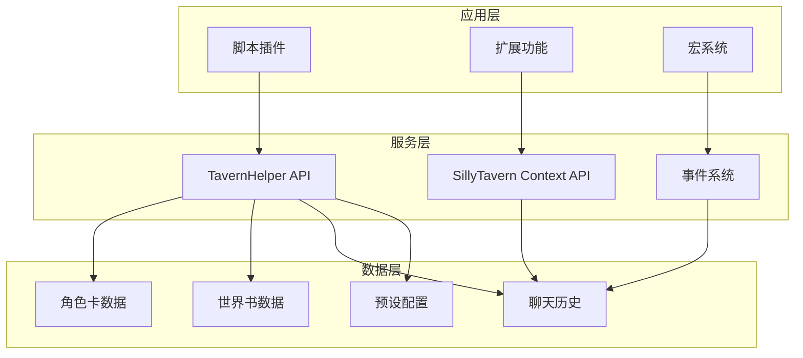
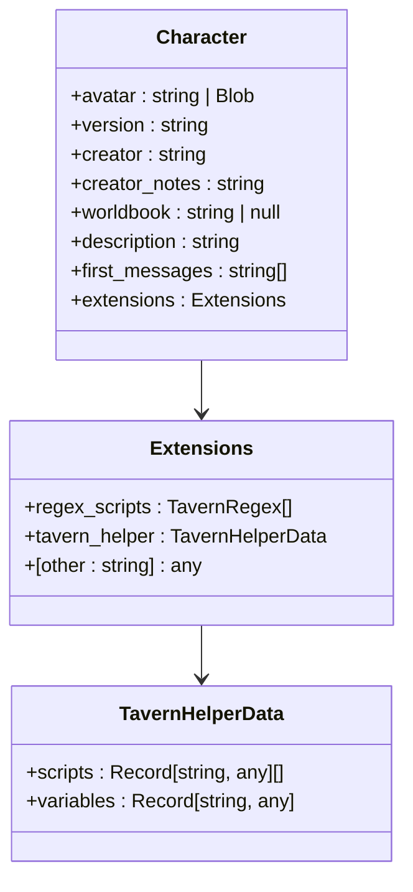
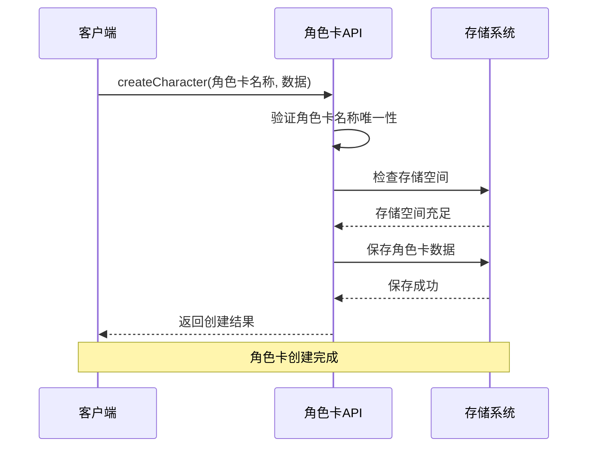
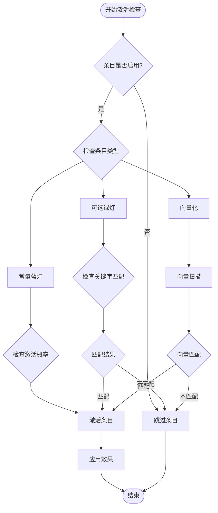
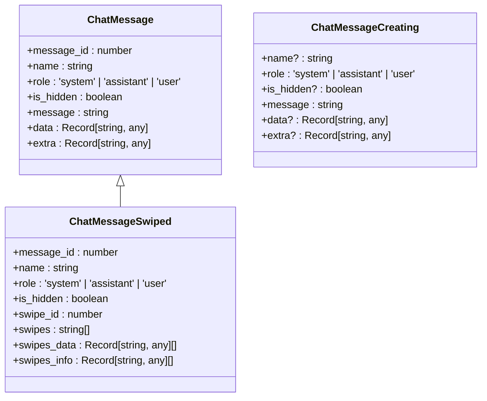
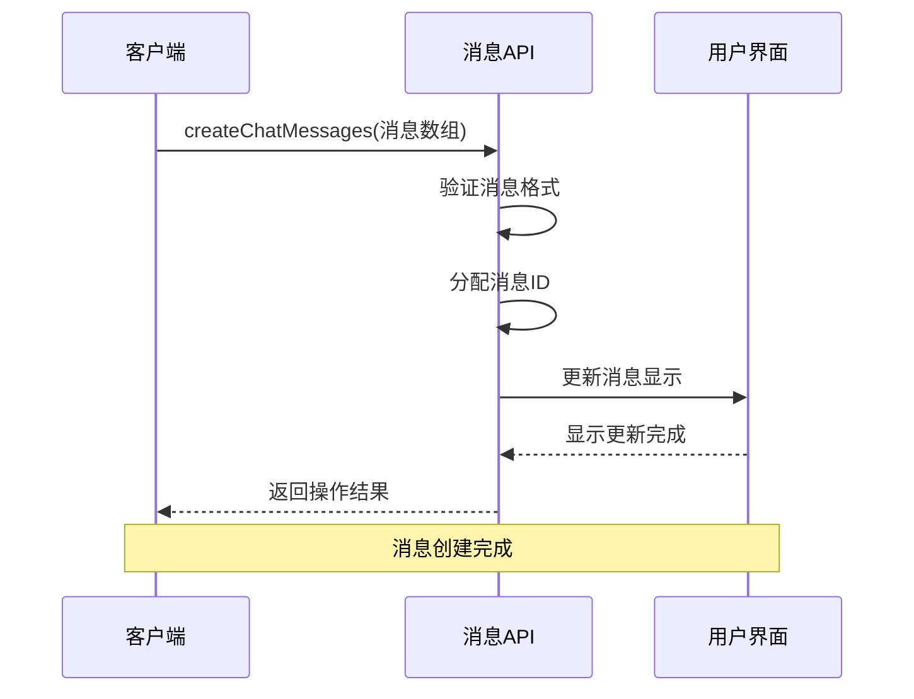
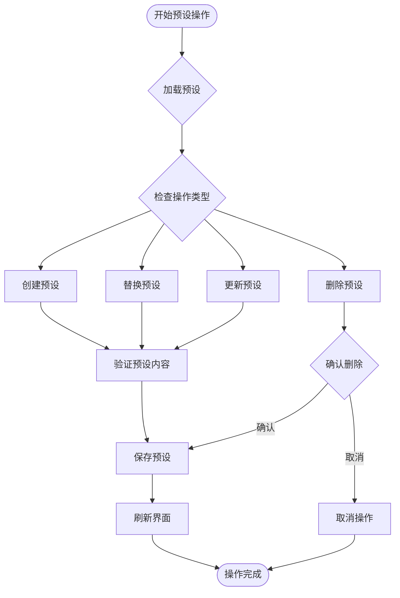
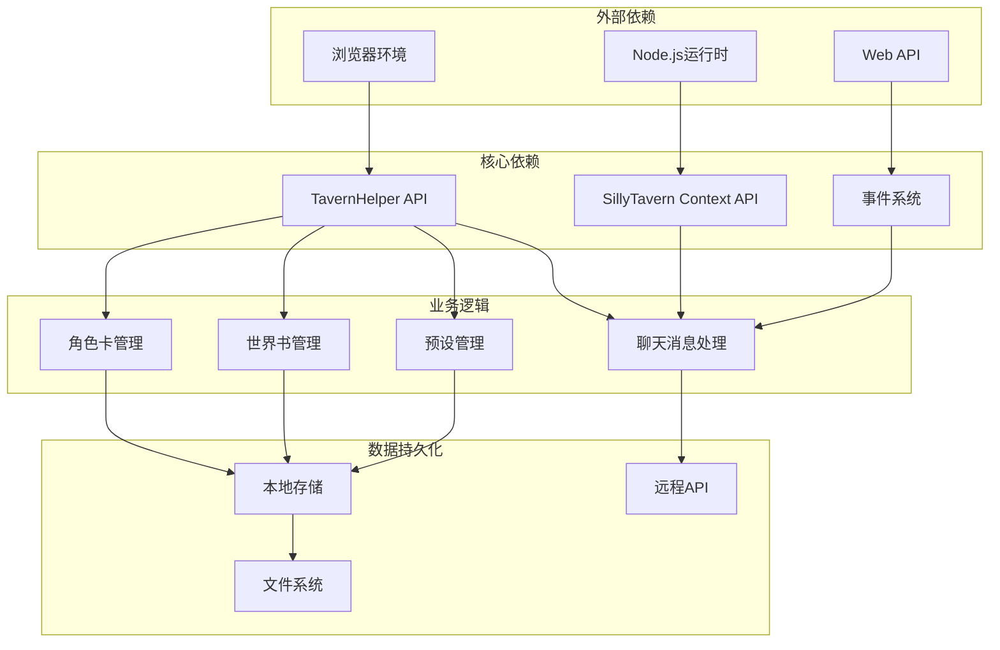

# SillyTavern API

<cite>
**本文档引用的文件**
- [@types/function/index.d.ts](file://@types/function/index.d.ts)
- [@types/iframe/exported.sillytavern.d.ts](file://@types/iframe/exported.sillytavern.d.ts)
- [@types/function/character.d.ts](file://@types/function/character.d.ts)
- [@types/function/worldbook.d.ts](file://@types/function/worldbook.d.ts)
- [@types/function/preset.d.ts](file://@types/function/preset.d.ts)
- [@types/function/chat_message.d.ts](file://@types/function/chat_message.d.ts)
- [@types/function/lorebook.d.ts](file://@types/function/lorebook.d.ts)
- [参考脚本示例/SillyTavern_Macros.txt](file://参考脚本示例/SillyTavern_Macros.txt)
- [参考脚本示例/slash_command.txt](file://参考脚本示例/slash_command.txt)
- [示例/脚本示例/监听消息修改.ts](file://示例/脚本示例/监听消息修改.ts)
- [示例/脚本示例/调整消息楼层.ts](file://示例/脚本示例/调整消息楼层.ts)
</cite>

## 目录
1. [简介](#简介)
2. [项目结构](#项目结构)
3. [核心组件](#核心组件)
4. [架构概览](#架构概览)
5. [详细组件分析](#详细组件分析)
6. [依赖关系分析](#依赖关系分析)
7. [性能考虑](#性能考虑)
8. [故障排除指南](#故障排除指南)
9. [结论](#结论)

## 简介

SillyTavern API 是一个强大的聊天机器人平台，提供了丰富的扩展接口和数据结构。本文档详细介绍了 SillyTavern 的所有可用函数接口和数据结构，涵盖了角色卡操作、世界书管理、聊天消息处理、预设管理等核心API。

该API为开发者提供了完整的编程接口，包括：
- 角色卡的创建、修改、删除和查询
- 世界书的管理和条目操作
- 聊天消息的获取、创建、修改和删除
- 预设的管理功能
- 事件系统和扩展机制
- 宏系统和斜杠命令

## 项目结构

SillyTavern 项目采用模块化的架构设计，主要包含以下核心部分：

**图表来源**
- [@types/function/index.d.ts:1-170](file://@types/function/index.d.ts#L1-L170)
- [@types/iframe/exported.sillytavern.d.ts:382-698](file://@types/iframe/exported.sillytavern.d.ts#L382-L698)

**章节来源**
- [@types/function/index.d.ts:1-170](file://@types/function/index.d.ts#L1-L170)
- [@types/iframe/exported.sillytavern.d.ts:1-698](file://@types/iframe/exported.sillytavern.d.ts#L1-L698)

## 核心组件

### TavernHelper API

TavernHelper 提供了酒馆助手的核心功能接口，包括音频管理、角色卡操作、聊天消息处理、世界书管理等。

#### 角色卡操作接口

| 接口名称 | 参数类型 | 返回类型 | 功能描述 |
|---------|----------|----------|----------|
| getCharacterNames | 无 | string[] | 获取所有角色卡名称列表 |
| createCharacter | character_name: string, character?: PartialDeep<Character> | Promise<boolean> | 创建新角色卡 |
| getCharacter | character_name: string | Promise<Character> | 获取指定角色卡内容 |
| replaceCharacter | character_name: string, character: PartialDeep<Character> | Promise<void> | 替换角色卡内容 |
| updateCharacterWith | character_name: string, updater: CharacterUpdater | Promise<Character> | 使用更新函数修改角色卡 |

#### 世界书管理接口

| 接口名称 | 参数类型 | 返回类型 | 功能描述 |
|---------|----------|----------|----------|
| getWorldbookNames | 无 | string[] | 获取所有世界书名称 |
| getWorldbook | worldbook_name: string | Promise<WorldbookEntry[]> | 获取世界书内容 |
| createWorldbook | worldbook_name: string, worldbook?: WorldbookEntry[] | Promise<boolean> | 创建新世界书 |
| replaceWorldbook | worldbook_name: string, worldbook: PartialDeep<WorldbookEntry[]> | Promise<void> | 替换世界书内容 |
| updateWorldbookWith | worldbook_name: string, updater: WorldbookUpdater | Promise<WorldbookEntry[]> | 使用更新函数修改世界书 |

#### 聊天消息处理接口

| 接口名称 | 参数类型 | 返回类型 | 功能描述 |
|---------|----------|----------|----------|
| getChatMessages | range: string \| number, options?: GetChatMessagesOption | Promise<(ChatMessage \| ChatMessageSwiped)[]> | 获取聊天消息 |
| setChatMessages | chat_messages: Array, options?: SetChatMessagesOption | Promise<void> | 修改聊天消息 |
| createChatMessages | chat_messages: ChatMessageCreating[], options?: CreateChatMessagesOption | Promise<void> | 创建聊天消息 |
| deleteChatMessages | message_ids: number[], options?: SetChatMessagesOption | Promise<void> | 删除聊天消息 |
| rotateChatMessages | begin: number, middle: number, end: number, options?: SetChatMessagesOption | Promise<void> | 旋转聊天消息 |

**章节来源**
- [@types/function/index.d.ts:6-168](file://@types/function/index.d.ts#L6-L168)
- [@types/function/character.d.ts:21-173](file://@types/function/character.d.ts#L21-L173)
- [@types/function/worldbook.d.ts:1-312](file://@types/function/worldbook.d.ts#L1-L312)
- [@types/function/chat_message.d.ts:31-235](file://@types/function/chat_message.d.ts#L31-L235)

### SillyTavern Context API

SillyTavern Context API 提供了直接与聊天界面交互的能力，包括消息渲染、生成控制、事件处理等。

#### 核心属性

| 属性名称 | 类型 | 描述 |
|---------|------|------|
| chat | ChatMessage[] | 当前聊天消息数组 |
| characters | v1CharData[] | 角色卡列表 |
| characterId | string | 当前角色卡ID |
| chatId | string | 当前聊天ID |
| chatMetadata | Record<string, any> | 聊天元数据 |

#### 核心方法

| 方法名称 | 参数类型 | 返回类型 | 功能描述 |
|---------|----------|----------|----------|
| addOneMessage | mes: ChatMessage, options?: AddMessageOptions | Promise<JQuery<HTMLElement>> | 添加单条消息 |
| deleteLastMessage | 无 | Promise<void> | 删除最后一条消息 |
| generate | Function | 生成文本 | 触发文本生成 |
| sendStreamingRequest | type: string, data: object | Promise<void> | 发送流式请求 |
| stopGeneration | 无 | boolean | 停止生成 |

**章节来源**
- [@types/iframe/exported.sillytavern.d.ts:382-698](file://@types/iframe/exported.sillytavern.d.ts#L382-L698)

## 架构概览

SillyTavern 采用了分层架构设计，确保了良好的可扩展性和维护性：

**图表来源**
- [@types/function/index.d.ts:1-170](file://@types/function/index.d.ts#L1-L170)
- [@types/iframe/exported.sillytavern.d.ts:382-698](file://@types/iframe/exported.sillytavern.d.ts#L382-L698)

## 详细组件分析

### 角色卡管理系统

角色卡管理系统提供了完整的人物数据管理功能，支持复杂的角色属性和扩展数据。

#### 角色卡数据结构

**图表来源**
- [@types/function/character.d.ts:1-19](file://@types/function/character.d.ts#L1-L19)

#### 角色卡操作流程

**图表来源**
- [@types/function/character.d.ts:45-48](file://@types/function/character.d.ts#L45-L48)

**章节来源**
- [@types/function/character.d.ts:1-173](file://@types/function/character.d.ts#L1-L173)

### 世界书管理系统

世界书系统是 SillyTavern 的核心知识管理功能，支持复杂的条目管理和激活逻辑。

#### 世界书条目结构

| 字段名称 | 类型 | 描述 | 必需 |
|---------|------|------|------|
| uid | number | 条目唯一标识符 | 是 |
| name | string | 条目名称 | 是 |
| enabled | boolean | 是否启用 | 是 |
| strategy | Strategy | 激活策略 | 是 |
| position | Position | 插入位置 | 是 |
| content | string | 条目内容 | 是 |
| probability | number | 激活概率 | 否 |
| recursion | Recursion | 递归设置 | 否 |
| effect | Effect | 效果设置 | 否 |

#### 世界书激活策略

**图表来源**
- [@types/function/worldbook.d.ts:64-144](file://@types/function/worldbook.d.ts#L64-L144)

**章节来源**
- [@types/function/worldbook.d.ts:1-312](file://@types/function/worldbook.d.ts#L1-L312)

### 聊天消息处理系统

聊天消息处理系统提供了灵活的消息管理能力，支持多种消息类型和操作。

#### 消息类型定义

**图表来源**
- [@types/function/chat_message.d.ts:1-20](file://@types/function/chat_message.d.ts#L1-L20)

#### 消息操作序列

**图表来源**
- [@types/function/chat_message.d.ts:188-191](file://@types/function/chat_message.d.ts#L188-L191)

**章节来源**
- [@types/function/chat_message.d.ts:1-235](file://@types/function/chat_message.d.ts#L1-L235)

### 预设管理系统

预设系统提供了灵活的配置管理功能，支持多种类型的提示词和设置。

#### 预设提示词类型

| 提示词类型 | ID范围 | 描述 | 用途 |
|-----------|--------|------|------|
| 普通提示词 | 自定义ID | 用户手动添加的提示词 | 通用提示 |
| 系统提示词 | main, nsfw, jailbreak, enhanceDefinitions | 系统内置提示词 | 特殊功能 |
| 占位符提示词 | worldInfoBefore, personaDescription, charDescription, charPersonality, scenario, worldInfoAfter, dialogueExamples, chatHistory | 位置占位符 | 内容插入点 |

#### 预设操作流程

**图表来源**
- [@types/function/preset.d.ts:182-280](file://@types/function/preset.d.ts#L182-L280)

**章节来源**
- [@types/function/preset.d.ts:1-366](file://@types/function/preset.d.ts#L1-L366)

### 宏系统和斜杠命令

SillyTavern 提供了强大的宏系统和斜杠命令功能，支持复杂的自动化操作。

#### 宏系统功能

| 宏类型 | 示例 | 功能描述 |
|-------|------|----------|
| 变量宏 | {{var::name}} | 获取变量值 |
| 条件宏 | {{if::condition::content}} | 条件判断 |
| 时间宏 | {{datetimeformat::YYYY-MM-DD}} | 时间格式化 |
| 数学宏 | {{add::10::20}} | 数学运算 |

#### 斜杠命令示例

| 命令 | 参数 | 功能描述 |
|------|------|----------|
| /send | (string) | 发送用户消息 |
| /gen | (string) | 生成文本 |
| /inject | (string) | 注入提示词 |
| /popup | (string) | 显示弹窗 |
| /event-emit | (string) | 发送事件 |

**章节来源**
- [参考脚本示例/SillyTavern_Macros.txt:1-378](file://参考脚本示例/SillyTavern_Macros.txt#L1-L378)
- [参考脚本示例/slash_command.txt:1-276](file://参考脚本示例/slash_command.txt#L1-L276)

## 依赖关系分析

SillyTavern API 的依赖关系呈现清晰的层次结构：

**图表来源**
- [@types/function/index.d.ts:1-170](file://@types/function/index.d.ts#L1-L170)
- [@types/iframe/exported.sillytavern.d.ts:382-698](file://@types/iframe/exported.sillytavern.d.ts#L382-L698)

**章节来源**
- [@types/function/index.d.ts:1-170](file://@types/function/index.d.ts#L1-L170)
- [@types/iframe/exported.sillytavern.d.ts:1-698](file://@types/iframe/exported.sillytavern.d.ts#L1-L698)

## 性能考虑

### 缓存策略

SillyTavern 采用了多层缓存机制来优化性能：

1. **角色卡缓存**：角色卡数据在内存中缓存，避免频繁的磁盘I/O操作
2. **世界书缓存**：世界书条目按需加载，支持懒加载机制
3. **聊天消息缓存**：最近的消息在内存中缓存，支持虚拟滚动
4. **预设缓存**：常用预设在内存中缓存，减少加载时间

### 异步操作

所有涉及I/O操作的方法都采用异步模式：

- 文件读写操作使用Promise
- 网络请求使用async/await
- 大数据处理使用分批处理
- 长时间操作使用进度反馈

### 内存管理

- 及时释放不再使用的对象引用
- 支持垃圾回收机制
- 提供内存使用监控
- 限制单个聊天的最大消息数量

## 故障排除指南

### 常见错误类型

| 错误类型 | 错误码 | 描述 | 解决方案 |
|---------|--------|------|----------|
| 角色卡不存在 | 404 | 指定的角色卡不存在 | 检查角色卡名称或重新创建 |
| 权限不足 | 403 | 操作被拒绝 | 检查用户权限或联系管理员 |
| 数据格式错误 | 400 | 请求数据格式不正确 | 验证数据结构和类型 |
| 存储空间不足 | 507 | 磁盘空间不足 | 清理存储空间或增加容量 |
| 网络连接失败 | 503 | 无法连接到服务器 | 检查网络连接或重试 |

### 调试技巧

1. **启用调试模式**：使用 `registerDebugFunction` 注册调试函数
2. **查看事件日志**：监听 `tavern_events` 事件获取详细信息
3. **使用开发者工具**：F12打开控制台查看JavaScript错误
4. **检查API响应**：验证每个API调用的返回值

### 性能优化建议

1. **批量操作**：将多个小操作合并为批量操作
2. **延迟加载**：按需加载大型数据集
3. **缓存策略**：合理使用缓存减少重复计算
4. **异步处理**：避免阻塞主线程的操作

**章节来源**
- [@types/function/character.d.ts:45-48](file://@types/function/character.d.ts#L45-L48)
- [@types/function/worldbook.d.ts:155-155](file://@types/function/worldbook.d.ts#L155-L155)
- [@types/function/chat_message.d.ts:150-153](file://@types/function/chat_message.d.ts#L150-L153)

## 结论

SillyTavern API 提供了一个功能完整、结构清晰的扩展平台，支持复杂的应用场景和高度定制化的需求。通过本文档的详细介绍，开发者可以充分利用SillyTavern提供的各种API接口，构建强大的聊天机器人应用。

### 主要优势

1. **完整的数据模型**：提供了角色卡、世界书、聊天消息、预设等完整的数据结构
2. **灵活的扩展机制**：支持宏系统、斜杠命令、事件系统等多种扩展方式
3. **强大的API接口**：涵盖了角色卡操作、世界书管理、聊天消息处理等核心功能
4. **良好的性能设计**：采用缓存、异步、虚拟化等技术优化性能
5. **完善的错误处理**：提供了详细的错误类型和处理建议

### 最佳实践

1. **合理使用缓存**：充分利用SillyTavern的缓存机制提高性能
2. **异步编程**：避免阻塞操作，使用Promise和async/await
3. **错误处理**：完善错误处理机制，提供友好的用户体验
4. **性能监控**：定期监控应用性能，及时发现和解决问题
5. **安全考虑**：注意数据验证和权限控制，防止恶意操作

通过遵循这些指导原则，开发者可以构建出高质量、高性能的SillyTavern应用，为用户提供优秀的聊天体验。