# 世界书管理API

<cite>
**本文档引用的文件**
- [@types/function/worldbook.d.ts](file://@types/function/worldbook.d.ts)
- [参考脚本示例/@types/function/worldbook.d.ts](file://参考脚本示例/@types/function/worldbook.d.ts)
- [示例/角色卡示例/世界书/变量/initvar.yaml](file://示例/角色卡示例/世界书/变量/initvar.yaml)
- [示例/角色卡示例/世界书/变量/变量更新规则.yaml](file://示例/角色卡示例/世界书/变量/变量更新规则.yaml)
- [示例/角色卡示例/世界书/变量/变量输出格式.yaml](file://示例/角色卡示例/世界书/变量/变量输出格式.yaml)
- [示例/角色卡示例/世界书/立即事件/冲动啊，请平息吧.yaml](file://示例/角色卡示例/世界书/立即事件/冲动啊，请平息吧.yaml)
- [示例/角色卡示例/世界书/立即事件/理性啊，请不要冻结.yaml](file://示例/角色卡示例/世界书/立即事件/理性啊，请不要冻结.yaml)
- [参考脚本示例/slash_command.txt](file://参考脚本示例/slash_command.txt)
</cite>

## 目录
1. [简介](#简介)
2. [项目结构](#项目结构)
3. [核心组件](#核心组件)
4. [架构概览](#架构概览)
5. [详细组件分析](#详细组件分析)
6. [依赖关系分析](#依赖关系分析)
7. [性能考虑](#性能考虑)
8. [故障排除指南](#故障排除指南)
9. [结论](#结论)

## 简介

世界书管理API是SillyTavern扩展系统中的核心功能模块，负责管理和操作世界书（Lorebook）数据结构。世界书是虚拟角色扮演场景中的知识库系统，包含预设的背景信息、角色设定、对话模式和情境规则。

本API提供了完整的CRUD操作能力，包括世界书的创建、读取、更新、删除和绑定管理。通过这些API，开发者可以构建复杂的角色扮演场景，实现动态的背景信息管理和智能的对话上下文控制。

## 项目结构

世界书管理API位于项目的类型定义文件中，采用模块化设计：

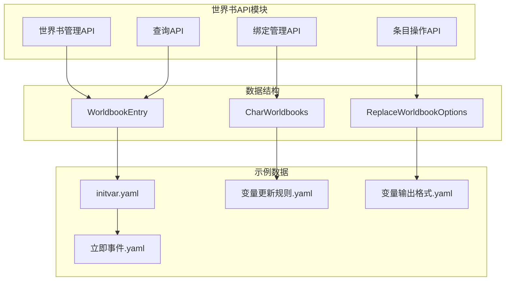

**图表来源**
- [@types/function/worldbook.d.ts:1-312](file://@types/function/worldbook.d.ts#L1-L312)
- [示例/角色卡示例/世界书/变量/initvar.yaml:1-34](file://示例/角色卡示例/世界书/变量/initvar.yaml#L1-L34)

**章节来源**
- [@types/function/worldbook.d.ts:1-312](file://@types/function/worldbook.d.ts#L1-L312)
- [参考脚本示例/@types/function/worldbook.d.ts:1-312](file://参考脚本示例/@types/function/worldbook.d.ts#L1-L312)

## 核心组件

### 世界书条目数据结构

世界书条目是API的核心数据单元，包含以下关键属性：

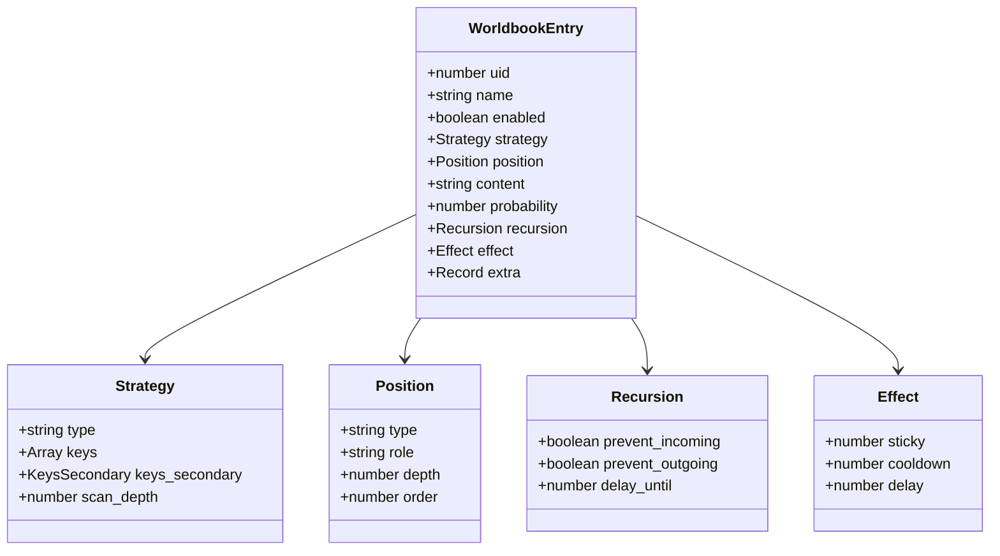

**图表来源**
- [@types/function/worldbook.d.ts:64-144](file://@types/function/worldbook.d.ts#L64-L144)

### 绑定管理数据结构

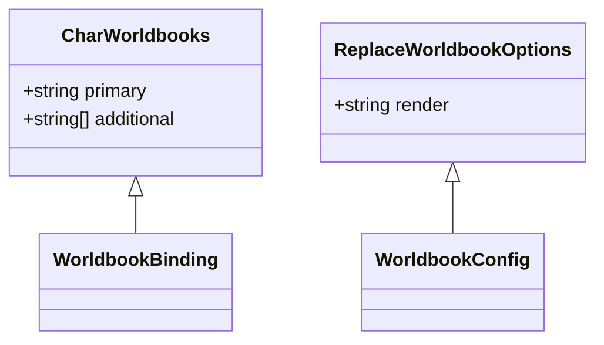

**图表来源**
- [@types/function/worldbook.d.ts:21-24](file://@types/function/worldbook.d.ts#L21-L24)
- [@types/function/worldbook.d.ts:195-198](file://@types/function/worldbook.d.ts#L195-L198)

**章节来源**
- [@types/function/worldbook.d.ts:64-144](file://@types/function/worldbook.d.ts#L64-L144)
- [@types/function/worldbook.d.ts:21-24](file://@types/function/worldbook.d.ts#L21-L24)
- [@types/function/worldbook.d.ts:195-198](file://@types/function/worldbook.d.ts#L195-L198)

## 架构概览

世界书管理API采用分层架构设计，提供多维度的操作能力：

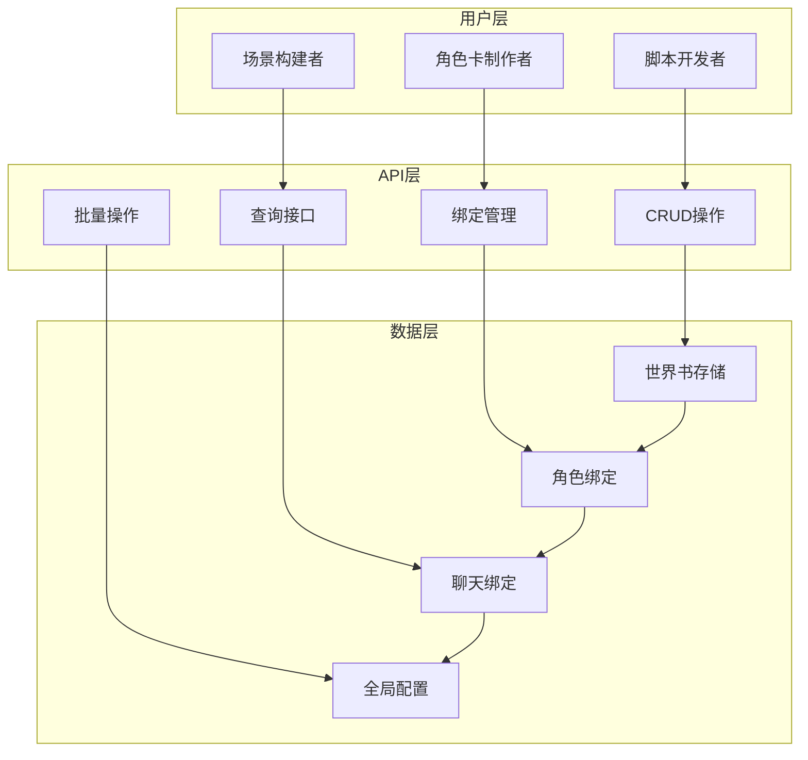

**图表来源**
- [@types/function/worldbook.d.ts:1-312](file://@types/function/worldbook.d.ts#L1-L312)

### API分类体系

| 功能类别 | 核心方法 | 主要用途 |
|---------|---------|---------|
| CRUD操作 | createWorldbook, getWorldbook, replaceWorldbook, deleteWorldbook | 基础数据管理 |
| 绑定管理 | rebindGlobalWorldbooks, rebindCharWorldbooks, rebindChatWorldbook | 关系绑定控制 |
| 查询接口 | getWorldbookNames, getGlobalWorldbookNames, getCharWorldbookNames, getChatWorldbookName | 数据检索 |
| 批量操作 | createWorldbookEntries, deleteWorldbookEntries, updateWorldbookWith | 高效批量处理 |

**章节来源**
- [@types/function/worldbook.d.ts:1-312](file://@types/function/worldbook.d.ts#L1-L312)

## 详细组件分析

### CRUD操作详解

#### createWorldbook - 创建世界书

创建世界书是世界书管理的基础操作，支持两种模式：

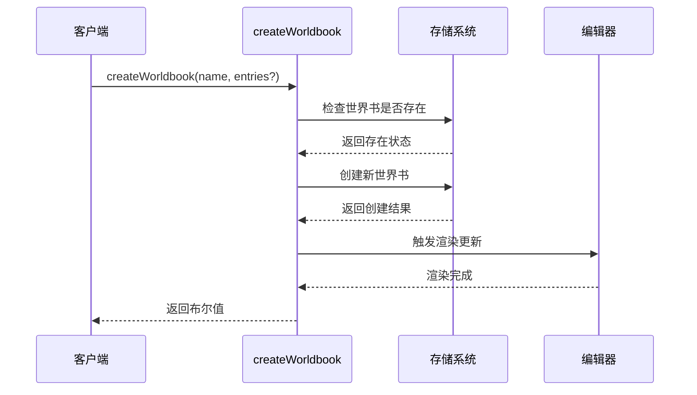

**图表来源**
- [@types/function/worldbook.d.ts:157-165](file://@types/function/worldbook.d.ts#L157-L165)

**参数说明：**
- `worldbook_name`: 世界书名称（必需）
- `worldbook`: 世界书条目数组（可选）

**返回值：**
- `Promise<boolean>`: 创建返回true，替换返回false

#### getWorldbook - 读取世界书

获取指定世界书的完整内容，包含所有条目配置：

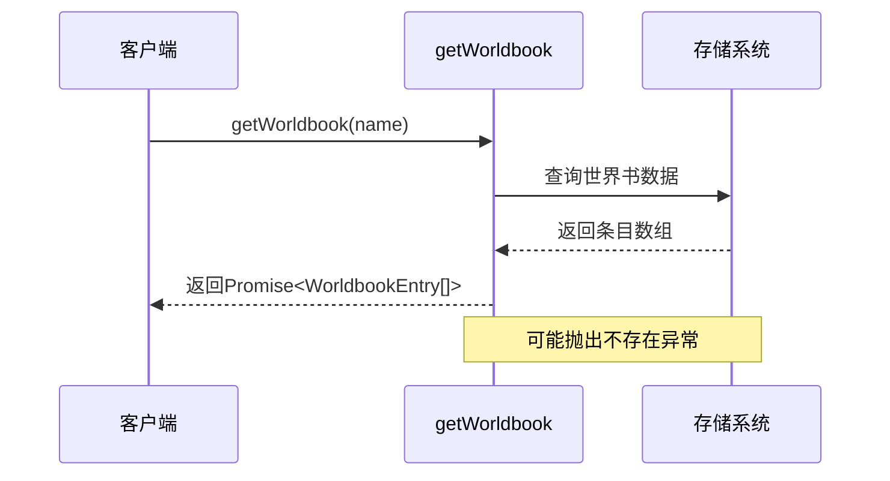

**图表来源**
- [@types/function/worldbook.d.ts:147-155](file://@types/function/worldbook.d.ts#L147-L155)

**返回值：**
- `Promise<WorldbookEntry[]>`: 世界书条目数组

#### replaceWorldbook - 替换世界书

完全替换现有世界书内容，提供精确控制：

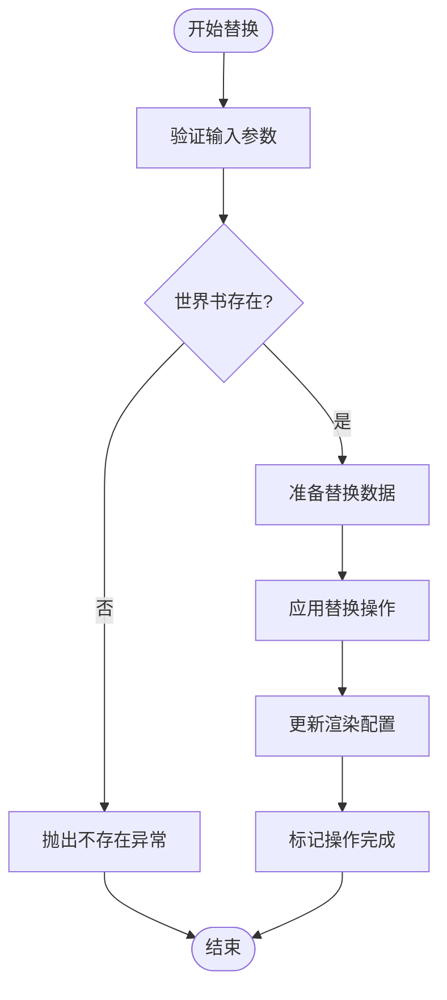

**图表来源**
- [@types/function/worldbook.d.ts:226-230](file://@types/function/worldbook.d.ts#L226-L230)

**参数说明：**
- `worldbook_name`: 目标世界书名称
- `worldbook`: 新的条目数组
- `options.render`: 渲染配置选项

**返回值：**
- `Promise<void>`: 操作完成后返回

#### deleteWorldbook - 删除世界书

安全删除指定的世界书，包含完整性检查：

**章节来源**
- [@types/function/worldbook.d.ts:157-190](file://@types/function/worldbook.d.ts#L157-L190)

### 绑定管理详解

#### 全局世界书绑定

全局世界书影响所有聊天场景，提供统一的背景信息：

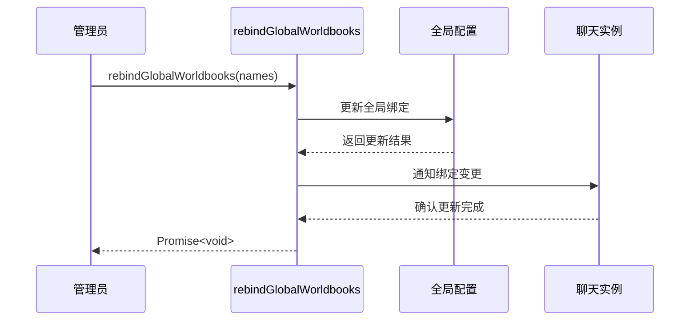

**图表来源**
- [@types/function/worldbook.d.ts:15-19](file://@types/function/worldbook.d.ts#L15-L19)

#### 角色卡世界书绑定

角色卡绑定提供个性化的世界书配置：

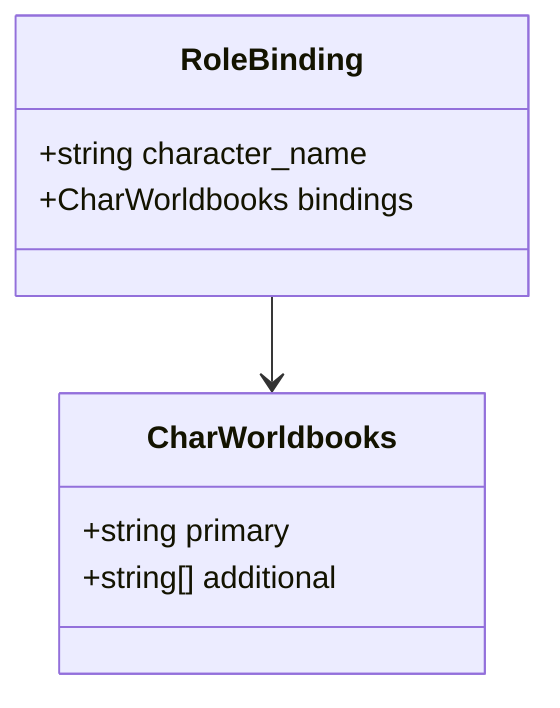

**图表来源**
- [@types/function/worldbook.d.ts:21-39](file://@types/function/worldbook.d.ts#L21-L39)

#### 聊天文件世界书绑定

聊天文件绑定实现场景化的世界书管理：

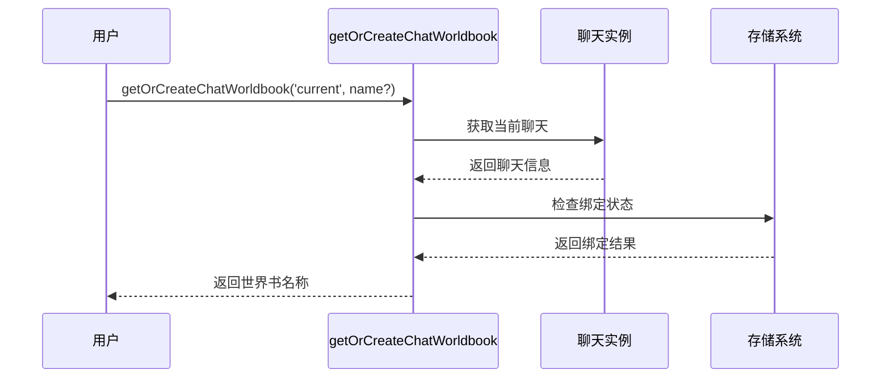

**图表来源**
- [@types/function/worldbook.d.ts:57-62](file://@types/function/worldbook.d.ts#L57-L62)

**章节来源**
- [@types/function/worldbook.d.ts:15-62](file://@types/function/worldbook.d.ts#L15-L62)

### 高级操作详解

#### createOrReplaceWorldbook - 创建或替换

提供智能的创建/替换逻辑，自动判断操作类型：

**参数说明：**
- `worldbook_name`: 世界书名称
- `worldbook`: 条目数组（可选）
- `options.render`: 渲染配置（可选）

**返回值：**
- `Promise<boolean>`: 创建返回true，替换返回false

#### 批量条目操作

##### createWorldbookEntries - 新增条目

高效批量添加世界书条目，支持部分字段指定：

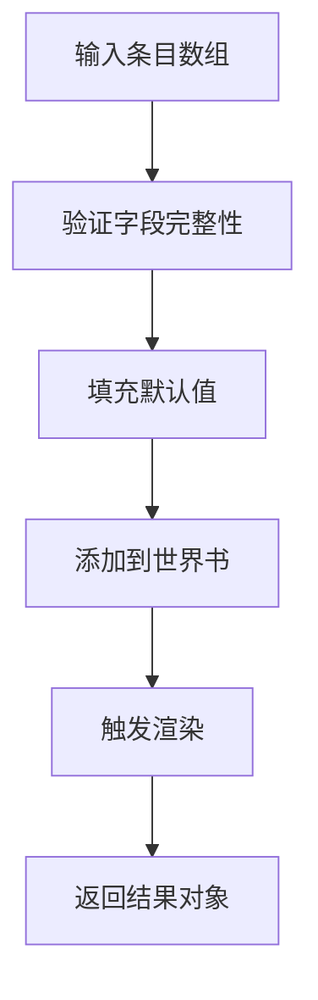

**图表来源**
- [@types/function/worldbook.d.ts:285-289](file://@types/function/worldbook.d.ts#L285-L289)

##### deleteWorldbookEntries - 删除条目

基于条件筛选删除条目，支持复杂过滤逻辑：

**参数说明：**
- `worldbook_name`: 目标世界书
- `predicate`: 过滤函数
- `options`: 可选配置

**返回值：**
- `Promise<{worldbook, deleted_entries}>`: 更新后的世界书和被删除的条目

##### updateWorldbookWith - 更新操作

提供函数式更新机制，支持异步更新流程：

**章节来源**
- [@types/function/worldbook.d.ts:177-311](file://@types/function/worldbook.d.ts#L177-L311)

## 依赖关系分析

世界书管理API与其他系统组件存在紧密的依赖关系：

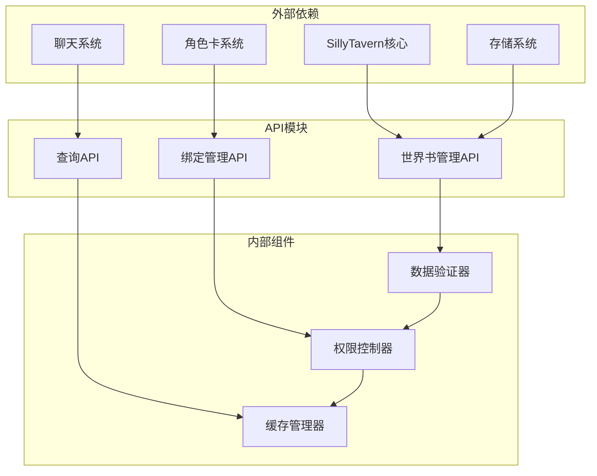

**图表来源**
- [@types/function/worldbook.d.ts:1-312](file://@types/function/worldbook.d.ts#L1-L312)

### 数据流依赖

世界书API的数据流遵循严格的依赖链：

1. **输入验证** → **权限检查** → **业务逻辑处理** → **存储操作** → **通知更新**

2. **查询依赖** → **缓存检查** → **数据库访问** → **结果组装**

3. **绑定管理** → **关系验证** → **状态更新** → **同步通知**

**章节来源**
- [@types/function/worldbook.d.ts:1-312](file://@types/function/worldbook.d.ts#L1-L312)

## 性能考虑

### 渲染优化

世界书API提供多种渲染策略以平衡性能和用户体验：

| 渲染模式 | 适用场景 | 性能特点 |
|---------|---------|---------|
| debounced | 大量连续操作 | 性能最优，可能有延迟 |
| immediate | 实时反馈需求 | 响应最快，开销较大 |
| none | 后台批量处理 | 无UI开销，需手动刷新 |

### 内存管理

- **懒加载**：条目按需加载，减少内存占用
- **缓存策略**：热点数据缓存，冷数据释放
- **垃圾回收**：及时清理不再使用的条目引用

### 并发控制

- **操作队列**：串行处理关键操作
- **锁机制**：防止并发修改冲突
- **事务支持**：批量操作的原子性保证

## 故障排除指南

### 常见错误类型

#### 世界书不存在

当尝试操作不存在的世界书时，API会抛出相应的异常：

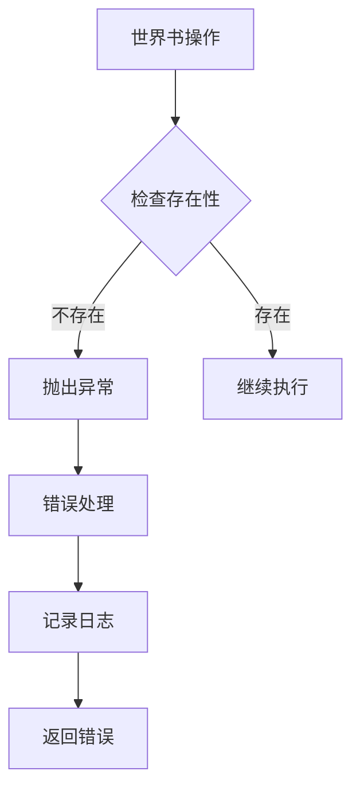

**图表来源**
- [@types/function/worldbook.d.ts:155](file://@types/function/worldbook.d.ts#L155)

#### 权限不足

绑定管理操作需要相应的权限级别：

**章节来源**
- [@types/function/worldbook.d.ts:155-190](file://@types/function/worldbook.d.ts#L155-L190)

### 调试技巧

1. **日志记录**：启用详细的API调用日志
2. **状态监控**：监控世界书绑定状态
3. **性能分析**：分析渲染和存储操作的性能瓶颈
4. **内存检查**：定期检查内存使用情况

## 结论

世界书管理API提供了完整而强大的世界书管理系统，具有以下优势：

### 技术优势

- **模块化设计**：清晰的API分层和职责分离
- **类型安全**：完整的TypeScript类型定义
- **性能优化**：多种渲染策略和缓存机制
- **扩展性强**：支持自定义扩展和插件集成

### 使用建议

1. **合理选择渲染模式**：根据使用场景选择合适的渲染策略
2. **批量操作优化**：大量数据操作时使用批量API
3. **权限管理**：严格控制绑定管理的权限
4. **错误处理**：完善的异常处理和恢复机制

### 发展方向

- **AI集成**：结合AI技术实现智能的世界书管理
- **可视化编辑**：提供图形化的世界书编辑界面
- **协作功能**：支持多人协作的世界书管理
- **模板系统**：提供丰富的世界书模板库

通过合理利用世界书管理API，开发者可以构建更加丰富和智能的角色扮演游戏体验，为用户提供沉浸式的虚拟角色扮演环境。