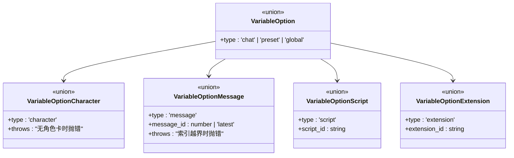
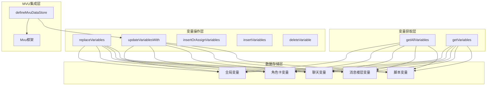
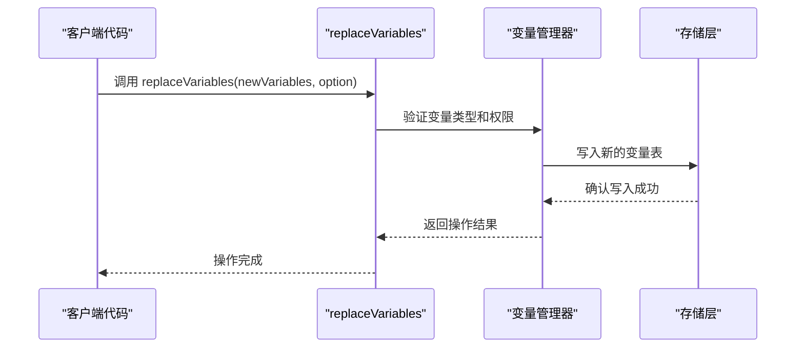
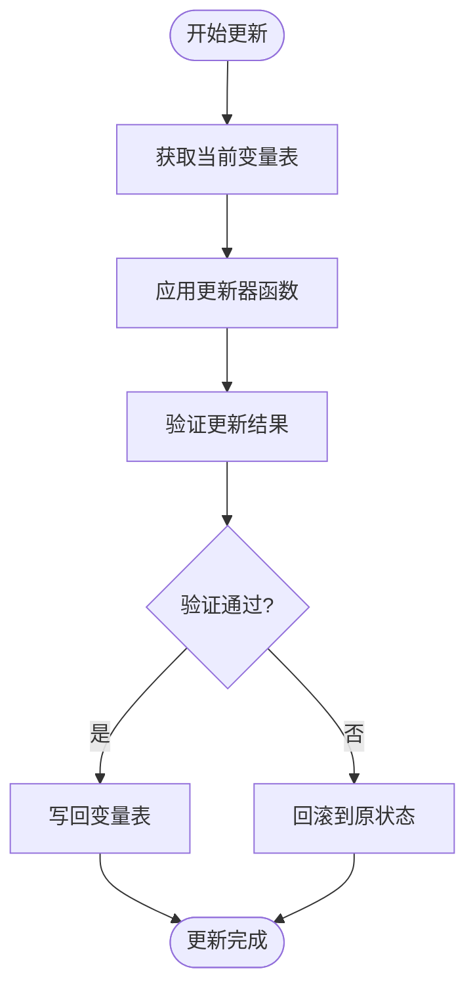
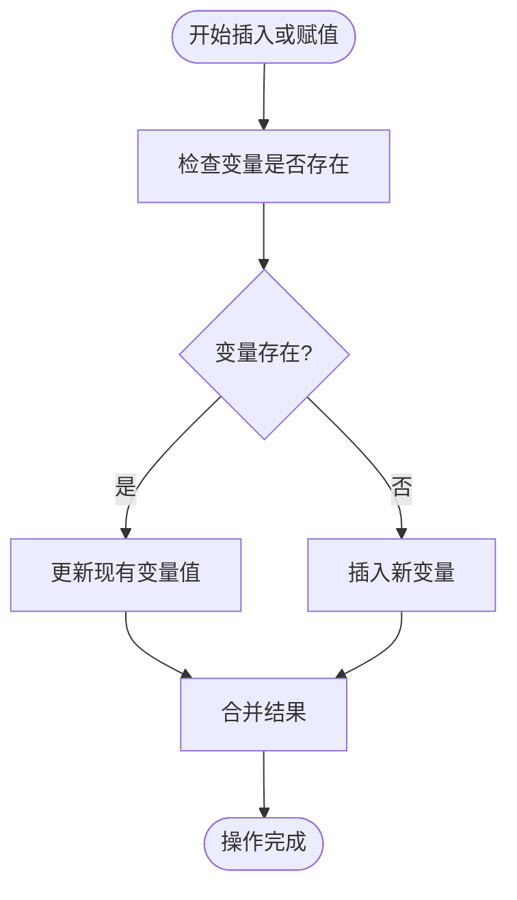
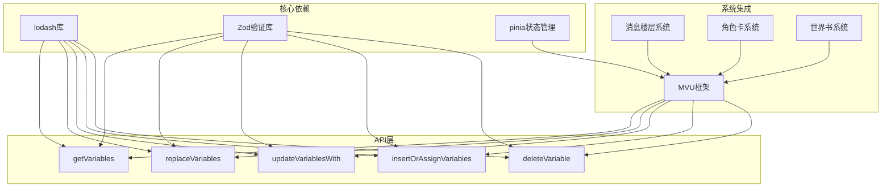

# 变量管理API

<cite>
**本文档引用的文件**
- [@types/function/variables.d.ts](file://@types/function/variables.d.ts)
- [@types/iframe/variables.d.ts](file://@types/iframe/variables.d.ts)
- [@types/function/worldbook.d.ts](file://@types/function/worldbook.d.ts)
- [@types/iframe/exported.mvu.d.ts](file://@types/iframe/exported.mvu.d.ts)
- [util/mvu.ts](file://util/mvu.ts)
- [示例/角色卡示例/世界书/变量/initvar.yaml](file://示例/角色卡示例/世界书/变量/initvar.yaml)
- [示例/角色卡示例/世界书/变量/变量更新规则.yaml](file://示例/角色卡示例/世界书/变量/变量更新规则.yaml)
- [示例/角色卡示例/脚本/MVU/index.ts](file://示例/角色卡示例/脚本/MVU/index.ts)
- [示例/角色卡示例/脚本/变量结构/index.ts](file://示例/角色卡示例/脚本/变量结构/index.ts)
</cite>

## 目录
1. [简介](#简介)
2. [项目结构](#项目结构)
3. [核心组件](#核心组件)
4. [架构概览](#架构概览)
5. [详细组件分析](#详细组件分析)
6. [依赖关系分析](#依赖关系分析)
7. [性能考虑](#性能考虑)
8. [故障排除指南](#故障排除指南)
9. [结论](#结论)
10. [附录](#附录)

## 简介

变量管理API是酒馆助手（SillyTavern）生态系统中的核心功能模块，为开发者提供了统一的变量操作接口。该API支持多种变量类型的操作，包括获取、替换、更新、插入和删除等操作，广泛应用于角色卡管理和世界书系统中。

本文档详细介绍了变量管理API的设计理念、实现机制和最佳实践，特别关注MVU（Model-View-Update）变量框架的应用，以及变量在角色卡和世界书中的生命周期管理。

## 项目结构

变量管理API主要分布在以下关键目录中：

```mermaid
graph TB
subgraph "类型定义"
A[@types/function/variables.d.ts]
B[@types/iframe/variables.d.ts]
C[@types/function/worldbook.d.ts]
D[@types/iframe/exported.mvu.d.ts]
end
subgraph "工具函数"
E[util/mvu.ts]
end
subgraph "示例配置"
F[示例/角色卡示例/世界书/变量/]
G[示例/角色卡示例/脚本/]
end
A --> E
B --> E
C --> F
D --> E
F --> G
```

**图表来源**
- [@types/function/variables.d.ts:1-207](file://@types/function/variables.d.ts#L1-L207)
- [@types/iframe/variables.d.ts:1-10](file://@types/iframe/variables.d.ts#L1-L10)
- [@types/function/worldbook.d.ts:1-39](file://@types/function/worldbook.d.ts#L1-L39)
- [@types/iframe/exported.mvu.d.ts:49-155](file://@types/iframe/exported.mvu.d.ts#L49-L155)

**章节来源**
- [@types/function/variables.d.ts:1-207](file://@types/function/variables.d.ts#L1-L207)
- [@types/iframe/variables.d.ts:1-10](file://@types/iframe/variables.d.ts#L1-L10)
- [@types/function/worldbook.d.ts:1-39](file://@types/function/worldbook.d.ts#L1-L39)
- [@types/iframe/exported.mvu.d.ts:49-155](file://@types/iframe/exported.mvu.d.ts#L49-L155)

## 核心组件

### 变量选项类型系统

变量管理API采用类型安全的设计，通过联合类型确保操作的正确性：



**图表来源**
- [@types/function/variables.d.ts:1-35](file://@types/function/variables.d.ts#L1-L35)

### 主要API函数

变量管理API提供了以下核心函数：

1. **getVariables()** - 获取变量表
2. **replaceVariables()** - 完全替换变量表
3. **updateVariablesWith()** - 使用更新器函数更新变量
4. **insertOrAssignVariables()** - 插入或修改变量
5. **insertVariables()** - 仅插入新变量
6. **deleteVariable()** - 删除变量
7. **registerVariableSchema()** - 注册变量结构

**章节来源**
- [@types/function/variables.d.ts:37-206](file://@types/function/variables.d.ts#L37-L206)

## 架构概览

变量管理系统采用分层架构设计，支持多层级变量合并和MVU模式：



**图表来源**
- [@types/iframe/variables.d.ts:1-9](file://@types/iframe/variables.d.ts#L1-L9)
- [@types/function/variables.d.ts:37-206](file://@types/function/variables.d.ts#L37-L206)
- [util/mvu.ts:1-66](file://util/mvu.ts#L1-L66)

## 详细组件分析

### getVariables() 函数详解

`getVariables()` 函数提供灵活的变量获取能力，支持多种变量类型的访问：

**函数签名与参数：**
- 参数：`option: VariableOption`
- 返回值：`Record<string, any>`
- 功能：根据指定的变量类型获取对应的变量表

**使用场景：**
1. 获取全局变量：`getVariables({type: 'global'})`
2. 获取聊天变量：`getVariables({type: 'chat'})`
3. 获取特定消息楼层变量：`getVariables({type: 'message', message_id: -1})`
4. 获取脚本变量：`getVariables({type: 'script'})`

**章节来源**
- [@types/function/variables.d.ts:37-65](file://@types/function/variables.d.ts#L37-L65)

### replaceVariables() 函数详解

`replaceVariables()` 函数提供完全替换变量表的功能，是变量管理的核心操作之一：

**函数签名与参数：**
- 参数：`(variables: Record<string, any>, option: VariableOption)`
- 返回值：`void`
- 功能：将整个变量表替换为指定的新变量表

**工作原理：**


**图表来源**
- [@types/function/variables.d.ts:67-91](file://@types/function/variables.d.ts#L67-L91)

**使用示例：**
- 替换聊天变量：`replaceVariables({角色: {好感度: 5}}, {type: 'chat'})`
- 替换全局变量：`replaceVariables({系统: {版本: '1.0'}}, {type: 'global'})`

**章节来源**
- [@types/function/variables.d.ts:67-91](file://@types/function/variables.d.ts#L67-L91)

### updateVariablesWith() 函数详解

`updateVariablesWith()` 函数支持基于更新器函数的变量更新，提供强大的链式操作能力：

**函数签名与参数：**
- 参数：`(updater: (variables: Record<string, any>) => Record<string, any>, option: VariableOption)`
- 返回值：`Record<string, any>`
- 功能：使用更新器函数修改变量表

**异步支持：**
函数同时支持同步和异步更新器：
- 同步版本：`updateVariablesWith(updater, option)`
- 异步版本：`await updateVariablesWith(asyncUpdater, option)`

**使用场景：**


**图表来源**
- [@types/function/variables.d.ts:93-131](file://@types/function/variables.d.ts#L93-L131)

**章节来源**
- [@types/function/variables.d.ts:93-131](file://@types/function/variables.d.ts#L93-L131)

### insertOrAssignVariables() 函数详解

`insertOrAssignVariables()` 函数提供智能的变量插入或更新功能：

**函数签名与参数：**
- 参数：`(variables: Record<string, any>, option: VariableOption)`
- 返回值：`Record<string, any>`
- 功能：如果变量存在则更新，不存在则插入

**工作流程：**


**图表来源**
- [@types/function/variables.d.ts:133-148](file://@types/function/variables.d.ts#L133-L148)

**使用示例：**
- 更新现有变量：`insertOrAssignVariables({角色: {好感度: 10}}, {type: 'chat'})`
- 插入新变量：`insertOrAssignVariables({新角色: {好感度: 5}}, {type: 'chat'})`

**章节来源**
- [@types/function/variables.d.ts:133-148](file://@types/function/variables.d.ts#L133-L148)

### insertVariables() 函数详解

`insertVariables()` 函数提供严格的变量插入功能，确保只插入不存在的变量：

**函数签名与参数：**
- 参数：`(variables: Record<string, any>, option: VariableOption)`
- 返回值：`Record<string, any>`
- 功能：仅当变量不存在时才插入新变量

**与insertOrAssignVariables的区别：**
- `insertVariables()`：严格模式，已存在则跳过
- `insertOrAssignVariables()`：智能模式，存在则更新，不存在则插入

**章节来源**
- [@types/function/variables.d.ts:150-165](file://@types/function/variables.d.ts#L150-L165)

### deleteVariable() 函数详解

`deleteVariable()` 函数提供安全的变量删除功能：

**函数签名与参数：**
- 参数：`(variable_path: string, option: VariableOption)`
- 返回值：`{ variables: Record<string, any>; delete_occurred: boolean }`
- 功能：删除指定路径的变量，返回删除结果

**返回值结构：**
- `variables`：删除后的变量表
- `delete_occurred`：是否实际发生了删除操作

**章节来源**
- [@types/function/variables.d.ts:167-185](file://@types/function/variables.d.ts#L167-L185)

### registerVariableSchema() 函数详解

`registerVariableSchema()` 函数提供变量结构验证功能：

**函数签名与参数：**
- 参数：`(schema: z.ZodType<any>, option: { type: 'global' | 'preset' | 'character' | 'chat' | 'message' })`
- 返回值：`void`
- 功能：注册Zod结构用于变量验证

**用途：**
- 为变量管理器提供UI验证支持
- 不影响代码层面的变量操作
- 支持多种变量类型：global、preset、character、chat、message

**章节来源**
- [@types/function/variables.d.ts:187-206](file://@types/function/variables.d.ts#L187-L206)

## 依赖关系分析

变量管理API与其他系统组件存在紧密的依赖关系：



**图表来源**
- [@types/function/variables.d.ts:1-207](file://@types/function/variables.d.ts#L1-L207)
- [@types/function/worldbook.d.ts:1-39](file://@types/function/worldbook.d.ts#L1-L39)
- [util/mvu.ts:1-66](file://util/mvu.ts#L1-L66)

**章节来源**
- [@types/function/variables.d.ts:1-207](file://@types/function/variables.d.ts#L1-L207)
- [@types/function/worldbook.d.ts:1-39](file://@types/function/worldbook.d.ts#L1-L39)
- [util/mvu.ts:1-66](file://util/mvu.ts#L1-L66)

## 性能考虑

### 变量操作性能优化

1. **批量操作**：优先使用`updateVariablesWith()`进行批量更新，减少多次读写操作
2. **懒加载**：利用`getAllVariables()`的延迟计算特性，避免不必要的变量获取
3. **缓存策略**：合理使用变量表缓存，减少重复的变量解析操作

### 内存管理

1. **变量清理**：定期使用`deleteVariable()`清理不再使用的变量
2. **内存泄漏防护**：确保在适当的时机释放变量引用
3. **大变量处理**：对于大型变量对象，考虑分片存储策略

## 故障排除指南

### 常见问题与解决方案

**问题1：变量类型错误**
- 症状：操作特定类型变量时报错
- 解决方案：检查`VariableOption`配置，确保类型匹配

**问题2：权限不足**
- 症状：无法访问某些变量类型
- 解决方案：确认当前上下文是否有相应权限

**问题3：变量路径无效**
- 症状：删除或更新变量时路径错误
- 解决方案：使用`_.has()`先检查变量是否存在

**问题4：MVU同步问题**
- 症状：MVU数据与实际变量不同步
- 解决方案：检查`defineMvuDataStore`的配置和更新逻辑

**章节来源**
- [@types/function/variables.d.ts:1-207](file://@types/function/variables.d.ts#L1-L207)

## 结论

变量管理API为酒馆助手生态系统提供了强大而灵活的变量操作能力。通过类型安全的设计、丰富的操作函数和完善的MVU集成，开发者可以构建复杂的变量管理场景。

关键优势：
1. **类型安全**：完整的TypeScript支持，确保编译时类型检查
2. **灵活性**：支持多种变量类型和操作模式
3. **性能优化**：批处理和缓存机制提升执行效率
4. **MVU集成**：无缝对接MVU框架，支持响应式变量管理

## 附录

### 实际使用场景示例

#### 角色卡变量管理
```typescript
// 获取角色卡变量
const characterVars = getVariables({type: 'character'});

// 更新角色好感度
updateVariablesWith(variables => {
  _.update(variables, '角色.好感度', value => (value || 0) + 1);
  return variables;
}, {type: 'character'});

// 插入新角色
insertOrAssignVariables({
  新角色: { 好感度: 0, 等级: 1 }
}, {type: 'character'});
```

#### 世界书变量应用
```typescript
// 获取世界书变量
const worldVars = getVariables({type: 'global'});

// 应用变量更新规则
const updatedVars = updateVariablesWith(variables => {
  // 根据规则更新变量
  return applyWorldBookRules(variables);
}, {type: 'global'});

// 替换更新后的变量
replaceVariables(updatedVars, {type: 'global'});
```

#### MVU变量管理
```typescript
// 定义MVU数据存储
const useCharacterStore = defineMvuDataStore(
  characterSchema,
  { type: 'character' }
);

// 监听变量变化
watchIgnorable(
  useCharacterStore().data,
  newData => {
    // 自动更新变量
    updateVariablesWith(
      variables => _.set(variables, '角色', newData),
      { type: 'character' }
    );
  }
);
```

**章节来源**
- [util/mvu.ts:1-66](file://util/mvu.ts#L1-L66)
- [示例/角色卡示例/脚本/MVU/index.ts:1-2](file://示例/角色卡示例/脚本/MVU/index.ts#L1-L2)
- [示例/角色卡示例/脚本/变量结构/index.ts:1-7](file://示例/角色卡示例/脚本/变量结构/index.ts#L1-L7)