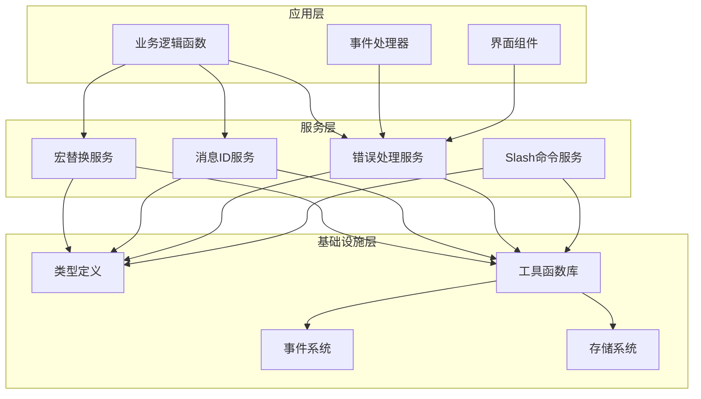
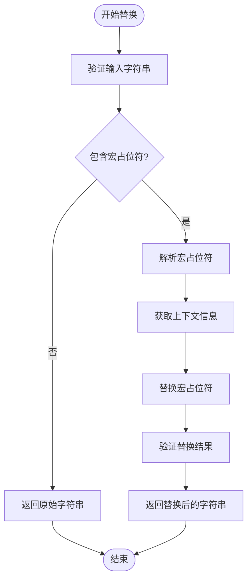
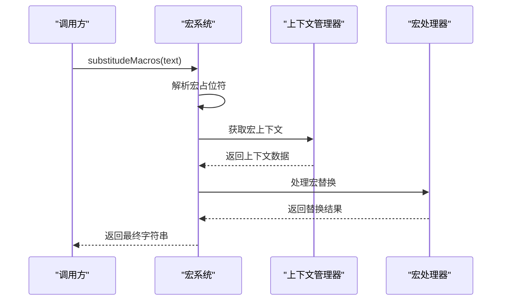
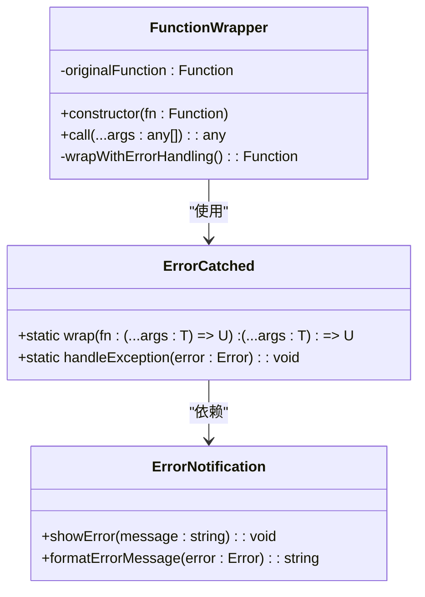
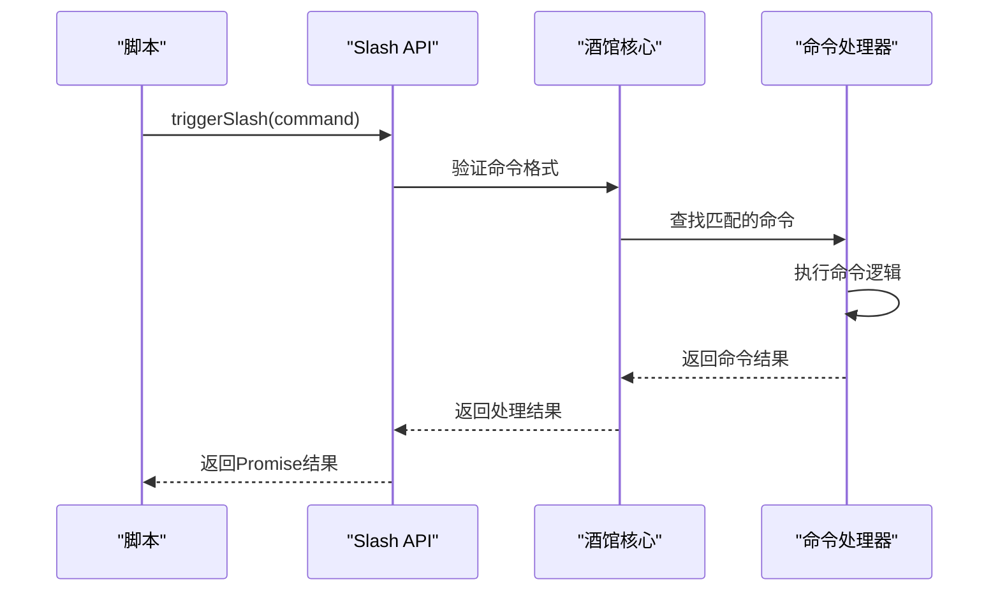

# 工具函数API

<cite>
**本文档引用的文件**
- [@types/function/util.d.ts](file://@types/function/util.d.ts)
- [util/common.ts](file://util/common.ts)
- [util/mvu.ts](file://util/mvu.ts)
- [util/streaming.ts](file://util/streaming.ts)
- [@types/function/macro_like.d.ts](file://@types/function/macro_like.d.ts)
- [@types/function/slash.d.ts](file://@types/function/slash.d.ts)
- [@types/function/chat_message.d.ts](file://@types/function/chat_message.d.ts)
- [@types/iframe/util.d.ts](file://@types/iframe/util.d.ts)
- [参考脚本示例/slash_command.txt](file://参考脚本示例/slash_command.txt)
</cite>

## 目录
1. [简介](#简介)
2. [项目结构](#项目结构)
3. [核心组件](#核心组件)
4. [架构概览](#架构概览)
5. [详细组件分析](#详细组件分析)
6. [依赖关系分析](#依赖关系分析)
7. [性能考虑](#性能考虑)
8. [故障排除指南](#故障排除指南)
9. [结论](#结论)

## 简介

本文档详细介绍了酒馆助手（SillyTavern）环境下的工具函数API，重点涵盖宏替换、消息ID获取、错误处理等实用工具函数。这些函数为开发者提供了在酒馆环境中进行高效开发的基础能力，包括：

- **宏替换系统**：支持在字符串中进行宏变量替换，实现动态内容生成
- **消息ID管理**：提供获取最新消息ID、根据iframe名称获取消息ID等功能
- **错误处理机制**：通过包装函数实现优雅的错误捕获和用户友好的错误提示
- **Slash命令集成**：支持触发酒馆内置的Slash命令系统
- **宏注册机制**：允许开发者注册自定义宏处理器，扩展宏系统的功能

这些工具函数共同构成了酒馆助手脚本开发的核心基础设施，为复杂的交互式应用提供了稳定可靠的技术支撑。

## 项目结构

该项目采用模块化的组织方式，主要分为以下几个核心部分：

```mermaid
graph TB
subgraph "类型定义(@types)"
A[@types/function/util.d.ts]
B[@types/function/macro_like.d.ts]
C[@types/function/slash.d.ts]
D[@types/function/chat_message.d.ts]
E[@types/iframe/util.d.ts]
end
subgraph "工具实现(util)"
F[util/common.ts]
G[util/mvu.ts]
H[util/streaming.ts]
I[util/script.ts]
end
subgraph "示例代码"
J[示例/脚本示例/]
K[示例/前端界面示例/]
end
A --> F
B --> F
C --> H
D --> H
E --> H
F --> G
F --> H
G --> H
```

**图表来源**
- [@types/function/util.d.ts:1-44](file://@types/function/util.d.ts#L1-L44)
- [util/common.ts:1-135](file://util/common.ts#L1-L135)

**章节来源**
- [@types/function/util.d.ts:1-44](file://@types/function/util.d.ts#L1-L44)
- [util/common.ts:1-135](file://util/common.ts#L1-L135)

## 核心组件

本节详细介绍三个最重要的工具函数及其相关组件：

### 1. 宏替换系统 (substitudeMacros)

宏替换系统是整个工具函数API的核心功能之一，负责将字符串中的宏占位符替换为实际的值。

**函数签名与行为**：
- **函数名**：substitudeMacros
- **参数类型**：string
- **返回值类型**：string
- **功能描述**：将输入字符串中的宏占位符（如 `{{char}}`、`{{lastMessageId}}`）替换为对应的实际值

**宏类型支持**：
- 角色相关宏：`{{char}}`、`{{user}}`、`{{name}}` 等
- 消息相关宏：`{{lastMessageId}}`、`{{message}}` 等
- 时间相关宏：`{{datetime}}`、`{{timestamp}}` 等
- 自定义宏：通过 `registerMacroLike` 注册的自定义宏

### 2. 消息ID管理系统

消息ID管理系统提供多种方式来获取和管理消息楼层的标识符。

**核心函数**：
- `getLastMessageId()`: 获取最新消息的楼层ID
- `getMessageId(iframe_name: string)`: 通过iframe名称获取对应的消息ID

**使用场景**：
- 动态定位消息位置
- 实现消息间的导航和跳转
- 构建消息链路追踪系统

### 3. 错误处理包装器 (errorCatched)

错误处理包装器提供了一种优雅的方式来处理函数执行中的异常情况。

**函数特性**：
- **参数类型**：泛型函数 `(fn: (...args: T) => U)`
- **返回值类型**：包装后的同功能函数 `(...args: T) => U`
- **核心行为**：捕获函数执行中的异常，并通过酒馆的通知系统向用户显示友好错误信息

**设计优势**：
- 保持原有函数的签名和行为不变
- 提供统一的错误处理策略
- 自动将错误信息转换为用户可理解的格式

**章节来源**
- [@types/function/util.d.ts:1-44](file://@types/function/util.d.ts#L1-L44)
- [util/common.ts:33-60](file://util/common.ts#L33-L60)

## 架构概览

整个工具函数API采用分层架构设计，确保各组件之间的松耦合和高内聚：



**图表来源**
- [@types/function/util.d.ts:1-44](file://@types/function/util.d.ts#L1-L44)
- [util/common.ts:1-135](file://util/common.ts#L1-L135)
- [util/mvu.ts:1-66](file://util/mvu.ts#L1-L66)

这种架构设计的优势在于：
- **可扩展性**：新增功能只需在相应的服务层实现
- **可测试性**：每个服务层都可以独立测试
- **可维护性**：清晰的职责分离使得代码易于维护

## 详细组件分析

### 宏替换系统详细分析

#### 核心实现机制

宏替换系统通过以下步骤实现字符串宏替换：



**图表来源**
- [util/common.ts:33-60](file://util/common.ts#L33-L60)

#### 宏类型与处理流程

宏替换系统支持多种类型的宏，每种宏都有其特定的处理逻辑：

**宏类型分类**：
1. **角色宏**：`{{char}}`、`{{user}}`、`{{name}}` 等
2. **消息宏**：`{{lastMessageId}}`、`{{message}}` 等
3. **时间宏**：`{{datetime}}`、`{{timestamp}}` 等
4. **自定义宏**：通过 `registerMacroLike` 注册的宏

**处理流程**：


**图表来源**
- [@types/function/util.d.ts:1-11](file://@types/function/util.d.ts#L1-L11)
- [@types/function/macro_like.d.ts:1-37](file://@types/function/macro_like.d.ts#L1-L37)

**章节来源**
- [@types/function/util.d.ts:1-11](file://@types/function/util.d.ts#L1-L11)
- [@types/function/macro_like.d.ts:1-37](file://@types/function/macro_like.d.ts#L1-L37)
- [util/common.ts:33-60](file://util/common.ts#L33-L60)

### 错误处理包装器深入分析

#### 包装器设计模式

errorCatched函数实现了装饰器设计模式，为任意函数提供透明的错误处理能力：



**图表来源**
- [@types/function/util.d.ts:20-33](file://@types/function/util.d.ts#L20-L33)

#### 错误处理策略

errorCatched采用多层次的错误处理策略：

**处理层次**：
1. **异常捕获**：使用try-catch机制捕获所有运行时异常
2. **信息收集**：收集错误的详细信息，包括堆栈跟踪
3. **格式化处理**：将技术性错误转换为用户友好的消息
4. **通知显示**：通过酒馆的通知系统向用户显示错误信息

**章节来源**
- [@types/function/util.d.ts:20-33](file://@types/function/util.d.ts#L20-L33)

### Slash命令集成系统

#### 命令触发机制

Slash命令系统提供了与酒馆内置命令交互的能力：



**图表来源**
- [@types/function/slash.d.ts:1-29](file://@types/function/slash.d.ts#L1-L29)

#### 命令类型与参数

Slash命令系统支持多种命令类型，每种命令都有特定的用途和参数要求：

**常用命令类型**：
- **信息显示**：`/echo`、`/info`、`/warn` 等
- **消息操作**：`/trigger`、`/delete`、`/edit` 等
- **系统控制**：`/reload`、`/restart`、`/shutdown` 等
- **调试工具**：`/debug`、`/log`、`/trace` 等

**章节来源**
- [@types/function/slash.d.ts:1-29](file://@types/function/slash.d.ts#L1-L29)
- [参考脚本示例/slash_command.txt](file://参考脚本示例/slash_command.txt)

## 依赖关系分析

工具函数API的依赖关系体现了清晰的分层架构：

```mermaid
graph TB
subgraph "外部依赖"
A[Lodash]
B[Vue.js]
C[Precision]
D[Zod]
end
subgraph "内部模块"
E[util/common.ts]
F[util/mvu.ts]
G[util/streaming.ts]
H[util/script.ts]
end
subgraph "类型定义"
I[@types/function/util.d.ts]
J[@types/function/macro_like.d.ts]
K[@types/function/slash.d.ts]
L[@types/function/chat_message.d.ts]
M[@types/iframe/util.d.ts]
end
I --> E
J --> E
K --> G
L --> G
M --> G
E --> F
E --> G
F --> G
G --> A
G --> B
E --> C
E --> D
```

**图表来源**
- [util/common.ts:1-135](file://util/common.ts#L1-L135)
- [util/mvu.ts:1-66](file://util/mvu.ts#L1-L66)
- [util/streaming.ts:1-238](file://util/streaming.ts#L1-L238)

**依赖特点**：
- **最小化原则**：仅依赖必要的外部库
- **功能分离**：不同模块承担不同的职责
- **版本控制**：通过package.json管理依赖版本

**章节来源**
- [util/common.ts:1-135](file://util/common.ts#L1-L135)
- [util/mvu.ts:1-66](file://util/mvu.ts#L1-L66)
- [util/streaming.ts:1-238](file://util/streaming.ts#L1-L238)

## 性能考虑

在设计工具函数API时，性能是一个重要的考量因素。以下是针对各个组件的性能优化策略：

### 宏替换性能优化

1. **缓存机制**：对已解析的宏模式进行缓存，避免重复解析
2. **延迟计算**：仅在需要时才执行宏替换操作
3. **批量处理**：支持批量宏替换，减少函数调用开销

### 错误处理性能

1. **异步处理**：错误通知采用异步方式，避免阻塞主线程
2. **条件检查**：仅在必要时进行错误处理包装
3. **资源清理**：及时清理错误处理相关的临时资源

### Slash命令性能

1. **命令缓存**：缓存已注册的命令处理器
2. **并发控制**：限制同时执行的命令数量
3. **超时机制**：为长时间运行的命令设置超时保护

## 故障排除指南

### 常见问题与解决方案

#### 宏替换失败

**问题症状**：
- 宏占位符未被正确替换
- 替换结果为空字符串
- 抛出语法错误异常

**可能原因**：
1. 宏名称拼写错误
2. 缺少必要的上下文信息
3. 宏定义格式不正确

**解决步骤**：
1. 验证宏名称的正确性
2. 检查宏上下文的可用性
3. 确认宏定义的格式规范

#### 错误处理失效

**问题症状**：
- 函数异常时没有显示错误通知
- 错误信息显示不完整
- 包装后的函数行为异常

**可能原因**：
1. errorCatched包装器使用不当
2. 异常类型不受支持
3. 通知系统配置问题

**解决步骤**：
1. 检查errorCatched的正确使用方式
2. 确认异常类型被正确捕获
3. 验证通知系统的配置

#### Slash命令执行失败

**问题症状**：
- 命令执行无响应
- 返回undefined结果
- 抛出命令不存在异常

**可能原因**：
1. 命令名称拼写错误
2. 命令参数格式不正确
3. 命令权限不足

**解决步骤**：
1. 验证命令名称的准确性
2. 检查命令参数的格式
3. 确认执行权限

**章节来源**
- [@types/function/util.d.ts:1-44](file://@types/function/util.d.ts#L1-L44)
- [@types/function/slash.d.ts:1-29](file://@types/function/slash.d.ts#L1-L29)

## 结论

工具函数API为酒馆助手环境提供了强大而灵活的开发基础。通过精心设计的宏替换系统、消息ID管理、错误处理机制和Slash命令集成，开发者可以构建出功能丰富、用户体验优秀的交互式应用。

### 主要优势

1. **易用性**：简洁的API设计，降低学习成本
2. **可靠性**：完善的错误处理和类型安全保证
3. **扩展性**：模块化的架构支持功能扩展
4. **性能**：优化的设计确保高效的运行性能

### 未来发展方向

1. **功能增强**：持续扩展宏系统和Slash命令的功能
2. **性能优化**：进一步提升系统的运行效率
3. **文档完善**：提供更详细的使用指南和技术文档
4. **社区贡献**：鼓励社区参与功能开发和改进

这些工具函数API不仅为当前的开发需求提供了坚实的基础，也为未来的功能扩展和技术演进奠定了良好的技术基础。