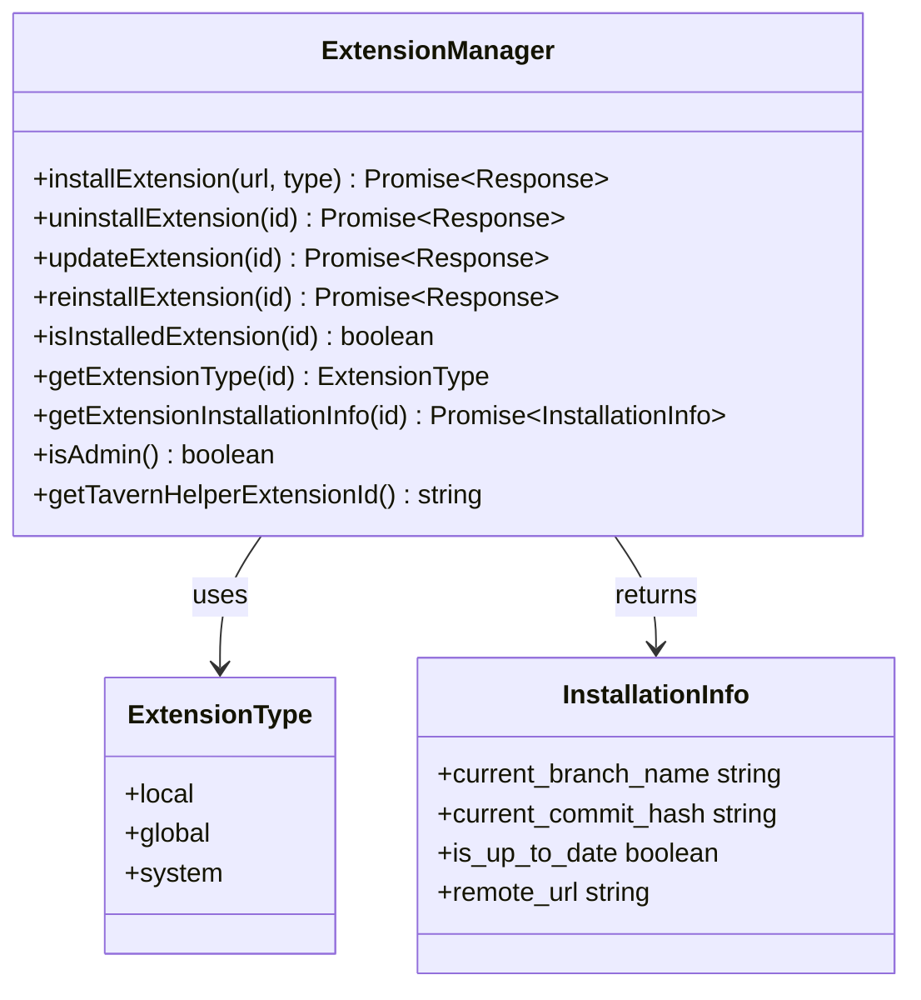
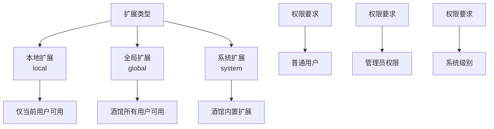
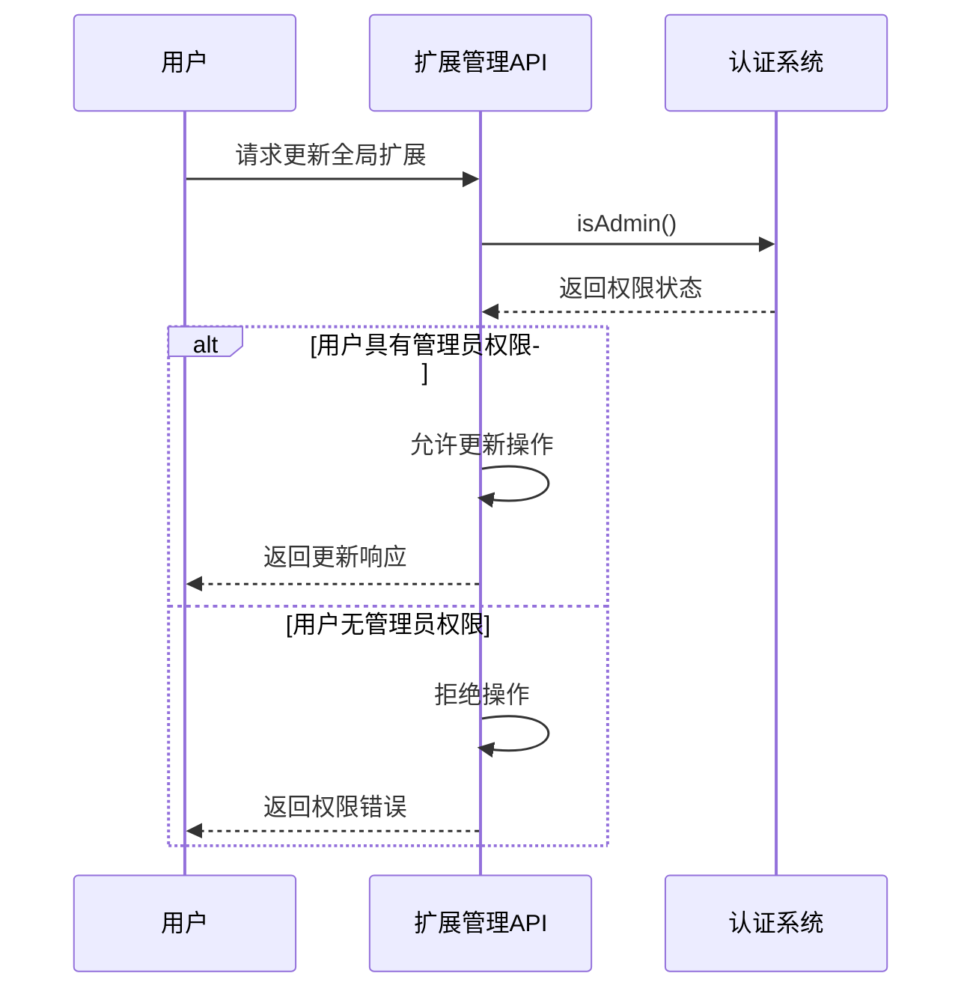
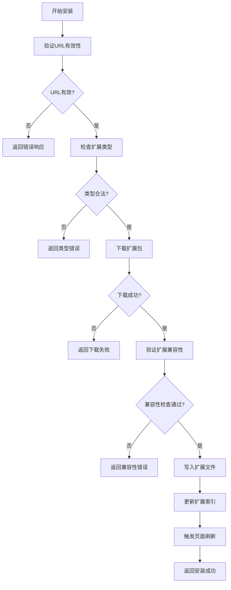
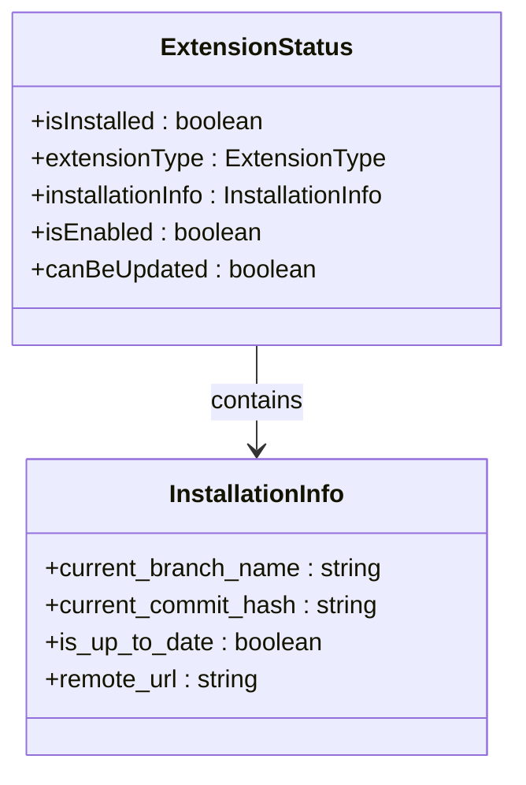
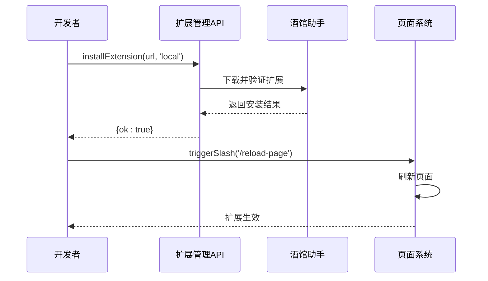

# 扩展管理API

<cite>
**本文档引用的文件**
- [@types\function\extension.d.ts](file://@types/function/extension.d.ts)
- [util\script.ts](file://util/script.ts)
- [package.json](file://package.json)
- [slash_command.txt](file://slash_command.txt)
- [示例\脚本示例\设置界面.vue](file://示例/脚本示例/设置界面.vue)
- [示例\脚本示例\设置界面.ts](file://示例/脚本示例/设置界面.ts)
- [参考脚本示例\@types\function\extension.d.ts](file://参考脚本示例/@types/function/extension.d.ts)
</cite>

## 目录
1. [简介](#简介)
2. [项目结构](#项目结构)
3. [核心组件](#核心组件)
4. [架构概览](#架构概览)
5. [详细组件分析](#详细组件分析)
6. [依赖关系分析](#依赖关系分析)
7. [性能考虑](#性能考虑)
8. [故障排除指南](#故障排除指南)
9. [结论](#结论)

## 简介

扩展管理API是酒馆助手（SillyTavern）生态系统中的关键组件，负责管理扩展的生命周期。该API提供了完整的扩展管理功能，包括安装、卸载、更新、重新安装以及状态查询等操作。

本文档详细介绍了扩展管理API的设计架构、核心函数、参数类型、返回值以及实际使用示例。特别关注了扩展类型系统、管理员权限控制和扩展兼容性检查机制。

## 项目结构

扩展管理API主要分布在以下关键文件中：

```mermaid
graph TB
subgraph "扩展管理API核心"
A[@types/function/extension.d.ts]
B[util/script.ts]
end
subgraph "示例实现"
C[示例/脚本示例/设置界面.vue]
D[示例/脚本示例/设置界面.ts]
end
subgraph "配置文件"
E[package.json]
F[slash_command.txt]
end
A --> C
A --> D
B --> C
E --> A
F --> A
```

**图表来源**
- [@types\function\extension.d.ts:1-105](file://@types/function/extension.d.ts#L1-L105)
- [util\script.ts:1-47](file://util/script.ts#L1-L47)

**章节来源**
- [@types\function\extension.d.ts:1-105](file://@types/function/extension.d.ts#L1-L105)
- [util\script.ts:1-47](file://util/script.ts#L1-L47)

## 核心组件

扩展管理API的核心由以下五个主要函数组成：

### 1. 安装扩展函数
- **函数名**: `installExtension`
- **功能**: 安装指定URL的扩展到指定类型中
- **参数**: 
  - `url`: 扩展URL地址
  - `type`: 扩展类型 ('local' | 'global')
- **返回值**: Promise<Response>
- **特点**: 新安装的扩展需要刷新页面才生效

### 2. 卸载扩展函数
- **函数名**: `uninstallExtension`
- **功能**: 卸载指定ID的扩展
- **参数**: `extension_id`: 扩展ID
- **返回值**: Promise<Response>
- **特点**: 卸载后需要刷新页面才生效

### 3. 更新扩展函数
- **函数名**: `updateExtension`
- **功能**: 更新指定ID的扩展
- **参数**: `extension_id`: 扩展ID
- **返回值**: Promise<Response>
- **特点**: 更新后需要刷新页面才生效

### 4. 重新安装扩展函数
- **函数名**: `reinstallExtension`
- **功能**: 重新安装指定ID的扩展
- **参数**: `extension_id`: 扩展ID
- **返回值**: Promise<Response>
- **特点**: 重新安装后需要刷新页面才生效

### 5. 扩展状态查询函数
- **函数名**: `isInstalledExtension`
- **功能**: 检查扩展是否已安装
- **参数**: `extension_id`: 扩展ID
- **返回值**: boolean
- **特点**: 返回布尔值表示安装状态

**章节来源**
- [@types\function\extension.d.ts:42-104](file://@types/function/extension.d.ts#L42-L104)

## 架构概览

扩展管理API采用声明式设计模式，通过TypeScript类型定义提供完整的API契约：



**图表来源**
- [@types\function\extension.d.ts:1-105](file://@types/function/extension.d.ts#L1-L105)

## 详细组件分析

### 扩展类型系统

扩展管理系统支持三种扩展类型：



**图表来源**
- [@types\function\extension.d.ts:8-15](file://@types/function/extension.d.ts#L8-L15)

#### 权限控制机制

管理员权限检查是全局扩展管理的关键安全机制：



**图表来源**
- [@types\function\extension.d.ts:1-2](file://@types/function/extension.d.ts#L1-L2)

**章节来源**
- [@types\function\extension.d.ts:1-15](file://@types/function/extension.d.ts#L1-L15)

### 安装流程详解

扩展安装过程涉及多个步骤和验证：



**图表来源**
- [@types\function\extension.d.ts:43-58](file://@types/function/extension.d.ts#L43-L58)

**章节来源**
- [@types\function\extension.d.ts:43-58](file://@types/function/extension.d.ts#L43-L58)

### 状态查询机制

扩展状态查询提供了多维度的状态检查能力：



**图表来源**
- [@types\function\extension.d.ts:17-29](file://@types/function/extension.d.ts#L17-L29)

**章节来源**
- [@types\function\extension.d.ts:17-29](file://@types/function/extension.d.ts#L17-L29)

### 实际使用示例

以下是一个完整的扩展管理场景示例：



**图表来源**
- [@types\function\extension.d.ts:51-57](file://@types/function/extension.d.ts#L51-L57)

**章节来源**
- [@types\function\extension.d.ts:51-57](file://@types/function/extension.d.ts#L51-L57)

## 依赖关系分析

扩展管理API与项目其他组件存在紧密的依赖关系：

```mermaid
graph LR
subgraph "外部依赖"
A[jquery]
B[lodash]
C[toastr]
D[vue]
end
subgraph "内部模块"
E[util/script.ts]
F[@types/function/extension.d.ts]
G[示例/脚本示例]
end
A --> E
B --> E
C --> F
D --> G
E --> F
F --> G
```

**图表来源**
- [package.json:89-106](file://package.json#L89-L106)
- [util\script.ts:1-47](file://util/script.ts#L1-L47)

**章节来源**
- [package.json:79-107](file://package.json#L79-L107)

## 性能考虑

扩展管理API在设计时充分考虑了性能优化：

### 缓存策略
- 扩展元数据缓存
- 安装状态缓存
- 权限检查缓存

### 并发控制
- 扩展安装队列
- 并发更新限制
- 资源竞争避免

### 内存管理
- 扩展卸载清理
- 事件监听器移除
- DOM元素回收

## 故障排除指南

### 常见问题及解决方案

| 问题类型 | 症状 | 解决方案 |
|---------|------|----------|
| 权限错误 | 更新全局扩展失败 | 确认管理员身份，使用isAdmin()检查 |
| 安装失败 | 扩展无法安装 | 检查URL有效性，验证扩展兼容性 |
| 状态异常 | 扩展状态查询错误 | 刷新页面，重新加载扩展 |
| 兼容性问题 | 扩展运行异常 | 检查版本兼容性，更新扩展 |

### 调试技巧

1. **启用详细日志**: 使用toastr记录扩展状态变化
2. **监控网络请求**: 检查扩展下载进度
3. **验证权限**: 确保管理员权限正确获取
4. **测试兼容性**: 验证扩展与当前版本的兼容性

**章节来源**
- [@types\function\extension.d.ts:1-105](file://@types/function/extension.d.ts#L1-L105)

## 结论

扩展管理API为酒馆助手生态系统提供了完整、安全、高效的扩展管理解决方案。通过清晰的类型定义、严格的权限控制和完善的错误处理机制，该API确保了扩展管理的安全性和可靠性。

关键特性包括：
- 多层次的权限控制机制
- 完整的扩展生命周期管理
- 实时的状态查询和监控
- 友好的错误处理和调试支持
- 高效的性能优化策略

该API的设计充分体现了现代Web应用的最佳实践，为开发者提供了强大而灵活的扩展管理能力。