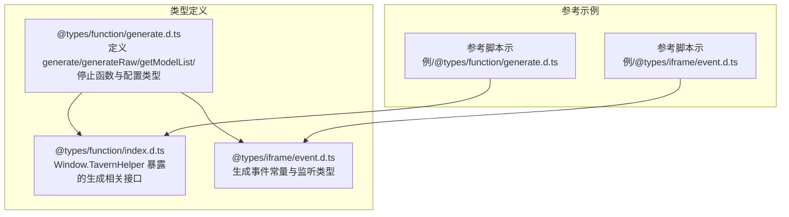
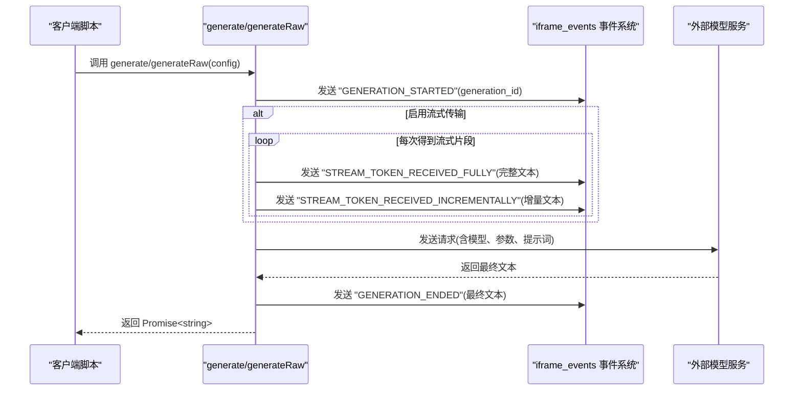
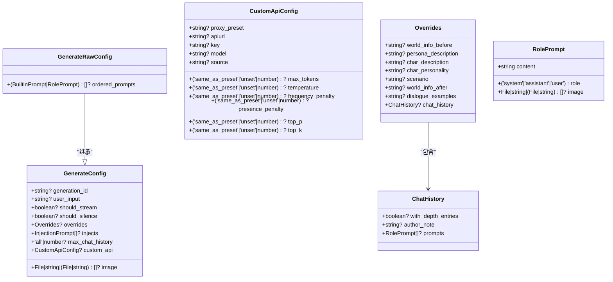

# 文本生成API

<cite>
**本文引用的文件**
- [@types/function/generate.d.ts](file://@types/function/generate.d.ts)
- [@types/function/index.d.ts](file://@types/function/index.d.ts)
- [@types/iframe/event.d.ts](file://@types/iframe/event.d.ts)
- 参考脚本示例/@types/function/generate.d.ts
- 参考脚本示例/@types/iframe/event.d.ts
- 示例/脚本示例/监听消息修改.ts
</cite>

## 目录
1. [简介](#简介)
2. [项目结构](#项目结构)
3. [核心组件](#核心组件)
4. [架构总览](#架构总览)
5. [详细组件分析](#详细组件分析)
6. [依赖关系分析](#依赖关系分析)
7. [性能考量](#性能考量)
8. [故障排查指南](#故障排查指南)
9. [结论](#结论)
10. [附录](#附录)

## 简介
本文件面向使用“文本生成API”的开发者与使用者，系统化梳理 generate、generateRaw、getModelList、stopGenerationById 等函数的功能、参数、返回值与典型用法。文档同时解释生成参数配置、模型选择策略与生成停止机制，并提供基于仓库内类型定义的实际代码示例路径，帮助快速上手与稳定集成。

## 项目结构
围绕文本生成API的关键类型与接口位于 @types/function 目录，配套的事件类型位于 @types/iframe 目录；参考示例同样提供对应类型定义以便对照。

图表来源
- [@types/function/generate.d.ts:1-318](file://@types/function/generate.d.ts#L1-L318)
- [@types/function/index.d.ts:1-170](file://@types/function/index.d.ts#L1-L170)
- [@types/iframe/event.d.ts:159-284](file://@types/iframe/event.d.ts#L159-L284)
- 参考脚本示例/@types/function/generate.d.ts
- 参考脚本示例/@types/iframe/event.d.ts

章节来源
- [@types/function/generate.d.ts:1-318](file://@types/function/generate.d.ts#L1-L318)
- [@types/function/index.d.ts:1-170](file://@types/function/index.d.ts#L1-L170)
- [@types/iframe/event.d.ts:159-284](file://@types/iframe/event.d.ts#L159-L284)

## 核心组件
- generate：使用当前启用的预设生成文本，支持流式传输、静默生成、图片输入、覆盖与注入提示词、限制聊天历史、自定义API等。
- generateRaw：不使用预设，直接按传入的提示词顺序生成文本，适合高度定制化的提示词组合。
- getModelList：获取可用模型列表，便于动态选择模型。
- stopGenerationById：根据生成请求唯一标识符停止特定生成。
- stopAllGeneration：停止所有正在进行的生成请求。
- 事件系统：GENERATION_STARTED、STREAM_TOKEN_RECEIVED_FULLY、STREAM_TOKEN_RECEIVED_INCREMENTALLY、GENERATION_ENDED。

章节来源
- [@types/function/generate.d.ts:91-168](file://@types/function/generate.d.ts#L91-L168)
- [@types/function/index.d.ts:50-56](file://@types/function/index.d.ts#L50-L56)
- [@types/iframe/event.d.ts:172-183](file://@types/iframe/event.d.ts#L172-L183)

## 架构总览
下图展示了文本生成API的调用与事件交互流程，包括生成触发、流式事件与结束事件。

图表来源
- [@types/function/generate.d.ts:1-90](file://@types/function/generate.d.ts#L1-L90)
- [@types/iframe/event.d.ts:172-183](file://@types/iframe/event.d.ts#L172-L183)

## 详细组件分析

### generate 函数
- 功能：使用当前启用的预设生成文本，支持多种生成控制与提示词注入/覆盖。
- 参数类型：GenerateConfig
  - generation_id?: string（可选）：请求唯一标识符，用于停止特定生成与事件关联。
  - user_input?: string（可选）：用户输入文本。
  - image?: File | string | (File | string)[]（可选）：图片输入，支持 File、Base64、URL。
  - should_stream?: boolean（可选）：是否启用流式传输，默认 false。
  - should_silence?: boolean（可选）：是否静默生成，默认 false。
  - overrides?: Overrides（可选）：覆盖提示词字段。
  - injects?: Omit<InjectionPrompt, 'id'>[]（可选）：额外注入的提示词。
  - max_chat_history?: 'all' | number（可选）：最多使用多少条聊天历史，默认 'all'。
  - custom_api?: CustomApiConfig（可选）：自定义API配置。
- 返回值：Promise<string>，最终生成文本。
- 典型用法示例路径：
  - 基础生成：[示例路径:20-28](file://@types/function/generate.d.ts#L20-L28)
  - 图片输入：[示例路径:26-28](file://@types/function/generate.d.ts#L26-L28)
  - 注入与覆盖提示词：[示例路径:31-43](file://@types/function/generate.d.ts#L31-L43)
  - 自定义API与代理预设：[示例路径:46-67](file://@types/function/generate.d.ts#L46-L67)
  - 切换模型（当前源）：[示例路径:69-77](file://@types/function/generate.d.ts#L69-L77)
  - 流式生成（事件监听）：[示例路径:80-89](file://@types/function/generate.d.ts#L80-L89)

章节来源
- [@types/function/generate.d.ts:1-91](file://@types/function/generate.d.ts#L1-L91)
- [@types/function/generate.d.ts:170-226](file://@types/function/generate.d.ts#L170-L226)

### generateRaw 函数
- 功能：不使用预设，按传入的提示词顺序生成文本，适合自定义提示词序列。
- 参数类型：GenerateRawConfig（继承 GenerateConfig，并新增 ordered_prompts）
  - ordered_prompts?: (BuiltinPrompt | RolePrompt)[]（可选）：提示词顺序数组，元素可为内置提示词或自定义 RolePrompt。
- 返回值：Promise<string>，最终生成文本。
- 典型用法示例路径：
  - 自定义内置提示词顺序：[示例路径:113-124](file://@types/function/generate.d.ts#L113-L124)
  - 自定义API与自定义提示词顺序：[示例路径:126-142](file://@types/function/generate.d.ts#L126-L142)

章节来源
- [@types/function/generate.d.ts:93-144](file://@types/function/generate.d.ts#L93-L144)
- [@types/function/generate.d.ts:228-236](file://@types/function/generate.d.ts#L228-L236)

### getModelList 函数
- 功能：获取可用模型列表。
- 参数类型：custom_api: { apiurl: string; key?: string }
- 返回值：Promise<string[]>，模型名称数组。
- 典型用法示例路径：
  - 获取模型列表：[示例路径:146-153](file://@types/function/generate.d.ts#L146-L153)

章节来源
- [@types/function/generate.d.ts:146-153](file://@types/function/generate.d.ts#L146-L153)

### stopGenerationById 与 stopAllGeneration 函数
- 功能：
  - stopGenerationById(generation_id: string): 根据生成请求唯一标识符停止特定生成。
  - stopAllGeneration(): 停止所有正在进行的生成请求。
- 返回值：boolean，是否成功停止。
- 典型用法示例路径：
  - 停止单个生成：[示例路径:155-161](file://@types/function/generate.d.ts#L155-L161)
  - 停止全部生成：[示例路径:163-168](file://@types/function/generate.d.ts#L163-L168)

章节来源
- [@types/function/generate.d.ts:155-168](file://@types/function/generate.d.ts#L155-L168)

### 生成参数配置与模型选择
- 生成控制参数：
  - should_stream：启用流式传输，配合事件监听获取增量/完整文本。
  - should_silence：静默生成，不影响页面停止按钮状态，可通过 generation_id 或 stopAllGeneration 停止。
  - max_chat_history：限制聊天历史数量或使用全部。
  - image：支持 File、Base64、URL 三种输入形式。
- 提示词注入与覆盖：
  - injects：额外注入提示词，支持 role/system/assistant/user。
  - overrides：覆盖内置提示词字段，如角色描述、世界信息、聊天历史等。
- 自定义API配置（CustomApiConfig）：
  - proxy_preset：使用代理预设名称。
  - apiurl/key/model/source：自定义API地址、密钥、模型与源。
  - temperature/top_p/top_k/frequency_penalty/presence_penalty/max_tokens：推理参数与上限控制。
- 模型选择策略：
  - 使用当前源但切换模型：仅设置 model 字段即可。
  - 使用代理预设：指定 proxy_preset 名称。
  - 自定义API：指定 apiurl、key、model、source 等。

章节来源
- [@types/function/generate.d.ts:170-318](file://@types/function/generate.d.ts#L170-L318)

### 生成停止机制
- generation_id：每个生成请求的唯一标识符，用于 stopGenerationById 与事件关联。
- 停止策略：
  - 页面停止按钮：非静默生成会受页面停止按钮影响。
  - 代码停止：静默生成可通过 generation_id 或 stopAllGeneration 停止。
- 事件关联：生成开始与结束均携带 generation_id，便于事件监听与停止操作。

章节来源
- [@types/function/generate.d.ts:170-210](file://@types/function/generate.d.ts#L170-L210)
- [@types/iframe/event.d.ts:172-183](file://@types/iframe/event.d.ts#L172-L183)

### 事件系统与流式传输
- 事件常量：
  - GENERATION_STARTED：生成开始，携带 generation_id。
  - STREAM_TOKEN_RECEIVED_FULLY：流式传输完整文本。
  - STREAM_TOKEN_RECEIVED_INCREMENTALLY：流式传输增量文本。
  - GENERATION_ENDED：生成结束，携带最终文本与 generation_id。
- 监听方式：使用 eventOn 监听对应事件，结合 should_stream 实现流式体验。

章节来源
- [@types/iframe/event.d.ts:172-183](file://@types/iframe/event.d.ts#L172-L183)
- [@types/function/generate.d.ts:80-89](file://@types/function/generate.d.ts#L80-L89)

## 依赖关系分析
- generate/generateRaw 依赖：
  - 事件系统：发送与接收生成相关事件。
  - 自定义API配置：决定模型源、密钥、模型与推理参数。
  - 提示词注入/覆盖：决定提示词内容与顺序。
- 停止函数依赖：
  - generation_id：唯一标识生成请求，用于精准停止。
  - 事件系统：确保停止操作与生成生命周期一致。

图表来源
- [@types/function/generate.d.ts:170-318](file://@types/function/generate.d.ts#L170-L318)

章节来源
- [@types/function/generate.d.ts:170-318](file://@types/function/generate.d.ts#L170-L318)

## 性能考量
- 流式传输：启用 should_stream 可降低感知延迟，但需注意事件处理与内存占用。
- 聊天历史限制：合理设置 max_chat_history，避免过长上下文导致性能下降。
- 推理参数：temperature、top_p、top_k、频率/存在惩罚等参数会影响生成质量与速度，建议按场景微调。
- 图片输入：Base64/URL 会增加请求体积，建议优先使用 URL 或压缩后的 File。
- 停止策略：静默生成便于细粒度控制，但需妥善管理 generation_id 与事件监听，避免资源泄漏。

## 故障排查指南
- 无法接收流式事件
  - 确认已启用 should_stream。
  - 确认已在生成前监听 STREAM_TOKEN_RECEIVED_FULLY/INCREMENTALLY。
  - 参考事件监听示例路径：[示例路径:82-85](file://@types/function/generate.d.ts#L82-L85)
- 生成无法停止
  - 非静默生成：点击页面停止按钮。
  - 静默生成：使用 stopGenerationById(generation_id) 或 stopAllGeneration()。
  - 确保 generation_id 正确传递与保存。
- 模型列表获取失败
  - 检查 custom_api 的 apiurl 与 key 配置。
  - 参考示例路径：[示例路径:146-153](file://@types/function/generate.d.ts#L146-L153)
- 提示词未生效
  - generate：确认 overrides 与 injects 的字段与位置。
  - generateRaw：确认 ordered_prompts 的顺序与 RolePrompt 的 role/content。
  - 参考示例路径：
    - [generate 注入与覆盖:31-43](file://@types/function/generate.d.ts#L31-L43)
    - [generateRaw 自定义顺序:113-124](file://@types/function/generate.d.ts#L113-L124)

章节来源
- [@types/function/generate.d.ts:80-168](file://@types/function/generate.d.ts#L80-L168)
- [@types/iframe/event.d.ts:172-183](file://@types/iframe/event.d.ts#L172-L183)

## 结论
本文基于仓库内的类型定义，系统梳理了文本生成API的核心能力与使用方法。通过合理配置生成参数、选择模型、利用事件系统与停止机制，可在保证性能与稳定性的同时，灵活满足多样化的生成需求。建议在实际项目中结合示例路径进行验证与迭代。

## 附录
- 实际代码示例路径（不直接展示代码内容）：
  - generate 基础生成：[示例路径:20-28](file://@types/function/generate.d.ts#L20-L28)
  - generate 图片输入：[示例路径:26-28](file://@types/function/generate.d.ts#L26-L28)
  - generate 注入与覆盖提示词：[示例路径:31-43](file://@types/function/generate.d.ts#L31-L43)
  - generate 自定义API与代理预设：[示例路径:46-67](file://@types/function/generate.d.ts#L46-L67)
  - generate 切换模型（当前源）：[示例路径:69-77](file://@types/function/generate.d.ts#L69-L77)
  - generate 流式生成（事件监听）：[示例路径:80-89](file://@types/function/generate.d.ts#L80-L89)
  - generateRaw 自定义内置提示词顺序：[示例路径:113-124](file://@types/function/generate.d.ts#L113-L124)
  - generateRaw 自定义API与自定义提示词顺序：[示例路径:126-142](file://@types/function/generate.d.ts#L126-L142)
  - getModelList 获取模型列表：[示例路径:146-153](file://@types/function/generate.d.ts#L146-L153)
  - stopGenerationById 停止单个生成：[示例路径:155-161](file://@types/function/generate.d.ts#L155-L161)
  - stopAllGeneration 停止全部生成：[示例路径:163-168](file://@types/function/generate.d.ts#L163-L168)
- 事件监听参考（脚本示例）：[示例路径:1-3](file://示例/脚本示例/监听消息修改.ts#L1-L3)