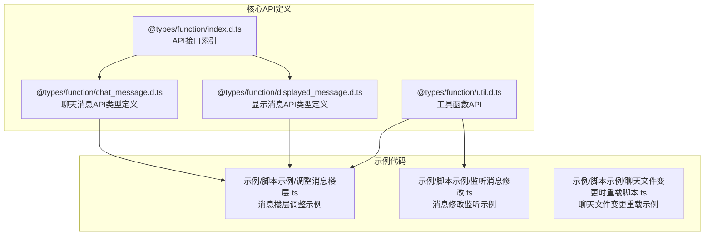
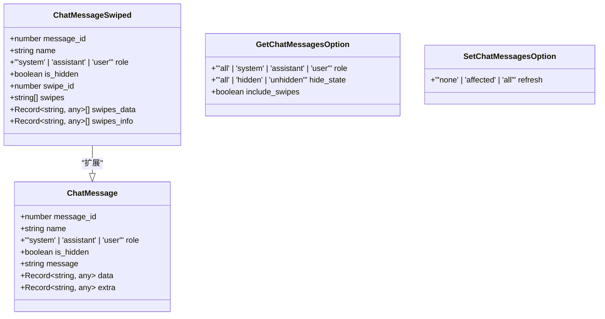
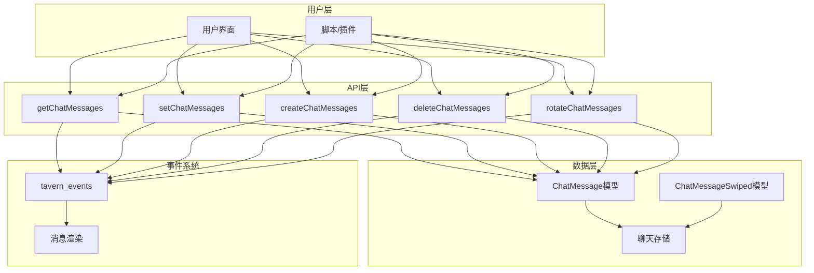
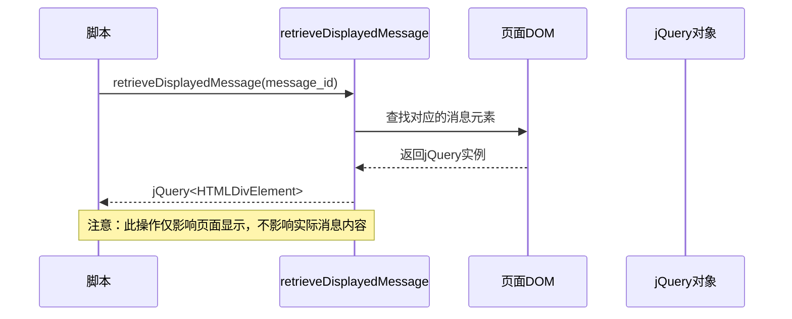
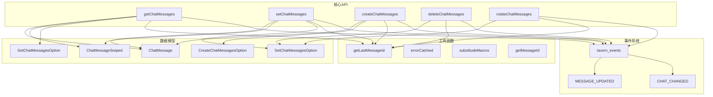

# 聊天消息API

<cite>
**本文档引用的文件**
- [@types/function/chat_message.d.ts](file://@types/function/chat_message.d.ts)
- [@types/function/displayed_message.d.ts](file://@types/function/displayed_message.d.ts)
- [@types/function/index.d.ts](file://@types/function/index.d.ts)
- [@types/function/util.d.ts](file://@types/function/util.d.ts)
- [示例/脚本示例/调整消息楼层.ts](file://示例/脚本示例/调整消息楼层.ts)
- [示例/脚本示例/监听消息修改.ts](file://示例/脚本示例/监听消息修改.ts)
- [示例/脚本示例/聊天文件变更时重载脚本.ts](file://示例/脚本示例/聊天文件变更时重载脚本.ts)
</cite>

## 目录
1. [简介](#简介)
2. [项目结构](#项目结构)
3. [核心组件](#核心组件)
4. [架构概览](#架构概览)
5. [详细组件分析](#详细组件分析)
6. [依赖关系分析](#依赖关系分析)
7. [性能考虑](#性能考虑)
8. [故障排除指南](#故障排除指南)
9. [结论](#结论)

## 简介

本文档详细介绍了酒馆助手（SillyTavern）中的聊天消息API，涵盖了聊天消息的获取、设置、创建、删除和旋转等核心操作。这些API允许开发者和脚本作者对聊天记录进行动态管理和操作，包括消息的查询、修改、新增、删除以及消息楼层的重新排列。

聊天消息API主要包含以下功能：
- 获取聊天消息：支持按楼层范围、角色类型、隐藏状态等多种条件筛选
- 设置聊天消息：修改消息内容、角色、隐藏状态等属性
- 创建聊天消息：在指定位置插入新的消息
- 删除聊天消息：移除不需要的消息楼层
- 旋转聊天消息：重新排列消息的顺序

## 项目结构

该项目采用模块化的组织方式，核心API定义位于`@types/function/`目录下，包含类型定义和接口声明。示例代码位于`示例/脚本示例/`目录中，展示了各种实际应用场景。



**图表来源**
- [@types/function/chat_message.d.ts:1-235](file://@types/function/chat_message.d.ts#L1-L235)
- [@types/function/displayed_message.d.ts:1-71](file://@types/function/displayed_message.d.ts#L1-L71)
- [@types/function/index.d.ts:1-170](file://@types/function/index.d.ts#L1-L170)

**章节来源**
- [@types/function/chat_message.d.ts:1-235](file://@types/function/chat_message.d.ts#L1-L235)
- [@types/function/displayed_message.d.ts:1-71](file://@types/function/displayed_message.d.ts#L1-L71)
- [@types/function/index.d.ts:1-170](file://@types/function/index.d.ts#L1-L170)

## 核心组件

聊天消息API的核心组件包括消息数据模型、操作函数和相关工具函数。这些组件共同构成了完整的聊天消息管理系统。

### 数据模型

聊天消息API定义了两种主要的数据结构：

1. **ChatMessage**：标准聊天消息结构
2. **ChatMessageSwiped**：包含多版本消息的结构



**图表来源**
- [@types/function/chat_message.d.ts:1-21](file://@types/function/chat_message.d.ts#L1-L21)

### 主要操作函数

聊天消息API提供了五个核心操作函数：

1. **getChatMessages**：获取聊天消息
2. **setChatMessages**：设置聊天消息
3. **createChatMessages**：创建聊天消息
4. **deleteChatMessages**：删除聊天消息
5. **rotateChatMessages**：旋转聊天消息

**章节来源**
- [@types/function/chat_message.d.ts:56-234](file://@types/function/chat_message.d.ts#L56-L234)

## 架构概览

聊天消息API采用分层架构设计，将数据模型、业务逻辑和用户界面分离，提供了清晰的接口抽象。



**图表来源**
- [@types/function/chat_message.d.ts:56-234](file://@types/function/chat_message.d.ts#L56-L234)
- [@types/function/index.d.ts:28-33](file://@types/function/index.d.ts#L28-L33)

## 详细组件分析

### getChatMessages 函数

getChatMessages函数用于获取聊天消息，支持多种筛选条件和返回格式。

#### 参数类型

| 参数名 | 类型 | 描述 | 默认值 |
|--------|------|------|--------|
| range | string \| number | 消息楼层号或楼层范围 | 必需 |
| option | GetChatMessagesOption | 可选配置选项 | undefined |

GetChatMessagesOption选项：

| 选项名 | 类型 | 描述 | 默认值 |
|--------|------|------|--------|
| role | 'all' \| 'system' \| 'assistant' \| 'user' | 按角色筛选消息 | 'all' |
| hide_state | 'all' \| 'hidden' \| 'unhidden' | 按隐藏状态筛选 | 'all' |
| include_swipes | boolean | 是否包含多版本消息 | false |

#### 返回值

- 当include_swipes为false或未设置时，返回ChatMessage[]
- 当include_swipes为true时，返回ChatMessageSwiped[]
- 当include_swipes未设置时，返回(ChatMessage | ChatMessageSwiped)[]

#### 使用示例

```typescript
// 获取单个楼层的消息
const singleMessage = getChatMessages(10);

// 获取最新楼层的消息
const latestMessage = getChatMessages(-1)[0];

// 获取所有楼层的消息
const allMessages = getChatMessages('0-{{lastMessageId}}');

// 获取特定角色的所有消息
const userMessages = getChatMessages('0-{{lastMessageId}}', { role: 'user' });

// 获取所有版本的消息（包含多版本）
const allVersions = getChatMessages(10, { include_swipes: true });
```

**章节来源**
- [@types/function/chat_message.d.ts:56-88](file://@types/function/chat_message.d.ts#L56-L88)

### setChatMessages 函数

setChatMessages函数用于修改现有聊天消息的内容和属性。

#### 参数类型

| 参数名 | 类型 | 描述 | 默认值 |
|--------|------|------|--------|
| chat_messages | Array<{ message_id: number } & (Partial<ChatMessage> \| Partial<ChatMessageSwiped>)> | 要修改的消息数组 | 必需 |
| option | SetChatMessagesOption | 可选配置选项 | undefined |

SetChatMessagesOption选项：

| 选项名 | 类型 | 描述 |
|--------|------|------|
| refresh | 'none' \| 'affected' \| 'all' | 页面刷新策略 |

#### 返回值

Promise<void>

#### 使用示例

```typescript
// 修改消息内容
await setChatMessages([
  { message_id: 10, message: '新的消息内容' }
]);

// 设置开局选项
await setChatMessages([
  { message_id: 0, swipes: ['开局1', '开局2'] }
]);

// 切换到特定开局
await setChatMessages([
  { message_id: 0, swipe_id: 2 }
]);

// 隐藏所有消息
const lastMessageId = getLastMessageId();
await setChatMessages(
  Array.from({ length: lastMessageId + 1 }, (_, i) => ({
    message_id: i, 
    is_hidden: true
  }))
);
```

**章节来源**
- [@types/function/chat_message.d.ts:150-153](file://@types/function/chat_message.d.ts#L150-L153)

### createChatMessages 函数

createChatMessages函数用于在指定位置创建新的聊天消息。

#### 参数类型

| 参数名 | 类型 | 描述 | 默认值 |
|--------|------|------|--------|
| chat_messages | ChatMessageCreating[] | 要创建的消息数组 | 必需 |
| option | CreateChatMessagesOption | 可选配置选项 | undefined |

CreateChatMessagesOption选项：

| 选项名 | 类型 | 描述 | 默认值 |
|--------|------|------|--------|
| insert_before | number \| 'end' | 插入位置 | 'end' |
| refresh | 'none' \| 'affected' \| 'all' | 页面刷新策略 | 'affected' |

ChatMessageCreating类型：

| 属性名 | 类型 | 描述 | 必需 |
|--------|------|------|------|
| role | 'system' \| 'assistant' \| 'user' | 消息角色 | 是 |
| message | string | 消息内容 | 是 |
| name | string | 发送者名称 | 否 |
| is_hidden | boolean | 是否隐藏 | 否 |
| data | Record<string, any> | 自定义数据 | 否 |
| extra | Record<string, any> | 额外数据 | 否 |

#### 返回值

Promise<void>

#### 使用示例

```typescript
// 在末尾插入消息
await createChatMessages([
  { role: 'user', message: '你好！' }
]);

// 在指定位置插入消息
await createChatMessages([
  { role: 'assistant', message: '你好！' }
], { insert_before: 5 });

// 批量插入消息
await createChatMessages([
  { role: 'assistant', message: '第一条消息' },
  { role: 'assistant', message: '第二条消息' }
], { refresh: 'all' });
```

**章节来源**
- [@types/function/chat_message.d.ts:188-191](file://@types/function/chat_message.d.ts#L188-L191)

### deleteChatMessages 函数

deleteChatMessages函数用于删除指定的聊天消息。

#### 参数类型

| 参数名 | 类型 | 描述 | 默认值 |
|--------|------|------|--------|
| message_ids | number[] | 要删除的消息ID数组 | 必需 |
| option | SetChatMessagesOption | 可选配置选项 | undefined |

#### 返回值

Promise<void>

#### 使用示例

```typescript
// 删除单个消息
await deleteChatMessages([10]);

// 删除多个消息
await deleteChatMessages([10, 15, -2, getLastMessageId()]);

// 删除所有消息
await deleteChatMessages(
  Array.from({ length: getLastMessageId() + 1 }, (_, i) => i)
);
```

**章节来源**
- [@types/function/chat_message.d.ts](file://@types/function/chat_message.d.ts#L208)

### rotateChatMessages 函数

rotateChatMessages函数用于重新排列消息的顺序，基于STL的rotate算法。

#### 参数类型

| 参数名 | 类型 | 描述 | 默认值 |
|--------|------|------|--------|
| begin | number | 旋转区间的起始位置 | 必需 |
| middle | number | 旋转后移到开头的位置 | 必需 |
| end | number | 旋转区间的结束位置+1 | 必需 |
| option | SetChatMessagesOption | 可选配置选项 | undefined |

#### 返回值

Promise<void>

#### 使用示例

```typescript
// 将最后一楼移动到第5楼之前
await rotateChatMessages(5, getLastMessageId(), getLastMessageId() + 1);

// 将最后3楼移动到第1楼之前
await rotateChatMessages(1, getLastMessageId() - 2, getLastMessageId() + 1);

// 将前3楼移动到最后
await rotateChatMessages(0, 3, getLastMessageId() + 1);
```

**章节来源**
- [@types/function/chat_message.d.ts:229-234](file://@types/function/chat_message.d.ts#L229-L234)

### 显示消息处理API

除了核心的聊天消息API外，还提供了专门用于处理显示消息的API。

#### retrieveDisplayedMessage 函数

用于获取页面上显示的消息元素的jQuery实例。



**图表来源**
- [@types/function/displayed_message.d.ts](file://@types/function/displayed_message.d.ts#L21)

#### formatAsDisplayedMessage 函数

将字符串格式化为适合页面显示的HTML格式。

#### refreshOneMessage 函数

刷新单个消息的显示效果。

**章节来源**
- [@types/function/displayed_message.d.ts:1-71](file://@types/function/displayed_message.d.ts#L1-L71)

## 依赖关系分析

聊天消息API之间存在复杂的依赖关系，形成了一个完整的生态系统。



**图表来源**
- [@types/function/chat_message.d.ts:1-235](file://@types/function/chat_message.d.ts#L1-L235)
- [@types/function/util.d.ts:1-44](file://@types/function/util.d.ts#L1-L44)
- [@types/function/index.d.ts:1-170](file://@types/function/index.d.ts#L1-L170)

**章节来源**
- [@types/function/chat_message.d.ts:1-235](file://@types/function/chat_message.d.ts#L1-L235)
- [@types/function/util.d.ts:1-44](file://@types/function/util.d.ts#L1-L44)
- [@types/function/index.d.ts:1-170](file://@types/function/index.d.ts#L1-L170)

## 性能考虑

在使用聊天消息API时，需要考虑以下几个性能方面：

### 刷新策略优化

不同的刷新策略对性能有显著影响：

1. **refresh: 'none'**：不更新页面显示，适用于批量操作
2. **refresh: 'affected'**：仅更新受影响的消息，性能最佳
3. **refresh: 'all'**：重新加载整个聊天，性能开销最大

### 批量操作建议

对于大量消息操作，建议：
- 使用'none'刷新策略进行批量修改
- 最后一次性使用'affected'或'all'刷新
- 避免频繁的DOM操作

### 内存管理

- 及时清理不需要的消息引用
- 避免创建过大的消息数组
- 使用适当的缓存策略

## 故障排除指南

### 常见问题及解决方案

#### 消息ID无效

**问题**：使用不存在的消息ID
**解决方案**：先调用getLastMessageId()获取有效范围

#### 权限不足

**问题**：某些操作需要管理员权限
**解决方案**：检查isAdmin()返回值

#### 事件监听失效

**问题**：消息更新事件不触发
**解决方案**：确保正确导入tavern_events

#### 页面刷新异常

**问题**：使用'none'刷新策略后页面不更新
**解决方案**：在批量操作后手动调用'affected'或'all'

**章节来源**
- [@types/function/util.d.ts:21-33](file://@types/function/util.d.ts#L21-L33)

## 结论

聊天消息API为酒馆助手提供了强大的消息管理能力，涵盖了从基础的增删改查到高级的消息旋转等复杂操作。通过合理使用这些API，开发者可以构建功能丰富的聊天扩展和脚本。

关键优势：
- 类型安全的API设计
- 灵活的筛选和操作选项
- 完善的事件系统集成
- 丰富的示例和文档

最佳实践：
- 优先使用'affected'刷新策略以获得最佳性能
- 批量操作时先设置'none'，最后统一刷新
- 充分利用事件系统实现响应式交互
- 注意内存管理和性能优化