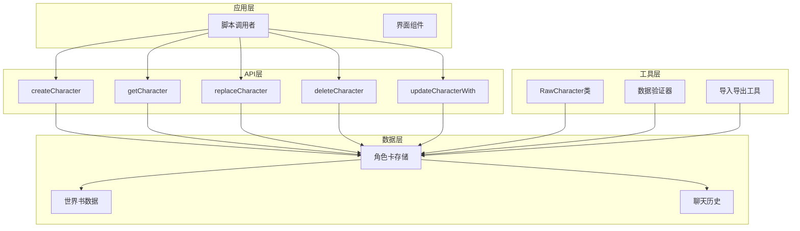
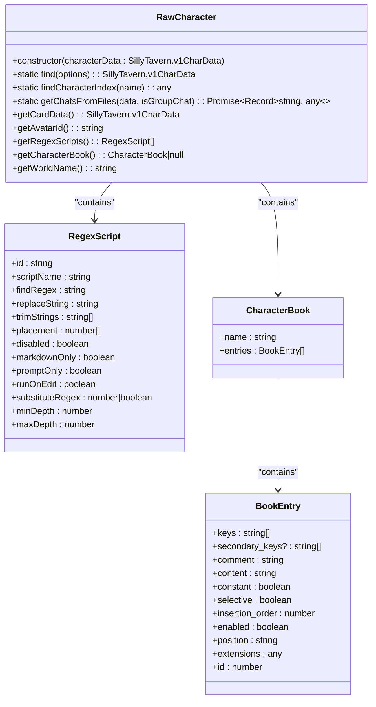
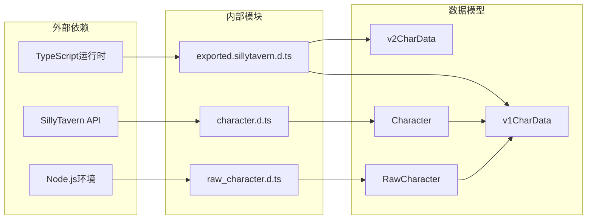
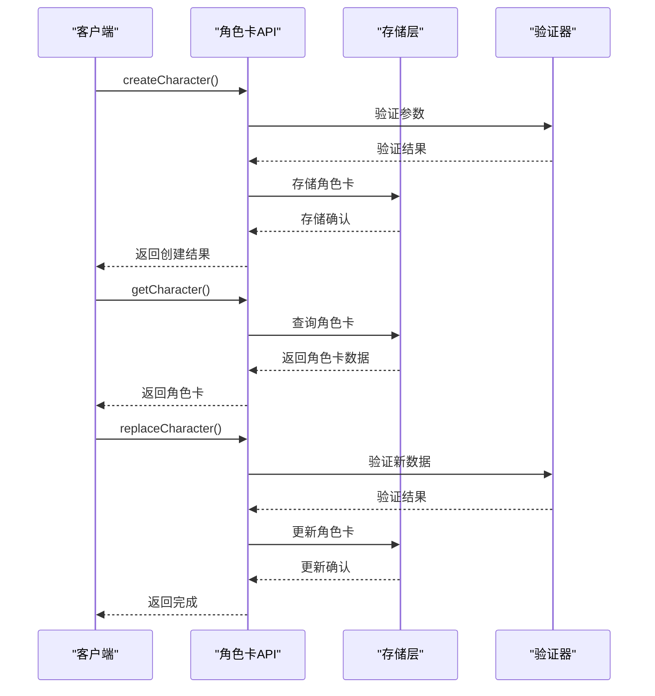

# 角色卡管理API

<cite>
**本文档引用的文件**
- [@types/function/character.d.ts](file://@types/function/character.d.ts)
- [@types/function/raw_character.d.ts](file://@types/function/raw_character.d.ts)
- [@types/iframe/exported.sillytavern.d.ts](file://@types/iframe/exported.sillytavern.d.ts)
- [示例/角色卡示例/index.yaml](file://示例/角色卡示例/index.yaml)
- [示例/角色卡示例/schema.ts](file://示例/角色卡示例/schema.ts)
- [tavern_sync.yaml](file://tavern_sync.yaml)
- [dump_schema.ts](file://dump_schema.ts)
</cite>

## 目录
1. [简介](#简介)
2. [项目结构](#项目结构)
3. [核心组件](#核心组件)
4. [架构概览](#架构概览)
5. [详细组件分析](#详细组件分析)
6. [依赖关系分析](#依赖关系分析)
7. [性能考虑](#性能考虑)
8. [故障排除指南](#故障排除指南)
9. [结论](#结论)

## 简介

角色卡管理API是为SillyTavern角色扮演平台设计的一套完整的角色卡生命周期管理解决方案。该API提供了角色卡的创建、读取、更新、删除等核心功能，支持多种数据格式和导入导出机制，为开发者提供了灵活且强大的角色卡管理能力。

本API基于TypeScript类型定义，确保了类型安全性和开发体验。它支持V1和V2两种角色卡数据结构，提供了丰富的扩展字段和正则脚本功能，能够满足复杂角色扮演场景的需求。

## 项目结构

该项目采用模块化组织方式，主要包含以下核心部分：

```mermaid
graph TB
subgraph "类型定义层"
A[@types/function/character.d.ts]
B[@types/function/raw_character.d.ts]
C[@types/iframe/exported.sillytavern.d.ts]
end
subgraph "示例数据层"
D[示例/角色卡示例/index.yaml]
E[示例/角色卡示例/schema.ts]
F[示例/角色卡示例/世界书]
end
subgraph "配置工具层"
G[tavern_sync.yaml]
H[dump_schema.ts]
end
A --> D
B --> D
C --> D
D --> F
G --> D
H --> E
```

**图表来源**
- [@types/function/character.d.ts:1-173](file://@types/function/character.d.ts#L1-L173)
- [@types/function/raw_character.d.ts:1-133](file://@types/function/raw_character.d.ts#L1-L133)
- [@types/iframe/exported.sillytavern.d.ts:70-146](file://@types/iframe/exported.sillytavern.d.ts#L70-L146)

**章节来源**
- [@types/function/character.d.ts:1-173](file://@types/function/character.d.ts#L1-L173)
- [@types/function/raw_character.d.ts:1-133](file://@types/function/raw_character.d.ts#L1-L133)
- [@types/iframe/exported.sillytavern.d.ts:70-146](file://@types/iframe/exported.sillytavern.d.ts#L70-L146)

## 核心组件

### 角色卡数据结构

角色卡管理API定义了两种主要的数据结构：

#### Character接口（V1数据结构）
```typescript
type Character = {
  avatar: `${string}.png` | Blob;           // 角色头像
  version: string;                           // 版本信息
  creator: string;                           // 创建者
  creator_notes: string;                     // 创建者备注
  
  worldbook: string | null;                  // 世界书关联
  description: string;                       // 角色描述
  first_messages: string[];                  // 开场白
  
  extensions: {
    regex_scripts: TavernRegex[];            // 局部正则脚本
    tavern_helper: {
      scripts: Record<string, any>[];        // 酒馆助手脚本
      variables: Record<string, any>;        // 变量
    };
    [other: string]: any;                    // 其他扩展字段
  };
};
```

#### RawCharacter类
这是一个封装类，提供便捷的角色卡数据操作方法：
- `find()`: 根据名称或头像ID查找角色卡
- `getCardData()`: 获取完整角色卡数据
- `getAvatarId()`: 获取角色头像ID
- `getRegexScripts()`: 获取正则脚本数组
- `getCharacterBook()`: 获取角色书数据
- `getWorldName()`: 获取角色世界名称

**章节来源**
- [@types/function/character.d.ts:1-19](file://@types/function/character.d.ts#L1-L19)
- [@types/function/raw_character.d.ts:5-97](file://@types/function/raw_character.d.ts#L5-L97)

## 架构概览

角色卡管理API采用分层架构设计，确保了良好的可维护性和扩展性：



**图表来源**
- [@types/function/character.d.ts:45-173](file://@types/function/character.d.ts#L45-L173)
- [@types/function/raw_character.d.ts:5-97](file://@types/function/raw_character.d.ts#L5-L97)

## 详细组件分析

### 角色卡创建API

#### createCharacter函数
用于创建新的角色卡，具有严格的参数验证和错误处理机制。

**函数签名**
```typescript
declare function createCharacter(
  character_name: Exclude<string, 'current'>,
  character?: PartialDeep<Character>
): Promise<boolean>;
```

**参数说明**
- `character_name`: 角色卡名称，必须排除'current'字符串
- `character`: 角色卡数据，可选参数，使用默认数据

**返回值**
- `Promise<boolean>`: 创建成功返回true，失败返回false

**使用示例**
```typescript
// 创建基础角色卡
const success = await createCharacter('新角色', {
  description: '这是一个测试角色',
  first_messages: ['你好！']
});

// 创建完整角色卡
const fullCharacter = {
  avatar: 'avatar.png',
  version: '1.0.0',
  creator: '开发者',
  creator_notes: '测试备注',
  worldbook: null,
  description: '角色描述',
  first_messages: ['开场白1', '开场白2'],
  extensions: {
    regex_scripts: [],
    tavern_helper: {
      scripts: [],
      variables: {}
    }
  }
};

await createCharacter('完整角色', fullCharacter);
```

**章节来源**
- [@types/function/character.d.ts:45-48](file://@types/function/character.d.ts#L45-L48)

### 角色卡读取API

#### getCharacter函数
用于获取指定角色卡的完整数据。

**函数签名**
```typescript
declare function getCharacter(character_name: LiteralUnion<'current', string>): Promise<Character>;
```

**参数说明**
- `character_name`: 角色卡名称，支持'current'特殊值

**返回值**
- `Promise<Character>`: 返回角色卡完整数据

**使用示例**
```typescript
// 获取当前角色卡
const currentCharacter = await getCharacter('current');

// 获取指定角色卡
const specificCharacter = await getCharacter('测试角色');

// 修改角色卡数据
specificCharacter.description = '更新后的描述';
```

**章节来源**
- [@types/function/character.d.ts:91-91](file://@types/function/character.d.ts#L91-L91)

### 角色卡替换API

#### replaceCharacter函数
用于完全替换角色卡的内容，提供细粒度的控制选项。

**函数签名**
```typescript
declare function replaceCharacter(
  character_name: Exclude<string, 'current'>,
  character: PartialDeep<Character>,
  options?: ReplaceCharacterOptions
): Promise<void>;
```

**参数说明**
- `character_name`: 角色卡名称
- `character`: 新的角色卡数据
- `options`: 可选配置，包括渲染选项

**返回值**
- `Promise<void>`: 替换完成后返回

**使用示例**
```typescript
// 更改开场白
const character = await getCharacter('角色卡名称');
character.first_messages = ['新的开场白1', '新的开场白2'];
await replaceCharacter('角色卡名称', character);

// 清空局部正则
const character2 = await getCharacter('角色卡名称');
character2.extensions.regex_scripts = [];
await replaceCharacter('角色卡名称', character2);

// 更换角色卡头像
const character3 = await getCharacter('角色卡名称');
character3.avatar = await fetch('https://example.com/avatar.png').then(response => response.blob());
await replaceCharacter('角色卡名称', character3);
```

**章节来源**
- [@types/function/character.d.ts:127-131](file://@types/function/character.d.ts#L127-L131)

### 角色卡删除API

#### deleteCharacter函数
用于删除指定的角色卡，支持同时删除相关聊天文件。

**函数签名**
```typescript
declare function deleteCharacter(
  character_name: LiteralUnion<'current', string>,
  options?: { delete_chats?: boolean }
): Promise<boolean>;
```

**参数说明**
- `character_name`: 角色卡名称
- `options.delete_chats`: 是否同时删除聊天文件，默认false

**返回值**
- `Promise<boolean>`: 删除成功返回true

**使用示例**
```typescript
// 仅删除角色卡
await deleteCharacter('测试角色');

// 同时删除聊天文件
await deleteCharacter('测试角色', { delete_chats: true });
```

**章节来源**
- [@types/function/character.d.ts:77-80](file://@types/function/character.d.ts#L77-L80)

### 角色卡更新API

#### updateCharacterWith函数
提供回调函数式的角色卡更新方式，支持同步和异步更新。

**函数签名**
```typescript
declare function updateCharacterWith(
  character_name: LiteralUnion<'current', string>,
  updater: CharacterUpdater
): Promise<Character>;
```

**参数说明**
- `character_name`: 角色卡名称
- `updater`: 更新函数，接收当前角色卡并返回更新后的角色卡

**返回值**
- `Promise<Character>`: 返回更新后的角色卡

**使用示例**
```typescript
// 添加开场白
await updateCharacterWith('角色卡名称', character => {
  character.first_messages.push('新的开场白');
  return character;
});

// 清空局部正则
await updateCharacterWith('角色卡名称', character => {
  character.extensions.regex_scripts = [];
  return character;
});

// 异步更新头像
await updateCharacterWith('角色卡名称', async character => {
  character.avatar = await fetch('https://example.com/avatar.png').then(response => response.blob());
  return character;
});
```

**章节来源**
- [@types/function/character.d.ts:169-173](file://@types/function/character.d.ts#L169-L173)

### RawCharacter类详解

RawCharacter类提供了更底层的角色卡数据操作能力：



**图表来源**
- [@types/function/raw_character.d.ts:5-97](file://@types/function/raw_character.d.ts#L5-L97)

**章节来源**
- [@types/function/raw_character.d.ts:5-97](file://@types/function/raw_character.d.ts#L5-L97)

## 依赖关系分析

角色卡管理API的依赖关系体现了清晰的分层架构：



**图表来源**
- [@types/function/character.d.ts:1-173](file://@types/function/character.d.ts#L1-L173)
- [@types/function/raw_character.d.ts:1-133](file://@types/function/raw_character.d.ts#L1-L133)
- [@types/iframe/exported.sillytavern.d.ts:70-146](file://@types/iframe/exported.sillytavern.d.ts#L70-L146)

### 数据流分析

角色卡管理涉及多个数据流，包括创建、读取、更新、删除等操作：



**图表来源**
- [@types/function/character.d.ts:45-131](file://@types/function/character.d.ts#L45-L131)

**章节来源**
- [@types/function/character.d.ts:1-173](file://@types/function/character.d.ts#L1-L173)

## 性能考虑

### 渲染优化

API提供了多种渲染策略来平衡性能和用户体验：

- **防抖渲染 (debounced)**: 默认策略，适合批量操作
- **立即渲染 (immediate)**: 实时反馈，适合交互操作
- **无渲染 (none)**: 静默模式，适合后台操作

### 数据加载策略

- **懒加载**: 支持浅层数据加载，减少内存占用
- **增量更新**: 部分字段更新，避免全量替换
- **缓存机制**: 重复访问时使用缓存数据

### 并发处理

API支持并发操作，但建议：
- 避免同时对同一角色卡进行多次写操作
- 使用适当的锁机制防止数据竞争
- 合理安排批量操作的时间间隔

## 故障排除指南

### 常见错误及解决方案

#### 角色卡不存在
**问题**: 访问不存在的角色卡时抛出异常
**解决方案**: 
- 使用`getCharacterNames()`检查角色卡是否存在
- 在操作前先创建角色卡
- 使用try-catch捕获异常

#### 参数验证失败
**问题**: 角色卡名称不符合要求
**解决方案**:
- 确保角色卡名称不是'current'
- 检查字符集和长度限制
- 验证特殊字符的使用

#### 权限不足
**问题**: 无法删除当前角色卡
**解决方案**:
- 使用其他角色卡进行操作
- 检查用户权限设置
- 确认角色卡所有权

### 调试技巧

#### 启用详细日志
```typescript
// 在开发环境中启用详细日志
console.log('角色卡操作:', { action, characterName, timestamp });
```

#### 数据验证
```typescript
// 验证角色卡数据结构
const isValid = validateCharacterData(character);
if (!isValid) {
  throw new Error('角色卡数据格式不正确');
}
```

#### 错误恢复
```typescript
// 实现错误重试机制
async function retryOperation(operation, maxRetries = 3) {
  for (let i = 0; i < maxRetries; i++) {
    try {
      return await operation();
    } catch (error) {
      if (i === maxRetries - 1) throw error;
      await sleep(1000 * Math.pow(2, i)); // 指数退避
    }
  }
}
```

**章节来源**
- [@types/function/character.d.ts:45-173](file://@types/function/character.d.ts#L45-L173)

## 结论

角色卡管理API为SillyTavern平台提供了完整、类型安全的角色卡生命周期管理解决方案。通过精心设计的API接口、灵活的数据结构和完善的错误处理机制，开发者可以轻松实现复杂的角色扮演场景。

该API的主要优势包括：
- **类型安全**: 基于TypeScript，提供完整的类型定义
- **功能完整**: 支持角色卡的完整生命周期管理
- **扩展性强**: 支持多种数据格式和自定义扩展
- **性能优化**: 提供多种渲染策略和数据加载优化
- **易于使用**: 简洁的API设计和丰富的示例代码

随着项目的不断发展，该API将继续演进，为角色扮演游戏提供更加强大和灵活的管理能力。