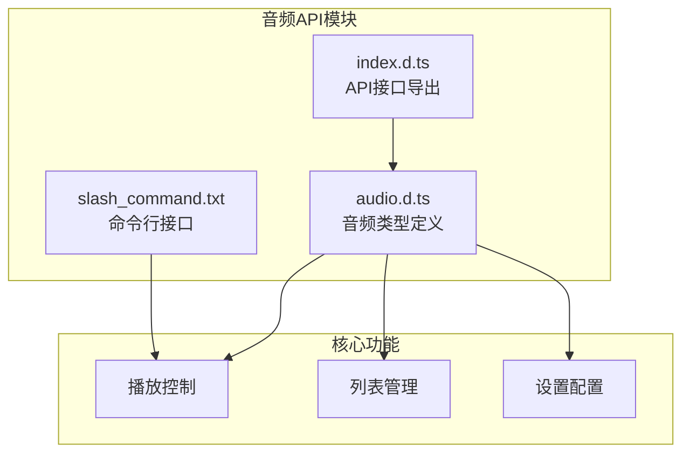
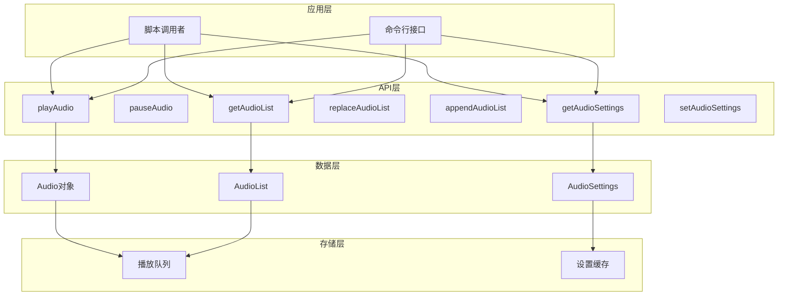
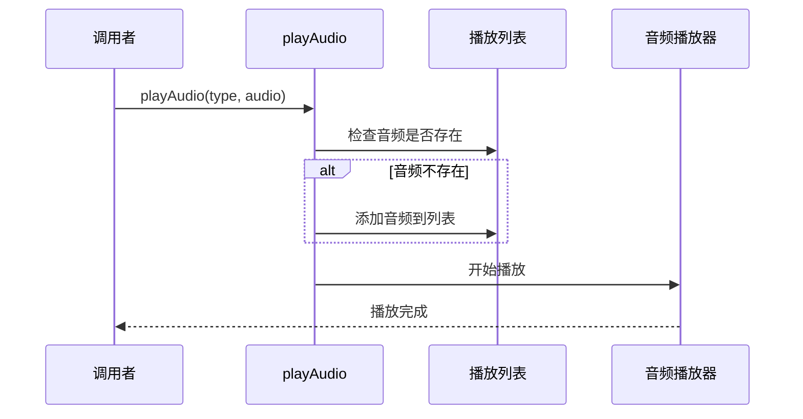
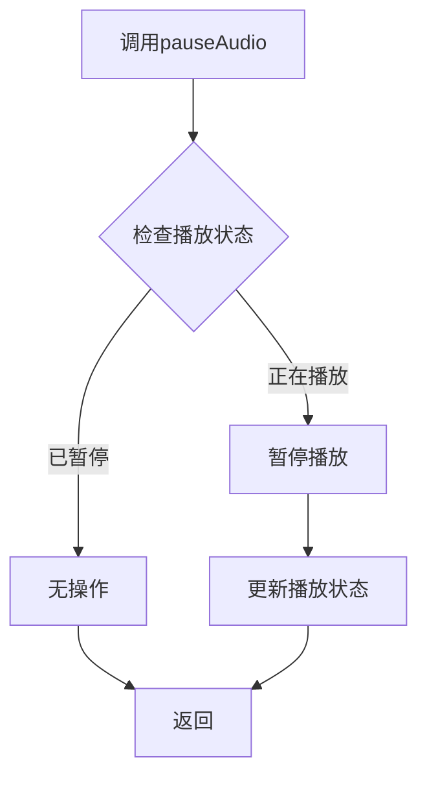
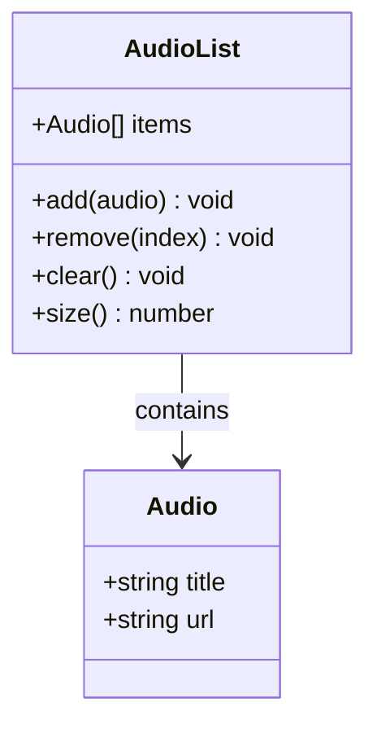
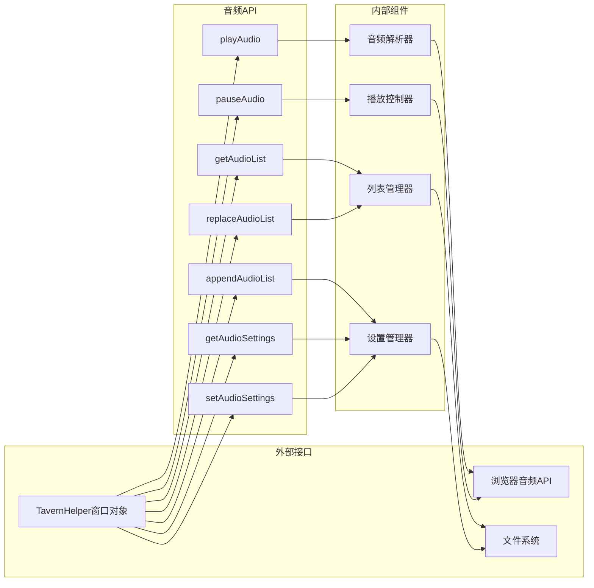

# 音频控制API

<cite>
**本文档引用的文件**
- [@types/function/audio.d.ts](file://@types/function/audio.d.ts)
- [@types/function/index.d.ts](file://@types/function/index.d.ts)
- [slash_command.txt](file://slash_command.txt)
</cite>

## 目录
1. [简介](#简介)
2. [项目结构](#项目结构)
3. [核心组件](#核心组件)
4. [架构概览](#架构概览)
5. [详细组件分析](#详细组件分析)
6. [依赖关系分析](#依赖关系分析)
7. [性能考虑](#性能考虑)
8. [故障排除指南](#故障排除指南)
9. [结论](#结论)

## 简介

音频控制API是酒馆助手（TavernHelper）扩展提供的一套音频播放管理接口。该API允许开发者和用户控制背景音乐（BGM）和环境音效（Ambient Sound），包括播放控制、列表管理和设置配置等功能。

该API主要面向以下场景：
- 游戏场景中的背景音乐播放
- 角色扮演中的环境音效管理
- 动态音频内容的播放控制
- 多媒体内容的统一管理

## 项目结构

音频控制API位于项目的类型定义文件中，采用模块化设计：

**图表来源**
- [@types/function/audio.d.ts:1-106](file://@types/function/audio.d.ts#L1-L106)
- [@types/function/index.d.ts:1-170](file://@types/function/index.d.ts#L1-L170)

**章节来源**
- [@types/function/audio.d.ts:1-106](file://@types/function/audio.d.ts#L1-L106)
- [@types/function/index.d.ts:1-170](file://@types/function/index.d.ts#L1-L170)

## 核心组件

音频控制API包含三个主要的数据类型和一组操作函数：

### 核心数据类型

1. **Audio类型**：标准音频对象
   - `title`: 音频标题（必需）
   - `url`: 音频网络链接（必需）

2. **AudioWithOptionalTitle类型**：可选标题的音频对象
   - `title?`: 音频标题（可选）
   - `url`: 音频网络链接（必需）

3. **AudioSettings类型**：音频设置对象
   - `enabled`: 是否启用（boolean）
   - `mode`: 播放模式（'repeat_one' | 'repeat_all' | 'shuffle' | 'play_one_and_stop'）
   - `muted`: 是否静音（boolean）
   - `volume`: 音量（0-100）

### 主要API函数

1. **playAudio**: 播放指定音频
2. **pauseAudio**: 暂停音频播放
3. **getAudioList**: 获取播放列表
4. **replaceAudioList**: 替换播放列表
5. **appendAudioList**: 追加音频到列表
6. **getAudioSettings**: 获取音频设置
7. **setAudioSettings**: 设置音频参数

**章节来源**
- [@types/function/audio.d.ts:1-106](file://@types/function/audio.d.ts#L1-L106)

## 架构概览

音频控制API采用分层架构设计，提供清晰的功能分离：

**图表来源**
- [@types/function/audio.d.ts:15-106](file://@types/function/audio.d.ts#L15-L106)
- [@types/function/index.d.ts:7-14](file://@types/function/index.d.ts#L7-L14)

## 详细组件分析

### playAudio函数

**功能描述**：播放指定的音频，如果音频不在播放列表中则自动加入

**参数类型**：
- `type`: 'bgm' | 'ambient'
- `audio`: AudioWithOptionalTitle

**返回值**：void

**使用示例路径**：
- [playAudio示例1:22-24](file://@types/function/audio.d.ts#L22-L24)
- [playAudio示例2:25-27](file://@types/function/audio.d.ts#L25-L27)

**图表来源**
- [@types/function/audio.d.ts:15-29](file://@types/function/audio.d.ts#L15-L29)

**章节来源**
- [@types/function/audio.d.ts:15-29](file://@types/function/audio.d.ts#L15-L29)

### pauseAudio函数

**功能描述**：暂停指定类型的音频播放

**参数类型**：
- `type`: 'bgm' | 'ambient'

**返回值**：void

**使用示例路径**：
- [pauseAudio示例:31-36](file://@types/function/audio.d.ts#L31-L36)

**图表来源**
- [@types/function/audio.d.ts:31-36](file://@types/function/audio.d.ts#L31-L36)

**章节来源**
- [@types/function/audio.d.ts:31-36](file://@types/function/audio.d.ts#L31-L36)

### getAudioList函数

**功能描述**：获取指定类型的音频播放列表

**参数类型**：
- `type`: 'bgm' | 'ambient'

**返回值**：Audio[]

**使用示例路径**：
- [getAudioList示例:38-44](file://@types/function/audio.d.ts#L38-L44)

**图表来源**
- [@types/function/audio.d.ts:1-44](file://@types/function/audio.d.ts#L1-L44)

**章节来源**
- [@types/function/audio.d.ts:38-44](file://@types/function/audio.d.ts#L38-L44)

### replaceAudioList函数

**功能描述**：完全替换指定类型的音频播放列表

**参数类型**：
- `type`: 'bgm' | 'ambient'
- `audio_list`: AudioWithOptionalTitle[]

**返回值**：void

**使用示例路径**：
- [replaceAudioList示例:46-52](file://@types/function/audio.d.ts#L46-L52)

**章节来源**
- [@types/function/audio.d.ts:46-52](file://@types/function/audio.d.ts#L46-L52)

### appendAudioList函数

**功能描述**：向播放列表末尾追加不存在的音频，避免重复添加

**参数类型**：
- `type`: 'bgm' | 'ambient'
- `audio_list`: AudioWithOptionalTitle[]

**返回值**：void

**使用示例路径**：
- [appendAudioList示例:54-60](file://@types/function/audio.d.ts#L54-L60)

**章节来源**
- [@types/function/audio.d.ts:54-60](file://@types/function/audio.d.ts#L54-L60)

### getAudioSettings函数

**功能描述**：获取指定类型的音频设置

**参数类型**：
- `type`: 'bgm' | 'ambient'

**返回值**：AudioSettings

**使用示例路径**：
- [getAudioSettings示例:79-85](file://@types/function/audio.d.ts#L79-L85)

**章节来源**
- [@types/function/audio.d.ts:79-85](file://@types/function/audio.d.ts#L79-L85)

### setAudioSettings函数

**功能描述**：修改指定类型的音频设置，未指定的字段保持原值

**参数类型**：
- `type`: 'bgm' | 'ambient'
- `settings`: Partial<AudioSettings>

**返回值**：void

**使用示例路径**：
- [setAudioSettings示例1:93-95](file://@types/function/audio.d.ts#L93-L95)
- [setAudioSettings示例2:96-98](file://@types/function/audio.d.ts#L96-L98)
- [setAudioSettings示例3:99-103](file://@types/function/audio.d.ts#L99-L103)

**章节来源**
- [@types/function/audio.d.ts:87-105](file://@types/function/audio.d.ts#L87-L105)

## 依赖关系分析

音频控制API与其他系统组件的交互关系：

**图表来源**
- [@types/function/index.d.ts:1-170](file://@types/function/index.d.ts#L1-L170)
- [@types/function/audio.d.ts:1-106](file://@types/function/audio.d.ts#L1-L106)

**章节来源**
- [@types/function/index.d.ts:1-170](file://@types/function/index.d.ts#L1-L170)

## 性能考虑

音频控制API在设计时考虑了以下性能因素：

1. **异步处理**：音频播放操作采用异步非阻塞模式
2. **内存管理**：自动清理不再使用的音频资源
3. **缓存机制**：重复音频内容的智能缓存
4. **批量操作**：支持批量音频列表操作优化
5. **资源限制**：防止内存泄漏和资源过度占用

最佳实践建议：
- 使用replaceAudioList进行大规模列表更新
- 避免频繁的播放/暂停切换
- 合理设置音量范围（0-100）
- 及时清理不需要的音频文件

## 故障排除指南

常见问题及解决方案：

### 播放问题
- **问题**：音频无法播放
  - **原因**：URL无效或网络连接问题
  - **解决**：检查音频链接有效性，确认网络连接正常

- **问题**：播放列表为空
  - **原因**：音频未正确添加到列表
  - **解决**：使用appendAudioList或replaceAudioList重新添加

### 设置问题
- **问题**：设置不生效
  - **原因**：部分设置字段未正确传递
  - **解决**：使用Partial类型确保只传递需要的设置项

### 性能问题
- **问题**：内存占用过高
  - **原因**：大量音频文件同时加载
  - **解决**：定期清理不需要的音频文件，使用适当的播放模式

**章节来源**
- [@types/function/audio.d.ts:62-77](file://@types/function/audio.d.ts#L62-L77)

## 结论

音频控制API提供了完整而灵活的音频管理解决方案，具有以下特点：

**优势**：
- 类型安全的API设计
- 完整的播放控制功能
- 灵活的列表管理操作
- 细粒度的设置配置
- 良好的性能表现

**适用场景**：
- 游戏开发中的音效管理
- 角色扮演游戏的背景音乐控制
- 多媒体应用的音频播放
- 实时音频内容的动态管理

该API为开发者提供了强大而易用的音频控制能力，能够满足各种音频管理需求。