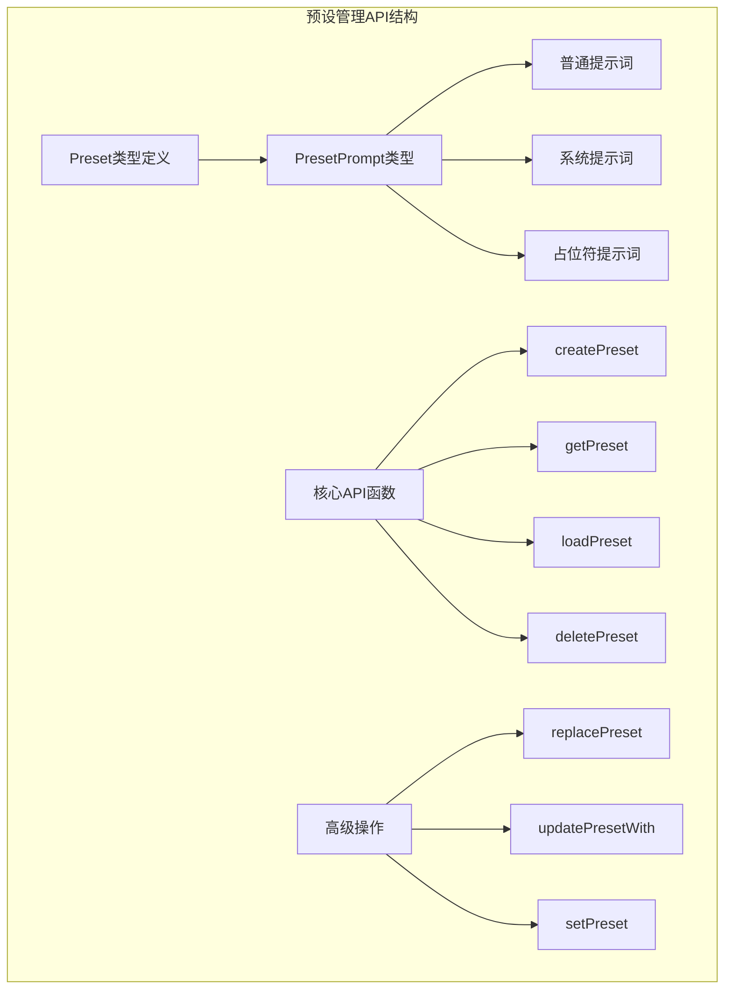
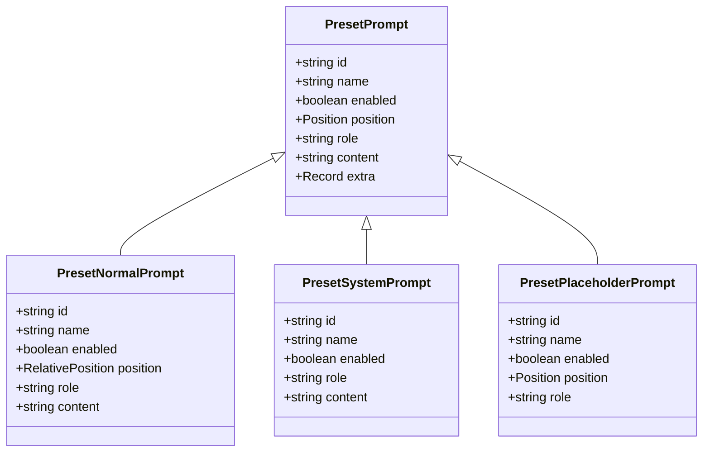
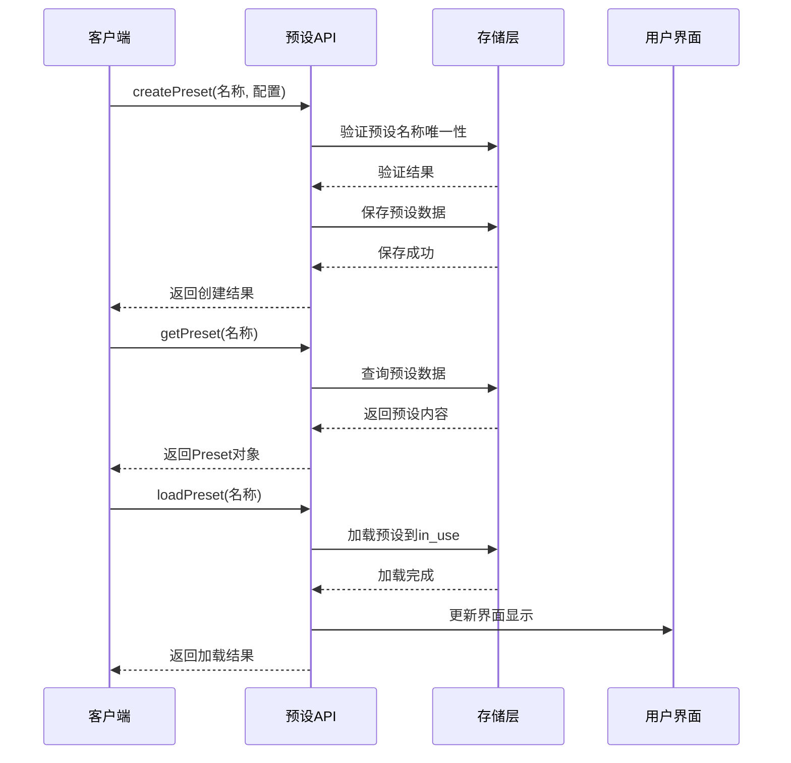
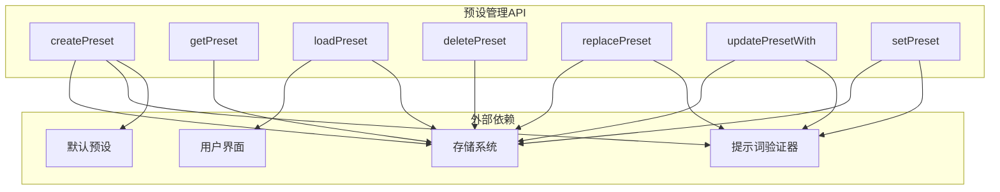

# 预设管理API

<cite>
**本文档引用的文件**
- [@types\function\preset.d.ts](file://@types/function/preset.d.ts)
- [参考脚本示例\@types\function\preset.d.ts](file://参考脚本示例/@types/function/preset.d.ts)
</cite>

## 目录
1. [简介](#简介)
2. [项目结构](#项目结构)
3. [核心组件](#核心组件)
4. [架构概览](#架构概览)
5. [详细组件分析](#详细组件分析)
6. [依赖关系分析](#依赖关系分析)
7. [性能考虑](#性能考虑)
8. [故障排除指南](#故障排除指南)
9. [结论](#结论)

## 简介

预设管理API是酒馆助手（SillyTavern）生态系统中的核心功能模块，负责管理和操作AI对话的预设配置。该API提供了完整的CRUD操作能力，包括预设的创建、读取、更新、删除和加载等功能。

预设系统通过统一的Preset数据结构管理对话参数和提示词配置，支持多种类型的提示词（普通提示词、系统提示词、占位符提示词），为用户提供灵活的AI对话定制能力。

## 项目结构

预设管理API位于项目的类型定义文件中，主要包含以下关键组件：



**图表来源**
- [@types\function\preset.d.ts:1-366](file://@types/function/preset.d.ts#L1-L366)

**章节来源**
- [@types\function\preset.d.ts:1-366](file://@types/function/preset.d.ts#L1-L366)

## 核心组件

### Preset数据结构

Preset是预设管理的核心数据结构，包含以下主要组成部分：

| 组件 | 类型 | 描述 |
|------|------|------|
| settings | 对象 | AI对话参数配置 |
| prompts | PresetPrompt[] | 已添加的提示词列表 |
| prompts_unused | PresetPrompt[] | 未添加的提示词列表 |
| extensions | 对象 | 扩展数据存储 |

**章节来源**
- [@types\function\preset.d.ts:1-74](file://@types/function/preset.d.ts#L1-L74)

### PresetPrompt类型系统

提示词系统根据ID类型分为三种主要类别：



**图表来源**
- [@types\function\preset.d.ts:76-141](file://@types/function/preset.d.ts#L76-L141)

**章节来源**
- [@types\function\preset.d.ts:76-141](file://@types/function/preset.d.ts#L76-L141)

## 架构概览

预设管理API采用模块化设计，提供完整的预设生命周期管理：



**图表来源**
- [@types\function\preset.d.ts:143-179](file://@types/function/preset.d.ts#L143-L179)

## 详细组件分析

### createPreset函数

createPreset用于创建新的预设，具有以下特性：

**函数签名**
```typescript
function createPreset(
  preset_name: Exclude<string, 'in_use'>, 
  preset?: Preset
): Promise<boolean>
```

**参数说明**
- `preset_name`: 预设名称，必须排除'in_use'字符串
- `preset`: 预设内容，可选参数，默认使用default_preset

**返回值**
- `Promise<boolean>`: 创建成功返回true，失败返回false

**使用示例路径**
- [创建预设示例:192-192](file://@types/function/preset.d.ts#L192-L192)

**章节来源**
- [@types\function\preset.d.ts:182-192](file://@types/function/preset.d.ts#L182-L192)

### getPreset函数

getPreset用于获取指定预设的内容：

**函数签名**
```typescript
function getPreset(preset_name: LiteralUnion<'in_use', string>): Preset
```

**参数说明**
- `preset_name`: 预设名称，支持'in_use'特殊值

**返回值**
- `Preset`: 预设对象实例

**异常处理**
- 预设不存在时抛出异常

**使用示例路径**
- [获取预设示例:180-180](file://@types/function/preset.d.ts#L180-L180)

**章节来源**
- [@types\function\preset.d.ts:171-180](file://@types/function/preset.d.ts#L171-L180)

### loadPreset函数

loadPreset用于将指定预设加载为当前使用的预设：

**函数签名**
```typescript
function loadPreset(preset_name: Exclude<string, 'in_use'>): boolean
```

**参数说明**
- `preset_name`: 预设名称，必须排除'in_use'

**返回值**
- `boolean`: 加载成功返回true，失败返回false

**重要说明**
- 加载的预设会成为'in_use'当前使用的预设
- 编辑'in_use'预设不会自动保存到源预设

**使用示例路径**
- [加载预设示例:169-169](file://@types/function/preset.d.ts#L169-L169)

**章节来源**
- [@types\function\preset.d.ts:163-170](file://@types/function/preset.d.ts#L163-L170)

### deletePreset函数

deletePreset用于删除指定的预设：

**函数签名**
```typescript
function deletePreset(preset_name: Exclude<string, 'in_use'>): Promise<boolean>
```

**参数说明**
- `preset_name`: 要删除的预设名称

**返回值**
- `Promise<boolean>`: 删除成功返回true，失败返回false

**使用示例路径**
- [删除预设示例:217-217](file://@types/function/preset.d.ts#L217-L217)

**章节来源**
- [@types\function\preset.d.ts:210-218](file://@types/function/preset.d.ts#L210-L218)

### 高级操作函数

#### replacePreset函数

完全替换预设内容：

**函数签名**
```typescript
function replacePreset(
  preset_name: LiteralUnion<'in_use', string>,
  preset: Preset,
  options?: ReplacePresetOptions
): Promise<void>
```

**使用场景**
- 修改'in_use'预设的特定设置
- 复制预设内容结构
- 批量修改提示词配置

**章节来源**
- [@types\function\preset.d.ts:276-280](file://@types/function/preset.d.ts#L276-L280)

#### updatePresetWith函数

使用更新器函数修改预设：

**函数签名**
```typescript
function updatePresetWith(
  preset_name: LiteralUnion<'in_use', string>,
  updater: PresetUpdater,
  options?: ReplacePresetOptions
): Promise<Preset>
```

**使用场景**
- 条件性修改预设设置
- 动态添加或移除提示词
- 复杂的预设转换逻辑

**章节来源**
- [@types\function\preset.d.ts:332-336](file://@types/function/preset.d.ts#L332-L336)

#### setPreset函数

部分更新预设内容：

**函数签名**
```typescript
function setPreset(
  preset_name: LiteralUnion<'in_use', string>,
  preset: PartialDeep<Preset>,
  options?: ReplacePresetOptions
): Promise<Preset>
```

**使用场景**
- 只修改预设的部分设置
- 增量更新预设配置
- 保持其他设置不变

**章节来源**
- [@types\function\preset.d.ts:361-365](file://@types/function/preset.d.ts#L361-L365)

## 依赖关系分析

预设管理API与其他系统组件的交互关系：



**图表来源**
- [@types\function\preset.d.ts:143-365](file://@types/function/preset.d.ts#L143-L365)

**章节来源**
- [@types\function\preset.d.ts:143-365](file://@types/function/preset.d.ts#L143-L365)

## 性能考虑

### 预设操作优化

1. **批量操作**: 使用updatePresetWith进行批量修改，减少多次API调用
2. **防抖渲染**: ReplacePresetOptions中的render选项控制界面更新频率
3. **异步处理**: 所有I/O操作都使用Promise，避免阻塞主线程

### 内存管理

- 预设数据缓存在内存中，频繁访问时注意内存使用
- 大型预设建议分批处理，避免一次性加载过多数据

## 故障排除指南

### 常见错误及解决方案

| 错误类型 | 症状 | 解决方案 |
|----------|------|----------|
| 预设不存在 | 抛出异常 | 使用getPresetNames检查预设列表 |
| 名称冲突 | 创建失败 | 确保预设名称唯一性 |
| 重复提示词 | 验证失败 | 检查系统提示词和占位符提示词的唯一性 |
| 权限问题 | 操作拒绝 | 确认用户权限和预设所有权 |

### 调试技巧

1. **预设状态监控**: 使用getLoadedPresetName跟踪当前使用的预设
2. **操作日志**: 记录所有预设操作的时间戳和结果
3. **数据备份**: 在重要操作前备份当前预设状态

**章节来源**
- [@types\function\preset.d.ts:152-161](file://@types/function/preset.d.ts#L152-L161)

## 结论

预设管理API提供了完整而强大的预设生命周期管理能力，支持从简单的CRUD操作到复杂的批量处理。其模块化设计和类型安全保证使得开发者能够构建可靠的预设管理功能。

通过合理使用各种API函数，开发者可以实现：
- 灵活的预设创建和管理
- 动态的预设加载和切换
- 精细的预设内容修改
- 高效的预设批量操作

该API的设计充分考虑了实际使用场景，为AI对话系统的定制化提供了坚实的基础。