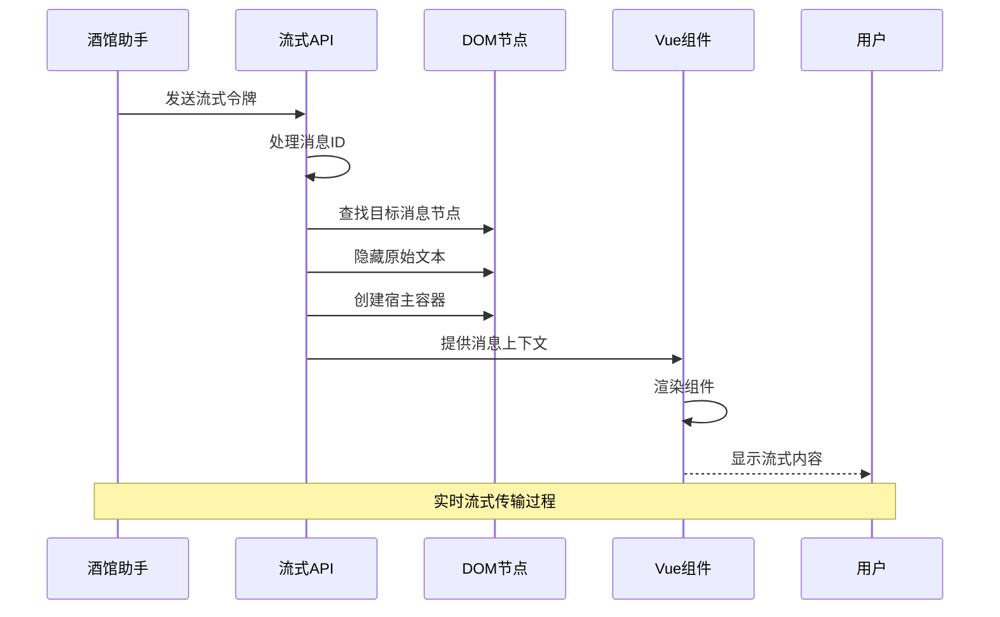
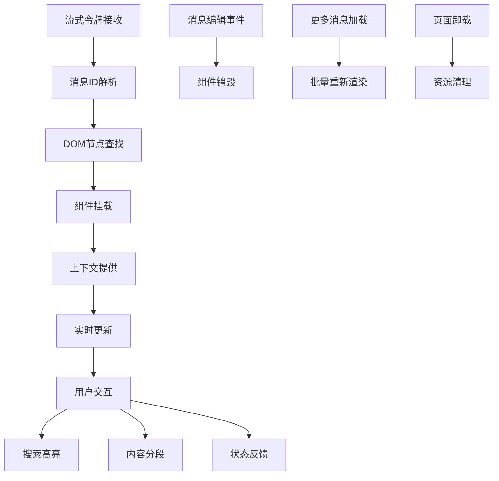
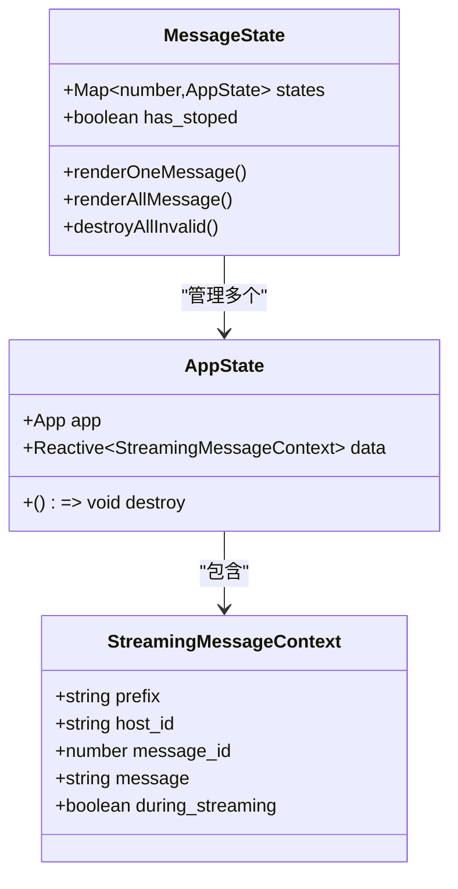
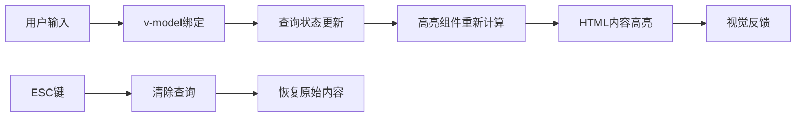
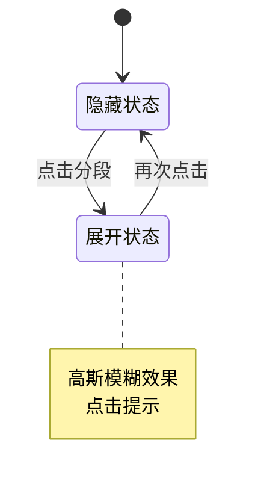
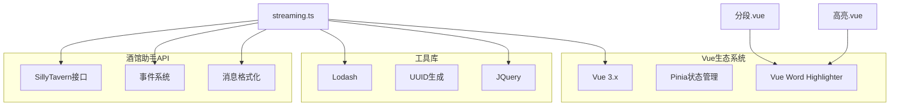
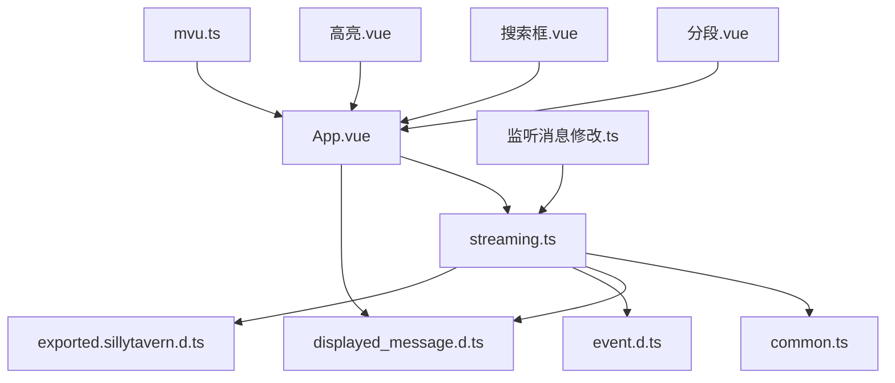
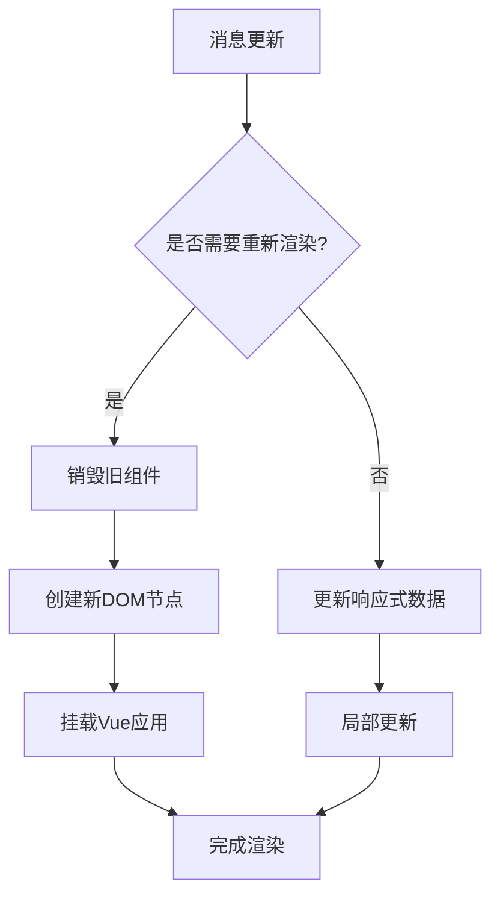

# 流式界面接口

<cite>
**本文档引用的文件**
- [streaming.ts](file://util/streaming.ts)
- [index.ts](file://示例/流式楼层界面示例/index.ts)
- [App.vue](file://示例/流式楼层界面示例/App.vue)
- [分段.vue](file://示例/流式楼层界面示例/分段.vue)
- [搜索框.vue](file://示例/流式楼层界面示例/搜索框.vue)
- [高亮.vue](file://示例/流式楼层界面示例/高亮.vue)
- [displayed_message.d.ts](file://@types/function/displayed_message.d.ts)
- [common.ts](file://util/common.ts)
- [exported.tavernhelper.d.ts](file://@types/iframe/exported.tavernhelper.d.ts)
- [event.d.ts](file://@types/iframe/event.d.ts)
- [exported.sillytavern.d.ts](file://@types/iframe/exported.sillytavern.d.ts)
- [mvu.ts](file://util/mvu.ts)
- [监听消息修改.ts](file://示例/脚本示例/监听消息修改.ts)
</cite>

## 目录
1. [简介](#简介)
2. [项目结构](#项目结构)
3. [核心组件](#核心组件)
4. [架构概览](#架构概览)
5. [详细组件分析](#详细组件分析)
6. [依赖关系分析](#依赖关系分析)
7. [性能考虑](#性能考虑)
8. [故障排除指南](#故障排除指南)
9. [结论](#结论)

## 简介

流式界面接口是一个专为酒馆助手设计的高级消息处理系统，允许开发者创建自定义的流式消息界面。该系统支持实时流式传输、消息上下文管理、组件挂载卸载以及搜索高亮功能。通过流式界面，用户可以在消息生成过程中实时看到内容变化，同时享受丰富的交互体验。

该接口提供了两种宿主模式：iframe模式和div模式，分别适用于不同的样式隔离需求。系统还集成了完整的事件驱动架构，确保与主界面的无缝交互。

## 项目结构

流式界面接口的项目结构围绕核心的流式处理模块组织，主要包含以下关键目录：

```mermaid
graph TB
subgraph "核心模块"
A[util/streaming.ts<br/>流式处理核心]
B[util/common.ts<br/>通用工具函数]
C[util/mvu.ts<br/>MVU状态管理]
end
subgraph "示例界面"
D[示例/流式楼层界面示例/App.vue<br/>主界面组件]
E[示例/流式楼层界面示例/分段.vue<br/>内容分段组件]
F[示例/流式楼层界面示例/搜索框.vue<br/>搜索组件]
G[示例/流式楼层界面示例/高亮.vue<br/>高亮组件]
H[示例/流式楼层界面示例/index.ts<br/>入口脚本]
end
subgraph "类型定义"
I[@types/function/displayed_message.d.ts<br/>消息格式化类型]
J[@types/iframe/event.d.ts<br/>事件类型定义]
K[@types/iframe/exported.sillytavern.d.ts<br/>SillyTavern接口]
end
A --> D
A --> E
A --> F
A --> G
B --> A
C --> D
I --> D
J --> A
K --> A
```

**图表来源**
- [streaming.ts:1-238](file://util/streaming.ts#L1-L238)
- [index.ts:1-8](file://示例/流式楼层界面示例/index.ts#L1-L8)

**章节来源**
- [streaming.ts:1-238](file://util/streaming.ts#L1-L238)
- [index.ts:1-8](file://示例/流式楼层界面示例/index.ts#L1-L8)

## 核心组件

流式界面接口的核心由以下几个关键组件构成：

### 流式消息上下文 (StreamingMessageContext)

这是流式界面的核心数据结构，提供组件访问消息状态的能力：

```typescript
export type StreamingMessageContext = {
  prefix: string;           // 组件前缀标识符
  host_id: string;          // DOM宿主元素ID
  
  message_id: number;       // 消息楼层ID
  message: string;          // 当前消息内容
  during_streaming: boolean; // 是否正在流式传输
};
```

### 主要API函数

#### mountStreamingMessages
主要的挂载函数，负责将Vue组件挂载到指定的消息楼层：

**参数说明：**
- `creator`: Vue应用创建器函数
- `options.host`: 宿主类型，默认为'iframe'
- `options.filter`: 楼层过滤器函数
- `options.prefix`: 组件前缀标识符

#### injectStreamingMessageContext
Vue组合式API，用于注入流式消息上下文

**章节来源**
- [streaming.ts:5-19](file://util/streaming.ts#L5-L19)
- [streaming.ts:41-44](file://util/streaming.ts#L41-L44)

## 架构概览

流式界面接口采用事件驱动的架构模式，通过监听酒馆助手的事件来实现实时更新：



**图表来源**
- [streaming.ts:215-217](file://util/streaming.ts#L215-L217)
- [streaming.ts:108-127](file://util/streaming.ts#L108-L127)

### 数据流架构



**图表来源**
- [streaming.ts:188-237](file://util/streaming.ts#L188-L237)
- [App.vue:16-71](file://示例/流式楼层界面示例/App.vue#L16-L71)

## 详细组件分析

### 流式消息处理核心

#### 消息上下文管理

流式界面通过响应式数据管理消息状态：



**图表来源**
- [streaming.ts:8-15](file://util/streaming.ts#L8-L15)
- [streaming.ts:47-48](file://util/streaming.ts#L47-L48)

#### 组件挂载机制

系统支持两种挂载模式：

**iframe模式特点：**
- 完全样式隔离
- 支持TailwindCSS
- 使用独立的contentDocument

**div模式特点：**
- 继承酒馆样式
- 禁止使用'mes_text'类名
- 不能使用TailwindCSS

**章节来源**
- [streaming.ts:21-33](file://util/streaming.ts#L21-L33)

### 搜索高亮功能

#### 搜索框组件

搜索功能通过双向绑定实现实时高亮：



**图表来源**
- [搜索框.vue:1-95](file://示例/流式楼层界面示例/搜索框.vue#L1-L95)

#### 高亮算法实现

高亮功能基于词匹配算法：

**章节来源**
- [高亮.vue:1-20](file://示例/流式楼层界面示例/高亮.vue#L1-L20)

### 分段显示机制

#### 内容分段组件

分段显示支持逐行展开功能：



**图表来源**
- [分段.vue:1-79](file://示例/流式楼层界面示例/分段.vue#L1-L79)

**章节来源**
- [分段.vue:32-44](file://示例/流式楼层界面示例/分段.vue#L32-L44)

### 实时更新机制

#### 事件监听系统

系统监听多个酒馆助手事件：

| 事件类型 | 触发条件 | 处理逻辑 |
|---------|---------|---------|
| chatLoaded | 聊天加载完成 | 批量重新渲染所有消息 |
| CHARACTER_MESSAGE_RENDERED | 消息渲染完成 | 渲染单个消息 |
| MESSAGE_EDITED | 消息编辑 | 销毁旧组件并重新渲染 |
| MORE_MESSAGES_LOADED | 加载更多消息 | 延迟重新渲染 |
| STREAM_TOKEN_RECEIVED | 接收流式令牌 | 更新当前消息 |

**章节来源**
- [streaming.ts:194-217](file://util/streaming.ts#L194-L217)

## 依赖关系分析

### 外部依赖

流式界面接口依赖以下关键库和模块：



**图表来源**
- [streaming.ts:1-3](file://util/streaming.ts#L1-L3)
- [分段.vue](file://示例/流式楼层界面示例/分段.vue#L19)
- [高亮.vue](file://示例/流式楼层界面示例/高亮.vue#L8)

### 内部模块依赖



**图表来源**
- [streaming.ts:1-3](file://util/streaming.ts#L1-L3)
- [App.vue:17-21](file://示例/流式楼层界面示例/App.vue#L17-L21)

**章节来源**
- [streaming.ts:1-3](file://util/streaming.ts#L1-L3)
- [displayed_message.d.ts:1-71](file://@types/function/displayed_message.d.ts#L1-L71)

## 性能考虑

### 内存管理

系统实现了完善的内存管理机制：

1. **组件生命周期管理**：每个消息楼层对应一个Vue应用实例
2. **状态映射优化**：使用Map结构存储消息状态，支持O(1)查找
3. **DOM节点复用**：避免重复创建DOM元素
4. **事件监听清理**：提供统一的卸载接口

### 渲染优化



**图表来源**
- [streaming.ts:82-90](file://util/streaming.ts#L82-L90)

### 性能优化建议

1. **合理使用过滤器**：通过filter选项减少不必要的组件创建
2. **选择合适的宿主模式**：
   - 复杂界面使用iframe模式
   - 简单界面使用div模式
3. **优化搜索算法**：对于大量文本，考虑使用更高效的搜索策略
4. **延迟加载**：对长内容实施懒加载策略

## 故障排除指南

### 常见问题及解决方案

#### 组件无法挂载

**症状**：流式界面不显示
**可能原因**：
- Vue应用创建失败
- DOM节点不存在
- 样式冲突

**解决方法**：
1. 检查Vue应用创建器函数
2. 确认消息楼层ID有效
3. 验证样式隔离配置

#### 搜索功能异常

**症状**：搜索框无法正常工作
**可能原因**：
- v-model绑定问题
- 高亮组件初始化失败

**解决方法**：
1. 检查搜索框组件的v-model配置
2. 验证高亮组件的props传递
3. 确认事件监听正确设置

#### 内存泄漏问题

**症状**：长时间使用后内存占用持续增长
**可能原因**：
- 事件监听器未正确清理
- Vue组件未正确卸载

**解决方法**：
1. 确保调用unmount()函数
2. 检查组件的onUnmounted钩子
3. 验证MutationObserver的清理

**章节来源**
- [streaming.ts:224-237](file://util/streaming.ts#L224-L237)
- [监听消息修改.ts:1-4](file://示例/脚本示例/监听消息修改.ts#L1-L4)

### 调试技巧

1. **启用开发模式**：在开发环境中启用详细的错误信息
2. **使用浏览器调试器**：检查DOM结构和Vue组件状态
3. **监控事件流**：通过控制台观察事件触发情况
4. **内存分析**：定期检查内存使用情况

## 结论

流式界面接口提供了一个强大而灵活的消息处理系统，具有以下优势：

1. **高度可定制**：支持多种宿主模式和样式配置
2. **实时性强**：基于事件驱动的实时更新机制
3. **用户体验优秀**：提供流畅的流式传输体验
4. **扩展性好**：易于添加新的功能组件

该接口特别适合需要实时内容展示的应用场景，如AI对话界面、实时翻译、内容分析等。通过合理的架构设计和性能优化，可以构建出既美观又实用的流式界面。

在未来的发展中，可以考虑添加更多的交互功能，如内容导出、分享机制、主题切换等，进一步提升用户体验。