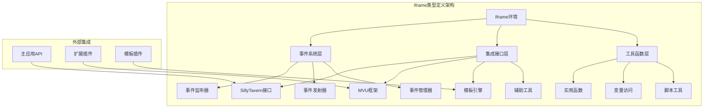
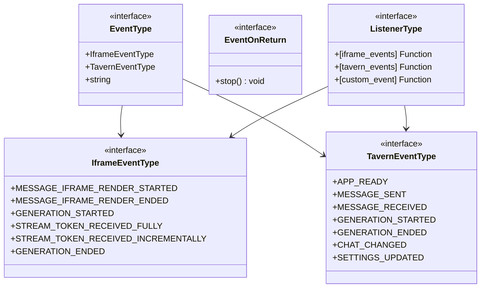
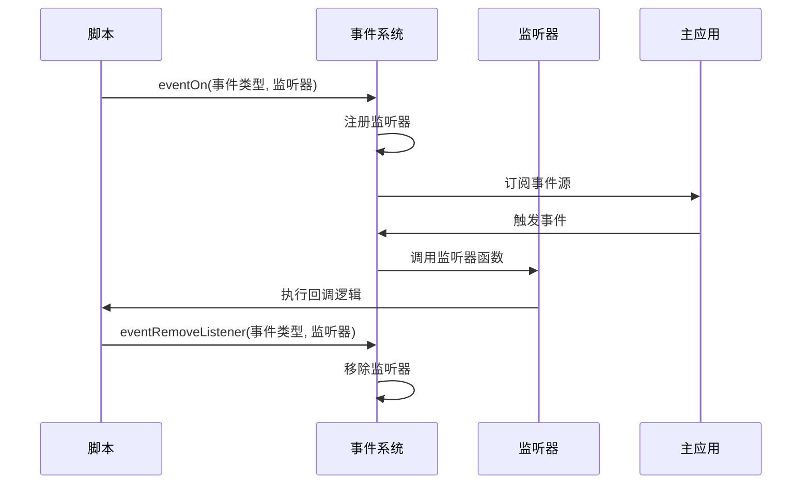
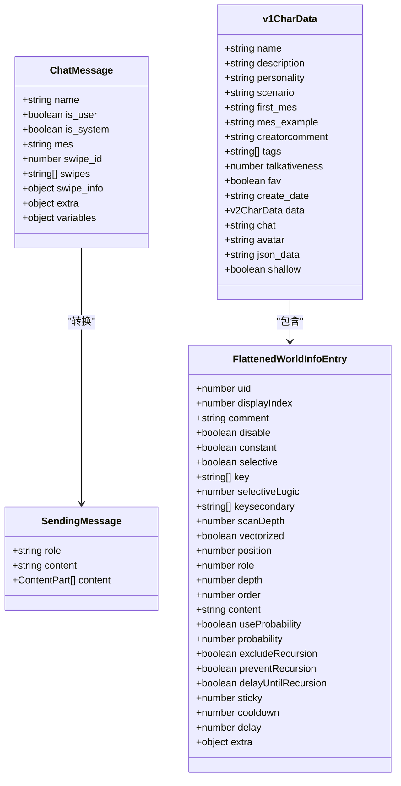
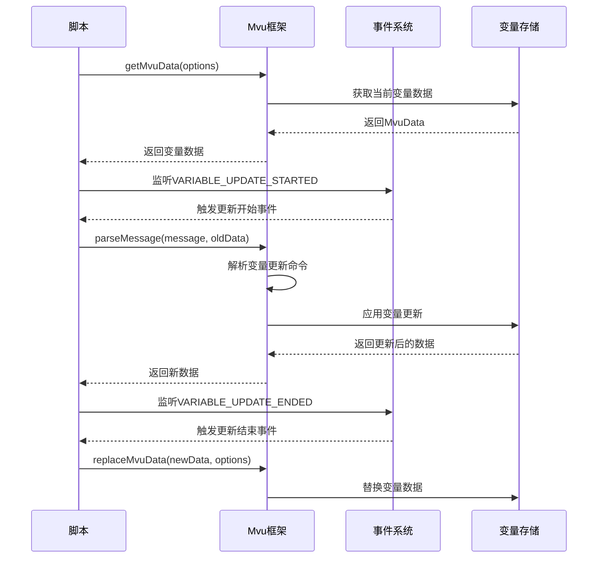
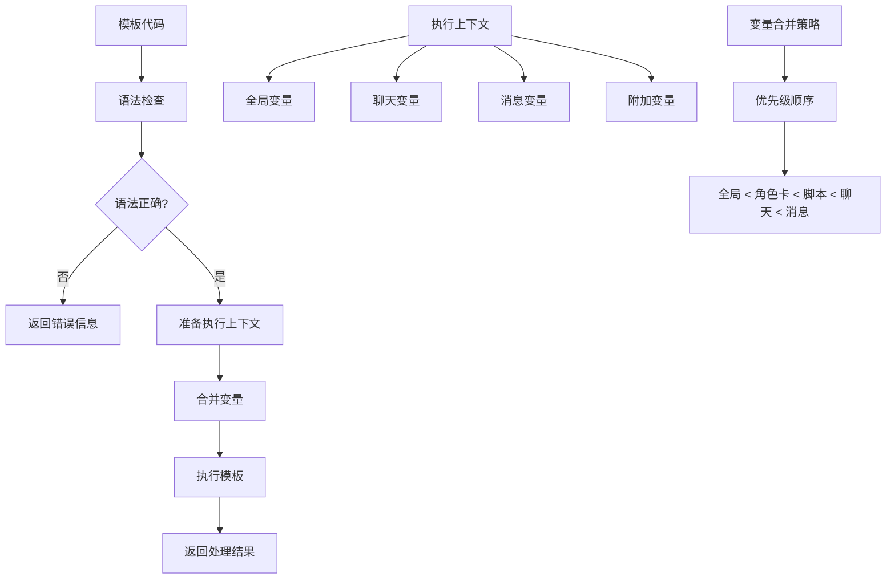
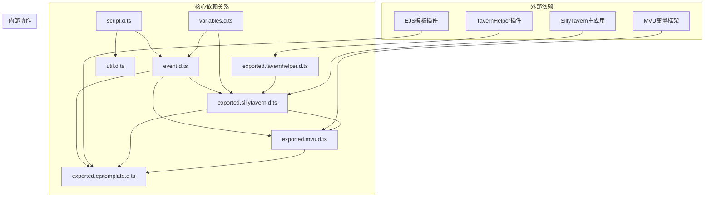

# Iframe类型定义

<cite>
**本文档引用的文件**
- [@types/iframe/event.d.ts](file://@types/iframe/event.d.ts)
- [@types/iframe/exported.mvu.d.ts](file://@types/iframe/exported.mvu.d.ts)
- [@types/iframe/exported.sillytavern.d.ts](file://@types/iframe/exported.sillytavern.d.ts)
- [@types/iframe/exported.tavernhelper.d.ts](file://@types/iframe/exported.tavernhelper.d.ts)
- [@types/iframe/exported.ejstemplate.d.ts](file://@types/iframe/exported.ejstemplate.d.ts)
- [@types/iframe/script.d.ts](file://@types/iframe/script.d.ts)
- [@types/iframe/util.d.ts](file://@types/iframe/util.d.ts)
- [@types/iframe/variables.d.ts](file://@types/iframe/variables.d.ts)
</cite>

## 目录
1. [简介](#简介)
2. [项目结构](#项目结构)
3. [核心组件](#核心组件)
4. [架构概览](#架构概览)
5. [详细组件分析](#详细组件分析)
6. [依赖关系分析](#依赖关系分析)
7. [性能考虑](#性能考虑)
8. [故障排除指南](#故障排除指南)
9. [结论](#结论)

## 简介

Iframe类型定义是SillyTavern扩展生态系统的核心组成部分，为在iframe环境中运行的前端界面和脚本提供了完整的类型安全支持。本文档详细介绍了在iframe环境中可用的所有类型定义，包括事件处理、MVU状态管理、SillyTavern集成、模板系统、脚本执行和工具函数等。

这些类型定义确保了开发者在使用SillyTavern扩展API时能够获得完整的类型检查、智能代码补全和编译时错误检测，大大提高了开发效率和代码质量。

## 项目结构

Iframe类型定义位于项目的`@types/iframe/`目录下，采用模块化设计，每个文件专注于特定的功能领域：

```mermaid
graph TB
subgraph "Iframe类型定义结构"
A[@types/iframe/] --> B[event.d.ts]
A --> C[exported.mvu.d.ts]
A --> D[exported.sillytavern.d.ts]
A --> E[exported.tavernhelper.d.ts]
A --> F[exported.ejstemplate.d.ts]
A --> G[script.d.ts]
A --> H[util.d.ts]
A --> I[variables.d.ts]
end
subgraph "功能分类"
J[事件系统] --> B
K[MVU框架] --> C
L[SillyTavern集成] --> D
M[模板系统] --> F
N[脚本工具] --> G
O[实用工具] --> H
P[变量系统] --> I
end
```

**图表来源**
- [@types/iframe/event.d.ts:1-522](file://@types/iframe/event.d.ts#L1-L522)
- [@types/iframe/exported.mvu.d.ts:1-190](file://@types/iframe/exported.mvu.d.ts#L1-L190)

**章节来源**
- [@types/iframe/event.d.ts:1-522](file://@types/iframe/event.d.ts#L1-L522)
- [@types/iframe/exported.mvu.d.ts:1-190](file://@types/iframe/exported.mvu.d.ts#L1-L190)

## 核心组件

### 事件处理系统

事件处理系统是Iframe类型定义的核心组件，提供了完整的事件监听、触发和管理功能。

#### 主要特性
- **多事件类型支持**：支持iframe事件、SillyTavern事件和自定义事件
- **灵活的监听机制**：提供多种监听模式（首次、最后、一次性）
- **类型安全**：通过泛型确保事件处理器的参数类型正确
- **自动清理**：组件销毁时自动清理事件监听器

#### 关键接口
- `eventOn<T>`：基础事件监听
- `eventMakeFirst<T>`：设置为最先执行
- `eventMakeLast<T>`：设置为最后执行
- `eventOnce<T>`：一次性事件监听
- `eventEmit<T>`：事件触发
- `eventEmitAndWait<T>`：等待事件处理完成

**章节来源**
- [@types/iframe/event.d.ts:15-164](file://@types/iframe/event.d.ts#L15-L164)

### SillyTavern集成

SillyTavern集成提供了与主应用的完整接口，包括聊天消息管理、角色卡处理、世界书管理和生成接口等。

#### 主要功能
- **聊天消息管理**：添加、删除、更新聊天消息
- **角色卡操作**：角色卡的读取、修改和管理
- **世界书系统**：世界书条目的加载、保存和查询
- **生成接口**：文本生成、流式传输和停止控制
- **UI交互**：弹窗、工具栏和界面元素管理

**章节来源**
- [@types/iframe/exported.sillytavern.d.ts:382-697](file://@types/iframe/exported.sillytavern.d.ts#L382-L697)

### MVU状态管理系统

MVU（Model-View-Update）状态管理系统为复杂的变量管理提供了强大的支持。

#### 核心概念
- **MvuData**：包含初始化的世界书和实际变量数据
- **CommandInfo**：变量更新命令的信息结构
- **事件驱动**：通过事件系统实现状态变更的解耦

#### 支持的操作
- **变量获取**：根据不同的作用域获取变量数据
- **变量替换**：完全替换变量表内容
- **消息解析**：解析包含变量更新命令的消息
- **状态监控**：监听变量更新的各个阶段

**章节来源**
- [@types/iframe/exported.mvu.d.ts:1-190](file://@types/iframe/exported.mvu.d.ts#L1-L190)

### 模板系统

模板系统提供了强大的文本处理和渲染能力，支持复杂的变量替换和条件逻辑。

#### 功能特性
- **模板语法**：支持EJS风格的模板语法
- **上下文管理**：动态构建和管理执行上下文
- **变量合并**：合并全局、聊天和消息级别的变量
- **设置管理**：灵活的模板处理设置和配置

**章节来源**
- [@types/iframe/exported.ejstemplate.d.ts:1-125](file://@types/iframe/exported.ejstemplate.d.ts#L1-L125)

## 架构概览

Iframe类型定义采用分层架构设计，确保了良好的模块化和可维护性：



**图表来源**
- [@types/iframe/event.d.ts:1-522](file://@types/iframe/event.d.ts#L1-L522)
- [@types/iframe/exported.sillytavern.d.ts:382-697](file://@types/iframe/exported.sillytavern.d.ts#L382-L697)

## 详细组件分析

### 事件处理组件

事件处理系统是整个Iframe类型定义的核心，提供了完整的事件生命周期管理。

#### 事件类型系统



**图表来源**
- [@types/iframe/event.d.ts:8-522](file://@types/iframe/event.d.ts#L8-L522)

#### 事件监听流程



**图表来源**
- [@types/iframe/event.d.ts:42-139](file://@types/iframe/event.d.ts#L42-L139)

**章节来源**
- [@types/iframe/event.d.ts:15-164](file://@types/iframe/event.d.ts#L15-L164)

### SillyTavern集成组件

SillyTavern集成组件提供了与主应用的深度集成，包括数据模型定义和API接口。

#### 数据模型架构



**图表来源**
- [@types/iframe/exported.sillytavern.d.ts:3-276](file://@types/iframe/exported.sillytavern.d.ts#L3-L276)

#### API接口设计

SillyTavern集成提供了丰富的API接口，涵盖了聊天管理、角色卡处理、世界书管理和生成服务等各个方面。

**章节来源**
- [@types/iframe/exported.sillytavern.d.ts:382-697](file://@types/iframe/exported.sillytavern.d.ts#L382-L697)

### MVU状态管理组件

MVU状态管理系统为复杂的变量管理提供了强大的支持，采用了函数式编程的设计理念。

#### 状态管理架构

```mermaid
flowchart TD
A[MvuData] --> B[initialized_lorebooks]
A --> C[stat_data]
A --> D[其他数据]
E[CommandInfo] --> F[SetCommandInfo]
E --> G[InsertCommandInfo]
E --> H[DeleteCommandInfo]
E --> I[AddCommandInfo]
E --> J[MoveCommandInfo]
F --> K[type: 'set']
F --> L[full_match: string]
F --> M[args: [path, new_value]]
G --> N[type: 'insert']
G --> O[full_match: string]
G --> P[args: [path, value]]
H --> Q[type: 'delete']
H --> R[full_match: string]
H --> S[args: [path]]
I --> T[type: 'add']
I --> U[full_match: string]
I --> V[args: [path, delta]]
J --> W[type: 'move']
J --> X[full_match: string]
J --> Y[args: [from, to]]
```

**图表来源**
- [@types/iframe/exported.mvu.d.ts:1-47](file://@types/iframe/exported.mvu.d.ts#L1-L47)

#### 事件驱动的状态更新



**图表来源**
- [@types/iframe/exported.mvu.d.ts:138-177](file://@types/iframe/exported.mvu.d.ts#L138-L177)

**章节来源**
- [@types/iframe/exported.mvu.d.ts:1-190](file://@types/iframe/exported.mvu.d.ts#L1-L190)

### 模板系统组件

模板系统提供了强大的文本处理和渲染能力，支持复杂的变量替换和条件逻辑。

#### 模板处理流程



**图表来源**
- [@types/iframe/exported.ejstemplate.d.ts:54-124](file://@types/iframe/exported.ejstemplate.d.ts#L54-L124)

#### 功能特性

模板系统提供了以下核心功能：

- **模板语法处理**：支持EJS风格的模板语法
- **上下文管理**：动态构建和管理执行上下文
- **变量合并**：智能合并不同作用域的变量
- **设置控制**：灵活的模板处理设置和配置

**章节来源**
- [@types/iframe/exported.ejstemplate.d.ts:1-125](file://@types/iframe/exported.ejstemplate.d.ts#L1-L125)

## 依赖关系分析

Iframe类型定义之间的依赖关系体现了清晰的模块化设计：



**图表来源**
- [@types/iframe/event.d.ts:1-522](file://@types/iframe/event.d.ts#L1-L522)
- [@types/iframe/exported.sillytavern.d.ts:382-697](file://@types/iframe/exported.sillytavern.d.ts#L382-L697)

### 组件耦合度分析

- **低耦合高内聚**：各组件职责明确，相互依赖最小化
- **接口隔离**：通过明确定义的接口实现组件间的通信
- **向后兼容**：类型定义设计考虑了版本演进的兼容性

**章节来源**
- [@types/iframe/event.d.ts:1-522](file://@types/iframe/event.d.ts#L1-L522)
- [@types/iframe/exported.sillytavern.d.ts:382-697](file://@types/iframe/exported.sillytavern.d.ts#L382-L697)

## 性能考虑

在设计Iframe类型定义时，性能是一个重要的考量因素：

### 类型检查优化
- **增量编译**：利用TypeScript的增量编译特性提高编译速度
- **模块化设计**：将类型定义拆分为独立的模块，减少不必要的类型检查
- **泛型约束**：合理使用泛型约束，避免过度宽泛的类型定义

### 运行时性能
- **事件监听优化**：提供事件监听器的优先级管理，避免不必要的回调执行
- **内存管理**：自动清理机制确保事件监听器在组件销毁时被正确释放
- **异步处理**：合理使用Promise和async/await，避免阻塞主线程

### 开发体验优化
- **智能提示**：完整的类型定义提供准确的IDE智能提示
- **错误预防**：编译时类型检查帮助开发者提前发现潜在问题
- **重构安全**：强类型系统确保代码重构时的安全性

## 故障排除指南

### 常见问题及解决方案

#### 事件监听问题
**问题**：事件监听器无法正常触发
**解决方案**：
1. 确认事件类型的有效性
2. 检查监听器函数的签名是否正确
3. 验证事件监听器的生命周期管理

#### 类型定义冲突
**问题**：编译时报类型定义冲突错误
**解决方案**：
1. 检查是否有重复定义的类型
2. 确认模块导入路径的正确性
3. 验证类型定义的兼容性

#### 性能问题
**问题**：事件处理导致页面响应缓慢
**解决方案**：
1. 优化事件监听器的实现逻辑
2. 合理使用事件去抖和节流
3. 避免在事件处理中执行耗时操作

**章节来源**
- [@types/iframe/event.d.ts:1-522](file://@types/iframe/event.d.ts#L1-L522)
- [@types/iframe/util.d.ts:1-56](file://@types/iframe/util.d.ts#L1-L56)

## 结论

Iframe类型定义为SillyTavern扩展生态系统提供了坚实的基础架构。通过精心设计的模块化结构、完善的类型安全机制和丰富的功能特性，这些类型定义确保了开发者能够在iframe环境中获得最佳的开发体验。

### 主要优势
- **类型安全**：完整的类型定义提供编译时错误检测
- **模块化设计**：清晰的组件分离便于维护和扩展
- **功能完整性**：覆盖了Iframe环境的各个方面需求
- **性能优化**：考虑了运行时性能和开发体验

### 未来发展方向
- **API标准化**：进一步统一不同插件的API接口
- **性能提升**：持续优化类型检查和编译性能
- **生态扩展**：支持更多第三方插件的集成
- **开发工具**：提供更好的开发和调试工具支持

这些类型定义不仅为当前的开发工作提供了重要支撑，也为SillyTavern扩展生态系统的长期发展奠定了坚实基础。