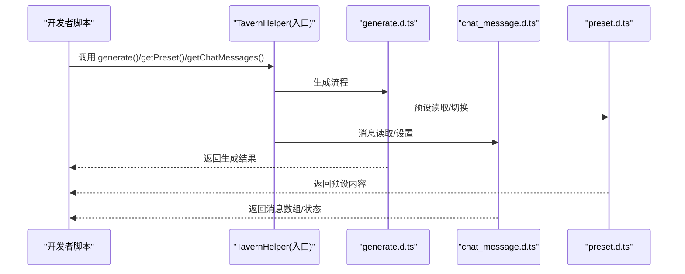
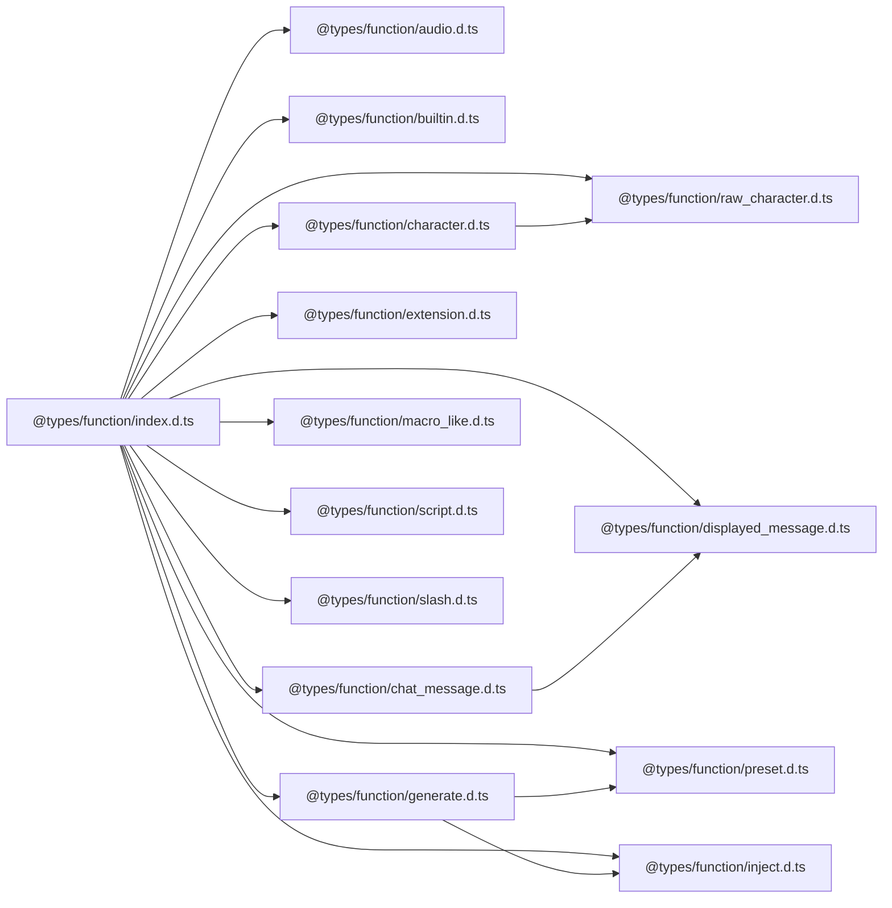

# 函数类型定义

<cite>
**本文引用的文件**
- [index.d.ts](file://@types/function/index.d.ts)
- [audio.d.ts](file://@types/function/audio.d.ts)
- [builtin.d.ts](file://@types/function/builtin.d.ts)
- [character.d.ts](file://@types/function/character.d.ts)
- [chat_message.d.ts](file://@types/function/chat_message.d.ts)
- [displayed_message.d.ts](file://@types/function/displayed_message.d.ts)
- [extension.d.ts](file://@types/function/extension.d.ts)
- [generate.d.ts](file://@types/function/generate.d.ts)
- [inject.d.ts](file://@types/function/inject.d.ts)
- [lorebook.d.ts](file://@types/function/lorebook.d.ts)
- [lorebook_entry.d.ts](file://@types/function/lorebook_entry.d.ts)
- [macro_like.d.ts](file://@types/function/macro_like.d.ts)
- [preset.d.ts](file://@types/function/preset.d.ts)
- [raw_character.d.ts](file://@types/function/raw_character.d.ts)
- [script.d.ts](file://@types/function/script.d.ts)
- [slash.d.ts](file://@types/function/slash.d.ts)
</cite>

## 目录
1. [简介](#简介)
2. [项目结构](#项目结构)
3. [核心组件](#核心组件)
4. [架构总览](#架构总览)
5. [详细组件分析](#详细组件分析)
6. [依赖分析](#依赖分析)
7. [性能考虑](#性能考虑)
8. [故障排查指南](#故障排查指南)
9. [结论](#结论)

## 简介
本文件系统化梳理 SillyTavern 酒馆助手提供的函数类型定义，覆盖音频处理、角色管理、聊天消息、预设管理、变量操作、脚本树、宏与注入、扩展管理、生成流程、显示格式化、Slash 命令等模块。文档逐项说明各函数的用途、参数类型、返回值类型、使用场景与注意事项，并提供类型安全最佳实践与常见错误规避方法。

## 项目结构
SillyTavern 的函数类型集中于 @types/function 目录，按功能域划分文件，入口通过 window.TavernHelper 暴露统一 API。整体组织遵循“按领域分文件”的设计，便于维护与检索。

```mermaid
graph TB
subgraph "函数类型入口"
A["@types/function/index.d.ts<br/>Window.TavernHelper 统一导出"]
end
subgraph "音频处理"
B["@types/function/audio.d.ts<br/>playAudio/pauseAudio/getAudioList/..."]
end
subgraph "内置能力"
C["@types/function/builtin.d.ts<br/>addOneMessage/copyText/..."]
end
subgraph "角色管理"
D["@types/function/character.d.ts<br/>getCharacterNames/createCharacter/..."]
end
subgraph "聊天消息"
E["@types/function/chat_message.d.ts<br/>get/set/create/delete/rotate"]
end
subgraph "显示消息"
F["@types/function/displayed_message.d.ts<br/>format/retrieve/refresh"]
end
subgraph "扩展管理"
G["@types/function/extension.d.ts<br/>install/update/uninstall/..."]
end
subgraph "生成流程"
H["@types/function/generate.d.ts<br/>generate/generateRaw/getModelList/..."]
end
subgraph "注入与宏"
I["@types/function/inject.d.ts<br/>injectPrompts/uninjectPrompts"]
J["@types/function/macro_like.d.ts<br/>registerMacroLike/unregisterMacroLike"]
end
subgraph "预设管理"
K["@types/function/preset.d.ts<br/>getPreset/loadPreset/create/..."]
end
subgraph "原始角色卡"
L["@types/function/raw_character.d.ts<br/>RawCharacter/静态方法/查询"]
end
subgraph "脚本树"
M["@types/function/script.d.ts<br/>getScriptTrees/replace/..."]
end
subgraph "Slash 命令"
N["@types/function/slash.d.ts<br/>triggerSlash"]
end
A --> B
A --> C
A --> D
A --> E
A --> F
A --> G
A --> H
A --> I
A --> J
A --> K
A --> L
A --> M
A --> N
```

图表来源
- [@types/function/index.d.ts:1-170](file://@types/function/index.d.ts#L1-L170)
- [@types/function/audio.d.ts:1-106](file://@types/function/audio.d.ts#L1-L106)
- [@types/function/builtin.d.ts:1-86](file://@types/function/builtin.d.ts#L1-L86)
- [@types/function/character.d.ts:1-173](file://@types/function/character.d.ts#L1-L173)
- [@types/function/chat_message.d.ts:1-235](file://@types/function/chat_message.d.ts#L1-L235)
- [@types/function/displayed_message.d.ts:1-71](file://@types/function/displayed_message.d.ts#L1-L71)
- [@types/function/extension.d.ts:1-105](file://@types/function/extension.d.ts#L1-L105)
- [@types/function/generate.d.ts:1-318](file://@types/function/generate.d.ts#L1-L318)
- [@types/function/inject.d.ts:1-47](file://@types/function/inject.d.ts#L1-L47)
- [@types/function/macro_like.d.ts:1-38](file://@types/function/macro_like.d.ts#L1-L38)
- [@types/function/preset.d.ts:1-366](file://@types/function/preset.d.ts#L1-L366)
- [@types/function/raw_character.d.ts:1-133](file://@types/function/raw_character.d.ts#L1-L133)
- [@types/function/script.d.ts:1-82](file://@types/function/script.d.ts#L1-L82)
- [@types/function/slash.d.ts:1-30](file://@types/function/slash.d.ts#L1-L30)

章节来源
- [@types/function/index.d.ts:1-170](file://@types/function/index.d.ts#L1-L170)

## 核心组件
- 音频处理：提供 bgm/ambient 的播放、暂停、列表替换、设置修改等能力，支持标题推断与播放模式控制。
- 角色管理：提供角色卡的增删改查、替换、更新、当前角色查询等，支持渲染策略与异步更新。
- 聊天消息：提供消息读取、批量设置、创建、删除、旋转等，支持包含/排除 swipe 页面与刷新策略。
- 显示消息：提供消息 HTML 实例获取、宏与正则处理后的显示格式化、单楼层刷新。
- 扩展管理：提供扩展类型查询、安装/卸载/重装/更新、安装信息获取与管理员权限判断。
- 生成流程：提供带/不带预设的生成、模型列表查询、按 ID/全部停止生成、自定义 API 与覆盖提示词。
- 注入与宏：提供一次性注入提示词、取消注入、注册/注销宏，支持过滤与扫描开关。
- 预设管理：提供预设的增删改查、替换、更新、设置部分更新、类型区分（普通/系统/占位）。
- 原始角色卡：提供 RawCharacter 类与静态查询方法，支持角色数据、头像、正则脚本、角色书、世界名等。
- 脚本树：提供脚本树的读取、替换、更新，支持全局/预设/角色作用域。
- Slash 命令：提供命令触发与管道结果获取。

章节来源
- [@types/function/audio.d.ts:1-106](file://@types/function/audio.d.ts#L1-L106)
- [@types/function/character.d.ts:1-173](file://@types/function/character.d.ts#L1-L173)
- [@types/function/chat_message.d.ts:1-235](file://@types/function/chat_message.d.ts#L1-L235)
- [@types/function/displayed_message.d.ts:1-71](file://@types/function/displayed_message.d.ts#L1-L71)
- [@types/function/extension.d.ts:1-105](file://@types/function/extension.d.ts#L1-L105)
- [@types/function/generate.d.ts:1-318](file://@types/function/generate.d.ts#L1-L318)
- [@types/function/inject.d.ts:1-47](file://@types/function/inject.d.ts#L1-L47)
- [@types/function/macro_like.d.ts:1-38](file://@types/function/macro_like.d.ts#L1-L38)
- [@types/function/preset.d.ts:1-366](file://@types/function/preset.d.ts#L1-L366)
- [@types/function/raw_character.d.ts:1-133](file://@types/function/raw_character.d.ts#L1-L133)
- [@types/function/script.d.ts:1-82](file://@types/function/script.d.ts#L1-L82)
- [@types/function/slash.d.ts:1-30](file://@types/function/slash.d.ts#L1-L30)

## 架构总览
SillyTavern 的函数类型以 window.TavernHelper 为中心统一暴露，内部按功能域拆分文件，形成清晰的“领域-函数”映射。调用方通过该入口访问各类能力，实现松耦合与高内聚。

图表来源
- [@types/function/index.d.ts:1-170](file://@types/function/index.d.ts#L1-L170)
- [@types/function/generate.d.ts:1-318](file://@types/function/generate.d.ts#L1-L318)
- [@types/function/preset.d.ts:1-366](file://@types/function/preset.d.ts#L1-L366)
- [@types/function/chat_message.d.ts:1-235](file://@types/function/chat_message.d.ts#L1-L235)

## 详细组件分析

### 音频处理（audio）
- 数据结构
  - Audio/ AudioWithOptionalTitle：音频标题与 URL；当未提供标题时可从 URL 推断。
  - AudioSettings：包含启用、模式（单曲循环/全部循环/随机/播一首后停止）、静音、音量。
- 关键函数
  - playAudio(type, audio)：播放音频，若不在列表中则加入。
  - pauseAudio(type)：暂停指定类型音频。
  - getAudioList(type)：获取播放列表。
  - replaceAudioList(type, audio_list)：完全替换播放列表。
  - appendAudioList(type, audio_list)：去重追加音频。
  - getAudioSettings(type)：获取设置。
  - setAudioSettings(type, settings)：部分更新设置（支持 Partial）。
- 使用场景
  - 背景音乐与环境音分离播放，动态切换播放模式与音量，实现沉浸式体验。
- 类型安全要点
  - 使用联合类型限定 type 与模式枚举，避免非法值。
  - 通过 Optional 标题与 URL 的组合，确保标题一致性。
- 示例路径
  - [playAudio 示例:21-28](file://@types/function/audio.d.ts#L21-L28)
  - [setAudioSettings 示例:93-103](file://@types/function/audio.d.ts#L93-L103)

章节来源
- [@types/function/audio.d.ts:1-106](file://@types/function/audio.d.ts#L1-L106)

### 角色管理（character）
- 数据结构
  - Character：角色卡数据结构，包含头像、版本、创作者、描述、开场白、扩展等。
- 关键函数
  - getCharacterNames()：获取角色卡名称列表。
  - getCurrentCharacterName()：获取当前角色卡名称（可能为 null）。
  - createCharacter(name, partial?)：创建角色卡（不可为 'current'）。
  - createOrReplaceCharacter(name, partial?, options?)：创建或替换，支持渲染策略。
  - deleteCharacter(name, options?)：删除角色卡，可选删除聊天文件。
  - getCharacter(name)：获取角色卡内容。
  - replaceCharacter(name, character, options?)：完全替换角色卡内容。
  - updateCharacterWith(name, updater)：以函数式更新角色卡。
- 使用场景
  - 动态切换角色卡、批量导入/导出角色、按需更新角色属性（如头像、开场白）。
- 类型安全要点
  - 使用 Exclude/LiteralUnion 约束名称，防止非法名称。
  - ReplaceCharacterOptions/CharacterUpdater 提供可选渲染策略与异步更新。
- 示例路径
  - [replaceCharacter 示例:109-126](file://@types/function/character.d.ts#L109-L126)
  - [updateCharacterWith 示例:148-168](file://@types/function/character.d.ts#L148-L168)

章节来源
- [@types/function/character.d.ts:1-173](file://@types/function/character.d.ts#L1-L173)

### 聊天消息（chat_message）
- 数据结构
  - ChatMessage：消息基础结构（含 message_id、role、message、data、extra 等）。
  - ChatMessageSwiped：包含 swipe 相关字段的消息变体。
  - GetChatMessagesOption/SetChatMessagesOption/CreateChatMessagesOption：查询与操作选项。
- 关键函数
  - getChatMessages(range, option)：按范围与条件获取消息，支持包含/排除 swipe 页面。
  - setChatMessages(messages, option)：批量设置消息，支持刷新策略。
  - createChatMessages(messages, option)：创建消息，支持插入位置。
  - deleteChatMessages(ids, option)：删除消息。
  - rotateChatMessages(begin, middle, end, option)：旋转消息区间。
- 使用场景
  - 读取/修改/插入/删除/旋转聊天楼层，支持隐藏、开局切换、楼层变量更新。
- 类型安全要点
  - 使用联合类型约束 role 与隐藏状态；通过 include_swipes 控制返回类型。
  - refresh 选项控制页面刷新粒度，避免不必要的重载。
- 示例路径
  - [setChatMessages 示例:123-149](file://@types/function/chat_message.d.ts#L123-L149)
  - [rotateChatMessages 示例:219-228](file://@types/function/chat_message.d.ts#L219-L228)

章节来源
- [@types/function/chat_message.d.ts:1-235](file://@types/function/chat_message.d.ts#L1-L235)

### 显示消息（displayed_message）
- 关键函数
  - retrieveDisplayedMessage(message_id)：获取页面上某楼层的 jQuery 实例。
  - formatAsDisplayedMessage(text, option)：将文本按宏与正则处理为显示 HTML。
  - refreshOneMessage(message_id, $mes?)：刷新单个楼层显示。
- 使用场景
  - 临时修改页面显示（不影响持久化），或在不改变消息文件的前提下进行 UI 展示。
- 类型安全要点
  - message_id 选项支持 last/last_user/last_char/具体数值，需确保楼层存在。
- 示例路径
  - [formatAsDisplayedMessage 示例:42-44](file://@types/function/displayed_message.d.ts#L42-L44)
  - [refreshOneMessage 示例:63-69](file://@types/function/displayed_message.d.ts#L63-L69)

章节来源
- [@types/function/displayed_message.d.ts:1-71](file://@types/function/displayed_message.d.ts#L1-L71)

### 扩展管理（extension）
- 关键函数
  - isAdmin()：判断是否管理员。
  - getTavernHelperExtensionId()：获取扩展 ID。
  - getExtensionType(id)：获取扩展类型（local/global/system/null）。
  - getExtensionInstallationInfo(id)：获取安装信息。
  - isInstalledExtension(id)：检查是否已安装。
  - installExtension(url, type)：安装扩展（local/global），需刷新页面生效。
  - uninstallExtension(id)/reinstallExtension(id)/updateExtension(id)：管理扩展生命周期。
- 使用场景
  - 安装/更新/卸载扩展，检查安装状态与分支信息。
- 类型安全要点
  - type 限定为 'local' | 'global' | 'system' | null；返回 Promise 结果需处理异常。
- 示例路径
  - [installExtension 示例:51-58](file://@types/function/extension.d.ts#L51-L58)

章节来源
- [@types/function/extension.d.ts:1-105](file://@types/function/extension.d.ts#L1-L105)

### 生成流程（generate）
- 数据结构
  - GenerateConfig/GenerateRawConfig：生成配置，支持覆盖提示词、注入提示词、自定义 API、流式传输、静默生成等。
  - Overrides：覆盖提示词集合。
  - CustomApiConfig：自定义 API 配置（proxy_preset/apiurl/key/model/source 等）。
- 关键函数
  - generate(config)：使用当前预设生成文本。
  - generateRaw(config)：不使用预设，按 ordered_prompts 顺序生成。
  - getModelList(custom_api)：获取模型列表。
  - stopGenerationById(id)/stopAllGeneration()：按 ID/全部停止生成。
- 使用场景
  - 文本生成、图片输入、流式传输、自定义 API、覆盖提示词与注入提示词。
- 类型安全要点
  - generation_id 用于区分请求与停止；should_silence 控制 UI 停止按钮行为。
  - 自定义 API 支持 proxy_preset 与 apiurl/key 组合，注意回退逻辑。
- 示例路径
  - [generate 示例:20-78](file://@types/function/generate.d.ts#L20-L78)
  - [generateRaw 示例:113-142](file://@types/function/generate.d.ts#L113-L142)

章节来源
- [@types/function/generate.d.ts:1-318](file://@types/function/generate.d.ts#L1-L318)

### 注入与宏（inject/macro_like）
- 注入提示词
  - InjectionPrompt：注入提示词结构（position/depth/role/content/filter/should_scan）。
  - injectPrompts(prompts, options?)：注入提示词，支持 once 仅一次有效。
  - uninjectPrompts(ids)：取消注入。
- 宏（Macro-like）
  - registerMacroLike(regex, replace)：注册宏，返回 unregister 方法。
  - unregisterMacroLike(regex)：取消注册。
- 使用场景
  - 临时注入提示词参与生成；注册宏进行文本替换。
- 类型安全要点
  - position 限定 'in_chat' | 'none'；filter/should_scan 可控启用与扫描。
- 示例路径
  - [injectPrompts 示例:25-38](file://@types/function/inject.d.ts#L25-L38)
  - [registerMacroLike 示例:17-23](file://@types/function/macro_like.d.ts#L17-L23)

章节来源
- [@types/function/inject.d.ts:1-47](file://@types/function/inject.d.ts#L1-L47)
- [@types/function/macro_like.d.ts:1-38](file://@types/function/macro_like.d.ts#L1-L38)

### 预设管理（preset）
- 数据结构
  - Preset/PresetPrompt：预设结构与提示词结构，区分普通/系统/占位提示词。
  - PresetNormalPrompt/PresetSystemPrompt/PresetPlaceholderPrompt：类型守卫与专用类型。
- 关键函数
  - getPresetNames()/getLoadedPresetName()/loadPreset(name)：预设查询与切换。
  - getPreset(name)/createPreset(name, preset?)/deletePreset(name)/renamePreset(name, new_name)：CRUD。
  - createOrReplacePreset(name, preset?, options?)/replacePreset(name, preset, options?)/updatePresetWith(name, updater, options?)/setPreset(name, partial, options?)：替换与更新。
- 使用场景
  - 管理多套预设，动态启用/禁用提示词，按需覆盖设置。
- 类型安全要点
  - isPresetNormalPrompt/isPresetSystemPrompt/isPresetPlaceholderPrompt 用于类型守卫。
  - ReplacePresetOptions/render 策略控制界面渲染时机。
- 示例路径
  - [replacePreset 示例:244-275](file://@types/function/preset.d.ts#L244-L275)
  - [updatePresetWith 示例:296-331](file://@types/function/preset.d.ts#L296-L331)

章节来源
- [@types/function/preset.d.ts:1-366](file://@types/function/preset.d.ts#L1-L366)

### 原始角色卡（raw_character）
- RawCharacter 类
  - 构造函数：接受 v1CharData。
  - 静态方法：find/findCharacterIndex/getChatsFromFiles。
  - 实例方法：getCardData/getAvatarId/getRegexScripts/getCharacterBook/getWorldName。
- 查询函数
  - getCharData(name, allowAvatar?)/getCharAvatarPath(name, allowAvatar?)/getChatHistoryBrief/ getChatHistoryDetail。
- 使用场景
  - 读取角色数据、头像、正则脚本、角色书与世界名，支持聊天历史摘要与详情。
- 类型安全要点
  - name 支持 'current' 与字符串；allowAvatar 控制是否允许头像 ID 查找。
- 示例路径
  - [RawCharacter.find 示例:13-19](file://@types/function/raw_character.d.ts#L13-L19)

章节来源
- [@types/function/raw_character.d.ts:1-133](file://@types/function/raw_character.d.ts#L1-L133)

### 脚本树（script）
- 数据结构
  - Script/ScriptFolder/ScriptTree：脚本与文件夹结构。
- 关键函数
  - getScriptTrees(option)：获取脚本树（global/preset/character）。
  - replaceScriptTrees(trees, option)：替换脚本树。
  - updateScriptTreesWith(updater, option)：函数式更新脚本树（同步/异步）。
- 使用场景
  - 管理全局/预设/角色脚本树，动态增删改按钮与脚本。
- 类型安全要点
  - option.type 限定作用域；updater 返回 PartialDeep 以支持部分更新。
- 示例路径
  - [getScriptTrees 示例:40-47](file://@types/function/script.d.ts#L40-L47)

章节来源
- [@types/function/script.d.ts:1-82](file://@types/function/script.d.ts#L1-L82)

### Slash 命令（slash）
- 关键函数
  - triggerSlash(command)：执行 Slash 命令，返回管道结果或 undefined。
- 使用场景
  - 触发内置命令（如 echo、trigger），替代部分 UI 操作。
- 类型安全要点
  - 命令拼写错误无反馈，建议优先使用 TavernHelper 提供的函数。
- 示例路径
  - [triggerSlash 示例:11-28](file://@types/function/slash.d.ts#L11-L28)

章节来源
- [@types/function/slash.d.ts:1-30](file://@types/function/slash.d.ts#L1-L30)

## 依赖分析
- 入口依赖：index.d.ts 统一导出各模块函数，形成 TavernHelper 接口。
- 模块内聚：各文件职责单一，如 audio.d.ts 仅处理音频，preset.d.ts 仅处理预设。
- 跨模块交互：
  - generate 与 preset：generate 读取/覆盖预设设置。
  - chat_message 与 displayed_message：前者提供数据，后者提供显示格式化。
  - inject 与 generate：注入提示词参与生成。
  - raw_character 与 character：RawCharacter 提供底层数据访问，character 提供高层 CRUD。
  - script 与 slash：脚本树驱动命令执行，slash 提供命令触发。

图表来源
- [@types/function/index.d.ts:1-170](file://@types/function/index.d.ts#L1-L170)
- [@types/function/generate.d.ts:1-318](file://@types/function/generate.d.ts#L1-L318)
- [@types/function/preset.d.ts:1-366](file://@types/function/preset.d.ts#L1-L366)
- [@types/function/inject.d.ts:1-47](file://@types/function/inject.d.ts#L1-L47)
- [@types/function/chat_message.d.ts:1-235](file://@types/function/chat_message.d.ts#L1-L235)
- [@types/function/displayed_message.d.ts:1-71](file://@types/function/displayed_message.d.ts#L1-L71)
- [@types/function/character.d.ts:1-173](file://@types/function/character.d.ts#L1-L173)
- [@types/function/raw_character.d.ts:1-133](file://@types/function/raw_character.d.ts#L1-L133)
- [@types/function/script.d.ts:1-82](file://@types/function/script.d.ts#L1-L82)
- [@types/function/slash.d.ts:1-30](file://@types/function/slash.d.ts#L1-L30)

## 性能考虑
- 渲染策略
  - 角色/预设/脚本树等支持 'debounced'/'immediate'/'none' 渲染策略，优先使用 'debounced' 降低频繁重绘开销。
- 刷新粒度
  - setChatMessages 的 refresh 选项支持 'none'/'affected'/'all'，尽量使用 'affected' 以减少全量重载。
- 流式传输
  - generate/generateRaw 的 should_stream 可显著改善交互体验，但需监听对应事件以避免阻塞。
- 批量操作
  - createChatMessages 与 setChatMessages 支持批量传入，减少多次调用带来的事件与渲染成本。

## 故障排查指南
- 常见错误与规避
  - 非法角色/预设名称：使用 Exclude/LiteralUnion 约束名称，避免 'current'/'in_use' 等保留名。
  - 楼层不存在：formatAsDisplayedMessage/refreshOneMessage 前确保 message_id 在有效范围内。
  - 生成异常：检查 generate/generateRaw 的 config 参数，尤其是自定义 API 与覆盖提示词。
  - 扩展安装/更新：install/update 后需刷新页面，且需管理员权限。
  - 注入冲突：injectPrompts 的 once 选项仅对下一次生成有效，避免长期占用。
- 错误处理建议
  - 对异步函数（如 createCharacter/getCharacter）捕获异常，避免未处理的 Promise Rejection。
  - 对 refresh 选项谨慎选择，避免不必要的全量重载导致页面卡顿。
  - 对 should_silence 的生成请求，使用 generation_id 精确控制停止。

章节来源
- [@types/function/character.d.ts:39-44](file://@types/function/character.d.ts#L39-L44)
- [@types/function/displayed_message.d.ts:40-41](file://@types/function/displayed_message.d.ts#L40-L41)
- [@types/function/generate.d.ts:196-209](file://@types/function/generate.d.ts#L196-L209)
- [@types/function/extension.d.ts:43-58](file://@types/function/extension.d.ts#L43-L58)
- [@types/function/inject.d.ts:21-23](file://@types/function/inject.d.ts#L21-L23)

## 结论
SillyTavern 的函数类型体系以清晰的领域划分与严格的类型约束构建，既保证了易用性，也提供了强大的扩展能力。通过合理选择渲染策略、刷新粒度与流式传输，可在保证性能的同时提升交互体验。遵循类型安全最佳实践与错误处理建议，可有效降低开发风险并提高稳定性。