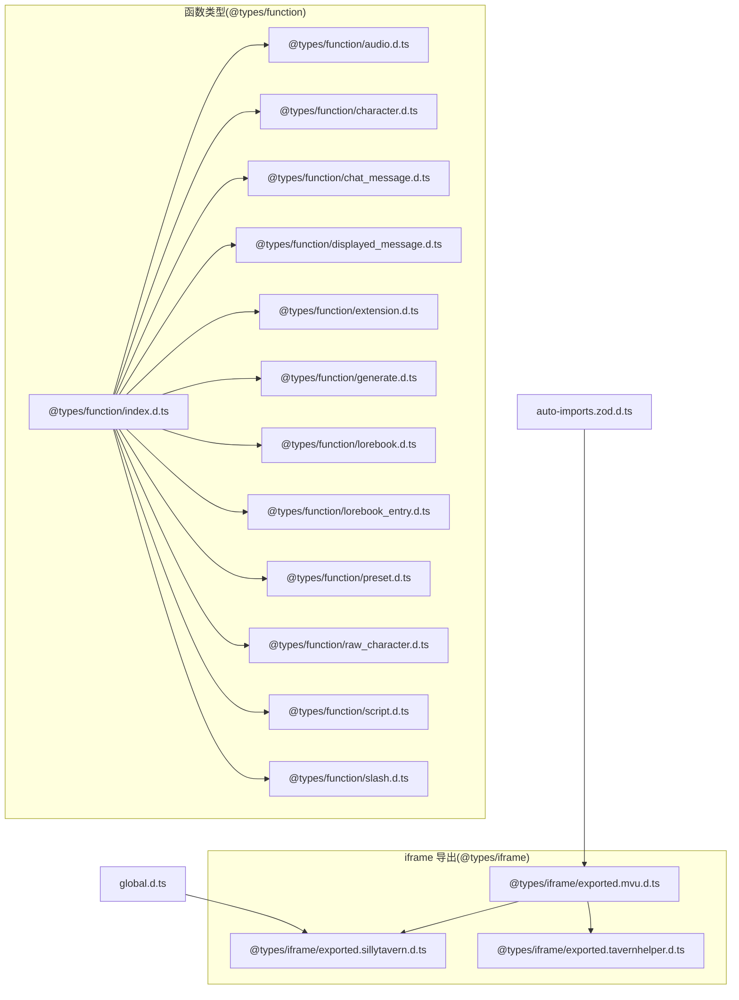
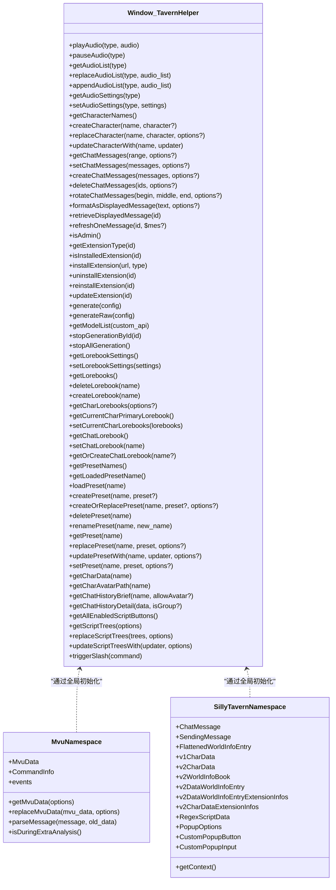
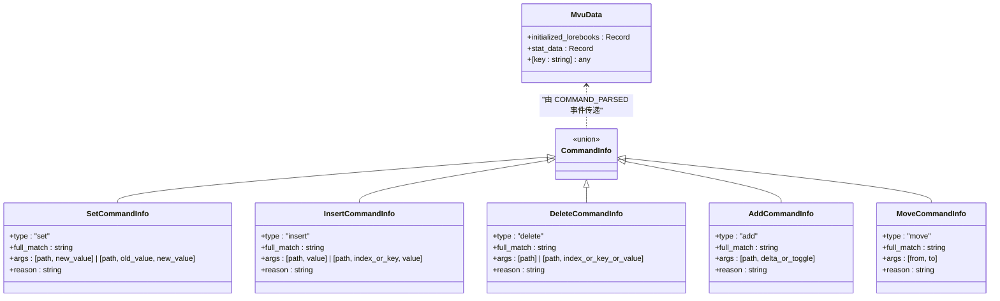
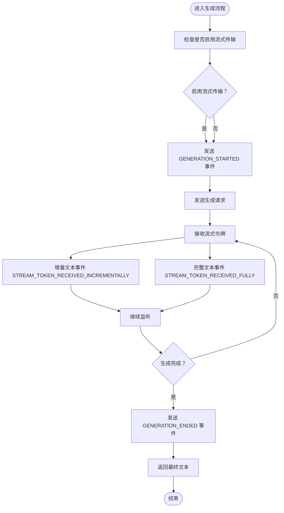

# 类型定义

<cite>
**本文档引用的文件**
- [@types/function/index.d.ts](file://@types/function/index.d.ts)
- [@types/iframe/exported.mvu.d.ts](file://@types/iframe/exported.mvu.d.ts)
- [@types/iframe/exported.sillytavern.d.ts](file://@types/iframe/exported.sillytavern.d.ts)
- [@types/iframe/exported.tavernhelper.d.ts](file://@types/iframe/exported.tavernhelper.d.ts)
- [global.d.ts](file://global.d.ts)
- [auto-imports.zod.d.ts](file://auto-imports.zod.d.ts)
- [@types/function/audio.d.ts](file://@types/function/audio.d.ts)
- [@types/function/character.d.ts](file://@types/function/character.d.ts)
- [@types/function/chat_message.d.ts](file://@types/function/chat_message.d.ts)
- [@types/function/displayed_message.d.ts](file://@types/function/displayed_message.d.ts)
- [@types/function/extension.d.ts](file://@types/function/extension.d.ts)
- [@types/function/generate.d.ts](file://@types/function/generate.d.ts)
- [@types/function/lorebook.d.ts](file://@types/function/lorebook.d.ts)
- [@types/function/lorebook_entry.d.ts](file://@types/function/lorebook_entry.d.ts)
- [@types/function/preset.d.ts](file://@types/function/preset.d.ts)
- [@types/function/raw_character.d.ts](file://@types/function/raw_character.d.ts)
- [@types/function/script.d.ts](file://@types/function/script.d.ts)
- [@types/function/slash.d.ts](file://@types/function/slash.d.ts)
</cite>

## 目录
1. [简介](#简介)
2. [项目结构](#项目结构)
3. [核心组件](#核心组件)
4. [架构总览](#架构总览)
5. [详细组件分析](#详细组件分析)
6. [依赖分析](#依赖分析)
7. [性能考虑](#性能考虑)
8. [故障排除指南](#故障排除指南)
9. [结论](#结论)
10. [附录](#附录)

## 简介
本文件为该项目的类型定义参考文档，系统梳理并解释项目中使用的所有 TypeScript 类型定义，包括函数类型、数据结构类型、接口类型与枚举类型。文档旨在帮助开发者理解各类型的作用、字段含义与使用场景，并提供类型继承关系图、类型别名说明、最佳实践与常见错误规避方法，以及类型定义与运行时行为之间的关系。

## 项目结构
类型定义主要分布在以下目录与文件中：
- @types/function：面向“函数类型”的类型定义，涵盖音频、角色卡、聊天消息、显示消息、扩展、生成、世界书、预设、原始角色卡、脚本、斜杠命令等模块。
- @types/iframe：面向“iframe 导出接口”的类型定义，涵盖 MVU 变量框架、SillyTavern 上下文、TavernHelper 等。
- global.d.ts：全局模块声明与 Zod 类型推断导出。
- auto-imports.zod.d.ts：自动导入的 Zod 类型别名导出。



**图表来源**
- [@types/function/index.d.ts:1-170](file://@types/function/index.d.ts#L1-L170)
- [@types/iframe/exported.mvu.d.ts:1-190](file://@types/iframe/exported.mvu.d.ts#L1-L190)
- [@types/iframe/exported.sillytavern.d.ts:1-698](file://@types/iframe/exported.sillytavern.d.ts#L1-L698)
- [@types/iframe/exported.tavernhelper.d.ts:1-6](file://@types/iframe/exported.tavernhelper.d.ts#L1-L6)
- [global.d.ts:1-45](file://global.d.ts#L1-L45)
- [auto-imports.zod.d.ts:1-15](file://auto-imports.zod.d.ts#L1-L15)

**章节来源**
- [@types/function/index.d.ts:1-170](file://@types/function/index.d.ts#L1-L170)
- [@types/iframe/exported.mvu.d.ts:1-190](file://@types/iframe/exported.mvu.d.ts#L1-L190)
- [@types/iframe/exported.sillytavern.d.ts:1-698](file://@types/iframe/exported.sillytavern.d.ts#L1-L698)
- [@types/iframe/exported.tavernhelper.d.ts:1-6](file://@types/iframe/exported.tavernhelper.d.ts#L1-L6)
- [global.d.ts:1-45](file://global.d.ts#L1-L45)
- [auto-imports.zod.d.ts:1-15](file://auto-imports.zod.d.ts#L1-L15)

## 核心组件
本节概述项目中关键类型族及其职责：
- 窗口扩展类型：为浏览器窗口扩展 TavernHelper 接口，统一暴露各类 API。
- MVU 变量框架类型：定义 MvuData、CommandInfo 及事件常量，支撑变量解析与更新流程。
- SillyTavern 上下文类型：定义聊天消息、发送消息、世界信息条目、角色数据结构等。
- 函数族类型：围绕音频、角色卡、聊天消息、显示消息、扩展、生成、世界书、预设、原始角色卡、脚本、斜杠命令等模块的类型与函数签名。

**章节来源**
- [@types/function/index.d.ts:1-170](file://@types/function/index.d.ts#L1-L170)
- [@types/iframe/exported.mvu.d.ts:1-190](file://@types/iframe/exported.mvu.d.ts#L1-L190)
- [@types/iframe/exported.sillytavern.d.ts:1-698](file://@types/iframe/exported.sillytavern.d.ts#L1-L698)

## 架构总览
类型定义与运行时的关系体现在以下方面：
- 窗口扩展类型确保在运行时可通过 window.TavernHelper 访问到强类型 API。
- MVU 类型定义与 SillyTavern 类型定义相互协作，前者负责变量解析与更新，后者负责消息、角色、世界书等数据结构。
- 函数族类型为具体业务逻辑提供类型约束，保证调用方与实现方的一致性。



**图表来源**
- [@types/function/index.d.ts:1-170](file://@types/function/index.d.ts#L1-L170)
- [@types/iframe/exported.mvu.d.ts:1-190](file://@types/iframe/exported.mvu.d.ts#L1-L190)
- [@types/iframe/exported.sillytavern.d.ts:1-698](file://@types/iframe/exported.sillytavern.d.ts#L1-L698)

## 详细组件分析

### 窗口扩展类型：Window.TavernHelper
- 作用：为浏览器窗口扩展 TavernHelper 接口，统一暴露音频、角色卡、聊天消息、显示消息、扩展、生成、世界书、预设、原始角色卡、脚本、斜杠命令等 API。
- 关键点：
  - 通过属性分组组织 API，便于按功能域检索。
  - 提供音频播放、暂停、列表替换、设置修改等能力。
  - 提供角色卡的创建、替换、更新、删除等能力。
  - 提供聊天消息的获取、设置、创建、删除、旋转等能力。
  - 提供显示消息的格式化与刷新能力。
  - 提供扩展的安装、卸载、更新、查询等能力。
  - 提供生成文本的多种模式与自定义 API 支持。
  - 提供世界书与预设的管理能力。
  - 提供原始角色卡数据的访问与聊天历史查询。
  - 提供脚本树的获取与更新能力。
  - 提供斜杠命令的触发能力。

**章节来源**
- [@types/function/index.d.ts:1-170](file://@types/function/index.d.ts#L1-L170)

### MVU 变量框架类型
- MvuData：包含已初始化的世界书列表与实际变量数据，支持动态扩展键。
- CommandInfo：命令信息联合类型，包含 set、insert、delete、add、move 五种命令类型及参数、原因等。
- 事件常量：VARIABLE_INITIALIZED、VARIABLE_UPDATE_STARTED、COMMAND_PARSED、VARIABLE_UPDATE_ENDED、BEFORE_MESSAGE_UPDATE。
- 核心函数：
  - getMvuData：获取指定范围的变量数据。
  - replaceMvuData：替换变量数据。
  - parseMessage：解析包含变量更新命令的消息并返回新数据。
  - isDuringExtraAnalysis：判断是否正在进行额外模型解析。



**图表来源**
- [@types/iframe/exported.mvu.d.ts:1-190](file://@types/iframe/exported.mvu.d.ts#L1-L190)

**章节来源**
- [@types/iframe/exported.mvu.d.ts:1-190](file://@types/iframe/exported.mvu.d.ts#L1-L190)

### SillyTavern 上下文类型
- ChatMessage：聊天消息结构，包含发送者、角色、是否隐藏、消息正文、数据与扩展信息。
- SendingMessage：发送消息结构，支持纯文本与多模态内容（文本、图片、视频）。
- FlattenedWorldInfoEntry：扁平化的世界信息条目，包含键、逻辑、位置、概率、延迟、粘性、冷却、延迟等字段。
- v1CharData/v2CharData：角色数据结构，包含名称、描述、个性、背景、首次消息、示例消息、创作者注释、标签、系统提示、历史指令、扩展信息等。
- v2WorldInfoBook/v2DataWorldInfoEntry：世界书与条目结构，包含键、内容、启用状态、插入顺序、扩展信息等。
- v2DataWorldInfoEntryExtensionInfos/v2CharDataExtensionInfos：扩展信息结构，包含递归控制、概率、深度、选择逻辑、分组权重、向量化、显示顺序等。
- RegexScriptData：正则脚本数据，包含查找正则、替换字符串、修剪字符串、放置位置、启用状态、Markdown 限制、提示词限制、编辑时运行、正则替换、最小/最大深度等。
- PopupOptions/CustomPopupButton/CustomPopupInput：弹窗相关类型，支持按钮、输入、动画、宽屏模式等。

```mermaid
classDiagram
class ChatMessage {
+name : string
+is_user : boolean
+is_system : boolean
+mes : string
+swipe_id? : number
+swipes? : string[]
+swipe_info? : Record<string, any>[]
+extra? : Record<string, any>
+variables? : Record<string, any>[] | { [swipe_id : number] : Record<string, any> }
}
class SendingMessage {
+role : "user"|"assistant"|"system"
+content : string | [text|image_url|video_url]
}
class FlattenedWorldInfoEntry {
+uid : number
+displayIndex : number
+comment? : string
+disable : boolean
+constant : boolean
+selective : boolean
+key : string[]
+selectiveLogic : 0|1|2|3
+keysecondary : string[]
+scanDepth : number|null
+vectorized : boolean
+position : 0|1|2|3|4|5|6
+role : 0|1|2|null
+depth : number
+order : number
+content : string
+useProbability : boolean
+probability : number
+excludeRecursion : boolean
+preventRecursion : boolean
+delayUntilRecursion : boolean|number
+sticky : number|null
+cooldown : number|null
+delay : number|null
+extra? : Record<string, any>
}
class v1CharData {
+name : string
+description : string
+personality : string
+scenario : string
+first_mes : string
+mes_example : string
+creatorcomment : string
+tags : string[]
+talkativeness : number
+fav : boolean|string
+create_date : string
+data : v2CharData
+chat : string
+avatar : string
+json_data : string
+shallow? : boolean
}
class v2CharData {
+name : string
+description : string
+character_version : string
+personality : string
+scenario : string
+first_mes : string
+mes_example : string
+creator_notes : string
+tags : string[]
+system_prompt : string
+post_history_instructions : string
+creator : string
+alternate_greetings : string[]
+character_book : v2WorldInfoBook
+extensions : v2CharDataExtensionInfos
}
class v2WorldInfoBook {
+name : string
+entries : v2DataWorldInfoEntry[]
}
class v2DataWorldInfoEntry {
+keys : string[]
+secondary_keys : string[]
+comment : string
+content : string
+constant : boolean
+selective : boolean
+insertion_order : number
+enabled : boolean
+position : string
+extensions : v2DataWorldInfoEntryExtensionInfos
+id : number
}
class v2DataWorldInfoEntryExtensionInfos {
+position : number
+exclude_recursion : boolean
+probability : number
+useProbability : boolean
+depth : number
+selectiveLogic : number
+group : string
+group_override : boolean
+group_weight : number
+prevent_recursion : boolean
+delay_until_recursion : boolean
+scan_depth : number
+match_whole_words : boolean
+use_group_scoring : boolean
+case_sensitive : boolean
+automation_id : string
+role : number
+vectorized : boolean
+display_index : number
+match_persona_description : boolean
+match_character_description : boolean
+match_character_personality : boolean
+match_character_depth_prompt : boolean
+match_scenario : boolean
+match_creator_notes : boolean
}
class v2CharDataExtensionInfos {
+talkativeness : number
+fav : boolean
+world : string
+depth_prompt : { depth : number, prompt : string, role : "system"|"user"|"assistant" }
+regex_scripts : RegexScriptData[]
}
class RegexScriptData {
+id : string
+scriptName : string
+findRegex : string
+replaceString : string
+trimStrings : string[]
+placement : number[]
+disabled : boolean
+markdownOnly : boolean
+promptOnly : boolean
+runOnEdit : boolean
+substituteRegex : number
+minDepth : number
+maxDepth : number
}
class PopupOptions {
+okButton? : string|boolean
+cancelButton? : string|boolean
+rows? : number
+wide? : boolean
+wider? : boolean
+large? : boolean
+transparent? : boolean
+allowHorizontalScrolling? : boolean
+allowVerticalScrolling? : boolean
+leftAlign? : boolean
+animation? : "slow"|"fast"|"none"
+defaultResult? : number
+customButtons? : CustomPopupButton[]|string[]
+customInputs? : CustomPopupInput[]
+onClosing? : (popup) => Promise<boolean|void>
+onClose? : (popup) => Promise<void>
+onOpen? : (popup) => Promise<void>
+cropAspect? : number
+cropImage? : string
}
class CustomPopupButton {
+text : string
+result? : number
+classes? : string[]|string
+action? : () => void
+appendAtEnd? : boolean
}
class CustomPopupInput {
+id : string
+label : string
+tooltip? : string
+defaultState? : boolean
+type? : string
}
ChatMessage --> SendingMessage : "发送时转换"
v1CharData --> v2CharData : "包含"
v2CharData --> v2WorldInfoBook : "包含"
v2WorldInfoBook --> v2DataWorldInfoEntry : "包含"
v2DataWorldInfoEntry --> v2DataWorldInfoEntryExtensionInfos : "包含"
v2CharData --> v2CharDataExtensionInfos : "包含"
v2CharDataExtensionInfos --> RegexScriptData : "包含"
PopupOptions --> CustomPopupButton : "包含"
PopupOptions --> CustomPopupInput : "包含"
```

**图表来源**
- [@types/iframe/exported.sillytavern.d.ts:1-698](file://@types/iframe/exported.sillytavern.d.ts#L1-L698)

**章节来源**
- [@types/iframe/exported.sillytavern.d.ts:1-698](file://@types/iframe/exported.sillytavern.d.ts#L1-L698)

### 函数族类型详解

#### 音频类型与函数
- Audio/AudioWithOptionalTitle：音频标题与 URL 结构，支持可选标题。
- AudioSettings：音频设置，包含启用、播放模式、静音、音量等。
- playAudio/pauseAudio/getAudioList/replaceAudioList/appendAudioList/getAudioSettings/setAudioSettings：音频播放与设置相关函数。

**章节来源**
- [@types/function/audio.d.ts:1-106](file://@types/function/audio.d.ts#L1-L106)

#### 角色卡类型与函数
- Character：角色卡结构，包含头像、版本、创作者、注释、世界书、描述、首次消息、扩展等。
- getCharacterNames/getCurrentCharacterName/createCharacter/createOrReplaceCharacter/deleteCharacter/getCharacter/replaceCharacter/updateCharacterWith：角色卡管理相关函数。

**章节来源**
- [@types/function/character.d.ts:1-173](file://@types/function/character.d.ts#L1-L173)

#### 聊天消息类型与函数
- ChatMessage/ChatMessageSwiped：聊天消息与包含多页的结构。
- GetChatMessagesOption/SetChatMessagesOption/CreateChatMessagesOption：查询与操作选项。
- getChatMessages/setChatMessages/createChatMessages/deleteChatMessages/rotateChatMessages：聊天消息管理相关函数。

**章节来源**
- [@types/function/chat_message.d.ts:1-235](file://@types/function/chat_message.d.ts#L1-L235)

#### 显示消息类型与函数
- retrieveDisplayedMessage/formatAsDisplayedMessage/refreshOneMessage：显示消息的获取、格式化与刷新函数。

**章节来源**
- [@types/function/displayed_message.d.ts:1-71](file://@types/function/displayed_message.d.ts#L1-L71)

#### 扩展类型与函数
- isAdmin/getExtensionType/ExtensionInstallationInfo/getExtensionInstallationInfo/isInstalledExtension/installExtension/uninstallExtension/reinstallExtension/updateExtension：扩展管理相关函数。

**章节来源**
- [@types/function/extension.d.ts:1-105](file://@types/function/extension.d.ts#L1-L105)

#### 生成类型与函数
- GenerateConfig/GenerateRawConfig/BuiltinPrompt/RolePrompt/Overrides/CustomApiConfig：生成配置与参数类型。
- generate/generateRaw/getModelList/stopGenerationById/stopAllGeneration/builtin_prompt_default_order：生成相关函数。



**图表来源**
- [@types/function/generate.d.ts:1-318](file://@types/function/generate.d.ts#L1-L318)

**章节来源**
- [@types/function/generate.d.ts:1-318](file://@types/function/generate.d.ts#L1-L318)

#### 世界书与条目类型与函数
- LorebookSettings/LorebookEntry：世界书设置与条目结构（已标记为废弃，建议使用 Worldbook 对应类型）。
- getLorebookSettings/setLorebookSettings/getLorebooks/deleteLorebook/createLorebook/getCharLorebooks/getCurrentCharPrimaryLorebook/setCurrentCharLorebooks/getChatLorebook/setChatLorebook/getOrCreateChatLorebook：世界书管理相关函数。

**章节来源**
- [@types/function/lorebook.d.ts:1-62](file://@types/function/lorebook.d.ts#L1-L62)

#### 世界书条目类型与函数
- LorebookEntry：世界书条目结构（已标记为废弃，建议使用 Worldbook 对应类型）。
- getLorebookEntries/replaceLorebookEntries/updateLorebookEntriesWith/setLorebookEntries/createLorebookEntries/deleteLorebookEntries：世界书条目管理相关函数。

**章节来源**
- [@types/function/lorebook_entry.d.ts:1-77](file://@types/function/lorebook_entry.d.ts#L1-L77)

#### 预设类型与函数
- Preset/PresetPrompt/PresetNormalPrompt/PresetSystemPrompt/PresetPlaceholderPrompt：预设结构与提示词类型。
- isPresetNormalPrompt/isPresetSystemPrompt/isPresetPlaceholderPrompt/default_preset/getPresetNames/getLoadedPresetName/loadPreset/getPreset/createPreset/createOrReplacePreset/deletePreset/renamePreset/replacePreset/updatePresetWith/setPreset：预设管理相关函数。

**章节来源**
- [@types/function/preset.d.ts:1-366](file://@types/function/preset.d.ts#L1-L366)

#### 原始角色卡类型与函数
- RawCharacter：角色卡数据封装类，提供查找、聊天文件获取、角色书与世界名称获取等方法。
- getCharData/getCharAvatarPath/getChatHistoryBrief/getChatHistoryDetail：原始角色卡访问函数。

**章节来源**
- [@types/function/raw_character.d.ts:1-133](file://@types/function/raw_character.d.ts#L1-L133)

#### 脚本类型与函数
- Script/ScriptFolder/ScriptTree/ScriptButton：脚本树结构与按钮类型。
- ScriptTreesOptions/getScriptTrees/replaceScriptTrees/updateScriptTreesWith/getAllEnabledScriptButtons：脚本树管理相关函数。

**章节来源**
- [@types/function/script.d.ts:1-82](file://@types/function/script.d.ts#L1-L82)

#### 斜杠命令类型与函数
- triggerSlash：触发斜杠命令函数。

**章节来源**
- [@types/function/slash.d.ts:1-30](file://@types/function/slash.d.ts#L1-L30)

### TavernHelper 类型
- exported.tavernhelper.d.ts：声明 TavernHelper 为 window.TavernHelper 的类型别名，便于在项目中直接引用。

**章节来源**
- [@types/iframe/exported.tavernhelper.d.ts:1-6](file://@types/iframe/exported.tavernhelper.d.ts#L1-L6)

### 全局与 Zod 类型
- global.d.ts：定义模块资源导入类型（raw、url、css、html、md、yaml、vue），以及 YAML、z 与 MVU Schema 注册模块的类型。
- auto-imports.zod.d.ts：自动导入 zod 类型别名，使 z infer/input/output 在全局可用。

**章节来源**
- [global.d.ts:1-45](file://global.d.ts#L1-L45)
- [auto-imports.zod.d.ts:1-15](file://auto-imports.zod.d.ts#L1-L15)

## 依赖分析
- @types/function/index.d.ts 作为入口，聚合所有函数类型模块，形成统一的 TavernHelper 接口。
- @types/iframe/exported.mvu.d.ts 与 @types/iframe/exported.sillytavern.d.ts 通过全局初始化相互协作，分别负责变量解析与消息/角色/世界书等数据结构。
- global.d.ts 与 auto-imports.zod.d.ts 为类型系统提供基础能力，确保 Zod 类型与模块导入的类型安全。

```mermaid
graph TB
A["@types/function/index.d.ts"] --> B["@types/function/audio.d.ts"]
A --> C["@types/function/character.d.ts"]
A --> D["@types/function/chat_message.d.ts"]
A --> E["@types/function/displayed_message.d.ts"]
A --> F["@types/function/extension.d.ts"]
A --> G["@types/function/generate.d.ts"]
A --> H["@types/function/lorebook.d.ts"]
A --> I["@types/function/lorebook_entry.d.ts"]
A --> J["@types/function/preset.d.ts"]
A --> K["@types/function/raw_character.d.ts"]
A --> L["@types/function/script.d.ts"]
A --> M["@types/function/slash.d.ts"]
N["@types/iframe/exported.mvu.d.ts"] --> O["@types/iframe/exported.sillytavern.d.ts"]
P["global.d.ts"] --> O
Q["auto-imports.zod.d.ts"] --> N
```



**图表来源**
- [@types/function/index.d.ts:1-170](file://@types/function/index.d.ts#L1-L170)
- [@types/function/audio.d.ts:1-106](file://@types/function/audio.d.ts#L1-L106)
- [@types/function/character.d.ts:1-173](file://@types/function/character.d.ts#L1-L173)
- [@types/function/chat_message.d.ts:1-235](file://@types/function/chat_message.d.ts#L1-L235)
- [@types/function/displayed_message.d.ts:1-71](file://@types/function/displayed_message.d.ts#L1-L71)
- [@types/function/extension.d.ts:1-105](file://@types/function/extension.d.ts#L1-L105)
- [@types/function/generate.d.ts:1-318](file://@types/function/generate.d.ts#L1-L318)
- [@types/function/lorebook.d.ts:1-62](file://@types/function/lorebook.d.ts#L1-L62)
- [@types/function/lorebook_entry.d.ts:1-77](file://@types/function/lorebook_entry.d.ts#L1-L77)
- [@types/function/preset.d.ts:1-366](file://@types/function/preset.d.ts#L1-L366)
- [@types/function/raw_character.d.ts:1-133](file://@types/function/raw_character.d.ts#L1-L133)
- [@types/function/script.d.ts:1-82](file://@types/function/script.d.ts#L1-L82)
- [@types/function/slash.d.ts:1-30](file://@types/function/slash.d.ts#L1-L30)
- [@types/iframe/exported.mvu.d.ts:1-190](file://@types/iframe/exported.mvu.d.ts#L1-L190)
- [@types/iframe/exported.sillytavern.d.ts:1-698](file://@types/iframe/exported.sillytavern.d.ts#L1-L698)
- [global.d.ts:1-45](file://global.d.ts#L1-L45)
- [auto-imports.zod.d.ts:1-15](file://auto-imports.zod.d.ts#L1-L15)

**章节来源**
- [@types/function/index.d.ts:1-170](file://@types/function/index.d.ts#L1-L170)
- [@types/iframe/exported.mvu.d.ts:1-190](file://@types/iframe/exported.mvu.d.ts#L1-L190)
- [@types/iframe/exported.sillytavern.d.ts:1-698](file://@types/iframe/exported.sillytavern.d.ts#L1-L698)
- [global.d.ts:1-45](file://global.d.ts#L1-L45)
- [auto-imports.zod.d.ts:1-15](file://auto-imports.zod.d.ts#L1-L15)

## 性能考虑
- 防抖渲染：在批量更新角色卡、预设、脚本树等操作时，优先使用防抖渲染策略，减少 UI 重绘次数。
- 流式生成：启用流式传输时，合理监听增量文本事件，避免频繁 DOM 更新；在静默生成场景下，使用生成 ID 精确控制停止。
- 事件驱动：利用 COMMAND_PARSED/VARIABLE_UPDATE_ENDED 等事件在合适时机修改变量，避免不必要的全量重算。
- 模块化导入：通过模块声明（raw、url、css、html、md、yaml、vue）避免运行时类型检查开销。

## 故障排除指南
- 事件监听：确保在生成前监听 STREAM_TOKEN_RECEIVED_FULLY/INCREMENTALLY 事件，否则无法接收到流式文本。
- 变量更新：使用 COMMAND_PARSED 事件修改命令参数或添加新命令，使用 VARIABLE_UPDATE_ENDED 事件进行数值校验与修正。
- 角色卡与预设：在替换或更新角色卡、预设时，注意重复系统/占位提示词会导致异常；必要时先读取再合并。
- 扩展管理：安装/卸载/更新扩展后需刷新页面以生效；检查扩展类型与安装状态。
- 世界书与条目：废弃 API 已标注，迁移至 Worldbook 对应类型与函数，避免未来不可用风险。

**章节来源**
- [@types/function/generate.d.ts:1-318](file://@types/function/generate.d.ts#L1-L318)
- [@types/iframe/exported.mvu.d.ts:1-190](file://@types/iframe/exported.mvu.d.ts#L1-L190)
- [@types/function/preset.d.ts:1-366](file://@types/function/preset.d.ts#L1-L366)
- [@types/function/extension.d.ts:1-105](file://@types/function/extension.d.ts#L1-L105)
- [@types/function/lorebook.d.ts:1-62](file://@types/function/lorebook.d.ts#L1-L62)

## 结论
本类型定义参考文档系统梳理了项目中的函数类型、数据结构类型、接口类型与枚举类型，明确了各类型的作用、字段含义与使用场景，并提供了类型继承关系图、类型别名说明、最佳实践与常见错误规避方法。通过理解类型定义与运行时行为的关系，开发者可以更高效地编写与维护高质量的脚本与界面。

## 附录
- 类型别名与推断：通过 global.d.ts 与 auto-imports.zod.d.ts，Zod 类型的 infer/input/output 在全局可用，简化类型推断与校验。
- 兼容性提示：部分世界书与条目 API 已标记为废弃，建议迁移至 Worldbook 对应类型与函数，确保长期兼容性。

**章节来源**
- [global.d.ts:1-45](file://global.d.ts#L1-L45)
- [auto-imports.zod.d.ts:1-15](file://auto-imports.zod.d.ts#L1-L15)
- [@types/function/lorebook.d.ts:1-62](file://@types/function/lorebook.d.ts#L1-L62)
- [@types/function/lorebook_entry.d.ts:1-77](file://@types/function/lorebook_entry.d.ts#L1-L77)