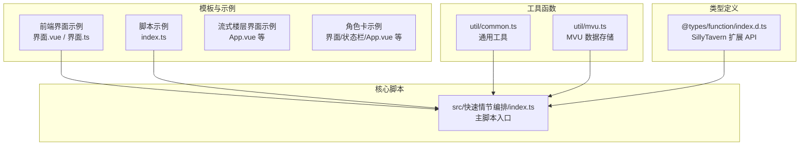
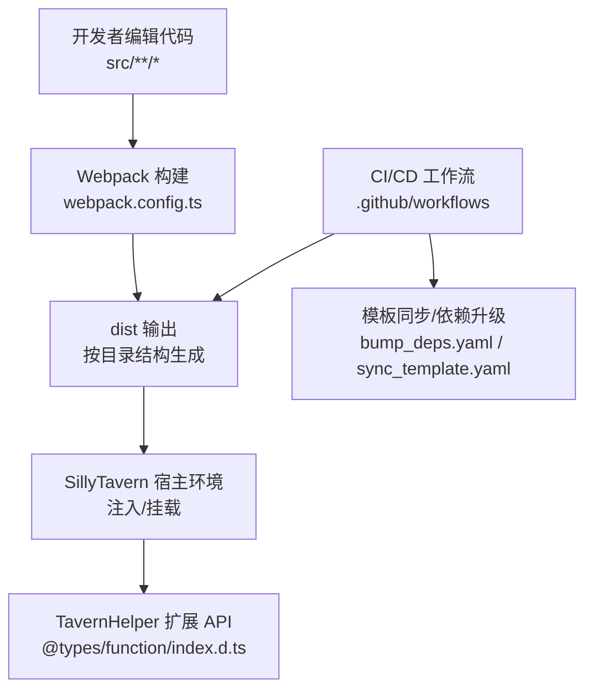
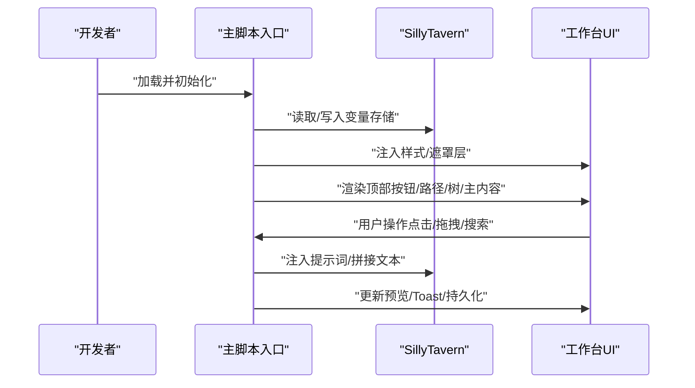
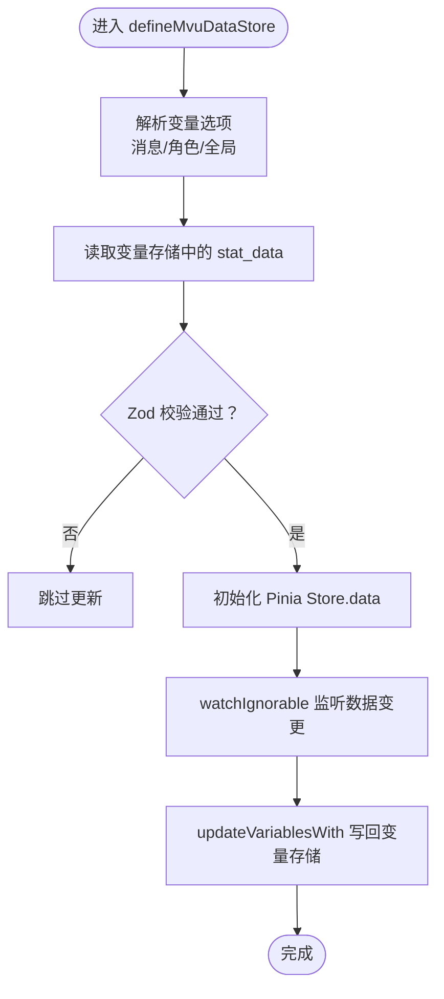
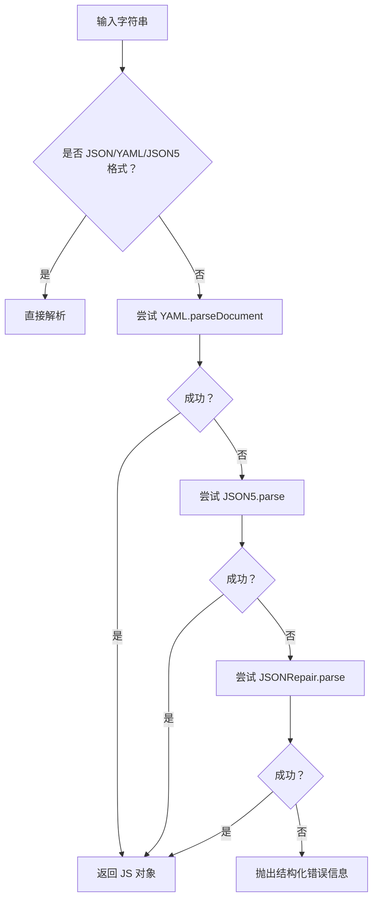
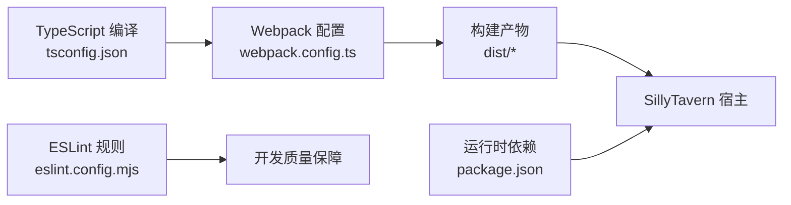

# 开发指南

<cite>
**本文引用的文件**
- [README.md](file://README.md)
- [package.json](file://package.json)
- [webpack.config.ts](file://webpack.config.ts)
- [tsconfig.json](file://tsconfig.json)
- [eslint.config.mjs](file://eslint.config.mjs)
- [src/快速情节编排/index.ts](file://src/快速情节编排/index.ts)
- [util/common.ts](file://util/common.ts)
- [util/mvu.ts](file://util/mvu.ts)
- [@types/function/index.d.ts](file://@types/function/index.d.ts)
- [示例/前端界面示例/界面.vue](file://示例/前端界面示例/界面.vue)
- [示例/前端界面示例/界面.ts](file://示例/前端界面示例/界面.ts)
- [示例/脚本示例/index.ts](file://示例/脚本示例/index.ts)
</cite>

## 目录
1. [简介](#简介)
2. [项目结构](#项目结构)
3. [核心组件](#核心组件)
4. [架构总览](#架构总览)
5. [详细组件分析](#详细组件分析)
6. [依赖分析](#依赖分析)
7. [性能考虑](#性能考虑)
8. [故障排查指南](#故障排查指南)
9. [结论](#结论)
10. [附录](#附录)

## 简介
本开发指南面向希望基于酒馆助手模板进行前端界面与脚本开发的工程师与爱好者。内容覆盖从工程搭建、Vue3 组件开发、TypeScript 类型系统、Webpack 构建配置到 Git 工作流与 CI/CD 的完整开发链路；同时提供代码规范、命名约定、模块组织、依赖管理、测试策略、代码审查标准、发布流程以及与 SillyTavern API 的集成方式、数据模型设计与状态管理策略。文档兼顾不同经验水平读者，既提供高层概览，也给出可落地的实操步骤与可视化图示。

## 项目结构
本仓库采用“模板 + 示例 + 工具函数 + 类型定义”的分层组织方式：
- 模板与示例：提供“前端界面/流式楼层界面/脚本/角色卡”等模板与示例，便于快速起步
- 工具函数：封装通用能力（如 MVU 状态管理、数据解析、版本校验等）
- 类型定义：对酒馆助手扩展 API 进行强类型声明，保障与 SillyTavern 的交互安全
- 构建与规范：通过 Webpack、ESLint、Prettier、TypeScript 等工具形成统一的开发体验

**图表来源**
- [示例/前端界面示例/界面.vue:1-4](file://示例/前端界面示例/界面.vue#L1-L4)
- [示例/前端界面示例/界面.ts:1-22](file://示例/前端界面示例/界面.ts#L1-L22)
- [示例/脚本示例/index.ts:1-7](file://示例/脚本示例/index.ts#L1-L7)
- [util/common.ts:1-135](file://util/common.ts#L1-L135)
- [util/mvu.ts:1-66](file://util/mvu.ts#L1-L66)
- [@types/function/index.d.ts:1-170](file://@types/function/index.d.ts#L1-L170)
- [src/快速情节编排/index.ts:1-800](file://src/快速情节编排/index.ts#L1-L800)

**章节来源**
- [README.md:1-105](file://README.md#L1-L105)
- [package.json:1-120](file://package.json#L1-L120)
- [tsconfig.json:1-54](file://tsconfig.json#L1-L54)

## 核心组件
- 主脚本入口：负责在宿主环境中初始化 UI、状态持久化、与 SillyTavern API 交互、注入提示词、渲染面板等
- MVU 数据存储：基于 Pinia 的 MVU（Model-View-Update）模式，提供类型安全的数据读写与自动同步
- 通用工具：提供正则构造、UUID、版本检查、错误美化、YAML/JSON 解析修复等能力
- 类型定义：对 TavernHelper 扩展 API 进行完整声明，确保 IDE 提示与编译期校验

**章节来源**
- [src/快速情节编排/index.ts:1-800](file://src/快速情节编排/index.ts#L1-L800)
- [util/mvu.ts:1-66](file://util/mvu.ts#L1-L66)
- [util/common.ts:1-135](file://util/common.ts#L1-L135)
- [@types/function/index.d.ts:1-170](file://@types/function/index.d.ts#L1-L170)

## 架构总览
下图展示了从开发到部署的关键路径：本地开发（Webpack 监听）、构建产物（dist 输出）、与宿主环境（SillyTavern）的交互，以及与 CI/CD 的联动。

**图表来源**
- [webpack.config.ts:77-572](file://webpack.config.ts#L77-L572)
- [@types/function/index.d.ts:1-170](file://@types/function/index.d.ts#L1-L170)
- [README.md:71-105](file://README.md#L71-L105)

## 详细组件分析

### 主脚本入口（快速情节编排）
- 功能职责
  - 初始化窗口与文档上下文，适配多层 iframe/parent 环境
  - 管理脚本状态（分类树、条目、收藏、UI 状态、历史路径）
  - 与 SillyTavern API 交互：读取/写入变量、注入提示词、触发斜杠命令
  - 渲染工作台 UI、处理拖拽/缩放/预览、提供 Toast 通知
- 关键流程
  - 加载/归一化数据包（含默认值与迁移）
  - 注入样式与遮罩层，渲染顶部按钮、路径导航、侧边树、主内容区
  - 处理“然后/同时”占位符注入与预览令牌展示
  - 持久化状态到变量存储或 localStorage

**图表来源**
- [src/快速情节编排/index.ts:1-800](file://src/快速情节编排/index.ts#L1-L800)

**章节来源**
- [src/快速情节编排/index.ts:1-800](file://src/快速情节编排/index.ts#L1-L800)

### MVU 数据存储（Pinia + Zod）
- 设计思想
  - 基于 Zod Schema 对数据进行运行时校验与类型推断
  - 通过 Pinia Store 将数据与响应式更新绑定
  - 自动轮询与 watch 结合，保证数据在变量存储与本地状态之间双向一致
- 关键点
  - 支持按消息/角色/全局等维度的变量选项
  - 内置错误捕获与防抖更新，避免循环写入
  - 提供额外初始化钩子，便于扩展字段

**图表来源**
- [util/mvu.ts:1-66](file://util/mvu.ts#L1-L66)

**章节来源**
- [util/mvu.ts:1-66](file://util/mvu.ts#L1-L66)

### 通用工具（解析/版本/错误美化）
- 正则构造：支持从字符串解析正则，自动处理宏替换与标志位
- 版本检查：对比最小版本需求并弹出错误提示
- 错误美化：将 Zod 校验错误转换为易读的点路径与输入摘要
- 解析修复：优先尝试 YAML/JSON5，再尝试 JSONRepair 修复，最后抛出结构化错误信息

**图表来源**
- [util/common.ts:92-135](file://util/common.ts#L92-L135)

**章节来源**
- [util/common.ts:1-135](file://util/common.ts#L1-L135)

### 类型定义（SillyTavern 扩展 API）
- 覆盖音频、角色、消息、显示消息、扩展、生成、预设、变量、世界书、宏、工具、版本等模块
- 通过 Window 接口扩展，使 IDE 能够提供智能提示与编译期校验
- 建议在开发中结合类型注解与 Zod 校验，确保与宿主 API 的一致性

**章节来源**
- [@types/function/index.d.ts:1-170](file://@types/function/index.d.ts#L1-L170)

### 示例：前端界面（Vue Router + RouterView）
- 通过 RouterView 展示不同路由视图
- 使用内存历史记录，便于在宿主环境中嵌入与切换页面
- 可结合 MVU Store 与 TavernHelper API 实现动态数据驱动

**章节来源**
- [示例/前端界面示例/界面.vue:1-4](file://示例/前端界面示例/界面.vue#L1-L4)
- [示例/前端界面示例/界面.ts:1-22](file://示例/前端界面示例/界面.ts#L1-L22)

### 示例：脚本入口聚合
- 将多个脚本片段按顺序引入，形成完整的功能集合
- 适合模块化拆分复杂脚本，便于维护与复用

**章节来源**
- [示例/脚本示例/index.ts:1-7](file://示例/脚本示例/index.ts#L1-L7)

## 依赖分析
- 构建与打包
  - Webpack 作为核心打包器，配合 ts-loader、vue-loader、postcss/sass、MiniCssExtractPlugin 等插件
  - 支持按需内联/外链资源、按需压缩、分包策略、externals CDN 引入
- 语言与类型
  - TypeScript 严格模式、路径别名、模块解析策略
  - ESLint + Prettier + Vue 插件组合，统一风格与质量
- 运行时依赖
  - Vue3、Pinia、VueUse、React/Pixi 生态组件按需引入
  - jQuery/Toastr/Lodash/YAML/Zod 等常用库

**图表来源**
- [tsconfig.json:1-54](file://tsconfig.json#L1-L54)
- [webpack.config.ts:77-572](file://webpack.config.ts#L77-L572)
- [eslint.config.mjs:1-82](file://eslint.config.mjs#L1-L82)
- [package.json:1-120](file://package.json#L1-L120)

**章节来源**
- [webpack.config.ts:77-572](file://webpack.config.ts#L77-L572)
- [tsconfig.json:1-54](file://tsconfig.json#L1-L54)
- [eslint.config.mjs:1-82](file://eslint.config.mjs#L1-L82)
- [package.json:1-120](file://package.json#L1-L120)

## 性能考虑
- 构建优化
  - 启用分包策略与异步分块，减少首屏体积
  - 生产模式开启 Terser 压缩与保留关键标识符
  - 外部化依赖，优先通过 CDN 加载，降低打包体积
- 运行时优化
  - 使用 VueUse 的轻量响应式工具与懒加载组件
  - MVU Store 防抖与去重更新，避免频繁写入变量存储
  - UI 渲染按需展开/折叠，减少 DOM 负担
- 资源优化
  - CSS/HTML 内联策略按场景选择，平衡缓存与传输
  - 图片/字体资源按需内联或外链

[本节为通用性能建议，无需特定文件来源]

## 故障排查指南
- 构建与打包
  - 若 dist 冲突导致合并困难，可在本地配置合并策略，CI 会重新打包覆盖
  - 如需禁用混淆，可在脚本文件中添加特定标记以影响构建配置
- 类型与 API
  - 使用类型定义文件确保与 TavernHelper API 的一致性，IDE 将提供提示
  - 出现版本不兼容时，使用版本检查工具弹出明确提示
- 运行时问题
  - 通过 MVU Store 的错误捕获包装，定位数据异常
  - 使用通用工具的错误美化输出，快速定位路径与输入问题

**章节来源**
- [README.md:90-105](file://README.md#L90-L105)
- [webpack.config.ts:471-483](file://webpack.config.ts#L471-L483)
- [util/common.ts:70-90](file://util/common.ts#L70-L90)
- [util/mvu.ts:21-64](file://util/mvu.ts#L21-L64)

## 结论
本指南围绕酒馆助手模板提供了从工程搭建到上线运维的全链路实践。通过统一的构建配置、严格的类型约束、模块化的工具函数与 MVU 状态管理，开发者可以高效、稳定地构建复杂的前端界面与脚本。建议在团队协作中遵循本文的代码规范与审查标准，持续优化性能与可维护性。

[本节为总结性内容，无需特定文件来源]

## 附录

### 开发流程与最佳实践
- 代码规范
  - 使用 ESLint 与 Prettier 统一风格，提交前执行格式化与 Lint
  - Vue 单文件组件中，模板/脚本/样式分离清晰，避免过度耦合
- 命名约定
  - 变量与函数使用语义化命名，常量使用全大写与下划线
  - 路由与组件文件名采用帕斯卡命名，模块目录小写
- 模块组织
  - 将通用逻辑抽离至 util，业务逻辑置于 src，模板与示例独立存放
  - MVU Store 与 Zod Schema 分离，确保类型安全与数据一致性
- 依赖管理
  - 通过 package.json 管理依赖，定期执行依赖升级任务
  - 对外部依赖采用 CDN 引入，减少打包体积

**章节来源**
- [eslint.config.mjs:1-82](file://eslint.config.mjs#L1-L82)
- [package.json:1-120](file://package.json#L1-L120)

### Git 工作流与 CI/CD
- 本地开发
  - 使用 watch 模式实时构建，结合浏览器热更新
  - 使用 launch.json（若存在）配置调试目标，注意忽略敏感配置
- 分支与合并
  - 使用 .gitattributes 配置合并策略，避免 dist 冲突
  - 对于模板同步，可通过 PR 合并更新，关注通知邮件
- CI/CD
  - bundle 工作流：自动打包 src 并递增版本号
  - bump_deps 工作流：周期性更新依赖与类型定义
  - sync_template 工作流：自动同步模板仓库更新

**章节来源**
- [README.md:37-105](file://README.md#L37-L105)

### 测试策略与代码审查
- 单元测试
  - 对工具函数（解析/版本/错误美化）编写针对性用例
  - 对 MVU Store 的数据流转与边界条件进行断言
- 集成测试
  - 在宿主环境中验证 UI 交互与 TavernHelper API 调用
- 代码审查
  - 关注类型安全、错误处理、性能与可维护性
  - 评审要点：命名一致性、模块职责单一、依赖最小化

[本节为通用指导，无需特定文件来源]

### 发布流程
- 本地验证
  - 构建生产包，检查 dist 输出与资源完整性
- 自动化
  - 通过 Actions 触发打包与模板同步，确保版本号正确递增
- 分发
  - 使用 jsDelivr 链接分发前端界面或脚本，便于用户一键引入

**章节来源**
- [README.md:49-105](file://README.md#L49-L105)

### 与 SillyTavern API 的集成
- 变量存储
  - 通过 getVariables/insertOrAssignVariables/updateVariablesWith 管理脚本/角色/消息级变量
- 提示词注入
  - 优先使用 injectPrompts，其次回退到斜杠命令注入
- 上下文获取
  - 使用 getContext 获取当前上下文，调用相关 API

**章节来源**
- [src/快速情节编排/index.ts:108-150](file://src/快速情节编排/index.ts#L108-L150)
- [src/快速情节编排/index.ts:595-622](file://src/快速情节编排/index.ts#L595-L622)
- [@types/function/index.d.ts:1-170](file://@types/function/index.d.ts#L1-L170)

### 数据模型设计与状态管理
- 数据模型
  - 使用 Zod Schema 定义数据结构，确保运行时安全
  - 对外暴露只读视图，内部通过 Store 修改
- 状态管理
  - MVU 模式：数据驱动 UI，避免直接操作 DOM
  - 预览与历史：通过 UI State 管理展开/折叠与路径

**章节来源**
- [util/mvu.ts:1-66](file://util/mvu.ts#L1-L66)
- [src/快速情节编排/index.ts:34-237](file://src/快速情节编排/index.ts#L34-L237)