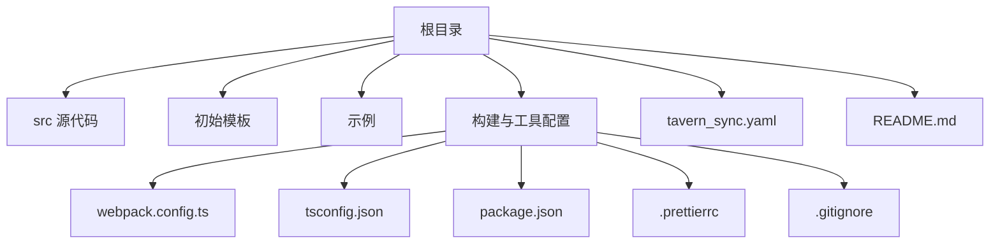
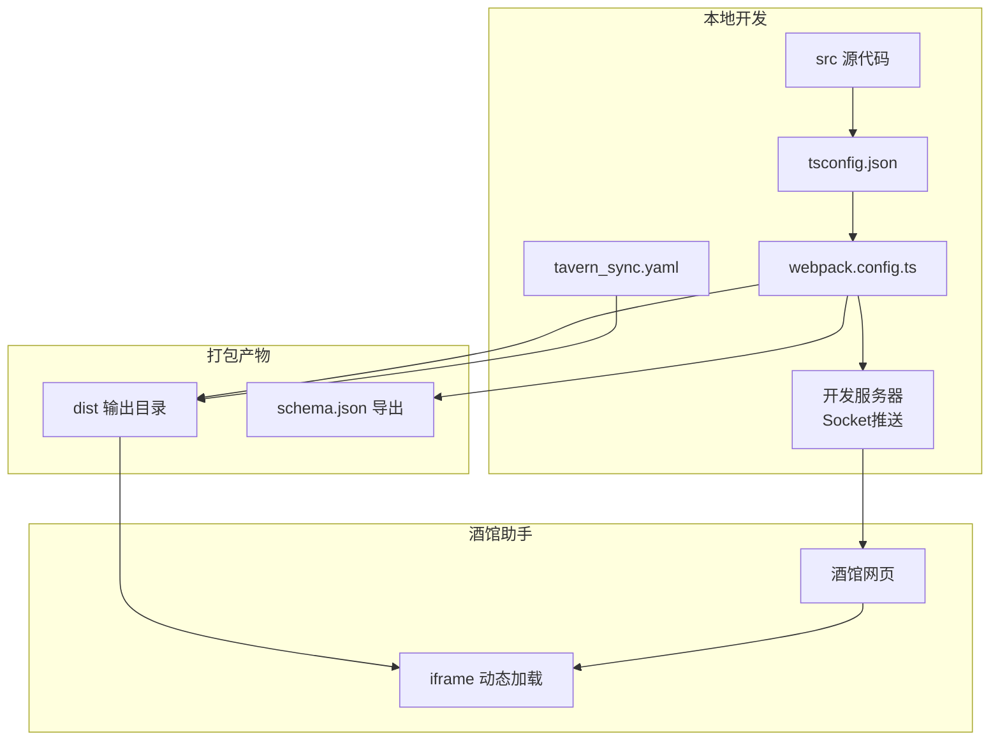
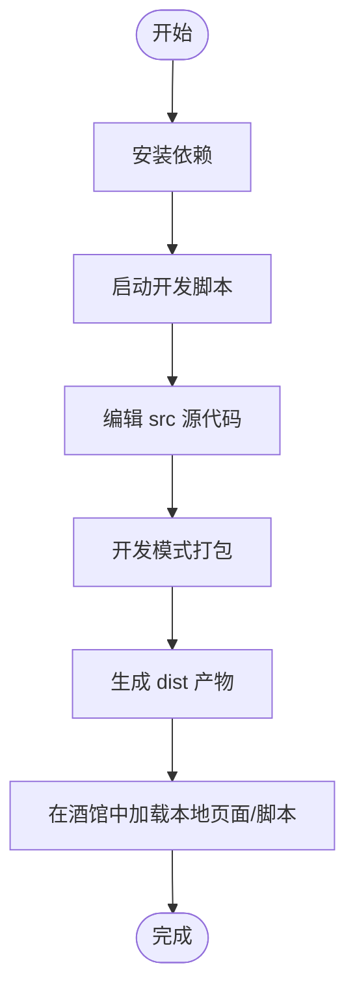
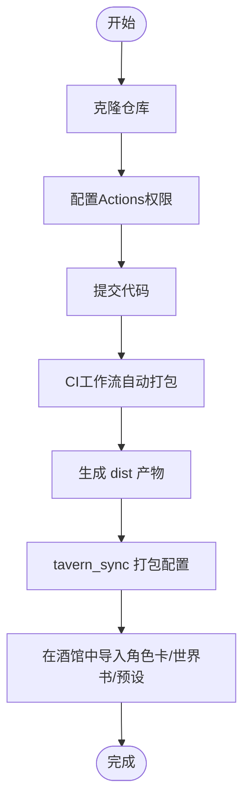
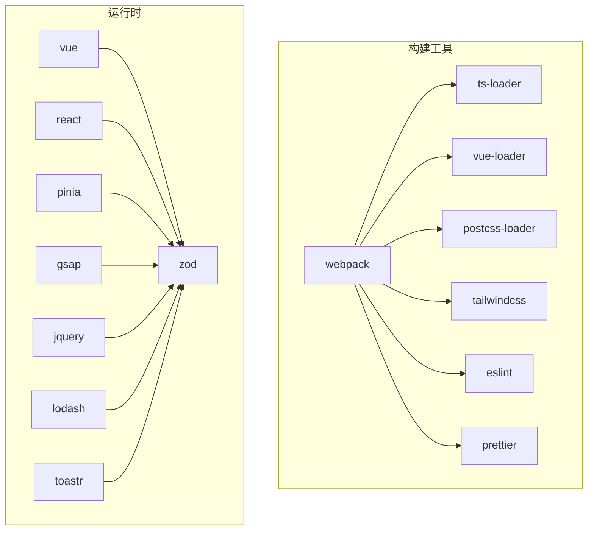

# 快速开始

<cite>
**本文引用的文件**
- [README.md](file://README.md)
- [package.json](file://package.json)
- [webpack.config.ts](file://webpack.config.ts)
- [tsconfig.json](file://tsconfig.json)
- [tavern_sync.yaml](file://tavern_sync.yaml)
- [.prettierrc](file://.prettierrc)
- [.gitignore](file://.gitignore)
- [初始模板/前端界面/导入到酒馆中/界面-实时修改.json](file://初始模板/前端界面/导入到酒馆中/界面-实时修改.json)
- [示例/前端界面示例/index.ts](file://示例/前端界面示例/index.ts)
- [示例/脚本示例/index.ts](file://示例/脚本示例/index.ts)
- [示例/角色卡示例/index.yaml](file://示例/角色卡示例/index.yaml)
- [示例/角色卡示例/世界书/变量/initvar.yaml](file://示例/角色卡示例/世界书/变量/initvar.yaml)
- [示例/角色卡示例/schema.json](file://示例/角色卡示例/schema.json)
- [脚本-快速情节编排-实时修改.json](file://脚本-快速情节编排-实时修改.json)
</cite>

## 目录
1. [简介](#简介)
2. [项目结构](#项目结构)
3. [核心组件](#核心组件)
4. [架构总览](#架构总览)
5. [详细组件分析](#详细组件分析)
6. [依赖关系分析](#依赖关系分析)
7. [性能考虑](#性能考虑)
8. [故障排除指南](#故障排除指南)
9. [结论](#结论)
10. [附录](#附录)

## 简介
本指南面向首次接触“酒馆助手模板”的用户，帮助你在最短时间内完成环境准备、项目克隆与安装、开发环境配置，并掌握两种使用方式：仅本地使用与作为GitHub仓库使用。文档覆盖从零开始的完整流程，包括命令行操作、配置文件修改步骤、项目结构说明、核心文件介绍以及基本使用流程，并提供常见问题解决方案。

## 项目结构
该项目采用“模板 + 示例 + 构建工具 + 同步配置”的组织方式，便于本地开发与CI自动更新。核心目录与文件如下：
- 根目录：构建配置、类型声明、同步配置、示例与模板资源
- src：开发者编写的脚本与前端界面源代码
- 初始模板：角色卡、前端界面、脚本等模板文件
- 示例：完整的角色卡示例、脚本示例、前端界面示例
- 工具链：Webpack、TypeScript、ESLint、Prettier、TailwindCSS 等

图表来源
- [webpack.config.ts:77-80](file://webpack.config.ts#L77-L80)
- [tsconfig.json:41-52](file://tsconfig.json#L41-L52)
- [package.json:1-120](file://package.json#L1-L120)

章节来源
- [README.md:1-105](file://README.md#L1-L105)
- [webpack.config.ts:77-80](file://webpack.config.ts#L77-L80)
- [tsconfig.json:41-52](file://tsconfig.json#L41-L52)
- [package.json:1-120](file://package.json#L1-L120)

## 核心组件
- 构建系统（Webpack）：负责扫描入口、打包脚本与前端界面、热更新推送、Schema导出与tavern_sync联动
- TypeScript：统一的类型系统与路径别名，支持严格模式与JSX
- 开发服务器与热更新：WebSocket监听，自动向酒馆助手推送更新
- 同步配置（tavern_sync.yaml）：角色卡/世界书/预设的打包与导出配置
- 代码格式化与质量：Prettier、ESLint、TailwindCSS

章节来源
- [webpack.config.ts:185-572](file://webpack.config.ts#L185-L572)
- [tsconfig.json:1-54](file://tsconfig.json#L1-54)
- [tavern_sync.yaml:1-28](file://tavern_sync.yaml#L1-L28)
- [package.json:1-120](file://package.json#L1-L120)

## 架构总览
下图展示了从源代码到打包产物、再到酒馆助手使用的整体流程，以及本地开发与CI自动化的协同关系。

图表来源
- [webpack.config.ts:77-80](file://webpack.config.ts#L77-L80)
- [webpack.config.ts:115-129](file://webpack.config.ts#L115-L129)
- [webpack.config.ts:137-183](file://webpack.config.ts#L137-L183)
- [tavern_sync.yaml:1-28](file://tavern_sync.yaml#L1-L28)

## 详细组件分析

### 本地开发环境准备
- 安装 Node.js 与包管理器
  - 推荐使用 pnpm，已在项目中配置仅构建依赖清单
- 安装依赖
  - 在项目根目录执行安装命令
- 启动开发模式
  - 使用开发脚本启动本地打包与监听
- 验证开发服务器
  - 通过本地HTTP服务访问打包产物，检查热更新推送是否生效

章节来源
- [package.json:108-118](file://package.json#L108-L118)
- [package.json:2-11](file://package.json#L2-L11)
- [webpack.config.ts:77-80](file://webpack.config.ts#L77-L80)

### 项目克隆与安装
- 仅本地使用
  - 通过下载ZIP包到本地，无需GitHub仓库
- 作为GitHub仓库
  - 使用模板创建仓库或Fork后启用Actions工作流
  - 配置Actions权限：工作流权限为“读写”，允许创建与批准Pull Request
  - 若仓库为新仓库，可询问AI启用core.symlinks后再克隆本地使用

章节来源
- [README.md:9-35](file://README.md#L9-L35)

### 开发环境配置
- TypeScript配置
  - 路径别名：@/ 指向 src，@util/ 指向 util
  - 严格模式与JSX支持
- Webpack配置
  - 自动扫描 src 与 示例 目录下的 index.{ts,tsx,js,jsx} 作为入口
  - 热更新：监听编译完成并通过Socket推送更新
  - Schema导出：监听 schema.ts 变更，自动转换为 schema.json
  - tavern_sync联动：监听打包任务，触发角色卡/世界书/预设的打包与导出
- 代码格式化与质量
  - Prettier规则已内置
  - ESLint与相关插件已配置

章节来源
- [tsconfig.json:16-23](file://tsconfig.json#L16-L23)
- [tsconfig.json:1-54](file://tsconfig.json#L1-L54)
- [webpack.config.ts:51-75](file://webpack.config.ts#L51-L75)
- [webpack.config.ts:98-107](file://webpack.config.ts#L98-L107)
- [webpack.config.ts:115-129](file://webpack.config.ts#L115-L129)
- [webpack.config.ts:137-183](file://webpack.config.ts#L137-L183)
- [.prettierrc:1-14](file://.prettierrc#L1-L14)
- [package.json:30-77](file://package.json#L30-L77)

### 两种使用方式详解

#### 方式一：仅本地使用
- 优点
  - 无需GitHub仓库，可直接在本地编辑与调试
- 限制
  - 无法通过jsdelivr实现前端界面或脚本的自动更新
  - 无法享受自动打包与自动更新功能（上传后自动打包到 dist、自动更新模板与参考文件）
- 建议
  - 使用开发脚本进行本地打包与监听
  - 如需分享，可手动复制 dist 产物至静态服务器

章节来源
- [README.md:22-31](file://README.md#L22-L31)
- [package.json:2-11](file://package.json#L2-L11)

#### 方式二：作为GitHub仓库使用
- 创建仓库
  - 使用模板创建或 Fork 后启用Actions工作流
- 配置Actions权限
  - 设置工作流权限为“读写”，并允许创建与批准Pull Request
- 自动化功能
  - bundle.yaml：自动打包 src 到 dist，并递增版本号
  - bump_deps.yaml：定期更新第三方库与 @types
  - sync_template.yaml：同步模板仓库更新，自动创建Pull Request
- 分支冲突处理
  - 通过 .gitattributes 配置合并策略，使用当前版本解决冲突
  - 需要全局启用 merge.ours.driver

章节来源
- [README.md:13-20](file://README.md#L13-L20)
- [README.md:71-95](file://README.md#L71-L95)
- [README.md:96-100](file://README.md#L96-L100)

### 配置文件修改步骤

#### 修改 tavern_sync.yaml
- 填写 user名称 字段
- 在 配置 列表中添加角色卡/世界书/预设的打包配置
- 指定 本地文件路径 与 导出文件路径
- 使用打包脚本生成可导入的配置文件

章节来源
- [tavern_sync.yaml:1-28](file://tavern_sync.yaml#L1-L28)

#### 修改初始模板中的脚本注入配置
- 前端界面实时修改
  - 在导入到酒馆中的 JSON 配置中，将替换字符串中的本地路径指向 dist 对应入口
- 快速情节编排脚本
  - 将脚本内容指向本地开发服务器的打包产物

章节来源
- [初始模板/前端界面/导入到酒馆中/界面-实时修改.json:1-16](file://初始模板/前端界面/导入到酒馆中/界面-实时修改.json#L1-L16)
- [脚本-快速情节编排-实时修改.json:1-7](file://脚本-快速情节编排-实时修改.json#L1-L7)

### 基本使用流程

#### 本地开发流程

图表来源
- [package.json:2-11](file://package.json#L2-L11)
- [webpack.config.ts:77-80](file://webpack.config.ts#L77-L80)

#### GitHub仓库使用流程

图表来源
- [README.md:13-20](file://README.md#L13-L20)
- [README.md:75-89](file://README.md#L75-L89)
- [tavern_sync.yaml:1-28](file://tavern_sync.yaml#L1-L28)

## 依赖关系分析
- 构建工具链
  - Webpack 5 + ts-loader + Vue Loader + PostCSS + TailwindCSS
  - ESLint + Prettier + 自动导入与组件解析插件
- 运行时依赖
  - Vue 3、React、Pinia、GSAP、jQuery、Lodash、Toast、Zod 等
- 仅构建依赖
  - 通过 pnpm 配置仅构建特定原生模块，减少安装体积

图表来源
- [package.json:15-77](file://package.json#L15-L77)
- [package.json:79-107](file://package.json#L79-L107)
- [package.json:108-118](file://package.json#L108-L118)

章节来源
- [package.json:15-118](file://package.json#L15-L118)

## 性能考虑
- 代码分割与懒加载
  - Webpack 启用异步分块与最小化，生产模式下使用 Terser 压缩
- 资源内联与抽取
  - 样式抽取与内联策略按入口类型区分，减少HTTP请求
- 依赖外部化
  - 大多数第三方库通过 CDN 引入，减少打包体积
- 热更新优化
  - 仅在开发模式启用 SourceMap 与监听，避免生产环境开销

章节来源
- [webpack.config.ts:484-520](file://webpack.config.ts#L484-L520)
- [webpack.config.ts:521-567](file://webpack.config.ts#L521-L567)

## 故障排除指南
- 启用合并策略失败
  - 需要在本地执行一次全局配置以启用 merge.ours.driver
- Actions 权限不足
  - 需在仓库 Settings -> Actions -> General 中设置工作流权限为“读写”，并允许创建与批准Pull Request
- 热更新未生效
  - 确认开发脚本已启动，且浏览器端 Socket 连接正常
- 打包产物未更新
  - 确认监听器已触发，或手动执行打包脚本
- Schema 校验失败
  - 确保已运行监听任务生成 schema.json，或手动执行导出脚本

章节来源
- [README.md:96-100](file://README.md#L96-L100)
- [README.md:20-21](file://README.md#L20-L21)
- [webpack.config.ts:98-107](file://webpack.config.ts#L98-L107)
- [webpack.config.ts:115-129](file://webpack.config.ts#L115-L129)
- [示例/角色卡示例/schema.json:1-129](file://示例/角色卡示例/schema.json#L1-L129)

## 结论
通过本指南，你可以快速完成环境准备、项目克隆与安装，并根据自身需求选择仅本地使用或作为GitHub仓库使用。借助构建系统与自动化工作流，你可以在本地高效开发，同时享受自动打包与模板同步带来的便利。遇到问题时，可依据故障排除指南逐项排查，确保项目稳定运行。

## 附录

### 常用命令清单
- 安装依赖
  - pnpm install
- 开发模式
  - pnpm watch
- 生产打包
  - pnpm build
- 格式化
  - pnpm format
- 代码检查
  - pnpm lint
- 导出Schema
  - pnpm dump
- 同步打包
  - pnpm sync

章节来源
- [package.json:2-11](file://package.json#L2-L11)

### 项目结构速览
- src：开发者源代码
- 初始模板：角色卡、前端界面、脚本模板
- 示例：角色卡示例、脚本示例、前端界面示例
- 工具配置：webpack.config.ts、tsconfig.json、package.json、.prettierrc、.gitignore
- 同步配置：tavern_sync.yaml

章节来源
- [webpack.config.ts:51-75](file://webpack.config.ts#L51-L75)
- [tsconfig.json:41-52](file://tsconfig.json#L41-L52)
- [package.json:1-120](file://package.json#L1-L120)
- [.gitignore:1-14](file://.gitignore#L1-L14)
- [tavern_sync.yaml:1-28](file://tavern_sync.yaml#L1-L28)