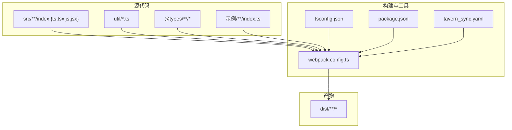
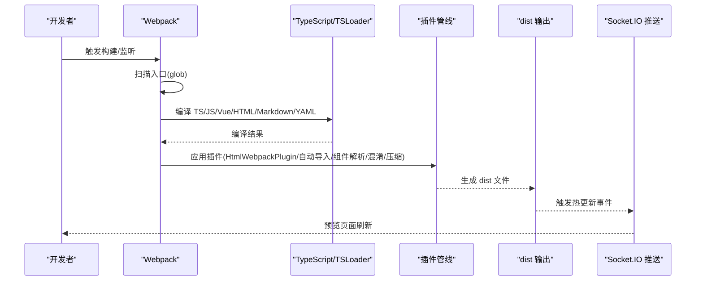
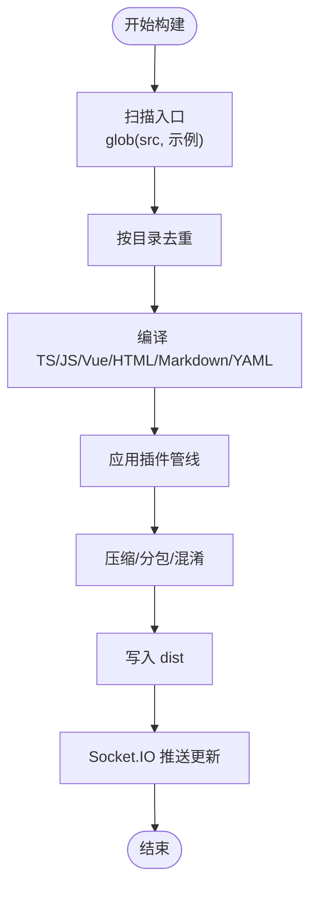
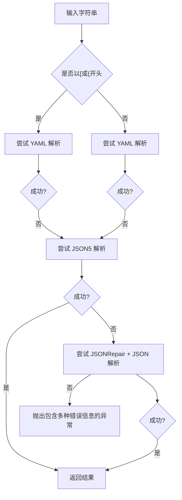
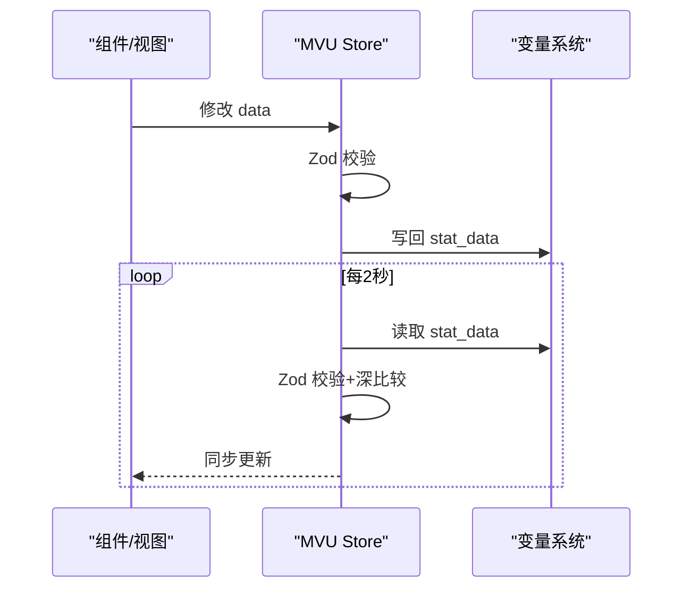
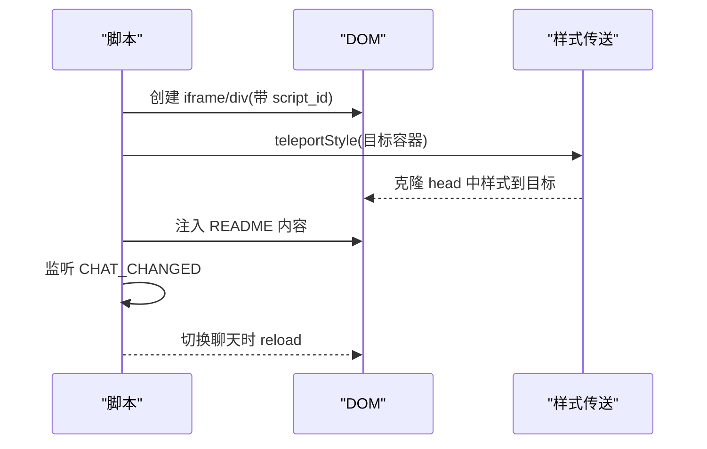
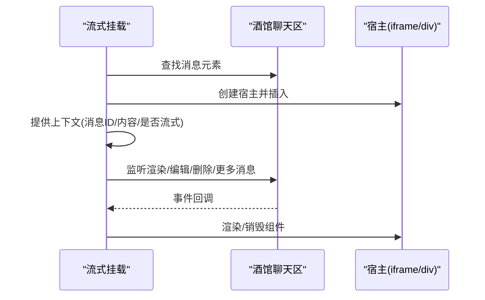
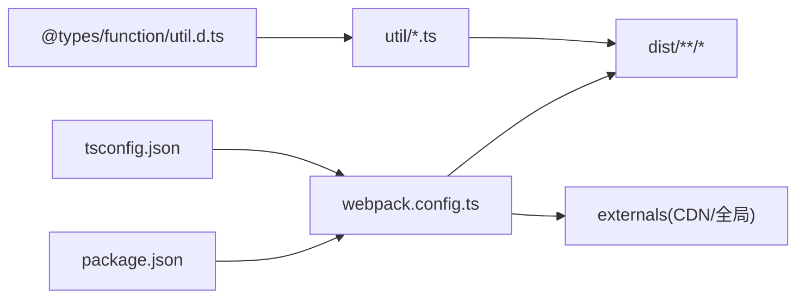

# 故障排除

<cite>
**本文引用的文件**
- [README.md](file://README.md)
- [package.json](file://package.json)
- [webpack.config.ts](file://webpack.config.ts)
- [tsconfig.json](file://tsconfig.json)
- [tavern_sync.yaml](file://tavern_sync.yaml)
- [util/common.ts](file://util/common.ts)
- [util/mvu.ts](file://util/mvu.ts)
- [util/script.ts](file://util/script.ts)
- [util/streaming.ts](file://util/streaming.ts)
- [示例/脚本示例/index.ts](file://示例/脚本示例/index.ts)
- [示例/前端界面示例/index.ts](file://示例/前端界面示例/index.ts)
- [示例/流式楼层界面示例/index.ts](file://示例/流式楼层界面示例/index.ts)
- [@types/function/util.d.ts](file://@types/function/util.d.ts)
</cite>

## 目录
1. [简介](#简介)
2. [项目结构](#项目结构)
3. [核心组件](#核心组件)
4. [架构总览](#架构总览)
5. [详细组件分析](#详细组件分析)
6. [依赖关系分析](#依赖关系分析)
7. [性能考虑](#性能考虑)
8. [故障排除指南](#故障排除指南)
9. [结论](#结论)
10. [附录](#附录)

## 简介
本指南面向使用“酒馆助手模板”的开发者与使用者，聚焦于构建问题、运行时错误、集成问题、配置问题、性能问题排查、内存泄漏检测与兼容性处理。文档结合项目实际实现（Webpack 打包、类型定义、工具模块、示例工程）给出系统性的诊断方法、日志分析技巧与调试工具使用建议，并覆盖不同操作系统、浏览器与开发环境下的常见问题。

## 项目结构
该项目采用“模板 + 示例 + 工具模块 + 构建配置”的组织方式：
- 模板与示例：位于“初始模板”“示例”目录，提供前端界面、脚本、流式楼层界面与角色卡示例。
- 工具模块：位于“util”目录，封装通用工具、MVU 数据存储、脚本注入与流式消息挂载等能力。
- 构建与配置：webpack.config.ts 定义打包流程、热更新推送、外部依赖解析与混淆策略；tsconfig.json 控制 TypeScript 编译行为；package.json 提供脚本与依赖；tavern_sync.yaml 配置角色卡/世界书/预设的打包导出。

图表来源
- [webpack.config.ts:77-80](file://webpack.config.ts#L77-L80)
- [webpack.config.ts:185-572](file://webpack.config.ts#L185-L572)
- [tsconfig.json:1-54](file://tsconfig.json#L1-L54)
- [package.json:1-120](file://package.json#L1-L120)
- [tavern_sync.yaml:1-28](file://tavern_sync.yaml#L1-L28)

章节来源
- [README.md:1-105](file://README.md#L1-L105)
- [webpack.config.ts:77-80](file://webpack.config.ts#L77-L80)
- [tsconfig.json:1-54](file://tsconfig.json#L1-L54)
- [package.json:1-120](file://package.json#L1-L120)
- [tavern_sync.yaml:1-28](file://tavern_sync.yaml#L1-L28)

## 核心组件
- 构建与打包
  - Webpack 多入口扫描与去重、HtmlWebpackPlugin、Vue Loader、自动导入与组件解析、外链依赖解析、混淆与压缩、Socket.IO 热更新推送。
- 工具模块
  - 通用工具：正则构造、UUID、版本检查、错误美化、字符串解析（YAML/JSON/JSON5）。
  - MVU 数据存储：基于 Pinia 的响应式数据存储与变量同步。
  - 脚本注入：README 注入、样式传送、脚本 ID 标注、聊天切换重载。
  - 流式消息挂载：在酒馆楼层中挂载自定义组件，支持 iframe/div 两种宿主，自动处理编辑态切换与销毁。
- 类型与宏
  - @types/function/util.d.ts 提供宏替换、错误捕获包装、消息 ID 解析等声明。

章节来源
- [webpack.config.ts:185-572](file://webpack.config.ts#L185-L572)
- [util/common.ts:1-135](file://util/common.ts#L1-135)
- [util/mvu.ts:1-66](file://util/mvu.ts#L1-L66)
- [util/script.ts:1-47](file://util/script.ts#L1-L47)
- [util/streaming.ts:1-238](file://util/streaming.ts#L1-L238)
- [@types/function/util.d.ts:1-43](file://@types/function/util.d.ts#L1-L43)

## 架构总览
下图展示从源码到产物的关键流程：入口扫描、模块解析、资源处理、插件管线、产物输出与热更新推送。

图表来源
- [webpack.config.ts:51-75](file://webpack.config.ts#L51-L75)
- [webpack.config.ts:185-572](file://webpack.config.ts#L185-L572)
- [webpack.config.ts:82-107](file://webpack.config.ts#L82-L107)

## 详细组件分析

### 构建与打包组件
- 入口扫描与去重
  - 通过 glob 匹配 src 与示例目录下的 index.{ts,tsx,js,jsx}，并按目录公共前缀去重，确保每个目录仅保留一个入口。
- 模块与资源处理
  - Vue 组件、TS/JS、HTML、Markdown、YAML、CSS/SCSS 均有对应 loader；raw/url 查询参数区分内联与源码。
- 插件与优化
  - HtmlWebpackPlugin、VueLoaderPlugin、自动导入与组件解析、LimitChunkCount、DefinePlugin、Terser 压缩、SplitChunks。
- 外部依赖解析
  - 通过 externals 将非本地模块解析为 CDN 引入或全局变量，减少打包体积。
- 热更新与推送
  - 开启 watch 时启动 Socket.IO 服务，编译完成后向预览页面推送更新事件。

图表来源
- [webpack.config.ts:51-75](file://webpack.config.ts#L51-L75)
- [webpack.config.ts:227-409](file://webpack.config.ts#L227-L409)
- [webpack.config.ts:440-483](file://webpack.config.ts#L440-L483)
- [webpack.config.ts:521-567](file://webpack.config.ts#L521-L567)
- [webpack.config.ts:82-107](file://webpack.config.ts#L82-L107)

章节来源
- [webpack.config.ts:51-75](file://webpack.config.ts#L51-L75)
- [webpack.config.ts:185-572](file://webpack.config.ts#L185-L572)

### 工具模块组件

#### 通用工具模块
- 正则构造：支持宏替换、标志位校验与默认大小写不敏感。
- 版本检查：通过比较酒馆助手版本与期望值，提示不兼容。
- 错误美化：将 Zod 校验错误转换为带路径与输入的易读文本。
- 字符串解析：优先尝试 YAML/JSON5/修复 JSON，失败时汇总多种错误信息。

图表来源
- [util/common.ts:96-135](file://util/common.ts#L96-L135)

章节来源
- [util/common.ts:1-135](file://util/common.ts#L1-L135)

#### MVU 数据存储
- 基于 Pinia 的 store 定义，自动从变量系统读取 stat_data 并进行 Zod 校验。
- 周期性轮询与深比较，保持视图与变量一致，并在变更时回写变量。
- 支持 message/latest 场景的消息 ID 默认值处理。

图表来源
- [util/mvu.ts:15-65](file://util/mvu.ts#L15-L65)

章节来源
- [util/mvu.ts:1-66](file://util/mvu.ts#L1-L66)

#### 脚本注入与样式传送
- README 注入：动态拉取并注入 README 内容。
- 样式传送：将 head 中样式克隆到指定容器，便于组件样式隔离或继承。
- 脚本 ID 标注：为 iframe/div 添加 script_id，便于识别与管理。
- 聊天切换重载：监听 CHAT_CHANGED 事件，在聊天变化时刷新页面。

图表来源
- [util/script.ts:13-47](file://util/script.ts#L13-L47)

章节来源
- [util/script.ts:1-47](file://util/script.ts#L1-L47)

#### 流式消息挂载
- 支持 iframe/div 两种宿主，自动隐藏原生 mes_text，在 mes_streaming 下方插入宿主。
- 监听 CHARACTER_MESSAGE_RENDERED、STREAM_TOKEN_RECEIVED、MORE_MESSAGES_LOADED、MESSAGE_EDITED、MESSAGE_DELETED 等事件，动态渲染/销毁。
- 在编辑态时隐藏自定义界面，编辑结束后恢复。

图表来源
- [util/streaming.ts:41-238](file://util/streaming.ts#L41-L238)

章节来源
- [util/streaming.ts:1-238](file://util/streaming.ts#L1-L238)

### 示例工程组件
- 脚本示例入口：聚合多个示例模块，便于统一引入与测试。
- 前端界面示例入口：聚合加载/卸载与界面模块。
- 流式楼层示例入口：演示如何挂载流式消息组件并处理卸载。

章节来源
- [示例/脚本示例/index.ts:1-7](file://示例/脚本示例/index.ts#L1-L7)
- [示例/前端界面示例/index.ts:1-3](file://示例/前端界面示例/index.ts#L1-L3)
- [示例/流式楼层界面示例/index.ts:1-8](file://示例/流式楼层界面示例/index.ts#L1-L8)

## 依赖关系分析
- 构建时依赖
  - TypeScript、Vue、Webpack 生态与各类 loader/plugin。
  - 外部依赖通过 externals 解析为 CDN 或全局变量，减少打包体积。
- 运行时依赖
  - jQuery/Lodash/Toastr/Vue/Pinia 等在浏览器环境中通过全局或 CDN 提供。
- 类型与宏
  - @types/function/util.d.ts 提供宏替换、错误捕获包装、消息 ID 解析等声明。

图表来源
- [package.json:1-120](file://package.json#L1-L120)
- [webpack.config.ts:185-572](file://webpack.config.ts#L185-L572)
- [tsconfig.json:1-54](file://tsconfig.json#L1-L54)
- [@types/function/util.d.ts:1-43](file://@types/function/util.d.ts#L1-L43)

章节来源
- [package.json:1-120](file://package.json#L1-L120)
- [webpack.config.ts:521-567](file://webpack.config.ts#L521-L567)
- [tsconfig.json:1-54](file://tsconfig.json#L1-L54)

## 性能考虑
- 代码分割与分包
  - SplitChunks 将 node_modules 标记为 vendor，避免重复打包；默认组复用已有 chunk，降低体积。
- 压缩与混淆
  - 生产模式启用 Terser 压缩与变量混淆；开发模式保留可读性。
- 外链依赖
  - 通过 externals 将大体积库以外部模块形式加载，减少首屏体积。
- 构建优化
  - DefinePlugin 关闭部分开发特性，减少运行时开销。
- 流式界面
  - 仅在必要时渲染/销毁，避免对编辑态造成干扰。

章节来源
- [webpack.config.ts:500-520](file://webpack.config.ts#L500-L520)
- [webpack.config.ts:484-499](file://webpack.config.ts#L484-L499)
- [webpack.config.ts:521-567](file://webpack.config.ts#L521-L567)
- [util/streaming.ts:164-186](file://util/streaming.ts#L164-L186)

## 故障排除指南

### 一、构建问题
- 症状
  - 构建失败、找不到模块、入口未生成、dist 未更新。
- 诊断步骤
  - 确认入口扫描：检查 glob 是否匹配到预期文件，确认目录去重逻辑是否误删入口。
  - 检查 loader 配置：确认 TS/JS/Vue/HTML/Markdown/YAML/CSS/SCSS 的 loader 是否正确。
  - 检查 externals：确认外部依赖是否能被正确解析为 CDN 或全局变量。
  - 检查插件顺序：确保 HtmlWebpackPlugin、VueLoaderPlugin、自动导入与组件解析顺序正确。
- 常见原因与解决
  - 入口路径错误：修正入口文件路径或 glob 模式。
  - 类型声明缺失：在 @types 中补充缺失的类型或在 tsconfig.types 中加入。
  - 外部依赖未解析：在 externals 中添加或修正映射。
  - 插件冲突：调整插件顺序或禁用冲突插件进行定位。
- 相关文件
  - [webpack.config.ts:51-75](file://webpack.config.ts#L51-L75)
  - [webpack.config.ts:227-409](file://webpack.config.ts#L227-L409)
  - [webpack.config.ts:521-567](file://webpack.config.ts#L521-L567)
  - [tsconfig.json:1-54](file://tsconfig.json#L1-L54)

章节来源
- [webpack.config.ts:51-75](file://webpack.config.ts#L51-L75)
- [webpack.config.ts:227-409](file://webpack.config.ts#L227-L409)
- [webpack.config.ts:521-567](file://webpack.config.ts#L521-L567)
- [tsconfig.json:1-54](file://tsconfig.json#L1-L54)

### 二、运行时错误
- 症状
  - 组件无法挂载、样式丢失、事件不触发、变量未更新。
- 诊断步骤
  - 检查脚本注入：确认 README 注入、样式传送、脚本 ID 标注是否生效。
  - 检查流式挂载：确认宿主类型、过滤器、消息 ID 是否正确。
  - 检查事件监听：确认 CHARACTER_MESSAGE_RENDERED、STREAM_TOKEN_RECEIVED 等事件是否被触发。
- 常见原因与解决
  - 宏替换错误：使用 substitudeMacros 前先验证输入格式。
  - 版本不兼容：调用 checkMinimumVersion 并升级酒馆助手。
  - 错误未捕获：使用 errorCatched 包裹回调，避免异常中断。
- 相关文件
  - [util/script.ts:13-47](file://util/script.ts#L13-L47)
  - [util/streaming.ts:41-238](file://util/streaming.ts#L41-L238)
  - [util/common.ts:70-74](file://util/common.ts#L70-L74)
  - [@types/function/util.d.ts:1-43](file://@types/function/util.d.ts#L1-L43)

章节来源
- [util/script.ts:13-47](file://util/script.ts#L13-L47)
- [util/streaming.ts:41-238](file://util/streaming.ts#L41-L238)
- [util/common.ts:70-74](file://util/common.ts#L70-L74)
- [@types/function/util.d.ts:1-43](file://@types/function/util.d.ts#L1-L43)

### 三、集成问题
- 症状
  - README 未注入、样式未生效、聊天切换不重载。
- 诊断步骤
  - 检查 README 注入：确认 fetch 返回与 replaceScriptInfo 调用。
  - 检查样式传送：确认 teleportStyle 的目标容器与 head 样式克隆。
  - 检查聊天切换：确认 CHAT_CHANGED 事件监听与 reload 调用。
- 常见原因与解决
  - 网络错误：检查 README 链接可用性与跨域策略。
  - DOM 结构变化：根据实际节点结构调整选择器。
  - 事件未绑定：确认事件监听在 DOM 就绪后执行。
- 相关文件
  - [util/script.ts:3-11](file://util/script.ts#L3-L11)
  - [util/script.ts:13-24](file://util/script.ts#L13-L24)
  - [util/script.ts:38-47](file://util/script.ts#L38-L47)

章节来源
- [util/script.ts:3-11](file://util/script.ts#L3-L11)
- [util/script.ts:13-24](file://util/script.ts#L13-L24)
- [util/script.ts:38-47](file://util/script.ts#L38-L47)

### 四、配置问题
- 症状
  - tavern_sync.yaml 导出路径无效、打包失败、导出文件名不匹配。
- 诊断步骤
  - 检查本地文件路径格式：支持绝对路径与相对路径，注意层级关系。
  - 检查导出文件路径：若未填写，默认导出到本地文件路径同目录。
  - 检查配置名称：确保使用脚本时填写的配置名称与 yaml 中一致。
- 常见原因与解决
  - 路径格式错误：修正为绝对路径或相对路径格式。
  - 权限不足：确保目标目录存在且具备写入权限。
  - 配置名称不一致：统一配置名称，避免拼写差异。
- 相关文件
  - [tavern_sync.yaml:1-28](file://tavern_sync.yaml#L1-L28)

章节来源
- [tavern_sync.yaml:1-28](file://tavern_sync.yaml#L1-L28)

### 五、性能问题排查
- 症状
  - 首屏加载慢、CPU 占用高、页面卡顿。
- 诊断步骤
  - 分析打包体积：检查 SplitChunks 与 vendor 分离效果。
  - 检查压缩与混淆：确认生产模式已启用压缩与变量混淆。
  - 检查外链依赖：确认大体积库通过 CDN 加载。
  - 检查流式挂载：确认仅在必要时渲染，避免重复创建/销毁。
- 常见原因与解决
  - 未分包：调整 cacheGroups 或拆分入口。
  - 未压缩：检查生产模式开关与 Terser 配置。
  - 未外链：在 externals 中添加缺失的依赖。
  - 过度渲染：优化事件监听与渲染时机。
- 相关文件
  - [webpack.config.ts:500-520](file://webpack.config.ts#L500-L520)
  - [webpack.config.ts:484-499](file://webpack.config.ts#L484-L499)
  - [webpack.config.ts:521-567](file://webpack.config.ts#L521-L567)
  - [util/streaming.ts:164-186](file://util/streaming.ts#L164-L186)

章节来源
- [webpack.config.ts:500-520](file://webpack.config.ts#L500-L520)
- [webpack.config.ts:484-499](file://webpack.config.ts#L484-L499)
- [webpack.config.ts:521-567](file://webpack.config.ts#L521-L567)
- [util/streaming.ts:164-186](file://util/streaming.ts#L164-L186)

### 六、内存泄漏检测
- 症状
  - 页面长时间使用后内存持续增长、组件卸载后仍占用内存。
- 诊断步骤
  - 确认流式挂载的卸载：调用 unmount 并断开观察者与事件监听。
  - 确认聊天切换重载：在 pagehide/onbeforeunload 中清理资源。
  - 确认定时器与轮询：停止周期性任务，释放引用。
- 常见原因与解决
  - 未调用 unmount：在组件销毁时显式调用卸载函数。
  - 事件监听未移除：使用 scopedEventOn 返回的 stop 方法清理。
  - DOM 未清理：确保宿主节点与样式被移除。
- 相关文件
  - [util/streaming.ts:224-237](file://util/streaming.ts#L224-L237)
  - [util/script.ts:38-47](file://util/script.ts#L38-L47)

章节来源
- [util/streaming.ts:224-237](file://util/streaming.ts#L224-L237)
- [util/script.ts:38-47](file://util/script.ts#L38-L47)

### 七、兼容性问题处理
- 症状
  - 不同浏览器/系统表现不一致、版本不兼容导致功能异常。
- 诊断步骤
  - 检查 browserslist 与 target：确认目标环境与 polyfill。
  - 检查 externals 全局映射：确认 jQuery/Lodash/Toastr/Vue 等在目标环境可用。
  - 检查版本要求：调用 checkMinimumVersion 并提示升级。
- 常见原因与解决
  - 浏览器不支持 ES 模块：调整 target 或引入 polyfill。
  - 全局变量缺失：在 externals 中映射为全局变量。
  - 版本过低：升级酒馆助手至最低版本要求。
- 相关文件
  - [package.json:12-14](file://package.json#L12-L14)
  - [webpack.config.ts:521-567](file://webpack.config.ts#L521-L567)
  - [util/common.ts:70-74](file://util/common.ts#L70-L74)

章节来源
- [package.json:12-14](file://package.json#L12-L14)
- [webpack.config.ts:521-567](file://webpack.config.ts#L521-L567)
- [util/common.ts:70-74](file://util/common.ts#L70-L74)

### 八、日志分析与调试工具
- 日志位置
  - 构建日志：Webpack 输出与插件日志。
  - 热更新日志：Socket.IO 服务端与客户端输出。
  - 运行时日志：控制台输出与 Toastr 通知。
- 调试建议
  - 开发模式：开启 eval-source-map，便于定位源码。
  - 事件追踪：在关键事件处打点，记录消息 ID、渲染状态。
  - 错误捕获：使用 errorCatched 包裹回调，统一上报。
- 相关文件
  - [webpack.config.ts:195](file://webpack.config.ts#L195)
  - [util/common.ts:76-90](file://util/common.ts#L76-L90)
  - [@types/function/util.d.ts:33](file://@types/function/util.d.ts#L33)

章节来源
- [webpack.config.ts:195](file://webpack.config.ts#L195)
- [util/common.ts:76-90](file://util/common.ts#L76-L90)
- [@types/function/util.d.ts:33](file://@types/function/util.d.ts#L33)

### 九、不同平台与环境的特定问题
- Windows
  - 路径分隔符：glob 与 path 操作需注意分隔符一致性。
  - 权限问题：导出目录需具备写入权限。
- macOS/Linux
  - 软链接与符号链接：确保仓库支持符号链接，避免打包冲突。
  - 权限与忽略：使用 .gitignore 与 .gitattributes 避免 dist 冲突。
- 浏览ers
  - ES 模块支持：检查 browserslist 与目标环境。
  - CDN 加载：确认 jsDelivr 可用与跨域策略。
- 开发环境
  - Node 版本：确保 Node 版本满足 webpack-cli 与依赖要求。
  - 包管理器：pnpm 的 onlyBuiltDependencies 需正确配置。

章节来源
- [README.md:35-43](file://README.md#L35-L43)
- [package.json:108-118](file://package.json#L108-L118)

## 结论
本指南围绕构建、运行时、集成、配置、性能、兼容性与调试等方面提供了系统化的故障排除路径。建议在开发与维护过程中：
- 建立标准化的构建与打包流程，明确入口与资源处理规则；
- 在运行时使用统一的错误捕获与版本检查机制；
- 通过 externals 与分包优化性能；
- 在多平台与多浏览器环境下进行充分测试；
- 借助日志与事件追踪快速定位问题并闭环修复。

## 附录
- 快速检查清单
  - 构建：入口扫描正常、loader 配置正确、externals 映射完整。
  - 运行：README 注入成功、样式传送有效、事件监听正常。
  - 性能：分包合理、压缩启用、外链依赖正确。
  - 兼容：browserslist/target 正确、全局映射齐全、版本满足要求。
  - 调试：开发 sourcemap 启用、错误捕获统一、日志输出规范。