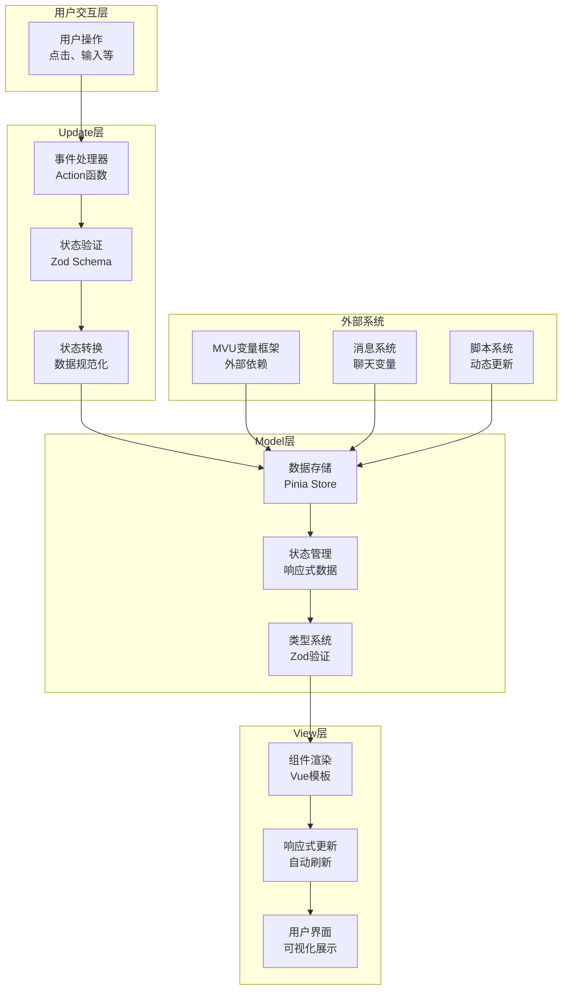
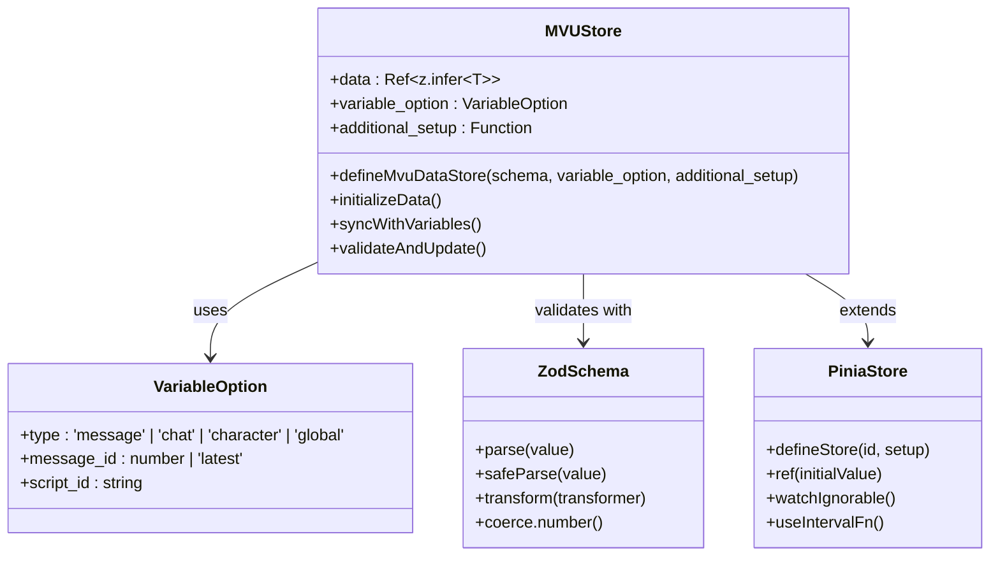
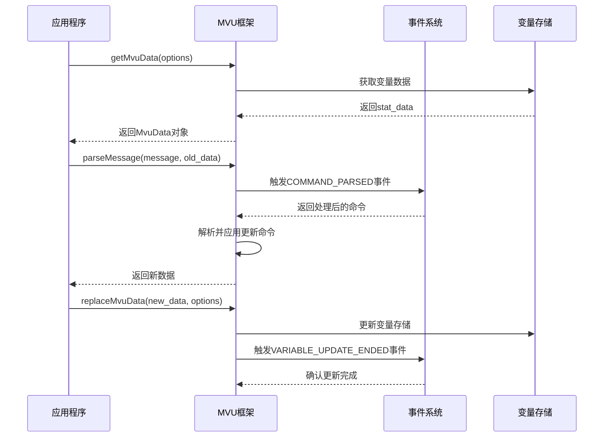
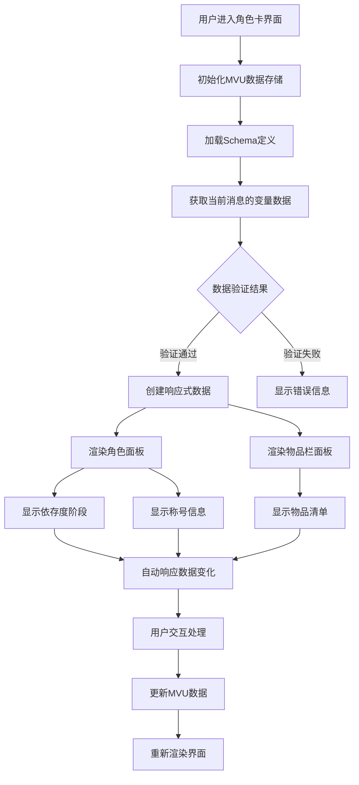

# MVU架构模式详解

<cite>
**本文档引用的文件**
- [util/mvu.ts](file://util/mvu.ts)
- [@types/iframe/exported.mvu.d.ts](file://@types/iframe/exported.mvu.d.ts)
- [示例/角色卡示例/schema.ts](file://示例/角色卡示例/schema.ts)
- [示例/角色卡示例/界面/状态栏/store.ts](file://示例/角色卡示例/界面/状态栏/store.ts)
- [示例/角色卡示例/界面/状态栏/App.vue](file://示例/角色卡示例/界面/状态栏/App.vue)
- [示例/角色卡示例/界面/状态栏/components/CharacterPanel.vue](file://示例/角色卡示例/界面/状态栏/components/CharacterPanel.vue)
- [示例/角色卡示例/界面/状态栏/components/InventoryPanel.vue](file://示例/角色卡示例/界面/状态栏/components/InventoryPanel.vue)
- [util/common.ts](file://util/common.ts)
- [示例/前端界面示例/界面.ts](file://示例/前端界面示例/界面.ts)
- [示例/流式楼层界面示例/App.vue](file://示例/流式楼层界面示例/App.vue)
- [示例/角色卡示例/脚本/变量结构/index.ts](file://示例/角色卡示例/脚本/变量结构/index.ts)
- [global.d.ts](file://global.d.ts)
</cite>

## 目录
1. [简介](#简介)
2. [项目结构](#项目结构)
3. [核心组件](#核心组件)
4. [架构概览](#架构概览)
5. [详细组件分析](#详细组件分析)
6. [依赖关系分析](#依赖关系分析)
7. [性能考虑](#性能考虑)
8. [故障排除指南](#故障排除指南)
9. [结论](#结论)

## 简介

MVU（Model-View-Update）架构模式是一种基于函数式编程思想的状态管理架构，它将应用程序分为三个核心组件：Model（模型）、View（视图）和Update（更新）。这种模式强调单向数据流和纯函数更新，使得状态管理更加可预测和易于调试。

在本项目中，MVU架构通过Zod类型系统、Pinia状态管理和Vue响应式系统实现了完整的状态管理模式。项目提供了完整的MVU变量框架，支持实时变量更新、状态验证和响应式渲染。

## 项目结构

该项目采用模块化组织方式，主要包含以下结构：

```mermaid
graph TB
subgraph "核心工具层"
A[util/mvu.ts<br/>MVU数据存储定义]
B[util/common.ts<br/>通用工具函数]
end
subgraph "类型定义层"
C[@types/iframe/exported.mvu.d.ts<br/>MVU接口类型定义]
D[global.d.ts<br/>全局类型声明]
end
subgraph "示例应用层"
E[角色卡示例<br/>状态栏界面]
F[前端界面示例<br/>路由应用]
G[流式楼层界面示例<br/>消息流处理]
end
subgraph "脚本层"
H[变量结构脚本<br/>Schema注册]
I[MVU框架脚本<br/>外部依赖]
end
A --> E
C --> A
D --> C
E --> F
E --> G
H --> E
I --> C
```

**图表来源**
- [util/mvu.ts:1-66](file://util/mvu.ts#L1-L66)
- [@types/iframe/exported.mvu.d.ts:1-190](file://@types/iframe/exported.mvu.d.ts#L1-L190)
- [示例/角色卡示例/界面/状态栏/store.ts:1-5](file://示例/角色卡示例/界面/状态栏/store.ts#L1-L5)

**章节来源**
- [util/mvu.ts:1-66](file://util/mvu.ts#L1-L66)
- [@types/iframe/exported.mvu.d.ts:1-190](file://@types/iframe/exported.mvu.d.ts#L1-L190)
- [示例/角色卡示例/界面/状态栏/store.ts:1-5](file://示例/角色卡示例/界面/状态栏/store.ts#L1-L5)

## 核心组件

### Model（模型）层

Model层负责管理应用程序的完整状态，包括数据结构定义、状态验证和数据转换。在本项目中，Model层通过Zod Schema实现强类型验证和数据规范化。

**数据模型设计特点：**
- 使用Zod对象定义复杂的数据结构
- 支持类型转换和数据规范化
- 提供运行时类型检查和错误报告
- 实现数据的自动验证和修复

**章节来源**
- [示例/角色卡示例/schema.ts:1-52](file://示例/角色卡示例/schema.ts#L1-L52)
- [util/common.ts:76-90](file://util/common.ts#L76-L90)

### View（视图）层

View层负责将Model中的数据转换为用户界面。在本项目中，View层基于Vue 3 Composition API实现响应式渲染，能够自动追踪数据变化并更新UI。

**响应式渲染机制：**
- 使用Vue的ref和computed实现响应式数据绑定
- 通过watchEffect自动追踪依赖变化
- 支持深层嵌套对象的响应式更新
- 实现条件渲染和动态组件加载

**章节来源**
- [示例/角色卡示例/界面/状态栏/components/CharacterPanel.vue:1-110](file://示例/角色卡示例/界面/状态栏/components/CharacterPanel.vue#L1-L110)
- [示例/角色卡示例/界面/状态栏/components/InventoryPanel.vue:1-101](file://示例/角色卡示例/界面/状态栏/components/InventoryPanel.vue#L1-L101)

### Update（更新）层

Update层负责处理用户交互和系统事件，通过纯函数更新Model状态。在本项目中，Update层通过Pinia Store实现状态管理，确保状态更新的可预测性和一致性。

**事件处理和状态更新流程：**
- 监听用户交互事件
- 通过Action函数处理业务逻辑
- 使用Zod验证更新后的数据
- 触发响应式更新和UI渲染

**章节来源**
- [util/mvu.ts:3-66](file://util/mvu.ts#L3-L66)

## 架构概览

本项目的MVU架构采用分层设计，各层职责明确且松耦合：



**图表来源**
- [util/mvu.ts:15-64](file://util/mvu.ts#L15-L64)
- [@types/iframe/exported.mvu.d.ts:54-177](file://@types/iframe/exported.mvu.d.ts#L54-L177)

## 详细组件分析

### MVU数据存储定义

MVU数据存储是整个架构的核心组件，负责管理状态的持久化、同步和验证。



**图表来源**
- [util/mvu.ts:3-7](file://util/mvu.ts#L3-L7)
- [util/mvu.ts:15-21](file://util/mvu.ts#L15-L21)

**实现要点：**
- 使用Zod Schema进行数据验证和类型转换
- 通过Pinia实现状态持久化和响应式更新
- 支持定时同步和手动更新两种模式
- 提供额外设置回调函数扩展功能

**章节来源**
- [util/mvu.ts:3-66](file://util/mvu.ts#L3-L66)

### MVU变量框架接口

MVU变量框架提供了与外部系统的集成接口，支持变量的读取、写入和事件监听。



**图表来源**
- [@types/iframe/exported.mvu.d.ts:138-177](file://@types/iframe/exported.mvu.d.ts#L138-L177)

**事件处理机制：**
- VARIABLE_INITIALIZED：变量初始化完成事件
- COMMAND_PARSED：命令解析完成事件
- VARIABLE_UPDATE_ENDED：变量更新结束事件
- BEFORE_MESSAGE_UPDATE：消息更新前事件

**章节来源**
- [@types/iframe/exported.mvu.d.ts:54-177](file://@types/iframe/exported.mvu.d.ts#L54-L177)

### 角色卡状态栏界面

角色卡状态栏展示了MVU架构在实际应用中的完整实现，包含了复杂的嵌套数据结构和响应式渲染。



**图表来源**
- [示例/角色卡示例/界面/状态栏/App.vue:1-77](file://示例/角色卡示例/界面/状态栏/App.vue#L1-L77)
- [示例/角色卡示例/界面/状态栏/store.ts:1-5](file://示例/角色卡示例/界面/状态栏/store.ts#L1-L5)

**界面组件设计：**
- CharacterPanel：显示角色状态和称号信息
- InventoryPanel：展示物品栏和物品详情
- TabNav：标签页导航切换
- DependencyBar：显示依赖关系

**章节来源**
- [示例/角色卡示例/界面/状态栏/App.vue:1-77](file://示例/角色卡示例/界面/状态栏/App.vue#L1-L77)
- [示例/角色卡示例/界面/状态栏/components/CharacterPanel.vue:1-110](file://示例/角色卡示例/界面/状态栏/components/CharacterPanel.vue#L1-L110)
- [示例/角色卡示例/界面/状态栏/components/InventoryPanel.vue:1-101](file://示例/角色卡示例/界面/状态栏/components/InventoryPanel.vue#L1-L101)

### 流式楼层界面

流式楼层界面展示了MVU架构在实时消息处理中的应用，支持消息的分段渲染和高亮显示。

**章节来源**
- [示例/流式楼层界面示例/App.vue:1-72](file://示例/流式楼层界面示例/App.vue#L1-L72)

## 依赖关系分析

项目中的组件依赖关系体现了清晰的分层架构：

```mermaid
graph TB
subgraph "外部依赖"
A[Zod类型系统]
B[Pinia状态管理]
C[Vue 3响应式系统]
D[Lodash工具库]
E[MVU变量框架]
end
subgraph "核心模块"
F[util/mvu.ts]
G[@types/iframe/exported.mvu.d.ts]
H[util/common.ts]
end
subgraph "应用模块"
I[示例/角色卡示例]
J[示例/前端界面示例]
K[示例/流式楼层界面示例]
end
A --> F
B --> F
C --> I
D --> F
E --> G
F --> I
G --> I
H --> F
I --> J
I --> K
```

**图表来源**
- [util/mvu.ts:1-1](file://util/mvu.ts#L1-L1)
- [@types/iframe/exported.mvu.d.ts:1-1](file://@types/iframe/exported.mvu.d.ts#L1-L1)

**依赖特性：**
- 松耦合设计，各模块独立性强
- 类型安全保证，编译时错误检测
- 响应式更新，自动UI同步
- 可扩展架构，支持插件化开发

**章节来源**
- [util/mvu.ts:1-66](file://util/mvu.ts#L1-L66)
- [global.d.ts:33-44](file://global.d.ts#L33-L44)

## 性能考虑

### 状态更新优化

MVU架构在性能方面具有显著优势：

1. **增量更新**：只更新发生变化的数据部分
2. **批量处理**：避免频繁的DOM操作
3. **缓存机制**：利用Vue的响应式缓存
4. **防抖处理**：减少重复计算和渲染

### 内存管理

- 使用WeakMap和WeakSet避免内存泄漏
- 及时清理事件监听器和定时器
- 合理使用计算属性和侦听器
- 控制响应式数据的深度

### 渲染性能

- 组件懒加载和按需导入
- 虚拟滚动处理大量数据
- 图片和资源的延迟加载
- CSS类名的动态绑定优化

## 故障排除指南

### 常见问题及解决方案

**问题1：数据验证失败**
- 检查Schema定义是否正确
- 验证输入数据格式
- 查看详细的错误信息

**问题2：状态不同步**
- 确认变量选项配置正确
- 检查消息ID和类型设置
- 验证变量框架是否正常加载

**问题3：响应式更新异常**
- 检查数据结构的嵌套层级
- 确认使用正确的响应式API
- 验证组件的生命周期

**章节来源**
- [util/common.ts:76-90](file://util/common.ts#L76-L90)
- [util/mvu.ts:31-33](file://util/mvu.ts#L31-L33)

### 调试技巧

1. **启用开发工具**：使用Vue DevTools监控状态变化
2. **日志记录**：添加详细的console.log输出
3. **断点调试**：在关键节点设置断点
4. **单元测试**：编写测试用例验证功能正确性

## 结论

MVU架构模式在本项目中得到了完美的实现，通过Zod类型系统、Pinia状态管理和Vue响应式系统，构建了一个强大而灵活的状态管理框架。

**主要优势：**
- 类型安全：编译时错误检测，提高代码质量
- 可预测性：单向数据流，状态更新可追踪
- 可维护性：清晰的职责分离，易于理解和扩展
- 性能优化：响应式更新，自动渲染优化

**最佳实践建议：**
1. 始终使用Schema定义数据结构
2. 合理设计组件层次结构
3. 有效利用响应式系统
4. 编写完善的错误处理机制
5. 注重性能优化和用户体验

通过遵循这些原则和实践，开发者可以充分利用MVU架构的优势，构建高质量的应用程序。