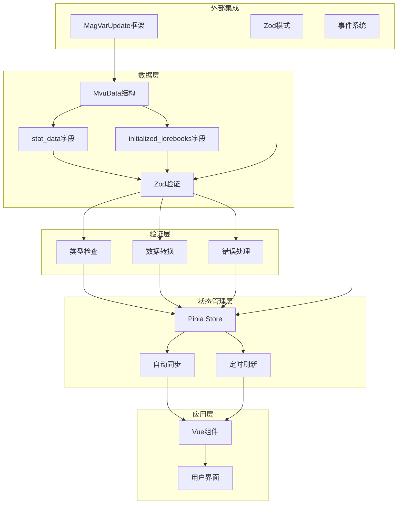
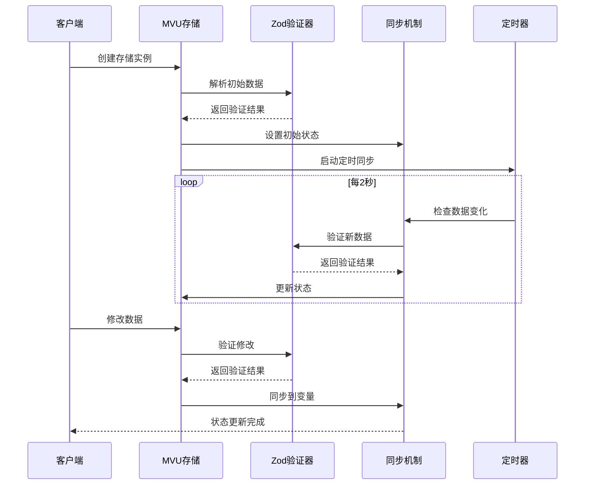
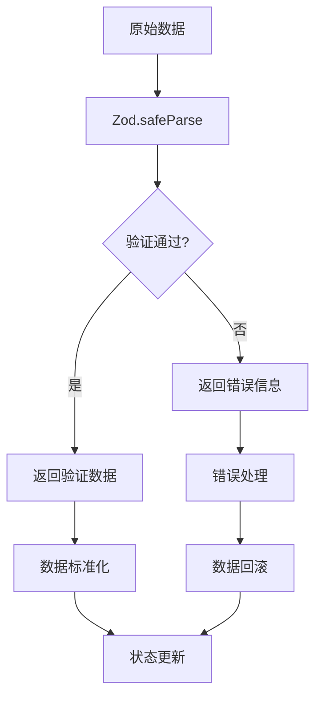
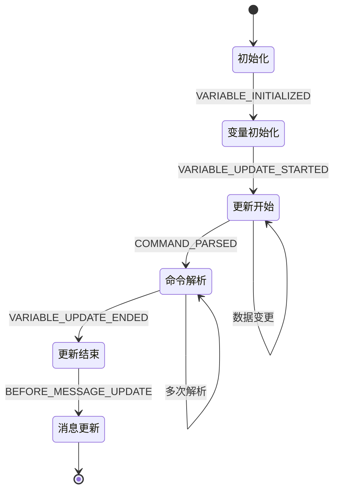
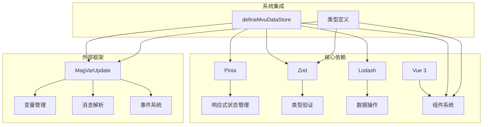

# MVU状态管理系统

<cite>
**本文档引用的文件**
- [util/mvu.ts](file://util/mvu.ts)
- [@types/iframe/exported.mvu.d.ts](file://@types/iframe/exported.mvu.d.ts)
- [示例/角色卡示例/界面/状态栏/store.ts](file://示例/角色卡示例/界面/状态栏/store.ts)
- [示例/角色卡示例/脚本/变量结构/index.ts](file://示例/角色卡示例/脚本/变量结构/index.ts)
- [示例/角色卡示例/脚本/MVU/index.ts](file://示例/角色卡示例/脚本/MVU/index.ts)
- [示例/角色卡示例/界面/状态栏/App.vue](file://示例/角色卡示例/界面/状态栏/App.vue)
</cite>

## 目录
1. [简介](#简介)
2. [项目结构](#项目结构)
3. [核心组件](#核心组件)
4. [架构概览](#架构概览)
5. [详细组件分析](#详细组件分析)
6. [依赖关系分析](#依赖关系分析)
7. [性能考虑](#性能考虑)
8. [故障排除指南](#故障排除指南)
9. [结论](#结论)
10. [附录](#附录)

## 简介

MVU（Model-View-Update）状态管理系统是一个基于Zod类型验证和Pinia状态管理的现代化数据驱动框架。该系统通过类型安全的数据存储机制、自动数据同步策略、错误处理和恢复机制、定时刷新策略，为复杂的状态管理需求提供了完整的解决方案。

系统的核心设计理念是通过严格的类型约束确保数据的完整性和一致性，同时提供自动化的数据同步和验证机制。通过与MagicalAstrogy的MVU变量框架集成，实现了跨组件、跨会话的状态共享和持久化。

## 项目结构

该项目采用模块化设计，主要包含以下核心目录：

```mermaid
graph TB
subgraph "核心工具层"
A[util/mvu.ts] --> B[Pinia状态管理]
A --> C[Zod类型验证]
end
subgraph "类型定义层"
D[@types/iframe/exported.mvu.d.ts] --> E[Mvu接口定义]
D --> F[事件类型声明]
end
subgraph "示例应用层"
G[角色卡示例] --> H[状态栏界面]
G --> I[变量结构脚本]
G --> J[MVU集成脚本]
end
subgraph "外部依赖"
K[MagVarUpdate框架] --> L[变量管理]
K --> M[消息解析]
N[Pinia] --> O[状态持久化]
P[Zod] --> Q[类型验证]
end
A --> K
G --> K
B --> N
C --> P
```

**图表来源**
- [util/mvu.ts:1-66](file://util/mvu.ts#L1-L66)
- [@types/iframe/exported.mvu.d.ts:1-190](file://@types/iframe/exported.mvu.d.ts#L1-L190)

**章节来源**
- [util/mvu.ts:1-66](file://util/mvu.ts#L1-L66)
- [@types/iframe/exported.mvu.d.ts:1-190](file://@types/iframe/exported.mvu.d.ts#L1-L190)

## 核心组件

### MVU数据存储定义器

`defineMvuDataStore` 是系统的核心函数，负责创建类型安全的MVU数据存储实例。该函数接受Zod模式、变量选项和可选的附加设置函数作为参数。

**主要特性：**
- 类型安全的数据存储
- 自动数据同步机制
- 错误处理和恢复
- 定时刷新策略
- 深度监听和验证

### Zod类型验证集成

系统通过Zod实现强类型的验证机制，确保所有数据操作都在严格的类型约束下进行。每个MVU数据存储都绑定到特定的Zod模式，提供编译时和运行时的双重验证。

### Pinia状态管理集成

利用Pinia的响应式特性和组合式API，系统实现了高效的状态管理。每个MVU数据存储都是一个独立的Pinia store，支持模块化的状态管理和依赖注入。

**章节来源**
- [util/mvu.ts:3-7](file://util/mvu.ts#L3-L7)

## 架构概览

MVU状态管理系统的整体架构采用分层设计，从底层的数据存储到上层的应用界面，形成了清晰的职责分离。



**图表来源**
- [util/mvu.ts:15-65](file://util/mvu.ts#L15-L65)
- [@types/iframe/exported.mvu.d.ts:121-177](file://@types/iframe/exported.mvu.d.ts#L121-L177)

## 详细组件分析

### 数据存储定义器实现

`defineMvuDataStore` 函数是整个MVU系统的核心，其工作流程如下：



**图表来源**
- [util/mvu.ts:21-60](file://util/mvu.ts#L21-L60)

#### 关键实现细节

1. **消息ID处理**：当类型为'message'且message_id为'latest'或未定义时，自动设置为-1表示最新消息

2. **数据初始化**：通过`getVariables(variable_option)`获取初始数据，使用Zod模式进行解析和验证

3. **定时同步**：每2秒检查一次变量变化，确保UI与底层数据保持一致

4. **深度监听**：使用watchIgnorable实现深度监听，避免循环更新

**章节来源**
- [util/mvu.ts:8-43](file://util/mvu.ts#L8-L43)

### 类型安全的数据验证

系统通过Zod实现强类型验证，确保所有数据操作都在严格的类型约束下进行：



**图表来源**
- [util/mvu.ts:29-60](file://util/mvu.ts#L29-L60)

#### 验证流程特点

1. **双向验证**：既验证从变量获取的数据，也验证用户修改的数据
2. **自动标准化**：将原始数据转换为符合模式的标准化格式
3. **错误隔离**：验证失败时不会影响现有状态，而是返回错误信息
4. **数据一致性**：确保UI显示的数据与底层存储的数据保持一致

**章节来源**
- [util/mvu.ts:48-57](file://util/mvu.ts#L48-L57)

### 状态同步机制

系统实现了多层次的状态同步策略，确保数据在不同层面之间保持一致：

```mermaid
graph LR
subgraph "内部同步"
A[本地状态] < --> B[Pinia Store]
B < --> C[Vue组件]
end
subgraph "外部同步"
D[变量框架] < --> E[消息楼层]
E < --> F[聊天记录]
F < --> G[角色卡]
end
subgraph "验证层"
H[Zod验证] --> I[数据标准化]
I --> J[类型约束]
end
A --> H
D --> H
C --> K[用户交互]
K --> A
G --> D
```

**图表来源**
- [util/mvu.ts:35-42](file://util/mvu.ts#L35-L42)

#### 同步策略

1. **定时同步**：每2秒检查一次数据变化，防止数据漂移
2. **事件驱动**：通过watch监听状态变化，实时响应用户操作
3. **双向绑定**：确保UI修改能够同步到变量，变量变化也能反映到UI
4. **冲突解决**：当检测到不一致时，自动选择最新的有效数据

**章节来源**
- [util/mvu.ts:29-43](file://util/mvu.ts#L29-L43)

### 事件系统集成

系统与MagVarUpdate框架的事件系统深度集成，提供了丰富的生命周期事件：



**图表来源**
- [@types/iframe/exported.mvu.d.ts:55-119](file://@types/iframe/exported.mvu.d.ts#L55-L119)

#### 事件处理机制

1. **初始化事件**：在新聊天会话开始时触发，用于初始化MVU数据
2. **更新事件**：在整个变量更新过程中提供多个时机点进行干预
3. **命令解析事件**：允许修改或添加变量更新命令
4. **边界事件**：在消息更新前提供最终的数据修正机会

**章节来源**
- [@types/iframe/exported.mvu.d.ts:54-119](file://@types/iframe/exported.mvu.d.ts#L54-L119)

## 依赖关系分析

系统依赖关系清晰，各模块职责明确：



**图表来源**
- [util/mvu.ts:1-7](file://util/mvu.ts#L1-L7)
- [@types/iframe/exported.mvu.d.ts:1-190](file://@types/iframe/exported.mvu.d.ts#L1-L190)

### 外部依赖说明

1. **MagVarUpdate框架**：提供变量存储、消息解析和事件系统
2. **Pinia**：提供响应式状态管理和持久化能力
3. **Zod**：提供编译时和运行时的类型验证
4. **Lodash**：提供数据操作和比较功能
5. **Vue 3**：提供组件系统和响应式渲染

**章节来源**
- [util/mvu.ts:1-7](file://util/mvu.ts#L1-L7)

## 性能考虑

系统在设计时充分考虑了性能优化：

### 内存管理
- 使用Ref和响应式包装器减少内存占用
- 智能的深度监听避免不必要的计算
- 定时器的合理配置防止资源浪费

### 计算优化
- 数据标准化只在必要时进行
- 比较操作使用深度相等检查避免重复渲染
- 事件处理采用防抖和节流机制

### 网络效率
- 批量数据更新减少网络请求
- 智能缓存策略避免重复计算
- 异步操作的合理调度

## 故障排除指南

### 常见问题及解决方案

#### 类型验证错误
**症状**：数据更新时出现验证错误
**原因**：数据不符合Zod模式定义
**解决方案**：
1. 检查数据结构是否符合模式定义
2. 使用调试工具查看具体错误位置
3. 调整数据格式或更新模式定义

#### 同步冲突
**症状**：UI显示与实际数据不一致
**原因**：多源数据更新导致的冲突
**解决方案**：
1. 检查是否有多个地方同时修改同一数据
2. 确认事件处理顺序是否正确
3. 实现适当的锁机制避免并发修改

#### 性能问题
**症状**：应用响应缓慢或内存泄漏
**原因**：过度的深度监听或频繁的数据更新
**解决方案**：
1. 优化监听器的粒度和频率
2. 实施数据更新的批量处理
3. 定期清理不再使用的存储实例

**章节来源**
- [util/mvu.ts:29-60](file://util/mvu.ts#L29-L60)

## 结论

MVU状态管理系统通过将Zod类型验证、Pinia状态管理和MagVarUpdate框架有机结合，提供了一个强大而灵活的状态管理解决方案。系统的主要优势包括：

1. **类型安全**：通过Zod实现编译时和运行时的双重验证
2. **自动同步**：智能的数据同步机制确保状态一致性
3. **事件驱动**：丰富的事件系统支持复杂的业务逻辑
4. **性能优化**：合理的架构设计保证了良好的性能表现
5. **易于扩展**：模块化的架构便于功能扩展和定制

该系统特别适用于需要复杂状态管理的大型应用，如角色扮演游戏、聊天机器人和数据密集型工具。

## 附录

### 使用示例

#### 基础使用
```typescript
// 定义数据模式
const Schema = z.object({
  // 定义你的数据结构
});

// 创建MVU数据存储
const useDataStore = defineMvuDataStore(Schema, { 
  type: 'message', 
  message_id: getCurrentMessageId() 
});
```

#### 高级配置
```typescript
const useDataStore = defineMvuDataStore(Schema, { 
  type: 'message', 
  message_id: getCurrentMessageId() 
}, (data) => {
  // 可选的附加设置
  // 在这里可以进行额外的初始化操作
});
```

### API参考

#### defineMvuDataStore
- **参数**：
  - `schema`: Zod对象模式
  - `variable_option`: 变量选项配置
  - `additional_setup`: 可选的附加设置函数
- **返回值**：Pinia Store定义

#### Mvu接口
- `getMvuData(options)`: 获取Mvu数据
- `replaceMvuData(mvu_data, options)`: 替换Mvu数据
- `parseMessage(message, old_data)`: 解析消息中的变量命令

### 扩展指南

#### 自定义验证规则
1. 扩展Zod模式定义
2. 在additional_setup中添加自定义验证逻辑
3. 实现相应的错误处理机制

#### 集成新组件
1. 创建新的MVU数据存储
2. 在组件中使用组合式API访问状态
3. 实现必要的事件监听和处理

#### 性能优化
1. 优化数据结构以减少内存占用
2. 实施适当的缓存策略
3. 使用懒加载和按需更新机制