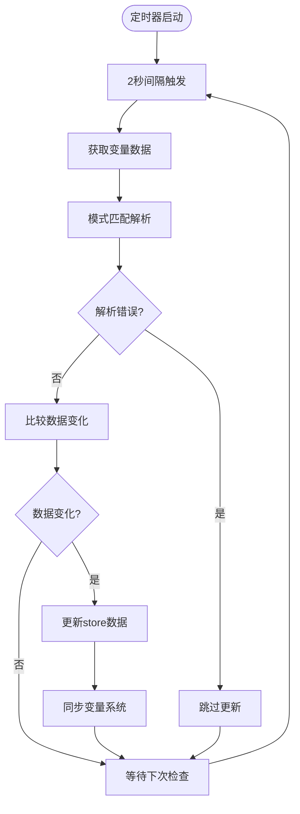
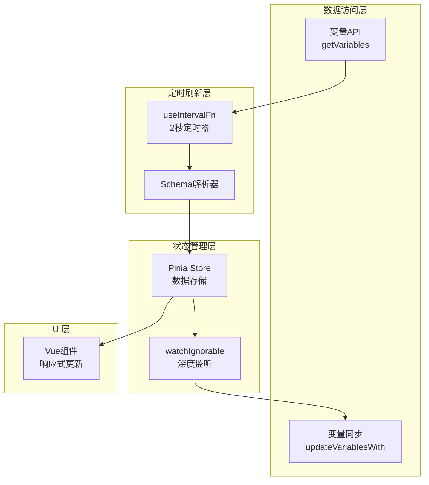
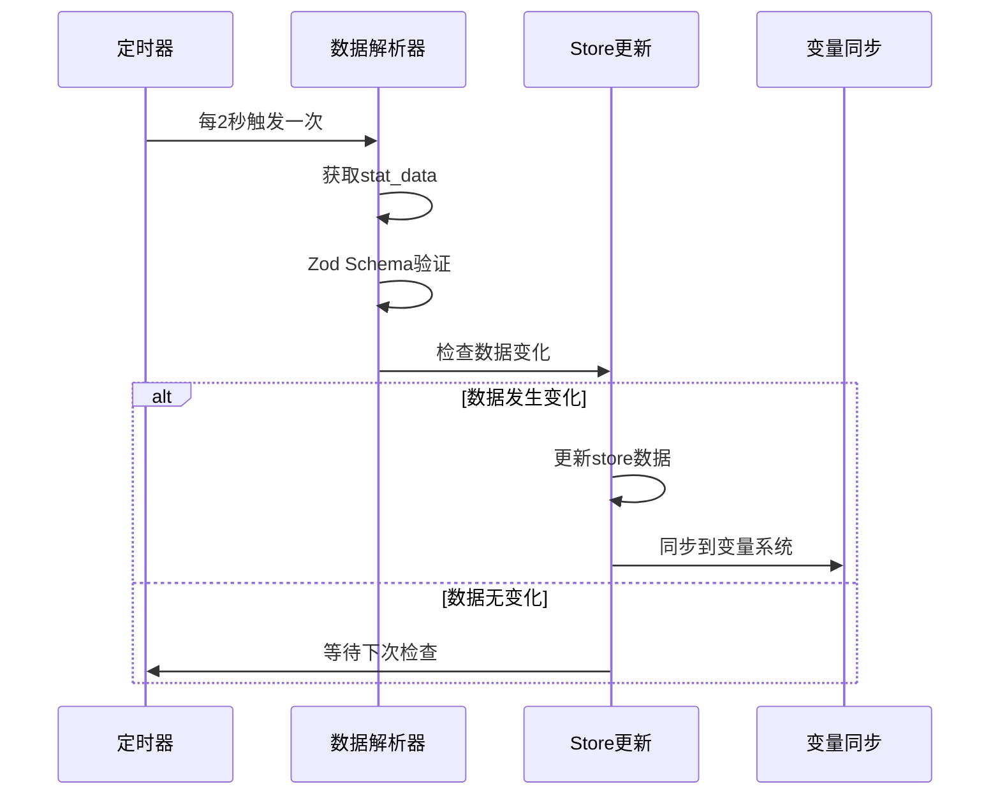
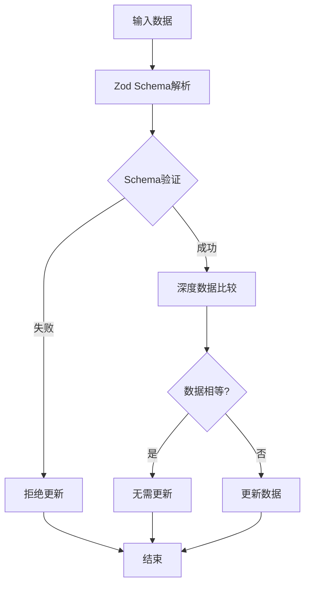
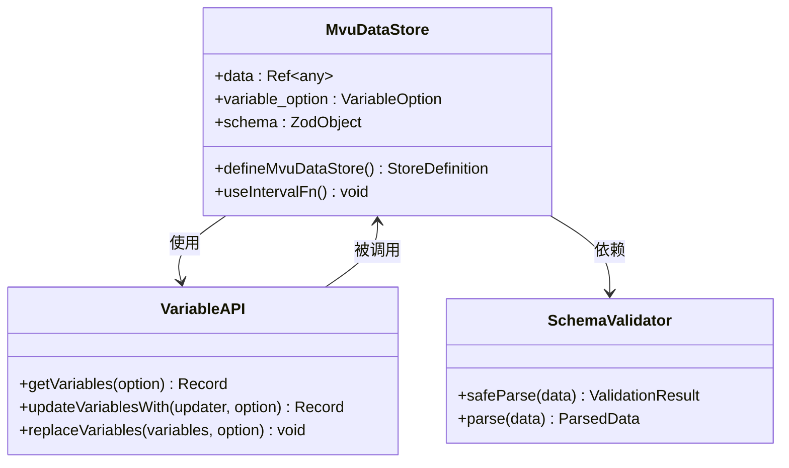
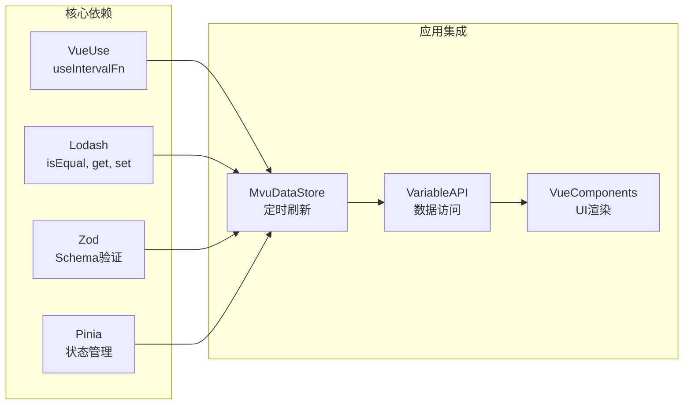
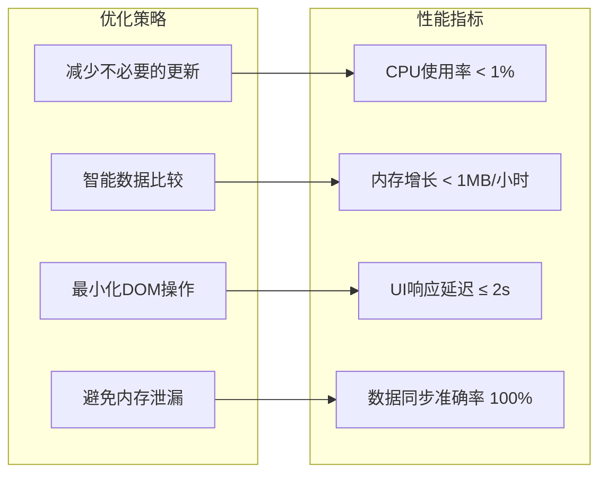
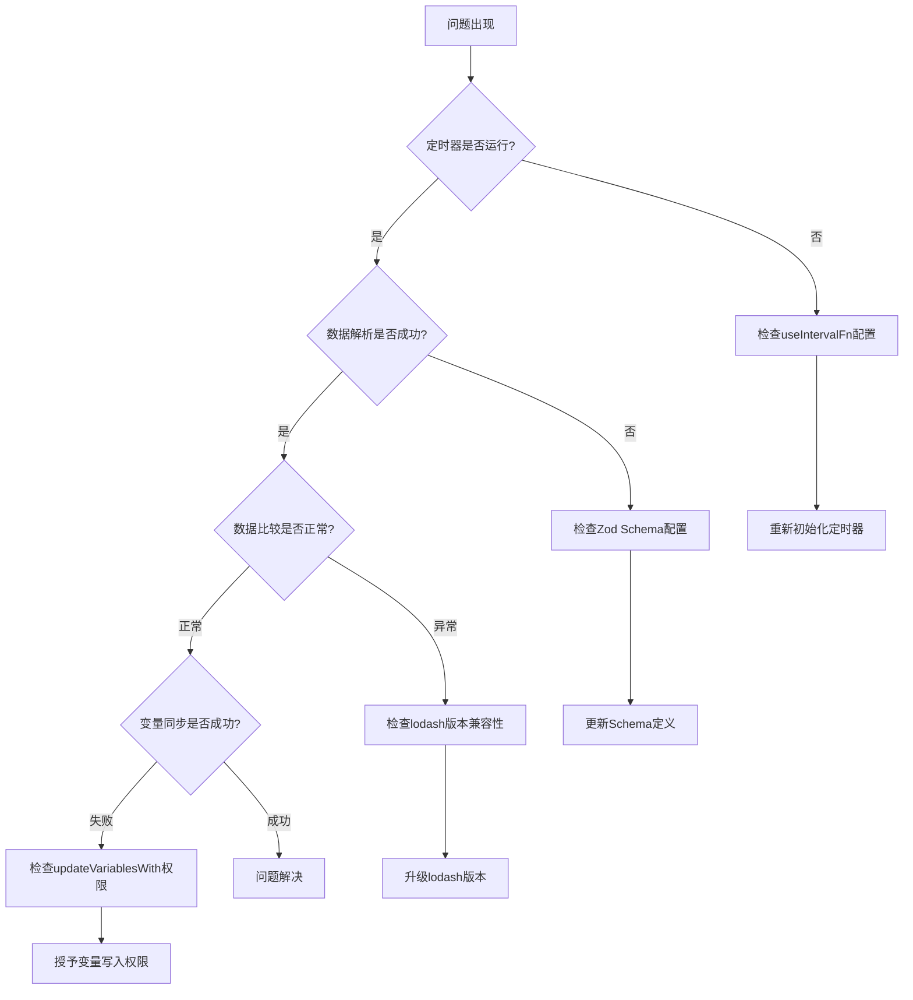

# 定时刷新策略

<cite>
**本文档引用的文件**
- [util/mvu.ts](file://util/mvu.ts)
- [@types/iframe/exported.mvu.d.ts](file://@types/iframe/exported.mvu.d.ts)
- [@types/function/variables.d.ts](file://@types/function/variables.d.ts)
- [@types/function/util.d.ts](file://@types/function/util.d.ts)
- [@types/function/index.d.ts](file://@types/function/index.d.ts)
- [示例/角色卡示例/界面/状态栏/index.ts](file://示例/角色卡示例/界面/状态栏/index.ts)
- [初始模板/角色卡/新建为src文件夹中的文件夹/界面/状态栏/index.ts](file://初始模板/角色卡/新建为src文件夹中的文件夹/界面/状态栏/index.ts)
</cite>

## 目录
1. [简介](#简介)
2. [项目结构](#项目结构)
3. [核心组件](#核心组件)
4. [架构概览](#架构概览)
5. [详细组件分析](#详细组件分析)
6. [依赖关系分析](#依赖关系分析)
7. [性能考量](#性能考量)
8. [故障排除指南](#故障排除指南)
9. [结论](#结论)

## 简介

本文档深入分析了MVU（Model-View-Update）框架中的定时刷新策略实现，重点解释2秒间隔的定时刷新机制设计原理。该策略通过useIntervalFn实现周期性数据同步，确保UI与底层变量系统的实时一致性。

## 项目结构

MVU定时刷新策略主要分布在以下关键文件中：

```mermaid
graph TB
subgraph "MVU核心模块"
A[util/mvu.ts<br/>定时刷新实现]
B[@types/iframe/exported.mvu.d.ts<br/>类型定义]
end
subgraph "变量系统"
C[@types/function/variables.d.ts<br/>变量API]
D[@types/function/util.d.ts<br/>工具函数]
E[@types/function/index.d.ts<br/>全局接口]
end
subgraph "应用入口"
F[示例/界面/index.ts<br/>应用初始化]
G[模板/界面/index.ts<br/>应用初始化]
end
A --> C
A --> D
A --> E
F --> A
G --> A
```

**图表来源**
- [util/mvu.ts:1-66](file://util/mvu.ts#L1-L66)
- [@types/iframe/exported.mvu.d.ts:1-190](file://@types/iframe/exported.mvu.d.ts#L1-L190)

**章节来源**
- [util/mvu.ts:1-66](file://util/mvu.ts#L1-L66)
- [@types/iframe/exported.mvu.d.ts:1-190](file://@types/iframe/exported.mvu.d.ts#L1-L190)

## 核心组件

### 定时刷新实现

MVU定时刷新策略的核心实现位于`defineMvuDataStore`函数中，采用2秒间隔的周期性检查机制：



**图表来源**
- [util/mvu.ts:29-43](file://util/mvu.ts#L29-L43)

### 数据变更检测机制

系统实现了双重数据验证机制：

1. **模式匹配验证**：使用Zod Schema进行数据结构验证
2. **深度比较检测**：使用lodash的isEqual进行数据内容对比

**章节来源**
- [util/mvu.ts:29-43](file://util/mvu.ts#L29-L43)

## 架构概览

MVU定时刷新策略的整体架构如下：



**图表来源**
- [util/mvu.ts:15-65](file://util/mvu.ts#L15-L65)

## 详细组件分析

### useIntervalFn实现细节

定时刷新的核心机制通过VueUse的useIntervalFn实现：



**图表来源**
- [util/mvu.ts:29-43](file://util/mvu.ts#L29-L43)

### 刷新触发条件

定时刷新的触发条件相对简单直接：

1. **时间条件**：每2秒自动触发一次
2. **数据条件**：仅在数据实际发生变化时才进行更新
3. **验证条件**：通过Zod Schema验证的数据才会被接受

### 数据变更检测逻辑

系统采用多层检测机制确保数据准确性：



**图表来源**
- [util/mvu.ts:31-42](file://util/mvu.ts#L31-L42)

**章节来源**
- [util/mvu.ts:29-43](file://util/mvu.ts#L29-L43)

### 变量系统集成

MVU定时刷新与变量系统的集成通过以下方式实现：



**图表来源**
- [util/mvu.ts:3-65](file://util/mvu.ts#L3-L65)
- [@types/function/variables.d.ts:65-131](file://@types/function/variables.d.ts#L65-L131)

**章节来源**
- [util/mvu.ts:3-65](file://util/mvu.ts#L3-L65)
- [@types/function/variables.d.ts:65-131](file://@types/function/variables.d.ts#L65-L131)

## 依赖关系分析

### 外部依赖

MVU定时刷新策略依赖以下关键外部库：



**图表来源**
- [util/mvu.ts:1-66](file://util/mvu.ts#L1-L66)

### 内部模块依赖

```mermaid
graph TD
MVU[util/mvu.ts] --> Types1[@types/iframe/exported.mvu.d.ts]
MVU --> Types2[@types/function/variables.d.ts]
MVU --> Types3[@types/function/util.d.ts]
MVU --> Types4[@types/function/index.d.ts]
App1[示例界面] --> MVU
App2[模板界面] --> MVU
```

**图表来源**
- [util/mvu.ts:1-66](file://util/mvu.ts#L1-L66)
- [示例/角色卡示例/界面/状态栏/index.ts:1-9](file://示例/角色卡示例/界面/状态栏/index.ts#L1-L9)
- [初始模板/角色卡/新建为src文件夹中的文件夹/界面/状态栏/index.ts:1-9](file://初始模板/角色卡/新建为src文件夹中的文件夹/界面/状态栏/index.ts#L1-L9)

**章节来源**
- [util/mvu.ts:1-66](file://util/mvu.ts#L1-L66)
- [示例/角色卡示例/界面/状态栏/index.ts:1-9](file://示例/角色卡示例/界面/状态栏/index.ts#L1-L9)
- [初始模板/角色卡/新建为src文件夹中的文件夹/界面/状态栏/index.ts:1-9](file://初始模板/角色卡/新建为src文件夹中的文件夹/界面/状态栏/index.ts#L1-L9)

## 性能考量

### 性能特征分析

MVU定时刷新策略具有以下性能特征：

1. **CPU开销**：每2秒执行一次，CPU占用率极低
2. **内存使用**：仅维护store引用和定时器实例
3. **网络开销**：依赖变量系统API，无额外网络请求
4. **响应延迟**：最大2秒的UI更新延迟

### 资源消耗优化



### 刷新频率优化建议

基于当前2秒间隔的设计，建议在以下场景下调整刷新策略：

1. **高频交互场景**：可考虑降低到1秒间隔
2. **低频更新场景**：可考虑提高到5秒间隔
3. **资源受限环境**：建议增加到10秒间隔
4. **实时性要求高**：结合事件驱动机制，减少定时器依赖

## 故障排除指南

### 常见问题及解决方案



### 错误处理机制

系统实现了多层次的错误处理：

1. **解析错误处理**：Schema验证失败时静默跳过
2. **数据变更检测**：避免重复更新相同数据
3. **异常捕获包装**：使用errorCatched包装函数
4. **内存安全**：定期清理不需要的引用

**章节来源**
- [util/mvu.ts:29-43](file://util/mvu.ts#L29-L43)
- [@types/function/util.d.ts:20-33](file://@types/function/util.d.ts#L20-L33)

## 结论

MVU定时刷新策略通过2秒间隔的周期性检查，在保证数据一致性的同时实现了较低的系统开销。该设计平衡了实时性与性能，适用于大多数MVU应用场景。通过合理的配置和监控，可以进一步优化刷新策略以适应不同的使用需求。