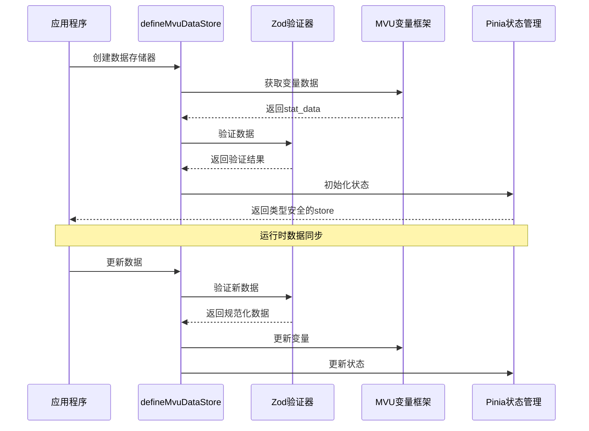
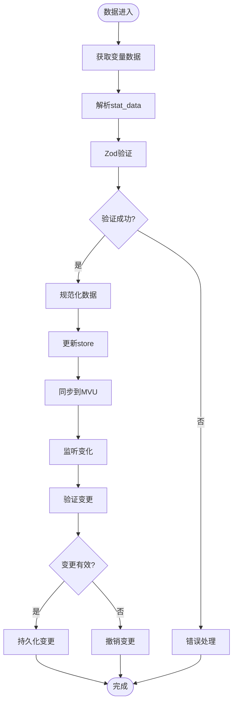
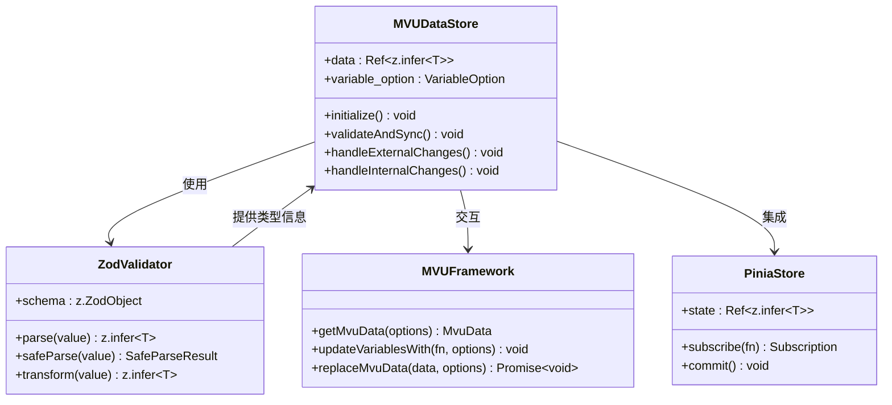

# 类型安全的数据存储

<cite>
**本文档引用的文件**
- [util/mvu.ts](file://util/mvu.ts)
- [@types/iframe/exported.mvu.d.ts](file://@types/iframe/exported.mvu.d.ts)
- [示例/角色卡示例/schema.ts](file://示例/角色卡示例/schema.ts)
- [示例/角色卡示例/界面/状态栏/store.ts](file://示例/角色卡示例/界面/状态栏/store.ts)
- [示例/角色卡示例/脚本/变量结构/index.ts](file://示例/角色卡示例/脚本/变量结构/index.ts)
- [package.json](file://package.json)
</cite>

## 目录
1. [简介](#简介)
2. [项目结构](#项目结构)
3. [核心组件](#核心组件)
4. [架构概览](#架构概览)
5. [详细组件分析](#详细组件分析)
6. [依赖关系分析](#依赖关系分析)
7. [性能考虑](#性能考虑)
8. [故障排除指南](#故障排除指南)
9. [结论](#结论)

## 简介

这是一个基于Zod类型验证的MVU（Model-View-Update）类型安全数据存储系统。该系统通过defineMvuDataStore函数实现了完整的类型安全保障，确保数据在运行时的完整性和一致性。系统集成了Zod模式验证、Pinia状态管理和MVU变量框架，提供了从schema定义到数据转换的完整解决方案。

## 项目结构

该项目采用模块化架构，主要包含以下核心部分：

```mermaid
graph TB
subgraph "核心模块"
A[util/mvu.ts] --> B[类型安全存储器]
C[@types/iframe/exported.mvu.d.ts] --> D[MVU类型定义]
E[示例/角色卡示例/schema.ts] --> F[Zod模式定义]
end
subgraph "应用层"
G[界面状态栏/store.ts] --> H[Vue组件状态管理]
I[脚本/变量结构/index.ts] --> J[模式注册]
end
subgraph "依赖管理"
K[package.json] --> L[Zod类型验证]
K --> M[Pinia状态管理]
K --> N[Lodash工具库]
end
F --> B
D --> B
B --> H
J --> B
```

**图表来源**
- [util/mvu.ts:1-66](file://util/mvu.ts#L1-L66)
- [@types/iframe/exported.mvu.d.ts:1-190](file://@types/iframe/exported.mvu.d.ts#L1-L190)
- [示例/角色卡示例/schema.ts:1-52](file://示例/角色卡示例/schema.ts#L1-L52)

**章节来源**
- [util/mvu.ts:1-66](file://util/mvu.ts#L1-L66)
- [package.json:1-120](file://package.json#L1-L120)

## 核心组件

### defineMvuDataStore函数

这是系统的核心组件，负责创建类型安全的MVU数据存储器。该函数具有以下关键特性：

**泛型参数使用**：
- `T extends z.ZodObject`：确保传入的schema必须是Zod对象类型
- 返回类型自动推断为`Ref<z.infer<T>>`，提供完整的类型信息

**参数配置**：
- `schema: T`：Zod验证模式
- `variable_option: VariableOption`：变量选项配置
- `additional_setup?: (data: Ref<z.infer<T>>) => void`：可选的额外设置函数

**类型推断机制**：
系统通过`z.infer<T>`实现双向类型推断，确保store内部数据类型与schema完全一致。

**章节来源**
- [util/mvu.ts:3-7](file://util/mvu.ts#L3-L7)

### Zod模式定义

系统提供了完整的Zod模式定义示例，展示如何构建复杂的数据结构：

**基础类型支持**：
- 字符串类型：`z.string()`
- 数字类型：`z.number()`和`z.coerce.number()`
- 布尔类型：`z.boolean()`
- 记录类型：`z.record()`

**高级类型特性**：
- 转换器：`.transform()`用于数据转换
- 描述器：`.describe()`用于类型注释
- 默认值：`.default()`用于默认值设置
- 预填充：`.prefault()`用于预填充模式

**章节来源**
- [示例/角色卡示例/schema.ts:1-52](file://示例/角色卡示例/schema.ts#L1-L52)

## 架构概览

系统采用MVU架构模式，结合Zod类型验证和Pinia状态管理：



**图表来源**
- [util/mvu.ts:15-64](file://util/mvu.ts#L15-L64)
- [@types/iframe/exported.mvu.d.ts:121-177](file://@types/iframe/exported.mvu.d.ts#L121-L177)

## 详细组件分析

### 类型安全验证流程

系统实现了多层次的类型验证机制：



**图表来源**
- [util/mvu.ts:22-60](file://util/mvu.ts#L22-L60)

### 错误处理策略

系统采用渐进式的错误处理策略：

**初始化阶段错误处理**：
- 使用`errorCatched`包装器捕获初始化异常
- 通过`reportInput: true`参数提供详细的输入报告

**运行时错误处理**：
- `safeParse`方法提供非抛出式验证
- 自动忽略无效的变更尝试
- 维护数据的一致性状态

**章节来源**
- [util/mvu.ts:21-60](file://util/mvu.ts#L21-L60)

### 数据同步机制

系统实现了双向数据同步：



**图表来源**
- [util/mvu.ts:3-64](file://util/mvu.ts#L3-L64)
- [@types/iframe/exported.mvu.d.ts:1-190](file://@types/iframe/exported.mvu.d.ts#L1-L190)

**章节来源**
- [util/mvu.ts:29-60](file://util/mvu.ts#L29-L60)

### 复杂数据结构处理

系统能够处理复杂的嵌套数据结构：

**嵌套对象处理**：
- 支持任意深度的对象嵌套
- 自动类型推断和验证
- 局部更新和全量更新

**动态类型场景**：
- 使用`Record<string, any>`处理动态字段
- 通过转换器实现类型安全的动态访问
- 支持条件类型和分支逻辑

**章节来源**
- [示例/角色卡示例/schema.ts:8-37](file://示例/角色卡示例/schema.ts#L8-L37)

## 依赖关系分析

系统依赖关系清晰明确：

```mermaid
graph LR
subgraph "外部依赖"
A[Zod 4.3.6]
B[Pinia 3.0.4]
C[Lodash 4.17.23]
D[Vue 3.5.30]
end
subgraph "核心模块"
E[util/mvu.ts]
F[@types/iframe/exported.mvu.d.ts]
G[示例/schema.ts]
end
subgraph "应用层"
H[store.ts]
I[index.ts]
end
A --> E
B --> E
C --> E
D --> H
F --> E
G --> E
E --> H
E --> I
```

**图表来源**
- [package.json:79-107](file://package.json#L79-L107)
- [util/mvu.ts:1](file://util/mvu.ts#L1)

**章节来源**
- [package.json:79-107](file://package.json#L79-L107)

## 性能考虑

系统在设计时充分考虑了性能优化：

**内存管理**：
- 使用Ref进行响应式数据绑定
- 避免不必要的数据复制
- 智能的变更检测机制

**计算优化**：
- 2秒间隔的轮询机制
- 深度比较避免重复更新
- 忽略更新机制防止循环依赖

**类型检查优化**：
- 编译时类型检查
- 运行时最小化验证开销
- 缓存验证结果

## 故障排除指南

### 常见问题及解决方案

**类型不匹配错误**：
- 检查schema定义是否与实际数据结构一致
- 确认所有必需字段都已正确声明
- 验证转换器的逻辑正确性

**数据验证失败**：
- 查看详细的错误报告信息
- 检查输入数据的格式和类型
- 确认默认值和转换逻辑

**状态同步问题**：
- 检查MVU变量框架的配置
- 验证变量选项的正确性
- 确认Pinia store的初始化顺序

**章节来源**
- [util/mvu.ts:32-50](file://util/mvu.ts#L32-L50)

## 结论

这个MVU类型安全数据存储系统通过精心设计的架构，成功地将Zod类型验证、MVU变量框架和Pinia状态管理有机结合。系统的主要优势包括：

**类型安全性**：通过泛型和Zod验证确保数据的完整性和一致性
**灵活性**：支持复杂的嵌套数据结构和动态类型场景  
**性能优化**：智能的缓存和同步机制保证高效的运行性能
**易用性**：简洁的API设计降低了使用门槛

该系统为MVU应用提供了可靠的类型安全保障，是构建复杂状态管理系统的优秀解决方案。