# 自动数据同步机制

<cite>
**本文档引用的文件**
- [util/mvu.ts](file://util/mvu.ts)
- [@types/iframe/exported.mvu.d.ts](file://@types/iframe/exported.mvu.d.ts)
- [@types/function/variables.d.ts](file://@types/function/variables.d.ts)
- [util/common.ts](file://util/common.ts)
- [webpack.config.ts](file://webpack.config.ts)
</cite>

## 目录
1. [简介](#简介)
2. [项目结构](#项目结构)
3. [核心组件](#核心组件)
4. [架构概览](#架构概览)
5. [详细组件分析](#详细组件分析)
6. [依赖关系分析](#依赖关系分析)
7. [性能考虑](#性能考虑)
8. [故障排除指南](#故障排除指南)
9. [结论](#结论)

## 简介

本文档深入解析MVU（Model-View-Update）自动数据同步机制，这是一个基于变量框架的双向数据同步系统。该系统实现了本地状态与外部变量系统的实时同步，确保数据一致性并通过智能冲突解决机制避免循环更新问题。

系统的核心特性包括：
- **双向同步**：本地状态与外部变量系统之间的实时数据交换
- **冲突解决**：智能的数据变更检测和冲突处理机制
- **一致性保证**：通过Zod模式验证确保数据结构完整性
- **定时刷新**：基于useIntervalFn的定期数据同步
- **监听机制**：watchIgnorable监听器防止循环更新

## 项目结构

MVU自动数据同步机制主要由以下组件构成：

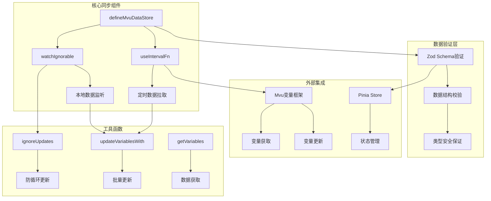

**图表来源**
- [util/mvu.ts:3-65](file://util/mvu.ts#L3-L65)
- [@types/iframe/exported.mvu.d.ts:1-190](file://@types/iframe/exported.mvu.d.ts#L1-L190)

**章节来源**
- [util/mvu.ts:1-66](file://util/mvu.ts#L1-L66)
- [@types/iframe/exported.mvu.d.ts:1-190](file://@types/iframe/exported.mvu.d.ts#L1-L190)

## 核心组件

### 主要组件概述

MVU自动数据同步系统包含四个核心组件：

1. **defineMvuDataStore**：主存储工厂函数，创建MVU数据存储实例
2. **useIntervalFn**：定时刷新机制，周期性检查数据变化
3. **watchIgnorable**：智能监听器，检测本地数据变更并触发同步
4. **ignoreUpdates**：防循环更新函数，防止同步过程中的无限循环

### 数据流架构

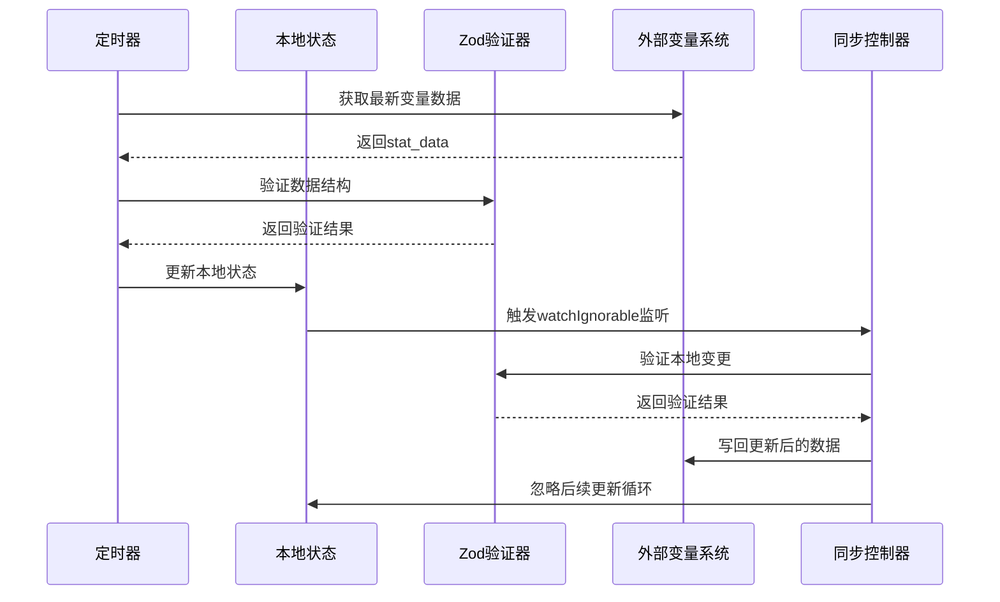

**图表来源**
- [util/mvu.ts:29-43](file://util/mvu.ts#L29-L43)
- [util/mvu.ts:45-60](file://util/mvu.ts#L45-L60)

**章节来源**
- [util/mvu.ts:3-65](file://util/mvu.ts#L3-L65)

## 架构概览

### 整体架构设计

MVU自动数据同步机制采用分层架构设计，确保各组件职责清晰且松耦合：

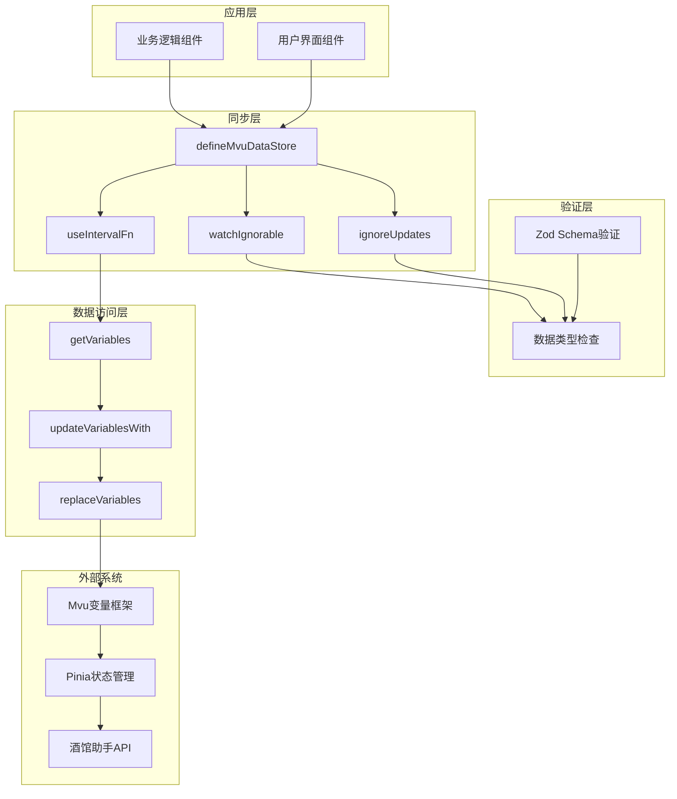

**图表来源**
- [util/mvu.ts:1-65](file://util/mvu.ts#L1-L65)
- [@types/function/variables.d.ts:67-206](file://@types/function/variables.d.ts#L67-L206)

### 数据同步流程

系统实现了完整的双向同步流程，确保数据一致性：

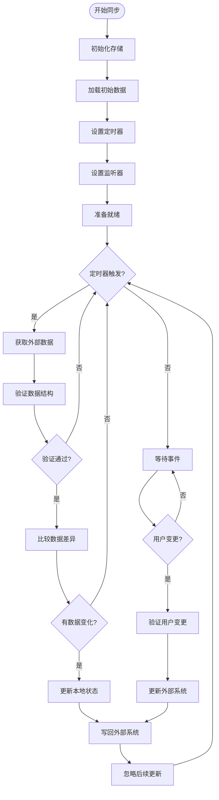

**图表来源**
- [util/mvu.ts:29-60](file://util/mvu.ts#L29-L60)

**章节来源**
- [util/mvu.ts:1-66](file://util/mvu.ts#L1-L66)

## 详细组件分析

### defineMvuDataStore函数分析

defineMvuDataStore是整个MVU同步机制的核心工厂函数，负责创建和配置数据存储实例。

#### 函数签名与参数

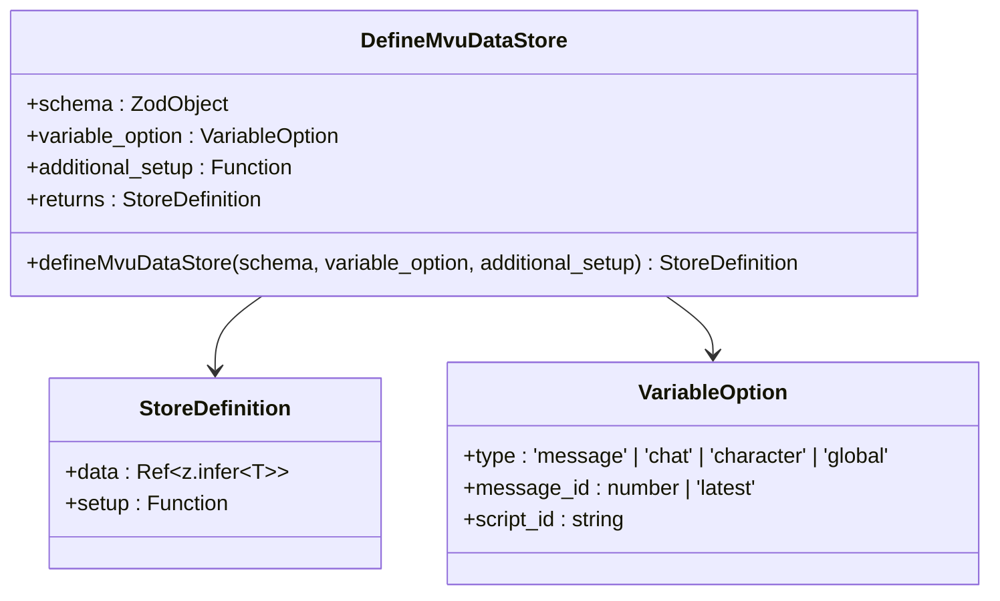

**图表来源**
- [util/mvu.ts:3-7](file://util/mvu.ts#L3-L7)

#### 初始化流程

函数的初始化流程包含多个关键步骤：

1. **消息ID处理**：当type为'message'且message_id为undefined或'latest'时，自动设置为-1
2. **Store创建**：使用Pinia的defineStore创建MVU数据存储
3. **数据加载**：从变量系统获取初始stat_data并使用Zod进行验证
4. **附加设置**：执行可选的additional_setup回调函数

**章节来源**
- [util/mvu.ts:8-27](file://util/mvu.ts#L8-L27)

### 定时刷新机制（useIntervalFn）

定时刷新机制是MVU系统实现双向同步的关键组件，负责周期性检查外部数据变化。

#### 工作原理

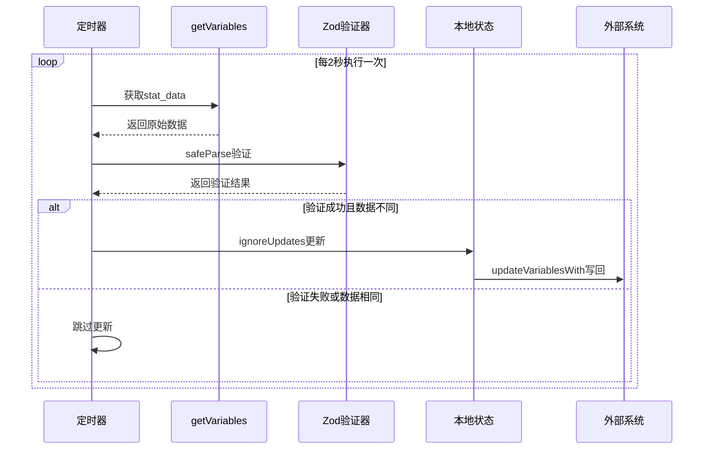

**图表来源**
- [util/mvu.ts:29-43](file://util/mvu.ts#L29-L43)

#### 关键特性

- **时间间隔**：默认2000毫秒（2秒）的同步间隔
- **数据验证**：每次同步都使用Zod进行严格的数据结构验证
- **差异检测**：使用lodash的isEqual进行深度比较
- **防抖处理**：通过ignoreUpdates防止同步过程中的循环更新

**章节来源**
- [util/mvu.ts:29-43](file://util/mvu.ts#L29-L43)

### 监听器实现（watchIgnorable）

watchIgnorable监听器负责检测本地数据变更并触发相应的同步操作。

#### 监听配置

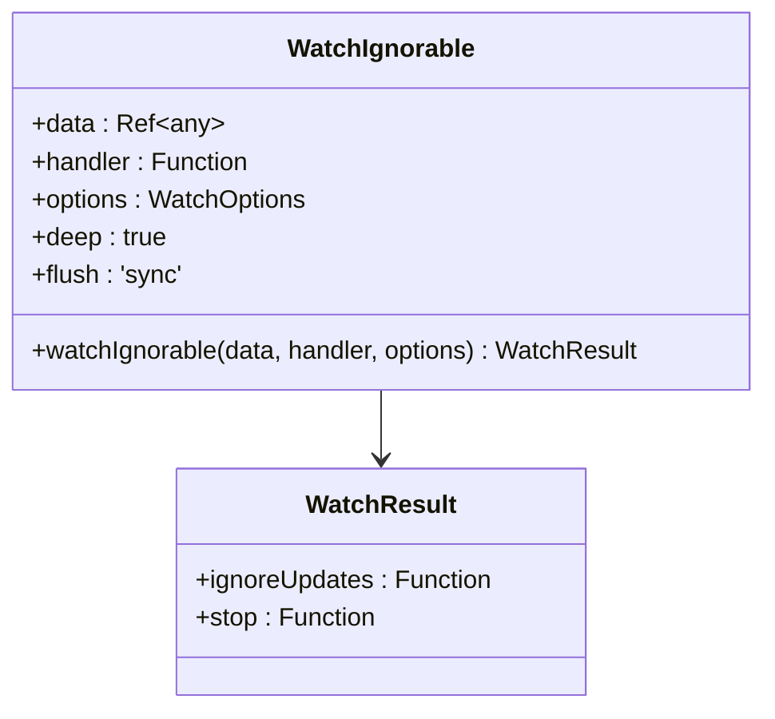

**图表来源**
- [util/mvu.ts:45-60](file://util/mvu.ts#L45-L60)

#### 处理流程

监听器的处理流程包含以下关键步骤：

1. **数据验证**：使用schema.safeParse验证本地数据变更
2. **结构修复**：如果数据不符合模式要求，自动修复并更新本地状态
3. **外部同步**：将验证后的数据写回到外部变量系统
4. **循环防护**：使用ignoreUpdates包装写回操作，防止循环更新

**章节来源**
- [util/mvu.ts:45-60](file://util/mvu.ts#L45-L60)

### 数据变更检测算法

MVU系统实现了多层数据变更检测机制，确保准确识别数据变化并最小化不必要的同步。

#### 变更检测流程

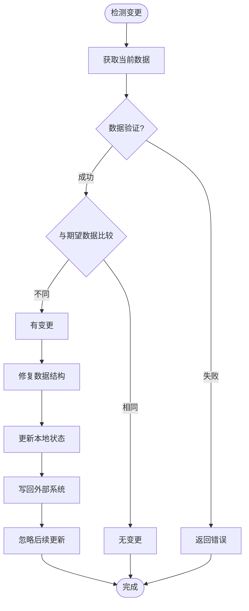

**图表来源**
- [util/mvu.ts:47-57](file://util/mvu.ts#L47-L57)

#### 算法复杂度分析

- **时间复杂度**：O(n)，其中n是数据结构的大小
- **空间复杂度**：O(n)，用于存储验证结果和中间状态
- **验证成本**：每次变更都会触发Zod验证，确保类型安全

**章节来源**
- [util/mvu.ts:47-57](file://util/mvu.ts#L47-L57)

### ignoreUpdates函数详解

ignoreUpdates是MVU系统中防止循环更新的核心函数，通过临时禁用监听器来避免同步过程中的无限循环。

#### 函数工作机制

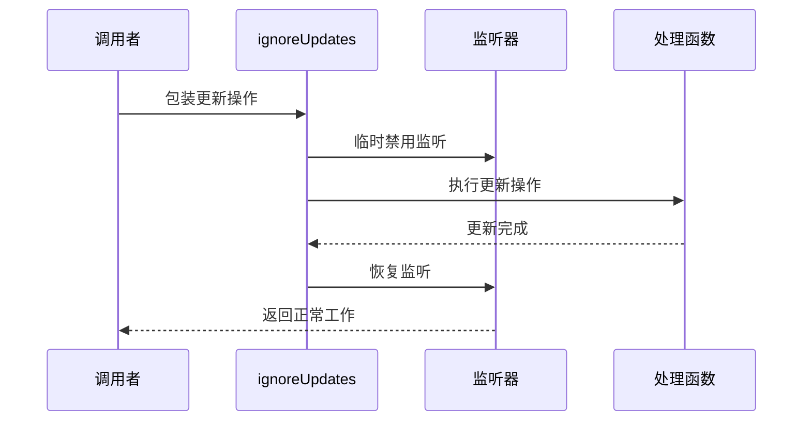

**图表来源**
- [util/mvu.ts:36-38](file://util/mvu.ts#L36-L38)
- [util/mvu.ts:53-55](file://util/mvu.ts#L53-L55)

#### 使用场景

1. **定时器同步**：定时器更新本地状态时避免触发监听器
2. **外部系统更新**：外部系统更新数据时避免触发本地监听
3. **批量数据处理**：处理大量数据变更时防止重复同步

**章节来源**
- [util/mvu.ts:36-38](file://util/mvu.ts#L36-L38)
- [util/mvu.ts:53-55](file://util/mvu.ts#L53-L55)

## 依赖关系分析

### 外部依赖关系

MVU自动数据同步机制依赖多个外部库和系统组件：

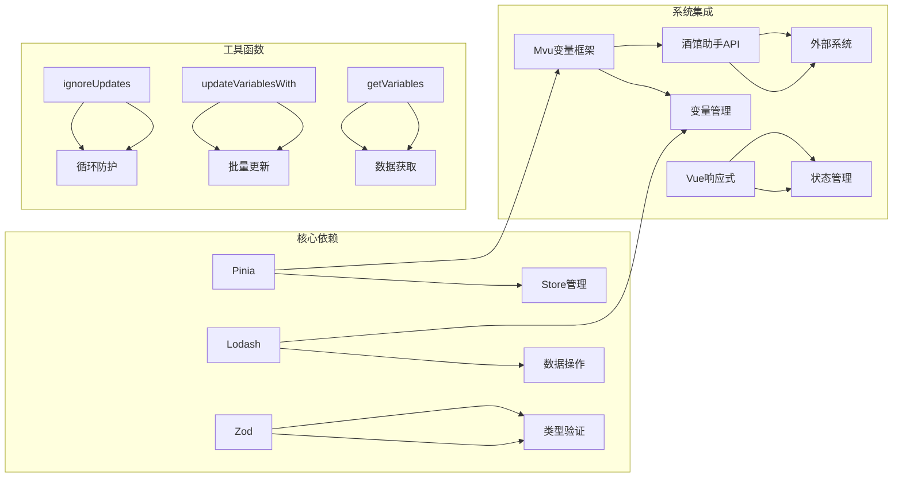

**图表来源**
- [util/mvu.ts:1-2](file://util/mvu.ts#L1-L2)
- [@types/function/variables.d.ts:112-131](file://@types/function/variables.d.ts#L112-L131)

### 内部模块依赖

系统内部模块之间的依赖关系相对简单，主要通过函数调用实现：

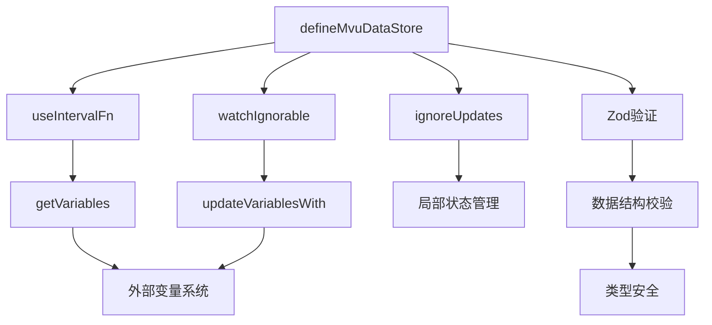

**图表来源**
- [util/mvu.ts:3-65](file://util/mvu.ts#L3-L65)

**章节来源**
- [util/mvu.ts:1-66](file://util/mvu.ts#L1-L66)
- [@types/function/variables.d.ts:67-206](file://@types/function/variables.d.ts#L67-L206)

## 性能考虑

### 同步频率优化

系统采用2秒的默认同步间隔，这是一个平衡点：
- **响应速度**：足够快以反映数据变化
- **性能开销**：避免过于频繁的同步导致性能问题
- **用户体验**：提供流畅的交互体验

### 数据验证优化

Zod验证虽然确保类型安全，但可能成为性能瓶颈：
- **缓存策略**：可以考虑缓存验证结果
- **增量验证**：只验证发生变化的部分
- **异步验证**：将验证操作放到后台线程

### 内存使用优化

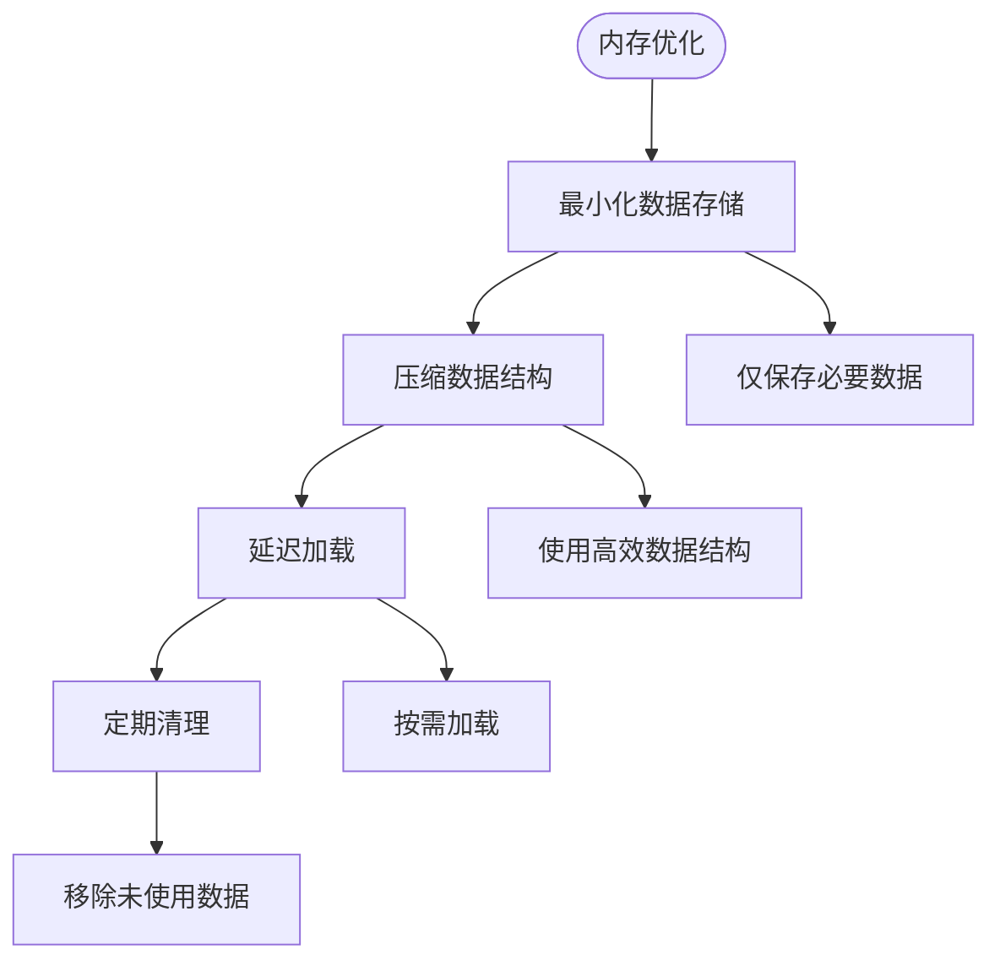

### 并发控制

系统通过ignoreUpdates函数有效防止并发更新问题：
- **单线程更新**：确保数据更新的原子性
- **队列管理**：处理多个并发更新请求
- **优先级控制**：确定更新的执行顺序

## 故障排除指南

### 常见问题诊断

#### 数据验证失败

**症状**：定时器同步时出现验证错误
**原因**：外部系统数据结构不符合Zod模式定义
**解决方案**：
1. 检查Zod模式定义是否正确
2. 验证外部系统数据格式
3. 使用prettifyErrorWithInput获取详细错误信息

#### 循环更新问题

**症状**：数据在本地和外部系统之间无限循环更新
**原因**：缺少ignoreUpdates包装或监听器配置错误
**解决方案**：
1. 确保所有数据写回操作都使用ignoreUpdates包装
2. 检查watchIgnorable的deep选项设置
3. 验证数据比较逻辑的正确性

#### 同步延迟问题

**症状**：数据变更后响应延迟
**原因**：同步间隔过长或系统负载过高
**解决方案**：
1. 调整useIntervalFn的时间间隔
2. 优化数据验证性能
3. 实施增量同步机制

### 调试工具和方法

#### 错误处理机制

系统提供了完善的错误处理机制：

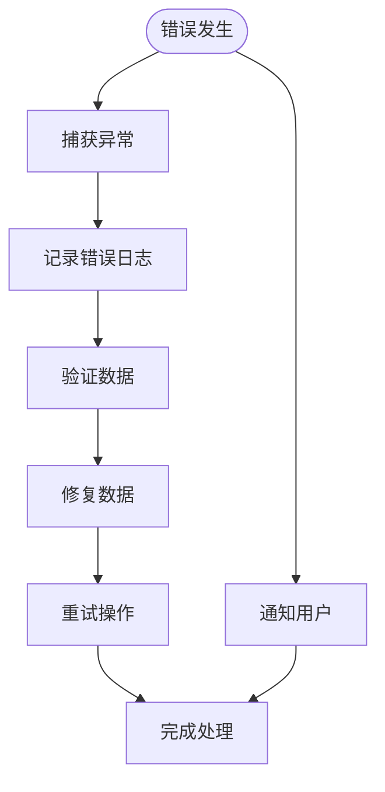

**图表来源**
- [util/mvu.ts:21-27](file://util/mvu.ts#L21-L27)

#### 调试辅助函数

系统提供了多种调试辅助工具：
- **prettifyErrorWithInput**：格式化Zod验证错误
- **assignInplace**：高效的数据数组操作
- **chunkBy**：数据分块处理

**章节来源**
- [util/common.ts:76-90](file://util/common.ts#L76-L90)
- [util/common.ts:6-10](file://util/common.ts#L6-L10)
- [util/common.ts:17-31](file://util/common.ts#L17-L31)

### 性能监控

#### 监控指标

建议监控以下关键性能指标：
- **同步延迟**：数据变更到显示的时间
- **CPU使用率**：同步操作的计算开销
- **内存占用**：数据存储和缓存使用情况
- **错误率**：数据验证和同步失败的比例

#### 优化建议

1. **异步处理**：将耗时操作移到后台线程
2. **批处理**：合并多个小的更新操作
3. **缓存策略**：合理使用缓存减少重复计算
4. **资源管理**：及时释放不再使用的资源

## 结论

MVU自动数据同步机制是一个设计精良的双向数据同步系统，通过以下关键特性实现了高效、可靠的数据同步：

### 核心优势

1. **类型安全**：通过Zod确保数据结构的完整性和一致性
2. **双向同步**：同时支持本地到外部和外部到本地的数据同步
3. **冲突解决**：智能的数据变更检测和冲突处理机制
4. **循环防护**：通过ignoreUpdates有效防止同步过程中的无限循环
5. **性能优化**：合理的同步频率和数据验证策略

### 技术创新

- **混合监听机制**：结合定时器和事件监听器确保数据同步的及时性
- **智能验证**：Zod验证器不仅检查数据类型，还能自动修复部分数据结构问题
- **防循环设计**：独特的ignoreUpdates机制有效解决了双向同步中的经典问题

### 应用价值

该系统为MVU变量框架提供了强大的数据同步能力，使得开发者能够专注于业务逻辑的实现，而不必担心底层的数据同步复杂性。通过模块化的架构设计和完善的错误处理机制，系统具有良好的可维护性和扩展性。

### 未来发展方向

1. **性能进一步优化**：考虑引入更高效的序列化和反序列化机制
2. **分布式支持**：扩展到多节点环境下的数据同步
3. **实时通信**：集成WebSocket等实时通信协议
4. **监控增强**：添加更详细的性能监控和诊断工具

通过持续的优化和完善，MVU自动数据同步机制将成为MVU变量框架的重要基础设施，为构建复杂的动态数据管理系统提供坚实的技术支撑。