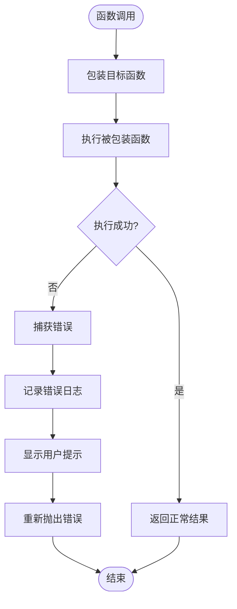
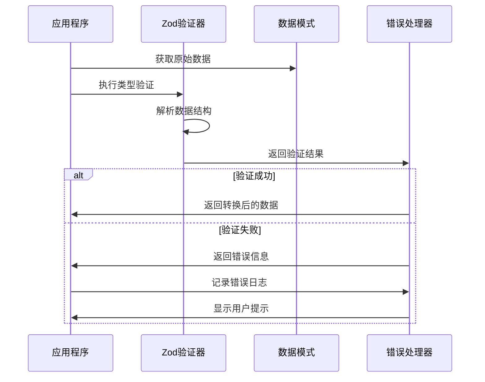
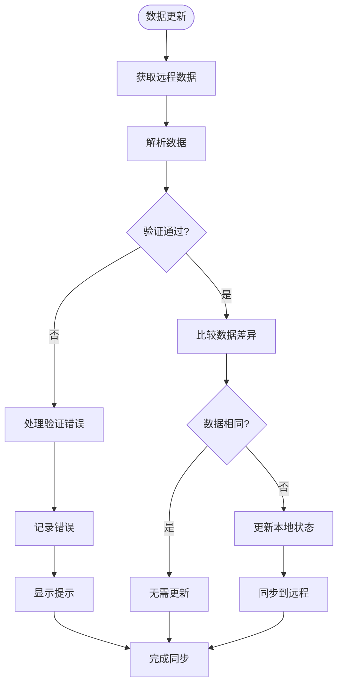
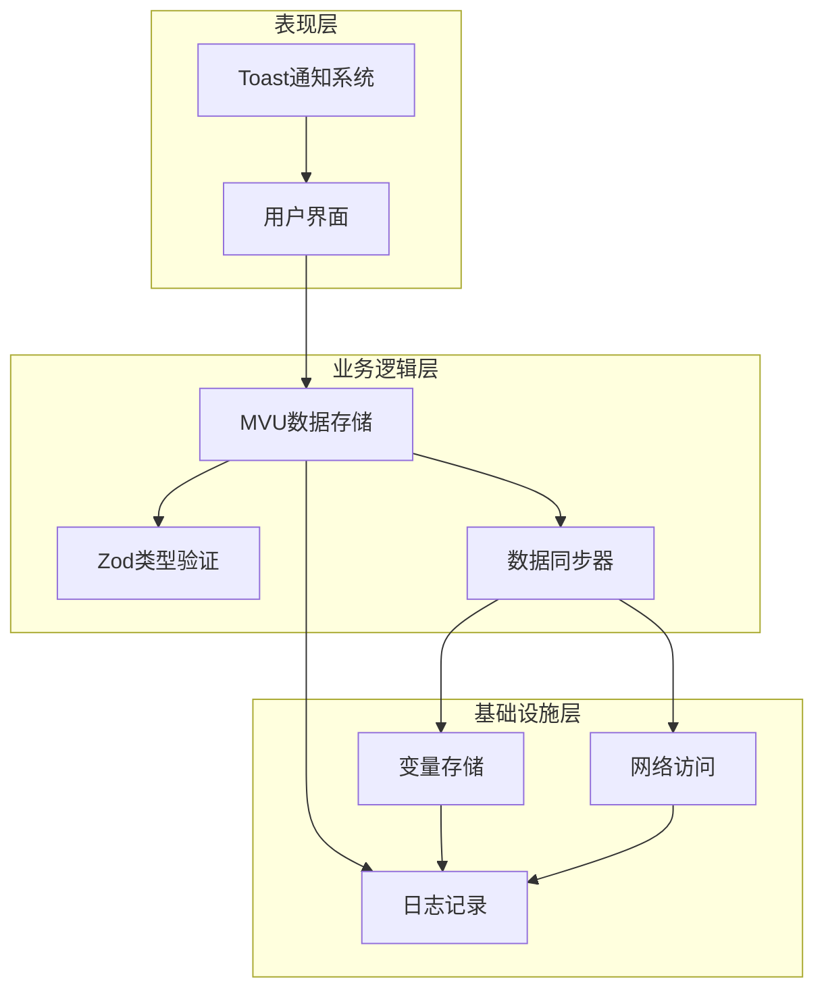
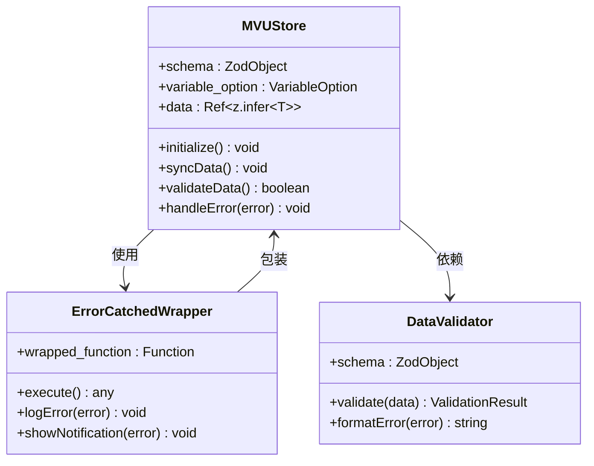
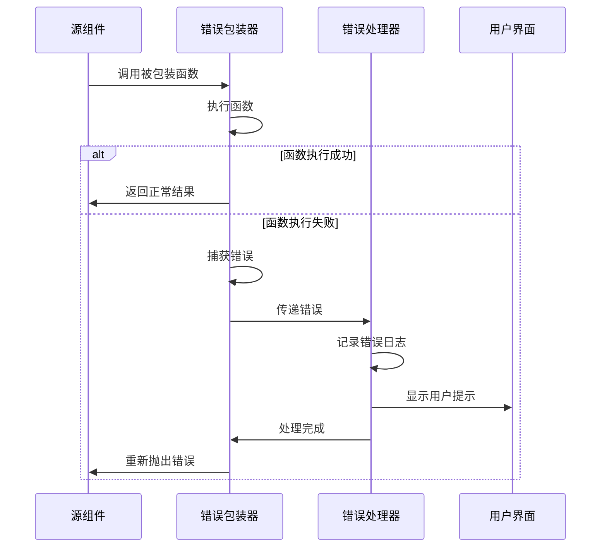

# 错误处理与恢复机制

<cite>
**本文档引用的文件**
- [util/mvu.ts](file://util/mvu.ts)
- [@types/function/util.d.ts](file://@types/function/util.d.ts)
- [参考脚本示例/@types/function/util.d.ts](file://参考脚本示例/@types/function/util.d.ts)
- [util/common.ts](file://util/common.ts)
- [util/script.ts](file://util/script.ts)
- [示例/脚本示例/监听消息修改.ts](file://示例/脚本示例/监听消息修改.ts)
- [示例/前端界面示例/加载和卸载时执行函数.ts](file://示例/前端界面示例/加载和卸载时执行函数.ts)
- [util/streaming.ts](file://util/streaming.ts)
- [示例/流式楼层界面示例/App.vue](file://示例/流式楼层界面示例/App.vue)
- [src/快速情节编排/index.ts](file://src/快速情节编排/index.ts)
- [dump_schema.ts](file://dump_schema.ts)
</cite>

## 目录
1. [简介](#简介)
2. [项目结构](#项目结构)
3. [核心组件](#核心组件)
4. [架构概览](#架构概览)
5. [详细组件分析](#详细组件分析)
6. [依赖关系分析](#依赖关系分析)
7. [性能考虑](#性能考虑)
8. [故障排除指南](#故障排除指南)
9. [结论](#结论)

## 简介

本文件深入分析了MVU（Model-View-Update）模式中的错误处理与恢复机制。重点解释了`errorCatched`函数的实现原理和使用方式，涵盖异常捕获策略、错误传播机制、恢复流程设计。文档详细说明了系统如何处理类型验证失败、数据不一致、网络异常等各种错误场景，并提供了错误日志记录、用户友好的错误提示、自动恢复策略的具体实现方案。

该系统采用多层防护机制：类型验证层、数据同步层、UI交互层和网络访问层，每层都有相应的错误处理策略和恢复措施。通过Zod类型验证确保数据完整性，通过Pinia状态管理实现数据一致性，通过Toast通知提供用户反馈，通过自动重试机制实现故障恢复。

## 项目结构

项目采用模块化设计，错误处理机制分布在多个关键模块中：

```mermaid
graph TB
subgraph "错误处理核心层"
A[util/mvu.ts<br/>MVU数据存储]
B[@types/function/util.d.ts<br/>类型定义]
C[util/common.ts<br/>通用工具]
end
subgraph "UI交互层"
D[util/script.ts<br/>脚本加载]
E[util/streaming.ts<br/>流式渲染]
F[示例/前端界面示例<br/>用户界面]
end
subgraph "网络访问层"
G[src/快速情节编排/index.ts<br/>配置管理]
H[dump_schema.ts<br/>模式生成]
end
A --> B
A --> C
D --> A
E --> A
F --> A
G --> A
H --> A
```

**图表来源**
- [util/mvu.ts:1-66](file://util/mvu.ts#L1-L66)
- [@types/function/util.d.ts:1-44](file://@types/function/util.d.ts#L1-L44)
- [util/common.ts:1-134](file://util/common.ts#L1-L134)

**章节来源**
- [util/mvu.ts:1-66](file://util/mvu.ts#L1-L66)
- [@types/function/util.d.ts:1-44](file://@types/function/util.d.ts#L1-L44)
- [util/common.ts:1-134](file://util/common.ts#L1-L134)

## 核心组件

### errorCatched函数

`errorCatched`是整个错误处理系统的核心，它是一个高阶函数包装器，能够将任意函数包装为具备错误处理能力的函数。

#### 实现原理



**图表来源**
- [@types/function/util.d.ts:20-33](file://@types/function/util.d.ts#L20-L33)

#### 使用方式

`errorCatched`主要应用于以下场景：

1. **MVU数据存储初始化**：确保数据获取过程中的异常不会导致整个应用崩溃
2. **定时任务执行**：防止定时检查过程中出现的错误影响其他功能
3. **数据同步操作**：在网络请求或数据处理失败时提供恢复机制

**章节来源**
- [@types/function/util.d.ts:20-33](file://@types/function/util.d.ts#L20-L33)
- [util/mvu.ts:21-24](file://util/mvu.ts#L21-L24)

### 类型验证系统

系统使用Zod进行强类型验证，确保数据在进入应用逻辑之前就得到验证。

#### Zod验证流程



**图表来源**
- [util/mvu.ts:22-24](file://util/mvu.ts#L22-L24)
- [util/common.ts:76-90](file://util/common.ts#L76-L90)

**章节来源**
- [util/mvu.ts:22-24](file://util/mvu.ts#L22-L24)
- [util/common.ts:76-90](file://util/common.ts#L76-L90)

### 数据同步机制

系统实现了双向数据同步，确保本地状态与远程变量保持一致。

#### 数据同步流程



**图表来源**
- [util/mvu.ts:29-43](file://util/mvu.ts#L29-L43)

**章节来源**
- [util/mvu.ts:29-43](file://util/mvu.ts#L29-L43)

## 架构概览

系统采用分层架构设计，每层都有明确的职责和错误处理策略：



**图表来源**
- [util/mvu.ts:1-66](file://util/mvu.ts#L1-L66)
- [util/common.ts:1-134](file://util/common.ts#L1-L134)

系统的核心优势在于其渐进式错误处理：从类型验证到数据同步，再到UI反馈，每一层都提供了相应的保护机制。

## 详细组件分析

### MVU数据存储组件

MVU数据存储组件是错误处理机制的核心实现，负责管理应用程序的状态数据。

#### 类结构分析



**图表来源**
- [util/mvu.ts:3-66](file://util/mvu.ts#L3-L66)

#### 初始化流程

MVU数据存储的初始化过程包含了完整的错误处理机制：

1. **参数验证**：检查变量选项的有效性
2. **数据获取**：从变量存储中获取初始数据
3. **类型验证**：使用Zod验证数据结构
4. **状态设置**：设置初始状态并启动监控

**章节来源**
- [util/mvu.ts:8-27](file://util/mvu.ts#L8-L27)

### 错误传播机制

系统实现了多层次的错误传播机制，确保错误能够在适当的层级得到处理。

#### 错误传播流程



**图表来源**
- [@types/function/util.d.ts:20-33](file://@types/function/util.d.ts#L20-L33)

**章节来源**
- [@types/function/util.d.ts:20-33](file://@types/function/util.d.ts#L20-L33)

### 自动恢复策略

系统实现了多种自动恢复策略，以提高系统的鲁棒性和用户体验。

#### 恢复策略类型

1. **数据恢复**：当数据验证失败时，系统会尝试从备份位置恢复数据
2. **连接恢复**：网络异常时自动重连并重试请求
3. **状态恢复**：UI状态异常时自动重置到安全状态

**章节来源**
- [src/快速情节编排/index.ts:183-218](file://src/快速情节编排/index.ts#L183-L218)

## 依赖关系分析

系统各组件之间的依赖关系清晰明确，形成了一个稳定的错误处理生态系统。

```mermaid
graph TB
subgraph "外部依赖"
Zod[Zod类型验证库]
Pinia[Pinia状态管理]
Lodash[Lodash工具库]
JQuery[jQuery库]
end
subgraph "内部模块"
UtilMVU[util/mvu.ts]
UtilCommon[util/common.ts]
UtilScript[util/script.ts]
UtilStreaming[util/streaming.ts]
end
subgraph "类型定义"
TypeUtil[@types/function/util.d.ts]
TypeRefUtil[参考脚本示例/@types/function/util.d.ts]
end
Zod --> UtilMVU
Pinia --> UtilMVU
Lodash --> UtilMVU
JQuery --> UtilScript
JQuery --> UtilStreaming
TypeUtil --> UtilMVU
TypeRefUtil --> UtilMVU
UtilCommon --> UtilMVU
UtilCommon --> UtilScript
UtilCommon --> UtilStreaming
```

**图表来源**
- [util/mvu.ts:1-2](file://util/mvu.ts#L1-L2)
- [@types/function/util.d.ts:1-1](file://@types/function/util.d.ts#L1-L1)

**章节来源**
- [util/mvu.ts:1-2](file://util/mvu.ts#L1-L2)
- [@types/function/util.d.ts:1-1](file://@types/function/util.d.ts#L1-L1)

## 性能考虑

错误处理机制在提供可靠性的同时，也需要考虑性能影响。

### 性能优化策略

1. **异步错误处理**：使用异步方式处理错误，避免阻塞主线程
2. **批量错误处理**：将多个错误合并处理，减少UI更新次数
3. **缓存错误信息**：避免重复计算相同的错误信息
4. **延迟初始化**：只在需要时才初始化错误处理组件

### 性能监控指标

- 错误处理延迟：平均响应时间
- 错误恢复成功率：自动恢复的比例
- UI冻结时间：错误处理对界面的影响
- 内存使用：错误处理组件的内存占用

## 故障排除指南

### 常见错误场景及解决方案

#### 类型验证失败

**问题描述**：数据不符合预定义的类型结构

**诊断步骤**：
1. 检查数据源是否正确
2. 验证Zod模式定义
3. 查看详细的错误信息

**解决方案**：
- 更新数据源格式
- 修正Zod模式定义
- 实施数据迁移策略

#### 数据不一致

**问题描述**：本地状态与远程状态存在差异

**诊断步骤**：
1. 检查网络连接状态
2. 验证数据同步逻辑
3. 查看冲突解决策略

**解决方案**：
- 实施冲突检测机制
- 提供手动同步选项
- 实现数据版本控制

#### 网络异常

**问题描述**：网络请求失败或超时

**诊断步骤**：
1. 检查网络连接质量
2. 验证API端点可用性
3. 查看请求重试机制

**解决方案**：
- 实施指数退避重试
- 提供离线模式支持
- 实现请求队列管理

### 调试技巧

1. **启用详细日志**：在开发环境中启用完整的错误日志记录
2. **使用浏览器开发者工具**：监控网络请求和JavaScript错误
3. **实施断点调试**：在关键错误处理点设置断点
4. **单元测试覆盖**：为错误处理逻辑编写专门的测试用例

### 最佳实践

1. **防御性编程**：假设所有外部输入都是不可信的
2. **渐进式验证**：在数据流转的每个环节都进行验证
3. **优雅降级**：在错误发生时提供基本功能而非完全失败
4. **用户透明度**：向用户提供清晰的错误信息和恢复指导
5. **监控告警**：建立错误监控和告警机制

**章节来源**
- [util/common.ts:76-134](file://util/common.ts#L76-L134)
- [示例/脚本示例/监听消息修改.ts:1-3](file://示例/脚本示例/监听消息修改.ts#L1-L3)

## 结论

MVU错误处理与恢复机制通过多层次的设计实现了高可靠性的系统架构。`errorCatched`函数作为核心组件，为整个系统提供了统一的错误处理入口。结合Zod类型验证、数据同步机制和用户友好的错误提示，系统能够在各种异常情况下保持稳定运行。

该机制的关键优势在于：
- **渐进式保护**：从类型验证到数据同步的完整保护链
- **自动恢复**：智能的错误恢复策略减少人工干预
- **用户友好**：清晰的错误提示和恢复指导
- **可扩展性**：模块化的架构便于功能扩展和维护

通过遵循本文档介绍的最佳实践和调试技巧，开发者可以更好地理解和运用这套错误处理机制，构建更加健壮的应用程序。