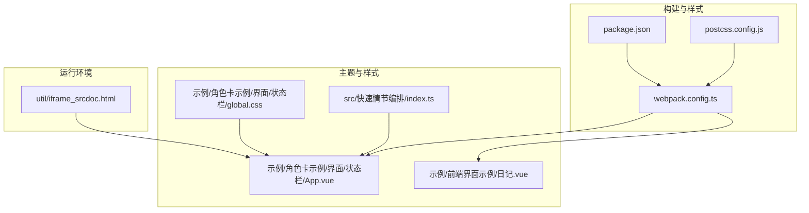
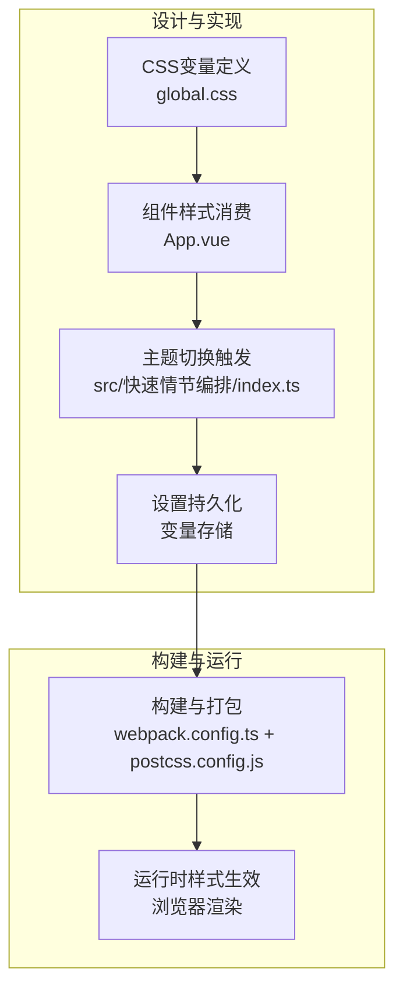
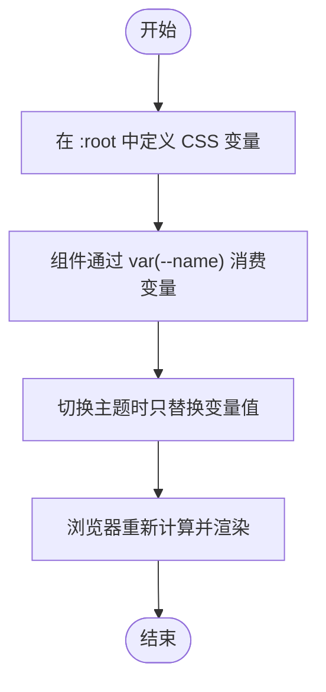
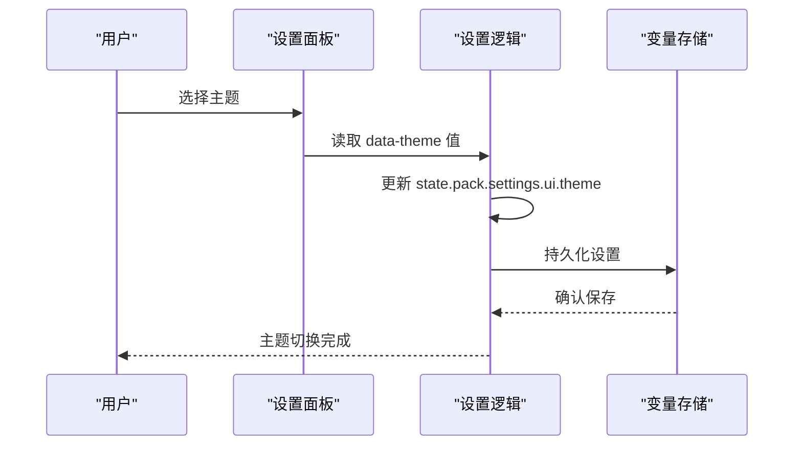
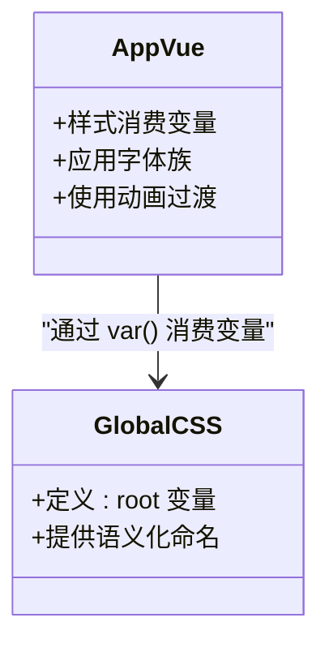
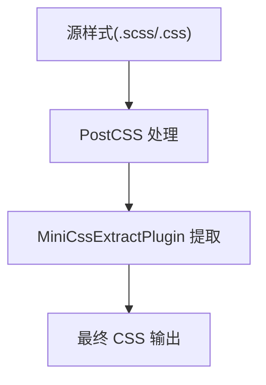
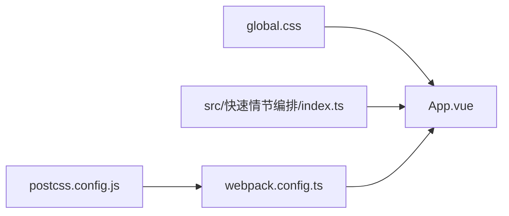

# 主题系统

<cite>
**本文引用的文件**
- [package.json](file://package.json)
- [postcss.config.js](file://postcss.config.js)
- [webpack.config.ts](file://webpack.config.ts)
- [src/快速情节编排/index.ts](file://src/快速情节编排/index.ts)
- [示例/角色卡示例/界面/状态栏/global.css](file://示例/角色卡示例/界面/状态栏/global.css)
- [示例/角色卡示例/界面/状态栏/App.vue](file://示例/角色卡示例/界面/状态栏/App.vue)
- [示例/角色卡示例/界面/状态栏/index.ts](file://示例/角色卡示例/界面/状态栏/index.ts)
- [示例/前端界面示例/日记.vue](file://示例/前端界面示例/日记.vue)
- [util/iframe_srcdoc.html](file://util/iframe_srcdoc.html)
</cite>

## 目录
1. [简介](#简介)
2. [项目结构](#项目结构)
3. [核心组件](#核心组件)
4. [架构总览](#架构总览)
5. [详细组件分析](#详细组件分析)
6. [依赖关系分析](#依赖关系分析)
7. [性能考虑](#性能考虑)
8. [故障排查指南](#故障排查指南)
9. [结论](#结论)
10. [附录](#附录)

## 简介
本文件围绕“主题系统”展开，目标是帮助开发者理解并扩展本项目的主题能力。通过对现有代码的分析，我们梳理了主题切换的实现原理、CSS变量的使用策略、主题样式的动态应用机制以及主题配置的持久化方案；并总结了内置主题的设计理念、主题样式的覆盖规则、主题切换的动画效果与兼容性处理。最后提供自定义主题的开发指南、调试方法与性能优化策略，并给出可定位到具体实现位置的代码路径示例。

## 项目结构
本项目采用模块化的前端工程组织方式，主题系统涉及的关键文件包括：
- 构建与样式管线：webpack.config.ts、postcss.config.js、package.json
- 主题变量与样式：示例/角色卡示例/界面/状态栏/global.css
- 主题切换与持久化：src/快速情节编排/index.ts
- Vue 组件与样式应用：示例/角色卡示例/界面/状态栏/App.vue、示例/前端界面示例/日记.vue
- 运行环境与资源：util/iframe_srcdoc.html

**图表来源**
- [package.json:1-120](file://package.json#L1-L120)
- [postcss.config.js:1-7](file://postcss.config.js#L1-L7)
- [webpack.config.ts:335-571](file://webpack.config.ts#L335-L571)
- [示例/角色卡示例/界面/状态栏/global.css:1-18](file://示例/角色卡示例/界面/状态栏/global.css#L1-L18)
- [示例/角色卡示例/界面/状态栏/App.vue:1-77](file://示例/角色卡示例/界面/状态栏/App.vue#L1-L77)
- [示例/前端界面示例/日记.vue:1-107](file://示例/前端界面示例/日记.vue#L1-L107)
- [src/快速情节编排/index.ts:975-1021](file://src/快速情节编排/index.ts#L975-L1021)
- [util/iframe_srcdoc.html:1-17](file://util/iframe_srcdoc.html#L1-L17)

**章节来源**
- [package.json:1-120](file://package.json#L1-L120)
- [postcss.config.js:1-7](file://postcss.config.js#L1-L7)
- [webpack.config.ts:335-571](file://webpack.config.ts#L335-L571)

## 核心组件
- 主题变量与样式层
  - 使用 CSS 自定义属性（CSS变量）统一管理配色与字体族，便于主题切换时集中替换。
  - 典型路径：[示例/角色卡示例/界面/状态栏/global.css:7-17](file://示例/角色卡示例/界面/状态栏/global.css#L7-L17)
- 主题切换与持久化层
  - 通过下拉选择器读取用户选择的主题值，并将其写入设置对象，随后持久化到变量存储中。
  - 典型路径：[src/快速情节编排/index.ts:975-1021](file://src/快速情节编排/index.ts#L975-L1021)
- 样式应用与组件层
  - Vue 组件通过 CSS 变量实现主题化，例如卡片背景、边框、阴影等均依赖变量。
  - 典型路径：[示例/角色卡示例/界面/状态栏/App.vue:35-77](file://示例/角色卡示例/界面/状态栏/App.vue#L35-L77)
- 构建与样式管线层
  - webpack 配置支持 SCSS/SASS、PostCSS、MiniCssExtractPlugin 等，确保主题样式被正确打包与提取。
  - 典型路径：[webpack.config.ts:352-406](file://webpack.config.ts#L352-L406)

**章节来源**
- [示例/角色卡示例/界面/状态栏/global.css:7-17](file://示例/角色卡示例/界面/状态栏/global.css#L7-L17)
- [src/快速情节编排/index.ts:975-1021](file://src/快速情节编排/index.ts#L975-L1021)
- [示例/角色卡示例/界面/状态栏/App.vue:35-77](file://示例/角色卡示例/界面/状态栏/App.vue#L35-L77)
- [webpack.config.ts:352-406](file://webpack.config.ts#L352-L406)

## 架构总览
主题系统由“变量定义—组件应用—切换持久化—构建打包”四层构成，形成从设计到运行的闭环。

**图表来源**
- [示例/角色卡示例/界面/状态栏/global.css:7-17](file://示例/角色卡示例/界面/状态栏/global.css#L7-L17)
- [示例/角色卡示例/界面/状态栏/App.vue:35-77](file://示例/角色卡示例/界面/状态栏/App.vue#L35-L77)
- [src/快速情节编排/index.ts:975-1021](file://src/快速情节编排/index.ts#L975-L1021)
- [webpack.config.ts:352-406](file://webpack.config.ts#L352-L406)
- [postcss.config.js:1-7](file://postcss.config.js#L1-L7)

## 详细组件分析

### 主题变量与样式层
- 设计理念
  - 将颜色、字体等视觉元素抽象为 CSS 变量，避免硬编码，提升主题一致性与可维护性。
  - 在 :root 中集中声明，组件通过 var(--name) 引用，实现跨组件共享。
- 实现要点
  - 变量命名规范：语义化前缀（如 --c- 表示色彩，--font- 表示字体），降低冲突概率。
  - 字体族统一：通过 --font-archive 定义，保证不同主题下的字体风格一致。
- 代码路径
  - [示例/角色卡示例/界面/状态栏/global.css:7-17](file://示例/角色卡示例/界面/状态栏/global.css#L7-L17)

**图表来源**
- [示例/角色卡示例/界面/状态栏/global.css:7-17](file://示例/角色卡示例/界面/状态栏/global.css#L7-L17)

**章节来源**
- [示例/角色卡示例/界面/状态栏/global.css:7-17](file://示例/角色卡示例/界面/状态栏/global.css#L7-L17)

### 主题切换与持久化层
- 切换流程
  - 用户在设置面板选择主题，读取下拉值并写入设置对象。
  - 通过变量存储机制持久化设置，确保刷新后仍保持所选主题。
- 关键实现点
  - 下拉选择器绑定 data-theme 属性，用于读取当前主题值。
  - 设置对象中 ui.theme 字段保存主题标识，作为后续样式应用依据。
- 代码路径
  - [src/快速情节编排/index.ts:975-1021](file://src/快速情节编排/index.ts#L975-L1021)

**图表来源**
- [src/快速情节编排/index.ts:975-1021](file://src/快速情节编排/index.ts#L975-L1021)

**章节来源**
- [src/快速情节编排/index.ts:975-1021](file://src/快速情节编排/index.ts#L975-L1021)

### 样式应用与组件层
- 组件消费变量
  - App.vue 中通过 var(--c-mint-cream)、var(--c-granite) 等变量控制背景、边框与阴影，确保主题切换后组件外观随之变化。
  - 字体族通过 --font-archive 应用，保证不同主题下的阅读体验一致。
- 动画与过渡
  - 组件内使用淡入动画（fadeEffect）增强切换的顺滑感，提升交互体验。
- 代码路径
  - [示例/角色卡示例/界面/状态栏/App.vue:35-77](file://示例/角色卡示例/界面/状态栏/App.vue#L35-L77)

**图表来源**
- [示例/角色卡示例/界面/状态栏/App.vue:35-77](file://示例/角色卡示例/界面/状态栏/App.vue#L35-L77)
- [示例/角色卡示例/界面/状态栏/global.css:7-17](file://示例/角色卡示例/界面/状态栏/global.css#L7-L17)

**章节来源**
- [示例/角色卡示例/界面/状态栏/App.vue:35-77](file://示例/角色卡示例/界面/状态栏/App.vue#L35-L77)
- [示例/角色卡示例/界面/状态栏/global.css:7-17](file://示例/角色卡示例/界面/状态栏/global.css#L7-L17)

### 构建与样式管线层
- 打包与提取
  - webpack 配置支持 .scss/.sass 与 .css 文件，结合 MiniCssExtractPlugin 在生产模式下提取 CSS，减少运行时开销。
- PostCSS 插件链
  - autoprefixer、@tailwindcss/postcss、postcss-minify 提升兼容性与压缩效率。
- 代码路径
  - [webpack.config.ts:352-406](file://webpack.config.ts#L352-L406)
  - [postcss.config.js:1-7](file://postcss.config.js#L1-L7)

**图表来源**
- [webpack.config.ts:352-406](file://webpack.config.ts#L352-L406)
- [postcss.config.js:1-7](file://postcss.config.js#L1-L7)

**章节来源**
- [webpack.config.ts:352-406](file://webpack.config.ts#L352-L406)
- [postcss.config.js:1-7](file://postcss.config.js#L1-L7)

### 内置主题与覆盖规则
- 内置主题
  - 通过下拉选择器提供多个主题选项，切换时仅改变主题标识，不改动组件结构。
  - 典型路径：[src/快速情节编排/index.ts:975-982](file://src/快速情节编排/index.ts#L975-L982)
- 覆盖规则
  - 组件优先使用 CSS 变量；若需局部覆盖，可在组件样式中以更具体的选择器进行补充，但建议尽量通过变量统一管理。
  - 对于响应式与媒体查询，遵循组件内部断点，避免全局污染。

**章节来源**
- [src/快速情节编排/index.ts:975-982](file://src/快速情节编排/index.ts#L975-L982)

### 主题切换动画与兼容性
- 动画效果
  - 组件内使用淡入动画（fadeEffect）提升切换体验，过渡时间为 0.4 秒。
  - 典型路径：[示例/角色卡示例/界面/状态栏/App.vue:65-75](file://示例/角色卡示例/界面/状态栏/App.vue#L65-L75)
- 兼容性处理
  - PostCSS autoprefixer 自动添加厂商前缀，提升旧版浏览器兼容性。
  - 典型路径：[postcss.config.js:1-7](file://postcss.config.js#L1-L7)

**章节来源**
- [示例/角色卡示例/界面/状态栏/App.vue:65-75](file://示例/角色卡示例/界面/状态栏/App.vue#L65-L75)
- [postcss.config.js:1-7](file://postcss.config.js#L1-L7)

### 自定义主题开发指南
- 步骤
  1) 在全局样式中新增一组 CSS 变量，命名语义化且不与现有变量冲突。
     - 参考路径：[示例/角色卡示例/界面/状态栏/global.css:7-17](file://示例/角色卡示例/界面/状态栏/global.css#L7-L17)
  2) 在组件中通过 var(--name) 消费变量，确保背景、边框、阴影、字体等均来自变量。
     - 参考路径：[示例/角色卡示例/界面/状态栏/App.vue:35-49](file://示例/角色卡示例/界面/状态栏/App.vue#L35-L49)
  3) 在设置面板的下拉选择器中增加新主题选项，并确保写入 ui.theme。
     - 参考路径：[src/快速情节编排/index.ts:975-982](file://src/快速情节编排/index.ts#L975-L982)
  4) 通过变量存储机制持久化设置，保证刷新后主题不变。
     - 参考路径：[src/快速情节编排/index.ts:1018](file://src/快速情节编排/index.ts#L1018)
  5) 使用构建工具验证样式是否正确打包与提取。
     - 参考路径：[webpack.config.ts:352-406](file://webpack.config.ts#L352-L406)

**章节来源**
- [示例/角色卡示例/界面/状态栏/global.css:7-17](file://示例/角色卡示例/界面/状态栏/global.css#L7-L17)
- [示例/角色卡示例/界面/状态栏/App.vue:35-49](file://示例/角色卡示例/界面/状态栏/App.vue#L35-L49)
- [src/快速情节编排/index.ts:975-982](file://src/快速情节编排/index.ts#L975-L982)
- [src/快速情节编排/index.ts:1018](file://src/快速情节编排/index.ts#L1018)
- [webpack.config.ts:352-406](file://webpack.config.ts#L352-L406)

### 主题样式调试方法
- 变量级调试
  - 在浏览器开发者工具中检查 :root 的变量值是否随主题切换更新。
  - 参考路径：[示例/角色卡示例/界面/状态栏/global.css:7-17](file://示例/角色卡示例/界面/状态栏/global.css#L7-L17)
- 组件级调试
  - 检查组件样式是否正确消费变量，关注背景、边框、阴影等关键属性。
  - 参考路径：[示例/角色卡示例/界面/状态栏/App.vue:35-49](file://示例/角色卡示例/界面/状态栏/App.vue#L35-L49)
- 动画调试
  - 使用浏览器性能面板观察切换动画的帧率与耗时。
  - 参考路径：[示例/角色卡示例/界面/状态栏/App.vue:65-75](file://示例/角色卡示例/界面/状态栏/App.vue#L65-L75)
- 构建调试
  - 确认生产构建已启用 MiniCssExtractPlugin 并生成压缩后的 CSS。
  - 参考路径：[webpack.config.ts:390-406](file://webpack.config.ts#L390-L406)

**章节来源**
- [示例/角色卡示例/界面/状态栏/global.css:7-17](file://示例/角色卡示例/界面/状态栏/global.css#L7-L17)
- [示例/角色卡示例/界面/状态栏/App.vue:35-49](file://示例/角色卡示例/界面/状态栏/App.vue#L35-L49)
- [示例/角色卡示例/界面/状态栏/App.vue:65-75](file://示例/角色卡示例/界面/状态栏/App.vue#L65-L75)
- [webpack.config.ts:390-406](file://webpack.config.ts#L390-L406)

### 主题性能优化策略
- 减少重绘与回流
  - 优先使用 transform 与 opacity 等 GPU 友好的属性，避免频繁修改布局相关属性。
  - 参考路径：[示例/前端界面示例/日记.vue:69-98](file://示例/前端界面示例/日记.vue#L69-L98)
- 控制动画复杂度
  - 保持动画时长适中（如 0.3~0.4s），避免过多层级阴影与模糊叠加。
  - 参考路径：[示例/角色卡示例/界面/状态栏/App.vue:65-75](file://示例/角色卡示例/界面/状态栏/App.vue#L65-L75)
- 样式体积优化
  - 使用 PostCSS 压缩与 Tree Shaking，移除未使用的样式。
  - 参考路径：[postcss.config.js:1-7](file://postcss.config.js#L1-L7)
- 构建优化
  - 生产模式下启用 MiniCssExtractPlugin，拆分与缓存 CSS，减少首屏渲染时间。
  - 参考路径：[webpack.config.ts:390-406](file://webpack.config.ts#L390-L406)

**章节来源**
- [示例/前端界面示例/日记.vue:69-98](file://示例/前端界面示例/日记.vue#L69-L98)
- [示例/角色卡示例/界面/状态栏/App.vue:65-75](file://示例/角色卡示例/界面/状态栏/App.vue#L65-L75)
- [postcss.config.js:1-7](file://postcss.config.js#L1-L7)
- [webpack.config.ts:390-406](file://webpack.config.ts#L390-L406)

## 依赖关系分析
- 主题变量依赖
  - 组件样式依赖 global.css 中的 :root 变量，变量变更直接影响组件渲染。
- 切换逻辑依赖
  - 设置面板的下拉选择器与 ui.theme 字段共同决定主题状态，持久化依赖变量存储。
- 构建依赖
  - webpack 与 PostCSS 插件链负责样式转换与提取，影响最终运行时表现。

**图表来源**
- [示例/角色卡示例/界面/状态栏/global.css:7-17](file://示例/角色卡示例/界面/状态栏/global.css#L7-L17)
- [示例/角色卡示例/界面/状态栏/App.vue:35-77](file://示例/角色卡示例/界面/状态栏/App.vue#L35-L77)
- [src/快速情节编排/index.ts:975-1021](file://src/快速情节编排/index.ts#L975-L1021)
- [webpack.config.ts:352-406](file://webpack.config.ts#L352-L406)
- [postcss.config.js:1-7](file://postcss.config.js#L1-L7)

**章节来源**
- [示例/角色卡示例/界面/状态栏/global.css:7-17](file://示例/角色卡示例/界面/状态栏/global.css#L7-L17)
- [示例/角色卡示例/界面/状态栏/App.vue:35-77](file://示例/角色卡示例/界面/状态栏/App.vue#L35-L77)
- [src/快速情节编排/index.ts:975-1021](file://src/快速情节编排/index.ts#L975-L1021)
- [webpack.config.ts:352-406](file://webpack.config.ts#L352-L406)
- [postcss.config.js:1-7](file://postcss.config.js#L1-L7)

## 性能考虑
- 变量驱动的样式切换具备零 DOM 结构变更的优势，渲染成本低。
- 动画时长与复杂度应适度，避免在低端设备上造成掉帧。
- 构建阶段的压缩与提取能显著降低运行时内存占用与网络传输开销。

## 故障排查指南
- 主题切换无效
  - 检查 ui.theme 是否被正确写入与持久化。
  - 参考路径：[src/快速情节编排/index.ts:1018](file://src/快速情节编排/index.ts#L1018)
- 样式未生效
  - 确认组件是否通过 var(--name) 消费变量，而非硬编码颜色。
  - 参考路径：[示例/角色卡示例/界面/状态栏/App.vue:35-49](file://示例/角色卡示例/界面/状态栏/App.vue#L35-L49)
- 构建后样式缺失
  - 检查 webpack 配置中 MiniCssExtractPlugin 是否启用，PostCSS 插件链是否正确。
  - 参考路径：[webpack.config.ts:390-406](file://webpack.config.ts#L390-L406), [postcss.config.js:1-7](file://postcss.config.js#L1-L7)

**章节来源**
- [src/快速情节编排/index.ts:1018](file://src/快速情节编排/index.ts#L1018)
- [示例/角色卡示例/界面/状态栏/App.vue:35-49](file://示例/角色卡示例/界面/状态栏/App.vue#L35-L49)
- [webpack.config.ts:390-406](file://webpack.config.ts#L390-L406)
- [postcss.config.js:1-7](file://postcss.config.js#L1-L7)

## 结论
本主题系统以 CSS 变量为核心，结合 Vue 组件的变量消费、设置面板的主题切换与持久化、以及构建管线的样式处理，形成了简洁高效的动态主题机制。通过语义化变量命名、合理的动画与兼容性策略，以及构建期的优化，能够在保证良好用户体验的同时，兼顾可维护性与性能。

## 附录
- 运行环境与资源
  - iframe 源文档引入了必要的样式与脚本，确保在嵌套环境中也能正确渲染。
  - 参考路径：[util/iframe_srcdoc.html:1-17](file://util/iframe_srcdoc.html#L1-L17)

**章节来源**
- [util/iframe_srcdoc.html:1-17](file://util/iframe_srcdoc.html#L1-L17)