# 分类管理系统

<cite>
**本文档引用的文件**
- [src/快速情节编排/index.ts](file://src/快速情节编排/index.ts)
</cite>

## 目录
1. [简介](#简介)
2. [项目结构](#项目结构)
3. [核心组件](#核心组件)
4. [架构概览](#架构概览)
5. [详细组件分析](#详细组件分析)
6. [依赖关系分析](#依赖关系分析)
7. [性能考虑](#性能考虑)
8. [故障排除指南](#故障排除指南)
9. [结论](#结论)

## 简介

分类管理系统是一个基于浏览器的快速情节编排工具，提供了完整的分类树形结构管理功能。该系统允许用户创建、组织、管理和操作分类及其子项，支持拖拽排序、搜索过滤、收藏功能和多种执行模式。

系统采用MVU（Model-View-Update）架构模式，通过状态管理实现数据驱动的UI更新。核心功能包括：
- 分类树形结构设计与层级管理
- 分类父子关系维护策略
- 分类展开折叠功能
- 分类创建、删除、重命名操作
- 拖拽排序和移动功能
- 搜索过滤机制
- 用户体验优化策略

## 项目结构

该项目采用模块化设计，主要代码集中在单个TypeScript文件中，实现了完整的分类管理功能。

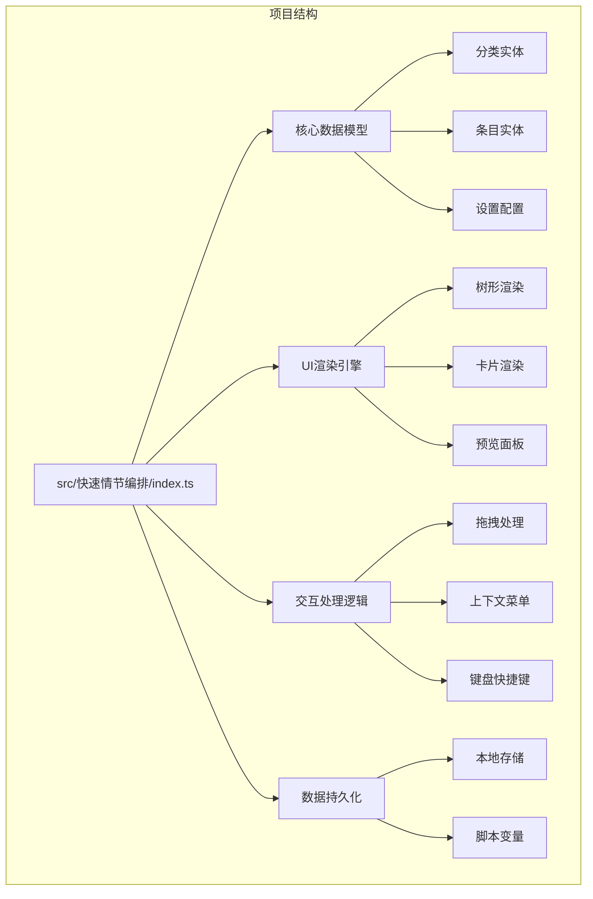

**图表来源**
- [src/快速情节编排/index.ts:1-800](file://src/快速情节编排/index.ts#L1-L800)

**章节来源**
- [src/快速情节编排/index.ts:1-800](file://src/快速情节编排/index.ts#L1-L800)

## 核心组件

### 数据模型架构

系统采用清晰的数据模型设计，所有核心数据结构都通过TypeScript接口定义：

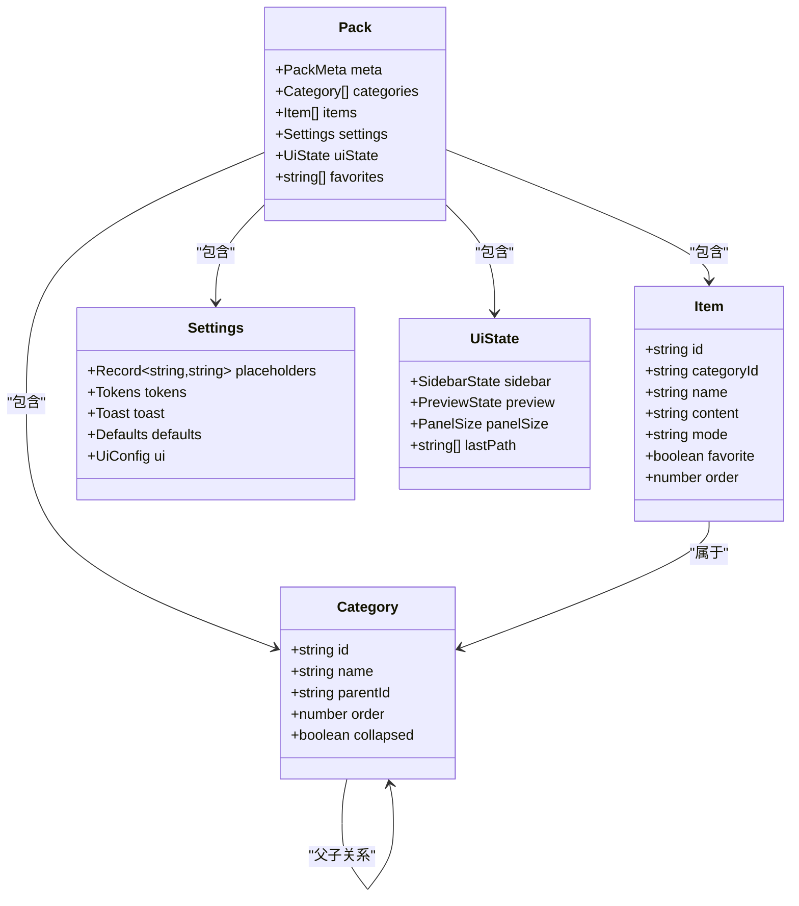

**图表来源**
- [src/快速情节编排/index.ts:12-60](file://src/快速情节编排/index.ts#L12-L60)

### 状态管理机制

系统使用集中式状态管理模式，通过AppState接口统一管理所有运行时状态：

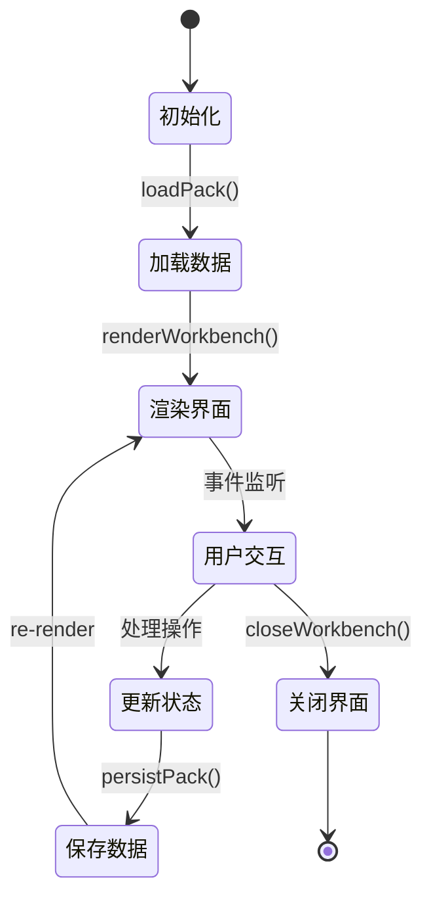

**图表来源**
- [src/快速情节编排/index.ts:101-111](file://src/快速情节编排/index.ts#L101-L111)

**章节来源**
- [src/快速情节编排/index.ts:12-111](file://src/快速情节编排/index.ts#L12-L111)

## 架构概览

系统采用MVU（Model-View-Update）架构模式，实现了数据驱动的用户界面：

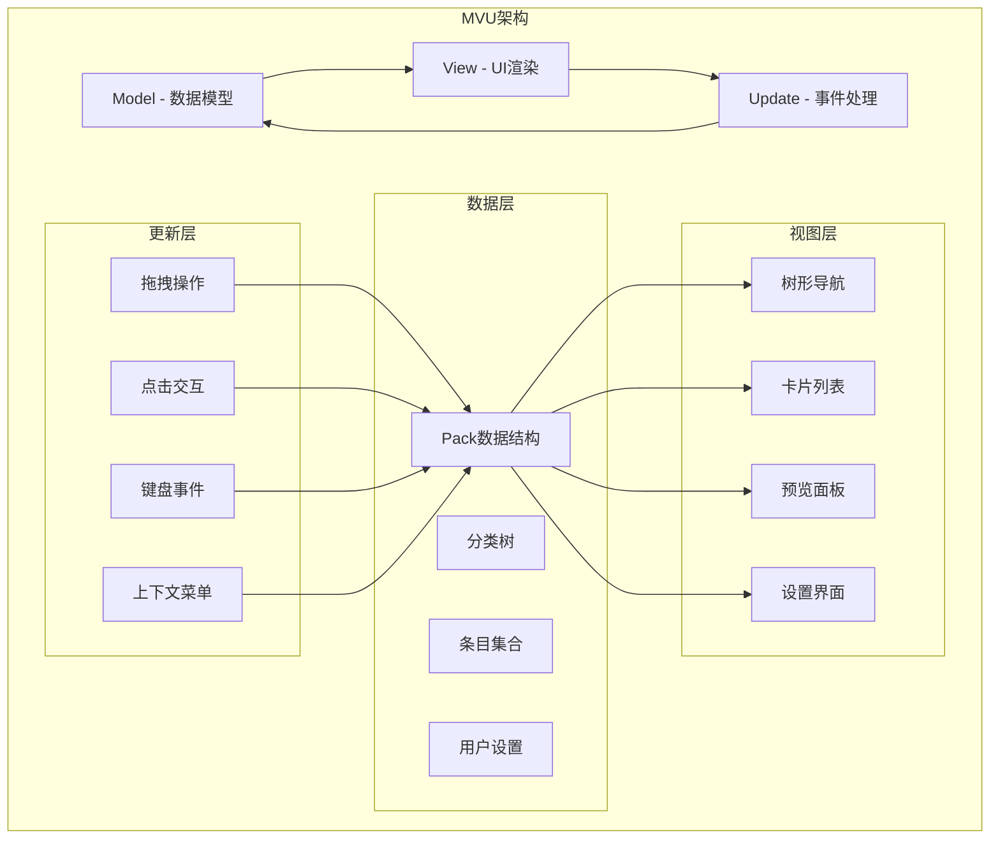

**图表来源**
- [src/快速情节编排/index.ts:1901-2176](file://src/快速情节编排/index.ts#L1901-L2176)

系统的核心优势在于其响应式设计和实时数据同步机制，确保用户操作能够立即反映到UI上。

**章节来源**
- [src/快速情节编排/index.ts:1901-2176](file://src/快速情节编排/index.ts#L1901-L2176)

## 详细组件分析

### 分类树形结构设计

分类系统采用标准的树形数据结构，每个分类节点包含必要的元数据来支持完整的树形操作：

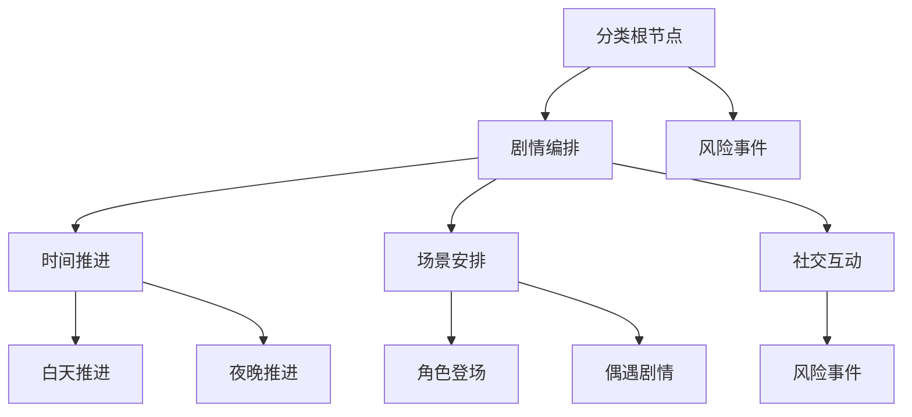

**图表来源**
- [src/快速情节编排/index.ts:315-322](file://src/快速情节编排/index.ts#L315-L322)

#### 分类层级管理机制

系统通过以下机制管理分类层级：

1. **父节点引用**: 每个分类维护`parentId`字段指向其父节点
2. **顺序控制**: 使用`order`字段维护同级分类的排序
3. **展开状态**: `collapsed`字段控制节点的展开/折叠状态
4. **路径追踪**: `lastPath`记录用户的浏览历史

**章节来源**
- [src/快速情节编排/index.ts:20-36](file://src/快速情节编排/index.ts#L20-L36)
- [src/快速情节编排/index.ts:315-322](file://src/快速情节编排/index.ts#L315-L322)

### 父子关系维护策略

系统实现了严格的父子关系验证机制，防止循环引用和数据不一致：

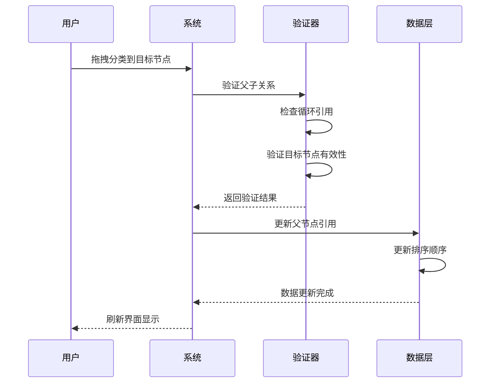

**图表来源**
- [src/快速情节编排/index.ts:762-776](file://src/快速情节编排/index.ts#L762-L776)

#### 关键验证逻辑

系统在移动分类时执行以下验证步骤：

1. **参数验证**: 检查拖拽ID和目标ID的有效性
2. **循环检测**: 验证目标节点不能是拖拽节点的后代
3. **类型检查**: 确保目标节点存在且有效
4. **顺序更新**: 自动调整新位置的排序值

**章节来源**
- [src/快速情节编排/index.ts:762-776](file://src/快速情节编排/index.ts#L762-L776)

### 分类展开折叠功能

系统提供了直观的展开/折叠控制机制：

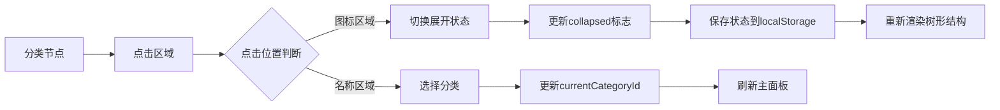

**图表来源**
- [src/快速情节编排/index.ts:829-839](file://src/快速情节编排/index.ts#L829-L839)

**章节来源**
- [src/快速情节编排/index.ts:829-839](file://src/快速情节编排/index.ts#L829-L839)

### 分类操作API

系统提供了完整的分类管理API：

#### 创建分类
```typescript
// 创建新分类的函数调用路径
openWorkbench() --> top.querySelector('[data-new-cat]') --> 新分类对话框 --> persistPack()
```

#### 删除分类
```typescript
// 删除分类的函数调用路径
openContextMenu() --> 删除选项 --> confirm() --> 过滤分类数组 --> persistPack()
```

#### 重命名分类
```typescript
// 重命名分类的函数调用路径
renderTree() --> 分类节点 --> edit分类对话框 --> 更新name字段 --> persistPack()
```

**章节来源**
- [src/快速情节编排/index.ts:2069-2086](file://src/快速情节编排/index.ts#L2069-L2086)
- [src/快速情节编排/index.ts:1717-1789](file://src/快速情节编排/index.ts#L1717-L1789)

### 拖拽排序实现

系统实现了完整的拖拽排序功能，支持分类间和条目间的拖拽操作：

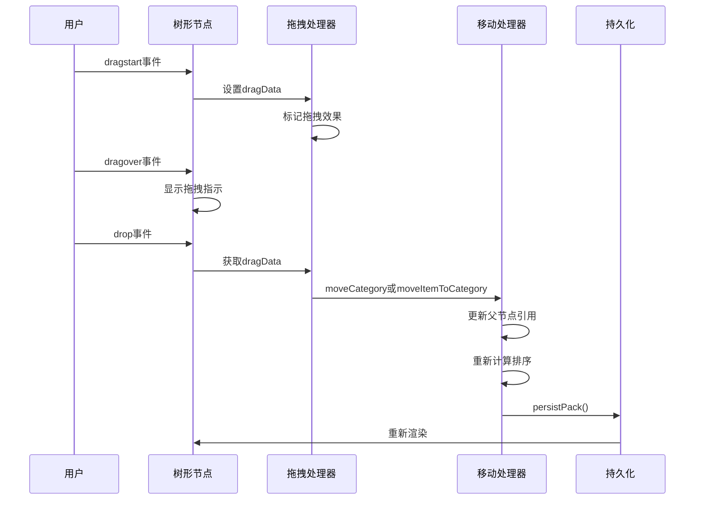

**图表来源**
- [src/快速情节编排/index.ts:841-865](file://src/快速情节编排/index.ts#L841-L865)

**章节来源**
- [src/快速情节编排/index.ts:841-865](file://src/快速情节编排/index.ts#L841-L865)

### 分类渲染算法

系统采用了高效的树形渲染算法，支持动态过滤和搜索：

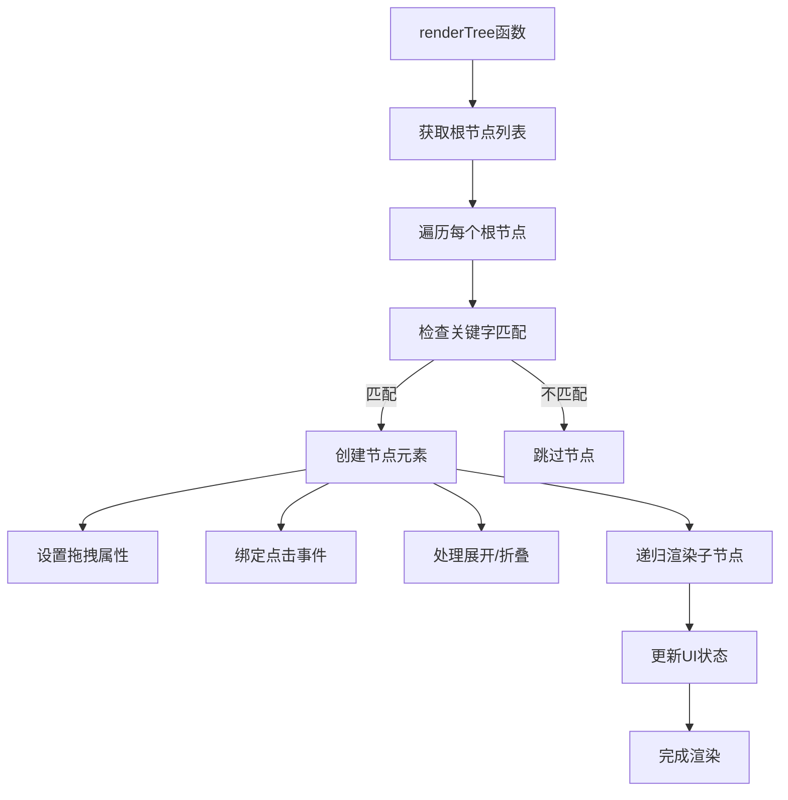

**图表来源**
- [src/快速情节编排/index.ts:787-874](file://src/快速情节编排/index.ts#L787-L874)

**章节来源**
- [src/快速情节编排/index.ts:787-874](file://src/快速情节编排/index.ts#L787-L874)

### 搜索过滤机制

系统实现了多层次的搜索过滤功能：

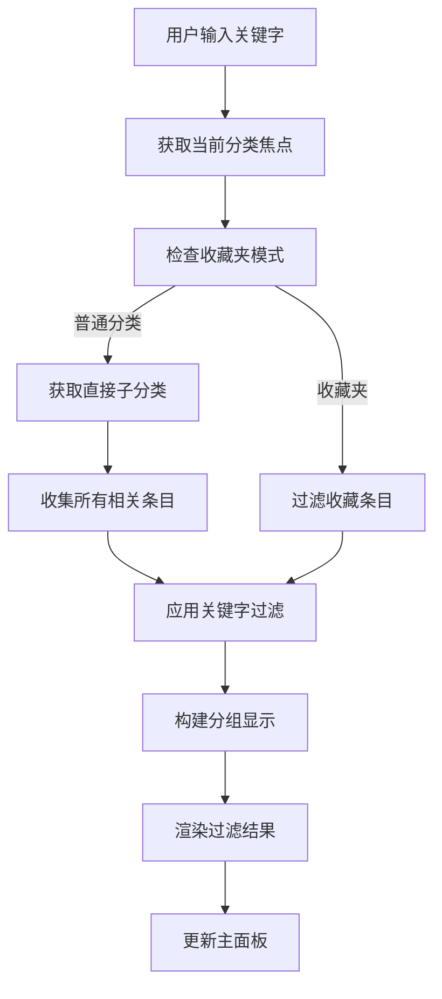

**图表来源**
- [src/快速情节编排/index.ts:876-922](file://src/快速情节编排/index.ts#L876-L922)

**章节来源**
- [src/快速情节编排/index.ts:876-922](file://src/快速情节编排/index.ts#L876-L922)

### 用户体验优化策略

系统在多个方面优化了用户体验：

#### 响应式设计
- 自适应布局，支持移动端和桌面端
- 动态调整面板大小和布局
- 触摸设备的特殊交互处理

#### 性能优化
- 虚拟滚动和延迟渲染
- 防抖处理用户输入
- 内存泄漏防护

#### 可访问性
- 键盘导航支持
- 屏幕阅读器兼容
- 高对比度主题

**章节来源**
- [src/快速情节编排/index.ts:1901-2098](file://src/快速情节编排/index.ts#L1901-L2098)

## 依赖关系分析

系统采用松耦合的设计，各组件之间的依赖关系清晰明确：

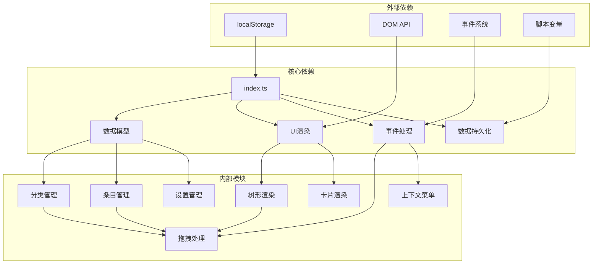

**图表来源**
- [src/快速情节编排/index.ts:183-218](file://src/快速情节编排/index.ts#L183-L218)

系统的主要依赖包括：
- **localStorage**: 本地数据存储
- **DOM API**: 用户界面渲染
- **事件系统**: 用户交互处理
- **脚本变量**: 集成到宿主环境

**章节来源**
- [src/快速情节编排/index.ts:183-218](file://src/快速情节编排/index.ts#L183-L218)

## 性能考虑

系统在设计时充分考虑了性能优化：

### 时间复杂度分析
- **树形渲染**: O(n)，其中n为分类数量
- **搜索过滤**: O(n*m)，其中m为匹配项数量
- **拖拽排序**: O(k)，其中k为受影响的节点数
- **状态更新**: O(1)，常数时间操作

### 内存管理
- 使用弱引用避免内存泄漏
- 及时清理事件监听器
- 控制DOM节点数量

### 缓存策略
- 分类树结构缓存
- 渲染结果缓存
- 用户偏好设置缓存

## 故障排除指南

### 常见问题及解决方案

#### 分类无法拖拽
1. 检查浏览器是否支持HTML5拖拽API
2. 确认目标节点不是拖拽节点的后代
3. 验证分类ID的有效性

#### 搜索功能异常
1. 检查关键字输入格式
2. 确认分类名称和内容的编码
3. 验证搜索索引的完整性

#### 数据丢失问题
1. 检查localStorage的可用性
2. 验证数据序列化/反序列化过程
3. 确认持久化时机的正确性

#### 性能问题
1. 减少一次性渲染的节点数量
2. 实施虚拟滚动技术
3. 优化重绘和回流操作

**章节来源**
- [src/快速情节编排/index.ts:198-218](file://src/快速情节编排/index.ts#L198-L218)

## 结论

分类管理系统展现了优秀的软件工程实践，通过清晰的架构设计、完善的API实现和丰富的用户体验优化，成功构建了一个功能完整、性能优异的分类管理工具。

### 主要成就
- **完整的树形结构支持**: 提供了从基础数据结构到复杂交互的全方位实现
- **灵活的分类管理**: 支持创建、删除、重命名、拖拽排序等多种操作
- **智能的搜索过滤**: 实现了多层次的搜索和过滤机制
- **优秀的用户体验**: 通过响应式设计和性能优化提升了用户满意度

### 技术亮点
- **MVU架构模式**: 实现了数据驱动的UI更新机制
- **严格的类型安全**: 通过TypeScript确保代码质量
- **模块化设计**: 代码结构清晰，易于维护和扩展
- **跨平台兼容**: 支持多种浏览器和设备

该系统为类似的应用程序提供了优秀的参考实现，展示了如何在浏览器环境中构建复杂的分类管理功能。