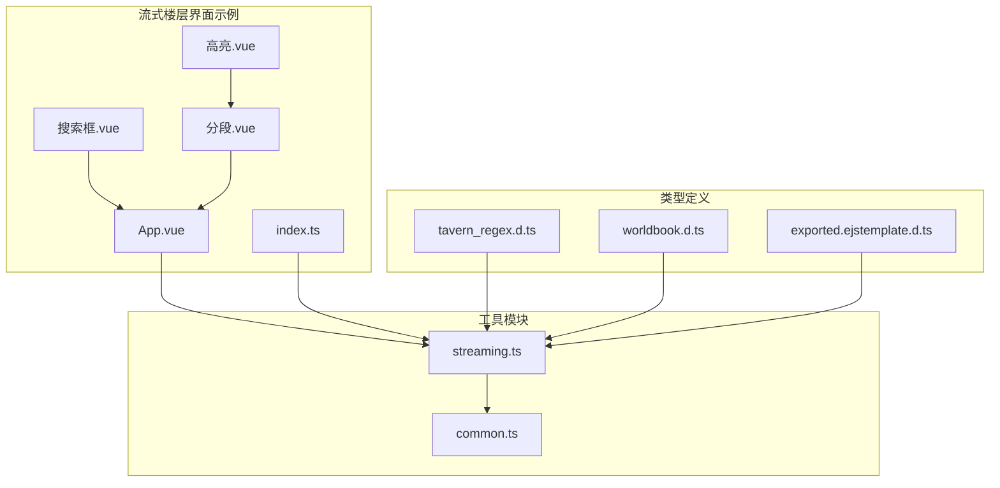
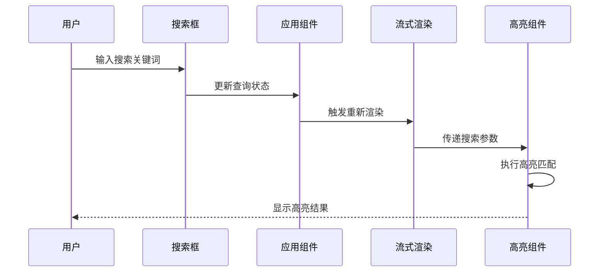
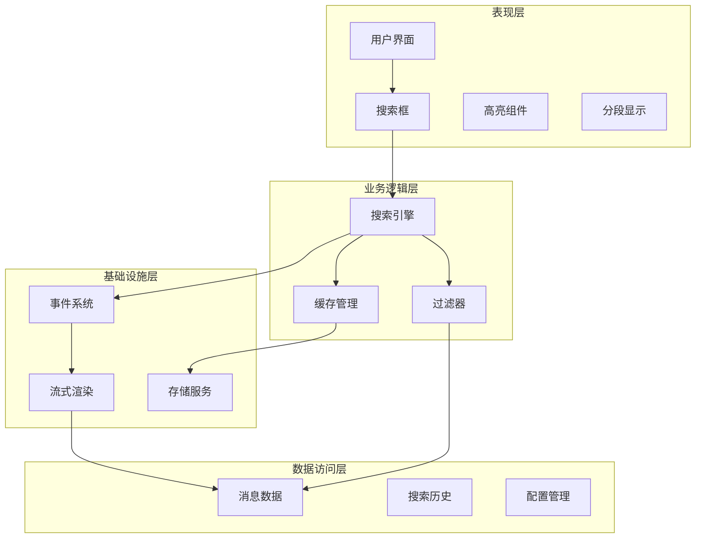
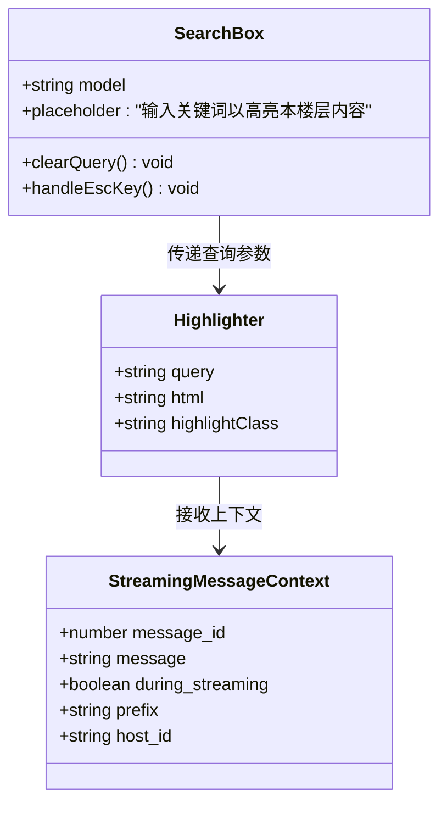
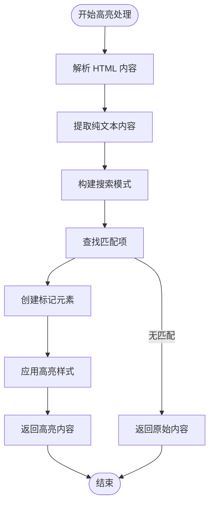
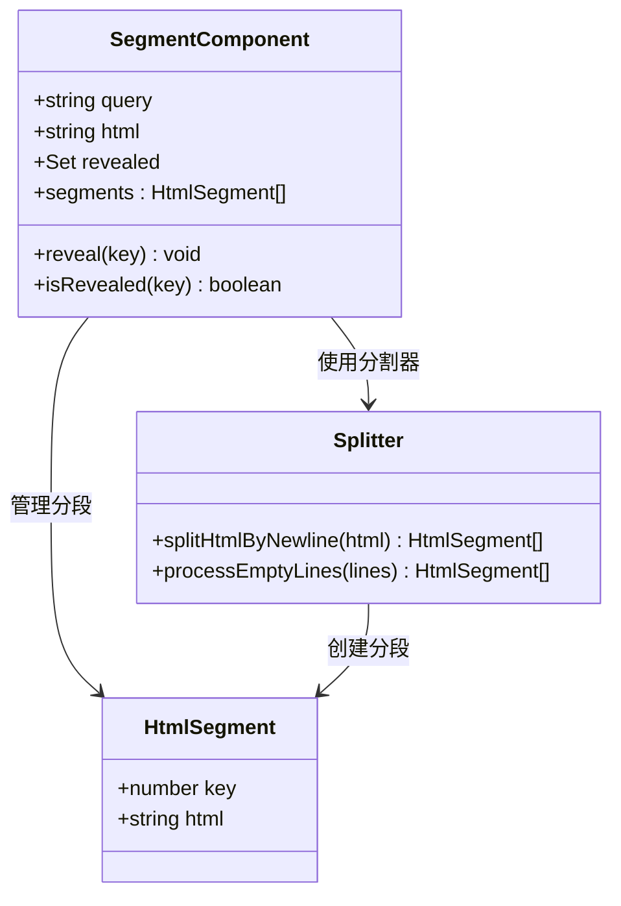
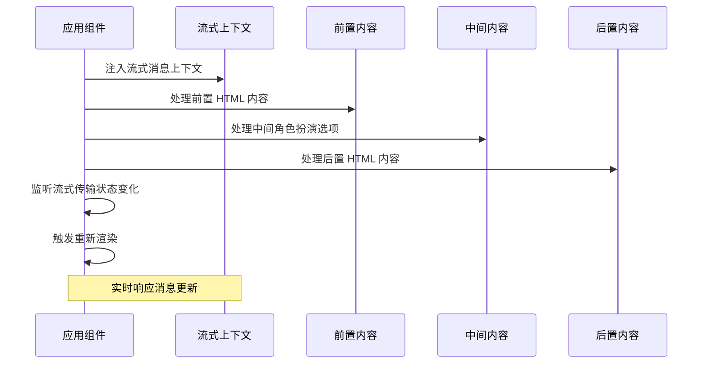
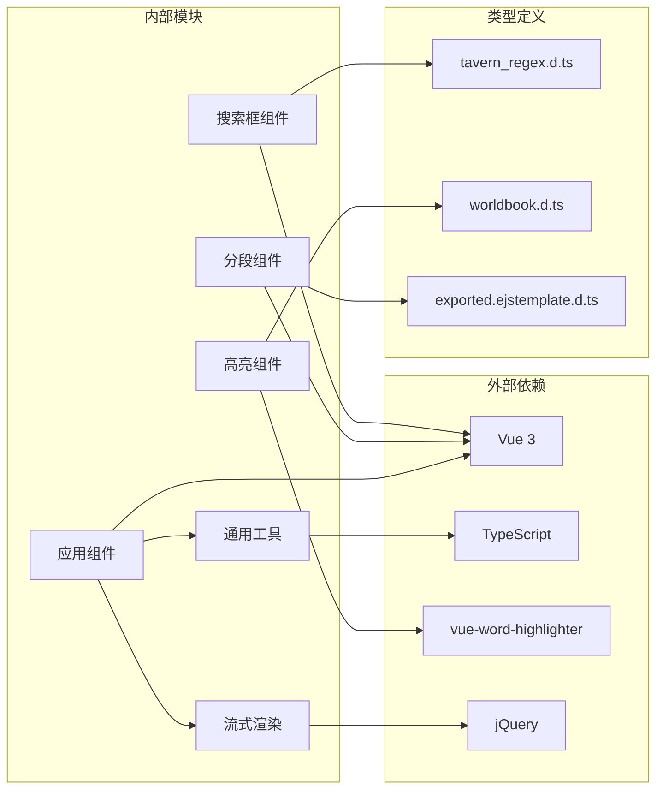
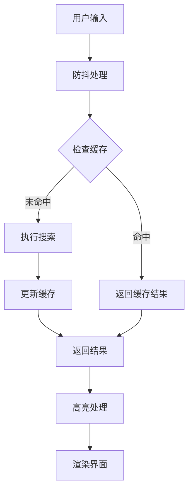

# 实时搜索功能

<cite>
**本文档引用的文件**
- [搜索框.vue](file://示例/流式楼层界面示例/搜索框.vue)
- [高亮.vue](file://示例/流式楼层界面示例/高亮.vue)
- [分段.vue](file://示例/流式楼层界面示例/分段.vue)
- [App.vue](file://示例/流式楼层界面示例/App.vue)
- [index.ts](file://示例/流式楼层界面示例/index.ts)
- [streaming.ts](file://util/streaming.ts)
- [common.ts](file://util/common.ts)
- [tavern_regex.d.ts](file://@types/function/tavern_regex.d.ts)
- [worldbook.d.ts](file://@types/function/worldbook.d.ts)
- [exported.ejstemplate.d.ts](file://@types/iframe/exported.ejstemplate.d.ts)
- [监听消息修改.ts](file://示例/脚本示例/监听消息修改.ts)
- [设置界面.ts](file://示例/脚本示例/设置界面.ts)
- [设置界面.vue](file://示例/脚本示例/设置界面.vue)
</cite>

## 目录
1. [简介](#简介)
2. [项目结构](#项目结构)
3. [核心组件](#核心组件)
4. [架构概览](#架构概览)
5. [详细组件分析](#详细组件分析)
6. [依赖关系分析](#依赖关系分析)
7. [性能考虑](#性能考虑)
8. [故障排除指南](#故障排除指南)
9. [结论](#结论)
10. [附录](#附录)

## 简介

本文档详细介绍了基于 Vue 3 和 TypeScript 的实时搜索功能实现。该功能允许用户在聊天消息的流式渲染界面中进行关键词搜索，并提供实时高亮显示、分段显示和智能缓存机制。

该搜索系统的核心特性包括：
- 实时搜索和高亮显示
- 流式消息的动态更新
- 大小写不敏感的匹配规则
- 搜索历史记录管理
- 智能缓存机制
- 搜索范围控制逻辑

## 项目结构

实时搜索功能主要分布在以下目录结构中：

**图表来源**
- [搜索框.vue:1-95](file://示例/流式楼层界面示例/搜索框.vue#L1-L95)
- [App.vue:1-72](file://示例/流式楼层界面示例/App.vue#L1-L72)
- [streaming.ts:1-238](file://util/streaming.ts#L1-L238)

**章节来源**
- [搜索框.vue:1-95](file://示例/流式楼层界面示例/搜索框.vue#L1-L95)
- [App.vue:1-72](file://示例/流式楼层界面示例/App.vue#L1-L72)
- [streaming.ts:1-238](file://util/streaming.ts#L1-L238)

## 核心组件

### 搜索界面组件

搜索功能由多个相互协作的 Vue 组件构成：

1. **搜索框组件**：提供用户输入界面和搜索控制
2. **高亮组件**：负责关键词的高亮显示
3. **分段组件**：处理多行文本的分段显示
4. **应用组件**：协调整个搜索流程

### 实时更新机制

系统通过流式消息渲染机制实现实时搜索更新：

**图表来源**
- [搜索框.vue:18-24](file://示例/流式楼层界面示例/搜索框.vue#L18-L24)
- [App.vue:25-26](file://示例/流式楼层界面示例/App.vue#L25-L26)
- [高亮.vue:1-11](file://示例/流式楼层界面示例/高亮.vue#L1-L11)

**章节来源**
- [搜索框.vue:18-24](file://示例/流式楼层界面示例/搜索框.vue#L18-L24)
- [App.vue:25-26](file://示例/流式楼层界面示例/App.vue#L25-L26)
- [高亮.vue:1-11](file://示例/流式楼层界面示例/高亮.vue#L1-L11)

## 架构概览

实时搜索系统的整体架构采用分层设计：

**图表来源**
- [streaming.ts:41-238](file://util/streaming.ts#L41-L238)
- [App.vue:16-21](file://示例/流式楼层界面示例/App.vue#L16-L21)

## 详细组件分析

### 搜索框组件分析

搜索框组件提供了直观的用户交互界面：

**图表来源**
- [搜索框.vue:18-24](file://示例/流式楼层界面示例/搜索框.vue#L18-L24)
- [高亮.vue:7-11](file://示例/流式楼层界面示例/高亮.vue#L7-L11)
- [streaming.ts:8-19](file://util/streaming.ts#L8-L19)

#### 关键实现特性

1. **双向数据绑定**：使用 `v-model` 实现搜索词的实时同步
2. **键盘快捷键支持**：ESC 键快速清除搜索
3. **响应式样式**：焦点状态下的视觉反馈
4. **无障碍设计**：aria 属性确保可访问性

**章节来源**
- [搜索框.vue:1-95](file://示例/流式楼层界面示例/搜索框.vue#L1-L95)

### 高亮显示组件分析

高亮组件负责将匹配的关键词在 HTML 内容中进行视觉标记：

**图表来源**
- [高亮.vue:1-11](file://示例/流式楼层界面示例/高亮.vue#L1-L11)
- [分段.vue:32-44](file://示例/流式楼层界面示例/分段.vue#L32-L44)

#### 高亮算法实现

高亮组件使用 `vue-word-highlighter` 库实现高效的关键词匹配：

1. **大小写不敏感匹配**：自动转换为不区分大小写的搜索模式
2. **HTML 安全处理**：确保高亮不会破坏 HTML 结构
3. **性能优化**：批量处理多个匹配项
4. **样式隔离**：使用独立的 CSS 类避免样式冲突

**章节来源**
- [高亮.vue:1-20](file://示例/流式楼层界面示例/高亮.vue#L1-L20)

### 分段显示组件分析

分段组件处理多行文本的智能分段和延迟加载：

**图表来源**
- [分段.vue:18-44](file://示例/流式楼层界面示例/分段.vue#L18-L44)

#### 分段算法实现

分段组件实现了智能的文本分割逻辑：

1. **按行分割**：使用换行符分割 HTML 内容
2. **空行过滤**：自动过滤空白行
3. **延迟加载**：仅在用户点击时显示隐藏内容
4. **状态管理**：跟踪已显示的分段索引

**章节来源**
- [分段.vue:1-52](file://示例/流式楼层界面示例/分段.vue#L1-L52)

### 应用组件协调分析

应用组件作为搜索系统的协调中心：

**图表来源**
- [App.vue:16-58](file://示例/流式楼层界面示例/App.vue#L16-L58)
- [streaming.ts:17-19](file://util/streaming.ts#L17-L19)

**章节来源**
- [App.vue:1-72](file://示例/流式楼层界面示例/App.vue#L1-L72)

## 依赖关系分析

实时搜索功能的依赖关系图：

**图表来源**
- [streaming.ts:1-3](file://util/streaming.ts#L1-L3)
- [common.ts:1-5](file://util/common.ts#L1-L5)

**章节来源**
- [streaming.ts:1-238](file://util/streaming.ts#L1-L238)
- [common.ts:1-135](file://util/common.ts#L1-L135)

## 性能考虑

### 搜索性能优化策略

1. **防抖机制**：对搜索输入进行防抖处理，减少频繁的重新渲染
2. **增量更新**：仅对发生变化的分段进行重新高亮
3. **虚拟滚动**：对于长文本，使用虚拟滚动技术提升性能
4. **缓存策略**：缓存搜索结果和高亮状态

### 内存管理

1. **组件销毁**：正确清理事件监听器和定时器
2. **状态清理**：及时释放不再使用的搜索状态
3. **DOM 优化**：避免不必要的 DOM 操作

### 缓存机制

系统集成了多层次的缓存策略：

**图表来源**
- [exported.ejstemplate.d.ts:41-47](file://@types/iframe/exported.ejstemplate.d.ts#L41-L47)

## 故障排除指南

### 常见问题及解决方案

1. **搜索无响应**
   - 检查流式渲染是否正常工作
   - 验证搜索框的 v-model 绑定
   - 确认事件监听器是否正确注册

2. **高亮显示异常**
   - 检查 HTML 结构是否完整
   - 验证 CSS 类名是否正确
   - 确认 vue-word-highlighter 版本兼容性

3. **性能问题**
   - 实施防抖机制
   - 优化搜索算法
   - 检查内存泄漏

### 调试技巧

1. **开发者工具**：使用浏览器开发者工具监控组件状态
2. **日志输出**：添加适当的日志记录
3. **性能分析**：使用性能面板分析渲染时间

**章节来源**
- [监听消息修改.ts:1-4](file://示例/脚本示例/监听消息修改.ts#L1-L4)

## 结论

实时搜索功能通过精心设计的组件架构和优化的算法实现了高效、流畅的用户体验。系统的主要优势包括：

1. **实时响应**：基于 Vue 3 的响应式系统提供即时反馈
2. **高性能**：通过缓存和增量更新机制优化性能
3. **可扩展性**：模块化的组件设计便于功能扩展
4. **用户体验**：直观的界面设计和良好的交互体验

该系统为聊天应用的搜索需求提供了完整的解决方案，可以根据具体需求进一步定制和优化。

## 附录

### 配置选项

系统支持多种配置选项来满足不同的使用场景：

| 配置项 | 类型 | 默认值 | 描述 |
|--------|------|--------|------|
| host | 'iframe' \| 'div' | 'iframe' | 宿主类型选择 |
| filter | Function | undefined | 楼层过滤器 |
| prefix | string | uuidv4() | 组件前缀标识符 |
| cache_enabled | number | 0 | 缓存启用级别 |
| cache_size | number | 1000 | 缓存大小限制 |

### API 参考

系统提供了丰富的 API 接口供扩展使用：

- `mountStreamingMessages()`: 挂载流式消息界面
- `injectStreamingMessageContext()`: 注入流式消息上下文
- `formatAsDisplayedMessage()`: 格式化显示消息
- `getChatMessages()`: 获取聊天消息

**章节来源**
- [streaming.ts:41-238](file://util/streaming.ts#L41-L238)
- [exported.ejstemplate.d.ts:1-48](file://@types/iframe/exported.ejstemplate.d.ts#L1-L48)