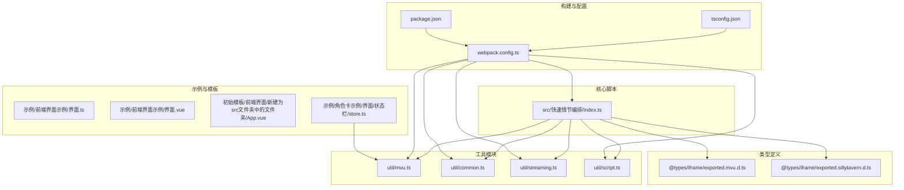
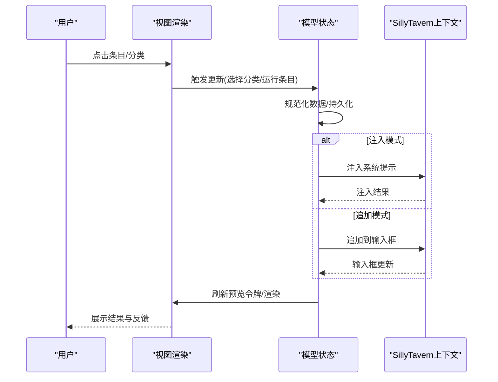
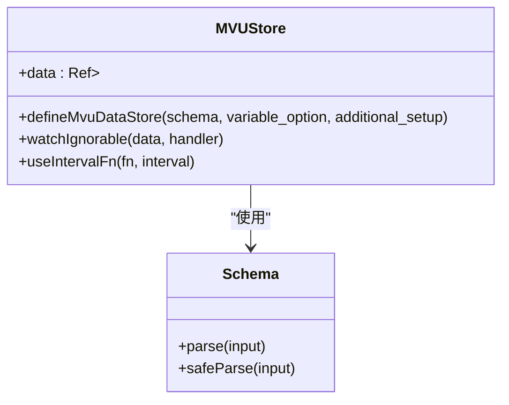
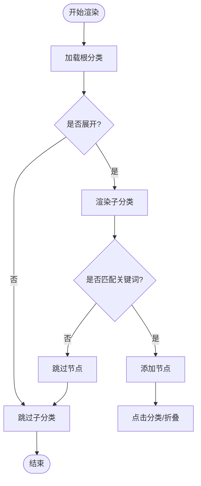
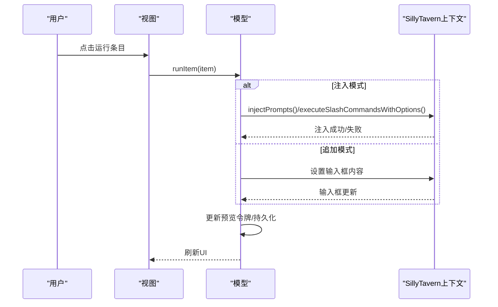
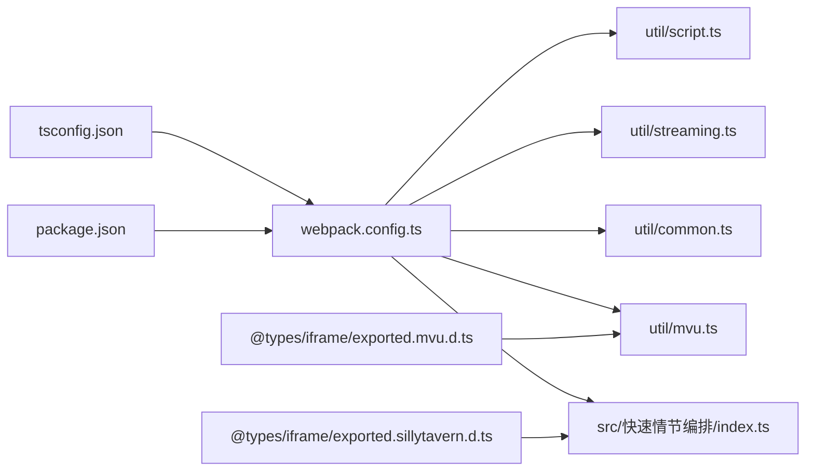

# 快速情节编排系统

<cite>
**本文档引用的文件**
- [README.md](file://README.md)
- [src/快速情节编排/index.ts](file://src/快速情节编排/index.ts)
- [util/mvu.ts](file://util/mvu.ts)
- [util/common.ts](file://util/common.ts)
- [util/streaming.ts](file://util/streaming.ts)
- [util/script.ts](file://util/script.ts)
- [webpack.config.ts](file://webpack.config.ts)
- [tsconfig.json](file://tsconfig.json)
- [package.json](file://package.json)
- [@types/iframe/exported.mvu.d.ts](file://@types/iframe/exported.mvu.d.ts)
- [@types/iframe/exported.sillytavern.d.ts](file://@types/iframe/exported.sillytavern.d.ts)
- [示例/前端界面示例/界面.ts](file://示例/前端界面示例/界面.ts)
- [示例/前端界面示例/界面.vue](file://示例/前端界面示例/界面.vue)
- [初始模板/前端界面/新建为src文件夹中的文件夹/App.vue](file://初始模板/前端界面/新建为src文件夹中的文件夹/App.vue)
- [示例/角色卡示例/界面/状态栏/store.ts](file://示例/角色卡示例/界面/状态栏/store.ts)
</cite>

## 目录
1. [简介](#简介)
2. [项目结构](#项目结构)
3. [核心组件](#核心组件)
4. [架构总览](#架构总览)
5. [详细组件分析](#详细组件分析)
6. [依赖关系分析](#依赖关系分析)
7. [性能考虑](#性能考虑)
8. [故障排除指南](#故障排除指南)
9. [结论](#结论)
10. [附录](#附录)

## 简介
快速情节编排系统是一个专为SillyTavern设计的剧情驱动型交互扩展，采用MVU（Model-View-Update）状态管理模式，提供分类树形管理、收藏夹、预览面板、拖拽排序、实时搜索与注入等功能。系统通过统一的数据模型与UI状态持久化，结合SillyTavern的上下文接口，实现对聊天输入区的无缝集成与增强。

## 项目结构
项目采用模块化组织，核心逻辑集中在单文件脚本中，配合工具模块与类型定义，构建完整的MVU数据流与UI渲染体系。

**图表来源**
- [src/快速情节编排/index.ts:1-2051](file://src/快速情节编排/index.ts#L1-L2051)
- [util/mvu.ts:1-66](file://util/mvu.ts#L1-L66)
- [util/common.ts:1-135](file://util/common.ts#L1-L135)
- [util/streaming.ts:1-238](file://util/streaming.ts#L1-L238)
- [util/script.ts:1-47](file://util/script.ts#L1-L47)
- [webpack.config.ts:1-572](file://webpack.config.ts#L1-L572)
- [tsconfig.json:1-54](file://tsconfig.json#L1-L54)
- [package.json:1-120](file://package.json#L1-L120)
- [@types/iframe/exported.mvu.d.ts:1-47](file://@types/iframe/exported.mvu.d.ts#L1-L47)
- [@types/iframe/exported.sillytavern.d.ts:378-412](file://@types/iframe/exported.sillytavern.d.ts#L378-L412)
- [示例/前端界面示例/界面.ts:1-22](file://示例/前端界面示例/界面.ts#L1-L22)
- [示例/前端界面示例/界面.vue:1-4](file://示例/前端界面示例/界面.vue#L1-L4)
- [初始模板/前端界面/新建为src文件夹中的文件夹/App.vue:1-8](file://初始模板/前端界面/新建为src文件夹中的文件夹/App.vue#L1-L8)
- [示例/角色卡示例/界面/状态栏/store.ts:1-4](file://示例/角色卡示例/界面/状态栏/store.ts#L1-L4)

**章节来源**
- [README.md:1-105](file://README.md#L1-L105)
- [webpack.config.ts:51-75](file://webpack.config.ts#L51-L75)
- [tsconfig.json:16-23](file://tsconfig.json#L16-L23)

## 核心组件
- 数据模型与持久化：统一的pack结构，包含元数据、分类、条目、设置、UI状态与收藏夹；通过脚本变量或localStorage进行持久化。
- MVU状态管理：基于Pinia的MVU数据存储，Schema校验与双向同步，确保数据一致性与类型安全。
- UI渲染与交互：工作台面板、侧边树形分类、主内容网格、预览令牌、上下文菜单与拖拽排序。
- 集成与注入：通过SillyTavern上下文接口向聊天输入区追加或注入内容，支持“然后/同时”连接符。
- 主题系统：内置多套主题，通过data-theme属性切换，支持浅色与深色风格。
- 实时流式界面：可挂载流式楼层界面，替换原生楼层显示，支持iframe与div宿主模式。

**章节来源**
- [src/快速情节编排/index.ts:34-237](file://src/快速情节编排/index.ts#L34-L237)
- [util/mvu.ts:3-65](file://util/mvu.ts#L3-L65)
- [util/streaming.ts:41-237](file://util/streaming.ts#L41-L237)
- [@types/iframe/exported.sillytavern.d.ts:378-412](file://@types/iframe/exported.sillytavern.d.ts#L378-L412)

## 架构总览
系统采用MVU架构，核心流程如下：
- Model：加载/规范化数据包，维护分类树与条目集合，追踪UI状态与收藏夹。
- View：渲染工作台面板、树形分类、主内容网格、预览令牌与设置界面。
- Update：处理用户交互（点击、拖拽、搜索、注入），更新状态并持久化。

**图表来源**
- [src/快速情节编排/index.ts:641-664](file://src/快速情节编排/index.ts#L641-L664)
- [src/快速情节编排/index.ts:595-622](file://src/快速情节编排/index.ts#L595-L622)
- [src/快速情节编排/index.ts:633-639](file://src/快速情节编排/index.ts#L633-L639)
- [@types/iframe/exported.sillytavern.d.ts:378-412](file://@types/iframe/exported.sillytavern.d.ts#L378-L412)

## 详细组件分析

### MVU（Model-View-Update）状态管理
- 数据存储：通过defineMvuDataStore创建MVU数据存储，基于Schema进行解析与校验，周期性同步与写回变量。
- 变量绑定：支持按消息或全局维度读取/写入变量，自动处理差异与去抖。
- 类型安全：Zod Schema提供运行时类型校验，错误信息格式化输出。

**图表来源**
- [util/mvu.ts:3-65](file://util/mvu.ts#L3-L65)
- [@types/iframe/exported.mvu.d.ts:1-47](file://@types/iframe/exported.mvu.d.ts#L1-L47)

**章节来源**
- [util/mvu.ts:1-66](file://util/mvu.ts#L1-L66)
- [示例/角色卡示例/界面/状态栏/store.ts:1-4](file://示例/角色卡示例/界面/状态栏/store.ts#L1-L4)

### 分类管理机制（树形结构）
- 分类树：支持多级父子关系，通过parentId建立层级；支持展开/折叠与排序。
- 搜索匹配：对分类名称、条目名称与内容进行关键词匹配，支持递归匹配子分类。
- 渲染与交互：节点可点击进入分类，支持拖拽移动分类与条目至目标分类。

**图表来源**
- [src/快速情节编排/index.ts:709-795](file://src/快速情节编排/index.ts#L709-L795)
- [src/快速情节编排/index.ts:719-760](file://src/快速情节编排/index.ts#L719-L760)

**章节来源**
- [src/快速情节编排/index.ts:517-549](file://src/快速情节编排/index.ts#L517-L549)
- [src/快速情节编排/index.ts:709-795](file://src/快速情节编排/index.ts#L709-L795)

### 收藏夹功能
- 收藏夹入口：树形节点中提供“收藏夹”快捷入口，切换到收藏条目集合。
- 收藏状态：条目favorite字段与收藏数组同步，持久化保存。

**章节来源**
- [src/快速情节编排/index.ts:709-720](file://src/快速情节编排/index.ts#L709-L720)
- [src/快速情节编排/index.ts:372-377](file://src/快速情节编排/index.ts#L372-L377)

### 预览面板实现
- 面板令牌：记录最近使用的条目与连接符，支持展开/折叠与高度调整。
- 面板刷新：通过刷新函数更新DOM，保证预览与实际输入一致。

**章节来源**
- [src/快速情节编排/index.ts:624-640](file://src/快速情节编排/index.ts#L624-L640)
- [src/快速情节编排/index.ts:633-639](file://src/快速情节编排/index.ts#L633-L639)

### 拖拽排序机制
- 分类拖拽：支持将分类拖拽到任意目标分类下，自动计算order并更新父节点。
- 条目拖拽：支持将条目拖拽到任意分类，自动追加到末尾并更新order。

**章节来源**
- [src/快速情节编排/index.ts:685-699](file://src/快速情节编排/index.ts#L685-L699)
- [src/快速情节编排/index.ts:701-707](file://src/快速情节编排/index.ts#L701-L707)
- [src/快速情节编排/index.ts:762-786](file://src/快速情节编排/index.ts#L762-L786)

### 实时搜索功能
- 关键词匹配：对分类名称、条目名称与内容进行大小写不敏感匹配。
- 实时过滤：输入框输入时动态更新树形与主内容网格。

**章节来源**
- [src/快速情节编排/index.ts:724-737](file://src/快速情节编排/index.ts#L724-L737)
- [src/快速情节编排/index.ts:797-807](file://src/快速情节编排/index.ts#L797-L807)

### 集成与注入（SillyTavern）
- 追加模式：将内容追加到聊天输入框，自动触发输入事件。
- 注入模式：通过上下文接口注入系统提示，支持一次性注入。
- 失败回退：若注入失败，提供提示信息。

**图表来源**
- [src/快速情节编排/index.ts:641-664](file://src/快速情节编排/index.ts#L641-L664)
- [src/快速情节编排/index.ts:595-622](file://src/快速情节编排/index.ts#L595-L622)
- [@types/iframe/exported.sillytavern.d.ts:378-412](file://@types/iframe/exported.sillytavern.d.ts#L378-L412)

**章节来源**
- [src/快速情节编排/index.ts:583-593](file://src/快速情节编排/index.ts#L583-L593)
- [src/快速情节编排/index.ts:595-622](file://src/快速情节编排/index.ts#L595-L622)

### UI组件与主题系统
- 面板布局：顶部工具栏、路径导航、侧边树、主内容网格、底部预览面板。
- 主题系统：内置多套主题，通过data-theme属性切换，支持浅色与深色风格。
- 响应式设计：在窄屏设备上自动调整布局与网格列数。

**章节来源**
- [src/快速情节编排/index.ts:379-493](file://src/快速情节编排/index.ts#L379-L493)
- [src/快速情节编排/index.ts:464-490](file://src/快速情节编排/index.ts#L464-L490)

### 流式楼层界面集成
- 挂载策略：支持iframe与div两种宿主模式，iframe可隔离样式，div继承样式。
- 上下文注入：为每个消息提供响应式上下文，包括消息ID、内容与流式状态。
- 生命周期管理：监听消息渲染、编辑、删除与更多消息加载事件，动态挂载/卸载组件。

**章节来源**
- [util/streaming.ts:41-237](file://util/streaming.ts#L41-L237)

## 依赖关系分析
- 构建工具链：Webpack + TypeScript + Vue生态，支持热更新与CDN外链。
- 运行时依赖：jQuery/Lodash/Zod/Pinia/Vue等，提供DOM操作、数据处理、状态管理与类型校验。
- 类型声明：SillyTavern与MVU接口类型定义，确保与宿主环境的类型安全对接。

**图表来源**
- [webpack.config.ts:1-572](file://webpack.config.ts#L1-L572)
- [tsconfig.json:1-54](file://tsconfig.json#L1-L54)
- [package.json:1-120](file://package.json#L1-L120)
- [src/快速情节编排/index.ts:1-2051](file://src/快速情节编排/index.ts#L1-L2051)
- [util/mvu.ts:1-66](file://util/mvu.ts#L1-L66)
- [util/common.ts:1-135](file://util/common.ts#L1-L135)
- [util/streaming.ts:1-238](file://util/streaming.ts#L1-L238)
- [util/script.ts:1-47](file://util/script.ts#L1-L47)
- [@types/iframe/exported.sillytavern.d.ts:378-412](file://@types/iframe/exported.sillytavern.d.ts#L378-L412)
- [@types/iframe/exported.mvu.d.ts:1-47](file://@types/iframe/exported.mvu.d.ts#L1-L47)

**章节来源**
- [webpack.config.ts:444-463](file://webpack.config.ts#L444-L463)
- [package.json:79-107](file://package.json#L79-L107)

## 性能考虑
- 渲染优化：使用requestAnimationFrame处理窗口尺寸变化，避免频繁重绘。
- 数据持久化：批量更新UI状态与收藏夹，减少写入频率。
- 拖拽与搜索：对树形渲染与关键词匹配进行节流，提升交互流畅度。
- 构建优化：生产模式启用最小化与分包策略，CDN外链减少体积。

**章节来源**
- [src/快速情节编排/index.ts:93-106](file://src/快速情节编排/index.ts#L93-L106)
- [webpack.config.ts:484-520](file://webpack.config.ts#L484-L520)

## 故障排除指南
- 注入失败：检查SillyTavern上下文接口可用性，确认注入参数格式正确。
- 数据异常：使用通用工具模块的解析与修复函数，确保数据格式合法。
- 版本不兼容：通过版本检查函数提示最低版本要求。

**章节来源**
- [src/快速情节编排/index.ts:611-622](file://src/快速情节编排/index.ts#L611-L622)
- [util/common.ts:96-134](file://util/common.ts#L96-L134)
- [util/common.ts:70-74](file://util/common.ts#L70-L74)

## 结论
快速情节编排系统通过MVU架构实现了数据与UI的强一致性，结合SillyTavern的上下文能力，提供了高效、直观的剧情编排体验。其模块化的工具链与完善的类型定义，确保了系统的可维护性与扩展性。

## 附录

### 配置选项说明
- 数据版本：用于数据迁移与兼容性控制。
- 占位符与连接符：支持自定义占位符与“然后/同时”连接符。
- 提示设置：最大堆叠数与显示时长。
- 默认行为：运行模式（追加/注入）与预览展开状态。
- UI主题：主题名称配置。

**章节来源**
- [src/快速情节编排/index.ts:165-189](file://src/快速情节编排/index.ts#L165-L189)
- [src/快速情节编排/index.ts:322-346](file://src/快速情节编排/index.ts#L322-L346)

### 最佳实践
- 使用MVU数据存储管理复杂状态，确保Schema一致性。
- 在SillyTavern环境中优先使用注入模式处理系统提示，追加模式用于普通内容。
- 合理使用收藏夹与分类树，保持结构清晰与可维护性。
- 通过主题系统适配不同视觉偏好，注意在iframe模式下隔离样式。

**章节来源**
- [util/mvu.ts:29-60](file://util/mvu.ts#L29-L60)
- [src/快速情节编排/index.ts:641-664](file://src/快速情节编排/index.ts#L641-L664)
- [util/streaming.ts:41-60](file://util/streaming.ts#L41-L60)