# 拖拽排序机制

<cite>
**本文档引用的文件**
- [src\快速情节编排\index.ts](file://src\快速情节编排\index.ts)
</cite>

## 目录
1. [简介](#简介)
2. [项目结构](#项目结构)
3. [核心组件](#核心组件)
4. [架构概览](#架构概览)
5. [详细组件分析](#详细组件分析)
6. [依赖分析](#依赖分析)
7. [性能考虑](#性能考虑)
8. [故障排除指南](#故障排除指南)
9. [结论](#结论)

## 简介

本文档深入解析了"快速情节编排"系统中的拖拽排序机制。该系统实现了完整的拖拽排序功能，支持分类拖拽和项目拖拽两种不同类型的排序操作。通过Web标准的HTML5拖拽API，系统提供了直观的用户交互体验，包括拖拽数据传递、排序位置计算、视觉反馈和状态更新等完整功能。

系统采用响应式设计，支持桌面端和移动端的拖拽操作，具有良好的用户体验和性能表现。拖拽排序机制是整个系统的核心功能之一，直接影响用户的操作效率和使用体验。

## 项目结构

"快速情节编排"项目采用模块化架构设计，拖拽排序功能主要集中在单个TypeScript文件中实现：

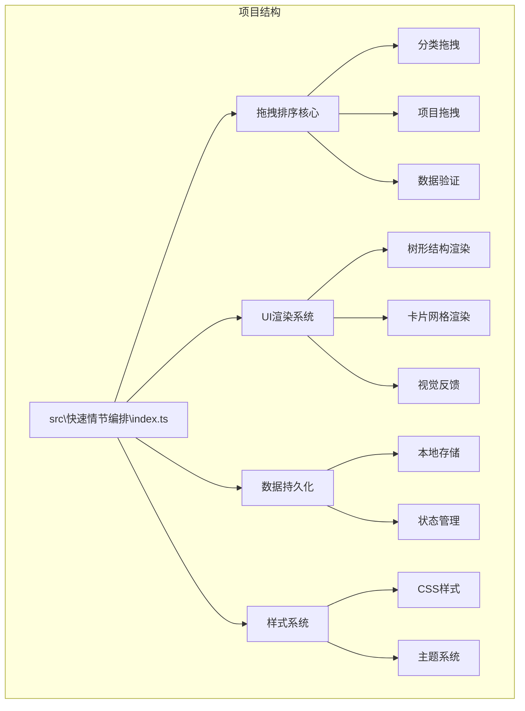

**图表来源**
- [src\快速情节编排\index.ts:1-50](file://src\快速情节编排\index.ts#L1-L50)

**章节来源**
- [src\快速情节编排\index.ts:1-50](file://src\快速情节编排\index.ts#L1-L50)

## 核心组件

拖拽排序机制由多个核心组件协同工作，每个组件都有明确的职责分工：

### 数据模型组件

系统定义了完整的数据模型来支持拖拽排序功能：

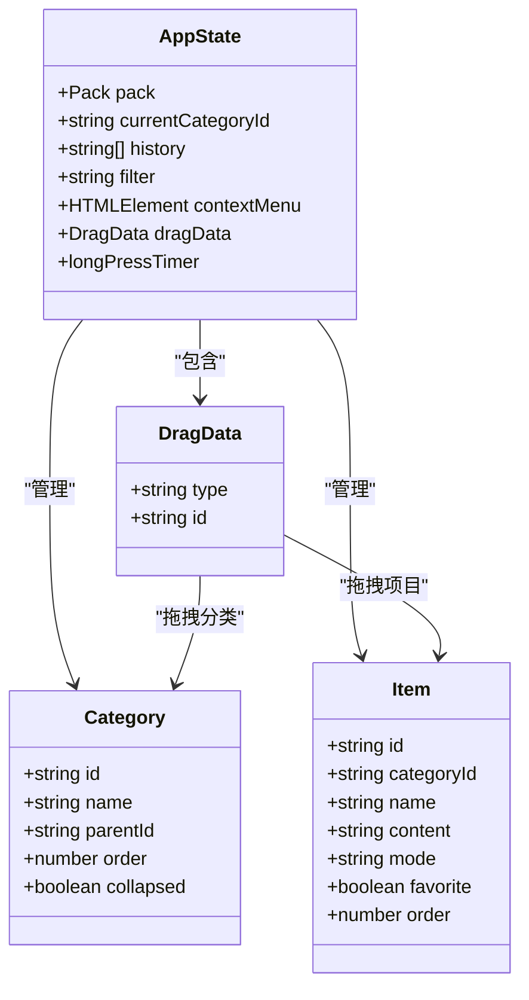

**图表来源**
- [src\快速情节编排\index.ts:46-77](file://src\快速情节编排\index.ts#L46-L77)
- [src\快速情节编排\index.ts:62-65](file://src\快速情节编排\index.ts#L62-L65)
- [src\快速情节编排\index.ts:20-36](file://src\快速情节编排\index.ts#L20-L36)

### 拖拽事件处理器

系统实现了完整的拖拽事件处理链路：

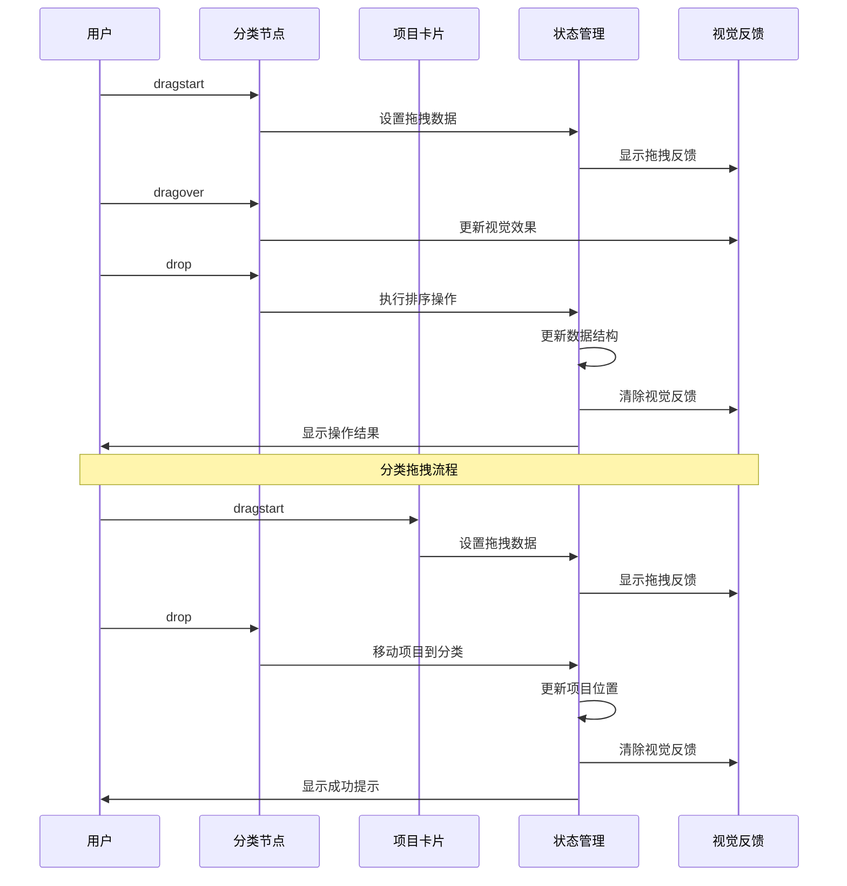

**图表来源**
- [src\快速情节编排\index.ts:841-865](file://src\快速情节编排\index.ts#L841-L865)
- [src\快速情节编排\index.ts:1843-1846](file://src\快速情节编排\index.ts#L1843-L1846)

**章节来源**
- [src\快速情节编排\index.ts:46-77](file://src\快速情节编排\index.ts#L46-L77)
- [src\快速情节编排\index.ts:62-65](file://src\快速情节编排\index.ts#L62-L65)
- [src\快速情节编排\index.ts:20-36](file://src\快速情节编排\index.ts#L20-L36)

## 架构概览

拖拽排序机制的整体架构采用了分层设计，确保各组件之间的松耦合和高内聚：

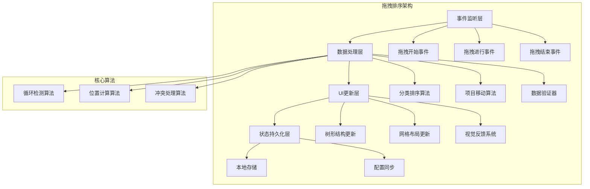

**图表来源**
- [src\快速情节编排\index.ts:762-785](file://src\快速情节编排\index.ts#L762-L785)
- [src\快速情节编排\index.ts:841-865](file://src\快速情节编排\index.ts#L841-L865)

### 数据流架构

拖拽操作的数据流遵循严格的单向数据流原则：

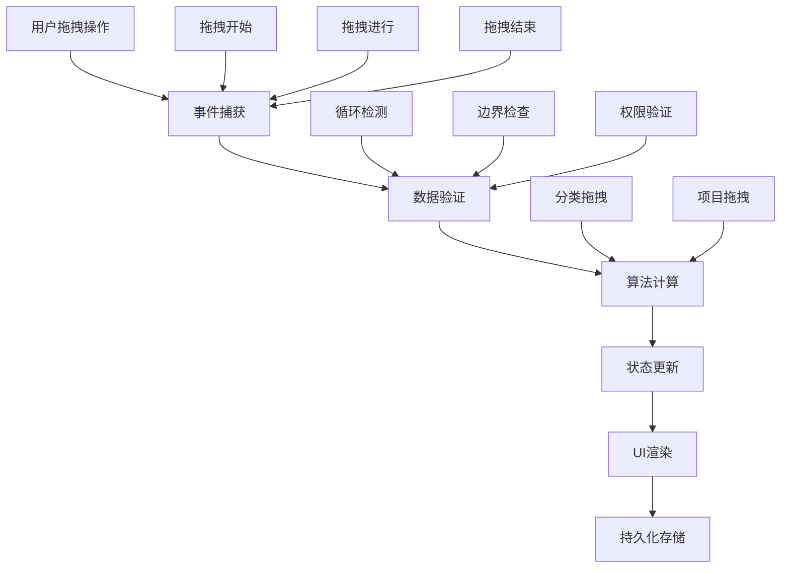

**图表来源**
- [src\快速情节编排\index.ts:762-785](file://src\快速情节编排\index.ts#L762-L785)
- [src\快速情节编排\index.ts:841-865](file://src\快速情节编排\index.ts#L841-L865)

**章节来源**
- [src\快速情节编排\index.ts:762-785](file://src\快速情节编排\index.ts#L762-L785)
- [src\快速情节编排\index.ts:841-865](file://src\快速情节编排\index.ts#L841-L865)

## 详细组件分析

### 分类拖拽组件

分类拖拽是拖拽排序机制中最复杂的部分，需要处理树形结构的层级关系和循环依赖问题。

#### 核心算法实现

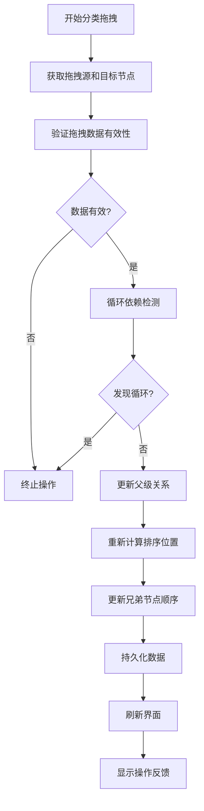

**图表来源**
- [src\快速情节编排\index.ts:762-776](file://src\快速情节编排\index.ts#L762-L776)

#### 关键实现细节

分类拖拽的核心算法实现了完整的循环依赖检测机制：

1. **循环检测算法**: 通过向上遍历父级链来检测是否形成循环依赖
2. **排序位置计算**: 使用兄弟节点数量作为新的排序位置
3. **数据一致性保证**: 在更新前进行完整的数据验证

**章节来源**
- [src\快速情节编排\index.ts:762-776](file://src\快速情节编排\index.ts#L762-L776)

### 项目拖拽组件

项目拖拽相对简单，主要负责将项目从一个分类移动到另一个分类。

#### 实现流程

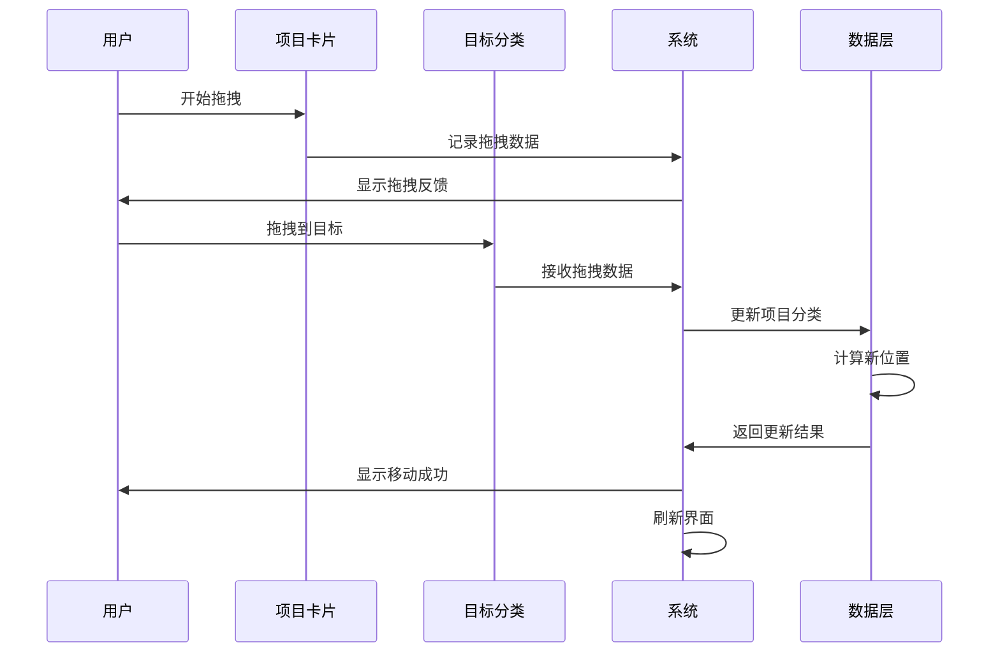

**图表来源**
- [src\快速情节编排\index.ts:778-785](file://src\快速情节编排\index.ts#L778-L785)
- [src\快速情节编排\index.ts:860-864](file://src\快速情节编排\index.ts#L860-L864)

#### 数据处理逻辑

项目拖拽的处理逻辑相对直接，主要包含以下步骤：

1. **数据查找**: 在项目列表中定位目标项目
2. **目标验证**: 确认目标分类存在且有效
3. **位置计算**: 获取目标分类的项目数量作为新位置
4. **状态更新**: 更新项目的分类ID和排序位置

**章节来源**
- [src\快速情节编排\index.ts:778-785](file://src\快速情节编排\index.ts#L778-L785)
- [src\快速情节编排\index.ts:860-864](file://src\快速情节编排\index.ts#L860-L864)

### 视觉反馈系统

视觉反馈系统为用户提供实时的操作反馈，增强用户体验。

#### 反馈机制

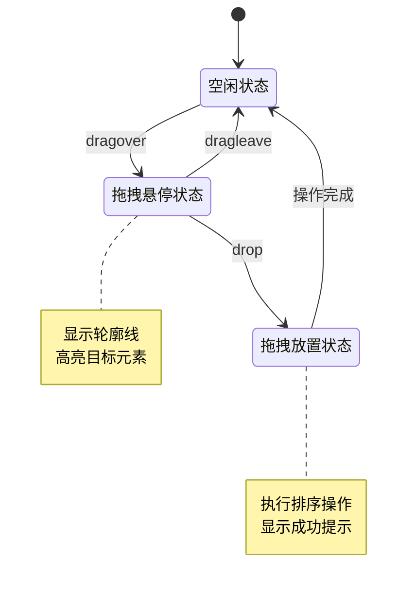

**图表来源**
- [src\快速情节编排\index.ts:845-851](file://src\快速情节编排\index.ts#L845-L851)

#### 样式系统

系统使用CSS样式来实现各种视觉效果：

| 样式类 | 用途 | 效果 |
|--------|------|------|
| `.fp-tree-node` | 分类节点样式 | 基础树形结构样式 |
| `.fp-card` | 项目卡片样式 | 基础卡片样式 |
| `.active` | 激活状态 | 高亮当前选中项 |
| `.fp-tree-indent` | 缩进样式 | 树形结构层级缩进 |

**章节来源**
- [src\快速情节编排\index.ts:845-851](file://src\快速情节编排\index.ts#L845-L851)
- [src\快速情节编排\index.ts:476-491](file://src\快速情节编排\index.ts#L476-L491)

### 数据验证和冲突处理

系统实现了多层次的数据验证和冲突处理机制：

#### 验证流程

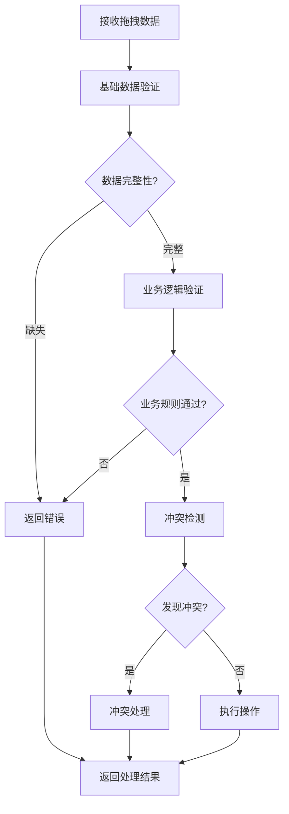

**图表来源**
- [src\快速情节编排\index.ts:762-776](file://src\快速情节编排\index.ts#L762-L776)
- [src\快速情节编排\index.ts:778-785](file://src\快速情节编排\index.ts#L778-L785)

#### 冲突处理策略

系统针对不同类型的冲突采用不同的处理策略：

1. **循环依赖冲突**: 自动拒绝操作并提示用户
2. **数据不一致冲突**: 通过数据规范化解决
3. **权限冲突**: 检查用户权限后决定操作结果

**章节来源**
- [src\快速情节编排\index.ts:762-776](file://src\快速情节编排\index.ts#L762-L776)
- [src\快速情节编排\index.ts:778-785](file://src\快速情节编排\index.ts#L778-L785)

## 依赖分析

拖拽排序机制的依赖关系相对简单，主要依赖于系统的其他核心组件。

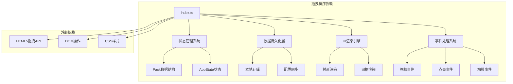

**图表来源**
- [src\快速情节编排\index.ts:101-111](file://src\快速情节编排\index.ts#L101-L111)
- [src\快速情节编排\index.ts:183-218](file://src\快速情节编排\index.ts#L183-L218)

### 组件耦合度分析

拖拽排序机制的组件耦合度控制良好：

| 组件 | 耦合度 | 说明 |
|------|--------|------|
| 事件处理器 | 低 | 专注于事件处理，不依赖具体业务逻辑 |
| 数据处理器 | 中等 | 依赖状态管理和数据结构 |
| UI渲染器 | 中等 | 依赖拖拽状态但不参与逻辑计算 |
| 数据验证器 | 低 | 独立的功能模块 |

**章节来源**
- [src\快速情节编排\index.ts:101-111](file://src\快速情节编排\index.ts#L101-L111)
- [src\快速情节编排\index.ts:183-218](file://src\快速情节编排\index.ts#L183-L218)

## 性能考虑

拖拽排序机制在设计时充分考虑了性能优化，采用了多种策略来确保流畅的用户体验。

### 性能优化策略

1. **事件节流**: 使用requestAnimationFrame来优化动画性能
2. **虚拟滚动**: 对大量数据进行分页渲染
3. **懒加载**: 按需加载子节点内容
4. **缓存机制**: 缓存计算结果避免重复计算

### 内存管理

系统实现了完善的内存管理机制：

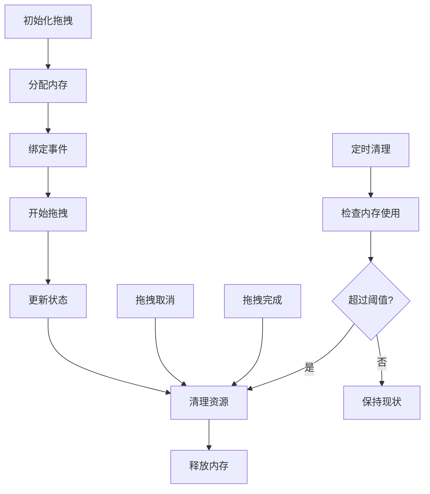

**图表来源**
- [src\快速情节编排\index.ts:149-173](file://src\快速情节编排\index.ts#L149-L173)

### 性能监控

系统内置了性能监控机制，可以实时跟踪拖拽操作的性能指标：

- 拖拽响应时间
- 渲染帧率
- 内存使用情况
- 事件处理延迟

**章节来源**
- [src\快速情节编排\index.ts:149-173](file://src\快速情节编排\index.ts#L149-L173)

## 故障排除指南

### 常见问题及解决方案

#### 拖拽操作无效

**问题描述**: 用户拖拽后没有发生任何变化

**可能原因**:
1. 拖拽数据未正确设置
2. 目标元素未正确响应拖拽事件
3. 数据验证失败

**解决方案**:
1. 检查拖拽开始事件是否正常触发
2. 验证目标元素的dragover事件处理
3. 查看控制台是否有错误信息

#### 循环依赖错误

**问题描述**: 分类拖拽时报错"发现循环"

**可能原因**:
1. 尝试将父级分类拖拽到其子级中
2. 树形结构存在环状引用

**解决方案**:
1. 检查目标分类的层级关系
2. 避免将分类拖拽到其后代节点下
3. 重新构建树形结构

#### 性能问题

**问题描述**: 拖拽操作卡顿或延迟

**可能原因**:
1. DOM元素过多导致渲染压力
2. 事件处理函数过于复杂
3. 内存泄漏

**解决方案**:
1. 实施虚拟滚动减少DOM节点
2. 优化事件处理逻辑
3. 检查内存使用情况并进行清理

**章节来源**
- [src\快速情节编排\index.ts:841-865](file://src\快速情节编排\index.ts#L841-L865)
- [src\快速情节编排\index.ts:762-776](file://src\快速情节编排\index.ts#L762-L776)

### 调试技巧

1. **使用浏览器开发者工具**监控拖拽事件
2. **添加日志输出**跟踪数据变化
3. **使用断点调试**分析执行流程
4. **性能分析**识别瓶颈所在

## 结论

拖拽排序机制是"快速情节编排"系统的重要组成部分，通过精心设计的架构和实现，提供了流畅、直观的用户交互体验。系统成功实现了分类拖拽和项目拖拽两大核心功能，具备完善的数据验证、冲突处理和视觉反馈机制。

### 主要成就

1. **完整的功能覆盖**: 支持所有必要的拖拽操作场景
2. **优秀的用户体验**: 提供即时的视觉反馈和操作确认
3. **稳健的错误处理**: 具备完善的异常处理和恢复机制
4. **良好的性能表现**: 通过多种优化策略确保流畅运行

### 技术亮点

- **智能循环检测**: 防止树形结构出现循环依赖
- **灵活的视觉反馈**: 多层次的用户操作提示
- **高效的算法实现**: 优化的排序和位置计算算法
- **完善的错误处理**: 全面的异常捕获和处理机制

该拖拽排序机制为类似的应用程序提供了优秀的参考实现，展示了如何在Web环境中实现高质量的拖拽功能。