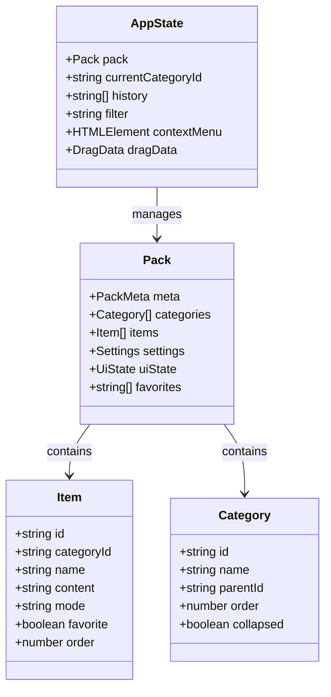
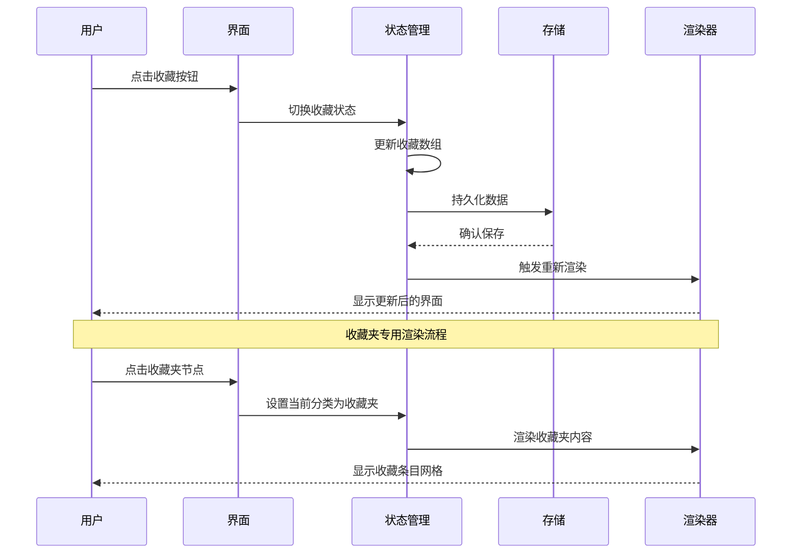
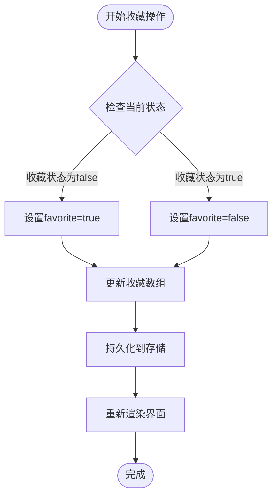
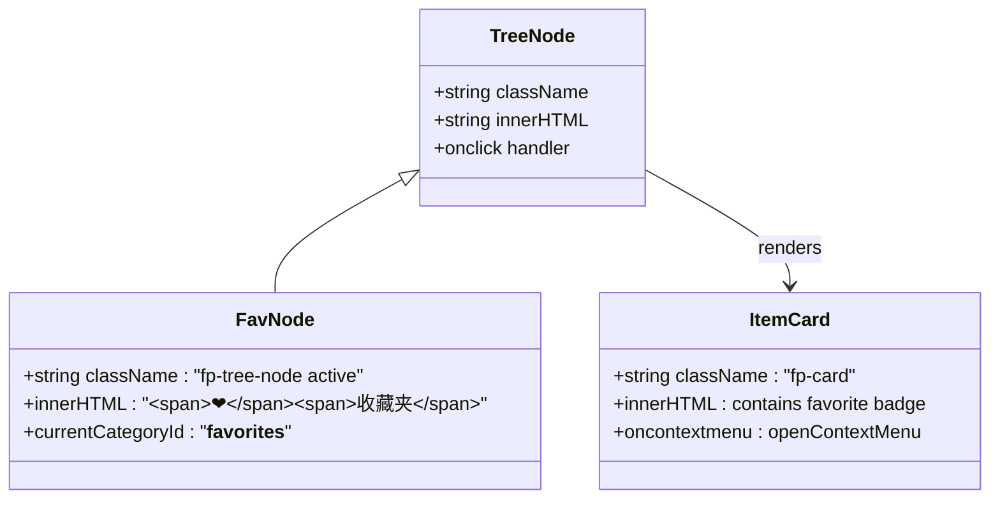
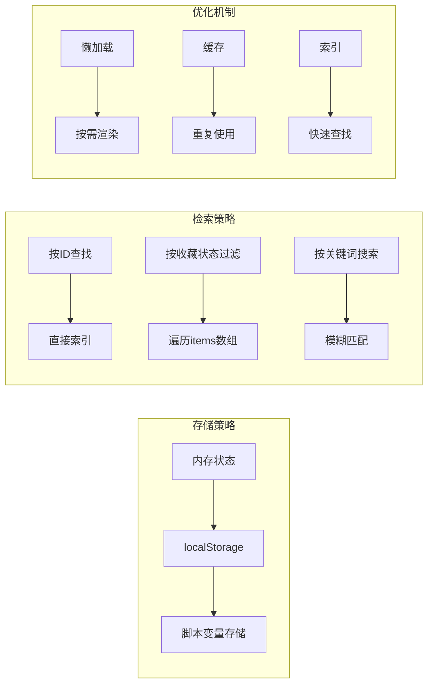
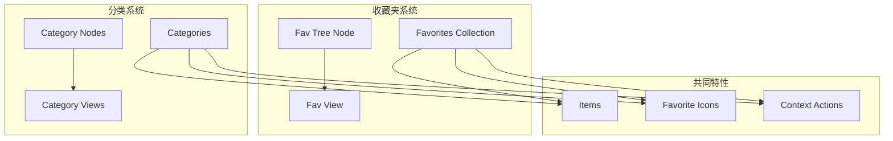
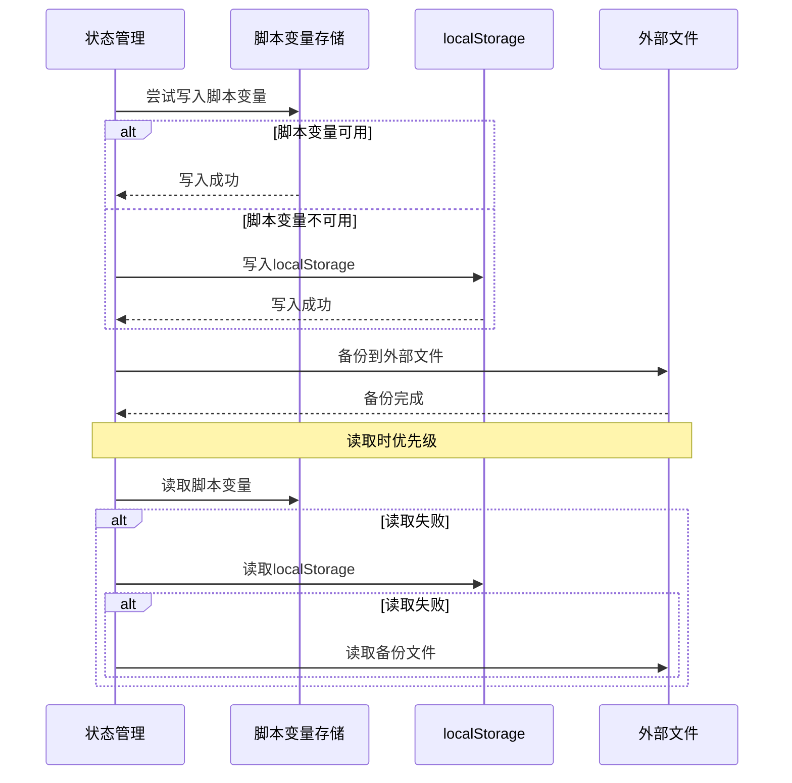
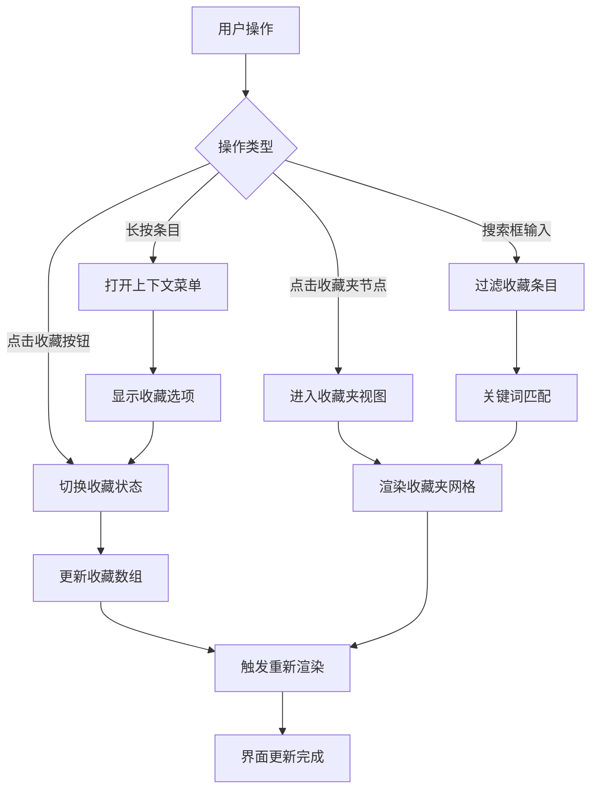
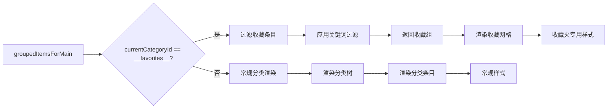
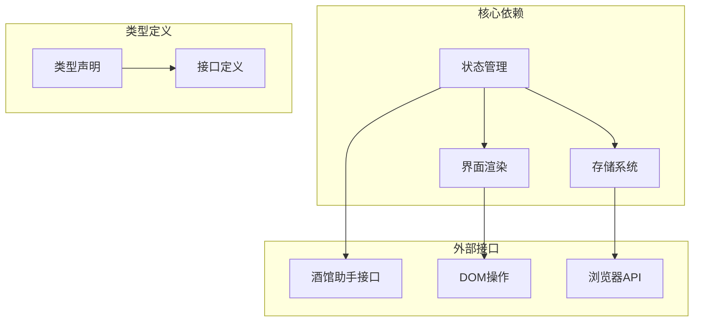

# 收藏夹功能

<cite>
**本文档引用的文件**
- [index.ts](file://src/快速情节编排/index.ts)
- [exported.sillytavern.d.ts](file://@types/iframe/exported.sillytavern.d.ts)
- [lorebook.d.ts](file://@types/function/lorebook.d.ts)
- [lorebook_entry.d.ts](file://@types/function/lorebook_entry.d.ts)
</cite>

## 目录
1. [简介](#简介)
2. [项目结构](#项目结构)
3. [核心组件](#核心组件)
4. [架构概览](#架构概览)
5. [详细组件分析](#详细组件分析)
6. [依赖分析](#依赖分析)
7. [性能考虑](#性能考虑)
8. [故障排除指南](#故障排除指南)
9. [结论](#结论)

## 简介

收藏夹功能是"快速情节编排"系统中的一个重要特性，允许用户对常用的情节条目进行标记和快速访问。该功能实现了完整的收藏状态管理机制，包括收藏状态的持久化、收藏项的存储和检索策略，以及专门的收藏夹界面渲染逻辑。

收藏夹功能与传统的分类系统有本质区别：传统分类主要用于组织和管理条目，而收藏夹是一个特殊的虚拟分类，专门用于快速访问用户标记的重要条目。收藏夹通过特殊的标识符`__favorites__`来识别，具有独立的界面渲染逻辑和快捷访问机制。

## 项目结构

该项目采用模块化架构设计，收藏夹功能主要集中在`src/快速情节编排/index.ts`文件中实现。整个系统围绕着"包"(Pack)的概念构建，包包含了元数据、分类、条目、设置和用户界面状态等所有相关信息。

```mermaid
graph TB
subgraph "应用架构"
UI[用户界面层]
State[状态管理层]
Storage[存储层]
end
subgraph "数据模型"
Pack[包(Pack)]
Meta[元数据]
Categories[分类树]
Items[条目集合]
Favorites[收藏夹]
Settings[设置]
UIState[界面状态]
end
UI --> State
State --> Storage
State --> Pack
Pack --> Meta
Pack --> Categories
Pack --> Items
Pack --> Favorites
Pack --> Settings
Pack --> UIState
```

**图表来源**
- [index.ts:12-60](file://src/快速情节编排/index.ts#L12-L60)

**章节来源**
- [index.ts:1-50](file://src/快速情节编排/index.ts#L1-L50)

## 核心组件

收藏夹功能的核心组件包括数据模型、状态管理、界面渲染和持久化机制。

### 数据模型

收藏夹功能基于以下核心数据结构：



**图表来源**
- [index.ts:28-77](file://src/快速情节编排/index.ts#L28-L77)

收藏夹功能的关键特性：
- **收藏状态字段**：每个条目都有`favorite`布尔值字段
- **收藏夹数组**：独立的`favorites`字符串数组存储收藏条目的ID
- **特殊分类标识**：使用`__favorites__`作为收藏夹的特殊ID
- **状态同步机制**：收藏状态在内存和持久化存储之间保持同步

**章节来源**
- [index.ts:28-60](file://src/快速情节编排/index.ts#L28-L60)

## 架构概览

收藏夹功能的架构设计体现了清晰的关注点分离：



**图表来源**
- [index.ts:790-797](file://src/快速情节编排/index.ts#L790-L797)
- [index.ts:1735-1739](file://src/快速情节编排/index.ts#L1735-L1739)

## 详细组件分析

### 收藏状态管理机制

收藏夹功能实现了双重状态管理机制：



**图表来源**
- [index.ts:1735-1739](file://src/快速情节编排/index.ts#L1735-L1739)

收藏状态管理的关键实现：
- **即时状态切换**：点击收藏按钮立即切换条目的收藏状态
- **数组同步更新**：自动维护`favorites`数组与条目状态的一致性
- **持久化保证**：每次状态变更都会触发数据持久化
- **界面实时反馈**：状态变更后立即重新渲染相关界面元素

**章节来源**
- [index.ts:1735-1739](file://src/快速情节编排/index.ts#L1735-L1739)

### 收藏夹界面实现

收藏夹界面采用了专门的渲染逻辑，具有独特的视觉标识和交互行为：



**图表来源**
- [index.ts:790-797](file://src/快速情节编排/index.ts#L790-L797)
- [index.ts:1813-1823](file://src/快速情节编排/index.ts#L1813-L1823)

收藏夹界面的特殊处理：
- **专用节点**：收藏夹在左侧导航树中显示为特殊节点
- **激活状态**：当处于收藏夹视图时，收藏夹节点显示为激活状态
- **独立渲染**：收藏夹内容使用专门的渲染逻辑，不参与常规分类树渲染
- **快捷访问**：收藏夹节点提供快速访问收藏条目的入口

**章节来源**
- [index.ts:787-874](file://src/快速情节编排/index.ts#L787-L874)

### 收藏项的存储和检索策略

收藏夹功能采用了高效的存储和检索策略：



**图表来源**
- [index.ts:183-218](file://src/快速情节编排/index.ts#L183-L218)
- [index.ts:879-886](file://src/快速情节编排/index.ts#L879-L886)

存储策略特点：
- **多层存储**：支持localStorage和脚本变量两种存储方式
- **自动降级**：当高级存储不可用时自动回退到localStorage
- **数据标准化**：统一的数据格式和版本管理
- **增量更新**：只更新变化的部分，提高性能

检索策略优化：
- **快速过滤**：收藏夹视图使用`favorite`字段直接过滤
- **关键词搜索**：支持在收藏夹中进行关键词搜索
- **状态同步**：收藏状态变更时自动更新相关索引

**章节来源**
- [index.ts:183-218](file://src/快速情节编排/index.ts#L183-L218)
- [index.ts:879-886](file://src/快速情节编排/index.ts#L879-L886)

### 收藏夹与普通分类的区别和联系

收藏夹与普通分类系统既相互独立又紧密关联：



**图表来源**
- [index.ts:790-797](file://src/快速情节编排/index.ts#L790-L797)
- [index.ts:879-886](file://src/快速情节编排/index.ts#L879-L886)

区别对比：
- **用途不同**：收藏夹专注于快速访问，分类用于组织管理
- **标识符不同**：收藏夹使用特殊ID，分类使用通用ID
- **渲染逻辑不同**：收藏夹有专门的渲染流程
- **交互方式不同**：收藏夹提供快捷访问入口

联系特性：
- **数据共享**：都基于相同的条目数据结构
- **状态同步**：收藏状态影响条目在两个系统中的显示
- **操作一致**：都支持相同的编辑、删除、移动操作
- **样式统一**：使用相同的UI组件和样式系统

**章节来源**
- [index.ts:787-874](file://src/快速情节编排/index.ts#L787-L874)
- [index.ts:876-901](file://src/快速情节编排/index.ts#L876-L901)

### 收藏状态的数据持久化方案

收藏夹功能实现了多层次的数据持久化方案：



**图表来源**
- [index.ts:183-218](file://src/快速情节编排/index.ts#L183-L218)

持久化方案特点：
- **优先级策略**：脚本变量 > localStorage > 外部文件
- **自动降级**：当高级存储不可用时自动回退
- **数据完整性**：确保数据在各种环境下都能正确保存和恢复
- **版本兼容**：支持数据格式的向后兼容和迁移

**章节来源**
- [index.ts:183-218](file://src/快速情节编排/index.ts#L183-L218)

### 收藏项的快速访问机制

收藏夹提供了多种快速访问机制：



**图表来源**
- [index.ts:790-797](file://src/快速情节编排/index.ts#L790-L797)
- [index.ts:1735-1739](file://src/快速情节编排/index.ts#L1735-L1739)

快速访问特性：
- **一键收藏**：右键菜单中的收藏/取消收藏选项
- **快捷导航**：收藏夹节点提供快速访问入口
- **实时搜索**：在收藏夹视图中支持关键词搜索
- **手势支持**：长按触发展开上下文菜单
- **状态指示**：收藏条目显示特殊的心形图标

**章节来源**
- [index.ts:1717-1789](file://src/快速情节编排/index.ts#L1717-L1789)

### 收藏夹的特殊渲染逻辑

收藏夹具有专门的渲染逻辑，与其他分类视图有显著差异：



**图表来源**
- [index.ts:876-901](file://src/快速情节编排/index.ts#L876-L901)

特殊渲染逻辑：
- **独立分组**：收藏夹条目形成独立的分组显示
- **标题标识**：显示特殊的"❤ 收藏条目"标题
- **网格布局**：使用专门的网格布局显示收藏条目
- **状态高亮**：收藏条目显示特殊的状态标识
- **搜索集成**：支持在收藏夹中进行搜索过滤

**章节来源**
- [index.ts:876-901](file://src/快速情节编排/index.ts#L876-L901)

## 依赖分析

收藏夹功能的依赖关系相对简单，主要依赖于核心状态管理和存储系统：



**图表来源**
- [index.ts:175-182](file://src/快速情节编排/index.ts#L175-L182)

依赖关系特点：
- **内部耦合度低**：收藏夹功能与核心系统高度集成
- **外部接口稳定**：依赖稳定的酒馆助手API
- **类型安全**：完整的TypeScript类型定义
- **向后兼容**：支持多种存储后端

**章节来源**
- [index.ts:175-182](file://src/快速情节编排/index.ts#L175-L182)

## 性能考虑

收藏夹功能在设计时充分考虑了性能优化：

### 内存管理
- **懒加载策略**：收藏夹内容按需渲染，避免不必要的计算
- **状态缓存**：收藏状态在内存中缓存，减少重复计算
- **增量更新**：只更新发生变化的部分，提高渲染效率

### 存储优化
- **数据压缩**：存储时进行必要的数据压缩和清理
- **索引优化**：维护收藏条目的索引，提高查询速度
- **批量操作**：支持批量收藏状态变更，减少存储写入次数

### 界面响应性
- **异步渲染**：收藏夹渲染采用异步方式，避免阻塞主线程
- **虚拟滚动**：大量收藏条目时采用虚拟滚动技术
- **防抖处理**：搜索和过滤操作使用防抖机制

## 故障排除指南

### 常见问题及解决方案

**收藏状态无法保存**
- 检查浏览器是否禁用了localStorage
- 确认脚本变量存储权限是否正常
- 查看控制台是否有存储错误信息

**收藏夹显示异常**
- 刷新页面尝试重新加载数据
- 检查收藏数组是否为空或损坏
- 验证收藏条目的ID是否有效

**收藏操作无响应**
- 确认条目对象是否正确初始化
- 检查事件绑定是否正常
- 验证收藏状态切换逻辑

**章节来源**
- [index.ts:183-218](file://src/快速情节编排/index.ts#L183-L218)

## 结论

收藏夹功能作为"快速情节编排"系统的重要组成部分，展现了优秀的软件工程实践。通过精心设计的数据模型、状态管理和界面渲染机制，实现了高效、直观且可靠的收藏体验。

该功能的主要优势包括：
- **简洁直观**：用户界面友好，操作简单明了
- **高性能**：优化的存储和渲染策略，响应迅速
- **可靠性强**：多重持久化机制，数据安全有保障
- **扩展性强**：模块化设计，易于功能扩展和维护

收藏夹功能不仅提升了用户体验，也为整个"快速情节编排"系统的可用性和效率做出了重要贡献。其设计思路和实现方案为类似的功能模块提供了良好的参考范例。