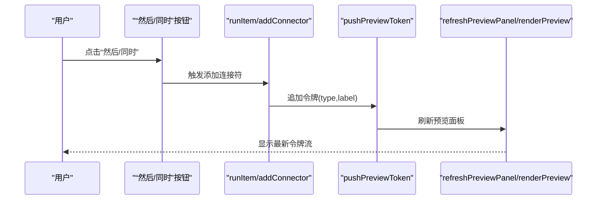
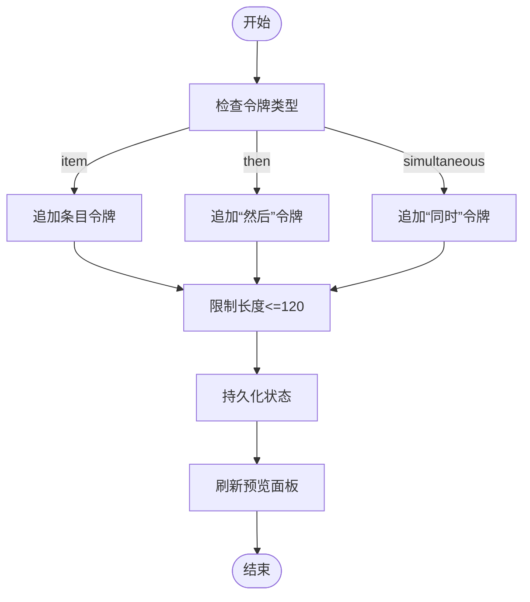
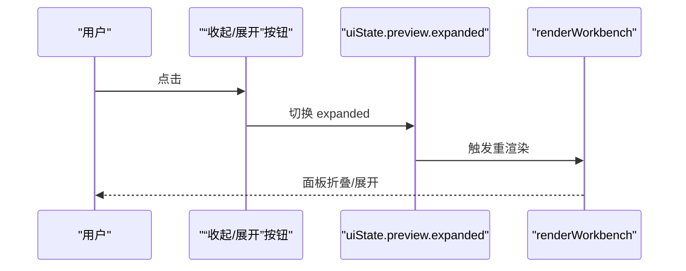
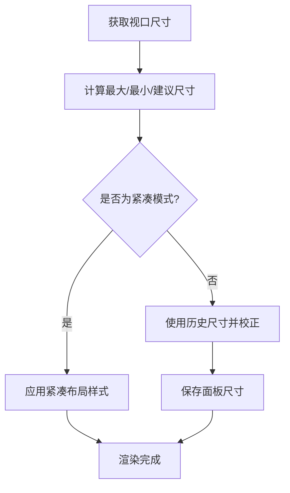
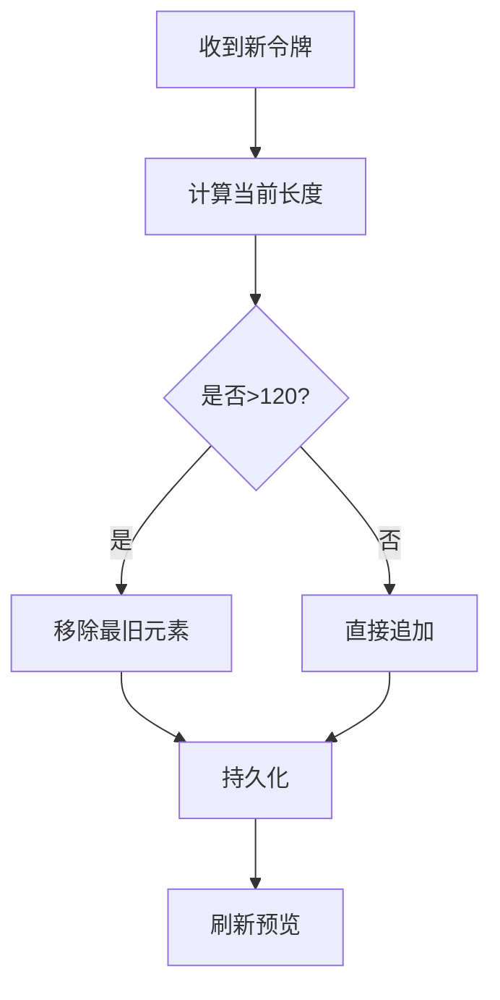
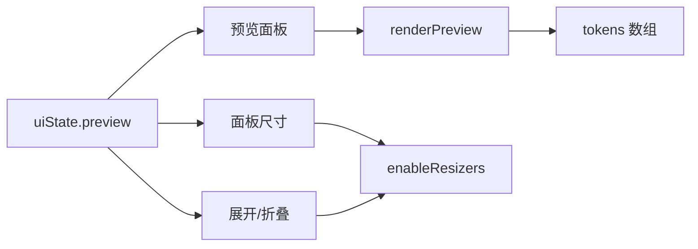

# 预览面板

<cite>
**本文引用的文件**
- [index.ts](file://src/快速情节编排/index.ts)
- [exported.sillytavern.d.ts](file://@types/iframe/exported.sillytavern.d.ts)
</cite>

## 目录
1. [简介](#简介)
2. [项目结构](#项目结构)
3. [核心组件](#核心组件)
4. [架构总览](#架构总览)
5. [详细组件分析](#详细组件分析)
6. [依赖关系分析](#依赖关系分析)
7. [性能考量](#性能考量)
8. [故障排查指南](#故障排查指南)
9. [结论](#结论)
10. [附录](#附录)

## 简介
本文件面向“预览面板”的技术文档，聚焦以下主题：
- 设计理念：通过“令牌流”可视化展示即将插入到输入区的指令序列，帮助用户理解当前构建的对话流程。
- 令牌系统：支持三种令牌类型（item、then、simultaneous），分别代表条目、顺序连接符、并发连接符。
- 动态更新机制：运行条目或插入连接符时，向令牌流追加对应令牌，并持久化状态。
- 展开/折叠控制：底部预览区域支持折叠与展开，折叠时隐藏令牌流，仅保留标题栏与切换按钮。
- 高度自适应：面板高度随窗口大小与用户拖拽调整，同时在小屏设备上自动进入紧凑布局。
- 历史记录管理：令牌流采用固定长度队列，超过上限时自动丢弃最旧元素，保证内存占用可控。
- 样式定制与动画：内置多套主题（浅色/深色/金色），卡片悬停等交互具备平滑过渡；面板打开/关闭具备兼容性处理。

## 项目结构
预览面板位于“快速情节编排”工作台中，整体采用“顶部工具栏 + 左侧分类树 + 主内容区 + 底部预览”的布局。预览面板位于主内容区下方，由水平分割条控制其高度。

图表来源
- [index.ts:1945-2033](file://src/快速情节编排/index.ts#L1945-L2033)

章节来源
- [index.ts:1901-2098](file://src/快速情节编排/index.ts#L1901-L2098)

## 核心组件
- 令牌系统
  - 数据模型：令牌数组，每个令牌包含 id、type、label 字段。
  - 类型枚举：item（条目）、then（顺序连接符）、simultaneous（并发连接符）。
  - 渲染：将令牌数组映射为带样式的标签元素，按类型应用不同样式类。
- 预览面板
  - 结构：包含标题栏与令牌流容器，支持折叠/展开。
  - 控制：通过“收起/展开”按钮切换 expanded 状态，折叠时隐藏令牌流。
  - 高度：受 splitH 拖拽影响，高度值持久化到 uiState.preview.height。
- 高度自适应
  - 计算：基于视口尺寸与历史尺寸，计算最大/最小/建议尺寸，确保在小屏与大屏均友好。
  - 紧凑模式：当视口宽度或高度小于阈值时，切换为纵向布局，隐藏分割线与侧边栏。
- 历史记录管理
  - 长度限制：令牌流最多保留 120 个，超出时移除最旧元素。
  - 持久化：每次更新后调用持久化函数，写入存储。

章节来源
- [index.ts:46-51](file://src/快速情节编排/index.ts#L46-L51)
- [index.ts:697-705](file://src/快速情节编排/index.ts#L697-L705)
- [index.ts:1706-1715](file://src/快速情节编排/index.ts#L1706-L1715)
- [index.ts:1998-2005](file://src/快速情节编排/index.ts#L1998-L2005)
- [index.ts:1879-1898](file://src/快速情节编排/index.ts#L1879-L1898)
- [index.ts:1910-1943](file://src/快速情节编排/index.ts#L1910-L1943)

## 架构总览
预览面板的控制流围绕“运行条目/插入连接符”两条路径展开：前者将条目名称作为 item 令牌加入流，后者将连接符文本作为 then/simultaneous 令牌加入流。两者都会触发刷新与持久化。

图表来源
- [index.ts:2061-2062](file://src/快速情节编排/index.ts#L2061-L2062)
- [index.ts:731-739](file://src/快速情节编排/index.ts#L731-L739)
- [index.ts:697-705](file://src/快速情节编排/index.ts#L697-L705)
- [index.ts:707-713](file://src/快速情节编排/index.ts#L707-L713)
- [index.ts:1706-1715](file://src/快速情节编排/index.ts#L1706-L1715)

## 详细组件分析

### 令牌系统与渲染
- 令牌类型与含义
  - item：表示用户点击的条目名称，用于直观展示“已插入的条目”。
  - then：表示顺序连接符，用于串联多个条目，体现先后关系。
  - simultaneous：表示并发连接符，用于在同一轮对话中并行插入多个片段。
- 渲染逻辑
  - 每个令牌渲染为一个带样式的标签元素，类型决定样式类（item/then/simultaneous/raw）。
  - 标签文本来自令牌的 label 字段，便于用户识别。
- 动态更新
  - 运行条目：将条目名称作为 item 令牌加入流。
  - 插入连接符：将连接符文本作为 then 或 simultaneous 令牌加入流。
  - 刷新：每次更新后调用刷新函数，重新渲染预览区域。

图表来源
- [index.ts:697-705](file://src/快速情节编排/index.ts#L697-L705)
- [index.ts:715-729](file://src/快速情节编排/index.ts#L715-L729)
- [index.ts:731-739](file://src/快速情节编排/index.ts#L731-L739)
- [index.ts:1706-1715](file://src/快速情节编排/index.ts#L1706-L1715)

章节来源
- [index.ts:697-705](file://src/快速情节编排/index.ts#L697-L705)
- [index.ts:715-729](file://src/快速情节编排/index.ts#L715-L729)
- [index.ts:731-739](file://src/快速情节编排/index.ts#L731-L739)
- [index.ts:1706-1715](file://src/快速情节编排/index.ts#L1706-L1715)

### 预览面板的展开/折叠控制
- 折叠条件
  - 小屏模式：当视口宽度或高度小于阈值时，强制折叠。
  - 用户状态：expanded 字段为 false 时折叠。
- 折叠行为
  - 应用 collapsed 类，隐藏令牌流内容。
  - 隐藏水平分割条，防止误触。
- 展开/收起切换
  - 点击“收起/展开”按钮，切换 expanded 状态并持久化。
  - 切换后重新渲染工作台，使折叠状态生效。

图表来源
- [index.ts:2001-2005](file://src/快速情节编排/index.ts#L2001-L2005)
- [index.ts:2088-2097](file://src/快速情节编排/index.ts#L2088-L2097)

章节来源
- [index.ts:1998-2005](file://src/快速情节编排/index.ts#L1998-L2005)
- [index.ts:2088-2097](file://src/快速情节编排/index.ts#L2088-L2097)

### 高度自适应机制
- 视口适配
  - 计算最大/最小/建议尺寸，避免面板过大或过小。
  - 大屏时若历史尺寸过小，自动放大至合适比例，提升可用性。
- 紧凑模式
  - 当视口宽度或高度小于阈值时，切换为纵向布局，隐藏分割线与侧边栏。
- 面板尺寸持久化
  - 每次调整后保存面板宽高到 uiState.panelSize。

图表来源
- [index.ts:125-140](file://src/快速情节编排/index.ts#L125-L140)
- [index.ts:1910-1943](file://src/快速情节编排/index.ts#L1910-L1943)

章节来源
- [index.ts:125-140](file://src/快速情节编排/index.ts#L125-L140)
- [index.ts:1910-1943](file://src/快速情节编排/index.ts#L1910-L1943)

### 预览历史记录管理策略
- 长度限制：令牌流最多保留 120 个，超出时移除最旧元素，避免无限增长。
- 持久化：每次更新后立即持久化，确保刷新或重启后仍能恢复最近历史。
- 清理策略：采用先进先出（FIFO）方式，优先保留最近使用的令牌。

图表来源
- [index.ts:697-705](file://src/快速情节编排/index.ts#L697-L705)

章节来源
- [index.ts:697-705](file://src/快速情节编排/index.ts#L697-L705)

### 样式定制与动画效果
- 主题系统
  - 内置主题：herdi-light（默认）、ink-noir、sand-gold。
  - 通过 panel 的 data-theme 属性切换，影响所有子元素的颜色与背景。
- 卡片交互
  - 悬停时卡片边框与阴影变化，轻微上移，提供触感反馈。
- 面板打开/关闭兼容性
  - 若 fixed 定位被父容器约束，自动降级为 absolute 并设置尺寸，保证可见性。
- 动画速度
  - 该脚本未直接实现面板开合动画，但类型定义中存在 animation 选项（slow/fast/none），可用于扩展。

章节来源
- [index.ts:42-44](file://src/快速情节编排/index.ts#L42-L44)
- [index.ts:1908](file://src/快速情节编排/index.ts#L1908)
- [index.ts:531-551](file://src/快速情节编排/index.ts#L531-L551)
- [index.ts:485](file://src/快速情节编排/index.ts#L485)
- [index.ts:2124-2164](file://src/快速情节编排/index.ts#L2124-L2164)
- [exported.sillytavern.d.ts:331-332](file://@types/iframe/exported.sillytavern.d.ts#L331-L332)

## 依赖关系分析
- 组件耦合
  - 预览面板依赖 uiState.preview 的 tokens 数组进行渲染。
  - 高度控制依赖 uiState.preview.height 与 uiState.panelSize。
  - 展开/折叠依赖 uiState.preview.expanded。
- 外部集成
  - 注入系统：通过 SillyTavern 上下文提供的注入接口，实现“注入模式”的条目执行。
  - 存储：通过脚本变量或本地存储持久化数据。

图表来源
- [index.ts:46-51](file://src/快速情节编排/index.ts#L46-L51)
- [index.ts:1706-1715](file://src/快速情节编排/index.ts#L1706-L1715)
- [index.ts:1879-1898](file://src/快速情节编排/index.ts#L1879-L1898)
- [index.ts:1998-2005](file://src/快速情节编排/index.ts#L1998-L2005)

章节来源
- [index.ts:46-51](file://src/快速情节编排/index.ts#L46-L51)
- [index.ts:1706-1715](file://src/快速情节编排/index.ts#L1706-L1715)
- [index.ts:1879-1898](file://src/快速情节编排/index.ts#L1879-L1898)
- [index.ts:1998-2005](file://src/快速情节编排/index.ts#L1998-L2005)

## 性能考量
- 渲染优化
  - 令牌渲染采用批量更新策略：每次只更新 .fp-preview 容器，避免全量重绘。
  - 令牌数量上限控制在 120，降低 DOM 节点数量与重排成本。
- 事件节流
  - 窗口尺寸变化通过 requestAnimationFrame 合并，减少频繁重排。
- 存储优化
  - 仅持久化必要的 uiState 字段，避免冗余数据写入。

## 故障排查指南
- 预览面板不显示
  - 检查 overlay 是否成功挂载，overlay 的尺寸是否被父容器约束。
  - 若出现 fixed 定位失效，参考兼容性处理逻辑，确认是否降级为 absolute。
- 令牌流异常
  - 确认 tokens 数组是否正确更新，长度是否超过 120。
  - 检查持久化是否成功，重启后是否能恢复历史。
- 高度/布局问题
  - 检查 uiState.preview.height 与 uiState.panelSize 是否正确保存。
  - 小屏模式下，确认紧凑布局样式是否生效。
- 注入失败
  - 检查 SillyTavern 上下文是否存在注入接口，确认注入内容格式是否正确。

章节来源
- [index.ts:2124-2164](file://src/快速情节编排/index.ts#L2124-L2164)
- [index.ts:696-695](file://src/快速情节编排/index.ts#L696-L695)
- [index.ts:1879-1898](file://src/快速情节编排/index.ts#L1879-L1898)
- [index.ts:1910-1943](file://src/快速情节编排/index.ts#L1910-L1943)

## 结论
预览面板通过“令牌流”将复杂的对话构建过程可视化，结合展开/折叠、高度自适应与历史记录管理，提供了高效且易用的交互体验。其设计强调简洁与可维护性，令牌系统的扩展性也为未来引入更多连接符或标记提供了基础。

## 附录
- 关键实现路径
  - 令牌系统：[pushPreviewToken:697-705](file://src/快速情节编排/index.ts#L697-L705)、[renderPreview:1706-1715](file://src/快速情节编排/index.ts#L1706-L1715)
  - 预览面板控制：[renderWorkbench 中的预览区域:1998-2015](file://src/快速情节编排/index.ts#L1998-L2015)、[展开/折叠切换:2088-2097](file://src/快速情节编排/index.ts#L2088-L2097)
  - 高度自适应：[computeFitPanelSize/applyFitPanelSize:135-147](file://src/快速情节编排/index.ts#L135-L147)、[enableResizers:1879-1898](file://src/快速情节编排/index.ts#L1879-L1898)
  - 样式与主题：[ensureStyle:447-561](file://src/快速情节编排/index.ts#L447-L561)、[主题切换](file://src/快速情节编排/index.ts#L1908)
  - 注入集成：[injectContent:667-695](file://src/快速情节编排/index.ts#L667-L695)
  - 类型定义参考：[animation 选项:331-332](file://@types/iframe/exported.sillytavern.d.ts#L331-L332)