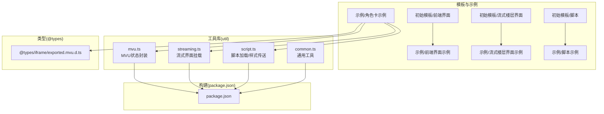
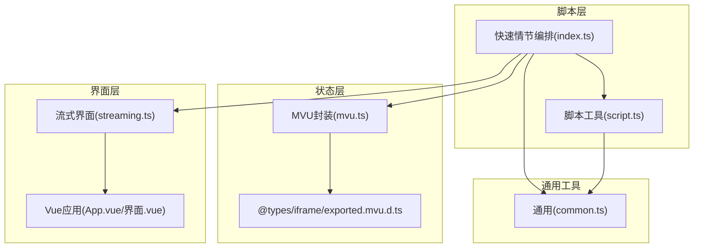
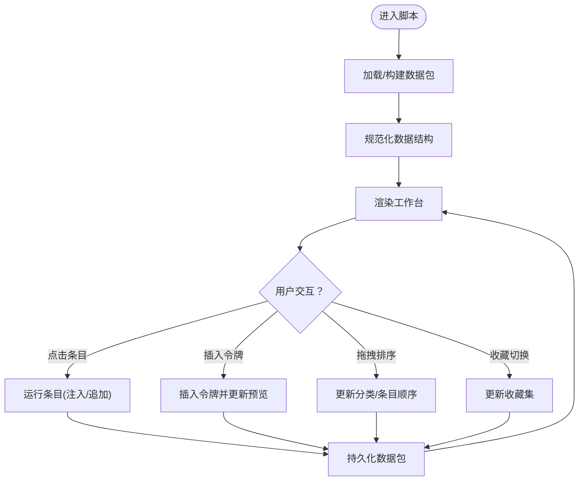
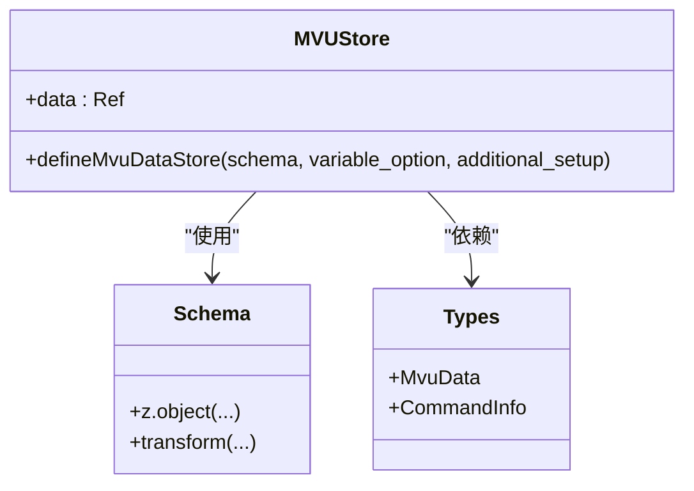
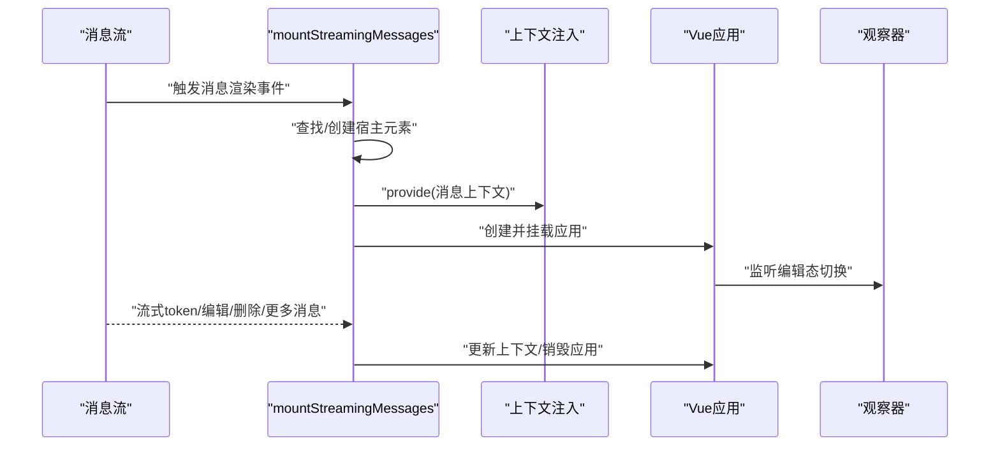
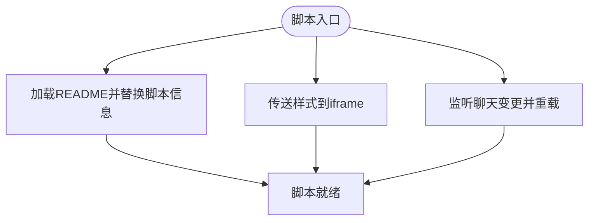
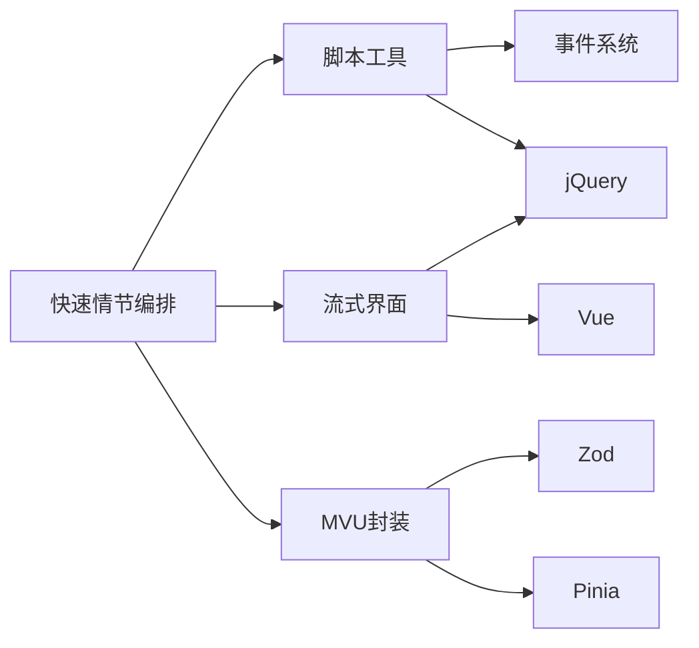

# 核心功能模块

<cite>
**本文引用的文件**
- [README.md](file://README.md)
- [src/快速情节编排/index.ts](file://src/快速情节编排/index.ts)
- [util/mvu.ts](file://util/mvu.ts)
- [util/streaming.ts](file://util/streaming.ts)
- [util/script.ts](file://util/script.ts)
- [util/common.ts](file://util/common.ts)
- [示例/脚本示例/index.ts](file://示例/脚本示例/index.ts)
- [示例/前端界面示例/界面.vue](file://示例/前端界面示例/界面.vue)
- [示例/流式楼层界面示例/App.vue](file://示例/流式楼层界面示例/App.vue)
- [示例/角色卡示例/界面/状态栏/index.ts](file://示例/角色卡示例/界面/状态栏/index.ts)
- [示例/角色卡示例/脚本/MVU/index.ts](file://示例/角色卡示例/脚本/MVU/index.ts)
- [示例/角色卡示例/schema.ts](file://示例/角色卡示例/schema.ts)
- [@types/iframe/exported.mvu.d.ts](file://@types/iframe/exported.mvu.d.ts)
- [package.json](file://package.json)
</cite>

## 目录
1. [简介](#简介)
2. [项目结构](#项目结构)
3. [核心组件](#核心组件)
4. [架构总览](#架构总览)
5. [详细组件分析](#详细组件分析)
6. [依赖分析](#依赖分析)
7. [性能考量](#性能考量)
8. [故障排除指南](#故障排除指南)
9. [结论](#结论)
10. [附录](#附录)

## 简介
本文件面向“酒馆助手模板”的核心功能模块，围绕以下主题展开：快速情节编排系统、MVU（Model-View-Update）状态管理、流式界面支持以及脚本系统。文档旨在帮助读者理解设计理念、架构模式与技术实现，掌握模块间的交互关系、数据流向与集成方式，并提供使用示例、配置选项、最佳实践、性能优化与故障排除建议。

## 项目结构
本项目采用“模板 + 示例 + 工具库”的组织方式：
- 模板与示例位于“初始模板”和“示例”目录，覆盖前端界面、流式楼层界面、脚本与角色卡等场景。
- 工具库位于“util”目录，提供 MVU 状态封装、流式界面挂载、脚本加载与样式传送等通用能力。
- 类型声明位于“@types”目录，为脚本与 MVU 提供强类型支持。
- 构建与依赖由“package.json”统一管理。

图表来源
- [示例/前端界面示例/界面.vue:1-4](file://示例/前端界面示例/界面.vue#L1-L4)
- [示例/流式楼层界面示例/App.vue:1-72](file://示例/流式楼层界面示例/App.vue#L1-L72)
- [util/mvu.ts:1-66](file://util/mvu.ts#L1-L66)
- [util/streaming.ts:1-238](file://util/streaming.ts#L1-L238)
- [util/script.ts:1-47](file://util/script.ts#L1-L47)
- [util/common.ts:1-135](file://util/common.ts#L1-L135)
- [@types/iframe/exported.mvu.d.ts:1-190](file://@types/iframe/exported.mvu.d.ts#L1-L190)
- [package.json:1-120](file://package.json#L1-L120)

章节来源
- [README.md:1-105](file://README.md#L1-L105)
- [package.json:1-120](file://package.json#L1-L120)

## 核心组件
- 快速情节编排系统：提供可视化工作台，支持分类树、收藏夹、占位符解析、注入/追加模式、预览令牌与面板尺寸记忆等。
- MVU 状态管理系统：基于 Pinia 的 MVU 数据存储封装，提供 schema 校验、双向同步、定时刷新与变更监听。
- 流式界面支持：在消息流中为每个楼层挂载独立的 Vue 应用，支持 iframe/div 两种宿主模式，自动处理渲染/销毁与编辑态切换。
- 脚本系统：提供脚本加载、样式传送、聊天切换重载、README 动态加载等能力，配合事件系统实现稳定集成。

章节来源
- [src/快速情节编排/index.ts:1-2051](file://src/快速情节编排/index.ts#L1-L2051)
- [util/mvu.ts:1-66](file://util/mvu.ts#L1-L66)
- [util/streaming.ts:1-238](file://util/streaming.ts#L1-L238)
- [util/script.ts:1-47](file://util/script.ts#L1-L47)

## 架构总览
整体架构以“模板 + 工具库 + 类型声明 + 构建配置”为核心，角色卡与脚本通过 MVU 与流式界面实现状态驱动与动态渲染；快速情节编排作为脚本入口，负责数据持久化与 UI 控件集成。

图表来源
- [src/快速情节编排/index.ts:1-2051](file://src/快速情节编排/index.ts#L1-L2051)
- [util/mvu.ts:1-66](file://util/mvu.ts#L1-L66)
- [util/streaming.ts:1-238](file://util/streaming.ts#L1-L238)
- [util/script.ts:1-47](file://util/script.ts#L1-L47)
- [util/common.ts:1-135](file://util/common.ts#L1-L135)
- [@types/iframe/exported.mvu.d.ts:1-190](file://@types/iframe/exported.mvu.d.ts#L1-L190)
- [示例/前端界面示例/界面.vue:1-4](file://示例/前端界面示例/界面.vue#L1-L4)
- [示例/流式楼层界面示例/App.vue:1-72](file://示例/流式楼层界面示例/App.vue#L1-L72)

## 详细组件分析

### 快速情节编排系统
- 设计理念
  - 以“工作台”形式提供可拖拽、可折叠的分类树与卡片网格，支持收藏夹、占位符解析、令牌插入与预览面板。
  - 通过“注入/追加”两种模式适配不同场景：注入用于系统提示，追加用于普通消息拼接。
- 关键特性
  - 数据持久化：使用脚本变量或 localStorage 存储，支持默认数据构建与向后兼容。
  - UI 状态：记忆侧边栏宽度、预览面板展开状态、面板尺寸与路径导航。
  - 交互：上下文菜单、长按、拖拽排序、关键字过滤、收藏切换。
- 数据结构与流程
  - Pack 结构包含元信息、分类、条目、设置、UI 状态与收藏集。
  - 渲染流程：构建/加载 -> 规范化 -> 渲染树/卡片 -> 事件绑定 -> 预览更新。
- 使用示例
  - 在脚本中引入并调用初始化逻辑，随后通过按钮或快捷键打开工作台。
  - 配置占位符与令牌，使内容模板可动态替换。
- 最佳实践
  - 为常用条目设置默认分类与顺序，便于快速定位。
  - 使用收藏夹集中管理高频条目，减少层级跳转。
  - 合理设置预览面板高度与令牌最大栈，平衡信息密度与性能。

图表来源
- [src/快速情节编排/index.ts:360-377](file://src/快速情节编排/index.ts#L360-L377)
- [src/快速情节编排/index.ts:641-655](file://src/快速情节编排/index.ts#L641-L655)
- [src/快速情节编排/index.ts:657-664](file://src/快速情节编排/index.ts#L657-L664)
- [src/快速情节编排/index.ts:685-707](file://src/快速情节编排/index.ts#L685-L707)

章节来源
- [src/快速情节编排/index.ts:1-2051](file://src/快速情节编排/index.ts#L1-L2051)

### MVU 状态管理系统
- 设计理念
  - 基于 Pinia 的 store 封装，结合 Zod schema 进行数据校验与转换，实现“读取/写入”双向同步与定时刷新。
  - 通过事件钩子与变更监听，保证数据一致性与可追踪性。
- 关键特性
  - 变量选项：支持按消息、聊天、角色或全局维度选择数据源。
  - 自动同步：定时轮询与响应式监听双重机制，确保 UI 与变量同步。
  - 安全解析：safeParse 与错误收集，避免异常中断。
- 使用示例
  - 在角色卡界面中，等待 Mvu 初始化后创建 MVU 数据 store，并在组件中使用 data。
  - 通过 schema 定义复杂嵌套结构，自动完成字段变换与裁剪。
- 最佳实践
  - 将 schema 与业务规则解耦，优先使用 transform 与 coerce 处理边界情况。
  - 在 UI 层仅消费只读数据，避免直接修改底层变量。

图表来源
- [util/mvu.ts:1-66](file://util/mvu.ts#L1-L66)
- [示例/角色卡示例/schema.ts:1-52](file://示例/角色卡示例/schema.ts#L1-L52)
- [@types/iframe/exported.mvu.d.ts:1-190](file://@types/iframe/exported.mvu.d.ts#L1-L190)

章节来源
- [util/mvu.ts:1-66](file://util/mvu.ts#L1-L66)
- [示例/角色卡示例/界面/状态栏/index.ts:1-10](file://示例/角色卡示例/界面/状态栏/index.ts#L1-L10)
- [示例/角色卡示例/脚本/MVU/index.ts:1-2](file://示例/角色卡示例/脚本/MVU/index.ts#L1-L2)
- [示例/角色卡示例/schema.ts:1-52](file://示例/角色卡示例/schema.ts#L1-L52)
- [@types/iframe/exported.mvu.d.ts:1-190](file://@types/iframe/exported.mvu.d.ts#L1-L190)

### 流式界面支持
- 设计理念
  - 在消息流中为每条非用户/非系统楼层挂载独立的 Vue 应用，支持 iframe/div 两种宿主，自动处理渲染生命周期与编辑态切换。
- 关键特性
  - 上下文注入：通过 provide/inject 注入消息上下文，包括消息 ID、内容、是否处于流式阶段等。
  - 宿主选择：iframe 隔离样式，div 继承样式；两者均提供唯一 host_id 以便复用。
  - 事件驱动：监听消息渲染、编辑、删除、更多消息加载与流式 token 接收事件，动态更新界面。
- 使用示例
  - 在 App.vue 中注入上下文，解析消息内容并拆分为前/中/后三段，分别渲染搜索、高亮与选项组件。
  - 通过 formatAsDisplayedMessage 与样式适配，确保与酒馆显示一致。
- 最佳实践
  - 在 div 宿主模式下避免使用可能影响酒馆样式的类名，必要时进行替换。
  - 使用 MutationObserver 监听编辑态切换，及时恢复原生显示。

图表来源
- [util/streaming.ts:41-238](file://util/streaming.ts#L41-L238)
- [示例/流式楼层界面示例/App.vue:1-72](file://示例/流式楼层界面示例/App.vue#L1-L72)

章节来源
- [util/streaming.ts:1-238](file://util/streaming.ts#L1-L238)
- [示例/流式楼层界面示例/App.vue:1-72](file://示例/流式楼层界面示例/App.vue#L1-L72)

### 脚本系统
- 设计理念
  - 提供脚本加载、README 动态替换、样式传送与聊天切换重载等基础能力，降低脚本集成成本。
- 关键特性
  - README 加载：从远程地址拉取 README 并替换脚本信息，便于在线更新。
  - 样式传送：将页面样式传送到 iframe，实现与宿主一致的视觉体验。
  - 聊天切换：监听聊天变更事件，自动重载页面以适配新会话。
- 使用示例
  - 在脚本入口导入示例脚本集合，按需启用按钮事件、消息监听与楼层调整。
  - 在角色卡界面中，等待全局初始化后挂载 Vue 应用。
- 最佳实践
  - 在 div 宿主模式下谨慎使用第三方样式库，避免污染全局样式。
  - 对外部资源请求增加超时与降级策略，提升鲁棒性。

图表来源
- [util/script.ts:1-47](file://util/script.ts#L1-L47)
- [示例/脚本示例/index.ts:1-7](file://示例/脚本示例/index.ts#L1-L7)
- [示例/角色卡示例/界面/状态栏/index.ts:1-10](file://示例/角色卡示例/界面/状态栏/index.ts#L1-L10)

章节来源
- [util/script.ts:1-47](file://util/script.ts#L1-L47)
- [示例/脚本示例/index.ts:1-7](file://示例/脚本示例/index.ts#L1-L7)
- [示例/角色卡示例/界面/状态栏/index.ts:1-10](file://示例/角色卡示例/界面/状态栏/index.ts#L1-L10)

## 依赖分析
- 依赖关系
  - 快速情节编排依赖脚本变量与本地存储，间接依赖 MVU 类型声明。
  - MVU 封装依赖 Pinia、Zod 与 lodash 工具链，提供响应式数据与类型安全。
  - 流式界面依赖 Vue 与 jQuery，通过事件系统与 DOM 操作实现动态挂载。
  - 脚本工具依赖 jQuery 与事件系统，提供跨模块的通用能力。
- 耦合与内聚
  - 工具库高度内聚，模块间通过明确接口耦合，便于复用与测试。
  - 角色卡与脚本通过 MVU 类型声明解耦，实现松耦合的数据契约。

图表来源
- [src/快速情节编排/index.ts:1-2051](file://src/快速情节编排/index.ts#L1-L2051)
- [util/mvu.ts:1-66](file://util/mvu.ts#L1-L66)
- [util/streaming.ts:1-238](file://util/streaming.ts#L1-L238)
- [util/script.ts:1-47](file://util/script.ts#L1-L47)
- [package.json:79-107](file://package.json#L79-L107)

章节来源
- [package.json:79-107](file://package.json#L79-L107)

## 性能考量
- 渲染与事件
  - 快速情节编排使用 requestAnimationFrame 与最小化 DOM 操作，降低重绘频率。
  - 流式界面通过事件驱动与懒渲染，仅对可见消息挂载应用，减少内存占用。
- 数据同步
  - MVU 封装采用定时轮询与深比较，避免频繁写入；safeParse 与错误收集降低异常开销。
- 样式与资源
  - iframe 宿主隔离样式，div 宿主继承样式但需注意样式污染；样式传送仅在需要时执行。
- 建议
  - 对高频更新的数据使用节流/防抖策略。
  - 在大规模消息流中限制一次性挂载数量，按需渲染。

## 故障排除指南
- 快速情节编排
  - 未找到输入框：检查目标页面是否存在输入框，确认脚本运行时机。
  - 注入失败：确认已安装注入接口或具备相应权限，回退到斜杠命令方案。
- MVU 状态
  - 数据不更新：检查 schema 是否严格导致 safeParse 失败，或变量写入是否被忽略。
  - 初始化延迟：等待全局初始化后再创建 store，避免读取空数据。
- 流式界面
  - 编辑态显示异常：确认编辑态切换逻辑与样式类名替换是否正确。
  - 样式污染（div 宿主）：避免使用可能影响酒馆样式的类名，必要时进行替换。
- 脚本工具
  - README 加载失败：检查网络连通性与远程地址可用性，增加降级提示。
  - 聊天切换未生效：确认事件监听是否正确注册，页面是否允许重载。

章节来源
- [src/快速情节编排/index.ts:595-622](file://src/快速情节编排/index.ts#L595-L622)
- [util/mvu.ts:21-63](file://util/mvu.ts#L21-L63)
- [util/streaming.ts:129-161](file://util/streaming.ts#L129-L161)
- [util/script.ts:3-11](file://util/script.ts#L3-L11)

## 结论
本模板通过“快速情节编排 + MVU 状态管理 + 流式界面 + 脚本系统”的组合，实现了低门槛、高扩展的酒馆助手开发体验。模块间职责清晰、接口明确，既满足日常创作需求，又为复杂场景预留了足够的定制空间。建议在实际使用中遵循本文的最佳实践与故障排除建议，以获得更稳定与高效的体验。

## 附录
- 使用示例与配置
  - 快速情节编排：通过按钮打开工作台，配置占位符与令牌，使用收藏夹与预览面板提升效率。
  - MVU：在角色卡界面中等待全局初始化后创建 store，使用 schema 定义数据结构。
  - 流式界面：在 App.vue 中注入上下文，按消息内容拆分渲染区域，处理编辑态切换。
  - 脚本：导入示例脚本集合，启用按钮事件与消息监听，按需加载 README 与传送样式。
- 扩展性设计
  - 通过事件系统与 provide/inject 机制，模块间保持松耦合。
  - 工具库抽象通用能力，便于复用与二次开发。
- 相关文件
  - 项目说明与使用指南：[README.md:1-105](file://README.md#L1-L105)
  - 构建与依赖：[package.json:1-120](file://package.json#L1-L120)