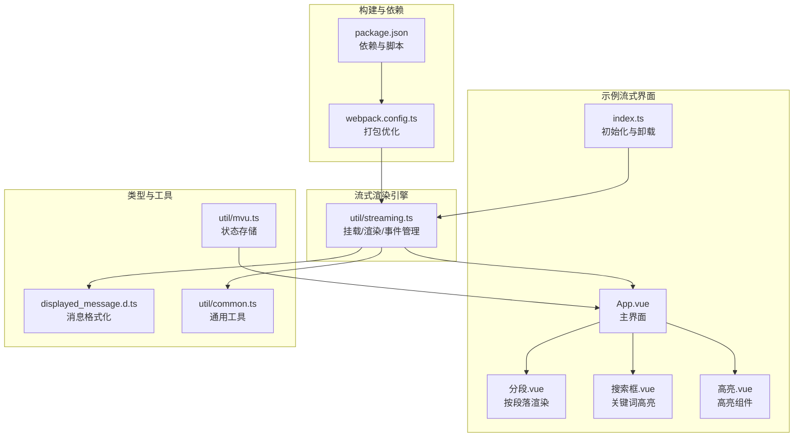
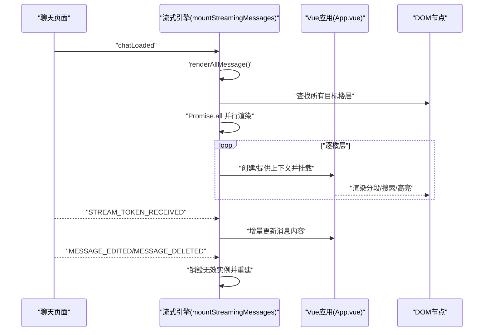
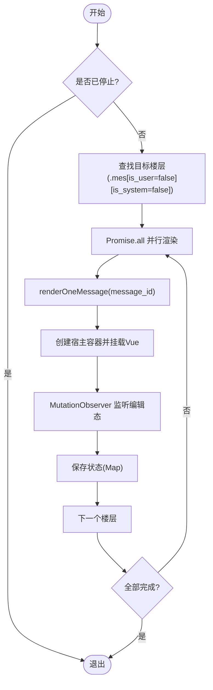
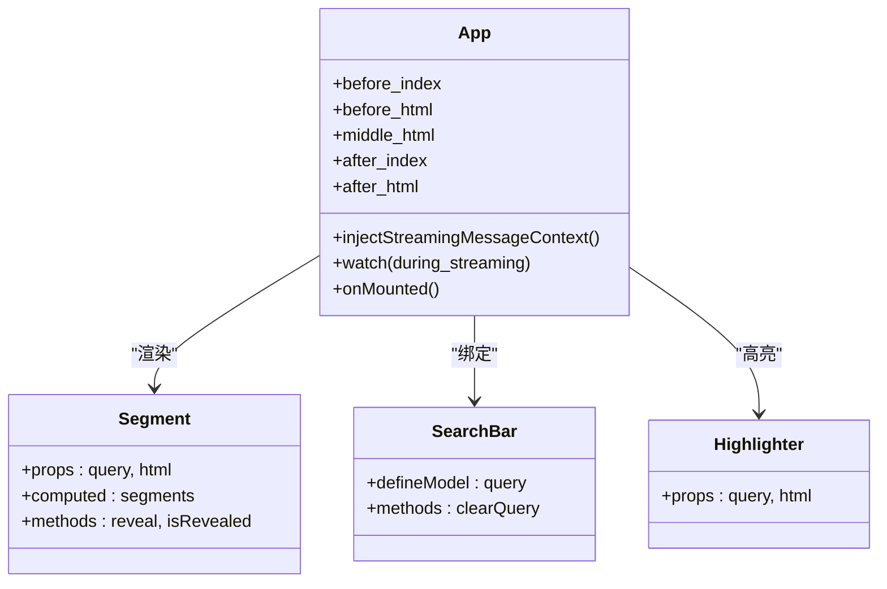
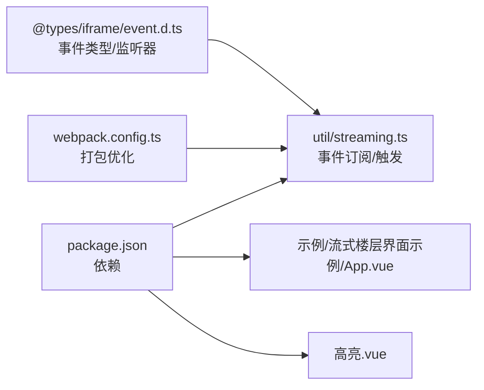

# 性能优化策略

<cite>
**本文引用的文件**
- [util/streaming.ts](file://util/streaming.ts)
- [示例/流式楼层界面示例/App.vue](file://示例/流式楼层界面示例/App.vue)
- [示例/流式楼层界面示例/index.ts](file://示例/流式楼层界面示例/index.ts)
- [示例/流式楼层界面示例/分段.vue](file://示例/流式楼层界面示例/分段.vue)
- [示例/流式楼层界面示例/搜索框.vue](file://示例/流式楼层界面示例/搜索框.vue)
- [示例/流式楼层界面示例/高亮.vue](file://示例/流式楼层界面示例/高亮.vue)
- [@types/函数/displayed_message.d.ts](file://@types/函数/displayed_message.d.ts)
- [util/common.ts](file://util/common.ts)
- [util/mvu.ts](file://util/mvu.ts)
- [package.json](file://package.json)
- [webpack.config.ts](file://webpack.config.ts)
- [参考脚本示例/@types/iframe/event.d.ts](file://参考脚本示例/@types/iframe/event.d.ts)
</cite>

## 目录
1. [简介](#简介)
2. [项目结构](#项目结构)
3. [核心组件](#核心组件)
4. [架构总览](#架构总览)
5. [详细组件分析](#详细组件分析)
6. [依赖关系分析](#依赖关系分析)
7. [性能考量](#性能考量)
8. [故障排查指南](#故障排查指南)
9. [结论](#结论)
10. [附录](#附录)

## 简介
本文件面向“流式界面性能优化”的专业需求，系统梳理并解释以下关键主题：
- 流式界面的性能瓶颈与优化路径：DOM 操作优化、内存使用控制、渲染性能提升策略
- 流式消息的批量处理机制：Promise.all 并行渲染、延迟加载策略、组件复用优化
- 事件监听器管理：MutationObserver 使用、事件清理策略、内存泄漏防护
- 性能监控与调试：性能指标采集、渲染时间分析、内存使用统计
- 具体优化案例与最佳实践

## 项目结构
该项目围绕“流式楼层界面”展开，核心由以下模块构成：
- 流式挂载与渲染引擎：位于 util/streaming.ts，负责将 Vue 组件挂载到每个聊天楼层，并通过事件驱动实现增量渲染
- 示例流式界面：位于 示例/流式楼层界面示例，包含 App.vue 主入口与若干子组件（分段、搜索框、高亮）
- 类型与工具：@types/函数/displayed_message.d.ts 提供消息格式化能力；util/common.ts 提供通用工具；util/mvu.ts 提供状态存储与轮询更新
- 构建与打包：webpack.config.ts 配置生产环境优化与代码分割；package.json 管理依赖与脚本

**图表来源**
- [util/streaming.ts:1-238](file://util/streaming.ts#L1-L238)
- [示例/流式楼层界面示例/App.vue:1-72](file://示例/流式楼层界面示例/App.vue#L1-L72)
- [示例/流式楼层界面示例/index.ts:1-8](file://示例/流式楼层界面示例/index.ts#L1-L8)
- [示例/流式楼层界面示例/分段.vue:1-79](file://示例/流式楼层界面示例/分段.vue#L1-L79)
- [示例/流式楼层界面示例/搜索框.vue:1-95](file://示例/流式楼层界面示例/搜索框.vue#L1-L95)
- [示例/流式楼层界面示例/高亮.vue:1-20](file://示例/流式楼层界面示例/高亮.vue#L1-L20)
- [@types/函数/displayed_message.d.ts:1-71](file://@types/函数/displayed_message.d.ts#L1-L71)
- [util/common.ts:1-135](file://util/common.ts#L1-L135)
- [util/mvu.ts:1-66](file://util/mvu.ts#L1-L66)
- [webpack.config.ts:450-524](file://webpack.config.ts#L450-L524)
- [package.json:1-120](file://package.json#L1-L120)

**章节来源**
- [util/streaming.ts:1-238](file://util/streaming.ts#L1-L238)
- [示例/流式楼层界面示例/index.ts:1-8](file://示例/流式楼层界面示例/index.ts#L1-L8)
- [webpack.config.ts:450-524](file://webpack.config.ts#L450-L524)

## 核心组件
- 流式挂载与渲染引擎（mountStreamingMessages）：负责将 Vue 应用挂载到每个聊天楼层，支持 iframe/div 两种宿主模式，提供事件监听、增量渲染、组件销毁与样式隔离
- 示例流式界面（App.vue）：基于上下文注入的流式消息数据，拆分前后段落，结合搜索与高亮组件实现交互式展示
- 子组件体系：分段.vue（按段落渲染与延迟展开）、搜索框.vue（关键词输入与清空）、高亮.vue（词匹配高亮）
- 类型与工具：displayed_message.d.ts 提供消息格式化；common.ts 提供 UUID、分块等工具；mvu.ts 提供状态存储与定时轮询

**章节来源**
- [util/streaming.ts:41-238](file://util/streaming.ts#L41-L238)
- [示例/流式楼层界面示例/App.vue:16-72](file://示例/流式楼层界面示例/App.vue#L16-L72)
- [@types/函数/displayed_message.d.ts:23-46](file://@types/函数/displayed_message.d.ts#L23-L46)
- [util/common.ts:62-68](file://util/common.ts#L62-L68)
- [util/mvu.ts:3-66](file://util/mvu.ts#L3-L66)

## 架构总览
流式界面采用“事件驱动 + 批量并行渲染”的架构：
- 事件驱动：监听聊天加载、消息渲染、消息编辑/删除、更多消息加载、流式令牌到达等事件，触发增量渲染
- 批量并行：renderAllMessage 使用 Promise.all 并行处理所有目标楼层，显著降低总渲染时间
- 组件复用：同一 prefix 下的多个楼层共享宿主容器，避免重复创建 DOM；当消息无效或超出范围时及时销毁
- 样式隔离：iframe 模式下通过 teleportStyle 隔离样式，div 模式下继承宿主样式但需注意类名冲突

**图表来源**
- [util/streaming.ts:164-186](file://util/streaming.ts#L164-L186)
- [util/streaming.ts:194-217](file://util/streaming.ts#L194-L217)
- [示例/流式楼层界面示例/App.vue:23-71](file://示例/流式楼层界面示例/App.vue#L23-L71)

**章节来源**
- [util/streaming.ts:164-217](file://util/streaming.ts#L164-L217)

## 详细组件分析

### 流式挂载与渲染引擎（mountStreamingMessages）
- 关键职责
  - 将 Vue 应用挂载到每个聊天楼层，支持 iframe/div 两种宿主模式
  - 通过事件系统驱动渲染：chatLoaded、CHARACTER_MESSAGE_RENDERED、MESSAGE_EDITED、MESSAGE_DELETED、MORE_MESSAGES_LOADED、STREAM_TOKEN_RECEIVED
  - 使用 Map 维护每个 message_id 的状态，实现组件复用与销毁
  - 使用 MutationObserver 监听编辑态切换，动态隐藏/显示原生文本与自定义容器
- 性能要点
  - Promise.all 并行渲染：renderAllMessage 对所有目标楼层并发执行 renderOneMessage
  - 销毁策略：destroyAllInvalid 与 destroyIfInvalid 及时清理失效实例，防止内存泄漏
  - 样式隔离：iframe 模式下通过 teleportStyle 隔离样式，div 模式下继承宿主样式
- 事件清理
  - scopedEventOn 收集 stop 函数，在 unmount 时统一调用，确保事件监听器释放

**图表来源**
- [util/streaming.ts:164-186](file://util/streaming.ts#L164-L186)
- [util/streaming.ts:63-162](file://util/streaming.ts#L63-L162)

**章节来源**
- [util/streaming.ts:41-238](file://util/streaming.ts#L41-L238)

### 示例流式界面（App.vue）
- 功能概述
  - 注入流式消息上下文，根据消息内容拆分为前/中/后三段
  - 结合搜索框与高亮组件，实现关键词高亮与交互式浏览
  - 监听 during_streaming 状态变化，提示渲染完成
- 性能建议
  - 使用 computed 缓存拆分结果，避免重复计算
  - 在高亮组件中尽量减少不必要的 DOM 重排与回流

**图表来源**
- [示例/流式楼层界面示例/App.vue:16-72](file://示例/流式楼层界面示例/App.vue#L16-L72)
- [示例/流式楼层界面示例/分段.vue:18-45](file://示例/流式楼层界面示例/分段.vue#L18-L45)
- [示例/流式楼层界面示例/搜索框.vue:18-24](file://示例/流式楼层界面示例/搜索框.vue#L18-L24)
- [示例/流式楼层界面示例/高亮.vue:7-11](file://示例/流式楼层界面示例/高亮.vue#L7-L11)

**章节来源**
- [示例/流式楼层界面示例/App.vue:16-72](file://示例/流式楼层界面示例/App.vue#L16-L72)

### 子组件：分段.vue
- 功能概述
  - 将 HTML 按换行拆分为段落，支持点击展开与模糊遮罩
- 性能建议
  - 使用 Set 记录已展开段落，避免重复渲染
  - 段落数较多时可考虑虚拟滚动或分页加载

**章节来源**
- [示例/流式楼层界面示例/分段.vue:18-45](file://示例/流式楼层界面示例/分段.vue#L18-L45)

### 子组件：搜索框.vue 与高亮.vue
- 功能概述
  - 搜索框提供关键词输入与清空；高亮组件基于 vue-word-highlighter 实现词匹配高亮
- 性能建议
  - 高亮查询应使用防抖；大文本高亮时建议限制高亮范围或分块处理

**章节来源**
- [示例/流式楼层界面示例/搜索框.vue:18-24](file://示例/流式楼层界面示例/搜索框.vue#L18-L24)
- [示例/流式楼层界面示例/高亮.vue:7-11](file://示例/流式楼层界面示例/高亮.vue#L7-L11)

### 类型与工具：消息格式化与通用工具
- displayed_message.d.ts
  - 提供 formatAsDisplayedMessage，将字符串转换为酒馆显示的 HTML 格式，便于在流式界面中安全渲染
- common.ts
  - 提供 uuidv4 用于生成唯一前缀；提供 chunkBy 等工具，可用于分块处理与批量化

**章节来源**
- [@types/函数/displayed_message.d.ts:23-46](file://@types/函数/displayed_message.d.ts#L23-L46)
- [util/common.ts:62-68](file://util/common.ts#L62-L68)
- [util/common.ts:17-31](file://util/common.ts#L17-L31)

### 状态存储与轮询（mvu.ts）
- 功能概述
  - 基于 Pinia 的状态存储，定时轮询变量更新，深比较后忽略无变化更新，减少不必要渲染
- 性能建议
  - 合理设置轮询间隔；对大型对象使用深拷贝前先进行浅层判断

**章节来源**
- [util/mvu.ts:29-60](file://util/mvu.ts#L29-L60)

## 依赖关系分析
- 事件系统
  - 事件类型与监听器接口定义于 @types/iframe/event.d.ts，流式引擎通过 eventOn/eventMakeFirst/eventEmit 等进行事件订阅与触发
- 构建优化
  - webpack.config.ts 配置了最小化、代码分割、LimitChunkCountPlugin 等，有助于减小包体积与提升加载性能
- 依赖管理
  - package.json 管理 Vue、jQuery、lodash、pinia、vue-word-highlighter 等依赖，直接影响渲染与交互性能

**图表来源**
- [参考脚本示例/@types/iframe/event.d.ts:1-140](file://参考脚本示例/@types/iframe/event.d.ts#L1-L140)
- [util/streaming.ts:189-222](file://util/streaming.ts#L189-L222)
- [webpack.config.ts:450-524](file://webpack.config.ts#L450-L524)
- [package.json:15-107](file://package.json#L15-L107)

**章节来源**
- [参考脚本示例/@types/iframe/event.d.ts:1-140](file://参考脚本示例/@types/iframe/event.d.ts#L1-L140)
- [util/streaming.ts:189-222](file://util/streaming.ts#L189-L222)
- [webpack.config.ts:450-524](file://webpack.config.ts#L450-L524)
- [package.json:15-107](file://package.json#L15-L107)

## 性能考量
- DOM 操作优化
  - 使用 createScriptIdIframe/createScriptIdDiv 创建宿主容器，避免频繁创建/销毁
  - 通过 .hidden! 与条件渲染控制可见性，减少不必要的布局与绘制
  - MutationObserver 仅监听编辑态切换，避免全局 DOM 变更风暴
- 内存使用控制
  - Map 维护每个 message_id 的状态，销毁时同时断开观察器与移除 DOM
  - destroyAllInvalid 与 destroyIfInvalid 及时清理失效实例，防止内存泄漏
- 渲染性能提升
  - Promise.all 并行渲染显著缩短总渲染时间
  - computed 缓存拆分结果，减少重复计算
  - 高亮组件使用防抖与范围限制，避免大文本高亮导致的卡顿
- 样式隔离与兼容
  - iframe 模式下通过 teleportStyle 隔离样式，避免与宿主样式冲突
  - div 模式下避免使用 mes_text 类名，防止影响编辑功能

**章节来源**
- [util/streaming.ts:63-162](file://util/streaming.ts#L63-L162)
- [示例/流式楼层界面示例/App.vue:27-58](file://示例/流式楼层界面示例/App.vue#L27-L58)
- [示例/流式楼层界面示例/高亮.vue:7-11](file://示例/流式楼层界面示例/高亮.vue#L7-L11)

## 故障排查指南
- 常见问题与定位
  - 事件未触发：检查 scopedEventOn 是否正确注册，确认事件类型与监听器顺序
  - 渲染异常：确认 renderOneMessage 的 message_id 有效性与范围，检查 destroyIfInvalid 的判定逻辑
  - 样式错乱：div 模式下避免使用 mes_text 类名；iframe 模式下确认 teleportStyle 是否生效
  - 内存泄漏：确认 unmount 是否调用，stop_list 是否全部执行，observer 是否断开
- 调试建议
  - 使用浏览器性能面板记录渲染时间线，定位长任务
  - 使用内存快照对比挂载/卸载前后的对象数量
  - 在 renderAllMessage 中增加日志，统计并行渲染耗时

**章节来源**
- [util/streaming.ts:189-237](file://util/streaming.ts#L189-L237)
- [示例/流式楼层界面示例/index.ts:4-7](file://示例/流式楼层界面示例/index.ts#L4-L7)

## 结论
通过事件驱动与 Promise.all 并行渲染，结合组件复用、样式隔离与完善的事件清理机制，本项目在保证功能完整性的同时实现了良好的性能表现。建议在后续迭代中进一步引入虚拟滚动、高亮防抖与内存快照分析，持续优化大规模消息场景下的用户体验。

## 附录
- 最佳实践清单
  - 使用 Promise.all 并行渲染，避免串行阻塞
  - 严格管理事件监听器生命周期，确保卸载时全部断开
  - 使用 computed 缓存计算结果，减少重复渲染
  - 在 div 模式下避免使用可能影响编辑功能的类名
  - 对大文本高亮实施范围限制与防抖策略
  - 定期进行内存快照与性能分析，及时发现泄漏与瓶颈