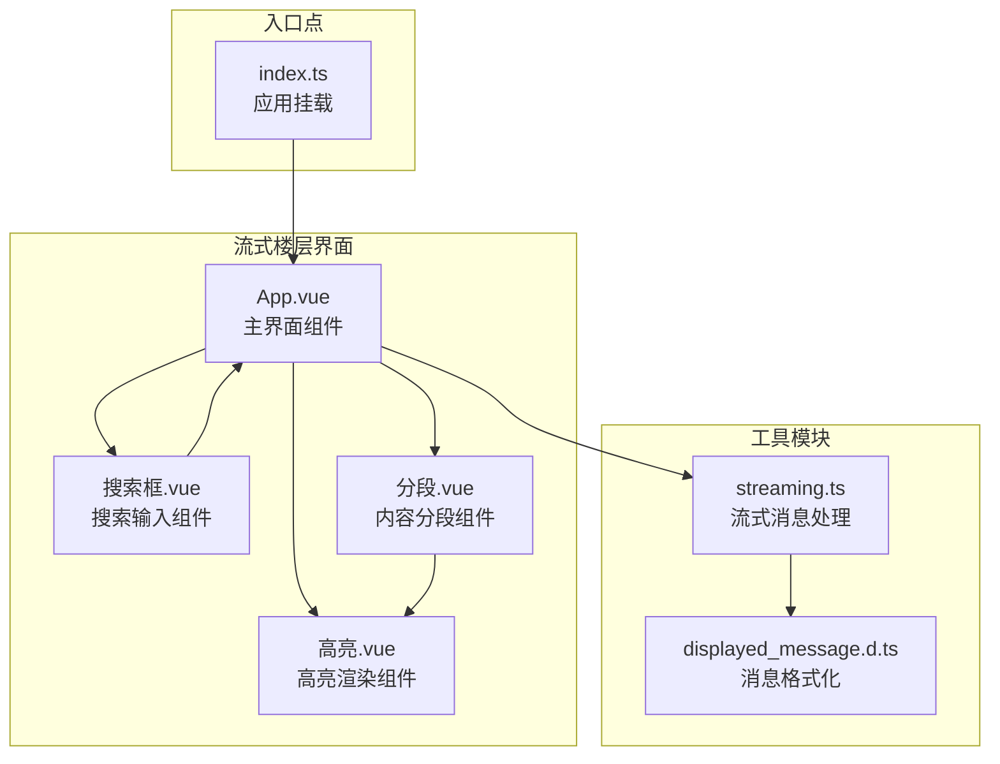
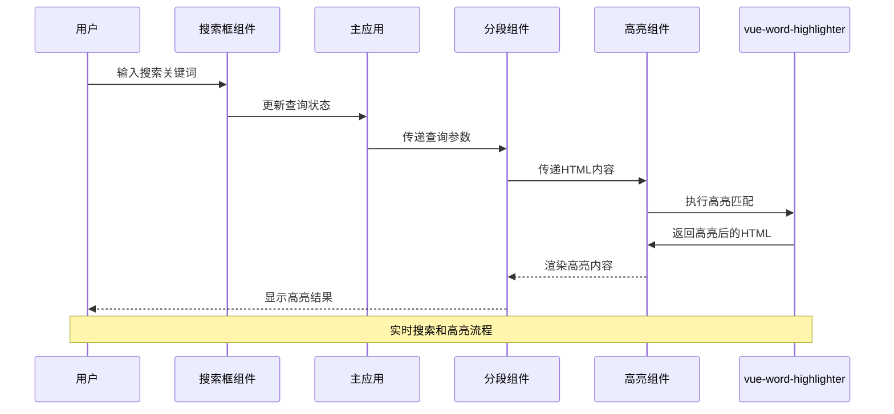
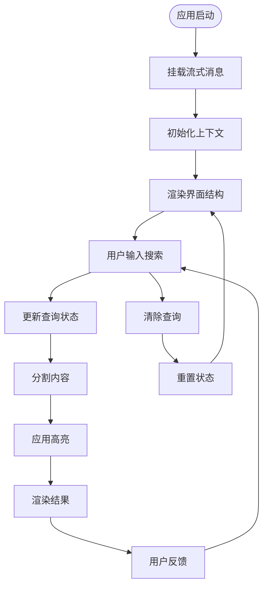
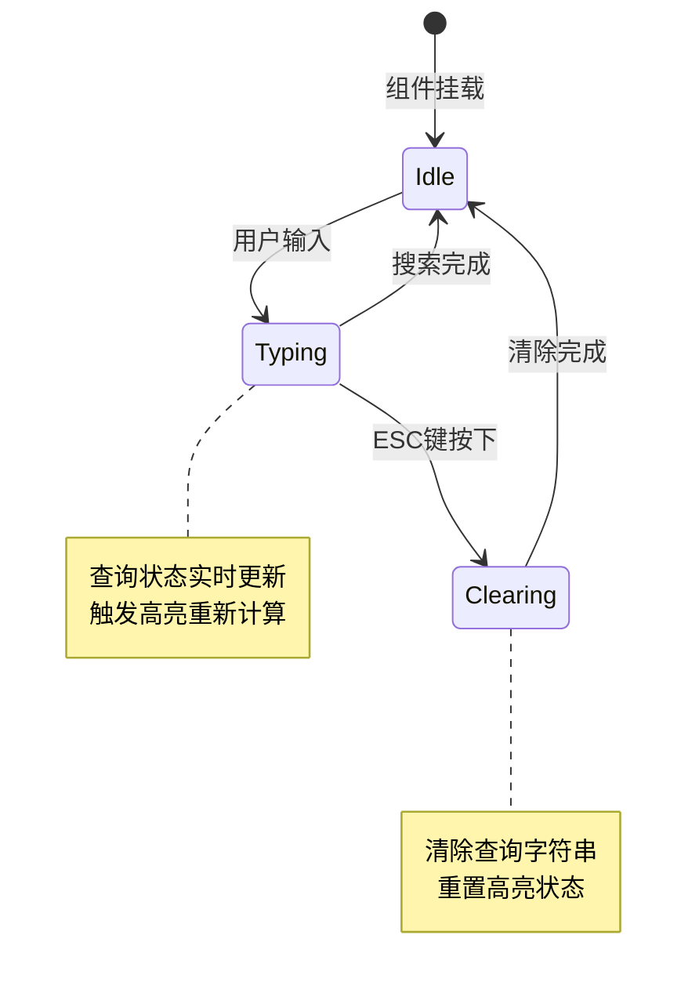
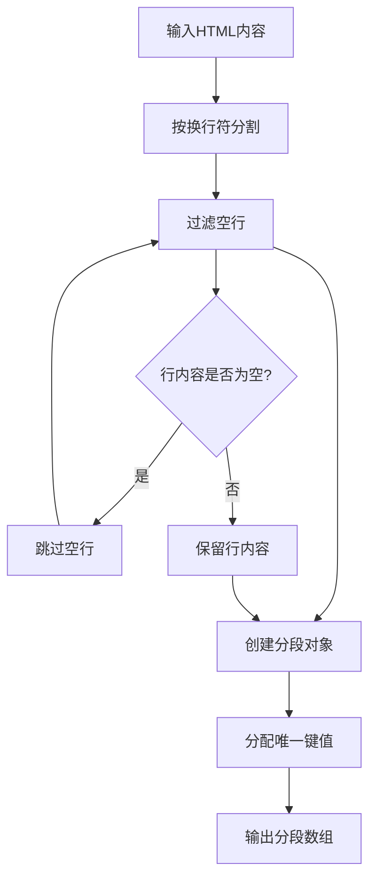
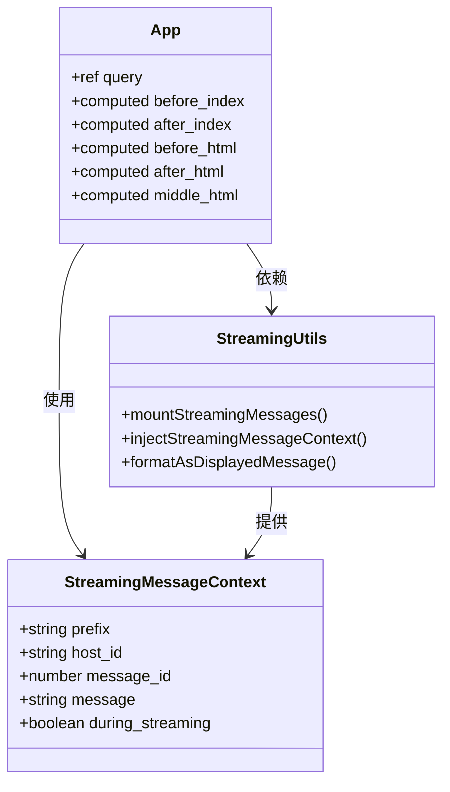
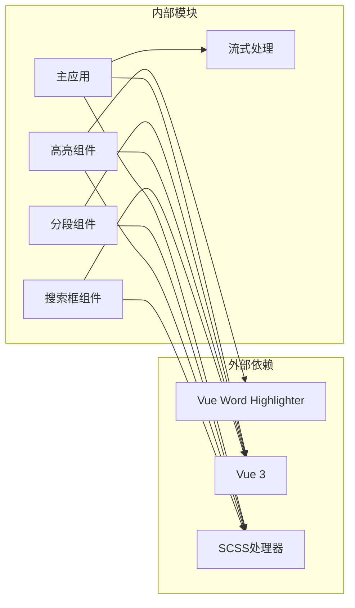

# 搜索和高亮功能

<cite>
**本文档引用的文件**
- [App.vue](file://示例/流式楼层界面示例/App.vue)
- [index.ts](file://示例/流式楼层界面示例/index.ts)
- [搜索框.vue](file://示例/流式楼层界面示例/搜索框.vue)
- [高亮.vue](file://示例/流式楼层界面示例/高亮.vue)
- [分段.vue](file://示例/流式楼层界面示例/分段.vue)
- [streaming.ts](file://util/streaming.ts)
- [displayed_message.d.ts](file://@types/function/displayed_message.d.ts)
</cite>

## 目录
1. [简介](#简介)
2. [项目结构](#项目结构)
3. [核心组件](#核心组件)
4. [架构概览](#架构概览)
5. [详细组件分析](#详细组件分析)
6. [依赖关系分析](#依赖关系分析)
7. [性能考虑](#性能考虑)
8. [故障排除指南](#故障排除指南)
9. [结论](#结论)

## 简介

本文档深入解析流式界面的搜索和高亮功能实现。该系统提供了实时搜索、关键词匹配和高亮显示机制，专门针对流式消息界面进行了优化。系统采用Vue 3 Composition API构建，集成了流式消息处理、实时搜索和智能高亮功能。

## 项目结构

流式楼层界面示例展示了完整的搜索和高亮功能实现：

**图表来源**
- [App.vue:1-72](file://示例/流式楼层界面示例/App.vue#L1-L72)
- [index.ts:1-8](file://示例/流式楼层界面示例/index.ts#L1-L8)
- [streaming.ts:1-238](file://util/streaming.ts#L1-L238)

**章节来源**
- [App.vue:1-72](file://示例/流式楼层界面示例/App.vue#L1-L72)
- [index.ts:1-8](file://示例/流式楼层界面示例/index.ts#L1-L8)

## 核心组件

### 搜索框组件

搜索框组件实现了实时搜索功能，提供用户友好的交互体验：

- **双向数据绑定**：通过`v-model`实现与父组件的状态同步
- **键盘快捷键支持**：ESC键快速清除搜索关键词
- **视觉反馈**：焦点状态下的样式变化
- **清除功能**：一键清除当前搜索关键词

### 高亮组件

高亮组件基于`vue-word-highlighter`库实现智能文本高亮：

- **词级匹配**：精确的关键词匹配算法
- **样式定制**：可配置的高亮样式类
- **HTML安全**：支持HTML内容的安全高亮
- **性能优化**：高效的DOM操作策略

### 内容分段组件

分段组件处理长文本的分段显示和延迟加载：

- **按行分割**：智能的文本行分割算法
- **渐进显示**：支持内容的逐步展开
- **模糊效果**：未展开内容的模糊遮罩
- **交互控制**：点击展开的用户交互

**章节来源**
- [搜索框.vue:1-95](file://示例/流式楼层界面示例/搜索框.vue#L1-L95)
- [高亮.vue:1-20](file://示例/流式楼层界面示例/高亮.vue#L1-L20)
- [分段.vue:1-79](file://示例/流式楼层界面示例/分段.vue#L1-L79)

## 架构概览

系统采用分层架构设计，实现了搜索功能与流式界面的深度集成：

**图表来源**
- [App.vue:16-25](file://示例/流式楼层界面示例/App.vue#L16-L25)
- [搜索框.vue:18-24](file://示例/流式楼层界面示例/搜索框.vue#L18-L24)
- [分段.vue:18-44](file://示例/流式楼层界面示例/分段.vue#L18-L44)
- [高亮.vue:7-11](file://示例/流式楼层界面示例/高亮.vue#L7-L11)

### 数据流架构

**图表来源**
- [index.ts:4-7](file://示例/流式楼层界面示例/index.ts#L4-L7)
- [App.vue:60-71](file://示例/流式楼层界面示例/App.vue#L60-L71)

## 详细组件分析

### 搜索框组件实现

搜索框组件采用响应式设计，实现了完整的搜索功能：

#### 核心功能特性

- **实时状态管理**：通过`defineModel`实现双向数据绑定
- **键盘事件处理**：支持ESC键快速清除功能
- **样式系统**：基于CSS自定义属性的主题适配
- **焦点管理**：动态的焦点状态样式变化

#### 组件交互流程

**图表来源**
- [搜索框.vue:19-24](file://示例/流式楼层界面示例/搜索框.vue#L19-L24)

**章节来源**
- [搜索框.vue:1-95](file://示例/流式楼层界面示例/搜索框.vue#L1-L95)

### 高亮组件工作原理

高亮组件基于`vue-word-highlighter`库实现智能文本匹配：

#### 匹配算法机制

- **词边界检测**：精确识别单词边界
- **大小写不敏感**：支持灵活的匹配模式
- **HTML标签保护**：避免破坏HTML结构
- **特殊字符处理**：正确处理转义字符

#### 样式应用策略

- **CSS类定制**：通过`highlight-class`属性配置样式
- **主题适配**：基于CSS自定义属性的颜色系统
- **样式隔离**：避免影响全局样式表

**章节来源**
- [高亮.vue:1-20](file://示例/流式楼层界面示例/高亮.vue#L1-L20)

### 内容分段组件实现

分段组件实现了长文本的智能分段和渐进显示：

#### 分割算法

**图表来源**
- [分段.vue:32-44](file://示例/流式楼层界面示例/分段.vue#L32-L44)

#### 渐进显示机制

- **状态管理**：使用Set集合跟踪已显示的分段
- **模糊效果**：未显示分段的模糊遮罩
- **点击展开**：用户交互式的分段展开
- **视觉反馈**：展开提示的动画效果

**章节来源**
- [分段.vue:1-79](file://示例/流式楼层界面示例/分段.vue#L1-L79)

### 流式界面集成

系统与流式界面的集成通过以下机制实现：

#### 上下文注入

**图表来源**
- [streaming.ts:8-19](file://util/streaming.ts#L8-L19)
- [App.vue:23-58](file://示例/流式楼层界面示例/App.vue#L23-L58)

#### 实时更新机制

- **消息监听**：监听流式消息的接收事件
- **状态同步**：实时更新搜索状态
- **DOM更新**：动态更新高亮显示
- **内存管理**：有效的组件生命周期管理

**章节来源**
- [streaming.ts:41-238](file://util/streaming.ts#L41-L238)
- [App.vue:60-71](file://示例/流式楼层界面示例/App.vue#L60-L71)

## 依赖关系分析

系统采用模块化设计，各组件间依赖关系清晰：

**图表来源**
- [搜索框.vue:8](file://示例/流式楼层界面示例/搜索框.vue#L8)
- [高亮.vue:8](file://示例/流式楼层界面示例/高亮.vue#L8)
- [分段.vue:19](file://示例/流式楼层界面示例/分段.vue#L19)

### 关键依赖特性

- **轻量级依赖**：仅依赖`vue-word-highlighter`实现高亮功能
- **无副作用**：不引入额外的运行时依赖
- **类型安全**：完整的TypeScript类型定义
- **样式隔离**：SCSS作用域确保样式不冲突

**章节来源**
- [streaming.ts:1-238](file://util/streaming.ts#L1-L238)

## 性能考虑

系统在设计时充分考虑了性能优化：

### 渲染优化

- **虚拟DOM最小化**：仅在查询状态变化时重新渲染
- **计算属性缓存**：利用Vue的响应式系统缓存计算结果
- **条件渲染**：根据内容状态选择性渲染组件
- **懒加载策略**：分段内容的延迟加载机制

### 内存管理

- **组件销毁**：正确清理事件监听器和定时器
- **状态清理**：及时释放不再使用的数据结构
- **垃圾回收**：避免内存泄漏的编程实践

### 用户体验优化

- **即时反馈**：搜索输入的实时响应
- **加载指示**：长时间操作的进度反馈
- **错误处理**：优雅的错误恢复机制
- **无障碍支持**：键盘导航和屏幕阅读器支持

## 故障排除指南

### 常见问题及解决方案

#### 搜索功能异常

**问题**：搜索框无法输入或高亮无效
**原因**：组件状态未正确初始化
**解决**：检查`defineModel`的使用和响应式数据绑定

#### 高亮显示错误

**问题**：高亮标记破坏了HTML结构
**原因**：HTML内容包含特殊字符
**解决**：使用`formatAsDisplayedMessage`进行安全转换

#### 性能问题

**问题**：大量内容时渲染缓慢
**原因**：一次性处理过多DOM节点
**解决**：启用分段显示和渐进加载

**章节来源**
- [高亮.vue:14-19](file://示例/流式楼层界面示例/高亮.vue#L14-L19)
- [分段.vue:23-29](file://示例/流式楼层界面示例/分段.vue#L23-L29)

### 调试技巧

- **开发者工具**：使用Vue DevTools监控组件状态
- **控制台日志**：添加必要的调试信息
- **性能分析**：使用浏览器性能面板分析瓶颈
- **单元测试**：为关键功能编写测试用例

## 结论

流式界面的搜索和高亮功能通过精心设计的组件架构和优化的算法实现了优秀的用户体验。系统的主要优势包括：

1. **实时响应**：毫秒级的搜索响应和高亮更新
2. **智能匹配**：精确的关键词匹配和HTML安全处理
3. **性能优化**：高效的渲染策略和内存管理
4. **用户体验**：直观的界面设计和流畅的交互体验

该系统为流式消息界面提供了完整的搜索解决方案，具有良好的扩展性和维护性，可以作为类似应用场景的参考实现。