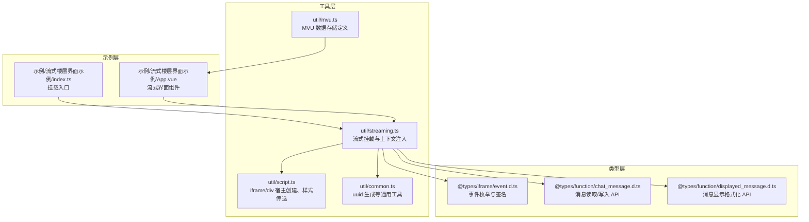
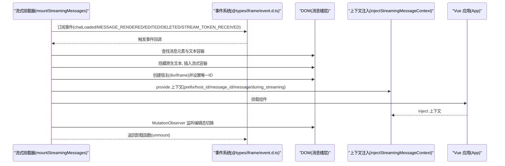
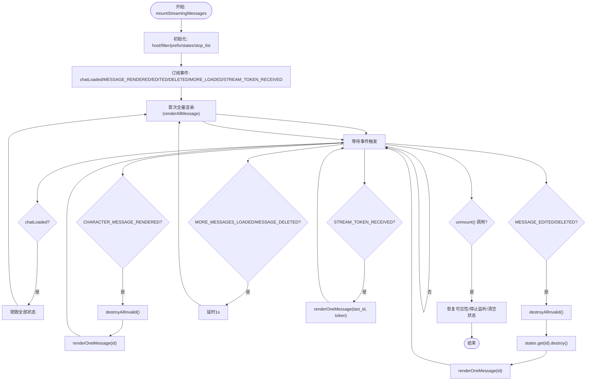
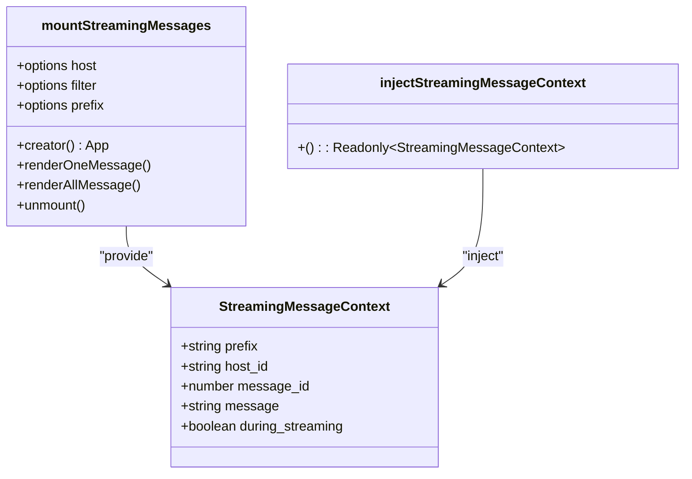
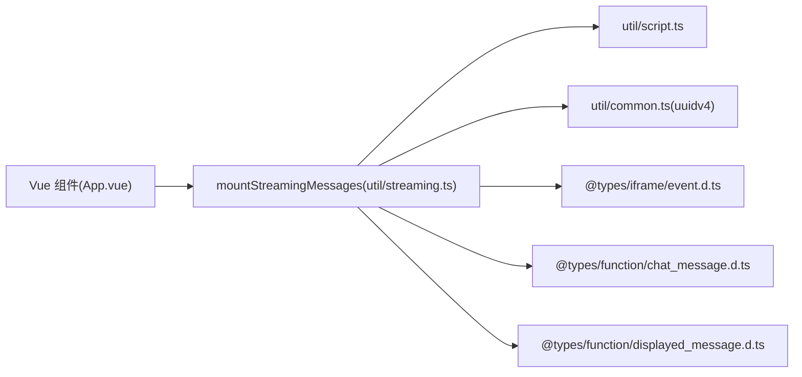

# 流式消息处理

<cite>
**本文引用的文件**
- [util/streaming.ts](file://util/streaming.ts)
- [util/script.ts](file://util/script.ts)
- [util/common.ts](file://util/common.ts)
- [示例/流式楼层界面示例/index.ts](file://示例/流式楼层界面示例/index.ts)
- [示例/流式楼层界面示例/App.vue](file://示例/流式楼层界面示例/App.vue)
- [@types/iframe/event.d.ts](file://@types/iframe/event.d.ts)
- [@types/function/chat_message.d.ts](file://@types/function/chat_message.d.ts)
- [@types/function/displayed_message.d.ts](file://@types/function/displayed_message.d.ts)
- [util/mvu.ts](file://util/mvu.ts)
</cite>

## 目录
1. [简介](#简介)
2. [项目结构](#项目结构)
3. [核心组件](#核心组件)
4. [架构总览](#架构总览)
5. [详细组件分析](#详细组件分析)
6. [依赖关系分析](#依赖关系分析)
7. [性能考量](#性能考量)
8. [故障排查指南](#故障排查指南)
9. [结论](#结论)
10. [附录](#附录)

## 简介
本文件面向“流式消息处理系统”的技术文档，围绕以下目标展开：  
- 深入解释流式消息的架构设计与消息上下文注入机制  
- 解释实时消息更新策略（基于事件驱动）的实现原理  
- 详解 mountStreamingMessages 函数的工作流程（消息 ID 映射、DOM 操作、组件挂载与卸载）  
- 说明流式消息的生命周期管理（渲染、更新、销毁）  
- 提供使用示例与最佳实践（host 类型选择、过滤器配置、前缀标识符的使用）

## 项目结构
本项目采用“工具函数 + 示例 + 类型声明”相结合的方式组织流式消息处理能力：
- 工具层：提供流式挂载、样式传送、UUID 生成等通用能力
- 类型层：定义事件、消息读写、显示格式化等 API
- 示例层：演示如何挂载 Vue 组件到流式消息区域

图表来源
- [util/streaming.ts:1-238](file://util/streaming.ts#L1-L238)
- [util/script.ts:1-47](file://util/script.ts#L1-L47)
- [util/common.ts:62-68](file://util/common.ts#L62-L68)
- [util/mvu.ts:1-66](file://util/mvu.ts#L1-L66)
- [@types/iframe/event.d.ts:216-276](file://@types/iframe/event.d.ts#L216-L276)
- [@types/function/chat_message.d.ts:56-104](file://@types/function/chat_message.d.ts#L56-L104)
- [@types/function/displayed_message.d.ts:21-71](file://@types/function/displayed_message.d.ts#L21-L71)
- [示例/流式楼层界面示例/index.ts:1-8](file://示例/流式楼层界面示例/index.ts#L1-L8)
- [示例/流式楼层界面示例/App.vue:1-72](file://示例/流式楼层界面示例/App.vue#L1-L72)

章节来源
- [util/streaming.ts:1-238](file://util/streaming.ts#L1-L238)
- [util/script.ts:1-47](file://util/script.ts#L1-L47)
- [util/common.ts:62-68](file://util/common.ts#L62-L68)
- [util/mvu.ts:1-66](file://util/mvu.ts#L1-L66)
- [@types/iframe/event.d.ts:216-276](file://@types/iframe/event.d.ts#L216-L276)
- [@types/function/chat_message.d.ts:56-104](file://@types/function/chat_message.d.ts#L56-L104)
- [@types/function/displayed_message.d.ts:21-71](file://@types/function/displayed_message.d.ts#L21-L71)
- [示例/流式楼层界面示例/index.ts:1-8](file://示例/流式楼层界面示例/index.ts#L1-L8)
- [示例/流式楼层界面示例/App.vue:1-72](file://示例/流式楼层界面示例/App.vue#L1-L72)

## 核心组件
- 流式消息上下文类型 StreamingMessageContext：提供 prefix、host_id、message_id、message、during_streaming 等字段，供组件通过依赖注入获取
- injectStreamingMessageContext：注入当前流式消息上下文
- mountStreamingMessages：主入口，负责将组件挂载到指定消息楼层，支持 iframe/div 宿主、过滤器、前缀标识符、事件驱动的实时更新与卸载

章节来源
- [util/streaming.ts:5-19](file://util/streaming.ts#L5-L19)
- [util/streaming.ts:41-44](file://util/streaming.ts#L41-L44)

## 架构总览
系统通过事件驱动与 DOM 操作实现“消息级”流式界面挂载。核心流程如下：
- 初始化：根据 options(host、filter、prefix) 创建状态映射 Map<number, State>
- 事件监听：监听聊天加载、消息渲染、消息编辑/删除、更多消息加载、流式令牌接收等事件
- 渲染策略：按需渲染单条消息或全量消息；在渲染时隐藏原生文本、插入流式容器、创建宿主节点、注入上下文并挂载组件
- 生命周期：组件卸载时恢复原生文本、移除宿主与观察者、清理状态映射
- 卸载：统一停止事件监听、恢复可见性、清理全部状态

图表来源
- [util/streaming.ts:41-238](file://util/streaming.ts#L41-L238)
- [@types/iframe/event.d.ts:216-276](file://@types/iframe/event.d.ts#L216-L276)

## 详细组件分析

### mountStreamingMessages 工作流程详解
- 参数与默认值
  - host: 默认 'iframe'，便于样式隔离与复杂界面
  - filter: 可选过滤器，仅对符合条件的消息挂载流式界面
  - prefix: 前缀标识符，默认使用 UUID 保证唯一性
- 状态管理
  - states: Map<number, { app, data, destroy }>
  - has_stoped: 控制是否继续处理事件
- 事件驱动渲染
  - chatLoaded: 全量销毁并重建
  - CHARACTER_MESSAGE_RENDERED: 单条渲染，优先处理最新消息
  - MESSAGE_EDITED/MESSAGE_DELETED: 先销毁再重建
  - MORE_MESSAGES_LOADED/MESSAGE_DELETED: 延迟 1s 全量重建
  - STREAM_TOKEN_RECEIVED: 将最新消息标记为“正在流式”，并传入增量片段
- 渲染单条消息(renderOneMessage)
  - 校验消息 ID 有效性，若无效则销毁
  - 隐藏原生文本与 TH-streaming，插入流式容器
  - 若宿主已存在，则复用并更新 data.message 与 during_streaming
  - 否则创建宿主(div/iframe)，注入上下文并挂载组件
  - 使用 MutationObserver 监听编辑态切换，动态控制可见性
  - 记录状态，提供 destroy 回收资源
- 全量渲染(renderAllMessage)
  - 遍历非用户/非系统消息，逐条调用 renderOneMessage
  - 可选触发 CHARACTER_MESSAGE_RENDERED 事件以联动外部逻辑
- 卸载(unmount)
  - 恢复可见性、遍历销毁、停止事件监听、置 has_stoped

图表来源
- [util/streaming.ts:41-238](file://util/streaming.ts#L41-L238)

章节来源
- [util/streaming.ts:41-238](file://util/streaming.ts#L41-L238)

### 消息上下文注入机制
- 上下文类型 StreamingMessageContext：包含 prefix、host_id、message_id、message、during_streaming
- 注入函数 injectStreamingMessageContext：通过 provide/inject 将上下文注入到组件树
- 组件使用：在 setup 中注入 context，即可读取当前消息的上下文并驱动 UI 更新

图表来源
- [util/streaming.ts:5-19](file://util/streaming.ts#L5-L19)
- [util/streaming.ts:41-44](file://util/streaming.ts#L41-L44)

章节来源
- [util/streaming.ts:5-19](file://util/streaming.ts#L5-L19)
- [util/streaming.ts:41-44](file://util/streaming.ts#L41-L44)

### DOM 元素操作与宿主选择
- 宿主类型
  - iframe：创建带 srcdoc 的 iframe，挂载后传送样式，适合复杂界面与 Tailwind
  - div：创建 div 作为宿主，继承页面样式，禁用 mes_text 类名，不建议使用 Tailwind
- DOM 结构
  - 隐藏原生文本(.mes_text)与 TH-streaming
  - 插入流式容器(.mes_streaming)，并在其后追加宿主
  - 宿主 ID 为 `${prefix}-${message_id}`，确保唯一性
- 样式处理
  - iframe 模式：在 load 后将脚本样式传送到 iframe head
  - div 模式：通过 teleportStyle 将样式克隆到目标容器

章节来源
- [util/streaming.ts:21-40](file://util/streaming.ts#L21-L40)
- [util/streaming.ts:108-127](file://util/streaming.ts#L108-L127)
- [util/script.ts:13-36](file://util/script.ts#L13-L36)

### 实时消息更新策略
- 事件驱动
  - chatLoaded：聊天加载完成后全量重建
  - CHARACTER_MESSAGE_RENDERED：消息渲染完成，优先处理该消息
  - MESSAGE_EDITED/MESSAGE_DELETED：编辑或删除后销毁并重建
  - MORE_MESSAGES_LOADED/MESSAGE_DELETED：加载更多或删除后延时重建
  - STREAM_TOKEN_RECEIVED：收到流式片段，更新对应消息的 during_streaming 与 message
- 编辑态观察
  - 使用 MutationObserver 监听编辑区切换，动态控制流式界面与原生文本的可见性

章节来源
- [util/streaming.ts:188-237](file://util/streaming.ts#L188-L237)
- [@types/iframe/event.d.ts:216-276](file://@types/iframe/event.d.ts#L216-L276)

### 生命周期管理
- 渲染：renderOneMessage 与 renderAllMessage
- 更新：通过事件回调与上下文 reactive 数据驱动
- 销毁：destroy 回调中恢复可见性、卸载组件、移除宿主、断开观察者、清理状态
- 卸载：unmount 统一停止事件监听、恢复可见性、清理全部状态

章节来源
- [util/streaming.ts:142-162](file://util/streaming.ts#L142-L162)
- [util/streaming.ts:224-237](file://util/streaming.ts#L224-L237)

### 使用示例与最佳实践
- host 类型选择
  - iframe：推荐用于复杂界面，样式隔离好
  - div：简单界面或需要继承页面样式的场景
- 过滤器配置
  - filter(message_id, message)：仅对满足条件的消息挂载流式界面
- 前缀标识符
  - prefix：用于生成宿主 ID `${prefix}-${message_id}`，避免冲突
- 示例路径
  - 挂载入口：[示例/流式楼层界面示例/index.ts:1-8](file://示例/流式楼层界面示例/index.ts#L1-L8)
  - 组件实现：[示例/流式楼层界面示例/App.vue:1-72](file://示例/流式楼层界面示例/App.vue#L1-L72)

章节来源
- [示例/流式楼层界面示例/index.ts:1-8](file://示例/流式楼层界面示例/index.ts#L1-L8)
- [示例/流式楼层界面示例/App.vue:1-72](file://示例/流式楼层界面示例/App.vue#L1-L72)

## 依赖关系分析
- mountStreamingMessages 依赖
  - 工具：createScriptIdDiv/createScriptIdIframe、teleportStyle、uuidv4
  - 类型：事件枚举、消息读取/写入、显示格式化
  - 示例：Vue 组件通过 inject 获取上下文
- 关键耦合点
  - 事件系统：依赖 @types/iframe/event.d.ts 中的事件常量
  - DOM：依赖消息楼层的选择器与类名约定
  - Vue：通过 provide/inject 传递上下文

图表来源
- [util/streaming.ts:1-3](file://util/streaming.ts#L1-L3)
- [util/script.ts:1-47](file://util/script.ts#L1-L47)
- [util/common.ts:62-68](file://util/common.ts#L62-L68)
- [@types/iframe/event.d.ts:216-276](file://@types/iframe/event.d.ts#L216-L276)
- [@types/function/chat_message.d.ts:56-104](file://@types/function/chat_message.d.ts#L56-L104)
- [@types/function/displayed_message.d.ts:21-71](file://@types/function/displayed_message.d.ts#L21-L71)
- [示例/流式楼层界面示例/App.vue:17-23](file://示例/流式楼层界面示例/App.vue#L17-L23)

章节来源
- [util/streaming.ts:1-3](file://util/streaming.ts#L1-L3)
- [util/script.ts:1-47](file://util/script.ts#L1-L47)
- [util/common.ts:62-68](file://util/common.ts#L62-L68)
- [@types/iframe/event.d.ts:216-276](file://@types/iframe/event.d.ts#L216-L276)
- [@types/function/chat_message.d.ts:56-104](file://@types/function/chat_message.d.ts#L56-L104)
- [@types/function/displayed_message.d.ts:21-71](file://@types/function/displayed_message.d.ts#L21-L71)
- [示例/流式楼层界面示例/App.vue:17-23](file://示例/流式楼层界面示例/App.vue#L17-L23)

## 性能考量
- 事件节流与延迟
  - MORE_MESSAGES_LOADED/MESSAGE_DELETED 后延时 1s 再重建，避免频繁 DOM 操作
- 按需渲染
  - CHARACTER_MESSAGE_RENDERED 事件仅处理受影响的消息
- 状态复用
  - 已存在宿主时复用并更新 reactive 数据，减少重复挂载
- 样式传送
  - iframe 模式在 load 后传送样式，避免主线程阻塞

章节来源
- [util/streaming.ts:212-217](file://util/streaming.ts#L212-L217)
- [util/streaming.ts:77-90](file://util/streaming.ts#L77-L90)
- [util/streaming.ts:120-127](file://util/streaming.ts#L120-L127)

## 故障排查指南
- 消息 ID 无效
  - 现象：状态被销毁且不渲染
  - 排查：确认消息 ID 是否在有效范围内
- 宿主样式异常
  - iframe：检查 load 事件是否触发，确认样式传送是否生效
  - div：确认未使用 mes_text 类名，避免影响编辑功能
- 编辑态切换不生效
  - 检查 MutationObserver 是否正确绑定与断开
- 事件未触发
  - 确认事件名称与类型是否匹配 @types/iframe/event.d.ts
- 组件未注入上下文
  - 确认组件中使用 injectStreamingMessageContext 获取上下文

章节来源
- [util/streaming.ts:50-57](file://util/streaming.ts#L50-L57)
- [util/streaming.ts:129-140](file://util/streaming.ts#L129-L140)
- [@types/iframe/event.d.ts:216-276](file://@types/iframe/event.d.ts#L216-L276)
- [示例/流式楼层界面示例/App.vue:23](file://示例/流式楼层界面示例/App.vue#L23)

## 结论
本系统通过事件驱动与 DOM 操作实现了“消息级”的流式界面挂载，具备良好的扩展性与可维护性。mountStreamingMessages 提供了灵活的宿主选择、过滤器与前缀标识符，结合上下文注入与生命周期管理，能够稳定地支撑复杂交互场景。

## 附录
- 相关 API 与类型
  - 事件枚举与签名：[@types/iframe/event.d.ts:216-276](file://@types/iframe/event.d.ts#L216-L276)
  - 消息读取/写入：[@types/function/chat_message.d.ts:56-104](file://@types/function/chat_message.d.ts#L56-L104)
  - 消息显示格式化：[@types/function/displayed_message.d.ts:21-71](file://@types/function/displayed_message.d.ts#L21-L71)
  - MVU 数据存储：[util/mvu.ts:1-66](file://util/mvu.ts#L1-L66)
- 示例入口
  - 挂载入口：[示例/流式楼层界面示例/index.ts:1-8](file://示例/流式楼层界面示例/index.ts#L1-L8)
  - 组件实现：[示例/流式楼层界面示例/App.vue:1-72](file://示例/流式楼层界面示例/App.vue#L1-L72)