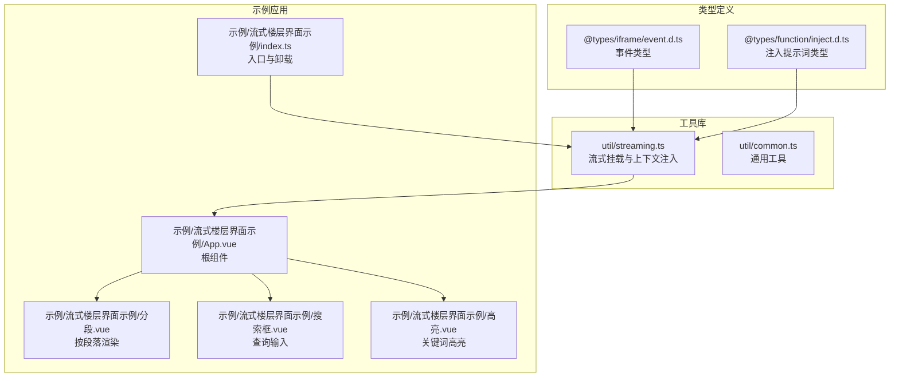
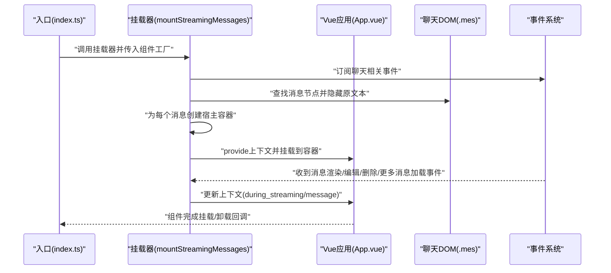
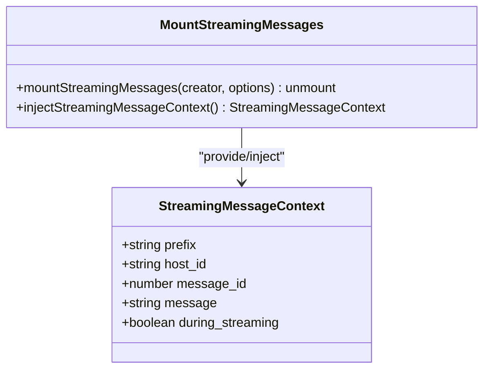
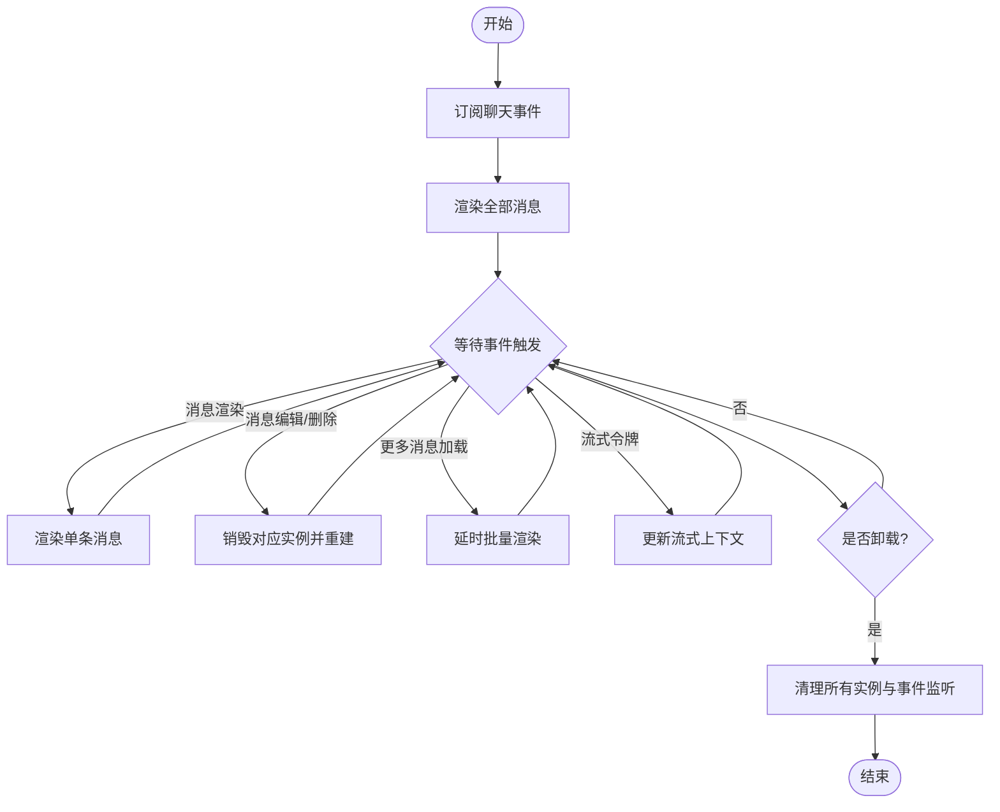
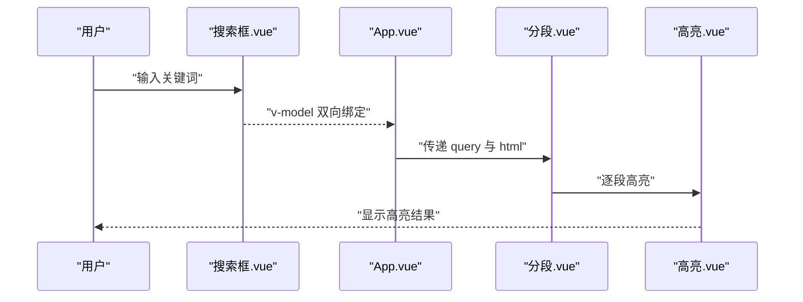
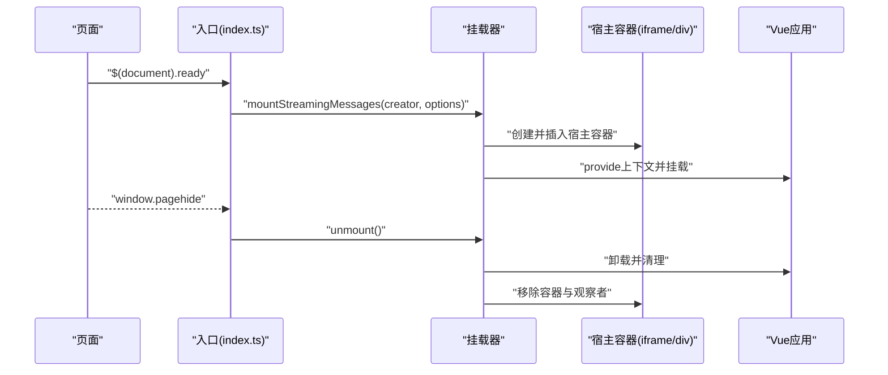
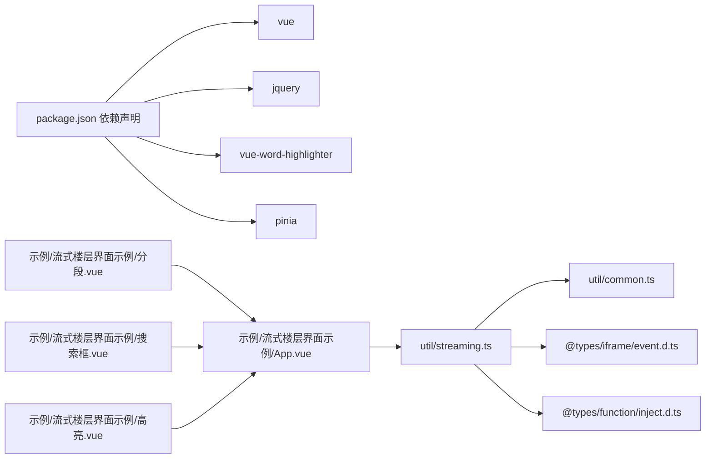

# 流式界面支持

<cite>
**本文引用的文件**
- [util/streaming.ts](file://util/streaming.ts)
- [示例/流式楼层界面示例/App.vue](file://示例/流式楼层界面示例/App.vue)
- [示例/流式楼层界面示例/index.ts](file://示例/流式楼层界面示例/index.ts)
- [示例/流式楼层界面示例/分段.vue](file://示例/流式楼层界面示例/分段.vue)
- [示例/流式楼层界面示例/搜索框.vue](file://示例/流式楼层界面示例/搜索框.vue)
- [示例/流式楼层界面示例/高亮.vue](file://示例/流式楼层界面示例/高亮.vue)
- [util/common.ts](file://util/common.ts)
- [@types/iframe/event.d.ts](file://@types/iframe/event.d.ts)
- [@types/function/inject.d.ts](file://@types/function/inject.d.ts)
- [package.json](file://package.json)
</cite>

## 目录
1. [简介](#简介)
2. [项目结构](#项目结构)
3. [核心组件](#核心组件)
4. [架构总览](#架构总览)
5. [详细组件分析](#详细组件分析)
6. [依赖关系分析](#依赖关系分析)
7. [性能考虑](#性能考虑)
8. [故障排查指南](#故障排查指南)
9. [结论](#结论)
10. [附录](#附录)

## 简介
本文件面向希望在“酒馆”（SillyTavern）环境中构建高效流式用户界面的开发者，系统性阐述流式消息处理架构、消息上下文注入机制、实时消息更新策略、搜索与高亮功能的实现原理，并给出组件挂载与卸载机制、生命周期管理、性能优化策略及与主界面的集成方式。文档同时提供可直接定位到源码的路径指引，便于快速查阅与二次开发。

## 项目结构
该仓库围绕“流式界面支持”提供了核心工具库与示例应用：
- 工具库位于 util 目录，其中 streaming.ts 提供了流式消息挂载与上下文注入能力；common.ts 提供通用工具方法。
- 示例位于 示例/流式楼层界面示例，展示如何基于工具库构建可交互的流式楼层界面，包括搜索、分段与高亮等特性。
- 类型定义位于 @types，用于约束事件、注入提示词等扩展接口。

图表来源
- [util/streaming.ts:1-238](file://util/streaming.ts#L1-L238)
- [示例/流式楼层界面示例/index.ts:1-8](file://示例/流式楼层界面示例/index.ts#L1-L8)
- [示例/流式楼层界面示例/App.vue:1-72](file://示例/流式楼层界面示例/App.vue#L1-L72)
- [示例/流式楼层界面示例/分段.vue:1-79](file://示例/流式楼层界面示例/分段.vue#L1-L79)
- [示例/流式楼层界面示例/搜索框.vue:1-95](file://示例/流式楼层界面示例/搜索框.vue#L1-L95)
- [示例/流式楼层界面示例/高亮.vue:1-20](file://示例/流式楼层界面示例/高亮.vue#L1-L20)
- [@types/iframe/event.d.ts](file://@types/iframe/event.d.ts)
- [@types/function/inject.d.ts:1-47](file://@types/function/inject.d.ts#L1-L47)

章节来源
- [util/streaming.ts:1-238](file://util/streaming.ts#L1-L238)
- [示例/流式楼层界面示例/index.ts:1-8](file://示例/流式楼层界面示例/index.ts#L1-L8)
- [示例/流式楼层界面示例/App.vue:1-72](file://示例/流式楼层界面示例/App.vue#L1-L72)
- [@types/iframe/event.d.ts](file://@types/iframe/event.d.ts)
- [@types/function/inject.d.ts:1-47](file://@types/function/inject.d.ts#L1-L47)

## 核心组件
- 流式消息上下文注入
  - 通过 provide/inject 机制向子组件注入响应式上下文，包含消息 ID、消息体、是否处于流式传输中等字段。
  - 上下文由 mountStreamingMessages 在每个消息节点上创建并注入，确保子组件可感知当前消息状态。
- 流式界面挂载器
  - 支持两种宿主模式：iframe 与 div。iframe 模式可隔离样式，适合复杂界面；div 模式继承宿主样式，需避免使用特定类名以免影响编辑功能。
  - 通过事件驱动渲染，自动处理消息加载、编辑、删除、更多消息加载等场景。
- 搜索与高亮
  - 搜索框组件提供关键词输入与清空；高亮组件基于第三方库实现关键词高亮；分段组件按行拆分并支持点击展开。
- MVU 数据存储（可选）
  - 提供基于 Pinia 的 MVU 数据存储定义，支持变量驱动的数据持久化与轮询更新，便于在流式界面中维护状态。

章节来源
- [util/streaming.ts:5-19](file://util/streaming.ts#L5-L19)
- [util/streaming.ts:41-238](file://util/streaming.ts#L41-L238)
- [示例/流式楼层界面示例/搜索框.vue:1-95](file://示例/流式楼层界面示例/搜索框.vue#L1-L95)
- [示例/流式楼层界面示例/高亮.vue:1-20](file://示例/流式楼层界面示例/高亮.vue#L1-L20)
- [示例/流式楼层界面示例/分段.vue:1-79](file://示例/流式楼层界面示例/分段.vue#L1-L79)
- [util/mvu.ts:1-66](file://util/mvu.ts#L1-L66)

## 架构总览
下图展示了从入口到组件渲染、事件驱动更新与卸载的全链路：

图表来源
- [示例/流式楼层界面示例/index.ts:1-8](file://示例/流式楼层界面示例/index.ts#L1-L8)
- [util/streaming.ts:41-238](file://util/streaming.ts#L41-L238)
- [示例/流式楼层界面示例/App.vue:1-72](file://示例/流式楼层界面示例/App.vue#L1-L72)

## 详细组件分析

### 流式消息上下文注入机制
- 上下文结构
  - 包含 prefix、host_id、message_id、message、during_streaming 等字段，用于支撑组件内部逻辑与样式隔离。
- 注入方式
  - 通过 Vue 的 provide/inject，在每个消息节点对应的宿主容器中注入上下文，子组件使用 injectStreamingMessageContext 获取只读上下文。
- 生命周期
  - 上下文随组件实例生命周期存在，组件卸载时自动清理。

图表来源
- [util/streaming.ts:5-19](file://util/streaming.ts#L5-L19)
- [util/streaming.ts:17-19](file://util/streaming.ts#L17-L19)
- [util/streaming.ts:41-44](file://util/streaming.ts#L41-L44)

章节来源
- [util/streaming.ts:5-19](file://util/streaming.ts#L5-L19)
- [util/streaming.ts:17-19](file://util/streaming.ts#L17-L19)

### 实时消息更新策略
- 事件驱动
  - 订阅聊天加载、消息渲染、消息编辑、消息删除、更多消息加载、流式令牌接收等事件，确保在不同状态下正确更新界面。
- 渲染策略
  - 针对单条消息与全部消息分别提供渲染函数，支持销毁无效实例、重建宿主容器、更新上下文数据。
- 编辑态适配
  - 当进入编辑态时，自动隐藏流式界面并恢复原生文本显示，退出编辑态后恢复流式界面。

图表来源
- [util/streaming.ts:188-238](file://util/streaming.ts#L188-L238)
- [util/streaming.ts:164-186](file://util/streaming.ts#L164-L186)
- [util/streaming.ts:63-162](file://util/streaming.ts#L63-L162)

章节来源
- [util/streaming.ts:188-238](file://util/streaming.ts#L188-L238)
- [util/streaming.ts:164-186](file://util/streaming.ts#L164-L186)
- [util/streaming.ts:63-162](file://util/streaming.ts#L63-L162)

### 搜索与高亮功能
- 搜索框
  - 提供 v-model 绑定的查询输入，支持清空与回车 ESC 行为。
- 高亮组件
  - 基于第三方高亮库，将查询词以指定样式类高亮，样式不使用 scoped 以避免与主界面 mark 样式冲突。
- 分段组件
  - 将 HTML 内容按行拆分为段落，支持点击展开隐藏段落，配合高亮组件实现逐行高亮。

图表来源
- [示例/流式楼层界面示例/搜索框.vue:1-95](file://示例/流式楼层界面示例/搜索框.vue#L1-L95)
- [示例/流式楼层界面示例/App.vue:16-71](file://示例/流式楼层界面示例/App.vue#L16-L71)
- [示例/流式楼层界面示例/分段.vue:1-79](file://示例/流式楼层界面示例/分段.vue#L1-L79)
- [示例/流式楼层界面示例/高亮.vue:1-20](file://示例/流式楼层界面示例/高亮.vue#L1-L20)

章节来源
- [示例/流式楼层界面示例/搜索框.vue:1-95](file://示例/流式楼层界面示例/搜索框.vue#L1-L95)
- [示例/流式楼层界面示例/分段.vue:1-79](file://示例/流式楼层界面示例/分段.vue#L1-L79)
- [示例/流式楼层界面示例/高亮.vue:1-20](file://示例/流式楼层界面示例/高亮.vue#L1-L20)

### 组件挂载与卸载机制
- 入口与卸载
  - 入口文件在页面就绪后调用挂载器，返回卸载函数；在页面隐藏时调用卸载，确保资源回收。
- 宿主选择
  - iframe 模式：自动传送样式到 iframe head，避免与主界面样式冲突；div 模式：继承主界面样式，需注意类名与样式隔离。
- 状态管理
  - 使用 Map 维护每个消息的实例状态，包含 app 实例、响应式上下文与销毁函数，统一管理生命周期。

图表来源
- [示例/流式楼层界面示例/index.ts:1-8](file://示例/流式楼层界面示例/index.ts#L1-L8)
- [util/streaming.ts:41-238](file://util/streaming.ts#L41-L238)

章节来源
- [示例/流式楼层界面示例/index.ts:1-8](file://示例/流式楼层界面示例/index.ts#L1-L8)
- [util/streaming.ts:41-238](file://util/streaming.ts#L41-L238)

### 与主界面的集成方式
- DOM 结构适配
  - 通过查找 .mes 节点下的 .mes_text 与自定义容器，隐藏原生文本并在其后插入流式容器，保证编辑功能不受影响。
- 样式隔离
  - iframe 模式下自动传送样式到 iframe head；div 模式下需避免使用可能影响编辑功能的类名。
- 事件桥接
  - 通过事件系统与主界面通信，确保在消息渲染、编辑、删除、更多加载等时机正确更新流式界面。

章节来源
- [util/streaming.ts:77-106](file://util/streaming.ts#L77-L106)
- [util/streaming.ts:120-127](file://util/streaming.ts#L120-L127)

## 依赖关系分析
- 外部依赖
  - Vue 生态（App、provide/inject、响应式）、jQuery（DOM 查询与事件）、第三方高亮库（vue-word-highlighter）、Pinia（MVU 数据存储）。
- 内部依赖
  - streaming.ts 依赖 common.ts 提供的工具方法（如 UUID 生成），并使用 @types 中的事件与注入类型进行类型约束。

图表来源
- [package.json:79-107](file://package.json#L79-L107)
- [util/streaming.ts:1-3](file://util/streaming.ts#L1-L3)
- [@types/iframe/event.d.ts](file://@types/iframe/event.d.ts)
- [@types/function/inject.d.ts:1-47](file://@types/function/inject.d.ts#L1-L47)
- [示例/流式楼层界面示例/App.vue:16-21](file://示例/流式楼层界面示例/App.vue#L16-L21)

章节来源
- [package.json:79-107](file://package.json#L79-L107)
- [util/streaming.ts:1-3](file://util/streaming.ts#L1-L3)
- [@types/iframe/event.d.ts](file://@types/iframe/event.d.ts)
- [@types/function/inject.d.ts:1-47](file://@types/function/inject.d.ts#L1-L47)

## 性能考虑
- 渲染粒度控制
  - 采用按消息粒度渲染与更新，避免全量重绘；在编辑态与非编辑态之间切换时，仅切换可见性，减少 DOM 变更。
- 事件节流与延迟
  - 对“更多消息加载”事件采用延时批量渲染，降低频繁 DOM 操作带来的抖动。
- 样式传送与隔离
  - iframe 模式下仅在 load 事件后传送样式，避免重复计算；div 模式下通过工具函数进行样式传送与回收。
- 数据更新去抖
  - 使用响应式更新与深比较，仅在数据变化时写回变量，减少不必要的重渲染。

章节来源
- [util/streaming.ts:129-140](file://util/streaming.ts#L129-L140)
- [util/streaming.ts:212-214](file://util/streaming.ts#L212-L214)
- [util/streaming.ts:220-221](file://util/streaming.ts#L220-L221)
- [util/mvu.ts:29-60](file://util/mvu.ts#L29-L60)

## 故障排查指南
- 流式界面未显示
  - 检查宿主模式是否正确（iframe/div），div 模式下需避免使用特定类名；确认事件订阅是否生效。
- 编辑功能异常
  - 确认在编辑态时原生文本已恢复显示，流式容器被隐藏；检查 MutationObserver 是否正确断开。
- 高亮样式冲突
  - 高亮组件样式未使用 scoped，若出现冲突请检查主界面 mark 样式覆盖情况。
- 卸载后内存泄漏
  - 确保在页面隐藏或组件卸载时调用 unmount，释放 app 实例、DOM 与事件监听器。

章节来源
- [util/streaming.ts:142-161](file://util/streaming.ts#L142-L161)
- [示例/流式楼层界面示例/高亮.vue:13-19](file://示例/流式楼层界面示例/高亮.vue#L13-L19)
- [示例/流式楼层界面示例/index.ts:4-7](file://示例/流式楼层界面示例/index.ts#L4-L7)

## 结论
该流式界面支持系统通过“事件驱动 + 上下文注入 + 宿主隔离”的架构，实现了对酒馆消息的细粒度流式渲染与交互。结合搜索、分段与高亮等特性，开发者可在不破坏主界面编辑体验的前提下，构建高性能、可维护的流式用户界面。建议在生产环境中优先采用 iframe 宿主模式以获得更好的样式隔离，并严格遵循卸载与资源回收流程。

## 附录
- 关键配置参数
  - 宿主模式：host，默认为 iframe；当选择 div 时需注意样式隔离与类名限制。
  - 过滤器：filter，可按消息 ID 与内容筛选需要挂载流式界面的消息。
  - 前缀：prefix，用于生成唯一宿主 ID，便于多实例共存。
- 使用场景指导
  - 角色扮演选项面板、动态统计面板、分段剧情展示、实时搜索与高亮等。

章节来源
- [util/streaming.ts:41-44](file://util/streaming.ts#L41-L44)
- [示例/流式楼层界面示例/App.vue:23-58](file://示例/流式楼层界面示例/App.vue#L23-L58)