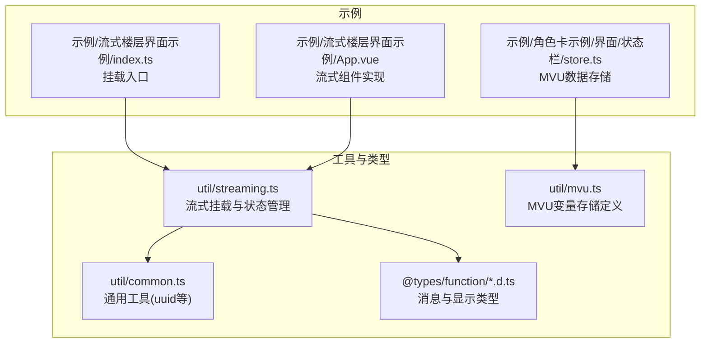
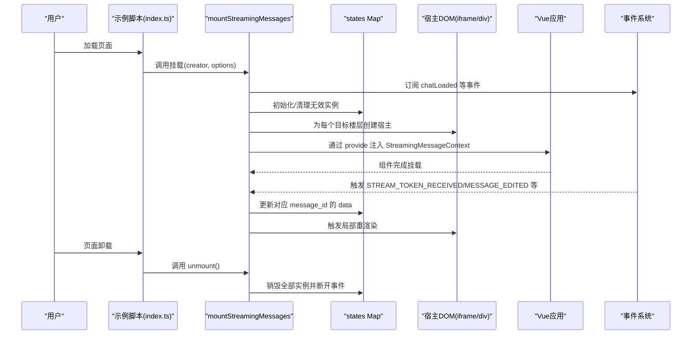
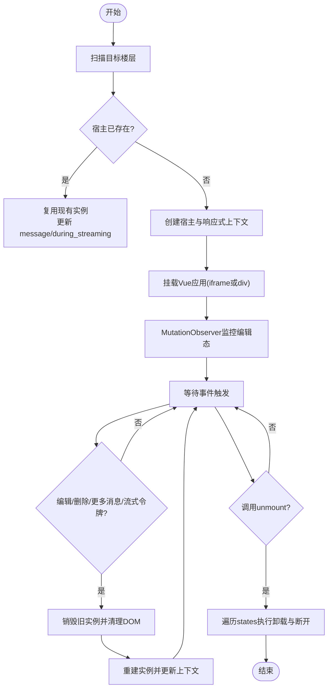
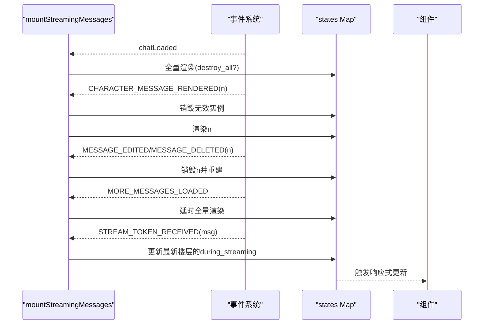
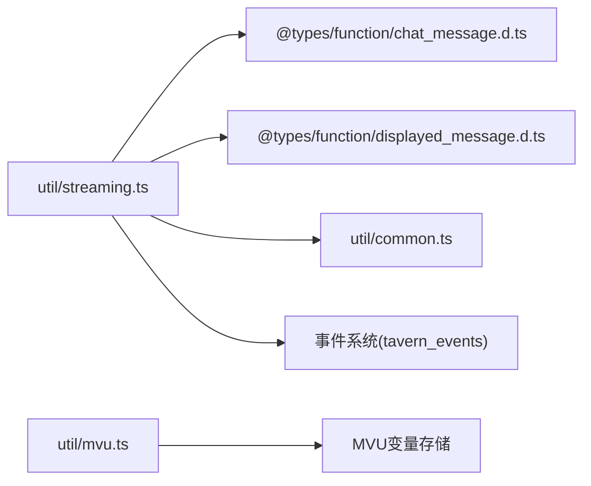

# 流式组件管理

<cite>
**本文引用的文件**
- [util/streaming.ts](file://util/streaming.ts)
- [示例/流式楼层界面示例/App.vue](file://示例/流式楼层界面示例/App.vue)
- [示例/流式楼层界面示例/index.ts](file://示例/流式楼层界面示例/index.ts)
- [@types/function/chat_message.d.ts](file://@types/function/chat_message.d.ts)
- [@types/function/displayed_message.d.ts](file://@types/function/displayed_message.d.ts)
- [util/common.ts](file://util/common.ts)
- [util/mvu.ts](file://util/mvu.ts)
- [示例/角色卡示例/界面/状态栏/store.ts](file://示例/角色卡示例/界面/状态栏/store.ts)
- [示例/脚本示例/加载和卸载时执行函数.ts](file://示例/脚本示例/加载和卸载时执行函数.ts)
- [示例/脚本示例/监听消息修改.ts](file://示例/脚本示例/监听消息修改.ts)
</cite>

## 目录
1. [简介](#简介)
2. [项目结构](#项目结构)
3. [核心组件](#核心组件)
4. [架构总览](#架构总览)
5. [详细组件分析](#详细组件分析)
6. [依赖分析](#依赖分析)
7. [性能考虑](#性能考虑)
8. [故障排查指南](#故障排查指南)
9. [结论](#结论)
10. [附录](#附录)

## 简介
本文件面向“流式组件管理系统”的开发者与使用者，系统性阐述流式组件的生命周期管理、状态跟踪机制与内存管理策略；详解 StreamingMessageContext 数据结构的设计理念与字段作用；给出组件创建、挂载、更新、销毁的完整流程与最佳实践；并提供性能优化、内存泄漏防护与错误处理的实操建议。

## 项目结构
本仓库围绕“流式楼层界面”提供统一的挂载与状态管理能力，核心位于 util/streaming.ts，配套示例位于 示例/流式楼层界面示例，类型定义位于 @types/function 下，MVU 变量系统位于 util/mvu.ts 与示例角色卡界面状态栏 store.ts。

**图表来源**
- [util/streaming.ts:1-238](file://util/streaming.ts#L1-L238)
- [示例/流式楼层界面示例/index.ts:1-8](file://示例/流式楼层界面示例/index.ts#L1-L8)
- [示例/流式楼层界面示例/App.vue:1-72](file://示例/流式楼层界面示例/App.vue#L1-L72)
- [@types/function/chat_message.d.ts:1-235](file://@types/function/chat_message.d.ts#L1-L235)
- [@types/function/displayed_message.d.ts:1-71](file://@types/function/displayed_message.d.ts#L1-L71)
- [util/mvu.ts:1-66](file://util/mvu.ts#L1-L66)
- [示例/角色卡示例/界面/状态栏/store.ts:1-4](file://示例/角色卡示例/界面/状态栏/store.ts#L1-L4)

**章节来源**
- [util/streaming.ts:1-238](file://util/streaming.ts#L1-L238)
- [示例/流式楼层界面示例/index.ts:1-8](file://示例/流式楼层界面示例/index.ts#L1-L8)
- [@types/function/chat_message.d.ts:1-235](file://@types/function/chat_message.d.ts#L1-L235)
- [@types/function/displayed_message.d.ts:1-71](file://@types/function/displayed_message.d.ts#L1-L71)
- [util/mvu.ts:1-66](file://util/mvu.ts#L1-L66)
- [示例/角色卡示例/界面/状态栏/store.ts:1-4](file://示例/角色卡示例/界面/状态栏/store.ts#L1-L4)

## 核心组件
- 流式消息上下文 StreamingMessageContext：为每个消息楼层提供响应式上下文，包含 prefix、host_id、message_id、message、during_streaming 等关键字段，驱动组件渲染与交互。
- 挂载器 mountStreamingMessages：负责扫描聊天楼层、创建/复用宿主容器、注入上下文、安装 Vue 应用、监听事件并进行增量更新与清理。
- 状态映射 states Map：以 message_id 为键，维护每个楼层的组件实例、响应式数据与销毁回调，确保精确的生命周期管理与内存回收。
- 事件驱动更新：基于酒馆助手事件系统，响应消息加载、编辑、删除、更多消息加载、流式令牌接收等，触发局部重渲染或全量同步。

**章节来源**
- [util/streaming.ts:8-19](file://util/streaming.ts#L8-L19)
- [util/streaming.ts:41-237](file://util/streaming.ts#L41-L237)
- [util/streaming.ts:47](file://util/streaming.ts#L47)

## 架构总览
下图展示流式组件从挂载到运行、再到事件驱动更新的整体架构。

**图表来源**
- [util/streaming.ts:41-237](file://util/streaming.ts#L41-L237)
- [示例/流式楼层界面示例/index.ts:1-8](file://示例/流式楼层界面示例/index.ts#L1-L8)

## 详细组件分析

### StreamingMessageContext 数据结构设计
StreamingMessageContext 为流式组件提供统一的响应式上下文，其字段设计如下：
- prefix：组件前缀标识，用于生成宿主 DOM 的唯一 id，避免跨组件冲突。
- host_id：宿主 DOM 的 id，形如 `${prefix}-${message_id}`，便于定位与复用。
- message_id：楼层编号，作为 states Map 的键，确保组件与具体消息的强绑定。
- message：当前楼层的文本内容，供组件读取与渲染。
- during_streaming：布尔标记，指示当前是否处于流式输出阶段，便于组件切换 UI 状态。

设计理念：
- 以 message_id 为核心键，保证组件与消息的稳定映射。
- 通过 prefix 隔离多实例场景，避免 id 冲突。
- 通过 during_streaming 提供流式状态感知，支持组件在流式结束时执行收尾逻辑。

**章节来源**
- [util/streaming.ts:8-19](file://util/streaming.ts#L8-L19)
- [util/streaming.ts:112-118](file://util/streaming.ts#L112-L118)

### 组件生命周期与状态跟踪
- 创建：当目标楼层出现或需要渲染时，mountStreamingMessages 会查找或创建宿主容器，构建响应式上下文，并通过 Vue 的 provide/inject 将上下文注入组件。
- 挂载：根据 host 选项选择 iframe 或 div 作为宿主，iframe 场景会在 load 事件后进行样式传送与挂载；div 场景直接挂载到宿主。
- 更新：监听多种事件，对单个 message_id 执行局部更新；若消息被编辑或删除，则先销毁旧实例再重建。
- 销毁：unmount 时遍历 states Map，逐个卸载组件、移除 DOM、断开观察者与事件监听，确保无残留。

**图表来源**
- [util/streaming.ts:63-162](file://util/streaming.ts#L63-L162)
- [util/streaming.ts:188-237](file://util/streaming.ts#L188-L237)

**章节来源**
- [util/streaming.ts:47](file://util/streaming.ts#L47)
- [util/streaming.ts:188-237](file://util/streaming.ts#L188-L237)

### 组件实例缓存策略与内存管理
- 缓存策略：以 message_id 为键的 states Map 实现按楼层的实例缓存，避免重复创建；当楼层范围变化或消息无效时，通过 destroyIfInvalid 与 destroyAllInvalid 清理过期实例。
- 内存管理：每个实例包含 destroy 回调，负责卸载 Vue 应用、移除 DOM、断开 MutationObserver；unmount 时再次遍历清理，防止内存泄漏。
- 样式隔离：host 为 iframe 时，通过 teleportStyle 将样式传入 iframe head，避免污染酒馆全局样式；div 时需注意样式继承与冲突。

**章节来源**
- [util/streaming.ts:47](file://util/streaming.ts#L47)
- [util/streaming.ts:142-161](file://util/streaming.ts#L142-L161)
- [util/streaming.ts:219-222](file://util/streaming.ts#L219-L222)

### 事件驱动的增量更新流程
- chatLoaded：首次加载时全量渲染目标楼层。
- CHARACTER_MESSAGE_RENDERED：新增或重渲染特定楼层时，先清理无效实例，再渲染该楼层。
- MESSAGE_EDITED/MESSAGE_DELETED：编辑或删除时，销毁对应实例并重建。
- MORE_MESSAGES_LOADED/MESSAGE_DELETED：懒加载更多消息后，延时触发全量渲染。
- STREAM_TOKEN_RECEIVED：收到流式令牌时，针对最新楼层进行局部更新，设置 during_streaming 为真。

**图表来源**
- [util/streaming.ts:194-217](file://util/streaming.ts#L194-L217)

**章节来源**
- [util/streaming.ts:194-217](file://util/streaming.ts#L194-L217)

### MVU 变量系统与流式组件的结合
- MVU 存储：defineMvuDataStore 基于 Zod Schema 定义消息级变量存储，定时轮询与 watch 监听变量变化，自动同步至 stat_data 并持久化。
- 与流式组件协作：流式组件可读取 MVU 数据驱动 UI，例如在流式结束后根据变量状态更新界面；也可在组件内部通过 MVU 接口修改变量，实现动态交互。

**章节来源**
- [util/mvu.ts:3-66](file://util/mvu.ts#L3-L66)
- [示例/角色卡示例/界面/状态栏/store.ts:1-4](file://示例/角色卡示例/界面/状态栏/store.ts#L1-L4)

## 依赖分析
- 与消息系统：依赖 @types/function/chat_message.d.ts 提供的消息查询与设置接口，确保正确获取与更新楼层内容。
- 与显示系统：依赖 @types/function/displayed_message.d.ts 的格式化与刷新能力，保证组件渲染与酒馆显示一致。
- 与通用工具：依赖 util/common.ts 的 uuidv4 生成 prefix，确保多实例唯一性。
- 与事件系统：依赖酒馆助手事件常量与事件发射/订阅机制，实现对消息生命周期的响应。

**图表来源**
- [util/streaming.ts:1-238](file://util/streaming.ts#L1-L238)
- [@types/function/chat_message.d.ts:1-235](file://@types/function/chat_message.d.ts#L1-L235)
- [@types/function/displayed_message.d.ts:1-71](file://@types/function/displayed_message.d.ts#L1-L71)
- [util/common.ts:62-68](file://util/common.ts#L62-L68)
- [util/mvu.ts:1-66](file://util/mvu.ts#L1-L66)

**章节来源**
- [util/streaming.ts:1-238](file://util/streaming.ts#L1-L238)
- [@types/function/chat_message.d.ts:1-235](file://@types/function/chat_message.d.ts#L1-L235)
- [@types/function/displayed_message.d.ts:1-71](file://@types/function/displayed_message.d.ts#L1-L71)
- [util/common.ts:62-68](file://util/common.ts#L62-L68)
- [util/mvu.ts:1-66](file://util/mvu.ts#L1-L66)

## 性能考虑
- 局部更新优先：尽量使用 CHARACTER_MESSAGE_RENDERED 等事件触发局部渲染，减少全量重绘。
- 延时批量：在 MORE_MESSAGES_LOADED 后使用延时触发全量渲染，避免频繁重排。
- DOM 复用：通过 prefix+message_id 的宿主 id 设计，尽可能复用已有实例，减少创建/销毁成本。
- 样式隔离：优先使用 iframe host，避免样式冲突导致的回流与重绘。
- 响应式最小化：在组件内仅监听必要字段，避免不必要的响应式更新。
- 事件去抖：对高频事件（如流式令牌）进行节流或合并处理，降低渲染频率。

[本节为通用性能建议，无需特定文件引用]

## 故障排查指南
- 组件未挂载：检查挂载入口是否在页面加载完成后执行；确认 host 选项与样式隔离需求匹配。
- 无法响应编辑/删除：确认事件监听是否正确注册；检查 destroyIfInvalid 是否提前销毁实例。
- 样式错乱：host 为 div 时需避免使用可能影响酒馆样式的类名；iframe host 会自动隔离样式。
- 内存泄漏：确保在页面卸载时调用 unmount；检查 states Map 是否正确清空；确认 MutationObserver 已断开。
- MVU 数据不同步：检查 defineMvuDataStore 的 schema 与变量写入时机；确认 watch 与轮询逻辑正常。

**章节来源**
- [示例/流式楼层界面示例/index.ts:1-8](file://示例/流式楼层界面示例/index.ts#L1-L8)
- [示例/脚本示例/加载和卸载时执行函数.ts:1-10](file://示例/脚本示例/加载和卸载时执行函数.ts#L1-L10)
- [示例/脚本示例/监听消息修改.ts:1-4](file://示例/脚本示例/监听消息修改.ts#L1-L4)
- [util/streaming.ts:188-237](file://util/streaming.ts#L188-L237)

## 结论
流式组件管理系统通过 StreamingMessageContext 与 mountStreamingMessages 实现了对消息楼层的精细化控制，配合 states Map 与事件驱动机制，实现了高效、稳定的生命周期管理与内存回收。结合 MVU 变量系统，可在流式过程中动态更新界面状态，满足复杂交互场景。遵循本文的最佳实践与故障排查建议，可显著提升性能与稳定性。

[本节为总结性内容，无需特定文件引用]

## 附录

### 使用场景与示例路径
- 在 div 宿主中挂载流式组件：参考 示例/流式楼层界面示例/index.ts。
- 在组件中读取流式上下文：参考 示例/流式楼层界面示例/App.vue。
- 监听消息修改事件：参考 示例/脚本示例/监听消息修改.ts。
- 页面加载/卸载钩子：参考 示例/脚本示例/加载和卸载时执行函数.ts。
- MVU 数据存储定义：参考 示例/角色卡示例/界面/状态栏/store.ts。

**章节来源**
- [示例/流式楼层界面示例/index.ts:1-8](file://示例/流式楼层界面示例/index.ts#L1-L8)
- [示例/流式楼层界面示例/App.vue:16-71](file://示例/流式楼层界面示例/App.vue#L16-L71)
- [示例/脚本示例/监听消息修改.ts:1-4](file://示例/脚本示例/监听消息修改.ts#L1-L4)
- [示例/脚本示例/加载和卸载时执行函数.ts:1-10](file://示例/脚本示例/加载和卸载时执行函数.ts#L1-L10)
- [示例/角色卡示例/界面/状态栏/store.ts:1-4](file://示例/角色卡示例/界面/状态栏/store.ts#L1-L4)