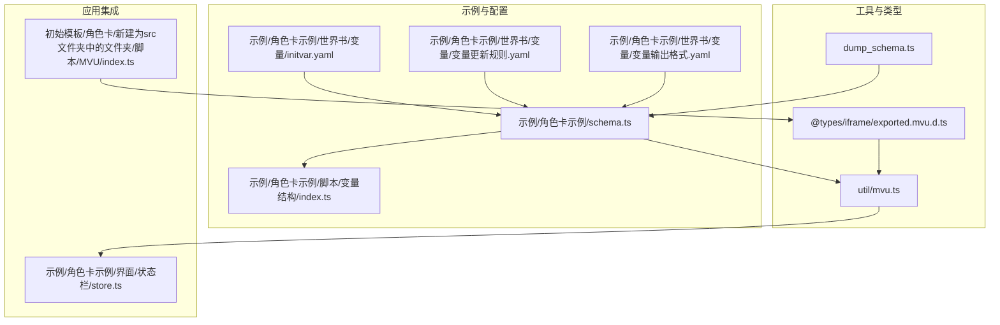
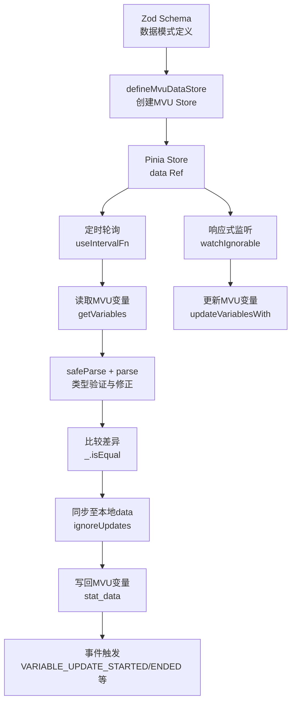
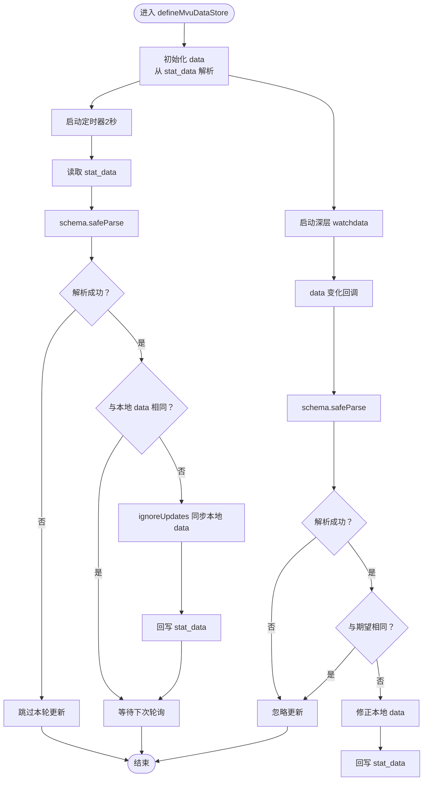
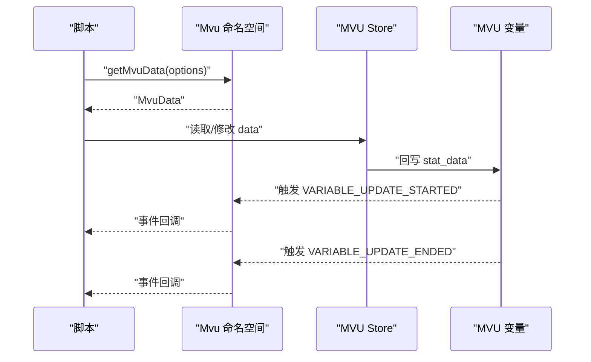
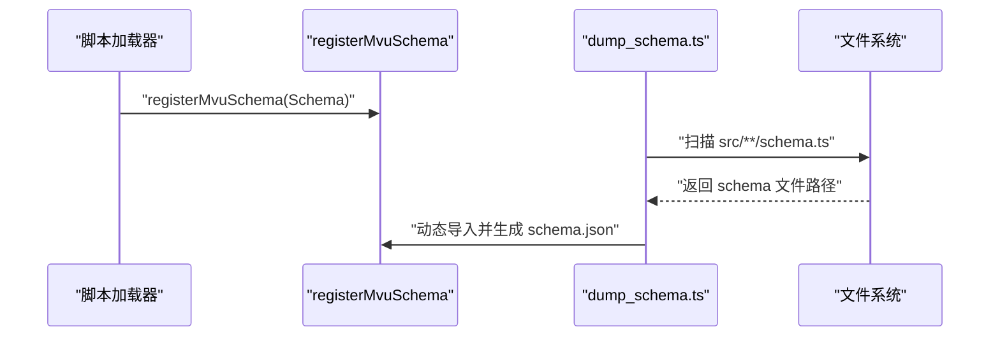
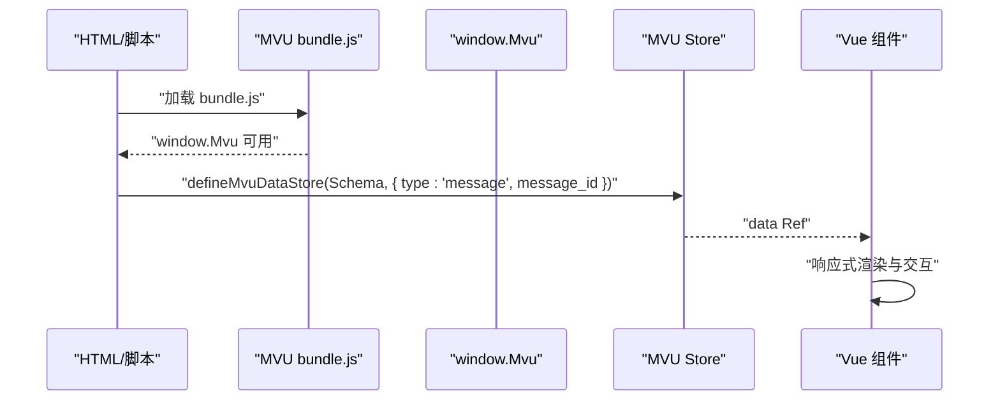
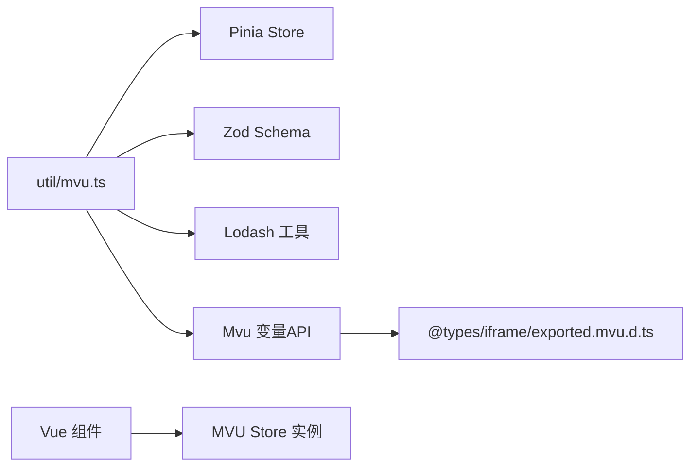

# MVU脚本实现

<cite>
**本文档引用的文件**
- [util/mvu.ts](file://util/mvu.ts)
- [@types/iframe/exported.mvu.d.ts](file://@types/iframe/exported.mvu.d.ts)
- [示例/角色卡示例/schema.ts](file://示例/角色卡示例/schema.ts)
- [示例/角色卡示例/脚本/变量结构/index.ts](file://示例/角色卡示例/脚本/变量结构/index.ts)
- [示例/角色卡示例/世界书/变量/initvar.yaml](file://示例/角色卡示例/世界书/变量/initvar.yaml)
- [示例/角色卡示例/世界书/变量/变量更新规则.yaml](file://示例/角色卡示例/世界书/变量/变量更新规则.yaml)
- [示例/角色卡示例/世界书/变量/变量输出格式.yaml](file://示例/角色卡示例/世界书/变量/变量输出格式.yaml)
- [dump_schema.ts](file://dump_schema.ts)
- [示例/角色卡示例/界面/状态栏/store.ts](file://示例/角色卡示例/界面/状态栏/store.ts)
- [初始模板/角色卡/新建为src文件夹中的文件夹/脚本/MVU/index.ts](file://初始模板/角色卡/新建为src文件夹中的文件夹/脚本/MVU/index.ts)
</cite>

## 目录
1. [简介](#简介)
2. [项目结构](#项目结构)
3. [核心组件](#核心组件)
4. [架构总览](#架构总览)
5. [详细组件分析](#详细组件分析)
6. [依赖关系分析](#依赖关系分析)
7. [性能考虑](#性能考虑)
8. [故障排除指南](#故障排除指南)
9. [结论](#结论)
10. [附录](#附录)

## 简介
本技术文档面向在脚本环境中实现MVU（Model-View-Update）架构的开发者，系统阐述如何在MVU变量框架下构建数据模型、进行状态管理、集成类型验证（Zod），以及实现双向自动同步机制。文档基于仓库中的实际实现，重点覆盖以下方面：
- 数据模型定义与类型约束
- 状态存储与访问（Pinia Store + MVU变量）
- 类型验证集成与错误处理
- 响应式更新与自动同步流程
- 完整的MVU脚本开发示例（数据结构设计、状态更新逻辑、组件集成）

## 项目结构
本仓库围绕MVU变量框架提供了完整的实现与示例，关键目录与文件如下：
- util/mvu.ts：MVU数据存储工厂函数，负责根据Zod模式创建带自动同步的Pinia Store
- @types/iframe/exported.mvu.d.ts：Mvu命名空间与事件接口声明，定义MVU数据结构、命令类型与事件回调
- 示例/角色卡示例/schema.ts：Zod数据模式定义，包含嵌套对象、转换与约束
- 示例/角色卡示例/脚本/变量结构/index.ts：注册MVU模式入口
- 示例/角色卡示例/世界书/变量/*.yaml：初始化数据、更新规则与输出格式规范
- dump_schema.ts：将Zod模式导出为JSON Schema文件，便于工具链使用
- 示例/角色卡示例/界面/状态栏/store.ts：在Vue组件中使用MVU Store的实际案例
- 初始模板/角色卡/新建为src文件夹中的文件夹/脚本/MVU/index.ts：加载MVU变量框架脚本的入口



**图表来源**
- [util/mvu.ts:1-66](file://util/mvu.ts#L1-L66)
- [@types/iframe/exported.mvu.d.ts:1-190](file://@types/iframe/exported.mvu.d.ts#L1-L190)
- [示例/角色卡示例/schema.ts:1-52](file://示例/角色卡示例/schema.ts#L1-L52)
- [示例/角色卡示例/脚本/变量结构/index.ts:1-7](file://示例/角色卡示例/脚本/变量结构/index.ts#L1-L7)
- [示例/角色卡示例/世界书/变量/initvar.yaml:1-34](file://示例/角色卡示例/世界书/变量/initvar.yaml#L1-L34)
- [示例/角色卡示例/世界书/变量/变量更新规则.yaml:1-52](file://示例/角色卡示例/世界书/变量/变量更新规则.yaml#L1-L52)
- [示例/角色卡示例/世界书/变量/变量输出格式.yaml:1-32](file://示例/角色卡示例/世界书/变量/变量输出格式.yaml#L1-L32)
- [dump_schema.ts:1-29](file://dump_schema.ts#L1-L29)
- [示例/角色卡示例/界面/状态栏/store.ts:1-4](file://示例/角色卡示例/界面/状态栏/store.ts#L1-L4)
- [初始模板/角色卡/新建为src文件夹中的文件夹/脚本/MVU/index.ts:1-2](file://初始模板/角色卡/新建为src文件夹中的文件夹/脚本/MVU/index.ts#L1-L2)

**章节来源**
- [util/mvu.ts:1-66](file://util/mvu.ts#L1-L66)
- [@types/iframe/exported.mvu.d.ts:1-190](file://@types/iframe/exported.mvu.d.ts#L1-L190)
- [示例/角色卡示例/schema.ts:1-52](file://示例/角色卡示例/schema.ts#L1-L52)
- [示例/角色卡示例/脚本/变量结构/index.ts:1-7](file://示例/角色卡示例/脚本/变量结构/index.ts#L1-L7)
- [示例/角色卡示例/世界书/变量/initvar.yaml:1-34](file://示例/角色卡示例/世界书/变量/initvar.yaml#L1-L34)
- [示例/角色卡示例/世界书/变量/变量更新规则.yaml:1-52](file://示例/角色卡示例/世界书/变量/变量更新规则.yaml#L1-L52)
- [示例/角色卡示例/世界书/变量/变量输出格式.yaml:1-32](file://示例/角色卡示例/世界书/变量/变量输出格式.yaml#L1-L32)
- [dump_schema.ts:1-29](file://dump_schema.ts#L1-L29)
- [示例/角色卡示例/界面/状态栏/store.ts:1-4](file://示例/角色卡示例/界面/状态栏/store.ts#L1-L4)
- [初始模板/角色卡/新建为src文件夹中的文件夹/脚本/MVU/index.ts:1-2](file://初始模板/角色卡/新建为src文件夹中的文件夹/脚本/MVU/index.ts#L1-L2)

## 核心组件
- MVU数据存储工厂：defineMvuDataStore
  - 接收Zod模式、变量选项与可选附加设置函数
  - 创建Pinia Store，内部维护Ref类型的data字段
  - 自动同步机制：定时轮询与watch组合，确保MVU变量与本地状态一致
- Mvu命名空间与事件接口
  - 定义MvuData结构（initialized_lorebooks、stat_data等）
  - 定义命令类型（set、insert、delete、add、move）
  - 定义事件：VARIABLE_INITIALIZED、VARIABLE_UPDATE_STARTED、COMMAND_PARSED、VARIABLE_UPDATE_ENDED、BEFORE_MESSAGE_UPDATE
  - 提供getMvuData、replaceMvuData、parseMessage等API
- Zod数据模式与转换
  - schema.ts中定义嵌套对象、数值转换与派生字段
  - transform用于根据依存度动态计算阶段与称号集合
- 模式注册与JSON Schema导出
  - index.ts中注册MVU模式
  - dump_schema.ts将Zod模式转为JSON Schema文件

**章节来源**
- [util/mvu.ts:3-66](file://util/mvu.ts#L3-L66)
- [@types/iframe/exported.mvu.d.ts:1-190](file://@types/iframe/exported.mvu.d.ts#L1-L190)
- [示例/角色卡示例/schema.ts:1-52](file://示例/角色卡示例/schema.ts#L1-L52)
- [示例/角色卡示例/脚本/变量结构/index.ts:1-7](file://示例/角色卡示例/脚本/变量结构/index.ts#L1-L7)
- [dump_schema.ts:1-29](file://dump_schema.ts#L1-L29)

## 架构总览
MVU脚本实现采用“模式驱动 + 自动同步”的架构：
- 模式层：Zod Schema定义数据结构与约束
- 存储层：defineMvuDataStore创建Pinia Store，封装MVU变量读写
- 同步层：定时轮询与响应式watch双重保障，确保stat_data与本地data双向一致
- 事件层：Mvu命名空间提供事件钩子，支持在变量更新前后进行干预
- 应用层：Vue组件通过useDataStore消费状态，实现UI响应式更新



**图表来源**
- [util/mvu.ts:29-60](file://util/mvu.ts#L29-L60)
- [@types/iframe/exported.mvu.d.ts:54-177](file://@types/iframe/exported.mvu.d.ts#L54-L177)

## 详细组件分析

### 组件A：MVU数据存储工厂（defineMvuDataStore）
- 设计要点
  - 参数化：接收Zod模式、变量选项（支持message/chat/character/global与message_id）
  - 初始化：从MVU变量中提取stat_data，使用schema.parse进行类型验证与默认值填充
  - 自动同步：定时器每2秒检查stat_data变化；watch深层监听data变化并回写
  - 防抖环路：使用ignoreUpdates防止watch回写触发新一轮轮询
- 关键流程
  - 定时轮询：读取stat_data → safeParse → 若与本地data不同则同步，并回写stat_data
  - 响应式写回：watch检测data变化 → safeParse → 若与期望值不同则忽略更新 → 回写stat_data
- 错误处理
  - safeParse失败时跳过本次更新，避免破坏现有状态
  - parse阶段报告输入错误，便于定位问题



**图表来源**
- [util/mvu.ts:29-60](file://util/mvu.ts#L29-L60)

**章节来源**
- [util/mvu.ts:3-66](file://util/mvu.ts#L3-L66)

### 组件B：Mvu命名空间与事件接口
- 数据结构
  - MvuData：包含initialized_lorebooks与stat_data等字段
  - CommandInfo：支持set、insert、delete、add、move五种命令
- 事件体系
  - VARIABLE_INITIALIZED：新聊天开启时触发
  - VARIABLE_UPDATE_STARTED：变量更新开始时触发
  - COMMAND_PARSED：命令解析完成时触发（可用于修复或注入命令）
  - VARIABLE_UPDATE_ENDED：变量更新结束时触发（可用于边界裁剪或一致性校验）
  - BEFORE_MESSAGE_UPDATE：即将更新楼层时触发
- API能力
  - getMvuData：按选项获取MvuData
  - replaceMvuData：整体替换MvuData
  - parseMessage：解析包含更新命令的消息并返回新数据



**图表来源**
- [@types/iframe/exported.mvu.d.ts:54-177](file://@types/iframe/exported.mvu.d.ts#L54-L177)
- [util/mvu.ts:29-60](file://util/mvu.ts#L29-L60)

**章节来源**
- [@types/iframe/exported.mvu.d.ts:1-190](file://@types/iframe/exported.mvu.d.ts#L1-L190)

### 组件C：Zod数据模式与转换
- 模式设计
  - 世界：包含当前时间、地点与近期事务映射
  - 白娅：依存度数值（经coerce.number并clamp到0~100）、着装映射、称号映射（含效果与自我评价）
  - 主角：物品栏（物品名到描述与数量）的记录
- 转换逻辑
  - transform根据依存度计算阶段文本
  - transform根据依存度裁剪称号集合，保留最高分数对应的称号
- 类型安全
  - 使用z.object、z.record、z.enum、z.coerce、z.transform等确保类型正确性与数据质量

```mermaid
classDiagram
class Schema {
+世界 : 对象
+白娅 : 对象
+主角 : 对象
}
class 世界 {
+当前时间 : 字符串
+当前地点 : 字符串
+近期事务 : 映射
}
class 白娅 {
+依存度 : 数字
+着装 : 映射
+称号 : 映射
+$依存度阶段 : 字符串
}
class 主角 {
+物品栏 : 映射
}
Schema --> 世界
Schema --> 白娅
Schema --> 主角
白娅 --> "$依存度阶段 : transform"
白娅 --> "称号 : transform"
```

**图表来源**
- [示例/角色卡示例/schema.ts:1-52](file://示例/角色卡示例/schema.ts#L1-L52)

**章节来源**
- [示例/角色卡示例/schema.ts:1-52](file://示例/角色卡示例/schema.ts#L1-L52)

### 组件D：MVU变量结构注册与JSON Schema导出
- 注册流程
  - 在脚本加载时调用registerMvuSchema(Schema)，向MVU框架注册数据模式
- JSON Schema导出
  - dump_schema.ts扫描src目录下的schema.ts，动态导入并生成schema.json，便于外部工具校验initvar.yaml



**图表来源**
- [示例/角色卡示例/脚本/变量结构/index.ts:1-7](file://示例/角色卡示例/脚本/变量结构/index.ts#L1-L7)
- [dump_schema.ts:8-28](file://dump_schema.ts#L8-L28)

**章节来源**
- [示例/角色卡示例/脚本/变量结构/index.ts:1-7](file://示例/角色卡示例/脚本/变量结构/index.ts#L1-L7)
- [dump_schema.ts:1-29](file://dump_schema.ts#L1-L29)

### 组件E：MVU变量框架脚本加载与应用集成
- 框架加载
  - 通过在脚本中引入MVU变量框架bundle.js，使window.Mvu可用
- Vue组件集成
  - 在store.ts中使用defineMvuDataStore创建Store实例，绑定当前消息楼层的数据
  - 组件通过store暴露的data进行响应式渲染与交互



**图表来源**
- [初始模板/角色卡/新建为src文件夹中的文件夹/脚本/MVU/index.ts:1-2](file://初始模板/角色卡/新建为src文件夹中的文件夹/脚本/MVU/index.ts#L1-L2)
- [示例/角色卡示例/界面/状态栏/store.ts:1-4](file://示例/角色卡示例/界面/状态栏/store.ts#L1-L4)
- [@types/iframe/exported.mvu.d.ts:54-177](file://@types/iframe/exported.mvu.d.ts#L54-L177)

**章节来源**
- [初始模板/角色卡/新建为src文件夹中的文件夹/脚本/MVU/index.ts:1-2](file://初始模板/角色卡/新建为src文件夹中的文件夹/脚本/MVU/index.ts#L1-L2)
- [示例/角色卡示例/界面/状态栏/store.ts:1-4](file://示例/角色卡示例/界面/状态栏/store.ts#L1-L4)

## 依赖关系分析
- defineMvuDataStore依赖
  - Pinia：defineStore、useIntervalFn
  - Lodash：_.get、_.set、_.isEqual、_.entries、_.sortBy、_.map、_.groupBy、_.pickBy
  - Zod：schema.parse/safeParse、transform
  - Mvu变量API：getVariables、updateVariablesWith、watchIgnorable、errorCatched
- Mvu命名空间接口
  - 作为全局API，为脚本提供事件订阅与变量操作能力
- 应用集成
  - Vue组件通过store消费data，实现UI与状态的解耦



**图表来源**
- [util/mvu.ts:1-66](file://util/mvu.ts#L1-L66)
- [@types/iframe/exported.mvu.d.ts:1-190](file://@types/iframe/exported.mvu.d.ts#L1-L190)

**章节来源**
- [util/mvu.ts:1-66](file://util/mvu.ts#L1-L66)
- [@types/iframe/exported.mvu.d.ts:1-190](file://@types/iframe/exported.mvu.d.ts#L1-L190)

## 性能考虑
- 同步频率：定时器每2秒轮询一次，平衡实时性与性能开销
- 深度监听：watch启用deep以捕获嵌套结构变化，但需注意大对象的比较成本
- 防抖环路：ignoreUpdates避免watch回写导致的无限循环
- 类型验证：safeParse在每次同步时执行，建议保持Schema简洁以减少解析成本
- 事件处理：在COMMAND_PARSED/VARIABLE_UPDATE_ENDED中尽量避免重型计算

## 故障排除指南
- 症状：状态未更新或出现异常循环
  - 排查：确认message_id是否正确（latest自动转为-1），检查safeParse错误信息
  - 参考：[util/mvu.ts:8-13](file://util/mvu.ts#L8-L13)、[util/mvu.ts:32-34](file://util/mvu.ts#L32-L34)
- 症状：UI不响应或数据不一致
  - 排查：确认watch是否触发、ignoreUpdates是否正确包裹、回写是否成功
  - 参考：[util/mvu.ts:45-60](file://util/mvu.ts#L45-L60)
- 症状：事件回调未生效
  - 排查：确认已等待Mvu初始化（window.Mvu可用），检查事件名称拼写
  - 参考：[@types/iframe/exported.mvu.d.ts:54-53](file://@types/iframe/exported.mvu.d.ts#L54-L53)
- 症状：initvar.yaml校验失败
  - 排查：运行dump_schema.ts生成schema.json，使用编辑器的YAML校验功能
  - 参考：[dump_schema.ts:8-28](file://dump_schema.ts#L8-L28)

**章节来源**
- [util/mvu.ts:8-13](file://util/mvu.ts#L8-L13)
- [util/mvu.ts:32-34](file://util/mvu.ts#L32-L34)
- [util/mvu.ts:45-60](file://util/mvu.ts#L45-L60)
- [@types/iframe/exported.mvu.d.ts:54-53](file://@types/iframe/exported.mvu.d.ts#L54-L53)
- [dump_schema.ts:8-28](file://dump_schema.ts#L8-L28)

## 结论
本MVU脚本实现通过Zod模式驱动、Pinia Store封装与Mvu变量API集成，构建了高可靠性的数据模型与自动同步机制。其核心优势在于：
- 类型安全：Zod提供强类型约束与运行时校验
- 自动同步：定时轮询与响应式watch双重保障
- 事件扩展：丰富的事件钩子支持灵活的业务逻辑接入
- 易于集成：清晰的API与示例便于在Vue组件中快速落地

## 附录
- 初始化数据样例：参考initvar.yaml中的字段与取值范围
- 更新规则：参考变量更新规则.yaml，明确字段类型、取值范围与更新条件
- 输出格式：参考变量输出格式.yaml，了解JSON Patch标准的扩展操作

**章节来源**
- [示例/角色卡示例/世界书/变量/initvar.yaml:1-34](file://示例/角色卡示例/世界书/变量/initvar.yaml#L1-L34)
- [示例/角色卡示例/世界书/变量/变量更新规则.yaml:1-52](file://示例/角色卡示例/世界书/变量/变量更新规则.yaml#L1-L52)
- [示例/角色卡示例/世界书/变量/变量输出格式.yaml:1-32](file://示例/角色卡示例/世界书/变量/变量输出格式.yaml#L1-L32)