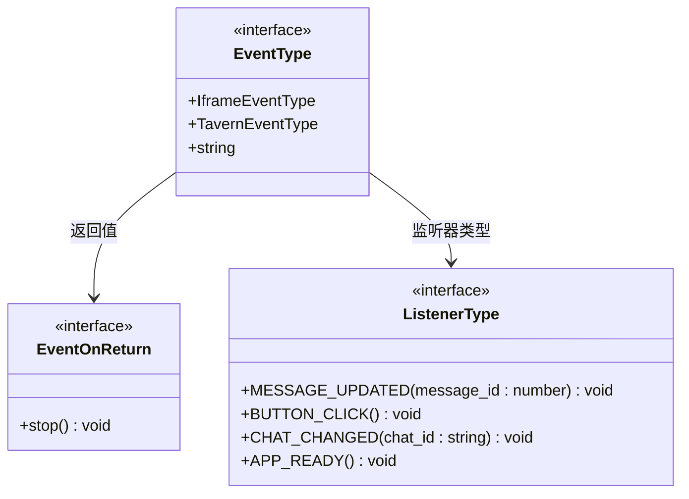
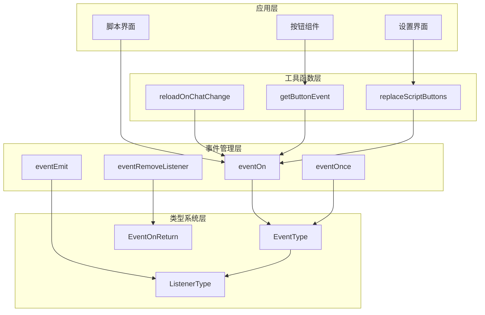
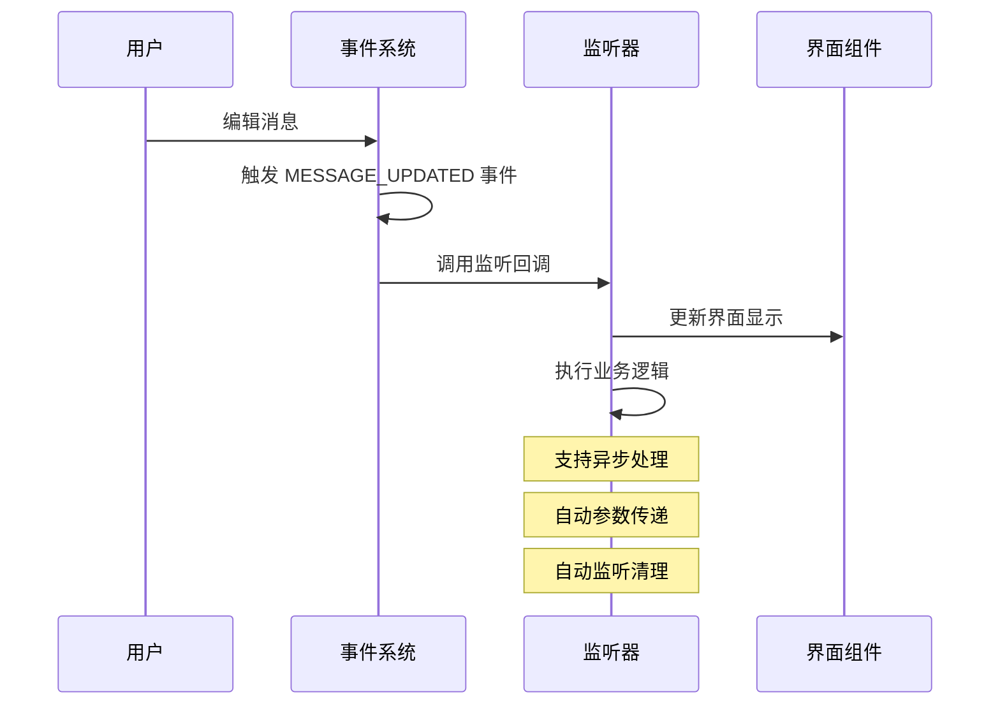
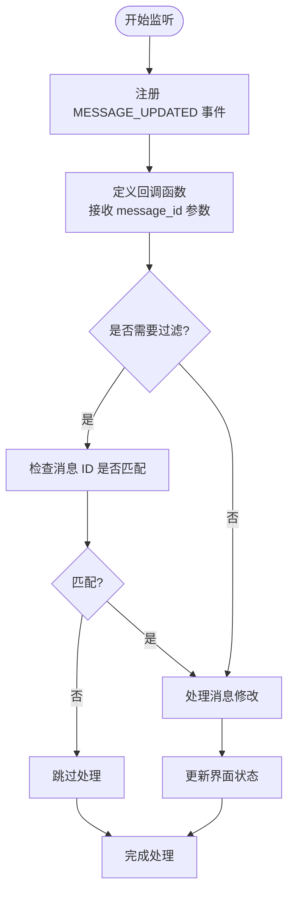
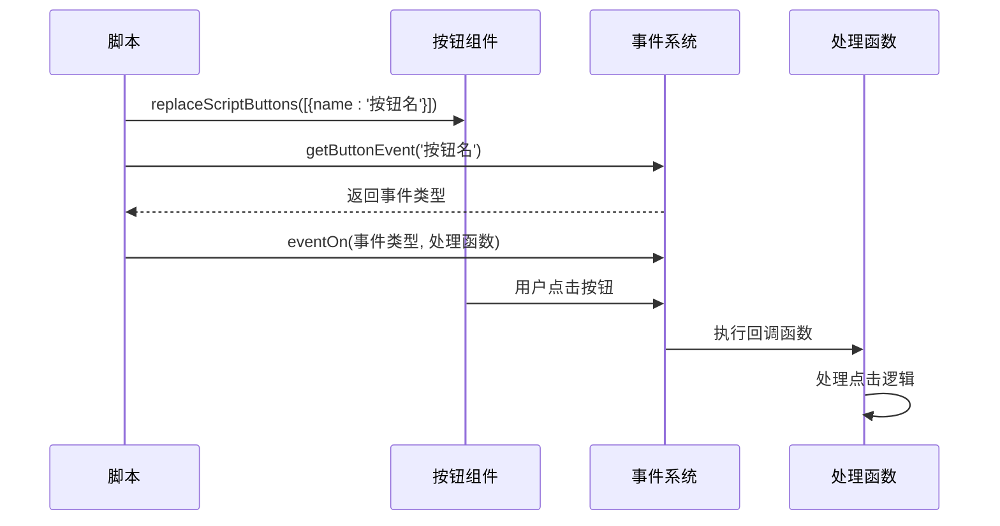
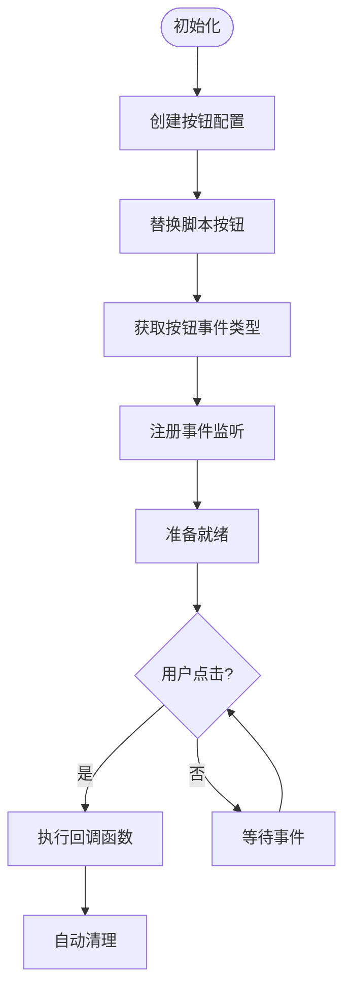
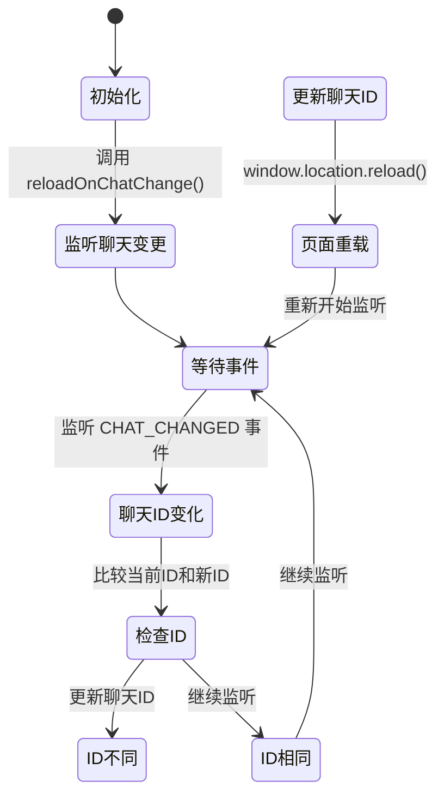
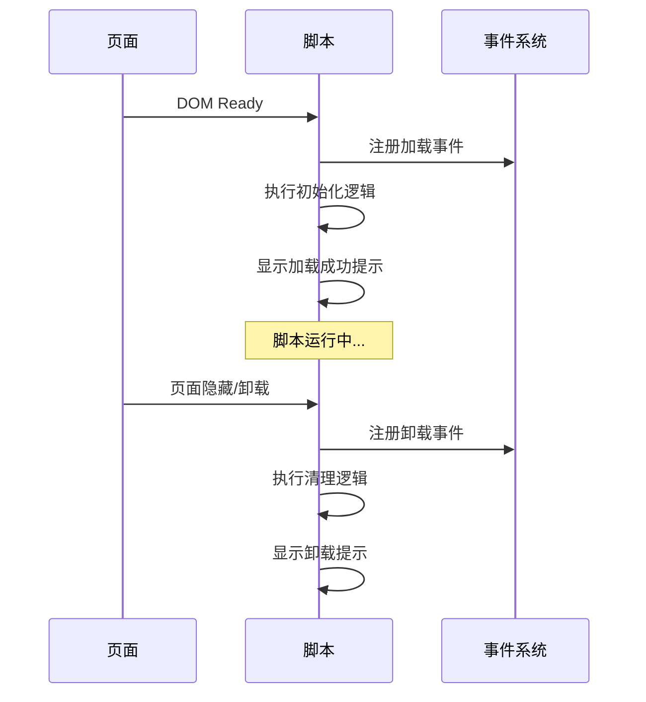
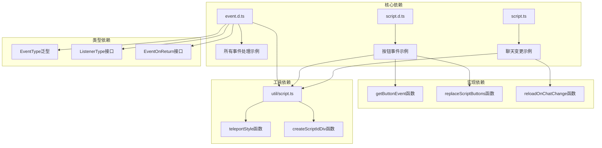

# 事件处理系统

<cite>
**本文档引用的文件**
- [event.d.ts](file://@types/iframe/event.d.ts)
- [script.d.ts](file://@types/iframe/script.d.ts)
- [script.ts](file://util/script.ts)
- [监听消息修改.ts](file://示例/脚本示例/监听消息修改.ts)
- [添加按钮和注册按钮事件.ts](file://示例/脚本示例/添加按钮和注册按钮事件.ts)
- [聊天文件变更时重载脚本.ts](file://示例/脚本示例/聊天文件变更时重载脚本.ts)
- [加载和卸载时执行函数.ts](file://示例/脚本示例/加载和卸载时执行函数.ts)
- [设置界面.ts](file://示例/脚本示例/设置界面.ts)
- [设置界面.vue](file://示例/脚本示例/设置界面.vue)
- [index.ts](file://src/快速情节编排/index.ts)
</cite>

## 目录
1. [简介](#简介)
2. [项目结构](#项目结构)
3. [核心组件](#核心组件)
4. [架构概览](#架构概览)
5. [详细组件分析](#详细组件分析)
6. [依赖关系分析](#依赖关系分析)
7. [性能考虑](#性能考虑)
8. [故障排除指南](#故障排除指南)
9. [结论](#结论)

## 简介

事件处理系统是 Quick Reply Manager 项目的核心基础设施，为脚本提供了完整的事件驱动编程模型。该系统支持多种类型的事件监听，包括消息修改事件、按钮点击事件、聊天文件变更事件等，为开发者提供了强大的扩展能力。

系统基于 TypeScript 类型安全设计，提供了完整的事件生命周期管理，包括事件注册、参数传递、回调函数执行和自动清理等功能。通过统一的事件接口，开发者可以轻松构建复杂的交互逻辑和响应机制。

## 项目结构

事件处理系统主要分布在以下目录和文件中：

```mermaid
graph TB
subgraph "类型定义层"
A[@types/iframe/event.d.ts]
B[@types/iframe/script.d.ts]
end
subgraph "工具函数层"
C[util/script.ts]
end
subgraph "示例脚本层"
D[监听消息修改.ts]
E[添加按钮和注册按钮事件.ts]
F[聊天文件变更时重载脚本.ts]
G[加载和卸载时执行函数.ts]
H[设置界面.ts]
I[设置界面.vue]
end
subgraph "核心实现层"
J[src/快速情节编排/index.ts]
end
A --> D
A --> E
A --> F
A --> G
B --> E
B --> J
C --> F
H --> I
```

**图表来源**
- [@types/iframe/event.d.ts:1-522](file://@types/iframe/event.d.ts#L1-L522)
- [@types/iframe/script.d.ts:1-89](file://@types/iframe/script.d.ts#L1-L89)
- [util/script.ts:1-47](file://util/script.ts#L1-L47)

**章节来源**
- [@types/iframe/event.d.ts:1-522](file://@types/iframe/event.d.ts#L1-L522)
- [@types/iframe/script.d.ts:1-89](file://@types/iframe/script.d.ts#L1-L89)
- [util/script.ts:1-47](file://util/script.ts#L1-L47)

## 核心组件

### 事件类型系统

事件处理系统采用强类型设计，通过 `EventType` 泛型确保类型安全：



**图表来源**
- [@types/iframe/event.d.ts:8-13](file://@types/iframe/event.d.ts#L8-L13)
- [@types/iframe/event.d.ts:278-521](file://@types/iframe/event.d.ts#L278-L521)

### 事件注册机制

系统提供多种事件注册方式，满足不同的使用场景：

| 注册方式 | 用途 | 特点 |
|---------|------|------|
| `eventOn` | 持续监听 | 事件触发时自动执行，支持自动清理 |
| `eventOnce` | 一次性监听 | 事件触发后自动移除监听器 |
| `eventMakeFirst` | 优先级监听 | 监听器优先执行 |
| `eventMakeLast` | 末位监听 | 监听器最后执行 |

**章节来源**
- [@types/iframe/event.d.ts:15-96](file://@types/iframe/event.d.ts#L15-L96)

## 架构概览

事件处理系统采用分层架构设计，确保模块间的松耦合和高内聚：



**图表来源**
- [@types/iframe/event.d.ts:42-139](file://@types/iframe/event.d.ts#L42-L139)
- [@types/iframe/script.d.ts:13-41](file://@types/iframe/script.d.ts#L13-L41)
- [util/script.ts:38-46](file://util/script.ts#L38-L46)

## 详细组件分析

### 消息修改事件处理

消息修改事件是事件系统中最常用的场景之一，主要用于监听用户对聊天消息的编辑操作。

#### 事件监听流程



**图表来源**
- [@types/iframe/event.d.ts:188-276](file://@types/iframe/event.d.ts#L188-L276)
- [@types/iframe/event.d.ts:309-309](file://@types/iframe/event.d.ts#L309-L309)

#### 实现示例分析

监听消息修改事件的典型实现模式：



**图表来源**
- [监听消息修改.ts:1-4](file://示例/脚本示例/监听消息修改.ts#L1-L4)

**章节来源**
- [监听消息修改.ts:1-4](file://示例/脚本示例/监听消息修改.ts#L1-L4)
- [@types/iframe/event.d.ts:188-276](file://@types/iframe/event.d.ts#L188-L276)

### 按钮点击事件处理

按钮点击事件是脚本交互的核心机制，通过 `getButtonEvent` 函数实现动态事件绑定。

#### 按钮事件注册流程



**图表来源**
- [@types/iframe/script.d.ts:13-13](file://@types/iframe/script.d.ts#L13-L13)
- [@types/iframe/script.d.ts:41-41](file://@types/iframe/script.d.ts#L41-L41)

#### 按钮事件实现模式



**图表来源**
- [添加按钮和注册按钮事件.ts:1-8](file://示例/脚本示例/添加按钮和注册按钮事件.ts#L1-L8)
- [index.ts:2139-2175](file://src/快速情节编排/index.ts#L2139-L2175)

**章节来源**
- [添加按钮和注册按钮事件.ts:1-8](file://示例/脚本示例/添加按钮和注册按钮事件.ts#L1-L8)
- [index.ts:2139-2175](file://src/快速情节编排/index.ts#L2139-L2175)
- [@types/iframe/script.d.ts:13-41](file://@types/iframe/script.d.ts#L13-L41)

### 聊天文件变更事件处理

聊天文件变更事件用于监听当前聊天会话的变化，支持自动重载功能。

#### 聊天变更监听机制



**图表来源**
- [util/script.ts:38-46](file://util/script.ts#L38-L46)
- [@types/iframe/event.d.ts:204-204](file://@types/iframe/event.d.ts#L204-L204)

#### 实现细节分析

聊天文件变更处理的关键特性：

1. **自动检测**: 系统自动跟踪当前聊天ID的变化
2. **智能比较**: 只有当聊天ID真正改变时才触发重载
3. **自动清理**: 事件监听在页面卸载时自动清理
4. **无缝重载**: 页面重载不影响用户体验

**章节来源**
- [util/script.ts:38-46](file://util/script.ts#L38-L46)
- [聊天文件变更时重载脚本.ts:1-4](file://示例/脚本示例/聊天文件变更时重载脚本.ts#L1-L4)

### 生命周期事件处理

系统提供了完善的生命周期事件支持，包括脚本加载和卸载时的处理。

#### 生命周期事件序列



**图表来源**
- [加载和卸载时执行函数.ts:1-10](file://示例/脚本示例/加载和卸载时执行函数.ts#L1-L10)

**章节来源**
- [加载和卸载时执行函数.ts:1-10](file://示例/脚本示例/加载和卸载时执行函数.ts#L1-L10)

## 依赖关系分析

事件处理系统各组件之间的依赖关系如下：



**图表来源**
- [@types/iframe/event.d.ts:1-522](file://@types/iframe/event.d.ts#L1-L522)
- [@types/iframe/script.d.ts:1-89](file://@types/iframe/script.d.ts#L1-L89)
- [util/script.ts:1-47](file://util/script.ts#L1-L47)

**章节来源**
- [@types/iframe/event.d.ts:1-522](file://@types/iframe/event.d.ts#L1-L522)
- [@types/iframe/script.d.ts:1-89](file://@types/iframe/script.d.ts#L1-L89)
- [util/script.ts:1-47](file://util/script.ts#L1-L47)

## 性能考虑

事件处理系统在设计时充分考虑了性能优化：

### 内存管理
- 自动事件清理：脚本卸载时自动移除所有事件监听
- 弱引用机制：避免循环引用导致的内存泄漏
- 按需注册：只在需要时注册事件监听器

### 执行效率
- 事件去重：相同的监听器不会被重复注册
- 优先级队列：确保重要事件优先处理
- 异步处理：支持非阻塞的事件处理模式

### 资源优化
- 懒加载：事件系统按需初始化
- 缓存策略：常用事件类型进行缓存
- 清理机制：定期清理无效的事件监听

## 故障排除指南

### 常见问题及解决方案

#### 事件监听失效
**问题描述**: 事件监听器无法正常工作
**可能原因**:
- 事件类型错误
- 监听器函数未正确注册
- 作用域问题

**解决步骤**:
1. 检查事件类型是否正确
2. 确认监听器函数签名匹配
3. 验证事件注册时机

#### 内存泄漏问题
**问题描述**: 页面长时间运行后内存占用持续增长
**可能原因**:
- 未正确清理事件监听器
- 循环引用
- 大量未使用的监听器

**预防措施**:
- 使用 `eventOn` 的返回值进行手动清理
- 避免在监听器中创建闭包引用
- 定期检查事件监听器数量

#### 性能问题
**问题描述**: 事件处理响应缓慢
**优化建议**:
- 使用 `eventOnce` 处理一次性事件
- 实施事件节流机制
- 避免在事件处理中执行耗时操作

**章节来源**
- [@types/iframe/event.d.ts:11-13](file://@types/iframe/event.d.ts#L11-L13)
- [@types/iframe/event.d.ts:129-148](file://@types/iframe/event.d.ts#L129-L148)

## 结论

事件处理系统为 Quick Reply Manager 提供了强大而灵活的扩展机制。通过类型安全的设计、完善的生命周期管理和高效的执行机制，系统能够支持各种复杂的交互场景。

### 主要优势
- **类型安全**: 全面的 TypeScript 类型支持
- **易于使用**: 简洁的 API 设计和丰富的示例
- **性能优秀**: 优化的事件处理和内存管理
- **扩展性强**: 支持自定义事件和复杂业务逻辑

### 最佳实践
1. 始终使用类型安全的事件监听方式
2. 注意事件监听器的生命周期管理
3. 实施适当的错误处理和恢复机制
4. 考虑性能影响，避免过度频繁的事件触发

该系统为开发者提供了一个坚实的基础，可以在此基础上构建各种创新的脚本功能和交互体验。