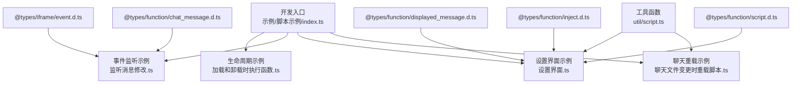
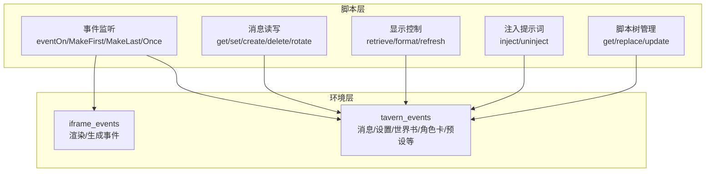
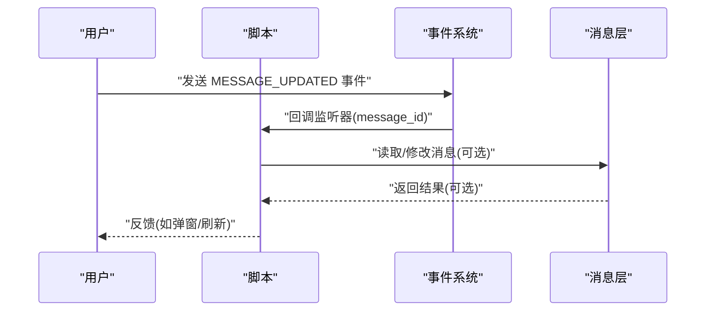
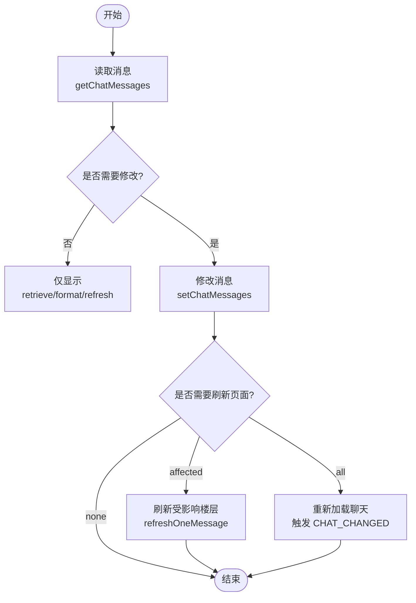
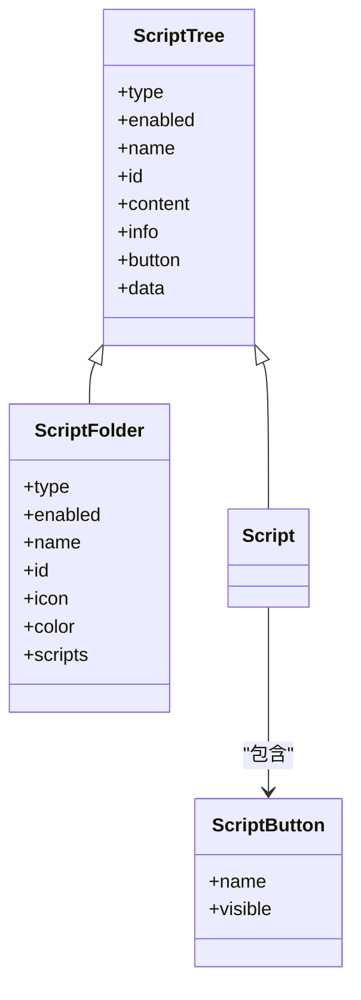
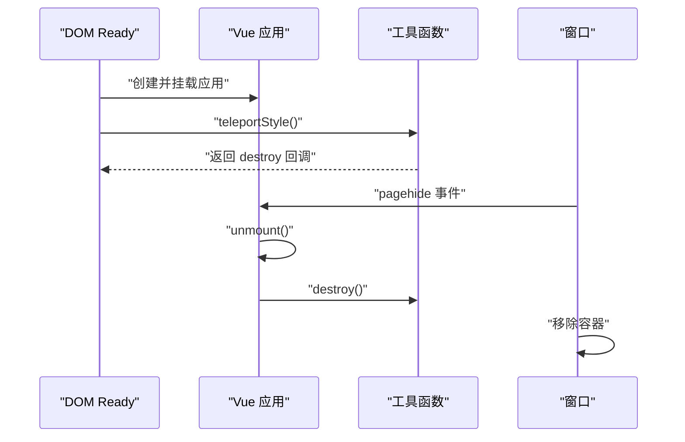
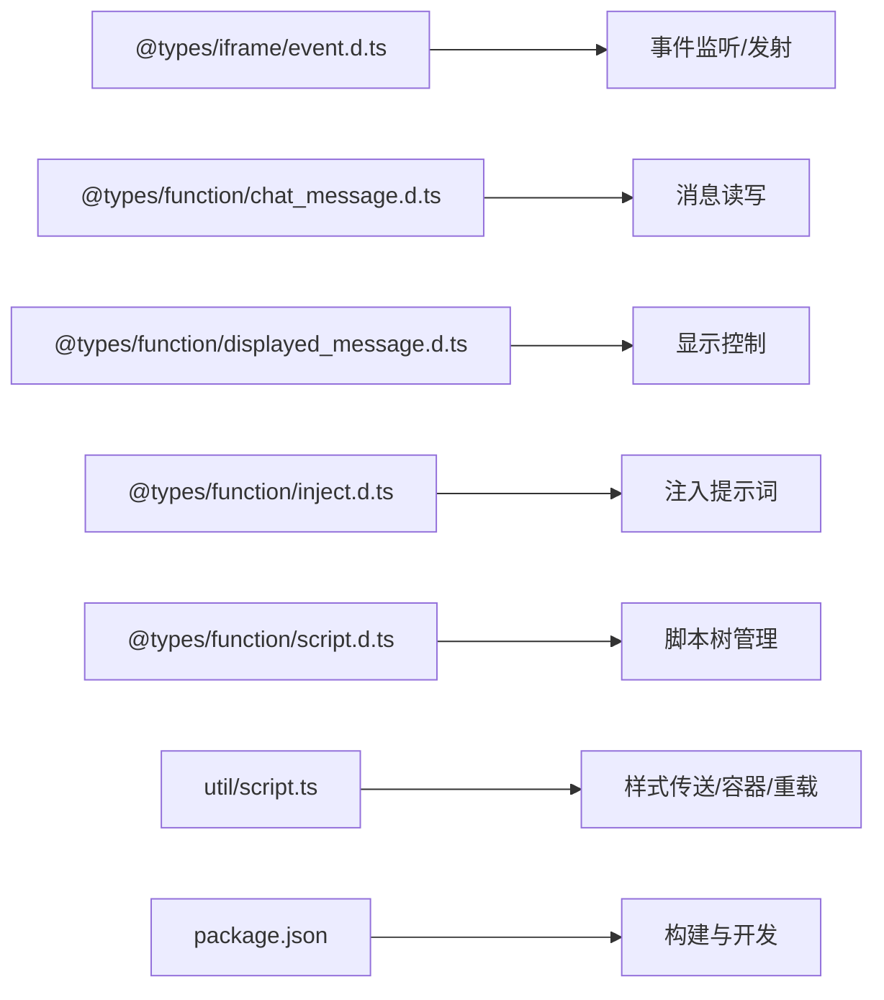

# 脚本开发指南

<cite>
**本文引用的文件**
- [README.md](file://README.md)
- [package.json](file://package.json)
- [global.d.ts](file://global.d.ts)
- [@types/iframe/event.d.ts](file://@types/iframe/event.d.ts)
- [@types/function/script.d.ts](file://@types/function/script.d.ts)
- [@types/function/inject.d.ts](file://@types/function/inject.d.ts)
- [@types/function/chat_message.d.ts](file://@types/function/chat_message.d.ts)
- [@types/function/displayed_message.d.ts](file://@types/function/displayed_message.d.ts)
- [util/script.ts](file://util/script.ts)
- [示例/脚本示例/index.ts](file://示例/脚本示例/index.ts)
- [示例/脚本示例/加载和卸载时执行函数.ts](file://示例/脚本示例/加载和卸载时执行函数.ts)
- [示例/脚本示例/监听消息修改.ts](file://示例/脚本示例/监听消息修改.ts)
- [示例/脚本示例/设置界面.ts](file://示例/脚本示例/设置界面.ts)
- [示例/脚本示例/聊天文件变更时重载脚本.ts](file://示例/脚本示例/聊天文件变更时重载脚本.ts)
</cite>

## 目录
1. [简介](#简介)
2. [项目结构](#项目结构)
3. [核心组件](#核心组件)
4. [架构总览](#架构总览)
5. [详细组件分析](#详细组件分析)
6. [依赖关系分析](#依赖关系分析)
7. [性能考量](#性能考量)
8. [故障排查指南](#故障排查指南)
9. [结论](#结论)
10. [附录](#附录)

## 简介
本指南面向在 SillyTavern 环境中进行脚本与前端界面开发的工程师与高级用户。内容涵盖脚本的基本架构设计、生命周期管理、事件监听机制与消息处理流程；详细说明如何在 SillyTavern 中注册与管理脚本、如何处理用户交互事件、如何监听与响应消息变化；并提供脚本加载与卸载的最佳实践、事件注册方法、消息修改监听技巧，以及实际的代码示例路径与调试方法。

## 项目结构
该项目提供了完整的开发模板与示例，便于在本地或通过 GitHub Actions 自动化构建与分发。核心要点包括：
- 开发与打包：通过 Webpack 构建，支持开发模式与生产模式，提供 watch、格式化、Lint 等脚本。
- 类型系统：提供完整的 @types，覆盖事件、脚本树、消息、注入提示词、显示消息等 API。
- 工具函数：提供样式传送、脚本容器、聊天变更重载等实用工具。
- 示例集合：包含脚本生命周期、事件监听、消息读写、设置界面、聊天切换重载等示例。

**图表来源**
- [示例/脚本示例/index.ts:1-7](file://示例/脚本示例/index.ts#L1-L7)
- [示例/脚本示例/加载和卸载时执行函数.ts:1-10](file://示例/脚本示例/加载和卸载时执行函数.ts#L1-L10)
- [示例/脚本示例/监听消息修改.ts:1-4](file://示例/脚本示例/监听消息修改.ts#L1-L4)
- [示例/脚本示例/设置界面.ts:1-18](file://示例/脚本示例/设置界面.ts#L1-L18)
- [示例/脚本示例/聊天文件变更时重载脚本.ts:1-4](file://示例/脚本示例/聊天文件变更时重载脚本.ts#L1-L4)
- [util/script.ts:1-47](file://util/script.ts#L1-L47)
- [@types/iframe/event.d.ts:1-522](file://@types/iframe/event.d.ts#L1-L522)
- [@types/function/chat_message.d.ts:1-235](file://@types/function/chat_message.d.ts#L1-L235)
- [@types/function/displayed_message.d.ts:1-71](file://@types/function/displayed_message.d.ts#L1-L71)
- [@types/function/inject.d.ts:1-47](file://@types/function/inject.d.ts#L1-L47)
- [@types/function/script.d.ts:1-82](file://@types/function/script.d.ts#L1-L82)

**章节来源**
- [README.md:1-105](file://README.md#L1-L105)
- [package.json:1-120](file://package.json#L1-L120)
- [示例/脚本示例/index.ts:1-7](file://示例/脚本示例/index.ts#L1-L7)

## 核心组件
- 事件系统与监听器
  - 事件注册与移除：提供 eventOn、eventMakeFirst、eventMakeLast、eventOnce、eventRemoveListener、eventClearEvent、eventClearListener、eventClearAll 等。
  - 事件发射：eventEmit、eventEmitAndWait 支持广播与等待。
  - 事件类型：iframe_events 与 tavern_events，覆盖渲染、生成、消息、设置、世界书、角色卡、预设等场景。
- 脚本树与脚本按钮
  - getScriptTrees、replaceScriptTrees、updateScriptTreesWith 支持对全局/预设/角色卡脚本树进行读取与更新。
  - getAllEnabledScriptButtons 提供已启用脚本按钮的聚合查询。
- 消息读写与显示
  - getChatMessages、setChatMessages、createChatMessages、deleteChatMessages、rotateChatMessages 提供消息的读取、修改、创建、删除与旋转。
  - retrieveDisplayedMessage、formatAsDisplayedMessage、refreshOneMessage 提供页面显示层的读取、格式化与刷新。
- 注入提示词
  - injectPrompts、uninjectPrompts 支持在聊天上下文中注入提示词，支持一次性与条件过滤。
- 工具函数
  - teleportStyle、createScriptIdDiv、createScriptIdIframe、reloadOnChatChange、loadReadme 等，辅助样式传送、DOM 容器、聊天切换重载与信息注入。

**章节来源**
- [@types/iframe/event.d.ts:1-522](file://@types/iframe/event.d.ts#L1-L522)
- [@types/function/script.d.ts:1-82](file://@types/function/script.d.ts#L1-L82)
- [@types/function/chat_message.d.ts:1-235](file://@types/function/chat_message.d.ts#L1-L235)
- [@types/function/displayed_message.d.ts:1-71](file://@types/function/displayed_message.d.ts#L1-L71)
- [@types/function/inject.d.ts:1-47](file://@types/function/inject.d.ts#L1-L47)
- [util/script.ts:1-47](file://util/script.ts#L1-L47)

## 架构总览
SillyTavern 的脚本开发围绕“事件驱动 + 消息模型”的架构展开。脚本通过事件系统订阅应用与消息层的变化，在合适的生命周期（加载/卸载）执行初始化与清理；通过消息 API 读取与修改聊天状态，结合显示 API 控制页面呈现；通过脚本树 API 管理脚本的注册与可见性。

**图表来源**
- [@types/iframe/event.d.ts:166-522](file://@types/iframe/event.d.ts#L166-L522)
- [@types/function/chat_message.d.ts:31-235](file://@types/function/chat_message.d.ts#L31-L235)
- [@types/function/displayed_message.d.ts:1-71](file://@types/function/displayed_message.d.ts#L1-L71)
- [@types/function/inject.d.ts:1-47](file://@types/function/inject.d.ts#L1-L47)
- [@types/function/script.d.ts:1-82](file://@types/function/script.d.ts#L1-L82)

## 详细组件分析

### 组件一：事件监听与生命周期管理
- 生命周期
  - 加载时：在 DOM ready 时执行初始化逻辑，例如弹窗提示与资源挂载。
  - 卸载时：在 pagehide 时执行清理，确保 Vue 应用卸载、容器移除与样式传送销毁。
- 事件监听
  - 使用 eventOn 订阅 tavern_events.MESSAGE_UPDATED 监听消息修改事件，回调中可读取被更新的 message_id 并执行相应逻辑。
  - 使用 eventMakeFirst/MakeLast/Once 调整监听优先级或仅监听一次，避免重复处理。
  - 使用 eventEmit/eventEmitAndWait 广播自定义事件或等待处理完成。
- 最佳实践
  - 在脚本关闭时无需手动移除监听，框架会在页面卸载时自动清理。
  - 对于需要持久化的状态，应结合 setChatMessages 与 refresh 选项进行页面更新。

**图表来源**
- [@types/iframe/event.d.ts:15-164](file://@types/iframe/event.d.ts#L15-L164)
- [@types/function/chat_message.d.ts:31-153](file://@types/function/chat_message.d.ts#L31-L153)

**章节来源**
- [示例/脚本示例/加载和卸载时执行函数.ts:1-10](file://示例/脚本示例/加载和卸载时执行函数.ts#L1-L10)
- [示例/脚本示例/监听消息修改.ts:1-4](file://示例/脚本示例/监听消息修改.ts#L1-L4)
- [@types/iframe/event.d.ts:15-164](file://@types/iframe/event.d.ts#L15-L164)

### 组件二：消息读取、修改与显示刷新
- 读取消息
  - getChatMessages 支持按楼层范围、角色与隐藏状态筛选，并可选择包含 swipe 信息。
- 修改消息
  - setChatMessages 支持批量修改消息正文、开关隐藏、设置开局与 swipe_id，并可控制刷新策略（none/affected/all）。
- 创建与删除
  - createChatMessages 支持在指定楼层前插入消息；deleteChatMessages 支持删除多个楼层。
- 显示层控制
  - retrieveDisplayedMessage 获取页面元素；formatAsDisplayedMessage 将文本转换为显示 HTML；refreshOneMessage 刷新单个楼层显示。

**图表来源**
- [@types/function/chat_message.d.ts:31-235](file://@types/function/chat_message.d.ts#L31-L235)
- [@types/function/displayed_message.d.ts:1-71](file://@types/function/displayed_message.d.ts#L1-L71)

**章节来源**
- [@types/function/chat_message.d.ts:31-235](file://@types/function/chat_message.d.ts#L31-L235)
- [@types/function/displayed_message.d.ts:1-71](file://@types/function/displayed_message.d.ts#L1-L71)

### 组件三：注入提示词与上下文增强
- 注入提示词
  - injectPrompts 支持一次性注入与条件过滤，适用于系统/用户/助手角色提示词，可选择仅在下一次请求生成中生效。
  - uninjectPrompts 支持按 id 列表移除注入。
- 典型用法
  - 在 GENERATION_AFTER_COMMANDS 或 CHAT_CHANGED 事件中注入提示词，确保上下文一致性。
  - 结合 setChatMessages 与 refresh 控制页面显示。

**章节来源**
- [@types/function/inject.d.ts:1-47](file://@types/function/inject.d.ts#L1-L47)

### 组件四：脚本树与脚本按钮管理
- 脚本树读取与更新
  - getScriptTrees 获取全局/预设/角色卡脚本树；replaceScriptTrees 完全替换；updateScriptTreesWith 以函数式更新。
- 脚本按钮
  - getAllEnabledScriptButtons 聚合已启用脚本按钮，便于兼容其他助手脚本。
- 最佳实践
  - 通过 updateScriptTreesWith 以不可变方式更新脚本树，避免直接修改引用导致的副作用。
  - 在设置界面中动态挂载 Vue 应用，并在卸载时统一清理。

**图表来源**
- [@types/function/script.d.ts:11-33](file://@types/function/script.d.ts#L11-L33)

**章节来源**
- [@types/function/script.d.ts:1-82](file://@types/function/script.d.ts#L1-L82)

### 组件五：设置界面与样式传送
- 容器与挂载
  - createScriptIdDiv 为脚本创建唯一容器；Vue 应用挂载至容器；卸载时统一 unmount、remove 与 destroy。
- 样式传送
  - teleportStyle 将 head 中的样式克隆到目标节点，避免样式污染；destroy 时回收。
- 聊天重载
  - reloadOnChatChange 监听 CHAT_CHANGED 事件并在聊天切换时刷新页面，确保脚本状态与聊天一致。

**图表来源**
- [示例/脚本示例/设置界面.ts:1-18](file://示例/脚本示例/设置界面.ts#L1-L18)
- [util/script.ts:13-47](file://util/script.ts#L13-L47)

**章节来源**
- [示例/脚本示例/设置界面.ts:1-18](file://示例/脚本示例/设置界面.ts#L1-L18)
- [util/script.ts:1-47](file://util/script.ts#L1-L47)

## 依赖关系分析
- 类型依赖
  - 事件系统依赖 @types/iframe/event.d.ts 提供的事件枚举与监听器签名。
  - 消息与显示 API 依赖 @types/function/chat_message.d.ts 与 @types/function/displayed_message.d.ts。
  - 注入提示词依赖 @types/function/inject.d.ts。
  - 脚本树与按钮依赖 @types/function/script.d.ts。
- 工具函数依赖
  - util/script.ts 依赖 iframe_srcdoc.html 与全局 getScriptId 等环境能力。
- 构建与开发
  - package.json 提供 build/watch/format/lint 等脚本，Webpack 配置用于打包与优化。

**图表来源**
- [@types/iframe/event.d.ts:1-522](file://@types/iframe/event.d.ts#L1-L522)
- [@types/function/chat_message.d.ts:1-235](file://@types/function/chat_message.d.ts#L1-L235)
- [@types/function/displayed_message.d.ts:1-71](file://@types/function/displayed_message.d.ts#L1-L71)
- [@types/function/inject.d.ts:1-47](file://@types/function/inject.d.ts#L1-L47)
- [@types/function/script.d.ts:1-82](file://@types/function/script.d.ts#L1-L82)
- [util/script.ts:1-47](file://util/script.ts#L1-L47)
- [package.json:1-120](file://package.json#L1-L120)

**章节来源**
- [package.json:1-120](file://package.json#L1-L120)
- [util/script.ts:1-47](file://util/script.ts#L1-L47)

## 性能考量
- 事件监听粒度
  - 使用 eventOnce 仅监听一次，减少重复处理开销。
  - 使用 eventMakeFirst/MakeLast 调整监听优先级，避免不必要的多次计算。
- 消息刷新策略
  - setChatMessages 的 refresh 选项按需选择 none/affected/all，避免全量重载带来的性能损耗。
- 样式传送
  - teleportStyle 仅在必要时克隆样式，destroy 时及时回收，防止内存泄漏。
- 构建优化
  - 生产模式构建与代码分割，配合 Webpack 插件与压缩工具提升加载速度。

## 故障排查指南
- 事件未触发
  - 确认事件类型拼写正确且在正确的生命周期注册；检查 eventOn 返回的 stop 是否被意外调用。
- 消息修改无效
  - 确认传入的 message_id 存在且在当前聊天范围内；检查 setChatMessages 的 refresh 选项是否符合预期。
- 页面显示异常
  - 使用 refreshOneMessage 刷新单个楼层；确认 retrieveDisplayedMessage 获取到的元素存在。
- 注入提示词未生效
  - 检查 injectPrompts 的 once 选项与 filter 条件；在 GENERATION_AFTER_COMMANDS 或 CHAT_CHANGED 中注入。
- 聊天切换后状态不同步
  - 使用 reloadOnChatChange 监听 CHAT_CHANGED 并刷新页面；或在切换后重新初始化脚本状态。

**章节来源**
- [@types/iframe/event.d.ts:15-164](file://@types/iframe/event.d.ts#L15-L164)
- [@types/function/chat_message.d.ts:106-153](file://@types/function/chat_message.d.ts#L106-L153)
- [@types/function/displayed_message.d.ts:48-71](file://@types/function/displayed_message.d.ts#L48-L71)
- [@types/function/inject.d.ts:20-47](file://@types/function/inject.d.ts#L20-L47)
- [util/script.ts:38-47](file://util/script.ts#L38-L47)

## 结论
本指南系统梳理了在 SillyTavern 中进行脚本开发的架构与实践，覆盖事件驱动、消息模型、注入提示词、脚本树管理与设置界面集成等关键领域。遵循生命周期管理与事件监听最佳实践，合理选择消息刷新策略与样式传送方案，可显著提升脚本的稳定性与性能。建议开发者以示例为起点，逐步扩展功能，并结合类型定义与工具函数完善调试与发布流程。

## 附录
- 快速参考
  - 事件注册：eventOn、eventMakeFirst、eventMakeLast、eventOnce
  - 事件发射：eventEmit、eventEmitAndWait
  - 消息读写：getChatMessages、setChatMessages、createChatMessages、deleteChatMessages、rotateChatMessages
  - 显示控制：retrieveDisplayedMessage、formatAsDisplayedMessage、refreshOneMessage
  - 注入提示词：injectPrompts、uninjectPrompts
  - 脚本树管理：getScriptTrees、replaceScriptTrees、updateScriptTreesWith、getAllEnabledScriptButtons
  - 工具函数：teleportStyle、createScriptIdDiv、createScriptIdIframe、reloadOnChatChange、loadReadme