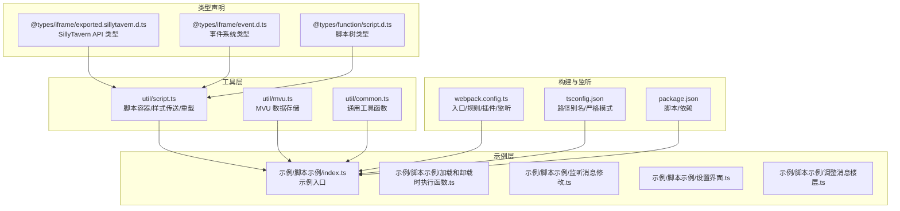
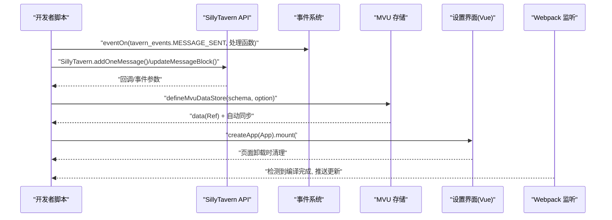
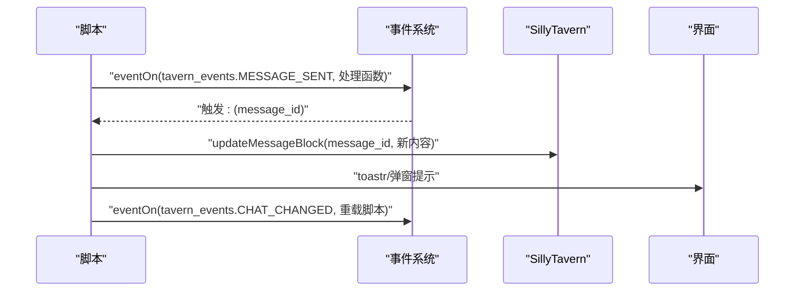
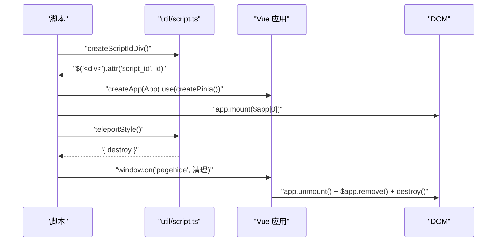
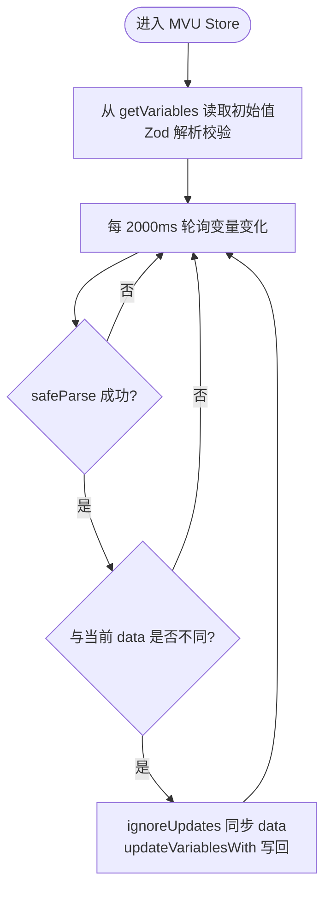
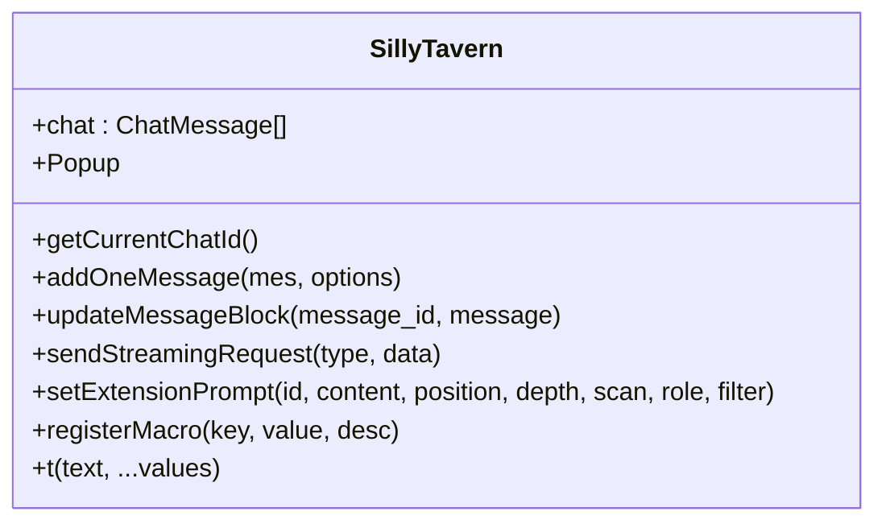
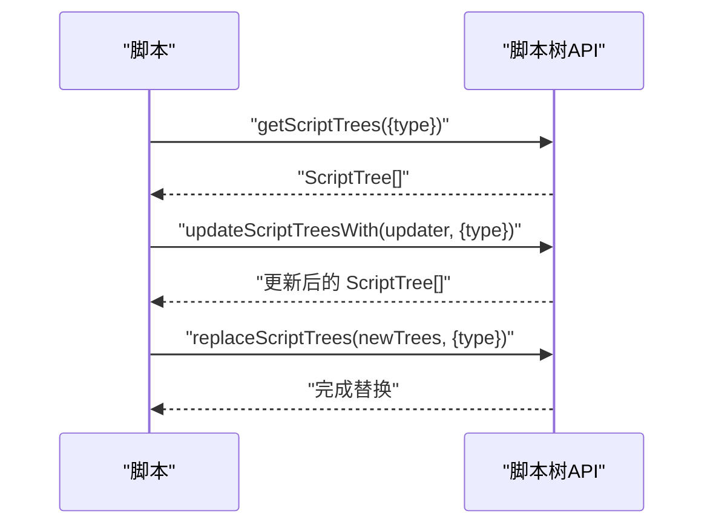
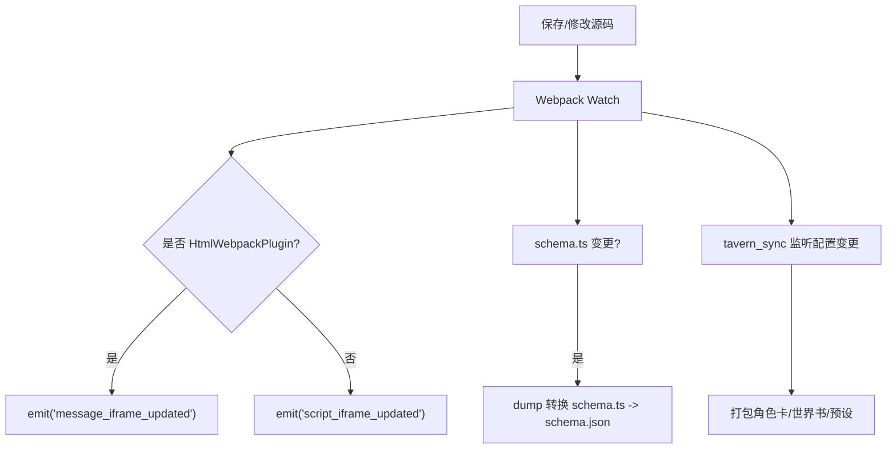
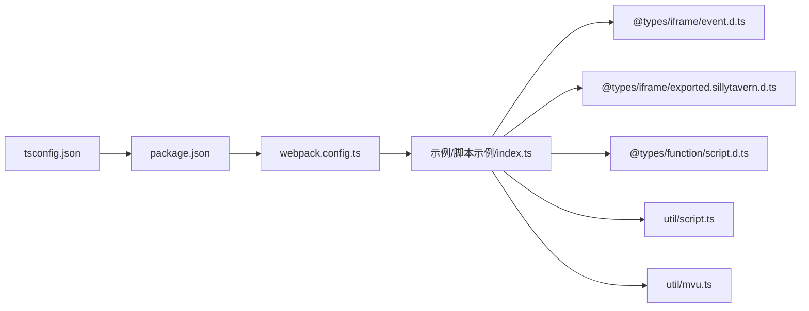

# 脚本系统

<cite>
**本文引用的文件**
- [README.md](file://README.md)
- [package.json](file://package.json)
- [tsconfig.json](file://tsconfig.json)
- [webpack.config.ts](file://webpack.config.ts)
- [@types\function\script.d.ts](file://@types/function/script.d.ts)
- [@types\iframe\exported.sillytavern.d.ts](file://@types/iframe/exported.sillytavern.d.ts)
- [@types\iframe\event.d.ts](file://@types/iframe/event.d.ts)
- [util\mvu.ts](file://util/mvu.ts)
- [util\script.ts](file://util/script.ts)
- [util\common.ts](file://util/common.ts)
- [示例\脚本示例\index.ts](file://示例/脚本示例/index.ts)
- [示例\脚本示例\加载和卸载时执行函数.ts](file://示例/脚本示例/加载和卸载时执行函数.ts)
- [示例\脚本示例\设置界面.ts](file://示例/脚本示例/设置界面.ts)
- [示例\脚本示例\监听消息修改.ts](file://示例/脚本示例/监听消息修改.ts)
- [示例\脚本示例\调整消息楼层.ts](file://示例/脚本示例/调整消息楼层.ts)
</cite>

## 目录
1. [简介](#简介)
2. [项目结构](#项目结构)
3. [核心组件](#核心组件)
4. [架构总览](#架构总览)
5. [详细组件分析](#详细组件分析)
6. [依赖关系分析](#依赖关系分析)
7. [性能考量](#性能考量)
8. [故障排查指南](#故障排查指南)
9. [结论](#结论)
10. [附录](#附录)

## 简介
本开发指南面向希望在“酒馆助手”生态中开发脚本与前端界面的开发者，系统讲解脚本架构设计、事件监听机制、消息处理流程、设置界面构建方法以及MVU脚本实现策略。文档同时说明脚本如何与SillyTavern API集成、如何处理用户交互事件、如何实现自定义功能扩展，并提供具体开发示例、API参考、调试技巧与最佳实践，帮助开发者快速掌握脚本开发技能并构建高质量扩展。

## 项目结构
该仓库采用“示例优先”的组织方式，核心能力由以下模块构成：
- 类型声明层：提供与SillyTavern API、事件系统、脚本树结构相关的强类型定义，确保开发期安全与IDE智能提示。
- 工具层：封装脚本加载、样式传送、脚本容器创建、聊天切换重载等通用能力。
- 构建与监听：基于Webpack的打包配置，支持自动监听、热更新、Schema导出与角色卡/世界书同步。
- 示例层：提供脚本生命周期、事件监听、设置界面、消息楼层调整等典型用法示例。

**图表来源**
- [webpack.config.ts:77-80](file://webpack.config.ts#L77-L80)
- [示例/脚本示例/index.ts:1-7](file://示例/脚本示例/index.ts#L1-L7)

**章节来源**
- [README.md:1-105](file://README.md#L1-L105)
- [package.json:1-120](file://package.json#L1-L120)
- [tsconfig.json:1-54](file://tsconfig.json#L1-L54)
- [webpack.config.ts:1-572](file://webpack.config.ts#L1-L572)

## 核心组件
- SillyTavern API（SillyTavern）：提供聊天上下文、消息模型、事件源、生成接口、世界书、宏与工具注册、弹窗、元数据管理等能力。
- 事件系统（eventOn/eventEmit 等）：统一的跨iframe/酒馆事件通道，支持监听、一次性监听、调整执行顺序、等待事件完成等。
- 脚本树（Script/ScriptFolder）：用于管理脚本按钮与脚本树结构，支持查询、替换与更新。
- 工具函数（util/*）：封装脚本容器创建、样式传送、聊天切换重载、通用解析与校验等。
- 构建与监听（webpack.config.ts）：自动发现入口、热更新、Schema导出、角色卡/世界书同步。

**章节来源**
- [@types\iframe\exported.sillytavern.d.ts:382-698](file://@types/iframe/exported.sillytavern.d.ts#L382-L698)
- [@types\iframe\event.d.ts:166-522](file://@types/iframe/event.d.ts#L166-L522)
- [@types\function\script.d.ts:11-82](file://@types/function/script.d.ts#L11-L82)
- [util\script.ts:1-47](file://util/script.ts#L1-L47)
- [util\common.ts:1-135](file://util/common.ts#L1-L135)
- [webpack.config.ts:82-107](file://webpack.config.ts#L82-L107)

## 架构总览
脚本系统围绕“事件驱动 + API集成 + MVU状态管理”的架构展开：
- 事件驱动：通过 eventOn 监听酒馆事件（如消息发送、生成开始/结束、聊天切换），在合适时机执行业务逻辑。
- API集成：通过 SillyTavern 上下文访问聊天消息、生成接口、世界书、宏与工具注册等能力。
- MVU状态管理：通过 defineMvuDataStore 将变量持久化到酒馆变量系统，实现“模型-视图-更新”的状态同步。
- 设置界面：在扩展设置页挂载Vue应用，使用 teleportStyle 保证样式生效，页面卸载时清理资源。
- 构建与监听：Webpack 自动发现入口，Socket.IO 推送更新，支持热更新与Schema导出。

**图表来源**
- [@types\iframe\event.d.ts:166-522](file://@types/iframe/event.d.ts#L166-L522)
- [@types\iframe\exported.sillytavern.d.ts:416-475](file://@types/iframe/exported.sillytavern.d.ts#L416-L475)
- [util\mvu.ts:3-66](file://util/mvu.ts#L3-L66)
- [util\script.ts:13-36](file://util/script.ts#L13-L36)
- [webpack.config.ts:82-107](file://webpack.config.ts#L82-L107)

## 详细组件分析

### 组件一：事件监听与消息处理
- 事件监听：使用 eventOn 监听 MESSAGE_SENT、MESSAGE_UPDATED、CHAT_CHANGED 等事件；支持 eventOnce、eventMakeFirst、eventMakeLast 控制执行顺序。
- 消息处理：结合 SillyTavern API 的 addOneMessage、updateMessageBlock、deleteLastMessage 等方法实现消息增删改查。
- 流式生成：监听 GENERATION_STARTED/ENDED 与 STREAM_TOKEN_RECEIVED，实现流式文本增量/全量处理。

**图表来源**
- [@types\iframe\event.d.ts:188-276](file://@types/iframe/event.d.ts#L188-L276)
- [@types\iframe\exported.sillytavern.d.ts:416-475](file://@types/iframe/exported.sillytavern.d.ts#L416-L475)
- [示例\脚本示例\监听消息修改.ts:1-4](file://示例/脚本示例/监听消息修改.ts#L1-L4)

**章节来源**
- [@types\iframe\event.d.ts:166-522](file://@types/iframe/event.d.ts#L166-L522)
- [@types\iframe\exported.sillytavern.d.ts:382-698](file://@types/iframe/exported.sillytavern.d.ts#L382-L698)
- [示例\脚本示例\监听消息修改.ts:1-4](file://示例/脚本示例/监听消息修改.ts#L1-L4)

### 组件二：设置界面构建方法（Vue + 样式传送）
- 容器创建：使用 createScriptIdDiv/createScriptIdIframe 创建带 script_id 的容器，便于脚本识别与清理。
- 样式传送：teleportStyle 将当前页面 head 中的样式克隆并传送到目标容器，避免样式丢失。
- 生命周期：在页面卸载时，unmount/Vue组件销毁、移除容器、销毁样式传送，防止内存泄漏。

**图表来源**
- [util\script.ts:13-36](file://util/script.ts#L13-L36)
- [示例\脚本示例\设置界面.ts:1-18](file://示例/脚本示例/设置界面.ts#L1-L18)

**章节来源**
- [util\script.ts:1-47](file://util/script.ts#L1-L47)
- [示例\脚本示例\设置界面.ts:1-18](file://示例/脚本示例/设置界面.ts#L1-L18)

### 组件三：MVU脚本实现策略
- 数据存储：defineMvuDataStore 将 Zod Schema 与变量选项绑定，自动从 getVariables 读取初始值，定时轮询与响应式更新双向同步。
- 状态持久化：通过 updateVariablesWith 将变更写回变量系统，确保刷新后状态不丢失。
- 性能优化：使用 watchIgnorable 与 ignoreUpdates 避免循环更新；定时器周期 2000ms，降低频繁写入。

**图表来源**
- [util\mvu.ts:3-66](file://util/mvu.ts#L3-L66)

**章节来源**
- [util\mvu.ts:1-66](file://util/mvu.ts#L1-L66)

### 组件四：脚本与SillyTavern API集成
- 聊天上下文：通过 SillyTavern.chat、getCurrentChatId、reloadCurrentChat 等访问当前聊天状态。
- 消息增删改：addOneMessage、updateMessageBlock、deleteLastMessage、clearChat 等。
- 生成与停止：generate/sendStreamingRequest/sendGenerationRequest/stopGeneration。
- 世界书与宏：setExtensionPrompt/registerMacro/unregisterMacro、loadWorldInfo/saveWorldInfo。
- 弹窗与国际化：Popup、t/translate、addLocaleData。

**图表来源**
- [@types\iframe\exported.sillytavern.d.ts:382-698](file://@types/iframe/exported.sillytavern.d.ts#L382-L698)

**章节来源**
- [@types\iframe\exported.sillytavern.d.ts:382-698](file://@types/iframe/exported.sillytavern.d.ts#L382-L698)

### 组件五：脚本树与按钮管理
- 查询与替换：getScriptTrees、replaceScriptTrees、updateScriptTreesWith 支持对全局/预设/角色脚本树进行读取与更新。
- 按钮管理：getAllEnabledScriptButtons 返回启用的脚本按钮集合，便于兼容 QR 助手等。

**图表来源**
- [@types\function\script.d.ts:47-82](file://@types/function/script.d.ts#L47-L82)

**章节来源**
- [@types\function\script.d.ts:1-82](file://@types/function/script.d.ts#L1-L82)

### 组件六：构建与监听（Webpack + Socket.IO）
- 入口发现：glob_script_files 自动收集示例与src下的 index.ts/js，去重并生成入口。
- 热更新：watch_tavern_helper 启动 Socket.IO 服务器，编译完成后推送 message_iframe_updated/script_iframe_updated。
- Schema导出：schema_dump 监听 schema.ts 变更，触发 dump 转换。
- 角色卡/世界书同步：tavern_sync 启动子进程，监听文件变更并打包。

**图表来源**
- [webpack.config.ts:51-75](file://webpack.config.ts#L51-L75)
- [webpack.config.ts:82-107](file://webpack.config.ts#L82-L107)
- [webpack.config.ts:115-129](file://webpack.config.ts#L115-L129)
- [webpack.config.ts:137-183](file://webpack.config.ts#L137-L183)

**章节来源**
- [webpack.config.ts:1-572](file://webpack.config.ts#L1-L572)

## 依赖关系分析
- 类型依赖：示例脚本依赖 @types/iframe 与 @types/function 的类型定义，确保事件与API签名正确。
- 工具依赖：示例脚本依赖 util/script.ts 与 util/mvu.ts，分别用于界面挂载与状态管理。
- 构建依赖：package.json 定义了开发脚本、依赖与浏览器兼容；tsconfig.json 配置路径别名与严格模式；webpack.config.ts 定义入口、规则、插件与监听。

**图表来源**
- [tsconfig.json:1-54](file://tsconfig.json#L1-L54)
- [package.json:1-120](file://package.json#L1-L120)
- [webpack.config.ts:1-572](file://webpack.config.ts#L1-L572)
- [示例\脚本示例\index.ts:1-7](file://示例/脚本示例/index.ts#L1-L7)

**章节来源**
- [tsconfig.json:1-54](file://tsconfig.json#L1-L54)
- [package.json:1-120](file://package.json#L1-L120)
- [webpack.config.ts:1-572](file://webpack.config.ts#L1-L572)

## 性能考量
- 事件监听：尽量使用 eventOnce 或在页面卸载时清理监听，避免重复触发导致性能问题。
- MVU轮询：默认2秒轮询一次，可根据数据变化频率调整；避免频繁写回变量系统。
- 样式传送：teleportStyle 仅在必要时执行，页面卸载时及时销毁，减少DOM节点数量。
- 构建优化：生产模式启用 Terser 压缩与分包策略，减少体积与加载时间。

[本节为通用指导，无需列出章节来源]

## 故障排查指南
- 版本不兼容：使用 checkMinimumVersion 检查酒馆助手最低版本要求，避免API缺失。
- 类型错误：使用 prettifyErrorWithInput 展示Zod校验失败的路径与输入，便于定位。
- JSON/YAML解析：parseString 支持多种格式自动修复与解析，若仍失败，检查格式与宏替换。
- 热更新无效：确认 Socket.IO 监听已启动，编译完成后是否推送了对应事件。
- 样式丢失：确认已调用 teleportStyle 并在卸载时销毁；检查容器是否正确挂载。

**章节来源**
- [util\common.ts:70-135](file://util/common.ts#L70-L135)
- [webpack.config.ts:82-107](file://webpack.config.ts#L82-L107)
- [util\script.ts:13-24](file://util/script.ts#L13-L24)

## 结论
本脚本系统通过强类型API、事件驱动与MVU状态管理，提供了稳定可靠的扩展能力。借助Webpack监听与热更新，开发者可以高效迭代；通过MVU与变量系统，状态持久化与跨模块共享变得简单。建议在实际开发中遵循事件清理、样式传送与性能优化的最佳实践，结合示例快速落地高质量扩展。

[本节为总结，无需列出章节来源]

## 附录

### API参考（精选）
- 事件系统
  - 监听：eventOn(event_type, listener)、eventOnce(event_type, listener)、eventMakeFirst(event_type, listener)、eventMakeLast(event_type, listener)
  - 发送：eventEmit(event_type, ...data)、eventEmitAndWait(event_type, ...data)
  - 清理：eventRemoveListener(event_type, listener)、eventClearEvent(event_type)、eventClearListener(listener)、eventClearAll()
- SillyTavern API（部分）
  - 聊天与消息：addOneMessage、updateMessageBlock、deleteLastMessage、clearChat
  - 生成：generate、sendStreamingRequest、sendGenerationRequest、stopGeneration
  - 世界书与宏：setExtensionPrompt、registerMacro、unregisterMacro、loadWorldInfo、saveWorldInfo
  - 弹窗与国际化：Popup、t/translate、addLocaleData
- 脚本树
  - 查询与更新：getScriptTrees、replaceScriptTrees、updateScriptTreesWith
  - 按钮：getAllEnabledScriptButtons

**章节来源**
- [@types\iframe\event.d.ts:166-522](file://@types/iframe/event.d.ts#L166-L522)
- [@types\iframe\exported.sillytavern.d.ts:382-698](file://@types/iframe/exported.sillytavern.d.ts#L382-L698)
- [@types\function\script.d.ts:47-82](file://@types/function/script.d.ts#L47-L82)

### 开发示例索引
- 脚本生命周期：示例/脚本示例/加载和卸载时执行函数.ts
- 事件监听：示例/脚本示例/监听消息修改.ts
- 设置界面：示例/脚本示例/设置界面.ts
- 消息楼层调整：示例/脚本示例/调整消息楼层.ts
- 示例入口：示例/脚本示例/index.ts

**章节来源**
- [示例\脚本示例\index.ts:1-7](file://示例/脚本示例/index.ts#L1-L7)
- [示例\脚本示例\加载和卸载时执行函数.ts:1-10](file://示例/脚本示例/加载和卸载时执行函数.ts#L1-L10)
- [示例\脚本示例\监听消息修改.ts:1-4](file://示例/脚本示例/监听消息修改.ts#L1-L4)
- [示例\脚本示例\设置界面.ts:1-18](file://示例/脚本示例/设置界面.ts#L1-L18)
- [示例\脚本示例\调整消息楼层.ts:1-40](file://示例/脚本示例/调整消息楼层.ts#L1-L40)