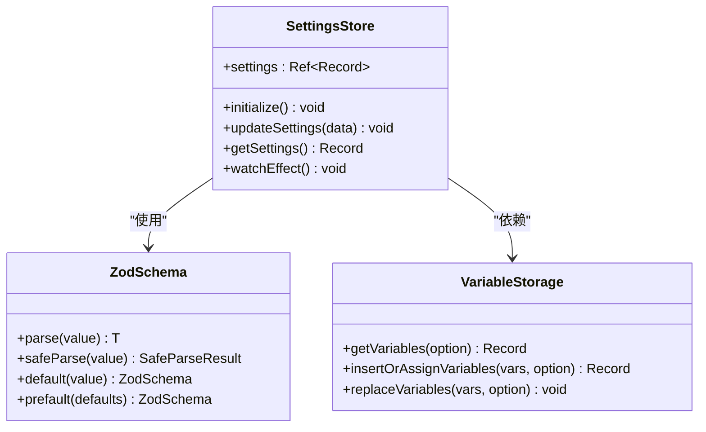
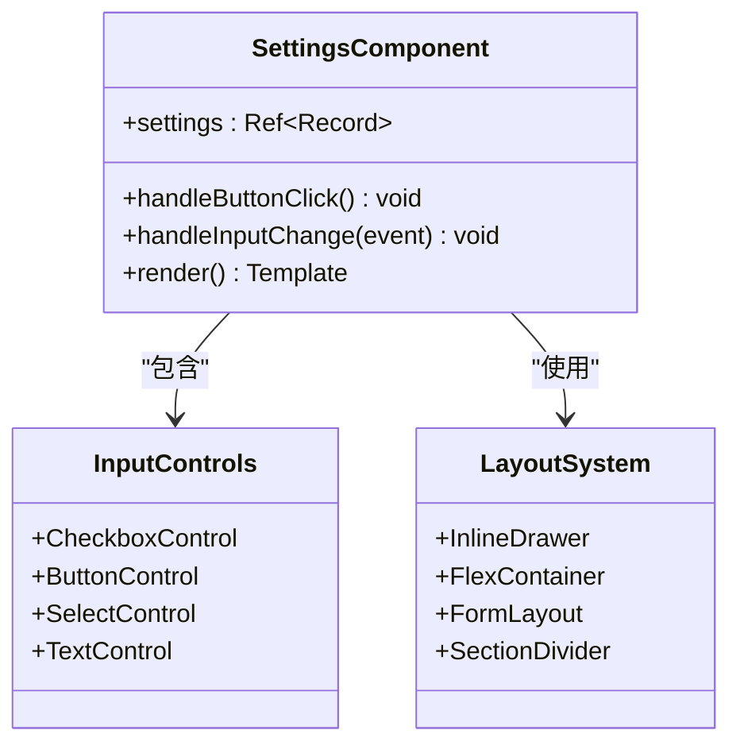
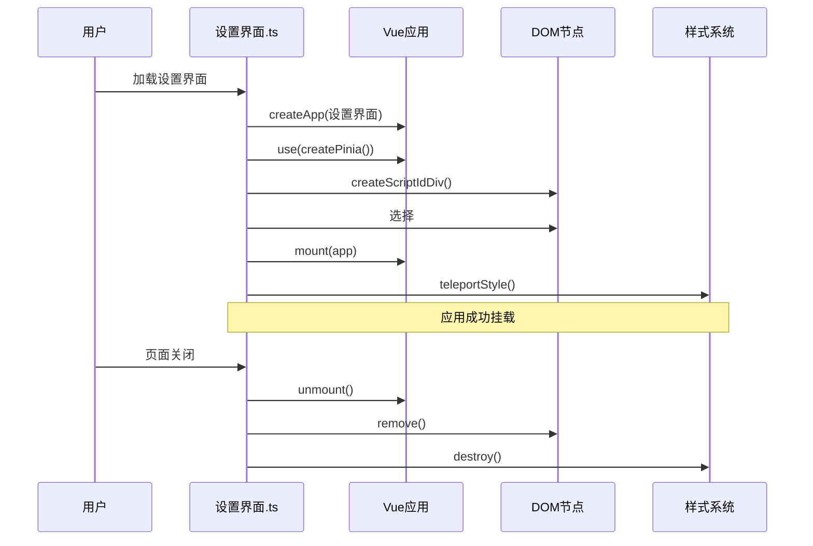
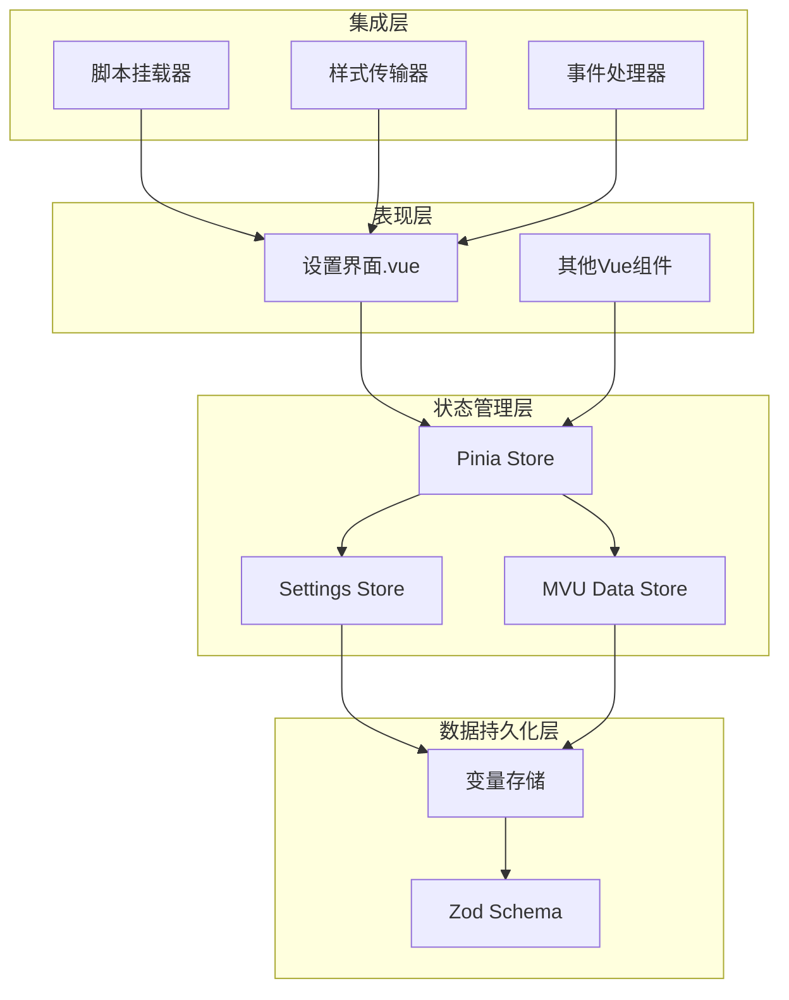
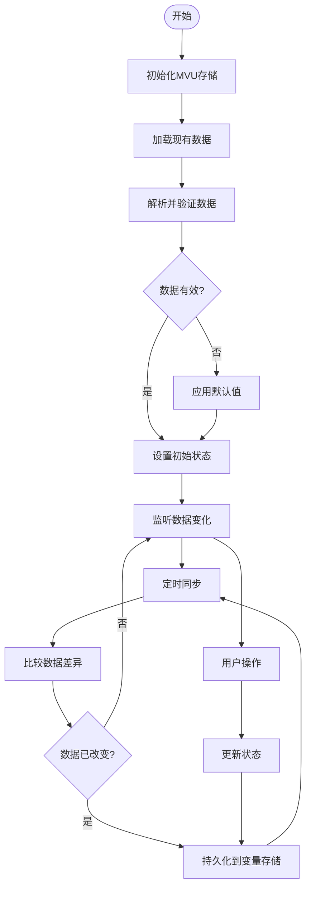
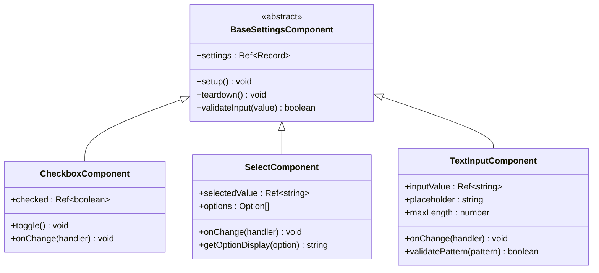
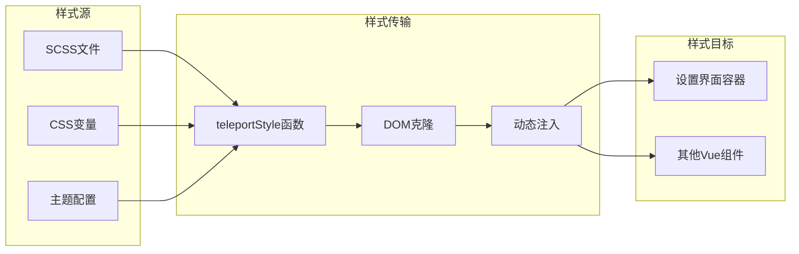

# 设置界面系统

<cite>
**本文档引用的文件**
- [README.md](file://README.md)
- [settings.ts](file://示例/脚本示例/settings.ts)
- [设置界面.ts](file://示例/脚本示例/设置界面.ts)
- [设置界面.vue](file://示例/脚本示例/设置界面.vue)
- [script.ts](file://util/script.ts)
- [mvu.ts](file://util/mvu.ts)
- [variables.d.ts](file://@types/function/variables.d.ts)
- [variables.d.ts](file://参考脚本示例/@types/function/variables.d.ts)
- [App.vue](file://示例/角色卡示例/界面/状态栏/App.vue)
- [store.ts](file://示例/角色卡示例/界面/状态栏/store.ts)
- [TabNav.vue](file://示例/角色卡示例/界面/状态栏/components/TabNav.vue)
- [DependencyBar.vue](file://示例/角色卡示例/界面/状态栏/components/DependencyBar.vue)
- [index.ts](file://src/快速情节编排/index.ts)
</cite>

## 目录
1. [简介](#简介)
2. [项目结构](#项目结构)
3. [核心组件](#核心组件)
4. [架构概览](#架构概览)
5. [详细组件分析](#详细组件分析)
6. [依赖关系分析](#依赖关系分析)
7. [性能考虑](#性能考虑)
8. [故障排除指南](#故障排除指南)
9. [结论](#结论)
10. [附录](#附录)

## 简介

设置界面系统是酒馆助手（SillyTavern）扩展开发中的重要组成部分，负责为脚本和角色卡提供用户可配置的界面。本系统基于Vue 3 + TypeScript + Pinia的状态管理架构，结合酒馆助手的变量存储机制，实现了完整的设置界面生命周期管理。

该系统支持多种输入控件类型，包括开关按钮、下拉菜单、文本输入框等，并提供了响应式的数据绑定机制。通过MVU（Model-View-Update）模式，确保设置数据的持久化存储和实时同步。

## 项目结构

项目采用模块化的组织方式，主要包含以下关键目录：

```mermaid
graph TB
subgraph "核心示例"
A[脚本示例]
B[前端界面示例]
C[角色卡示例]
end
subgraph "工具库"
D[util/]
E[@types/]
end
subgraph "初始模板"
F[初始模板/]
end
subgraph "参考实现"
G[参考脚本示例/]
end
A --> D
C --> D
A --> E
C --> E
F --> A
F --> C
G --> A
G --> C
```

**图表来源**
- [README.md:1-105](file://README.md#L1-L105)

**章节来源**
- [README.md:1-105](file://README.md#L1-L105)

## 核心组件

### 设置存储管理器

设置存储管理器是整个设置界面系统的核心，负责管理设置数据的读取、验证、更新和持久化。



**图表来源**
- [settings.ts:1-16](file://示例/脚本示例/settings.ts#L1-L16)
- [variables.d.ts:67-165](file://@types/function/variables.d.ts#L67-L165)

设置存储管理器的关键特性：
- **数据验证**：使用Zod进行类型安全的设置数据验证
- **默认值处理**：通过`prefault`方法提供默认值支持
- **自动持久化**：监听设置变化并自动保存到变量存储
- **类型安全**：编译时类型检查确保数据完整性

**章节来源**
- [settings.ts:1-16](file://示例/脚本示例/settings.ts#L1-L16)

### Vue设置界面组件

Vue设置界面组件提供了直观的用户交互界面，支持多种输入控件和布局选项。



**图表来源**
- [设置界面.vue:1-36](file://示例/脚本示例/设置界面.vue#L1-L36)

**章节来源**
- [设置界面.vue:1-36](file://示例/脚本示例/设置界面.vue#L1-L36)

### 应用挂载系统

应用挂载系统负责将Vue应用正确挂载到酒馆助手的设置界面中。



**图表来源**
- [设置界面.ts:1-18](file://示例/脚本示例/设置界面.ts#L1-L18)
- [script.ts:13-24](file://util/script.ts#L13-L24)

**章节来源**
- [设置界面.ts:1-18](file://示例/脚本示例/设置界面.ts#L1-L18)

## 架构概览

设置界面系统采用分层架构设计，确保各组件职责清晰、耦合度低。



**图表来源**
- [settings.ts:7-15](file://示例/脚本示例/settings.ts#L7-L15)
- [mvu.ts:3-66](file://util/mvu.ts#L3-L66)
- [script.ts:1-47](file://util/script.ts#L1-L47)

系统架构的关键特点：
- **分层设计**：表现层、状态管理层、数据持久化层分离
- **插件化**：支持多个独立的设置界面组件
- **类型安全**：全程使用TypeScript确保类型安全
- **响应式更新**：基于Vue 3的响应式系统实现实时更新

## 详细组件分析

### 设置数据模型

设置数据模型定义了所有可配置参数的结构和约束条件。

```mermaid
erDiagram
SETTINGS {
boolean button_selected
string text_value
number number_value
enum select_value
array array_value
}
SCHEMA {
z.object settings
z.boolean default false
z.string optional
z.number min_max
z.enum members
z.array of_strings
}
DEFAULTS {
button_selected: false
text_value: ""
number_value: 0
select_value: "option1"
array_value: []
}
SETTINGS ||--|| SCHEMA : "遵循"
SETTINGS ||--|| DEFAULTS : "使用"
```

**图表来源**
- [settings.ts:1-5](file://示例/脚本示例/settings.ts#L1-L5)

设置数据模型的设计原则：
- **明确性**：每个设置项都有明确的数据类型
- **可验证性**：支持运行时数据验证
- **可扩展性**：易于添加新的设置项
- **向后兼容**：默认值确保新版本的兼容性

**章节来源**
- [settings.ts:1-5](file://示例/脚本示例/settings.ts#L1-L5)

### MVU数据存储机制

MVU（Model-View-Update）模式提供了强大的数据持久化和同步能力。



**图表来源**
- [mvu.ts:21-64](file://util/mvu.ts#L21-L64)

MVU机制的核心优势：
- **双向同步**：确保UI状态与存储状态保持一致
- **错误恢复**：数据验证失败时自动回滚到安全状态
- **性能优化**：只在数据真正改变时才进行持久化
- **实时更新**：支持多实例间的实时数据同步

**章节来源**
- [mvu.ts:1-66](file://util/mvu.ts#L1-L66)

### Vue组件设计模式

Vue组件采用了现代化的设计模式，支持复杂的用户交互和数据绑定。



**图表来源**
- [设置界面.vue:14-16](file://示例/脚本示例/设置界面.vue#L14-L16)

组件设计的关键特性：
- **响应式数据绑定**：使用v-model实现双向数据绑定
- **事件驱动**：通过事件处理器响应用户操作
- **样式隔离**：使用scoped样式避免样式冲突
- **可复用性**：组件设计支持在不同场景下复用

**章节来源**
- [设置界面.vue:1-36](file://示例/脚本示例/设置界面.vue#L1-L36)

### 样式管理系统

样式管理系统确保设置界面在不同环境下都能正确显示。



**图表来源**
- [script.ts:13-24](file://util/script.ts#L13-L24)

样式管理的优势：
- **环境适配**：自动适配不同的显示环境
- **样式隔离**：避免与其他组件的样式冲突
- **动态更新**：支持运行时样式调整
- **性能优化**：最小化样式传输开销

**章节来源**
- [script.ts:1-47](file://util/script.ts#L1-L47)

## 依赖关系分析

设置界面系统的依赖关系体现了清晰的模块化设计。

```mermaid
graph TB
subgraph "外部依赖"
A[Vue 3]
B[TypeScript]
C[Pinia]
D[Zod]
E[Lodash]
end
subgraph "内部模块"
F[util/script.ts]
G[util/mvu.ts]
H[示例/脚本示例/settings.ts]
I[示例/脚本示例/设置界面.vue]
end
subgraph "类型定义"
J[@types/function/variables.d.ts]
K[@types/iframe/variables.d.ts]
end
A --> F
B --> F
C --> H
D --> H
E --> G
F --> H
G --> H
J --> H
K --> H
J --> G
K --> G
```

**图表来源**
- [settings.ts:1-16](file://示例/脚本示例/settings.ts#L1-L16)
- [mvu.ts:1-66](file://util/mvu.ts#L1-L66)
- [script.ts:1-47](file://util/script.ts#L1-L47)

依赖关系的特点：
- **松耦合**：模块间依赖关系清晰且松散
- **类型安全**：完整的TypeScript类型定义
- **向前兼容**：依赖版本管理确保兼容性
- **可测试性**：清晰的依赖边界便于单元测试

**章节来源**
- [README.md:1-105](file://README.md#L1-L105)

## 性能考虑

设置界面系统在设计时充分考虑了性能优化：

### 数据绑定优化
- 使用`watchEffect`替代传统的`watch`，减少不必要的计算
- 通过`klona`实现深拷贝，避免引用污染
- 使用`storeToRefs`优化Pinia状态访问性能

### 渲染性能优化
- Vue 3的Composition API提供更好的Tree-shaking支持
- scoped样式减少全局样式查询开销
- 组件懒加载避免不必要的初始化

### 内存管理
- 页面卸载时自动清理Vue实例和DOM节点
- 样式传输器提供显式销毁机制
- 事件监听器在组件销毁时自动移除

## 故障排除指南

### 常见问题及解决方案

**问题1：设置数据无法持久化**
- 检查变量存储权限配置
- 验证Zod schema定义是否正确
- 确认`insertOrAssignVariables`调用时机

**问题2：界面不显示或显示异常**
- 检查Vue应用挂载点是否存在
- 验证样式传输是否成功
- 确认组件依赖是否正确加载

**问题3：数据同步问题**
- 检查MVU存储的定时同步间隔
- 验证数据验证逻辑
- 确认多实例间的冲突处理

**章节来源**
- [settings.ts:8-12](file://示例/脚本示例/settings.ts#L8-L12)
- [script.ts:13-24](file://util/script.ts#L13-L24)

## 结论

设置界面系统通过精心设计的架构和实现，为酒馆助手扩展开发提供了强大而灵活的设置管理能力。系统的主要优势包括：

1. **类型安全**：完整的TypeScript支持确保编译时类型检查
2. **数据持久化**：可靠的变量存储机制保证设置数据的持久性
3. **响应式更新**：基于Vue 3的响应式系统提供流畅的用户体验
4. **模块化设计**：清晰的组件分离便于维护和扩展
5. **性能优化**：多项性能优化措施确保系统的高效运行

该系统为开发者提供了一个完整的框架，可以在此基础上构建各种复杂的设置界面，满足不同场景下的需求。

## 附录

### 开发最佳实践

1. **组件设计**：遵循单一职责原则，每个组件专注于特定功能
2. **数据管理**：使用Pinia进行集中状态管理，避免状态分散
3. **样式管理**：使用scoped样式和CSS变量确保样式隔离
4. **错误处理**：实现完善的错误处理和降级策略
5. **性能监控**：定期检查内存使用和渲染性能

### 扩展指南

系统支持多种扩展方式：
- 添加新的输入控件类型
- 扩展数据验证规则
- 集成第三方UI库
- 实现自定义布局系统