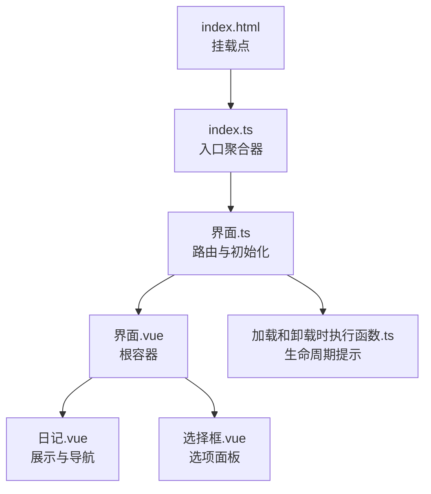
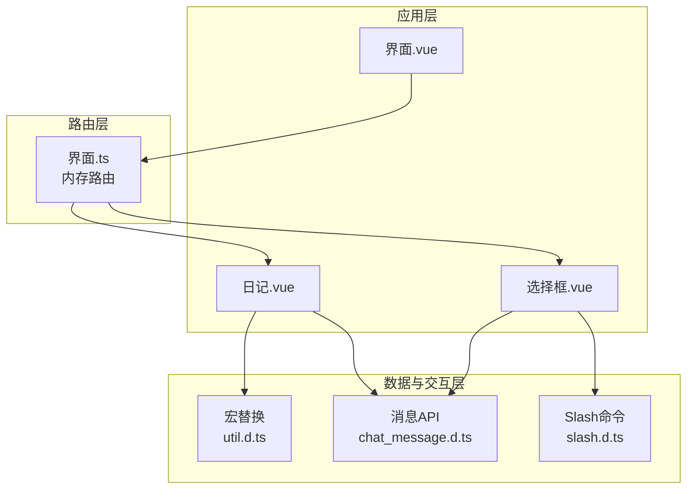
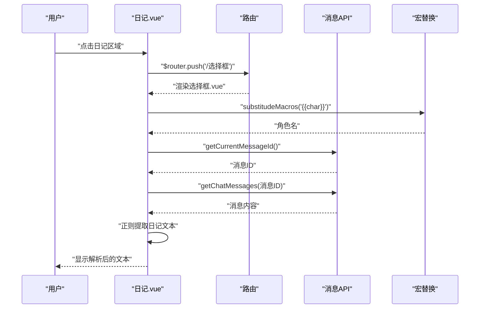
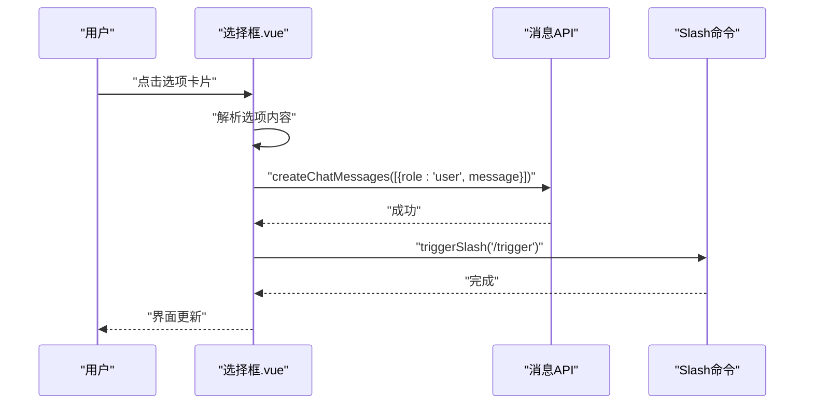
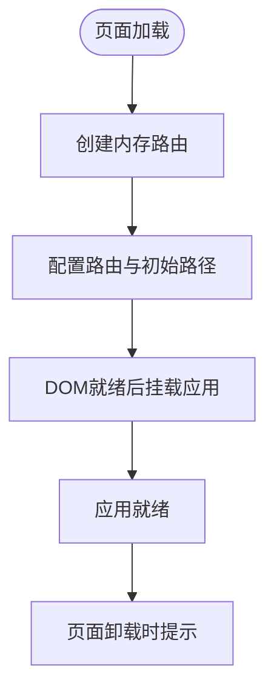
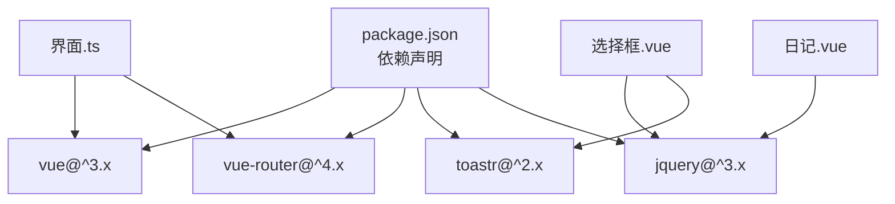

# 前端界面示例

<cite>
**本文引用的文件**
- [界面.vue](file://示例/前端界面示例/界面.vue)
- [日记.vue](file://示例/前端界面示例/日记.vue)
- [选择框.vue](file://示例/前端界面示例/选择框.vue)
- [界面.ts](file://示例/前端界面示例/界面.ts)
- [index.ts](file://示例/前端界面示例/index.ts)
- [index.html](file://示例/前端界面示例/index.html)
- [加载和卸载时执行函数.ts](file://示例/前端界面示例/加载和卸载时执行函数.ts)
- [slash.d.ts](file://@types/function/slash.d.ts)
- [chat_message.d.ts](file://@types/function/chat_message.d.ts)
- [util.d.ts](file://@types/function/util.d.ts)
- [displayed_message.d.ts](file://@types/function/displayed_message.d.ts)
- [variables.d.ts](file://@types/iframe/variables.d.ts)
- [package.json](file://package.json)
</cite>

## 目录
1. [简介](#简介)
2. [项目结构](#项目结构)
3. [核心组件](#核心组件)
4. [架构总览](#架构总览)
5. [详细组件分析](#详细组件分析)
6. [依赖关系分析](#依赖关系分析)
7. [性能考虑](#性能考虑)
8. [故障排除指南](#故障排除指南)
9. [结论](#结论)
10. [附录](#附录)

## 简介
本文件面向希望学习如何在酒馆助手（SillyTavern）环境中开发 Vue3 单文件组件（SFC）的开发者。通过对示例工程中的界面.vue、日记.vue、选择框.vue 三个核心组件及其路由与生命周期管理的深入解析，帮助读者掌握：
- 组件设计模式与职责分离
- 响应式数据绑定与生命周期钩子的正确使用
- 事件处理与用户交互
- 组件间通信与状态管理策略
- 样式系统与可访问性优化
- 与酒馆助手 API 的集成方式（宏替换、消息读取、消息创建、Slash 命令触发）

本指南以循序渐进的方式呈现从基础组件到复杂交互的完整开发流程，并提供可复用的最佳实践建议。

## 项目结构
示例前端界面位于示例/前端界面示例目录下，采用最小化的入口组织方式：
- index.html：应用挂载点
- index.ts：应用入口聚合器
- 界面.ts：路由与应用初始化
- 界面.vue：根视图容器，承载路由视图
- 日记.vue：展示与导航组件
- 选择框.vue：选项面板组件
- 加载和卸载时执行函数.ts：生命周期提示脚本

**图表来源**
- [index.html:1-5](file://示例/前端界面示例/index.html#L1-L5)
- [index.ts:1-3](file://示例/前端界面示例/index.ts#L1-L3)
- [界面.ts:1-22](file://示例/前端界面示例/界面.ts#L1-L22)
- [界面.vue:1-4](file://示例/前端界面示例/界面.vue#L1-L4)
- [日记.vue:1-107](file://示例/前端界面示例/日记.vue#L1-L107)
- [选择框.vue:1-215](file://示例/前端界面示例/选择框.vue#L1-L215)
- [加载和卸载时执行函数.ts:1-11](file://示例/前端界面示例/加载和卸载时执行函数.ts#L1-L11)

**章节来源**
- [index.html:1-5](file://示例/前端界面示例/index.html#L1-L5)
- [index.ts:1-3](file://示例/前端界面示例/index.ts#L1-L3)
- [界面.ts:1-22](file://示例/前端界面示例/界面.ts#L1-L22)

## 核心组件
本节聚焦三个关键组件的功能职责与实现要点：

- 界面.vue：作为根容器，仅负责承载 RouterView，实现页面级布局与导航占位。
- 日记.vue：负责从当前消息楼层读取内容，解析特定格式的日记文本，并提供点击跳转至选项面板的能力。
- 选择框.vue：负责解析消息中的选项结构，渲染为可点击的选项卡片，并在点击后向消息流注入用户输入与触发后续逻辑。

**章节来源**
- [界面.vue:1-4](file://示例/前端界面示例/界面.vue#L1-L4)
- [日记.vue:1-107](file://示例/前端界面示例/日记.vue#L1-L107)
- [选择框.vue:1-215](file://示例/前端界面示例/选择框.vue#L1-L215)

## 架构总览
该示例采用“单页应用 + 内存路由”的轻量架构：
- 应用通过 jQuery DOM 就绪回调初始化，创建并挂载 Vue 应用实例。
- 使用 vue-router 的内存历史记录，避免与页面 URL 同步，适合嵌入式界面。
- 根组件仅承载路由视图，具体页面由日记.vue 与选择框.vue 提供。
- 组件间通过 props 传递数据（从路由参数到选择框），并通过消息 API 与 Slash 命令实现与酒馆助手的交互。

**图表来源**
- [界面.ts:1-22](file://示例/前端界面示例/界面.ts#L1-L22)
- [日记.vue:1-107](file://示例/前端界面示例/日记.vue#L1-L107)
- [选择框.vue:1-215](file://示例/前端界面示例/选择框.vue#L1-L215)
- [chat_message.d.ts:1-235](file://@types/function/chat_message.d.ts#L1-L235)
- [slash.d.ts:1-29](file://@types/function/slash.d.ts#L1-L29)
- [util.d.ts:1-44](file://@types/function/util.d.ts#L1-L44)

## 详细组件分析

### 组件一：界面.vue（根容器）
- 设计模式：容器组件，职责单一，仅承载 RouterView。
- 生命周期：无业务逻辑，无需额外钩子。
- 样式与可访问性：保持极简，避免干扰子组件样式。

**章节来源**
- [界面.vue:1-4](file://示例/前端界面示例/界面.vue#L1-L4)

### 组件二：日记.vue（展示与导航）
- 数据绑定：使用 ref 声明响应式 display_text；在 mounted 钩子中捕获并解析消息内容。
- 事件处理：为根元素绑定点击事件，点击后通过 $router.push 导航到选项面板。
- 与酒馆助手 API 的集成：
  - 通过 substitudeMacros 解析角色名等宏。
  - 通过 getCurrentMessageId 获取当前楼层号。
  - 通过 getChatMessages 读取消息内容并用正则提取“日记”片段。
- 样式系统：使用 scoped SCSS，定义统一的视觉风格与交互态（hover/active）。

**图表来源**
- [日记.vue:1-107](file://示例/前端界面示例/日记.vue#L1-L107)
- [util.d.ts:1-44](file://@types/function/util.d.ts#L1-L44)
- [chat_message.d.ts:1-235](file://@types/function/chat_message.d.ts#L1-L235)

**章节来源**
- [日记.vue:1-107](file://示例/前端界面示例/日记.vue#L1-L107)

### 组件三：选择框.vue（选项面板）
- Props 接收：通过 defineProps 接收 message 字符串，作为选项数据源。
- 数据解析：使用正则匹配 roleplay_options 片段，解析键值对为选项数组。
- 事件处理：为每个选项绑定点击事件，点击后：
  - 通过 createChatMessages 注入用户输入到消息流末尾。
  - 通过 triggerSlash 执行 /trigger 触发后续逻辑。
- 样式系统：使用 scoped SCSS，提供丰富的 hover/active 效果与媒体查询适配。

**图表来源**
- [选择框.vue:1-215](file://示例/前端界面示例/选择框.vue#L1-L215)
- [chat_message.d.ts:188-191](file://@types/function/chat_message.d.ts#L188-L191)
- [slash.d.ts:1-29](file://@types/function/slash.d.ts#L1-L29)

**章节来源**
- [选择框.vue:1-215](file://示例/前端界面示例/选择框.vue#L1-L215)

### 路由与应用初始化（界面.ts）
- 路由配置：使用 createRouter + createMemoryHistory，定义两条路由：
  - /日记：日记组件
  - /选择框：选择框组件，并通过 props 将当前消息传入
- 应用挂载：在 DOM 就绪后创建并挂载应用实例到 #app。
- 生命周期提示：在加载与卸载时通过 toastr 提示用户。

**图表来源**
- [界面.ts:1-22](file://示例/前端界面示例/界面.ts#L1-L22)
- [加载和卸载时执行函数.ts:1-11](file://示例/前端界面示例/加载和卸载时执行函数.ts#L1-L11)

**章节来源**
- [界面.ts:1-22](file://示例/前端界面示例/界面.ts#L1-L22)
- [加载和卸载时执行函数.ts:1-11](file://示例/前端界面示例/加载和卸载时执行函数.ts#L1-L11)

## 依赖关系分析
- 开发与运行时依赖：Vue3、vue-router、toastr、jQuery 等。
- 类型声明：通过 @types 与 @types/iframe 提供的类型定义，确保与酒馆助手 API 的类型安全。
- 组件间耦合：日记.vue 与选择框.vue 通过路由与消息 API 耦合，props 传递降低直接耦合度。

**图表来源**
- [package.json:1-120](file://package.json#L1-L120)
- [界面.ts:1-22](file://示例/前端界面示例/界面.ts#L1-L22)

**章节来源**
- [package.json:1-120](file://package.json#L1-L120)

## 性能考虑
- 渲染优化
  - 使用 v-for 时提供稳定 key，减少不必要的重渲染（已在选择框.vue 中实践）。
  - 将复杂计算放入 computed（如需扩展），避免在模板中重复计算。
- 事件处理
  - 将事件处理器绑定在可点击元素上，避免过度绑定到根元素导致的冒泡开销。
- 样式优化
  - 使用 scoped SCSS，避免全局污染；合理拆分样式块，按需引入。
  - 媒体查询与 reduce-motion 适配，提升可访问性与性能一致性。
- 资源加载
  - 采用内存路由避免 URL 同步带来的副作用，减少不必要的页面跳转。
  - 在加载与卸载时使用 toastr 提示，避免阻塞主线程。

[本节为通用指导，不直接分析具体文件]

## 故障排除指南
- 页面无法挂载
  - 确认 index.html 中存在 #app 挂载点。
  - 确认界面.ts 在 DOM 就绪后执行挂载。
- 路由不生效
  - 检查界面.ts 中路由配置与初始路径设置。
  - 确认 RouterView 正确渲染在界面.vue 中。
- 选项面板无数据
  - 检查消息中是否存在 roleplay_options 结构。
  - 确认正则匹配逻辑与消息格式一致。
- 无法触发 Slash 命令
  - 确认 slash 命令可用且拼写正确。
  - 检查 triggerSlash 的调用时机与返回值处理。
- 宏替换无效
  - 确认 substitudeMacros 的调用位置与上下文。
  - 检查角色卡与消息环境是否已加载。

**章节来源**
- [index.html:1-5](file://示例/前端界面示例/index.html#L1-L5)
- [界面.ts:1-22](file://示例/前端界面示例/界面.ts#L1-L22)
- [日记.vue:1-107](file://示例/前端界面示例/日记.vue#L1-L107)
- [选择框.vue:1-215](file://示例/前端界面示例/选择框.vue#L1-L215)
- [slash.d.ts:1-29](file://@types/function/slash.d.ts#L1-L29)
- [util.d.ts:1-44](file://@types/function/util.d.ts#L1-L44)

## 结论
本示例展示了在酒馆助手环境中构建 Vue3 单文件组件的完整路径：从应用初始化、路由配置，到组件的数据绑定、事件处理与与酒馆助手 API 的集成。通过 props 传递与消息 API 的配合，实现了从“展示日记”到“选择并提交选项”的完整交互闭环。遵循本文档的模式与最佳实践，开发者可以快速复用并扩展此类界面组件，构建更复杂的交互体验。

[本节为总结性内容，不直接分析具体文件]

## 附录
- 术语说明
  - 宏：在酒馆助手中的占位符，可在运行时被替换为实际值。
  - 楼层：消息在聊天记录中的层级编号。
  - Slash 命令：酒馆助手提供的命令式接口，用于触发特定行为。
- 参考类型定义
  - 消息 API：用于读取、创建、删除与旋转消息。
  - Slash 命令：用于触发命令与管道。
  - 工具函数：宏替换、消息 ID 获取、错误包装等。

**章节来源**
- [chat_message.d.ts:1-235](file://@types/function/chat_message.d.ts#L1-L235)
- [slash.d.ts:1-29](file://@types/function/slash.d.ts#L1-L29)
- [util.d.ts:1-44](file://@types/function/util.d.ts#L1-L44)
- [displayed_message.d.ts:1-70](file://@types/function/displayed_message.d.ts#L1-L70)
- [variables.d.ts:1-9](file://@types/iframe/variables.d.ts#L1-L9)