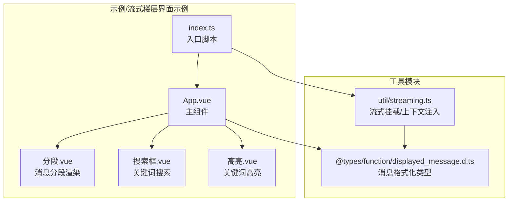
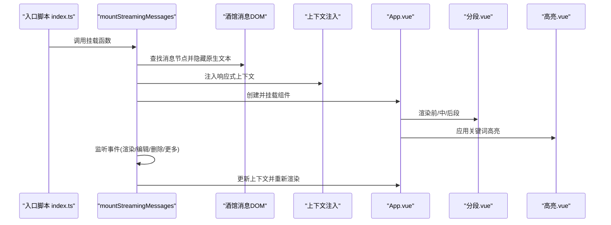
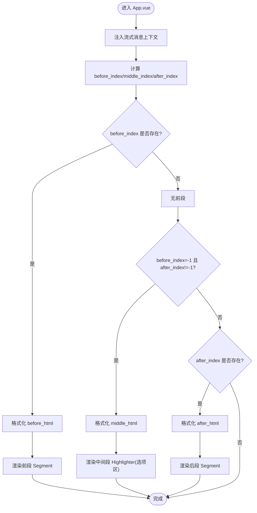
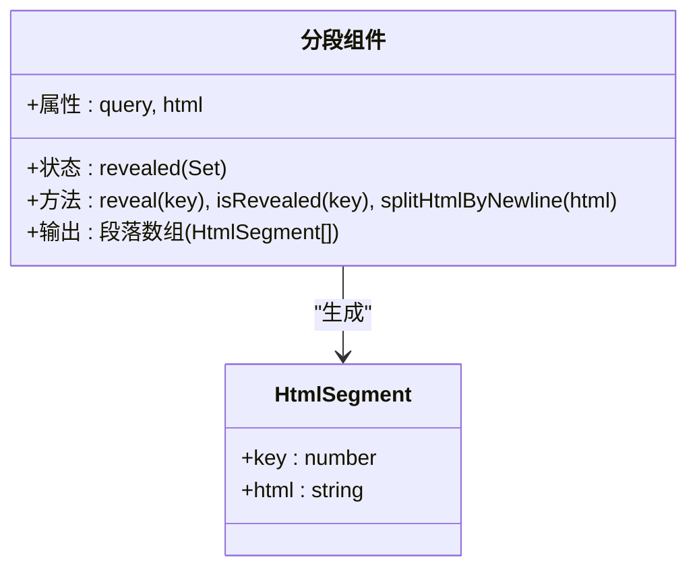
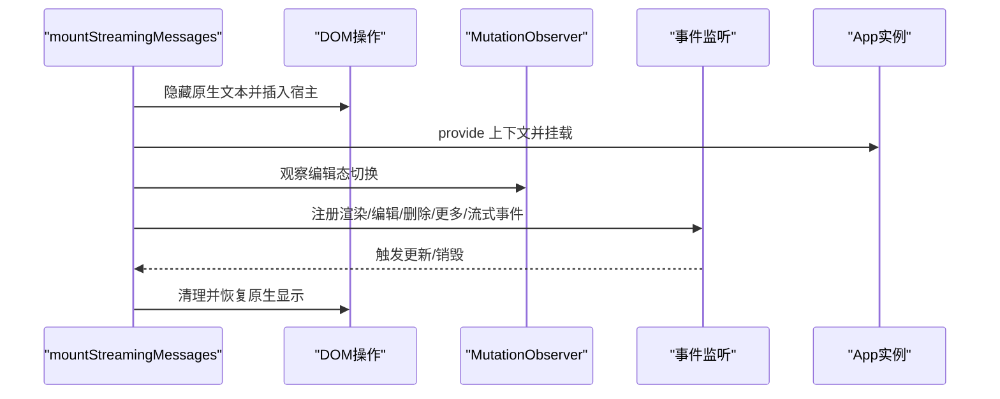
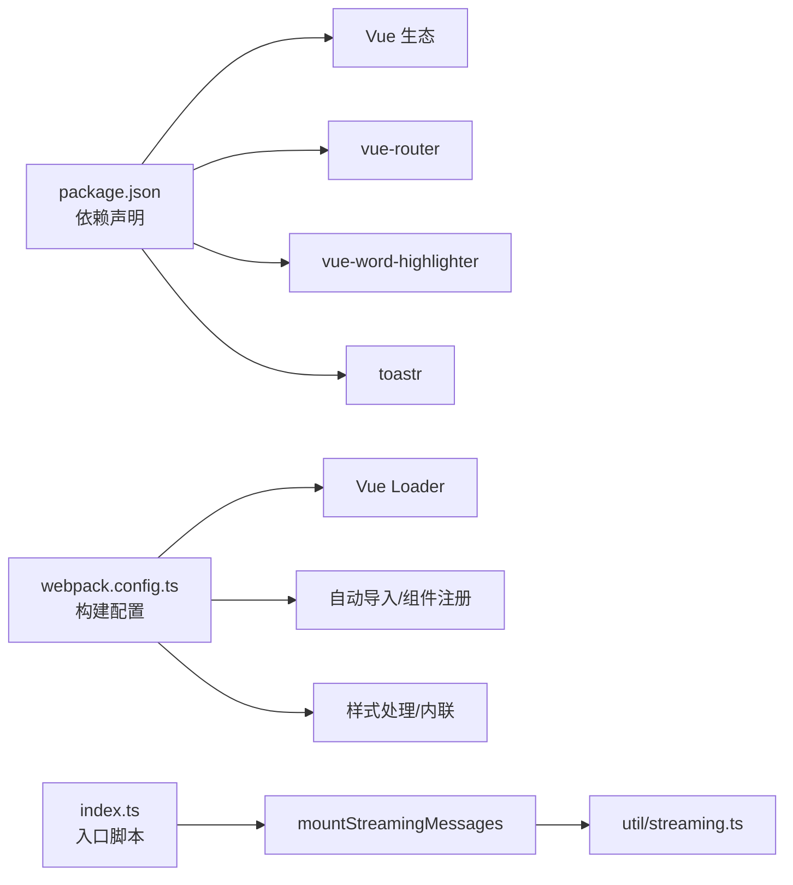

# 流式楼层界面示例

<cite>
**本文档引用的文件**
- [App.vue](file://示例/流式楼层界面示例/App.vue)
- [index.ts](file://示例/流式楼层界面示例/index.ts)
- [分段.vue](file://示例/流式楼层界面示例/分段.vue)
- [搜索框.vue](file://示例/流式楼层界面示例/搜索框.vue)
- [高亮.vue](file://示例/流式楼层界面示例/高亮.vue)
- [streaming.ts](file://util/streaming.ts)
- [displayed_message.d.ts](file://@types/function/displayed_message.d.ts)
- [选择框.vue](file://示例/前端界面示例/选择框.vue)
- [package.json](file://package.json)
- [webpack.config.ts](file://webpack.config.ts)
- [README.md](file://README.md)
</cite>

## 目录
1. [简介](#简介)
2. [项目结构](#项目结构)
3. [核心组件](#核心组件)
4. [架构总览](#架构总览)
5. [详细组件分析](#详细组件分析)
6. [依赖关系分析](#依赖关系分析)
7. [性能考虑](#性能考虑)
8. [故障排除指南](#故障排除指南)
9. [结论](#结论)
10. [附录](#附录)

## 简介
本示例展示了如何在酒馆助手（SillyTavern）环境中，为每条消息楼层构建“流式楼层界面”。该界面能够：
- 实时接收并展示流式生成的消息片段
- 将消息按“前段/中间选项区/后段”三段式渲染
- 提供关键词搜索与高亮
- 支持点击逐段展开，以及选项区的快捷回复
- 在消息编辑/删除/加载更多等事件中保持稳定更新
- 提供清晰的生命周期提示与卸载处理

本指南将从系统架构、组件设计、数据流、处理逻辑、集成点、错误处理与性能优化等方面进行深入解析，并给出可操作的使用示例与最佳实践。

## 项目结构
示例采用“示例/流式楼层界面示例”目录组织，核心入口与组件如下：
- 入口脚本：index.ts
- 主组件：App.vue
- 子组件：分段.vue、搜索框.vue、高亮.vue
- 工具模块：util/streaming.ts（流式挂载与上下文注入）
- 类型声明：@types/function/displayed_message.d.ts（消息格式化工具）
- 依赖与构建：package.json、webpack.config.ts
- 说明文档：README.md

**图表来源**
- [index.ts:1-8](file://示例/流式楼层界面示例/index.ts#L1-L8)
- [App.vue:1-72](file://示例/流式楼层界面示例/App.vue#L1-L72)
- [分段.vue:1-79](file://示例/流式楼层界面示例/分段.vue#L1-L79)
- [搜索框.vue:1-95](file://示例/流式楼层界面示例/搜索框.vue#L1-L95)
- [高亮.vue:1-20](file://示例/流式楼层界面示例/高亮.vue#L1-L20)
- [streaming.ts:1-238](file://util/streaming.ts#L1-L238)
- [displayed_message.d.ts:1-71](file://@types/function/displayed_message.d.ts#L1-L71)

**章节来源**
- [index.ts:1-8](file://示例/流式楼层界面示例/index.ts#L1-L8)
- [App.vue:1-72](file://示例/流式楼层界面示例/App.vue#L1-L72)
- [streaming.ts:1-238](file://util/streaming.ts#L1-L238)
- [displayed_message.d.ts:1-71](file://@types/function/displayed_message.d.ts#L1-L71)
- [README.md:1-105](file://README.md#L1-L105)

## 核心组件
- 流式挂载与上下文注入：通过 mountStreamingMessages 将组件挂载到每条消息楼层，注入响应式上下文（消息 ID、消息内容、是否正在流式中），并监听消息渲染、编辑、删除、更多消息加载等事件，动态更新界面。
- 主组件 App.vue：负责解析消息内容，拆分为 before/middle/after 三段，分别渲染分段组件或选项区组件；同时提供搜索框与高亮机制。
- 分段组件 分段.vue：将 HTML 按换行切分为多个段落，支持点击逐段展开与模糊遮罩效果。
- 搜索框组件 搜索框.vue：提供 v-model 双向绑定的查询词输入，支持清空与 ESC 键盘事件。
- 高亮组件 高亮.vue：基于 vue-word-highlighter 实现关键词高亮，提供统一的高亮样式。
- 选项区组件 选择框.vue：从消息中提取选项区内容，渲染为可点击的选项卡片，点击后触发快捷回复。

**章节来源**
- [streaming.ts:41-238](file://util/streaming.ts#L41-L238)
- [App.vue:16-72](file://示例/流式楼层界面示例/App.vue#L16-L72)
- [分段.vue:18-79](file://示例/流式楼层界面示例/分段.vue#L18-L79)
- [搜索框.vue:18-95](file://示例/流式楼层界面示例/搜索框.vue#L18-L95)
- [高亮.vue:7-20](file://示例/流式楼层界面示例/高亮.vue#L7-L20)
- [选择框.vue:21-45](file://示例/前端界面示例/选择框.vue#L21-L45)

## 架构总览
下图展示了从入口脚本到组件渲染、再到事件驱动更新的整体流程：

**图表来源**
- [index.ts:4-7](file://示例/流式楼层界面示例/index.ts#L4-L7)
- [streaming.ts:108-162](file://util/streaming.ts#L108-L162)
- [App.vue:16-72](file://示例/流式楼层界面示例/App.vue#L16-L72)
- [分段.vue:18-45](file://示例/流式楼层界面示例/分段.vue#L18-L45)
- [高亮.vue:7-11](file://示例/流式楼层界面示例/高亮.vue#L7-L11)

## 详细组件分析

### 主组件 App.vue 设计架构
- 上下文注入：通过 injectStreamingMessageContext 获取当前消息的响应式上下文，包含消息 ID、消息内容、是否正在流式中。
- 消息分段：
  - before_html：截取到选项区开始之前的 HTML 片段，使用 formatAsDisplayedMessage 格式化并传入高亮组件。
  - middle_html：当仅有选项区开始标记而无结束标记时，将剩余内容作为中间段落处理。
  - after_html：截取选项区结束标记之后的内容，同样进行格式化与高亮。
- 搜索与高亮：顶部搜索框提供 v-model 绑定的查询词，传递给高亮组件实现关键词高亮。
- 生命周期与提示：在 onMounted 时弹出挂载成功的提示，在 during_streaming 从 true 变为 false 时弹出流式完成提示。

**图表来源**
- [App.vue:27-58](file://示例/流式楼层界面示例/App.vue#L27-L58)
- [displayed_message.d.ts:28-46](file://@types/function/displayed_message.d.ts#L28-L46)

**章节来源**
- [App.vue:16-72](file://示例/流式楼层界面示例/App.vue#L16-L72)
- [displayed_message.d.ts:23-46](file://@types/function/displayed_message.d.ts#L23-L46)

### 分段组件 分段.vue
- 属性：query（查询词）、html（待渲染的 HTML 字符串）
- 状态：revealed（已展开段落集合）
- 功能：
  - 将 HTML 按换行分割为多个段落对象，每个段落带唯一 key。
  - 未展开时显示模糊遮罩与“点击显示”提示，点击后切换为可见。
  - 高亮组件嵌套在每个段落中，实现局部关键词高亮。
- 样式：提供段落容器、遮罩提示与模糊效果的样式。

**图表来源**
- [分段.vue:18-45](file://示例/流式楼层界面示例/分段.vue#L18-L45)

**章节来源**
- [分段.vue:18-79](file://示例/流式楼层界面示例/分段.vue#L18-L79)

### 搜索框组件 搜索框.vue
- 提供 v-model 双向绑定的查询词输入框，支持点击阻止冒泡。
- 支持 ESC 键清空查询词。
- 清除按钮在有内容时显示，点击清空输入。
- 样式采用主题色混合，聚焦态增强阴影与边框。

**章节来源**
- [搜索框.vue:18-95](file://示例/流式楼层界面示例/搜索框.vue#L18-L95)

### 高亮组件 高亮.vue
- 使用 vue-word-highlighter 组件对传入的 HTML 进行关键词高亮。
- 通过自定义高亮样式类名实现与酒馆主题一致的视觉效果。
- slot 插槽允许在高亮组件内部放置其他内容（如选项区）。

**章节来源**
- [高亮.vue:7-20](file://示例/流式楼层界面示例/高亮.vue#L7-L20)

### 选项区组件 选择框.vue
- 从消息中解析选项区内容，提取标题与内容，渲染为可点击的选项卡片。
- 点击选项后，调用创建消息接口并触发斜杠命令，实现快捷回复。
- 样式采用渐变背景与悬停动画，提升交互体验。

**章节来源**
- [选择框.vue:21-45](file://示例/前端界面示例/选择框.vue#L21-L45)

### 流式挂载与上下文注入 util/streaming.ts
- StreamingMessageContext：定义消息上下文字段（prefix、host_id、message_id、message、during_streaming）。
- injectStreamingMessageContext：在组件中注入并读取上下文。
- mountStreamingMessages：
  - 选择宿主（iframe/div），隐藏原生消息文本并在其下方插入宿主节点。
  - 为每条消息创建响应式上下文并注入，随后挂载组件。
  - 监听多种事件（消息渲染、编辑、删除、更多消息加载、流式令牌到达），动态更新或销毁实例。
  - 提供 unmount 方法，清理 DOM、样式与观察器，恢复原生消息显示。

**图表来源**
- [streaming.ts:41-238](file://util/streaming.ts#L41-L238)

**章节来源**
- [streaming.ts:8-238](file://util/streaming.ts#L8-L238)

## 依赖关系分析
- 依赖声明：项目使用 Vue 3、vue-router、vue-word-highlighter、toastr 等依赖。
- 构建配置：webpack.config.ts 配置了多入口扫描、Vue Loader、自动导入、组件自动注册、样式处理、外链依赖映射等。
- 入口脚本：index.ts 通过 jQuery 在页面加载完成后挂载流式界面，并在页面隐藏时卸载。

**图表来源**
- [package.json:79-107](file://package.json#L79-L107)
- [webpack.config.ts:444-462](file://webpack.config.ts#L444-L462)
- [index.ts:1-8](file://示例/流式楼层界面示例/index.ts#L1-L8)
- [streaming.ts:1-238](file://util/streaming.ts#L1-L238)

**章节来源**
- [package.json:79-107](file://package.json#L79-L107)
- [webpack.config.ts:444-462](file://webpack.config.ts#L444-L462)
- [index.ts:1-8](file://示例/流式楼层界面示例/index.ts#L1-L8)

## 性能考虑
- 按需渲染：仅在存在对应段落时渲染相应组件，避免不必要的 DOM 结构。
- 事件节流：在“更多消息加载”等事件中延迟处理，减少频繁重渲染。
- 组件懒加载：通过路由与条件渲染控制组件加载时机。
- 样式隔离：使用 iframe 作为宿主时可完全隔离样式，避免与酒馆全局样式冲突。
- DOM 观察：仅在编辑态切换时进行 DOM 观察，避免常驻监听带来的性能损耗。
- 高亮范围限制：高亮组件仅作用于当前段落或指定 HTML 片段，避免全量高亮导致的性能问题。

## 故障排除指南
- 消息未显示流式界面
  - 检查入口脚本是否正确挂载，确认 host 选项与页面结构匹配。
  - 确认 filter 条件是否拦截了目标消息。
- 编辑消息时界面异常
  - 确保编辑态切换时原生文本与宿主的显示状态切换逻辑正常。
  - 检查 MutationObserver 是否被正确断开。
- 高亮不生效
  - 确认查询词非空且与内容匹配。
  - 检查高亮组件的样式类名是否被主题覆盖。
- 选项区无法点击
  - 确认选项区内容格式正确，且点击事件未被父级阻止冒泡。
- 卸载后残留样式
  - 确认 unmount 是否被调用，以及样式与 DOM 是否被正确恢复。

**章节来源**
- [streaming.ts:129-161](file://util/streaming.ts#L129-L161)
- [高亮.vue:13-19](file://示例/流式楼层界面示例/高亮.vue#L13-L19)

## 结论
本示例通过 mountStreamingMessages 与 injectStreamingMessageContext 实现了对每条消息楼层的流式界面挂载与上下文管理，结合分段渲染、搜索高亮与选项区交互，提供了流畅的实时消息体验。通过合理的事件监听、DOM 观察与样式隔离策略，确保在复杂场景下的稳定性与性能表现。开发者可在此基础上扩展更多交互能力与视觉效果，打造个性化的流式楼层界面。

## 附录
- 使用步骤
  - 在入口脚本中调用 mountStreamingMessages 并传入 App 组件
  - 在 App.vue 中解析消息并按需渲染前/中/后段
  - 在分段.vue 中实现逐段展开与高亮
  - 在搜索框.vue 中提供查询词输入
  - 在高亮.vue 中应用关键词高亮
  - 在选项区组件中实现快捷回复
- 最佳实践
  - 使用 iframe 作为宿主以获得更好的样式隔离
  - 在消息编辑/删除/加载更多事件中及时更新上下文
  - 控制高亮范围，避免全量高亮影响性能
  - 提供清晰的生命周期提示与卸载处理