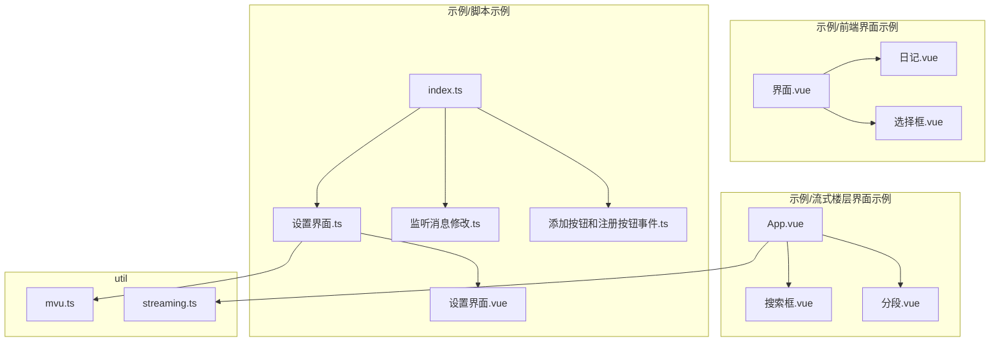
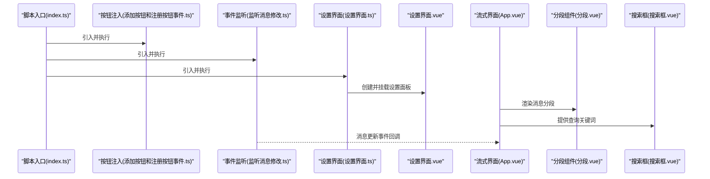
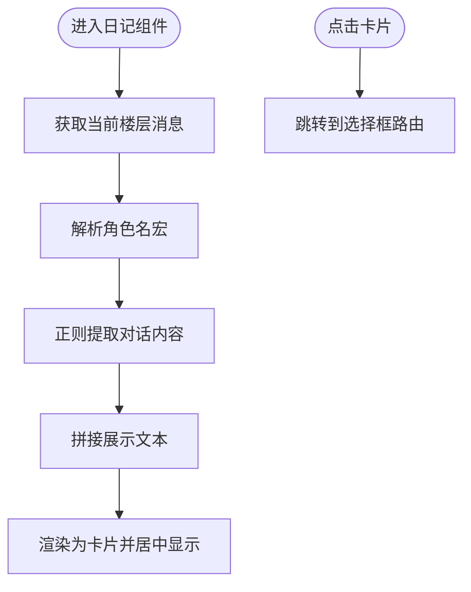
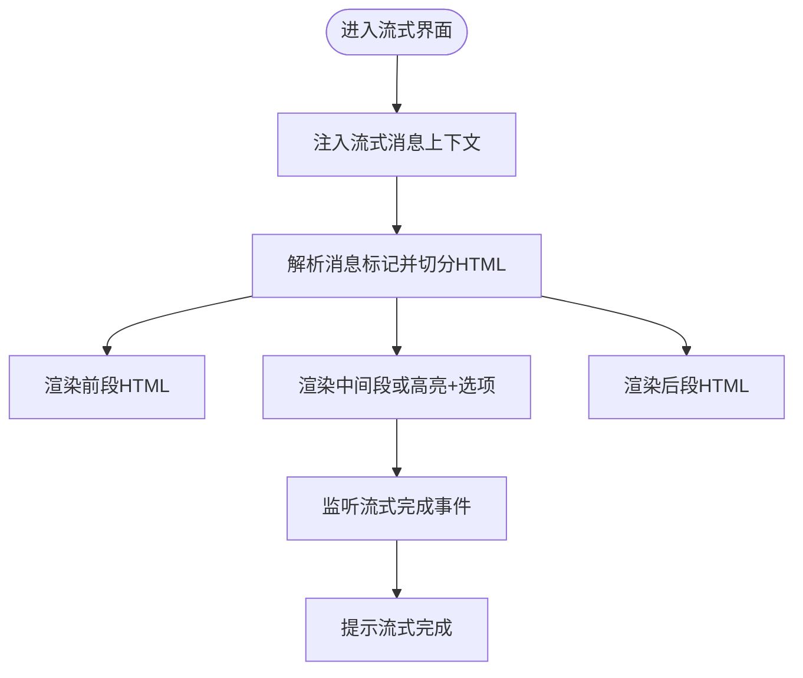
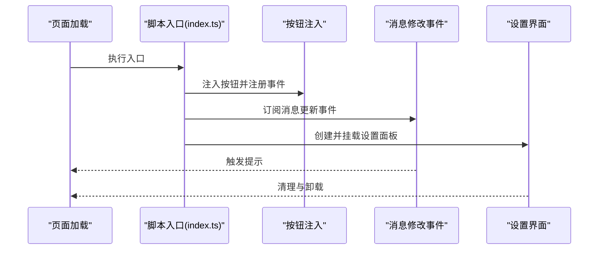
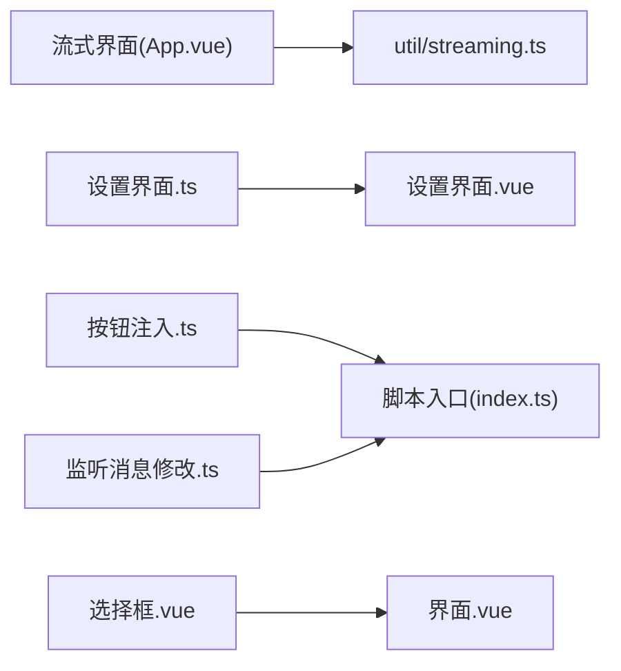

# 示例展示

<cite>
**本文引用的文件**
- [README.md](file://README.md)
- [示例/前端界面示例/界面.vue](file://示例/前端界面示例/界面.vue)
- [示例/前端界面示例/日记.vue](file://示例/前端界面示例/日记.vue)
- [示例/前端界面示例/选择框.vue](file://示例/前端界面示例/选择框.vue)
- [示例/流式楼层界面示例/App.vue](file://示例/流式楼层界面示例/App.vue)
- [示例/流式楼层界面示例/分段.vue](file://示例/流式楼层界面示例/分段.vue)
- [示例/流式楼层界面示例/搜索框.vue](file://示例/流式楼层界面示例/搜索框.vue)
- [示例/脚本示例/index.ts](file://示例/脚本示例/index.ts)
- [示例/脚本示例/添加按钮和注册按钮事件.ts](file://示例/脚本示例/添加按钮和注册按钮事件.ts)
- [示例/脚本示例/监听消息修改.ts](file://示例/脚本示例/监听消息修改.ts)
- [示例/脚本示例/设置界面.ts](file://示例/脚本示例/设置界面.ts)
- [示例/脚本示例/设置界面.vue](file://示例/脚本示例/设置界面.vue)
- [util/streaming.ts](file://util/streaming.ts)
- [util/mvu.ts](file://util/mvu.ts)
</cite>

## 目录
1. [简介](#简介)
2. [项目结构](#项目结构)
3. [核心组件](#核心组件)
4. [架构总览](#架构总览)
5. [详细组件分析](#详细组件分析)
6. [依赖关系分析](#依赖关系分析)
7. [性能考量](#性能考量)
8. [故障排查指南](#故障排查指南)
9. [结论](#结论)
10. [附录](#附录)

## 简介
本文件系统性整理“酒馆助手模板”的示例与最佳实践，覆盖前端界面示例、流式楼层界面示例、脚本示例与角色卡示例的实现方法与使用场景。文档提供从简单到复杂的渐进式示例路径，帮助读者理解不同功能的使用方式、运行效果与实现原理，并给出扩展思路与定制化方案。

## 项目结构
示例相关的核心目录与文件组织如下：
- 示例/前端界面示例：包含路由容器、日记展示组件与角色扮演选项组件，演示如何在酒馆界面中渲染自定义 Vue 组件并与聊天上下文交互。
- 示例/流式楼层界面示例：演示如何为正在流式的楼层挂载自定义界面，支持高亮、分段显示与关键词搜索。
- 示例/脚本示例：演示脚本生命周期、按钮注入与事件监听、设置界面集成与消息楼层调整等常用模式。
- util：提供流式楼层挂载工具与MVU数据存储工具，支撑上述示例的运行。

图表来源
- [示例/前端界面示例/界面.vue:1-4](file://示例/前端界面示例/界面.vue#L1-L4)
- [示例/前端界面示例/日记.vue:1-107](file://示例/前端界面示例/日记.vue#L1-L107)
- [示例/前端界面示例/选择框.vue:1-215](file://示例/前端界面示例/选择框.vue#L1-L215)
- [示例/流式楼层界面示例/App.vue:1-72](file://示例/流式楼层界面示例/App.vue#L1-L72)
- [示例/流式楼层界面示例/分段.vue:1-79](file://示例/流式楼层界面示例/分段.vue#L1-L79)
- [示例/流式楼层界面示例/搜索框.vue:1-95](file://示例/流式楼层界面示例/搜索框.vue#L1-L95)
- [示例/脚本示例/index.ts:1-7](file://示例/脚本示例/index.ts#L1-L7)
- [示例/脚本示例/添加按钮和注册按钮事件.ts:1-8](file://示例/脚本示例/添加按钮和注册按钮事件.ts#L1-L8)
- [示例/脚本示例/监听消息修改.ts:1-4](file://示例/脚本示例/监听消息修改.ts#L1-L4)
- [示例/脚本示例/设置界面.ts:1-18](file://示例/脚本示例/设置界面.ts#L1-L18)
- [示例/脚本示例/设置界面.vue:1-36](file://示例/脚本示例/设置界面.vue#L1-L36)
- [util/streaming.ts:1-238](file://util/streaming.ts#L1-L238)
- [util/mvu.ts:1-66](file://util/mvu.ts#L1-L66)

章节来源
- [README.md:1-105](file://README.md#L1-L105)

## 核心组件
- 流式楼层挂载工具（mountStreamingMessages）：负责将 Vue 组件挂载到酒馆各楼层，支持 iframe/div 两种宿主模式，自动处理渲染、编辑态切换与事件联动。
- MVU 数据存储（defineMvuDataStore）：基于 Pinia 的 MVU 模式数据存储，自动双向同步变量与本地状态，定时校验与更新。

章节来源
- [util/streaming.ts:41-238](file://util/streaming.ts#L41-L238)
- [util/mvu.ts:3-66](file://util/mvu.ts#L3-L66)

## 架构总览
下图展示了“脚本示例”与“流式楼层界面示例”的关键交互流程：脚本在页面加载时注入按钮并注册事件；当用户触发流式消息时，流式界面根据上下文解析消息并渲染高亮、分段与搜索功能。

图表来源
- [示例/脚本示例/index.ts:1-7](file://示例/脚本示例/index.ts#L1-L7)
- [示例/脚本示例/添加按钮和注册按钮事件.ts:1-8](file://示例/脚本示例/添加按钮和注册按钮事件.ts#L1-L8)
- [示例/脚本示例/监听消息修改.ts:1-4](file://示例/脚本示例/监听消息修改.ts#L1-L4)
- [示例/脚本示例/设置界面.ts:1-18](file://示例/脚本示例/设置界面.ts#L1-L18)
- [示例/脚本示例/设置界面.vue:1-36](file://示例/脚本示例/设置界面.vue#L1-L36)
- [示例/流式楼层界面示例/App.vue:1-72](file://示例/流式楼层界面示例/App.vue#L1-L72)
- [示例/流式楼层界面示例/分段.vue:1-79](file://示例/流式楼层界面示例/分段.vue#L1-L79)
- [示例/流式楼层界面示例/搜索框.vue:1-95](file://示例/流式楼层界面示例/搜索框.vue#L1-L95)

## 详细组件分析

### 前端界面示例
- 路由容器：通过 RouterView 展示子路由视图，便于在酒馆中嵌入多页面界面。
- 日记组件：捕获当前楼层内容，解析宏与对话文本，渲染为美观的卡片样式，支持点击跳转。
- 选择框组件：解析消息中的角色扮演选项，渲染为可点击的选项卡片，点击后自动注入用户消息并触发指令。

图表来源
- [示例/前端界面示例/日记.vue:1-107](file://示例/前端界面示例/日记.vue#L1-L107)
- [示例/前端界面示例/界面.vue:1-4](file://示例/前端界面示例/界面.vue#L1-L4)

章节来源
- [示例/前端界面示例/界面.vue:1-4](file://示例/前端界面示例/界面.vue#L1-L4)
- [示例/前端界面示例/日记.vue:1-107](file://示例/前端界面示例/日记.vue#L1-L107)
- [示例/前端界面示例/选择框.vue:1-215](file://示例/前端界面示例/选择框.vue#L1-L215)

### 流式楼层界面示例
- 主界面：解析消息中的开始/结束标记，将消息分为前、中、后三段，分别渲染为 HTML 片段；在中间段缺失时回退为高亮组件与角色扮演选项。
- 分段组件：按行拆分 HTML，支持点击逐步揭示隐藏段落，配合高亮组件实现关键词高亮。
- 搜索框：提供输入框与清除按钮，支持 ESC 键清空，与高亮组件联动。

图表来源
- [示例/流式楼层界面示例/App.vue:1-72](file://示例/流式楼层界面示例/App.vue#L1-L72)
- [示例/流式楼层界面示例/分段.vue:1-79](file://示例/流式楼层界面示例/分段.vue#L1-L79)
- [示例/流式楼层界面示例/搜索框.vue:1-95](file://示例/流式楼层界面示例/搜索框.vue#L1-L95)

章节来源
- [示例/流式楼层界面示例/App.vue:1-72](file://示例/流式楼层界面示例/App.vue#L1-L72)
- [示例/流式楼层界面示例/分段.vue:1-79](file://示例/流式楼层界面示例/分段.vue#L1-L79)
- [示例/流式楼层界面示例/搜索框.vue:1-95](file://示例/流式楼层界面示例/搜索框.vue#L1-L95)

### 脚本示例
- 脚本入口：统一引入多个脚本模块，形成可维护的脚本组织。
- 注入按钮与事件：在页面就绪后替换脚本按钮，注册点击事件并弹出提示。
- 监听消息修改：订阅消息更新事件，提示用户操作。
- 设置界面：使用 createApp 与 Pinia 创建设置面板，挂载到扩展设置区域，并在页面卸载时清理资源。

图表来源
- [示例/脚本示例/index.ts:1-7](file://示例/脚本示例/index.ts#L1-L7)
- [示例/脚本示例/添加按钮和注册按钮事件.ts:1-8](file://示例/脚本示例/添加按钮和注册按钮事件.ts#L1-L8)
- [示例/脚本示例/监听消息修改.ts:1-4](file://示例/脚本示例/监听消息修改.ts#L1-L4)
- [示例/脚本示例/设置界面.ts:1-18](file://示例/脚本示例/设置界面.ts#L1-L18)
- [示例/脚本示例/设置界面.vue:1-36](file://示例/脚本示例/设置界面.vue#L1-L36)

章节来源
- [示例/脚本示例/index.ts:1-7](file://示例/脚本示例/index.ts#L1-L7)
- [示例/脚本示例/添加按钮和注册按钮事件.ts:1-8](file://示例/脚本示例/添加按钮和注册按钮事件.ts#L1-L8)
- [示例/脚本示例/监听消息修改.ts:1-4](file://示例/脚本示例/监听消息修改.ts#L1-L4)
- [示例/脚本示例/设置界面.ts:1-18](file://示例/脚本示例/设置界面.ts#L1-L18)
- [示例/脚本示例/设置界面.vue:1-36](file://示例/脚本示例/设置界面.vue#L1-L36)

### 角色卡示例（概念说明）
- 世界书与变量：通过 YAML 初始化变量、定义变量列表、更新规则与输出格式，支撑角色卡的状态管理与动态展示。
- 界面状态栏：提供角色面板、依赖条、库存面板、标签导航与世界章节等组件，配合全局样式与状态管理实现角色卡的可视化与交互。
- 脚本与立即事件：通过 MVU 数据存储与变量结构脚本，实现角色卡的即时事件与状态驱动。

章节来源
- [util/mvu.ts:3-66](file://util/mvu.ts#L3-L66)

## 依赖关系分析
- 流式界面依赖 util/streaming.ts 提供的上下文注入与挂载能力，确保在不同楼层渲染一致的界面。
- 设置界面依赖 Pinia 与 createApp，通过设置界面.vue 组合 UI 与状态，再由设置界面.ts 完成挂载与清理。
- 选择框组件依赖酒馆宏与消息 API，实现从消息中抽取选项并注入用户消息。

图表来源
- [示例/流式楼层界面示例/App.vue:1-72](file://示例/流式楼层界面示例/App.vue#L1-L72)
- [util/streaming.ts:1-238](file://util/streaming.ts#L1-L238)
- [示例/脚本示例/设置界面.ts:1-18](file://示例/脚本示例/设置界面.ts#L1-L18)
- [示例/脚本示例/设置界面.vue:1-36](file://示例/脚本示例/设置界面.vue#L1-L36)
- [示例/脚本示例/添加按钮和注册按钮事件.ts:1-8](file://示例/脚本示例/添加按钮和注册按钮事件.ts#L1-L8)
- [示例/脚本示例/index.ts:1-7](file://示例/脚本示例/index.ts#L1-L7)
- [示例/前端界面示例/选择框.vue:1-215](file://示例/前端界面示例/选择框.vue#L1-L215)
- [示例/前端界面示例/界面.vue:1-4](file://示例/前端界面示例/界面.vue#L1-L4)

## 性能考量
- 流式界面挂载策略：优先使用 iframe 宿主隔离样式，减少对酒馆全局样式的干扰；div 宿主需谨慎使用 TailwindCSS，避免影响其他区域。
- 数据同步频率：MVU 存储默认每 2 秒轮询校验变量，可根据实际需求调整轮询间隔，平衡实时性与性能。
- DOM 观察与销毁：流式界面在编辑态切换时自动隐藏/显示，渲染完成后及时断开观察器与卸载应用，避免内存泄漏。

章节来源
- [util/streaming.ts:41-238](file://util/streaming.ts#L41-L238)
- [util/mvu.ts:29-43](file://util/mvu.ts#L29-L43)

## 故障排查指南
- 流式界面未显示：检查是否正确调用挂载函数并在事件回调中触发渲染；确认消息 ID 有效且未被销毁。
- 编辑态冲突：div 宿主模式下避免使用 mes_text 类名，防止编辑功能失效；必要时使用格式化函数并替换类名。
- 设置界面不刷新：确认设置界面已正确挂载到扩展设置区域，并在页面卸载时执行清理逻辑。
- 按钮事件无效：检查按钮注入时机与事件绑定顺序，确保在页面就绪后再注册事件。

章节来源
- [util/streaming.ts:108-162](file://util/streaming.ts#L108-L162)
- [示例/脚本示例/设置界面.ts:12-17](file://示例/脚本示例/设置界面.ts#L12-L17)
- [示例/脚本示例/添加按钮和注册按钮事件.ts:1-8](file://示例/脚本示例/添加按钮和注册按钮事件.ts#L1-L8)

## 结论
本示例文档提供了从前端界面到流式楼层、从脚本到角色卡的完整实践路径。通过统一的工具与清晰的组件职责划分，开发者可以快速构建可维护、可扩展的酒馆助手界面与脚本。建议在实际项目中结合 MVU 数据存储与流式挂载工具，按需选择 iframe/div 宿主模式，并遵循事件与资源清理的最佳实践。

## 附录
- 进一步阅读与自动更新机制可参考项目自述文件中的说明与工作流配置。

章节来源
- [README.md:45-105](file://README.md#L45-L105)