# 脚本示例

<cite>
**本文引用的文件**
- [README.md](file://README.md)
- [package.json](file://package.json)
- [示例/脚本示例/index.ts](file://示例/脚本示例/index.ts)
- [示例/脚本示例/settings.ts](file://示例/脚本示例/settings.ts)
- [示例/脚本示例/加载和卸载时执行函数.ts](file://示例/脚本示例/加载和卸载时执行函数.ts)
- [示例/脚本示例/添加按钮和注册按钮事件.ts](file://示例/脚本示例/添加按钮和注册按钮事件.ts)
- [示例/脚本示例/监听消息修改.ts](file://示例/脚本示例/监听消息修改.ts)
- [示例/脚本示例/聊天文件变更时重载脚本.ts](file://示例/脚本示例/聊天文件变更时重载脚本.ts)
- [示例/脚本示例/设置界面.ts](file://示例/脚本示例/设置界面.ts)
- [示例/脚本示例/设置界面.vue](file://示例/脚本示例/设置界面.vue)
- [示例/脚本示例/调整消息楼层.ts](file://示例/脚本示例/调整消息楼层.ts)
- [@types/iframe/event.d.ts](file://@types/iframe/event.d.ts)
- [@types/iframe/script.d.ts](file://@types/iframe/script.d.ts)
- [@types/function/script.d.ts](file://@types/function/script.d.ts)
- [@types/function/util.d.ts](file://@types/function/util.d.ts)
- [util/script.ts](file://util/script.ts)
- [示例/前端界面示例/界面.ts](file://示例/前端界面示例/界面.ts)
- [示例/前端界面示例/界面.vue](file://示例/前端界面示例/界面.vue)
</cite>

## 目录
1. [简介](#简介)
2. [项目结构](#项目结构)
3. [核心组件](#核心组件)
4. [架构总览](#架构总览)
5. [详细组件分析](#详细组件分析)
6. [依赖分析](#依赖分析)
7. [性能考虑](#性能考虑)
8. [故障排查指南](#故障排查指南)
9. [结论](#结论)
10. [附录](#附录)

## 简介
本文件系统性介绍“酒馆助手”脚本开发的典型场景与实现方法，覆盖从基础的加载/卸载函数到复杂交互功能的完整开发路径。内容包括脚本架构设计、事件监听机制、消息处理流程、设置界面开发、与 SillyTavern API 的集成方式、数据持久化策略以及错误处理机制。文档同时提供最佳实践、性能优化与调试技巧，帮助开发者快速构建稳定高效的脚本。

## 项目结构
本仓库提供脚本与前端界面的模板与示例，便于在本地或通过 GitHub Actions 自动化打包与分发。示例脚本位于“示例/脚本示例”，包含多个独立功能模块，通过入口文件统一导入；类型定义位于“@types”目录，提供与酒馆助手 API 的强类型支持；工具函数位于“util”目录，封装常用能力（如样式传送、脚本容器创建、聊天变更重载等）。

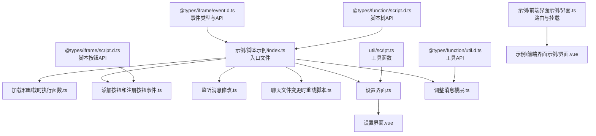

图表来源
- [示例/脚本示例/index.ts:1-7](file://示例/脚本示例/index.ts#L1-L7)
- [示例/脚本示例/设置界面.ts:1-18](file://示例/脚本示例/设置界面.ts#L1-L18)
- [示例/脚本示例/设置界面.vue:1-36](file://示例/脚本示例/设置界面.vue#L1-L36)
- [@types/iframe/event.d.ts:1-522](file://@types/iframe/event.d.ts#L1-L522)
- [@types/iframe/script.d.ts:1-90](file://@types/iframe/script.d.ts#L1-L90)
- [@types/function/script.d.ts:1-82](file://@types/function/script.d.ts#L1-L82)
- [@types/function/util.d.ts:1-44](file://@types/function/util.d.ts#L1-L44)
- [util/script.ts:1-47](file://util/script.ts#L1-L47)
- [示例/前端界面示例/界面.ts:1-22](file://示例/前端界面示例/界面.ts#L1-L22)
- [示例/前端界面示例/界面.vue:1-4](file://示例/前端界面示例/界面.vue#L1-L4)

章节来源
- [README.md:1-105](file://README.md#L1-L105)
- [package.json:1-120](file://package.json#L1-L120)

## 核心组件
- 入口与模块组织：入口文件统一导入各功能模块，便于按需启用与维护。
- 事件系统：通过事件监听与发射机制实现跨模块通信与响应。
- 设置与持久化：使用变量存储与 Pinia 状态管理实现设置的读取与持久化。
- UI 集成：在设置页区域动态挂载 Vue 组件，实现脚本设置界面。
- 消息与楼层：通过工具函数与 API 控制消息创建与楼层调整。
- 工具函数：提供样式传送、脚本容器创建、聊天变更重载等通用能力。

章节来源
- [示例/脚本示例/index.ts:1-7](file://示例/脚本示例/index.ts#L1-L7)
- [示例/脚本示例/settings.ts:1-16](file://示例/脚本示例/settings.ts#L1-L16)
- [示例/脚本示例/设置界面.ts:1-18](file://示例/脚本示例/设置界面.ts#L1-L18)
- [util/script.ts:1-47](file://util/script.ts#L1-L47)
- [示例/脚本示例/调整消息楼层.ts:1-40](file://示例/脚本示例/调整消息楼层.ts#L1-L40)

## 架构总览
脚本采用“模块化 + 事件驱动”的架构：每个功能以独立模块存在，通过入口文件聚合；模块之间通过事件系统解耦；设置与 UI 通过变量与 Vue 组件实现持久化与可视化；工具函数提供跨模块复用的能力。

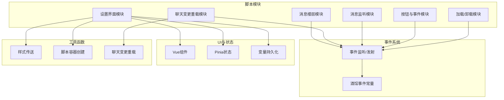

图表来源
- [示例/脚本示例/加载和卸载时执行函数.ts:1-10](file://示例/脚本示例/加载和卸载时执行函数.ts#L1-L10)
- [示例/脚本示例/添加按钮和注册按钮事件.ts:1-8](file://示例/脚本示例/添加按钮和注册按钮事件.ts#L1-L8)
- [示例/脚本示例/监听消息修改.ts:1-4](file://示例/脚本示例/监听消息修改.ts#L1-L4)
- [示例/脚本示例/聊天文件变更时重载脚本.ts:1-4](file://示例/脚本示例/聊天文件变更时重载脚本.ts#L1-L4)
- [示例/脚本示例/设置界面.ts:1-18](file://示例/脚本示例/设置界面.ts#L1-L18)
- [示例/脚本示例/设置界面.vue:1-36](file://示例/脚本示例/设置界面.vue#L1-L36)
- [示例/脚本示例/设置界面.vue:24-36](file://示例/脚本示例/设置界面.vue#L24-L36)
- [示例/脚本示例/settings.ts:1-16](file://示例/脚本示例/settings.ts#L1-L16)
- [util/script.ts:13-47](file://util/script.ts#L13-L47)
- [@types/iframe/event.d.ts:166-276](file://@types/iframe/event.d.ts#L166-L276)

## 详细组件分析

### 组件A：加载与卸载生命周期
- 目标：在页面加载时执行初始化逻辑，在页面卸载时清理资源。
- 关键点：
  - 使用 DOM ready 事件进行初始化。
  - 监听页面隐藏事件进行资源回收。
  - 结合通知组件提示用户加载/卸载状态。
- 数据与依赖：
  - 依赖事件系统与通知组件。
  - 无外部持久化需求。

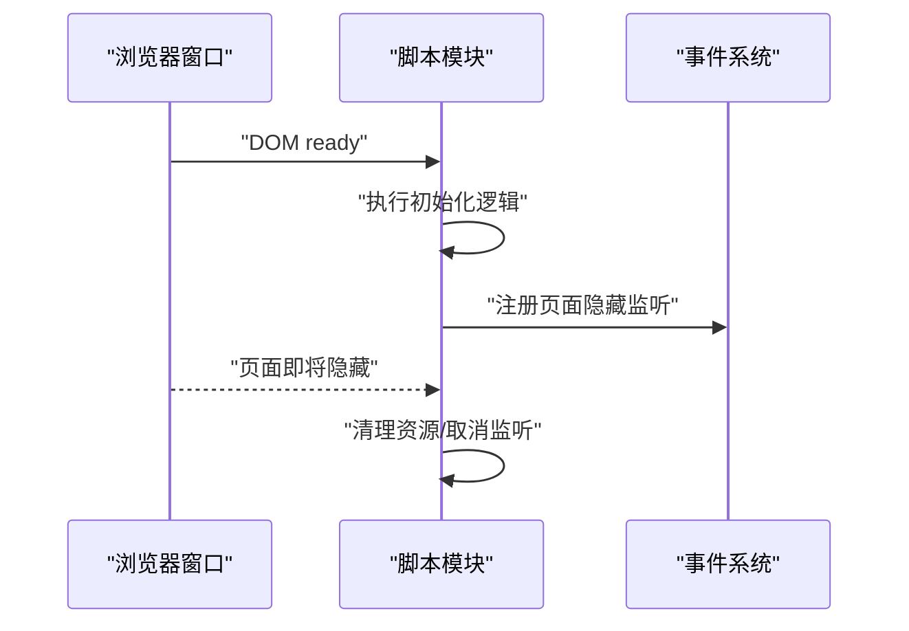

图表来源
- [示例/脚本示例/加载和卸载时执行函数.ts:1-10](file://示例/脚本示例/加载和卸载时执行函数.ts#L1-L10)

章节来源
- [示例/脚本示例/加载和卸载时执行函数.ts:1-10](file://示例/脚本示例/加载和卸载时执行函数.ts#L1-L10)

### 组件B：按钮与事件注册
- 目标：动态注册脚本按钮并在点击时触发回调。
- 关键点：
  - 使用脚本按钮 API 替换按钮列表。
  - 通过事件系统绑定按钮点击事件。
  - 使用事件类型解析器将按钮名映射为事件类型。
- 数据与依赖：
  - 依赖脚本按钮 API 与事件系统。
  - 无外部持久化需求。

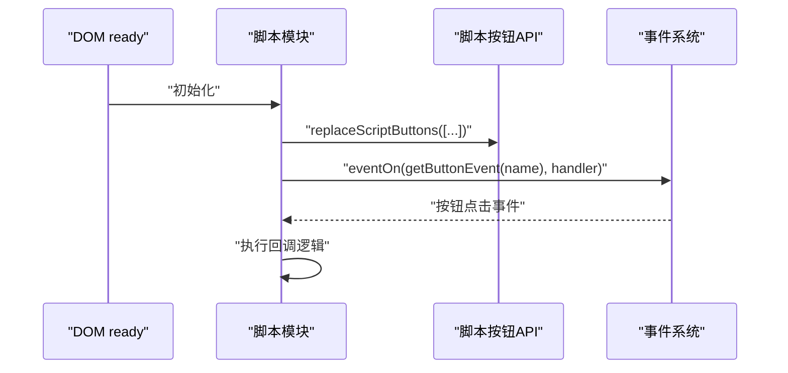

图表来源
- [示例/脚本示例/添加按钮和注册按钮事件.ts:1-8](file://示例/脚本示例/添加按钮和注册按钮事件.ts#L1-L8)
- [@types/iframe/script.d.ts:1-90](file://@types/iframe/script.d.ts#L1-L90)

章节来源
- [示例/脚本示例/添加按钮和注册按钮事件.ts:1-8](file://示例/脚本示例/添加按钮和注册按钮事件.ts#L1-L8)
- [@types/iframe/script.d.ts:1-90](file://@types/iframe/script.d.ts#L1-L90)

### 组件C：消息修改监听
- 目标：监听消息更新事件，对特定楼层进行保护或提示。
- 关键点：
  - 使用消息更新事件常量。
  - 事件回调中获取被更新的消息 ID 并执行相应逻辑。
- 数据与依赖：
  - 依赖事件系统与消息 ID 获取工具。
  - 无外部持久化需求。

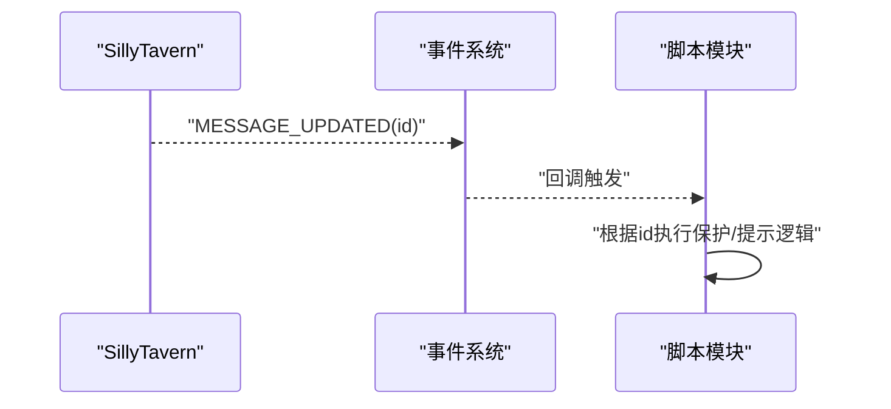

图表来源
- [示例/脚本示例/监听消息修改.ts:1-4](file://示例/脚本示例/监听消息修改.ts#L1-L4)
- [@types/iframe/event.d.ts:188-276](file://@types/iframe/event.d.ts#L188-L276)

章节来源
- [示例/脚本示例/监听消息修改.ts:1-4](file://示例/脚本示例/监听消息修改.ts#L1-L4)
- [@types/iframe/event.d.ts:188-276](file://@types/iframe/event.d.ts#L188-L276)

### 组件D：聊天文件变更时重载脚本
- 目标：检测聊天文件变更后自动刷新页面，确保脚本与新聊天上下文一致。
- 关键点：
  - 使用聊天变更事件常量。
  - 通过工具函数判断聊天 ID 是否变化，变化则刷新。
- 数据与依赖：
  - 依赖事件系统与聊天 ID 获取。
  - 无外部持久化需求。

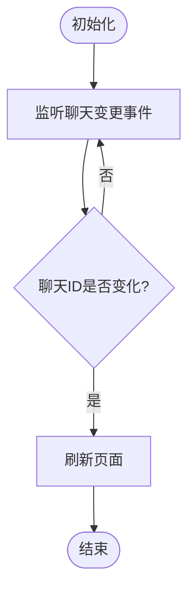

图表来源
- [示例/脚本示例/聊天文件变更时重载脚本.ts:1-4](file://示例/脚本示例/聊天文件变更时重载脚本.ts#L1-L4)
- [util/script.ts:38-47](file://util/script.ts#L38-L47)
- [@types/iframe/event.d.ts:204-204](file://@types/iframe/event.d.ts#L204-L204)

章节来源
- [示例/脚本示例/聊天文件变更时重载脚本.ts:1-4](file://示例/脚本示例/聊天文件变更时重载脚本.ts#L1-L4)
- [util/script.ts:38-47](file://util/script.ts#L38-L47)

### 组件E：设置界面与持久化
- 目标：在设置页中提供可交互的设置项，并将设置持久化到变量存储。
- 关键点：
  - 使用 Vue 组件承载设置界面。
  - 使用 Pinia 管理设置状态。
  - 通过变量 API 读取/写入设置，实现持久化。
  - 使用工具函数将样式传送到目标容器，保证界面样式生效。
  - 在页面卸载时清理组件与样式。
- 数据与依赖：
  - 依赖 Vue、Pinia、变量 API、工具函数。
  - 设置通过变量存储实现跨会话持久化。

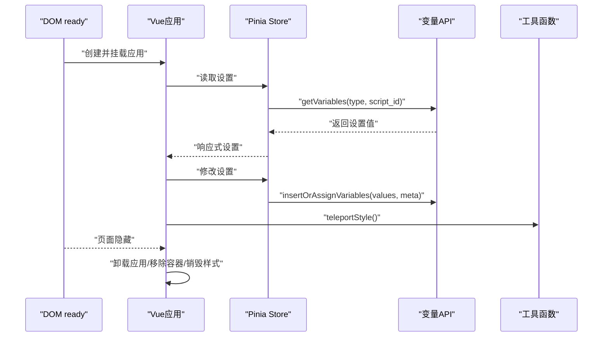

图表来源
- [示例/脚本示例/设置界面.ts:1-18](file://示例/脚本示例/设置界面.ts#L1-L18)
- [示例/脚本示例/设置界面.vue:1-36](file://示例/脚本示例/设置界面.vue#L1-L36)
- [示例/脚本示例/settings.ts:1-16](file://示例/脚本示例/settings.ts#L1-L16)
- [util/script.ts:13-24](file://util/script.ts#L13-L24)

章节来源
- [示例/脚本示例/设置界面.ts:1-18](file://示例/脚本示例/设置界面.ts#L1-L18)
- [示例/脚本示例/设置界面.vue:1-36](file://示例/脚本示例/设置界面.vue#L1-L36)
- [示例/脚本示例/settings.ts:1-16](file://示例/脚本示例/settings.ts#L1-L16)
- [util/script.ts:13-24](file://util/script.ts#L13-L24)

### 组件F：消息楼层调整
- 目标：在特定条件下批量创建消息，实现引导式交互或剧情推进。
- 关键点：
  - 使用工具函数获取最新消息 ID。
  - 使用消息创建 API 批量插入消息。
  - 使用工具函数进行宏替换与文本处理。
- 数据与依赖：
  - 依赖消息创建 API、工具函数与宏替换。
  - 无外部持久化需求。

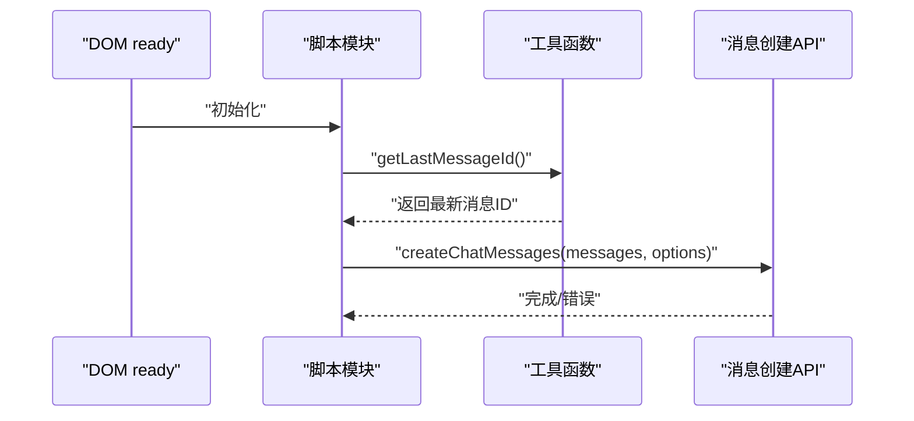

图表来源
- [示例/脚本示例/调整消息楼层.ts:1-40](file://示例/脚本示例/调整消息楼层.ts#L1-L40)
- [@types/function/util.d.ts:14-18](file://@types/function/util.d.ts#L14-L18)

章节来源
- [示例/脚本示例/调整消息楼层.ts:1-40](file://示例/脚本示例/调整消息楼层.ts#L1-L40)
- [@types/function/util.d.ts:14-18](file://@types/function/util.d.ts#L14-L18)

### 组件G：事件系统与API
- 目标：提供事件监听、一次性监听、优先级控制、事件发射与移除等能力。
- 关键点：
  - 提供多种监听模式（首次/最后/一次性）。
  - 提供事件发射与等待机制。
  - 提供事件清理能力，避免内存泄漏。
- 数据与依赖：
  - 依赖事件常量与监听器类型映射。
  - 无外部持久化需求。

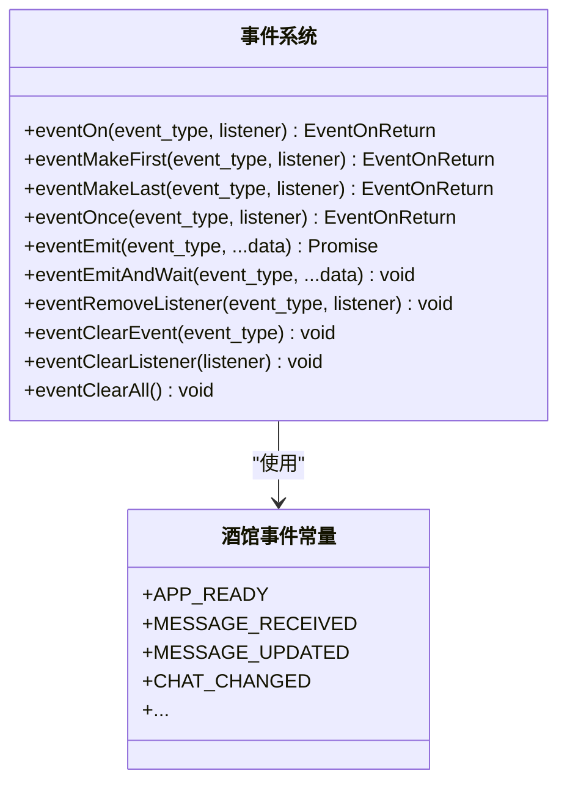

图表来源
- [@types/iframe/event.d.ts:15-164](file://@types/iframe/event.d.ts#L15-L164)
- [@types/iframe/event.d.ts:166-276](file://@types/iframe/event.d.ts#L166-L276)

章节来源
- [@types/iframe/event.d.ts:1-522](file://@types/iframe/event.d.ts#L1-L522)

### 组件H：脚本按钮与脚本树API
- 目标：提供脚本按钮管理与脚本树操作能力。
- 关键点：
  - 提供按钮列表的替换、更新、追加等操作。
  - 提供脚本树的读取、替换、更新等操作。
- 数据与依赖：
  - 无外部持久化需求。

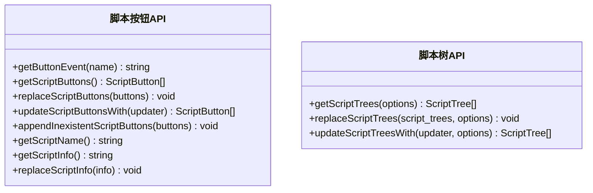

图表来源
- [@types/iframe/script.d.ts:1-90](file://@types/iframe/script.d.ts#L1-L90)
- [@types/function/script.d.ts:1-82](file://@types/function/script.d.ts#L1-L82)

章节来源
- [@types/iframe/script.d.ts:1-90](file://@types/iframe/script.d.ts#L1-L90)
- [@types/function/script.d.ts:1-82](file://@types/function/script.d.ts#L1-L82)

### 组件I：工具函数
- 目标：提供样式传送、脚本容器创建、聊天变更重载等通用能力。
- 关键点：
  - 样式传送：将当前页面样式复制到指定容器，避免样式丢失。
  - 脚本容器创建：为脚本 UI 创建带脚本 ID 的容器或 iframe。
  - 聊天变更重载：监听聊天变更事件并自动刷新。
- 数据与依赖：
  - 无外部持久化需求。

章节来源
- [util/script.ts:1-47](file://util/script.ts#L1-L47)

## 依赖分析
- 类型依赖：事件系统与 API 由类型定义文件提供，确保编译期安全。
- 模块依赖：入口文件聚合各模块，模块间通过事件系统解耦。
- 外部依赖：项目使用 Vue、Pinia、jQuery 等库，构建工具链由 Webpack 与 TypeScript 提供。

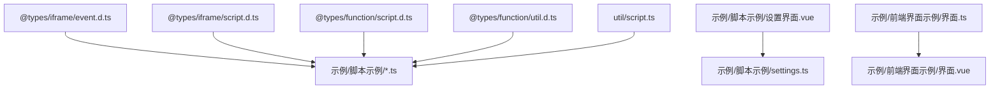

图表来源
- [@types/iframe/event.d.ts:1-522](file://@types/iframe/event.d.ts#L1-L522)
- [@types/iframe/script.d.ts:1-90](file://@types/iframe/script.d.ts#L1-L90)
- [@types/function/script.d.ts:1-82](file://@types/function/script.d.ts#L1-L82)
- [@types/function/util.d.ts:1-44](file://@types/function/util.d.ts#L1-L44)
- [util/script.ts:1-47](file://util/script.ts#L1-L47)
- [示例/脚本示例/设置界面.vue:1-36](file://示例/脚本示例/设置界面.vue#L1-L36)
- [示例/脚本示例/settings.ts:1-16](file://示例/脚本示例/settings.ts#L1-L16)
- [示例/前端界面示例/界面.ts:1-22](file://示例/前端界面示例/界面.ts#L1-L22)
- [示例/前端界面示例/界面.vue:1-4](file://示例/前端界面示例/界面.vue#L1-L4)

章节来源
- [package.json:1-120](file://package.json#L1-L120)

## 性能考虑
- 事件监听优先级：合理使用“首次/最后/一次性”监听，避免重复处理与性能浪费。
- UI 渲染：在设置界面中按需渲染与卸载组件，减少 DOM 占用。
- 样式传送：仅在必要时传送样式，避免重复复制导致的性能下降。
- 消息批量操作：批量创建消息时注意刷新策略，避免频繁重绘。
- 错误捕获：使用错误包装函数捕获异常并提示用户，避免未处理异常影响性能。

## 故障排查指南
- 事件未触发：检查事件类型是否正确、监听是否在页面关闭前被自动清理。
- 按钮不显示：确认按钮列表已替换且可见标志正确。
- 设置不生效：检查变量读取/写入是否使用正确的脚本 ID 与类型。
- UI 样式丢失：使用样式传送工具将样式复制到目标容器。
- 聊天变更未重载：确认聊天变更事件监听是否正确注册。

章节来源
- [@types/iframe/event.d.ts:15-164](file://@types/iframe/event.d.ts#L15-L164)
- [util/script.ts:13-24](file://util/script.ts#L13-L24)

## 结论
本指南提供了从基础到高级的脚本开发路径，涵盖事件系统、设置界面、消息处理与工具函数的使用。通过模块化与事件驱动的设计，脚本能够与 SillyTavern API 紧密集成，实现丰富的交互体验。遵循本文的最佳实践与性能建议，可有效提升脚本的稳定性与用户体验。

## 附录
- 自动化与分发：可通过 GitHub Actions 实现自动打包与版本号递增，结合 CDN 实现脚本与界面的自动更新。
- 本地开发：提供本地开发与打包脚本，便于快速迭代与调试。

章节来源
- [README.md:71-105](file://README.md#L71-L105)
- [package.json:1-120](file://package.json#L1-L120)