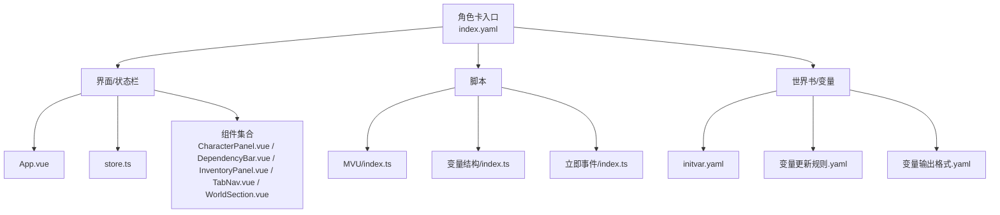
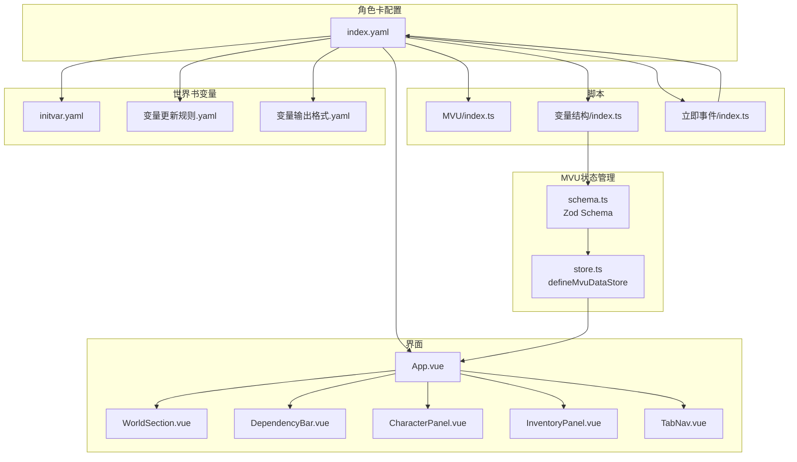
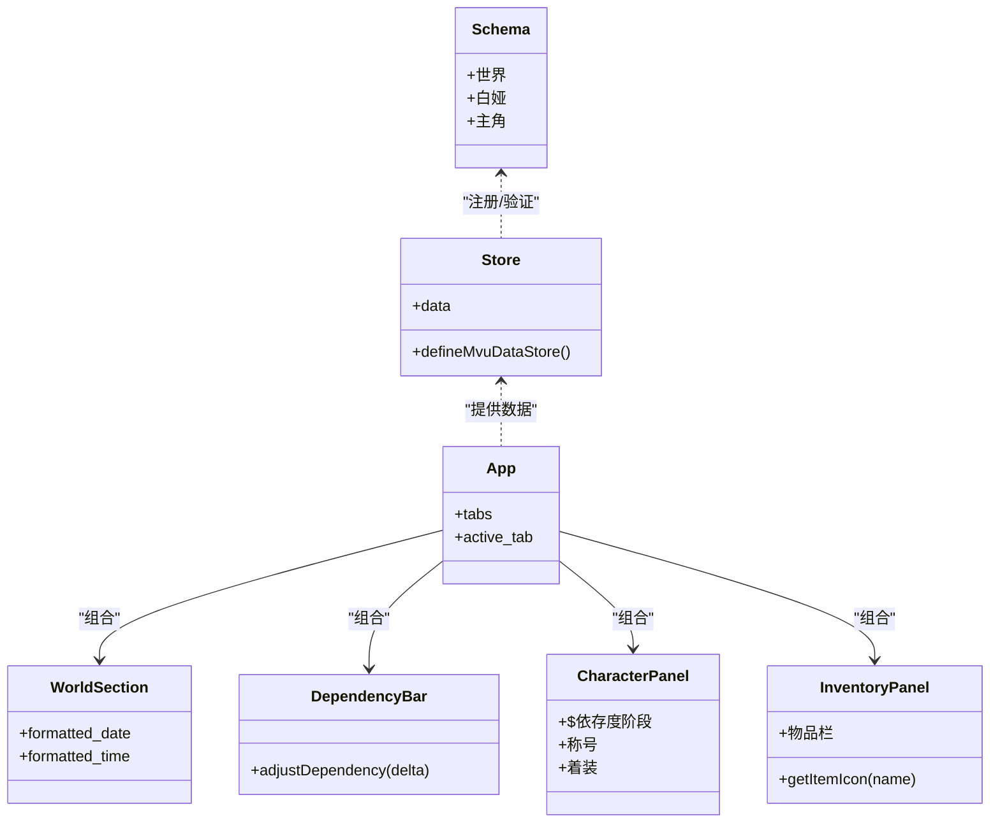
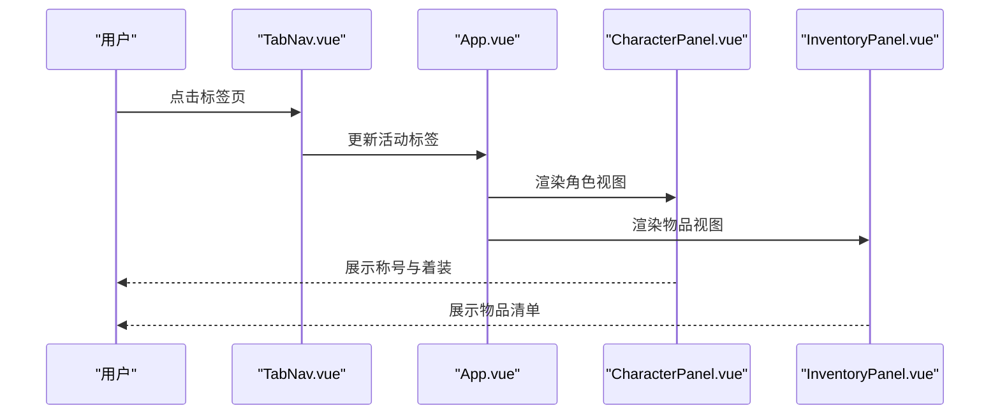
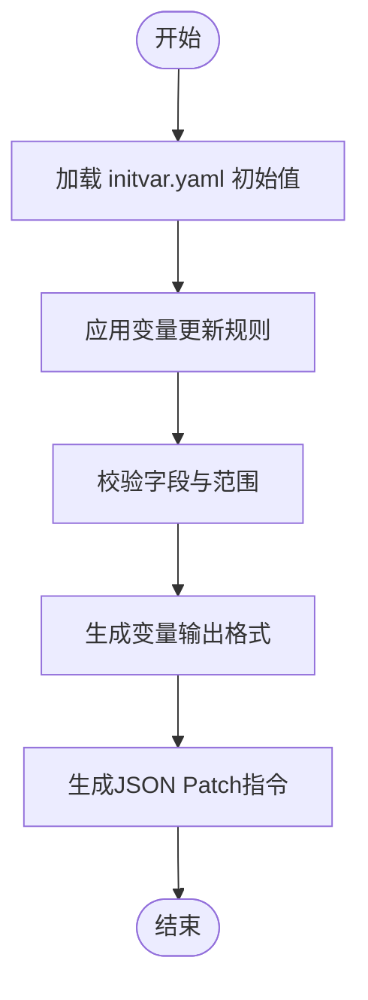
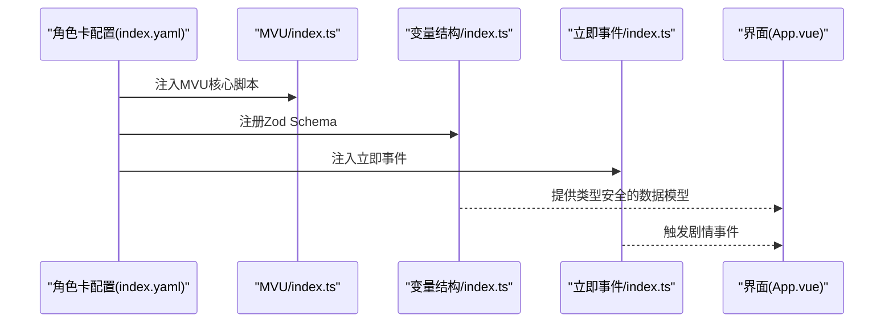
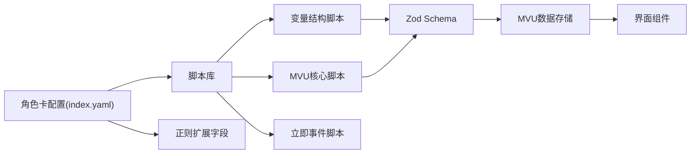

# 角色卡示例

<cite>
**本文引用的文件**
- [index.yaml](file://示例/角色卡示例/index.yaml)
- [schema.ts](file://示例/角色卡示例/schema.ts)
- [App.vue](file://示例/角色卡示例/界面/状态栏/App.vue)
- [store.ts](file://示例/角色卡示例/界面/状态栏/store.ts)
- [index.ts](file://示例/角色卡示例/界面/状态栏/components/CharacterPanel.vue)
- [DependencyBar.vue](file://示例/角色卡示例/界面/状态栏/components/DependencyBar.vue)
- [InventoryPanel.vue](file://示例/角色卡示例/界面/状态栏/components/InventoryPanel.vue)
- [TabNav.vue](file://示例/角色卡示例/界面/状态栏/components/TabNav.vue)
- [WorldSection.vue](file://示例/角色卡示例/界面/状态栏/components/WorldSection.vue)
- [index.ts](file://示例/角色卡示例/脚本/MVU/index.ts)
- [index.ts](file://示例/角色卡示例/脚本/变量结构/index.ts)
- [index.ts](file://示例/角色卡示例/脚本/立即事件/index.ts)
- [initvar.yaml](file://示例/角色卡示例/世界书/变量/initvar.yaml)
- [变量更新规则.yaml](file://示例/角色卡示例/世界书/变量/变量更新规则.yaml)
- [变量输出格式.yaml](file://示例/角色卡示例/世界书/变量/变量输出格式.yaml)
</cite>

## 目录
1. [简介](#简介)
2. [项目结构](#项目结构)
3. [核心组件](#核心组件)
4. [架构总览](#架构总览)
5. [详细组件分析](#详细组件分析)
6. [依赖关系分析](#依赖关系分析)
7. [性能考量](#性能考量)
8. [故障排查指南](#故障排查指南)
9. [结论](#结论)
10. [附录](#附录)

## 简介
本文件为“角色卡示例”的权威开发指南，覆盖角色卡数据模型、世界书变量系统、状态栏界面与MVU状态管理的完整实现与使用方法。文档以示例项目为基础，提供从数据建模到界面实现的全流程说明，帮助开发者快速搭建可维护的角色卡系统。

## 项目结构
示例项目采用“功能域+层次”混合组织方式：角色卡配置位于顶层，界面与脚本分别置于“界面/状态栏”和“脚本”目录，世界书变量按主题拆分至独立文件，便于维护与扩展。

图表来源
- [index.yaml:1-313](file://示例/角色卡示例/index.yaml#L1-L313)
- [App.vue:1-77](file://示例/角色卡示例/界面/状态栏/App.vue#L1-L77)
- [store.ts:1-5](file://示例/角色卡示例/界面/状态栏/store.ts#L1-L5)
- [index.ts:1-110](file://示例/角色卡示例/界面/状态栏/components/CharacterPanel.vue#L1-L110)
- [index.ts:1-2](file://示例/角色卡示例/脚本/MVU/index.ts#L1-L2)
- [index.ts:1-7](file://示例/角色卡示例/脚本/变量结构/index.ts#L1-L7)
- [index.ts:1-23](file://示例/角色卡示例/脚本/立即事件/index.ts#L1-L23)
- [initvar.yaml:1-34](file://示例/角色卡示例/世界书/变量/initvar.yaml#L1-L34)
- [变量更新规则.yaml:1-52](file://示例/角色卡示例/世界书/变量/变量更新规则.yaml#L1-L52)
- [变量输出格式.yaml:1-32](file://示例/角色卡示例/世界书/变量/变量输出格式.yaml#L1-L32)

章节来源
- [index.yaml:1-313](file://示例/角色卡示例/index.yaml#L1-L313)

## 核心组件
- 角色卡配置与世界书条目：通过顶层配置文件组织角色描述、锚点、世界书条目（文风、交错频道、变量、角色、立即事件）以及正则扩展字段，实现界面占位符替换与脚本注入。
- MVU数据模型与存储：使用Zod Schema定义数据结构，结合MVU数据存储封装，确保消息级状态隔离与类型安全。
- 状态栏界面：基于Vue组件化设计，提供世界信息、依存度条、角色与物品面板，支持本地化切换与响应式布局。
- 变量系统：通过初始化文件、更新规则与输出格式三件套，规范变量的读取、更新与格式化输出，支持AI推理与人类编辑双通道。

章节来源
- [index.yaml:1-313](file://示例/角色卡示例/index.yaml#L1-L313)
- [schema.ts:1-52](file://示例/角色卡示例/schema.ts#L1-L52)
- [store.ts:1-5](file://示例/角色卡示例/界面/状态栏/store.ts#L1-L5)

## 架构总览
角色卡系统围绕MVU状态管理展开：界面组件订阅MVU数据存储；脚本负责注册Schema、注入提示词与触发立即事件；世界书变量作为数据源，经由规则与格式化约束，统一输出到聊天上下文中。

图表来源
- [index.yaml:1-313](file://示例/角色卡示例/index.yaml#L1-L313)
- [schema.ts:1-52](file://示例/角色卡示例/schema.ts#L1-L52)
- [store.ts:1-5](file://示例/角色卡示例/界面/状态栏/store.ts#L1-L5)
- [App.vue:1-77](file://示例/角色卡示例/界面/状态栏/App.vue#L1-L77)
- [index.ts:1-2](file://示例/角色卡示例/脚本/MVU/index.ts#L1-L2)
- [index.ts:1-7](file://示例/角色卡示例/脚本/变量结构/index.ts#L1-L7)
- [index.ts:1-23](file://示例/角色卡示例/脚本/立即事件/index.ts#L1-L23)
- [initvar.yaml:1-34](file://示例/角色卡示例/世界书/变量/initvar.yaml#L1-L34)
- [变量更新规则.yaml:1-52](file://示例/角色卡示例/世界书/变量/变量更新规则.yaml#L1-L52)
- [变量输出格式.yaml:1-32](file://示例/角色卡示例/世界书/变量/变量输出格式.yaml#L1-L32)

## 详细组件分析

### 数据模型与MVU集成
- Zod Schema定义：明确字段类型、默认值与转换逻辑，例如依存度范围裁剪、称号集合截断保留等，确保数据一致性与边界安全。
- MVU数据存储：通过消息级隔离的存储实例，使界面与脚本在不同消息上下文中共享同一Schema，避免跨会话污染。
- 组件绑定：各界面组件直接读取store.data中的字段，实现响应式更新与渲染。

图表来源
- [schema.ts:1-52](file://示例/角色卡示例/schema.ts#L1-L52)
- [store.ts:1-5](file://示例/角色卡示例/界面/状态栏/store.ts#L1-L5)
- [App.vue:1-77](file://示例/角色卡示例/界面/状态栏/App.vue#L1-L77)
- [WorldSection.vue:1-111](file://示例/角色卡示例/界面/状态栏/components/WorldSection.vue#L1-L111)
- [DependencyBar.vue:1-111](file://示例/角色卡示例/界面/状态栏/components/DependencyBar.vue#L1-L111)
- [CharacterPanel.vue:1-110](file://示例/角色卡示例/界面/状态栏/components/CharacterPanel.vue#L1-L110)
- [InventoryPanel.vue:1-101](file://示例/角色卡示例/界面/状态栏/components/InventoryPanel.vue#L1-L101)

章节来源
- [schema.ts:1-52](file://示例/角色卡示例/schema.ts#L1-L52)
- [store.ts:1-5](file://示例/角色卡示例/界面/状态栏/store.ts#L1-L5)
- [App.vue:1-77](file://示例/角色卡示例/界面/状态栏/App.vue#L1-L77)

### 状态栏界面组件
- 世界信息区：展示日期、时间与地点，动态解析时间字符串并格式化显示，事务列表滚动展示。
- 依存度条：可视化进度条与数值，提供增减按钮，禁用态控制与动画过渡提升交互体验。
- 角色面板：根据依存度计算阶段，展示称号列表与着装详情，空状态友好提示。
- 物品面板：物品网格布局，悬停高亮与图标映射，空背包状态提示。
- 标签页导航：切换角色与物品视图，支持关闭与本地持久化。

图表来源
- [TabNav.vue:1-67](file://示例/角色卡示例/界面/状态栏/components/TabNav.vue#L1-L67)
- [App.vue:1-77](file://示例/角色卡示例/界面/状态栏/App.vue#L1-L77)
- [CharacterPanel.vue:1-110](file://示例/角色卡示例/界面/状态栏/components/CharacterPanel.vue#L1-L110)
- [InventoryPanel.vue:1-101](file://示例/角色卡示例/界面/状态栏/components/InventoryPanel.vue#L1-L101)

章节来源
- [WorldSection.vue:1-111](file://示例/角色卡示例/界面/状态栏/components/WorldSection.vue#L1-L111)
- [DependencyBar.vue:1-111](file://示例/角色卡示例/界面/状态栏/components/DependencyBar.vue#L1-L111)
- [CharacterPanel.vue:1-110](file://示例/角色卡示例/界面/状态栏/components/CharacterPanel.vue#L1-L110)
- [InventoryPanel.vue:1-101](file://示例/角色卡示例/界面/状态栏/components/InventoryPanel.vue#L1-L101)
- [TabNav.vue:1-67](file://示例/角色卡示例/界面/状态栏/components/TabNav.vue#L1-L67)

### 世界书变量系统
- 初始化：通过初始化文件设定初始值，建议在开发时开启监听任务以生成Schema校验文件。
- 更新规则：定义字段类型、取值范围、检查要点与更新条件，确保变量随剧情合理演进。
- 输出格式：规定AI输出的更新分析与JSON Patch指令格式，支持多种操作类型，确保变量更新的可追踪与可回滚。

图表来源
- [initvar.yaml:1-34](file://示例/角色卡示例/世界书/变量/initvar.yaml#L1-L34)
- [变量更新规则.yaml:1-52](file://示例/角色卡示例/世界书/变量/变量更新规则.yaml#L1-L52)
- [变量输出格式.yaml:1-32](file://示例/角色卡示例/世界书/变量/变量输出格式.yaml#L1-L32)

章节来源
- [initvar.yaml:1-34](file://示例/角色卡示例/世界书/变量/initvar.yaml#L1-L34)
- [变量更新规则.yaml:1-52](file://示例/角色卡示例/世界书/变量/变量更新规则.yaml#L1-L52)
- [变量输出格式.yaml:1-32](file://示例/角色卡示例/世界书/变量/变量输出格式.yaml#L1-L32)

### MVU状态管理与脚本集成
- MVU脚本注入：通过角色卡配置注入MVU核心脚本，启用变量更新能力。
- Schema注册：在页面加载时注册Zod Schema，使MVU引擎具备类型校验与补全能力。
- 立即事件：在满足条件时注入系统提示词，触发特定剧情事件，过滤器基于当前变量状态判断。

图表来源
- [index.yaml:280-313](file://示例/角色卡示例/index.yaml#L280-L313)
- [index.ts:1-2](file://示例/角色卡示例/脚本/MVU/index.ts#L1-L2)
- [index.ts:1-7](file://示例/角色卡示例/脚本/变量结构/index.ts#L1-L7)
- [index.ts:1-23](file://示例/角色卡示例/脚本/立即事件/index.ts#L1-L23)
- [App.vue:1-77](file://示例/角色卡示例/界面/状态栏/App.vue#L1-L77)

章节来源
- [index.yaml:280-313](file://示例/角色卡示例/index.yaml#L280-L313)
- [index.ts:1-2](file://示例/角色卡示例/脚本/MVU/index.ts#L1-L2)
- [index.ts:1-7](file://示例/角色卡示例/脚本/变量结构/index.ts#L1-L7)
- [index.ts:1-23](file://示例/角色卡示例/脚本/立即事件/index.ts#L1-L23)

## 依赖关系分析
- 角色卡配置对脚本与界面存在显式依赖：通过脚本库与正则扩展字段实现功能增强与界面占位符替换。
- 界面组件依赖MVU数据存储：所有字段均来自store.data，确保状态一致与响应式更新。
- 脚本依赖Schema：变量结构脚本负责注册Schema，MVU脚本负责变量更新，立即事件脚本负责条件触发。

图表来源
- [index.yaml:280-313](file://示例/角色卡示例/index.yaml#L280-L313)
- [index.ts:1-2](file://示例/角色卡示例/脚本/MVU/index.ts#L1-L2)
- [index.ts:1-7](file://示例/角色卡示例/脚本/变量结构/index.ts#L1-L7)
- [index.ts:1-23](file://示例/角色卡示例/脚本/立即事件/index.ts#L1-L23)
- [schema.ts:1-52](file://示例/角色卡示例/schema.ts#L1-L52)
- [store.ts:1-5](file://示例/角色卡示例/界面/状态栏/store.ts#L1-L5)
- [App.vue:1-77](file://示例/角色卡示例/界面/状态栏/App.vue#L1-L77)

章节来源
- [index.yaml:280-313](file://示例/角色卡示例/index.yaml#L280-L313)
- [schema.ts:1-52](file://示例/角色卡示例/schema.ts#L1-L52)
- [store.ts:1-5](file://示例/角色卡示例/界面/状态栏/store.ts#L1-L5)

## 性能考量
- 组件渲染优化：使用computed派生字段减少重复计算；网格布局与媒体查询提升移动端性能。
- 状态更新粒度：MVU按消息隔离存储，避免全局状态风暴；组件仅订阅所需字段，降低重绘成本。
- 脚本执行控制：立即事件过滤器基于当前变量状态，避免无效注入；正则替换限定最大深度，防止过度处理。

## 故障排查指南
- 界面不显示或空白：检查角色卡配置中的界面占位符替换是否启用，确认脚本已正确注入。
- 变量未更新：核对变量输出格式的JSON Patch语法与操作类型；确保更新规则与字段范围匹配。
- Schema校验失败：运行监听任务生成schema.json，修正initvar.yaml中的字段类型与默认值。
- 立即事件未触发：检查立即事件的过滤器条件与变量路径，确认消息上下文与脚本注册顺序。

章节来源
- [index.yaml:187-279](file://示例/角色卡示例/index.yaml#L187-L279)
- [index.ts:1-23](file://示例/角色卡示例/脚本/立即事件/index.ts#L1-L23)
- [变量输出格式.yaml:1-32](file://示例/角色卡示例/世界书/变量/变量输出格式.yaml#L1-L32)

## 结论
本示例展示了如何将MVU状态管理、Zod Schema、Vue组件与世界书变量系统有机结合，形成可维护、可扩展的角色卡实现方案。通过清晰的数据模型、严格的更新规则与直观的界面呈现，开发者可以快速构建高质量的角色卡体验。

## 附录
- 开发工作流建议
  - 先定义Schema，再实现界面组件，最后接入脚本与世界书变量。
  - 使用初始化文件快速搭建原型，逐步完善更新规则与输出格式。
  - 在开发环境中启用监听任务，持续生成schema.json以辅助校验。
- 配置文件清单
  - 角色卡入口：[index.yaml:1-313](file://示例/角色卡示例/index.yaml#L1-L313)
  - 数据模型：[schema.ts:1-52](file://示例/角色卡示例/schema.ts#L1-L52)
  - 界面入口：[App.vue:1-77](file://示例/角色卡示例/界面/状态栏/App.vue#L1-L77)
  - 状态存储：[store.ts:1-5](file://示例/角色卡示例/界面/状态栏/store.ts#L1-L5)
  - 脚本入口：[MVU脚本:1-2](file://示例/角色卡示例/脚本/MVU/index.ts#L1-L2)、[变量结构脚本:1-7](file://示例/角色卡示例/脚本/变量结构/index.ts#L1-L7)、[立即事件脚本:1-23](file://示例/角色卡示例/脚本/立即事件/index.ts#L1-L23)
  - 世界书变量：[初始化:1-34](file://示例/角色卡示例/世界书/变量/initvar.yaml#L1-L34)、[更新规则:1-52](file://示例/角色卡示例/世界书/变量/变量更新规则.yaml#L1-L52)、[输出格式:1-32](file://示例/角色卡示例/世界书/变量/变量输出格式.yaml#L1-L32)