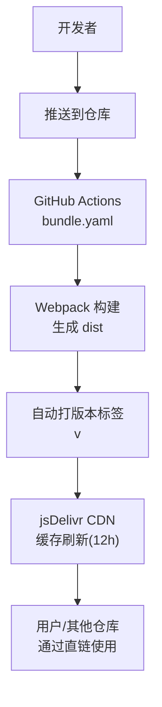
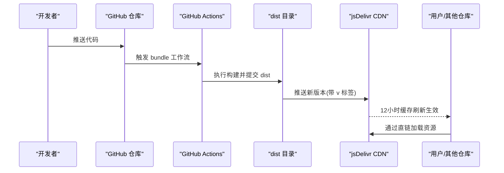
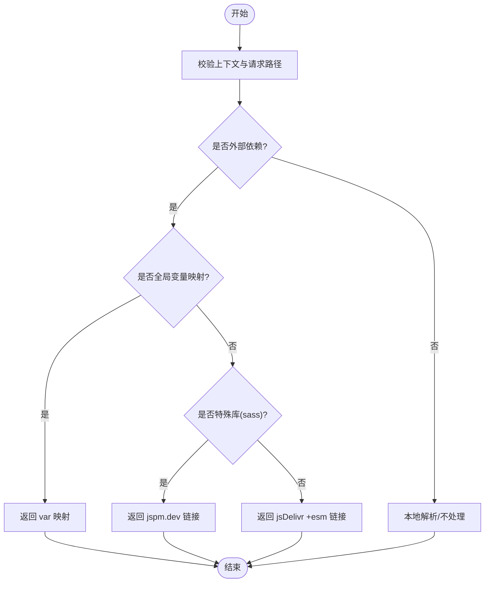
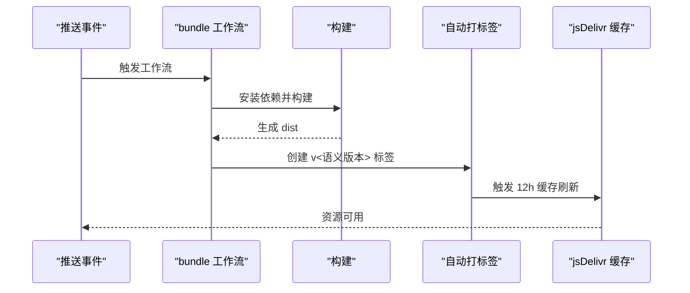
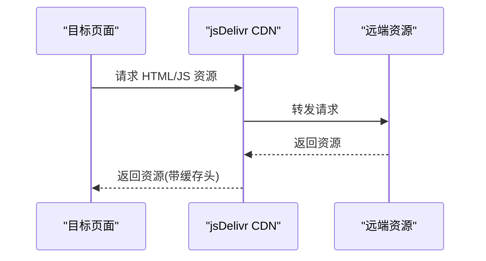
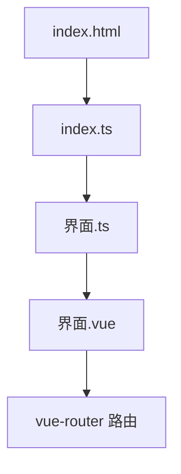
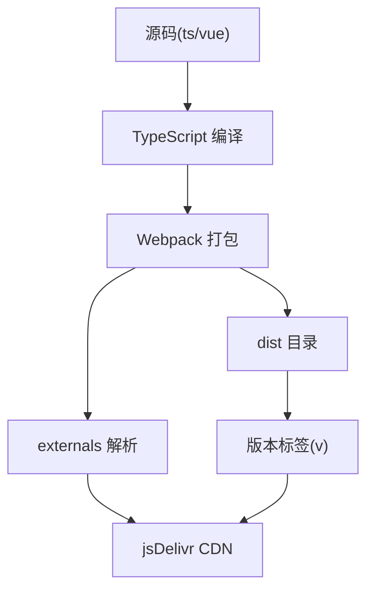

# CDN集成

<cite>
**本文档引用的文件**
- [package.json](file://package.json)
- [webpack.config.ts](file://webpack.config.ts)
- [README.md](file://README.md)
- [.github/workflows/bundle.yaml](file://.github/workflows/bundle.yaml)
- [.github/workflows/bump_deps.yaml](file://.github/workflows/bump_deps.yaml)
- [.github/workflows/sync_template.yaml](file://.github/workflows/sync_template.yaml)
- [global.d.ts](file://global.d.ts)
- [示例/前端界面示例/index.html](file://示例/前端界面示例/index.html)
- [示例/前端界面示例/index.ts](file://示例/前端界面示例/index.ts)
- [示例/前端界面示例/界面.ts](file://示例/前端界面示例/界面.ts)
- [示例/前端界面示例/界面.vue](file://示例/前端界面示例/界面.vue)
- [util/mvu.ts](file://util/mvu.ts)
</cite>

## 目录
1. [简介](#简介)
2. [项目结构](#项目结构)
3. [核心组件](#核心组件)
4. [架构总览](#架构总览)
5. [详细组件分析](#详细组件分析)
6. [依赖关系分析](#依赖关系分析)
7. [性能考虑](#性能考虑)
8. [故障排查指南](#故障排查指南)
9. [结论](#结论)
10. [附录](#附录)

## 简介
本项目通过 jsDelivr CDN 提供前端界面与脚本的自动分发与更新能力。其核心思路是：将构建产物发布到 GitHub 仓库的 dist 目录，并通过 jsDelivr 的直链访问实现跨仓库复用与自动更新。项目采用 Webpack 外部化（externals）策略，将第三方依赖解析为 jsDelivr 的 ESM 链接；同时配合 GitHub Actions 的自动打包与版本标签机制，确保缓存刷新与版本控制。

## 项目结构
- 构建与打包
  - 使用 Webpack 将 TypeScript/Vue 源码打包为模块化产物，输出至 dist 目录。
  - 通过 externals 将外部依赖解析为 jsDelivr 的 ESM 链接，减少包体并加速加载。
- 自动化与版本控制
  - GitHub Actions 在推送主分支时自动打包并提交 dist。
  - 自动打版本标签（含 v 前缀），驱动 jsDelivr 的 12 小时缓存刷新策略。
- 使用方式
  - 前端界面：通过 HTML 的 script 标签加载远端 HTML。
  - 脚本：通过 ES 模块 import 加载远端 JS。
  - 类型声明：通过模块声明指向远端工具模块，便于类型检查与提示。

图表来源
- [.github/workflows/bundle.yaml:19-64](file://.github/workflows/bundle.yaml#L19-L64)
- [webpack.config.ts:185-571](file://webpack.config.ts#L185-L571)

章节来源
- [package.json:1-120](file://package.json#L1-L120)
- [README.md:49-70](file://README.md#L49-L70)
- [.github/workflows/bundle.yaml:19-64](file://.github/workflows/bundle.yaml#L19-L64)

## 核心组件
- Webpack 外部化与 CDN 解析
  - 对未内置的外部依赖，通过 externals 将其映射为 jsDelivr 的 ESM 链接，提升加载性能并降低体积。
  - 特定库（如 sass）使用 jspm.dev 的专用链接。
- GitHub Actions 自动化
  - bundle.yaml：在主分支推送时构建并提交 dist，同时自动打版本标签以触发 jsDelivr 缓存刷新。
  - bump_deps.yaml：周期性更新依赖与类型定义，保持生态一致性。
  - sync_template.yaml：定期从模板仓库同步更新，便于维护统一规范。
- 使用示例
  - README 展示了前端界面与脚本的加载方式，体现 jsDelivr 直链的易用性。
  - 示例前端界面展示了基于路由与 Vue 组件的页面结构，便于理解资源组织方式。

章节来源
- [webpack.config.ts:521-567](file://webpack.config.ts#L521-L567)
- [.github/workflows/bundle.yaml:19-64](file://.github/workflows/bundle.yaml#L19-L64)
- [.github/workflows/bump_deps.yaml:1-59](file://.github/workflows/bump_deps.yaml#L1-59)
- [.github/workflows/sync_template.yaml:1-31](file://.github/workflows/sync_template.yaml#L1-L31)
- [README.md:49-70](file://README.md#L49-L70)
- [示例/前端界面示例/index.html:1-5](file://示例/前端界面示例/index.html#L1-L5)
- [示例/前端界面示例/index.ts:1-3](file://示例/前端界面示例/index.ts#L1-L3)
- [示例/前端界面示例/界面.ts:1-22](file://示例/前端界面示例/界面.ts#L1-L22)
- [示例/前端界面示例/界面.vue:1-4](file://示例/前端界面示例/界面.vue#L1-L4)

## 架构总览
下图展示从源码到用户使用的完整链路：开发者提交代码 → CI 构建并打标签 → jsDelivr 缓存更新 → 用户通过直链加载资源。

图表来源
- [.github/workflows/bundle.yaml:19-64](file://.github/workflows/bundle.yaml#L19-L64)
- [README.md:49-70](file://README.md#L49-L70)

章节来源
- [.github/workflows/bundle.yaml:19-64](file://.github/workflows/bundle.yaml#L19-L64)
- [README.md:49-70](file://README.md#L49-L70)

## 详细组件分析

### Webpack 外部化与 CDN 解析
- 目标
  - 将第三方依赖解析为 jsDelivr 的 ESM 链接，减少打包体积，提高加载速度。
- 关键点
  - 对于未在项目内解析的外部请求，优先匹配特定库（如 sass）的专用链接；否则默认使用 jsDelivr 的通用 ESM 链接。
  - 通过 externals 的 module-import 形式，确保浏览器以 ESM 方式加载。
- 影响范围
  - 所有通过 import 引入的第三方库均受益于 CDN 加速与缓存。

图表来源
- [webpack.config.ts:521-567](file://webpack.config.ts#L521-L567)

章节来源
- [webpack.config.ts:521-567](file://webpack.config.ts#L521-L567)

### GitHub Actions 自动化与版本标签
- 目标
  - 在主分支推送时自动构建并提交 dist，同时打版本标签以驱动 jsDelivr 的缓存刷新。
- 关键点
  - 构建步骤：安装依赖并执行生产构建，清理旧 dist，按需保留示例目录。
  - 自动打标签：使用 autotag-action，生成带 v 前缀的版本号，触发 12 小时缓存刷新。
  - 清理逻辑：若新标签与旧标签不同，删除旧标签，避免历史标签污染。
- 影响范围
  - 所有通过 jsDelivr 直链访问的资源都会因标签变化而更新缓存。

图表来源
- [.github/workflows/bundle.yaml:19-64](file://.github/workflows/bundle.yaml#L19-L64)

章节来源
- [.github/workflows/bundle.yaml:19-64](file://.github/workflows/bundle.yaml#L19-L64)

### 使用示例与资源访问方式
- 前端界面直链加载
  - README 展示了通过 jQuery 的 load 方法加载远端 HTML 的方式，适合嵌入式界面。
- 脚本直链加载
  - README 展示了通过 ES 模块 import 加载远端 JS 的方式，适合脚本复用。
- 类型声明直链
  - global.d.ts 中声明了对远端工具模块的类型支持，便于在本地进行类型检查与智能提示。

图表来源
- [README.md:49-70](file://README.md#L49-L70)
- [global.d.ts:40-44](file://global.d.ts#L40-L44)

章节来源
- [README.md:49-70](file://README.md#L49-L70)
- [global.d.ts:40-44](file://global.d.ts#L40-L44)

### 示例前端界面结构
- 结构说明
  - index.html：基础 HTML 结构，包含挂载点。
  - index.ts：入口文件，引入加载与卸载函数及界面模块。
  - 界面.ts：配置路由与应用挂载，演示页面导航。
  - 界面.vue：根组件，使用 RouterView 承载子路由视图。
- 与 CDN 的关系
  - 该示例展示了资源组织方式，便于理解如何将构建产物通过 jsDelivr 分发并被其他页面加载。

图表来源
- [示例/前端界面示例/index.html:1-5](file://示例/前端界面示例/index.html#L1-L5)
- [示例/前端界面示例/index.ts:1-3](file://示例/前端界面示例/index.ts#L1-L3)
- [示例/前端界面示例/界面.ts:1-22](file://示例/前端界面示例/界面.ts#L1-L22)
- [示例/前端界面示例/界面.vue:1-4](file://示例/前端界面示例/界面.vue#L1-L4)

章节来源
- [示例/前端界面示例/index.html:1-5](file://示例/前端界面示例/index.html#L1-L5)
- [示例/前端界面示例/index.ts:1-3](file://示例/前端界面示例/index.ts#L1-L3)
- [示例/前端界面示例/界面.ts:1-22](file://示例/前端界面示例/界面.ts#L1-L22)
- [示例/前端界面示例/界面.vue:1-4](file://示例/前端界面示例/界面.vue#L1-L4)

## 依赖关系分析
- 构建期依赖
  - Webpack 生态与 TypeScript 编译器负责将源码转为模块化产物。
  - externals 将外部依赖解析为 CDN 链接，减少打包体积。
- 运行期依赖
  - 浏览器通过 jsDelivr 直链加载资源，受缓存策略影响。
- 自动化依赖
  - GitHub Actions 依赖仓库权限与令牌，确保能够推送标签与提交 dist。

图表来源
- [webpack.config.ts:185-571](file://webpack.config.ts#L185-L571)
- [.github/workflows/bundle.yaml:19-64](file://.github/workflows/bundle.yaml#L19-L64)

章节来源
- [webpack.config.ts:185-571](file://webpack.config.ts#L185-L571)
- [.github/workflows/bundle.yaml:19-64](file://.github/workflows/bundle.yaml#L19-L64)

## 性能考虑
- CDN 加速
  - 通过 externals 将第三方依赖解析为 jsDelivr 的 ESM 链接，减少包体并利用 CDN 全球节点加速。
- 缓存策略
  - 使用带版本标签的直链，jsDelivr 会在 12 小时内刷新缓存，平衡新鲜度与性能。
- 构建优化
  - 生产模式启用压缩与分包策略，减小传输体积。
- 资源组织
  - 将界面与脚本拆分为独立模块，按需加载，避免不必要的资源下载。

章节来源
- [webpack.config.ts:484-520](file://webpack.config.ts#L484-L520)
- [.github/workflows/bundle.yaml:55-63](file://.github/workflows/bundle.yaml#L55-L63)

## 故障排查指南
- 资源无法加载
  - 检查直链 URL 是否正确，确认仓库已成功推送并生成 dist。
  - 确认 GitHub Actions 已成功打版本标签，触发缓存刷新。
- 缓存未更新
  - 确认使用了带 v 前缀的版本标签，确保 jsDelivr 的 12 小时缓存策略生效。
  - 若标签已更新但仍不生效，尝试清除浏览器缓存或更换直链参数。
- 类型提示缺失
  - 确认 global.d.ts 中的模块声明已正确指向远端工具模块。
- 构建失败
  - 检查 Webpack 配置与 externals 规则，确保第三方依赖解析无误。

章节来源
- [.github/workflows/bundle.yaml:19-64](file://.github/workflows/bundle.yaml#L19-L64)
- [global.d.ts:40-44](file://global.d.ts#L40-L44)
- [webpack.config.ts:521-567](file://webpack.config.ts#L521-L567)

## 结论
本项目通过 Webpack 的 externals 机制与 jsDelivr 的 CDN 直链，实现了第三方依赖的外部化与资源的高效分发。结合 GitHub Actions 的自动化构建与版本标签，确保了缓存刷新与版本控制的自动化与可靠性。该方案适用于需要跨仓库共享前端界面与脚本的场景，具备良好的扩展性与维护性。

## 附录
- 不同部署场景下的配置差异与最佳实践
  - 仅本地使用：不启用 jsDelivr 自动更新，本地开发更便捷，但无法享受 CDN 加速与自动更新。
  - 作为新仓库：启用 GitHub Actions，使用带版本标签的直链，获得 CDN 加速与自动更新能力。
  - 模板同步：通过 sync_template.yaml 定期从模板仓库同步更新，保持规范一致。
- URL 构建规则与版本控制策略
  - 使用 jsDelivr 的通用 ESM 链接形式，结合 v<语义版本> 标签，确保缓存刷新与版本隔离。
- 监控与缓存清理
  - 通过观察 GitHub Actions 的构建结果与标签推送情况，判断缓存刷新是否生效。
  - 如需强制清理缓存，可调整版本标签或等待 12 小时窗口自然刷新。

章节来源
- [README.md:22-31](file://README.md#L22-L31)
- [README.md:33-35](file://README.md#L33-L35)
- [.github/workflows/sync_template.yaml:14-31](file://.github/workflows/sync_template.yaml#L14-L31)
- [.github/workflows/bundle.yaml:55-63](file://.github/workflows/bundle.yaml#L55-L63)