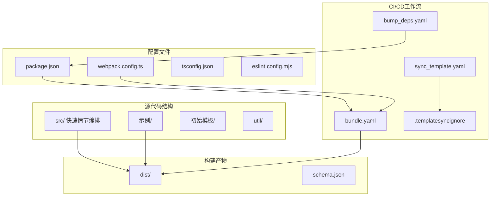
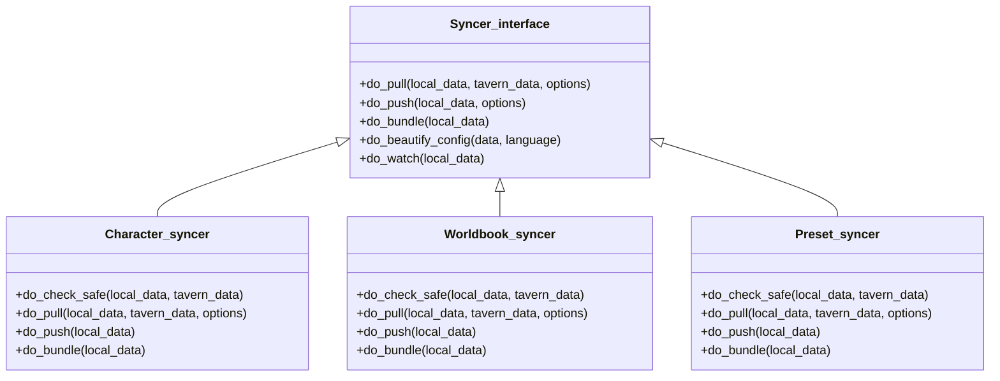
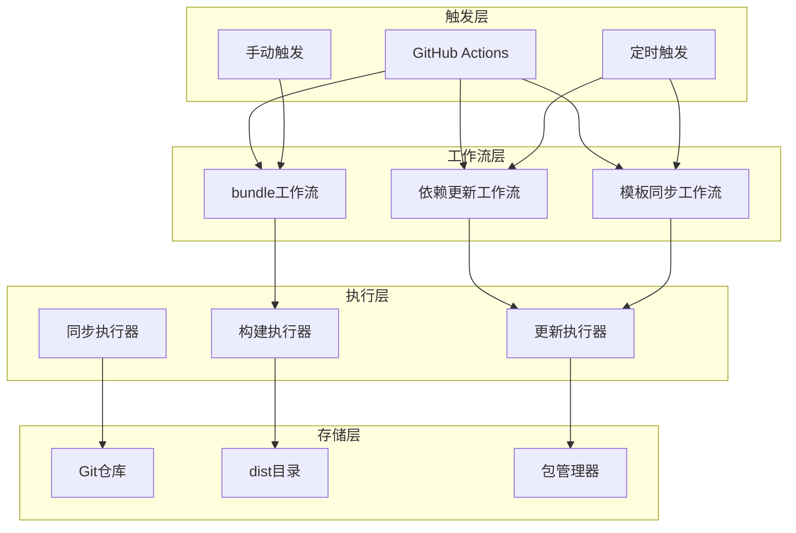
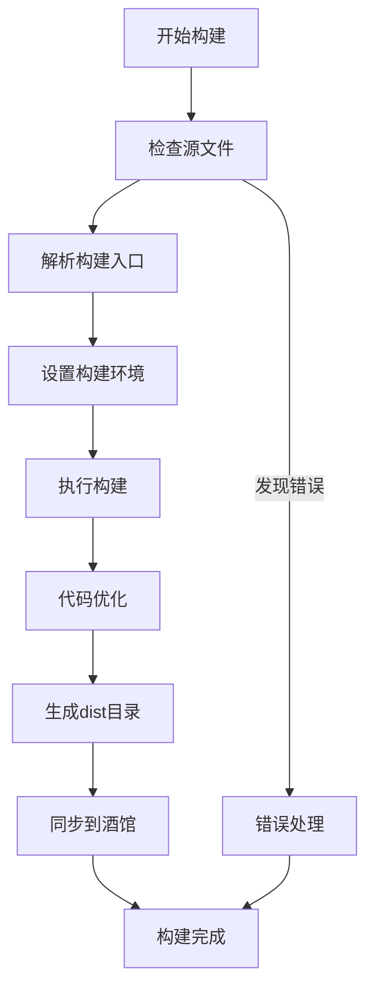
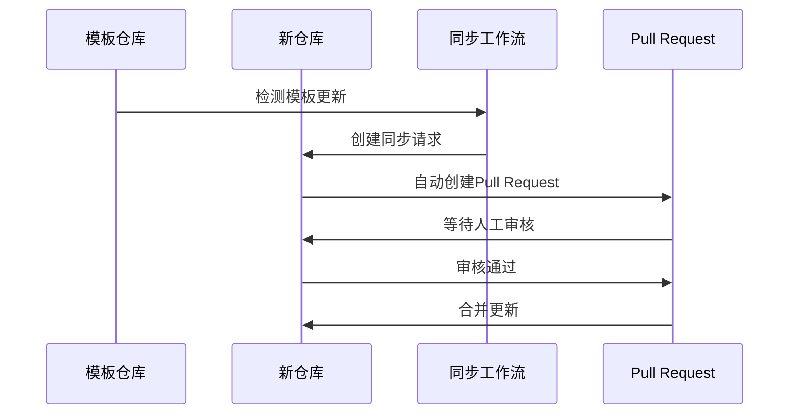
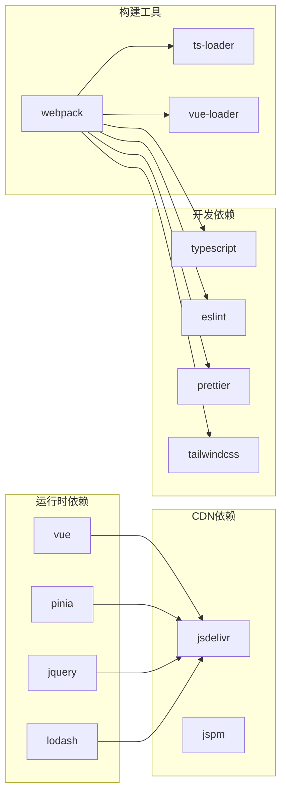

# CI/CD工作流

<cite>
**本文档引用的文件**
- [README.md](file://README.md)
- [package.json](file://package.json)
- [webpack.config.ts](file://webpack.config.ts)
- [tavern_sync.mjs](file://tavern_sync.mjs)
- [.github/.templatesyncignore](file://.github/.templatesyncignore)
</cite>

## 目录
1. [简介](#简介)
2. [项目结构](#项目结构)
3. [核心组件](#核心组件)
4. [架构概览](#架构概览)
5. [详细组件分析](#详细组件分析)
6. [依赖分析](#依赖分析)
7. [性能考虑](#性能考虑)
8. [故障排除指南](#故障排除指南)
9. [结论](#结论)

## 简介

本项目是一个基于GitHub Actions的CI/CD自动化部署系统，专门用于自动化构建、打包和部署酒馆助手模板项目。该系统提供了完整的自动化工作流程，包括版本管理、依赖更新、模板同步等功能。

根据项目文档，系统包含三个主要的CI/CD工作流：

1. **bundle.yaml** - 自动打包src文件夹中的代码到dist文件夹中
2. **bump_deps.yaml** - 自动更新第三方库依赖和酒馆助手@types文件夹
3. **sync_template.yaml** - 同步模板仓库的更新到新创建的仓库

## 项目结构

项目采用模块化设计，主要包含以下关键组件：

**图表来源**
- [README.md:73-89](file://README.md#L73-L89)
- [package.json:1-120](file://package.json#L1-L120)
- [webpack.config.ts:1-572](file://webpack.config.ts#L1-L572)

**章节来源**
- [README.md:1-105](file://README.md#L1-L105)
- [package.json:1-120](file://package.json#L1-L120)

## 核心组件

### 构建系统组件

系统的核心构建功能由webpack配置驱动，支持多种构建模式和优化策略：

#### 构建配置分析
- **多入口支持**: 支持示例和src目录下的多个入口点
- **条件构建**: 通过@no-ci标记控制CI环境下的构建行为
- **智能去重**: 自动检测和去重重复的构建入口
- **动态入口解析**: 根据index.ts文件自动解析HTML模板

#### 优化特性
- **生产模式优化**: 启用代码压缩和混淆
- **开发模式优化**: 提供源码映射和热重载
- **按需加载**: 支持异步chunk加载
- **外部依赖处理**: 智能处理CDN和全局依赖

**章节来源**
- [webpack.config.ts:51-75](file://webpack.config.ts#L51-L75)
- [webpack.config.ts:185-572](file://webpack.config.ts#L185-L572)

### 同步系统组件

tavern_sync.mjs提供了完整的角色卡、世界书和预设的同步功能：

#### 同步器架构

**图表来源**
- [tavern_sync.mjs:68215-68520](file://tavern_sync.mjs#L68215-L68520)

#### 命令行接口
系统提供完整的命令行工具，支持以下操作：
- **bundle**: 将本地内容打包到导出文件路径
- **pull**: 将酒馆内容拉取到本地
- **push**: 将本地内容推送到酒馆
- **watch**: 监听本地内容变化并实时推送
- **list**: 列出所有可用配置
- **update**: 检查并更新同步脚本

**章节来源**
- [tavern_sync.mjs:68653-68792](file://tavern_sync.mjs#L68653-L68792)

## 架构概览

系统采用分层架构设计，各组件协同工作实现完整的CI/CD流程：

**图表来源**
- [README.md:75-89](file://README.md#L75-L89)

## 详细组件分析

### Bundle工作流分析

#### 触发条件
Bundle工作流通过以下方式触发：
- **推送事件**: 对src和示例目录的代码推送
- **手动触发**: 在GitHub Actions页面手动运行
- **定时触发**: 周期性检查和构建

#### 构建步骤流程

**图表来源**
- [webpack.config.ts:132-183](file://webpack.config.ts#L132-L183)

#### 版本管理机制
系统实现了智能的版本管理：
- **自动版本递增**: 每次构建自动递增版本号
- **缓存优化**: 利用jsdelivr的版本控制实现快速缓存更新
- **冲突解决**: 通过.gitattributes配置解决dist目录的合并冲突

**章节来源**
- [README.md:75-78](file://README.md#L75-L78)

### 依赖更新工作流

#### 更新策略
依赖更新工作流采用渐进式更新策略：
- **定期检查**: 每三天检查一次依赖更新
- **安全更新**: 优先更新安全相关的依赖
- **兼容性测试**: 在更新前进行兼容性验证

#### 更新范围
- **第三方库**: 自动更新npm包依赖
- **@types文件**: 更新TypeScript类型定义
- **开发工具**: 更新构建和开发工具链

**章节来源**
- [README.md:80-82](file://README.md#L80-L82)

### 模板同步工作流

#### 同步机制
模板同步工作流确保新创建的仓库能够保持与模板仓库的同步：

**图表来源**
- [README.md:84-88](file://README.md#L84-L88)

#### 忽略机制
通过.templatesyncignore文件实现智能忽略：
- **自定义文件**: 可以忽略不需要同步的文件
- **模板文件**: 保留仓库特有的配置文件
- **敏感文件**: 避免同步敏感的配置信息

**章节来源**
- [README.md:88](file://README.md#L88)
- [.github/.templatesyncignore](file://.github/.templatesyncignore)

## 依赖分析

### 外部依赖关系

**图表来源**
- [package.json:15-107](file://package.json#L15-L107)

### 内部组件依赖

系统内部组件之间存在清晰的依赖层次：

1. **webpack.config.ts** 作为核心构建配置
2. **tavern_sync.mjs** 提供同步功能
3. **package.json** 管理依赖和脚本
4. **README.md** 提供使用说明

**章节来源**
- [package.json:1-120](file://package.json#L1-L120)

## 性能考虑

### 构建性能优化

系统采用了多项性能优化措施：

#### 代码分割
- **按需加载**: 支持异步chunk加载减少初始包大小
- **缓存策略**: 利用contenthash实现长效缓存
- **Tree Shaking**: 自动移除未使用的代码

#### 编译优化
- **生产模式**: 启用代码压缩和混淆
- **开发模式**: 提供快速编译和热重载
- **并行构建**: 支持多进程并行编译

### 同步性能优化

tavern_sync.mjs实现了高效的文件同步机制：

#### 智能比较
- **差异检测**: 只同步发生变化的文件
- **增量更新**: 支持增量同步减少传输量
- **冲突解决**: 自动处理同步冲突

## 故障排除指南

### 常见问题及解决方案

#### 构建失败
**问题**: 构建过程中出现语法错误
**解决方案**: 
1. 检查TypeScript配置文件
2. 验证依赖安装完整性
3. 清理node_modules并重新安装

#### 同步冲突
**问题**: tavern_sync.mjs报错显示文件冲突
**解决方案**:
1. 检查.gitattributes配置
2. 确认dist目录的合并策略
3. 手动解决特定文件的冲突

#### 权限问题
**问题**: GitHub Actions工作流权限不足
**解决方案**:
1. 在仓库设置中启用Actions权限
2. 配置适当的令牌权限
3. 检查工作流的权限声明

**章节来源**
- [README.md:20](file://README.md#L20)
- [README.md:96-100](file://README.md#L96-L100)

### 调试方法

#### 构建调试
- 使用`pnpm build:dev`进行开发模式构建
- 启用详细日志输出
- 检查webpack配置的错误信息

#### 同步调试
- 使用`tavern_sync.mjs --help`查看帮助
- 使用`--verbose`选项获取详细输出
- 检查配置文件的正确性

## 结论

本CI/CD工作流系统为酒馆助手模板项目提供了完整的自动化解决方案。通过bundle、依赖更新和模板同步三个核心工作流，系统实现了：

1. **自动化构建**: 通过webpack实现智能的代码构建和优化
2. **版本管理**: 自动递增版本号确保缓存更新
3. **依赖维护**: 定期更新第三方库和类型定义
4. **模板同步**: 保持新仓库与模板仓库的同步

系统的设计充分考虑了性能、可靠性和易用性，为开发者提供了高效、稳定的开发体验。通过合理的配置和权限设置，开发者可以专注于业务逻辑的实现，而不必担心基础设施的维护。